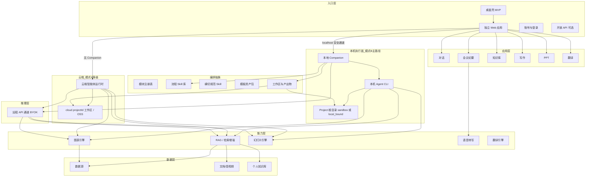
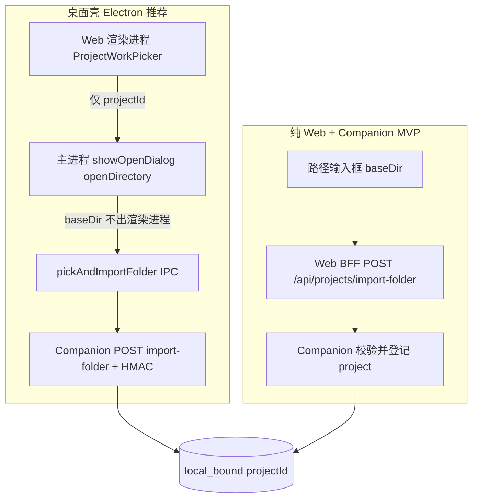
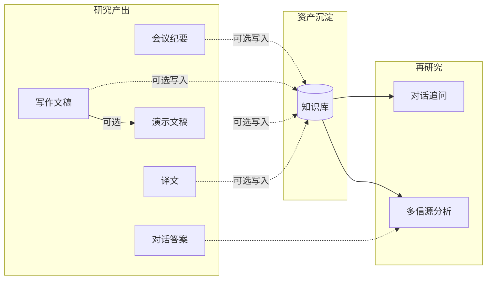
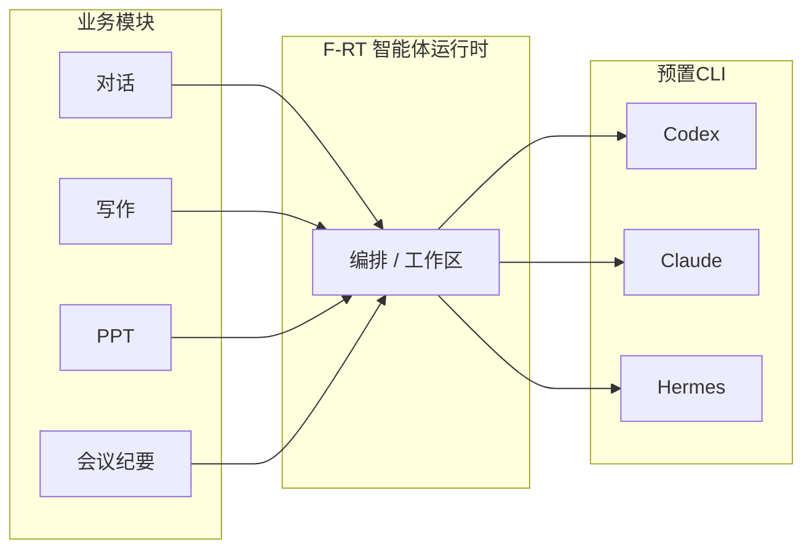
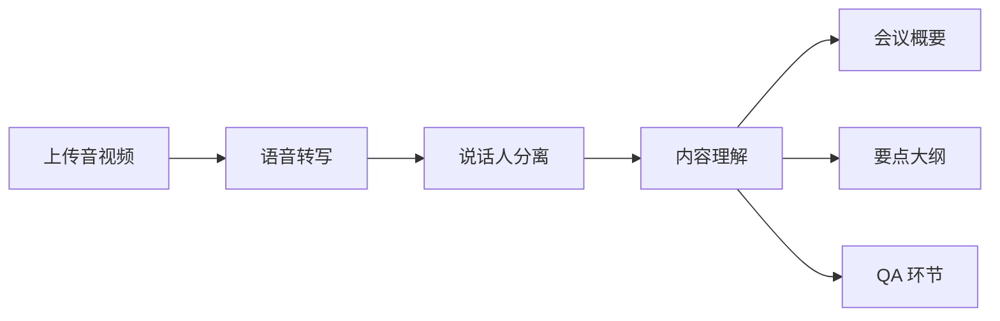
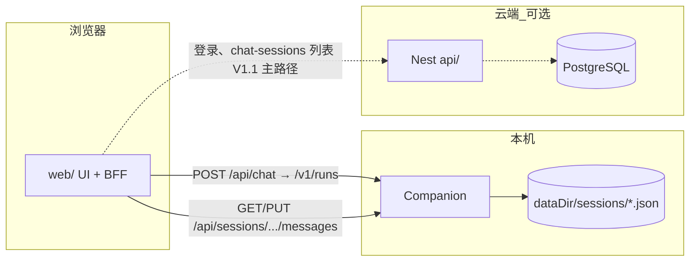

# 小窗 — 产品需求文档（PRD）

| 属性 | 内容 |
|------|------|
| 文档版本 | v3.6.7 |
| 创建日期 | 2026-05-19 |
| 修订日期 | 2026-05-27 |
| 产品名称 | **小窗** |
| 产品定位 | **未来办公场景（works）** 的智能工作台 |
| 对标关系 | Cursor / Codex → **coding**；小窗 → **works**（查资料、写资料、记会议、知识沉淀、演示与翻译等） |
| 文档状态 | 草案（已与 `web/` 原型对齐核查） |
| 依据文档 | [需求整理.md](./需求整理.md)、[功能清单.md](./功能清单.md)、[技术方案.md](./技术方案.md)、[api/README.md](./api/README.md)、[skills/README.md](./skills/README.md)、[web/docs/mvp-closure-checklist.md](./web/docs/mvp-closure-checklist.md)、[web/docs/chat-core-architecture.md](./web/docs/chat-core-architecture.md)、[web/docs/chat-skill-orchestration-analysis.md](./web/docs/chat-skill-orchestration-analysis.md)、[web/docs/agent-loop-strategy-analysis.md](./web/docs/agent-loop-strategy-analysis.md)、[web/docs/companion-api.md](./web/docs/companion-api.md)、[web/docs/folder-import-and-desktop-shell.md](./web/docs/folder-import-and-desktop-shell.md)、[web/docs/desktop-shell.md](./web/docs/desktop-shell.md)、[web/docs/chat-execution-roadmap.md](./web/docs/chat-execution-roadmap.md)、[web/docs/chat-message-parts.md](./web/docs/chat-message-parts.md)、[web/docs/meeting-module-prd.md](./web/docs/meeting-module-prd.md)（会议纪要模块子 PRD）；本地项目绑定对齐 [Open Design 文件夹导入](参考项目/open-design/docs/architecture.md)（§5.3.2.2）；超长会话 Handoff 对齐 [Open Design handoff-design](参考项目/open-design/apps/daemon/src/handoff-design.ts) |
| 原型工程 | `web/`（Next.js 独立 Web） |
| 技术方案 | [技术方案.md](./技术方案.md)（前后端语言、框架、运行时与存储选型） |

---

## 目录

1. [文档说明](#1-文档说明)
2. [产品概述](#2-产品概述)
3. [目标用户与场景](#3-目标用户与场景)
4. [信息架构与菜单](#4-信息架构与菜单)（含 [4.4 全局设置信息架构](#44-全局设置信息架构)）
5. [产品架构](#5-产品架构)（含 [5.3 智能体运行时](#53-智能体运行时架构)）
6. [功能需求详述](#6-功能需求详述)（含 [6.0 模块闭环总则](#60-模块闭环总则)、§6.0.3 项目与会话横切、[6.10 平台智能体与工作区](#610-平台智能体与工作区横切)、[6.11 全局设置](#611-全局设置横切)、[6.12 账号与登录](#612-账号与登录横切)）
7. [非功能需求](#7-非功能需求)（含 [7.6 智能体与安全](#76-智能体与安全)）
8. [数据与集成](#8-数据与集成)（含 [8.3 模型与 Agent 接入](#83-模型与-agent-接入)、[8.4 身份认证](#84-身份认证)、[8.6 会话与消息数据分工](#86-会话项目与消息的数据分工mvp)）
9. [交互与体验规范](#9-交互与体验规范)（含 [9.4 全局设置交互](#94-全局设置交互)、[9.5 登录与鉴权交互](#95-登录与鉴权交互)）
10. [版本规划](#10-版本规划)
11. [风险与待澄清项](#11-风险与待澄清项)
12. [附录](#12-附录)（含 [12.5 原型实现对照](#125-原型实现对照web)）
13. [原型与 PRD 差异登记](#13-原型与-prd-差异登记)

---

## 1. 文档说明

### 1.1 编写目的

本文档在《需求整理》基础上，将小窗各模块能力展开为可评审、可开发、可验收的产品需求，供产品、设计、研发、测试及业务方对齐使用。

### 1.2 范围

> **2026-06-06 产品决策：V1.1 聚焦"桌面端能力 + 本机 Agent CLI"**，Web 浏览器版与 Nest 多用户后台**整体推到 V2.0**。产品形态是"本机单用户 + Companion + agent CLI"——Nest/Postgres 在 V1.1 没有实际承载需求；Web 浏览器版作为"无桌面壳降级"路径继续保留但不再投入新功能。

产品按**能力模块**组织（详见 [功能清单.md](./功能清单.md)）。**MVP（v3.0）** 聚焦**对话模块深度能力 + 桌面壳包装 + 智能体执行横切**，其中**多 CLI / 多模型适配**是平台首要核心能力；其余一级模块保留导航与占位，业务闭环在 **V1.1** 起交付。

| 一级模块 | 产品线 | MVP（v3.0） | V1.1（桌面端 + 对话延展） | V2.0（云端 + 企业部署） |
|----------|--------|-------------|---------------------|----------------------|
| **对话** | works | **全文验收**（§6.1、F-QA-001/007/008/009；F-QA-010 P1；F-QA-002～005 延后） | 数据源、图表、多信源、可溯源（F-QA-002~005） | — |
| **桌面壳** | 交付形态 | **Electron 最小集**（§5.3.7）：加载同一 `web/` UI + 系统选目录 `pickAndImportFolder` | **HMAC + 托盘 + Companion 捆绑 + 自动更新 + 系统通知** | — |
| 会议纪要 | works | 占位页，不验收 | **V1.1+ 推迟**（ASR/说话人/摘要技术成本高） | — |
| 知识库 | works | 占位页，不验收 | **V1.1+ 推迟**（PDF/Word 解析 + RAG + 配额） | 企业共享 |
| 写作 | works | 占位/骨架，不验收 | **收口**（v2 设计已落地，polish + skill-wr-* 完整化） | — |
| PPT | works | 占位/骨架，不验收 | **收口**（v2 设计已落地，polish） | — |
| 翻译 | works | 占位页，不验收 | **从 0 起**（导航 + UI + `skill-tr-*` + BYOK 后端） | — |
| 账号与登录 | 横切 | §6.12 MVP（本机 cookie + 写死 OTP） | 保持 MVP 形态（本机单用户） | **Nest 多用户 + Postgres + 跨设备会话** |
| 全局设置 | 横切 | §6.11 MVP 子集 | §6.11.2～6.11.5 + BYOK 管理增强 | 管理员功能与审计 |
| 智能体运行时 | 横切 | §6.10（对话所需：F-RT-001～005、007/007b/007c、008；**009 基线**；**多 CLI / 多模型适配为 MVP 核心验收项**） | **F-RT-006 真 PTY**、**F-RT-002 BYOK 增强**、**F-RT-009-B LLM Handoff** | 模式 A 完整、产出同步云端、模式 B/A 互通 |

### 1.3 术语定义

| 术语 | 定义 |
|------|------|
| works | 小窗所覆盖的办公知识劳动场景（查、写、记、汇、译、讲），承载对话、写作等智能研究能力 |
| 写作 | 基于模板与大纲生成行业研究类文稿的能力模块（原「报告生成」能力收敛） |
| PPT | 将研究结论与文稿结构转化为可汇报的演示文稿，支持 PPTX 导出 |
| 数据源 | 企业或第三方接入的行情、基本面、资讯、公告、研报等结构化/半结构化数据 |
| 信源 | 资讯、公告、研报、数据等可被引用与比对的原始信息来源 |
| 变频 | 将数据频率转换（如日频转周频、月频） |
| 环比 | 相邻周期数值变化率计算 |
| 多信源分析 | 对多个信源分别总结并做异同对比与推荐 |
| 可溯源 | 回答/结论可回溯至具体信源片段或数据单元 |
| 智能体运行时 | 编排层：模块注册表解析、注入流程 Skill + 横切规范 Skill、拉起子进程、解析流式输出、管理工作区；在**模式 B** 由本机 Companion 执行，在**模式 A** 由云端运行时执行 |
| 本地 Companion | 用户本机常驻服务（daemon）：供浏览器/桌面壳连接，负责打开本地项目、探测 CLI、`spawn` 子进程、读写本地工作区、向 Web 推送 SSE；**浏览器不直接访问用户磁盘** |
| 桌面壳 | **MVP 推荐交付形态**：Electron 包装同一 `web/` UI（§5.3.7）；主进程提供**受信选目录**（`pickAndImportFolder`）；Companion 仍为独立进程；托盘/自动更新/HMAC 为 V1.1 |
| 文件夹导入（Folder Import） | 将用户本机已有目录绑定为 `local_bound` 的 `projectId`：**不复制**文件到沙箱，Agent 直接在 `baseDir` 读写（对齐 Open Design `POST /api/import/folder` 语义，§5.3.2.2） |
| 受信选目录（Trusted Picker） | **仅桌面壳主进程**或 Companion 原生对话框取得 `baseDir` 绝对路径；**禁止**浏览器渲染进程凭 `showDirectoryPicker` 等方式冒充已授权路径（§5.3.2.2） |
| 研究项目（Project） | 逻辑工作区实体，**始终**有 `projectId`；由 `workspaceKind` 区分根目录类型（§5.3.2.1） |
| `workspaceKind` | 项目工作区类型：`sandbox`（沙箱）、`local_bound`（本地绑定文件夹）、`cloud`（模式 A 云端，§5.3.2.1） |
| `bindingSource` | 仅 `local_bound`：`user_picked`（用户选目录/手填路径）\| `platform_default`（XIAOCHUANG 自动建目录，§5.3.2.2） |
| 本地绑定项目 | `workspaceKind = local_bound` + `bindingSource`；Agent 在 `baseDir` 读写；**用户绑定**须显式选路径，**平台默认**走预授权模板、**无需每次任务再授权** |
| 对话会话（Session） | 对话/写作/PPT/纪要等**业务线程**（`sessionId`）；**创建时固定绑定**一个 `projectId`，**不可变更**；切换项目须**新建对话会话**（§5.3.2.1）。**勿与**登录态（Cookie/JWT，§6.12）混淆 |
| 对话回合（Turn） | 会话内**一轮**「用户提问 + Agent 回复」；多 Turn 纵向排列；**滚动吸顶**仅作用于**当前视口对应**那一 Turn 的用户问题（§6.1 F-QA-009） |
| 会话状态指示（侧栏） | 每条对话会话在侧栏历史列表左侧的状态点/动画，表示**执行态**与**是否已读**（§6.1 F-QA-008）；与单条 assistant 消息的 `parts` 状态无关 |
| 可行动文件引用 | 对话区内指向当前 `projectId` 的文件路径/附件可点击，在右侧工作区打开并定位行号（§6.1 F-QA-010） |
| `runStatus` | 会话级 Agent 执行态：`idle`（空闲/已结束）、`running`（执行中）、`waiting_user`（执行暂停，待用户填表或确认） |
| `lastReadAt` | 用户上次打开该会话并看到**最新一轮结果**的时间戳；与 `updatedAt` 比较推导「未读」 |
| 登录态 | 用户认证后的 Web 会话（HttpOnly Cookie 等）；过期须重新登录；**不**承载 `projectId` |
| 云端项目 | `workspaceKind = cloud`：模式 A 或无 Companion 时由平台创建 `projectId`，工作区映射 OSS（§5.3.2.1） |
| 模式 B（本地协作，主路径） | 浏览器或桌面壳 → 本机 Companion → 本机 CLI → 项目根目录（沙箱或 `baseDir`）；产出落在对应磁盘路径 |
| 模式 A（云端降级） | 无 Companion 或企业策略强制时：Web → 云端运行时；`workspaceKind = cloud`，工作区落对象存储 |
| Agent CLI | 命令行智能体；**MVP 以多 CLI / 多模型适配为核心能力**，模式 B 下由 Companion 按平台登记的适配集在本机探测/启动；企业自定义扩展 CLI 仍须策略登记（§5.3.3） |
| BYOK | Bring Your Own Key：用户或企业配置远程大模型 API（经平台代理 SSE），作为 CLI 不可用时的降级通道 |
| 工作区 | 某个 `projectId` 解析出的隔离目录（整项目范围为 Agent `cwd`）；非「每条消息一个子目录」 |
| 产品模块 | 一级菜单对应的能力域：路由、页内 IA、领域服务编排与（可选）Agent 主路径；**不等于**单个 Skill |
| 领域服务 | 模块内确定性能力：ASR、RAG/检索、翻译 API、数据源连接器、图表/幻灯片引擎、登录鉴权等；由后端/Companion 实现，**不**写入 Skill |
| 流程 Skill | 绑定在**模式 / 模板 / 任务类型**上的 Agent 工作流（`skills/<slug>/SKILL.md` + `references/`）；如 `skill-qa-fast`、`skill-wr-policy` |
| 页内问答模式 | 对话输入区用户可选档位（v3.2：**快速** / **深度**）；`binding.mode` 映射流程 Skill；深度档内推理深度 vs 完整研究由 Agent 在 `skill-qa-deep` 内决策，非第三 UI 选项 |
| 平台 Prompt | 与 Skill 分离的**系统层**外挂 Markdown（`prompts/platform/`）：平台身份、问答模式说明、通用工作流；每次 Run 前读取注入 **system**，非写死在 Web/Companion 代码 |
| Agent Kit | 本机集中目录 `~/.jlcresearch/agent-kit/runs/<runId>/`：每次 Run 从 `skills/` **同步**当前流程 Skill 的 `references/` 等附属文件；**不**复制到用户 `projectId` 工作区；供 CLI `--add-dir` 只读访问 |
| System Prompt | 单次 Run 前由 `composeSystemPrompt` 组装的系统指令栈（平台 Prompt + 横切 Skill + 流程 Skill 正文 + Agent Kit 路径说明等） |
| User Turn | 本轮用户输入（及后续 `@` 附件等），由 `userTurn` 生成；与 System Prompt **分通道**传给 CLI |
| 模板资产包 | 与流程 Skill 分离的版式/大纲/Deck 等静态资产（`assets/template.*`、幻灯片母版等）；运行时由流程 Skill 引用，类比 Open Design 的 design-templates |
| 横切规范 Skill | 全平台叠加的研究规范（信源引用、免责声明、图表标注等）；每次 Agent 任务在场景 Skill 之外**额外**注入 |
| 场景 Skill | 流程 Skill 的统称（历史用语）；新文档优先写「流程 Skill」 |
| 模块注册表 | 平台维护的模块元数据：一级 `moduleId`、二级入口、依赖领域服务、默认 Agent、模式/模板 → 流程 Skill 映射、可选模板资产包 ID |
| 产出物（Artifact） | 可打开、导出、入库的明确结果文件（如 HTML 摘要、文稿 MD、幻灯片源文件等） |
| 全局设置 | 侧栏底部用户区触发的设置体系：弹出菜单导航 + 设置面板（抽屉/模态），承载智能体、偏好与账号信息等横切配置 |
| 本平台账号 | 用户在**小窗平台**注册/登录后形成的账号，MVP 以手机号为主标识；**不与** 外部业务系统账号体系打通 |
| 登录即注册 | 无单独「注册」入口；首次手机号验证通过即自动创建本平台账号并登录 |
| UI「不绑定课题文件夹」 | 「进入项目工作」中**新建**时的选项（原「不使用项目」）；表示不走用户课题目录、由平台在 XIAOCHUANG 自动建任务目录；**会话创建后** UI 仍展示该目录为当前工作区（§5.3.2.1b、§12.5.3） |
| Hermes CLI | 三款默认 Agent 之一（`agentId=hermes`）；模式 B 下由 Companion **spawn 本机 `hermes` 可执行文件**，与 Codex/Claude 同级 |
| Hermes Gateway（仅原型） | 开发期临时通道：`hermes gateway` 的 OpenAI 兼容 API（`:8642`）；当前 `web` 对话 BFF **统一经此转发**，**不代表**量产架构；量产对话应走 Companion → 所选 CLI |

### 1.4 原型实现范围说明（v3.0 MVP 对齐）

当前 **monorepo**（`web/`、`companion/`、`apps/desktop/`、`api/`、`packages/*`）以 **对话内容体验** 为 MVP 验收中心；六模块导航保留，**仅对话 + 桌面壳** 为量产路径。下表为 **2026-05-23** 核查结论（详 §12.5、§12.5.9）：

| 能力域 | 原型状态 | MVP 验收 | PRD 章节 |
|--------|----------|----------|----------|
| 登录 / 鉴权 / 退出 | ✅ Cookie + 开发验证码；Nest `api/` 可对接 | ✅ | §6.12、§8.6 |
| **桌面壳** | ✅ Electron + IPC + 内嵌 Web 打包路径 | ✅ 最小集（联调 ⬜） | §5.3.7、§12.5.8 |
| 对话（模式、Agent、SSE、@、项目、**消息分块**、Turn） | ✅ UI + Companion 真流（默认 `CHAT_EXECUTION=companion`） | ✅ | §6.1、F-QA-007/008/009 |
| Companion / 真实 CLI spawn | ✅ `COMPANION_RUN_MODE=cli` + `composeRunPrompts` | ✅ Codex 优先 | §5.3、§12.5.6 |
| Prompt / Agent Kit / 混合编排 | ✅ `runtime-core` + `prompts/platform`（S1P/S1O） | ✅ 代码；冒烟 `pnpm mvp:verify` | F-RT-003/008、§12.5.7 |
| 会话消息持久化 | ✅ Companion `sessions` API；Web 可回退 localStorage | 🔶 MVP 本机为主 | §8.6、§12.5.9 |
| 超长会话压缩（F-RT-009-A） | ✅ Companion Run 路径已接入 | 🔶 人工验收见 checklist | F-RT-009-A、§12.5.9 |
| 工作区（文件树、预览） | 🔶 真树 + 部分 Mock | 🔶 P1（含 F-QA-010） | F-RT-004/006 |
| 全局设置 | ✅ MVP + V1.1 预览项 | ✅ 子集 | §6.11 |
| 六模块导航 | ✅ 路由齐全 | 对话验收；**其它仅占位** | §4.2 |
| 会议纪要 / 知识库 / 翻译 / 写作 / PPT | ⬜ 占位或骨架 | ❌ 不验收 | V1.1 |
| 数据源 / 图表 / 多信源 / 溯源 | ⬜ 未接入 | ❌ 不验收 | F-QA-002～005 → V1.1 |
| Nest 业务 API（项目/会话索引） | 🔶 `api/` 已初始化，Web BFF 部分代理 | ❌ MVP 演示不强制 | §8.6、§10.2 |
| 模式 A 云端完整工作区 | ⬜ | ❌ MVP 不强制 | §10.2 |

---

## 2. 产品概述

### 2.1 背景

知识工作者在办公中反复进行 **works**：检索与核对资料、撰写与改稿、整理会议与纪要、沉淀个人与团队知识、制作汇报材料、处理外文材料等。这些工作分散在浏览器、本地文件夹、会议录音、邮件附件与各类**数据源**之间，切换成本高，且 AI 辅助往往不可观测、难以落在真实文件产出上。

**小窗**以 AI 智能体为中枢，将**对话、会议纪要、知识库、写作、PPT、翻译**整合为统一办公入口。平台**不绑定**任何行业「终端」或固定客户端；企业通过可配置的 **数据源 API** 接入内外部数据与文档，小窗负责编排、工作区与可溯源产出。

### 2.2 产品定位

| 维度 | 说明 |
|------|------|
| **名称** | **小窗** — 未来办公场景下的智能工作台 |
| **对标** | 如同 **Cursor / Codex** 面向 **coding**（写代码、改仓库、跑工具），**小窗**面向 **works**（查、写、记、汇、译、讲） |
| **形态** | 独立 **Web** + 推荐 **Electron 桌面壳**（同一套 UI）；本机 **Companion** 执行 Agent；用户以**项目文件夹**为工作区 |
| **数据** | **数据源**（可插拔 API / 文件 / 知识库索引），**无**「金联创终端」「终端数据」等产品概念 |
| **账号** | 小窗自持账号（手机号等）；**不**与外部业务系统 SSO 打通（除非单独立项） |

**MVP（v3.0）** 聚焦 **对话区内容体验** + **桌面壳选目录** + Companion 真 CLI 流（`parts[]`），并以**适配更多 CLI 与模型**作为平台首要核心能力。会议纪要、知识库、写作、PPT、翻译 在导航中保留，**V1.1** 起按模块验收。纯浏览器 + 手填路径为降级；模式 A（云端工作区）为 V1.1 兼容项。

### 2.3 产品目标

| 目标维度 | 描述 | 可量化指标（建议） |
|----------|------|-------------------|
| 效率 | 缩短数据查询、图表制作、写作与翻译时间 | 常见查询响应 &lt; 5s（快速模式）；文稿初稿生成时间较人工缩短 50%+ |
| 质量 | 多信源交叉验证，降低单一信源偏差 | 回答附带信源引用率 ≥ 90%（深度/研究模式） |
| 可信 | 结论可溯源至原始数据与文档 | 支持点击溯源的比例 100%（已引用内容） |
| 协同 | 个人知识库与团队研究资产沉淀 | 知识库文档可被问答引用 |

### 2.4 成功标准（MVP v3.0 — 对话 + 桌面壳）

**交付形态：** 研究员安装 **桌面应用**（或开发态 `pnpm desktop:dev`）→ 打开与浏览器相同的对话 UI → 本机 **Companion** 已连接 → 可在**多款已适配 CLI**之间切换并选择对应模型档位；平台登记适配集是 MVP 的核心验收对象。

**账号与壳层**

- [ ] 未登录访问 `/chat` 跳转 `/login`；手机号 + 验证码登录即注册（§6.12）
- [ ] 桌面壳启动后加载 `web/` 对话页；与浏览器共用同一构建产物，**无业务代码分叉**
- [ ] 「添加新项目」在桌面壳内走 **系统文件夹对话框** → 返回 `projectId` + `pathSummary`；渲染进程**不**暴露完整 `baseDir`（§5.3.2.2、§5.3.7）

**对话内容（核心）**

- [ ] 新建对话 → 发送问题 → **Companion → 所选 CLI** 真流式回复（禁止长期依赖 Hermes Gateway 作为唯一后端，§12.5.6）
- [ ] 顶栏/设置可展示并切换**多款已适配 CLI**及其模型档位；已纳入平台适配集的 CLI 不再按“主/扩展”分层验收
- [ ] Assistant 以 **`parts[]` 时间序**展示：至少 1 条过程块（工具/阶段）+ 正文 `summary/text`（F-QA-007）
- [ ] 支持 **快速 / 深度** 两档页内模式切换；深度档由 `skill-qa-deep` 按问题复杂度自行选择推理深度或完整研究流程（F-QA-001、F-RT-003）
- [ ] 对话 Run 采用 **混合编排（方向引导）**：仅 Push 基座 Skill + Catalog 摘要；扩展 Skill 与工具由 Agent 按需选用（F-RT-008）
- [ ] 同会话 **≥3 轮** Q&A；支持停止生成并保留已输出内容（F-QA-007）
- [ ] 侧栏会话 **状态点**（执行中 / 未读 / 待确认 / 已读）（F-QA-008）
- [ ] **Turn 吸顶**：滚动时当前视口对应用户问题 sticky（F-QA-009）
- [ ] 顶栏/设置展示 **Companion + 当前 `agentId` CLI** 状态（非仅 Gateway 健康检查），并可查看平台适配集内各 CLI 的可用性

**项目与工作区（对话所需最小集）**

- [ ] 始终有 `projectId`：未选文件夹 → **§5.3.2.1a** 平台默认工作区；桌面选目录 → 用户 `local_bound` + **新建会话**（§5.3.2.1、F-RT-007）
- [ ] Agent 产出可落于 `projectId` 根目录；工作区可列真文件树（F-RT-004）；对话内点击文件打开工作区为 **P1**（F-QA-010）

**全局设置（MVP 子集）**

- [ ] 用户区 → 智能体与模型：默认 Agent、CLI 状态、Companion 连接（F-SET-001）；账号只读、关于与帮助（F-SET-006/007）

**明确不在 MVP 验收范围**

- 会议纪要、知识库、写作、PPT、翻译 业务闭环；F-QA-002～005（数据源图表/多信源/溯源）；模式 A 云端完整工作区；**BYOK 管理端 + F-RT-009 LLM Handoff**；微信登录；Electron HMAC/托盘/自动更新（标 V1.1，见 §10.2）

---

## 3. 目标用户与场景

### 3.1 用户画像

| 角色 | 描述 | 核心诉求（works） |
|------|------|-------------------|
| 研究员 / 分析师 | 日常查数、写报告、做多信源对比 | 对话（含深度分析）、写作、图表 |
| 产品经理 / 战略 | 读材料、写方案、跟进度 | 知识库、写作、对话追问 |
| 项目经理 / 助理 | 会议多、纪要杂 | 会议纪要、知识库 |
| 汇报岗 | 对内对外演示 | PPT、写作、从文稿生成 |

### 3.2 典型场景

**场景 A：快速查资料（对话 · 快速）**  
用户问「Q3 华东区域销量同比变化」，选择**快速模式**，系统从已接入**数据源**取数并简要解读，可附带表格/图表，一键复制到汇报材料。（行业示例可替换，机制不变。）

**场景 B：深度分析（对话 · 深度）**  
用户对复杂主题提问，选择**深度模式**后，由 Agent 在 `skill-qa-deep` 约束下自行判断：轻量问题走分步推理与结论；复杂/多信源主题走完整研究流程（检索 → 分析 → 成文），展示思考过程与研究结构，汇总文档/公告/研报类信源，输出异同与引用建议，复杂任务可落工作区报告并导出摘要。（V1.1 强化图表与溯源 UI。）

**场景 C：写一份长文稿（写作）**  
用户选择模板，多步骤确认大纲后生成正文，产出落在项目文件夹，可再进入知识库。（V1.1 验收。）

**场景 D：做汇报 PPT（PPT）**  
从成稿或主题生成幻灯片大纲，确认后导出 PPTX。（V1.1 验收。）

**场景 E：翻译外文材料（翻译）**  
文档或段落中英互译，对照阅读，可选入库。（V1.1 验收。）

**场景 F：会议纪要（会议纪要）**  
上传会议录音，转写并生成概要、大纲与 QA，可选写入知识库。（V1.1 验收。）

---

## 4. 信息架构与菜单

### 4.1 设计原则

- **一级菜单 = 用户可独立进入的能力**，如对话、会议纪要、写作等。
- 不再使用「AI 研究员」「AI 行研助理」等包装型产品名；原属其下的能力均提升为一级模块。
- 图表、多信源、溯源等作为**模块内能力**或对话答案内的组件，不单独占一级菜单（除非后续产品明确要求）。

完整菜单树见 **[功能清单.md](./功能清单.md)**。

### 4.2 一级 / 二级菜单

| 一级菜单 | 二级菜单 |
|----------|----------|
| **对话** | 新对话、历史会话；（页内）快速、深度 |
| **会议纪要** | 新建纪要、纪要历史 |
| **知识库** | 我的文档、知识库问答、多信源分析 |
| **写作** | 写作（对话式生成 + 对话内切换 Skill；v2 决策 2026-05-31，详 [writing-module-prd.v2](./web/docs/writing-module-prd.v2.md)） |
| **PPT** | PPT（对话式生成 + 对话内切换 Skill；v2 决策 2026-05-31，详 [ppt-module-prd.v2](./web/docs/ppt-module-prd.v2.md)） |
| **翻译** | 翻译（对话式翻译 + 对话内切换 Skill；v2 决策 2026-06-06，详 [translate-module-prd](./web/docs/translate-module-prd.md)） |

> **说明：** 研究业务仅上表六个一级模块。**全局设置**不占左侧业务导航，统一由侧栏底部**用户区**进入（§4.4）。

### 4.3 侧栏导航示意（与 `web/` 原型一致）

```
┌──────────────────────────┐
│ [金] 小窗      [收起] │
├──────────────────────────┤
│ [＋ 新对话          ⌘K ] │  ← 固定入口，跳转 /chat
├──────────────────────────┤
│ 对话 / 会议纪要 / 知识库   │  ← 一级模块图标或文字
│ 写作 / PPT / 翻译         │
│                          │
│ （仅 pathname 在 /chat*  │
│   且侧栏展开时显示）       │
│ ├ 按研究项目分组的历史     │  ← 非独立二级菜单项；每条左侧状态点（§6.1 F-QA-008）
│ │   · 蒙电十五五           │
│ │     ○ 会话标题…  17h    │  ← ○ 灰=已读 / 蓝=未读 / 转圈=执行中 / 橙=待确认
│ │   · 默认工作区（XIAOCHUANG）│
│ │     ○ 会话标题…         │
│ │   [查看更多]            │
├──────────────────────────┤
│ [头像] 研究员 / 138****   │  ← 全局设置弹出菜单（§4.4）
└──────────────────────────┘
```

**与功能清单的差异说明：** 「历史会话」在 IA 上仍记为对话二级能力（`/chat/history` 路由保留），**主交互**为进入对话模块后侧栏内**按 `projectId` 分组**的会话列表（与 Open Design / Codex 项目工作流对齐）。每条会话须展示**状态指示**（执行中 / 待用户 / 未读 / 已读），详见 F-QA-008。`/chat/history` 全屏页同步展示相同语义（原型已实现）。

对话页内通过**输入区右下角模式选择器**切换：**快速 / 深度**（页面上不区分「深度思考」与「深度研究」，由 Agent 在深度档内按问题复杂度决策，见 F-QA-001）。**智能体 + 模型档位**在**顶栏左侧**合一选择（`ChatAgentModelPicker`），默认读取全局设置；不可用 Agent 置灰并展示原因。**「进入项目工作」**在输入框**下方**独立一行（`ProjectWorkPicker`），非顶栏。

写作进入具体模板后，页内选择**多步骤**或**快速**生成流程。PPT 进入任一路径后，按「主题 → 大纲 → 生成 → 导出」完成闭环。

### 4.4 全局设置信息架构

#### 4.4.1 交互形态（两层）

| 层级 | 形态 | 职责 |
|------|------|------|
| **L1 弹出菜单** | 侧栏底部用户区点击后，向上或向右弹出 | 短列表：**入口链接** + **关键只读状态** + **退出登录**（必显）；不在此层编辑长表单 |
| **L2 设置面板** | 点击菜单项「›」后打开抽屉或全屏模态；左侧为分类导航 Tab | **可保存的配置项**、检测按钮、分角色可见字段 |

**入口：** 固定为侧栏底部用户行（头像 + 昵称或脱敏手机号）；不提供左侧业务导航中的「设置」一级菜单。须已登录（§6.12）后方可见。

#### 4.4.2 弹出菜单结构（研究员默认）

```
┌─────────────────────────────┐
│ 138****5678 · 研究员        │  脱敏手机号 + 昵称（只读摘要）
├─────────────────────────────┤
│ 智能体与模型            ›   │  P0 → §6.11.1
│ 研究与对话默认          ›   │  P1 → §6.11.2
│ 数据与图表              ›   │  P1 → §6.11.3
│ 工作区                  ›   │  P1 → §6.11.4
│ 知识库                  ›   │  P2 → §6.11.5
├─────────────────────────────┤
│ 账号与权限              ›   │  只读 → §6.11.6
│ 关于与帮助              ›   │  → §6.11.7
├─────────────────────────────┤
│ 退出登录                    │  清除会话 → 跳转 /login（§6.12）
└─────────────────────────────┘
```

**管理员**在分隔线「账号与权限」上方或下方额外可见（角色门控）：

| 菜单项 | 指向 |
|--------|------|
| 模型 API（BYOK） | §6.11.1 内「API 降级」Tab，或独立 §6.11.8 |
| 功能与审计 | §6.11.8 |

#### 4.4.3 不宜放入全局设置的内容

以下配置留在**业务模块页内**或 **企业管理员后台**，避免设置菜单膨胀：

| 内容 | 正确位置 |
|------|----------|
| 写作品种/时间/研究角度等多步骤参数 | 写作模块页内 |
| PPT 主题、页数、路演模板 | PPT 模块页内 |
| 会议纪要语言、发言人 | 新建纪要页 |
| 安装/更换 Agent CLI、自定义可执行路径 | **不提供**（§5.3.2） |
| 用户上传/编辑平台 Skill | **不提供**（§6.10 F-RT-003） |
| 手机号换绑、注销账号 | 账号安全流程（V1.1+）；MVP 仅展示脱敏手机号 |
| 模块开通、数据订阅范围 | 企业管理员（§6.11.8）；研究员设置内只读 |
| 登录、验证码、会话 | **登录页** `/login`（§6.12），不占设置菜单 |
| 单次对话 Agent 切换 | 对话**顶栏**智能体/模型合一选择器（仍限三选一 + 各 Agent 模型档位） |

#### 4.4.4 分期

| 阶段 | 弹出菜单 | 设置面板 |
|------|----------|----------|
| **MVP** | 智能体与模型、关于与帮助；账号与权限（只读） | §6.11.1 完整；§6.11.7 版本与诊断 |
| **V1.1** | + 研究与对话默认、数据与图表、工作区、知识库用量 | + §6.11.2～6.11.5；通知、隐私精简版 |
| **原型预览** | 弹出菜单已展示 V1.1 项并标「预览」/「后续」 | `settings.ts`：`chat_defaults`、`workspace` 可打开抽屉占位；`charts`、`knowledge` 仅抽屉导航 |
| **V2.0** | 管理员：功能与审计 | 外观/语言；企业策略项；账号安全（换绑手机等） |

---

## 5. 产品架构

### 5.1 模块总览



### 5.2 模块依赖关系

| 提供方 | 消费方 | 依赖内容 |
|--------|--------|----------|
| 对话 | 写作、PPT | 可交互图表、多信源分析、可溯源；图表可静态嵌入幻灯片 |
| 写作 | PPT | 成稿按章节映射为幻灯片（从文稿生成） |
| 对话 | 知识库 | 多信源分析（知识库问答可链接） |
| 数据源服务 | 对话、写作、PPT | 行情、基本面、资讯、公告、研报 |
| 知识库 | 对话、会议纪要、写作、PPT、翻译 | 私有文档检索与引用；各模块产出可可选沉淀 |
| 智能体运行时 | 对话、写作、PPT、会议纪要 | 统一执行、流式进度、工作区文件；模式 B 经 Companion，模式 A 经云端运行时 |
| 本地 Companion | 对话、写作、PPT、会议纪要（模式 B） | 本机 CLI、本地项目目录、文件树与终端；Web 经安全本地通道调用 |
| 数据源连接器 | 智能体运行时（经 Skill/RAG） | 行情、资讯等；CLI 通道可调用数据源工具（按权限） |

### 5.3 智能体运行时架构

#### 5.3.1 设计原则

1. **不自研完整 Agent 工具循环**：模型调用、读写文件、命令执行等委托给 **Agent CLI**（本机或云端，依模式而定）。
2. **模式 B 为主、模式 A 为降级**：办公场景默认 **本机 Companion + `projectId` 工作区**（沙箱或本地绑定）；无 Companion 或策略限制时使用 **`workspaceKind = cloud` 的云端项目**（非「每人一台云桌面/VDI」）。
3. **统一编排抽象**：无论模式 B/A，Web 侧统一 `projectId`、会话、工作区文件树、SSE 事件；底层由 `WorkspaceAdapter` / `ExecutionAdapter` 切换本地或云端实现（实现阶段定义）。
4. **浏览器不直接读盘**：模式 B 下文件与 CLI 均由 **Companion** 代理。**纯 Web** 不得通过 `showDirectoryPicker` 等 API 推断磁盘绝对路径；**允许**用户**手填** `~/Projects/...` 后由 Companion `realpath` 校验并导入（对齐 Open Design Web 降级，§5.3.2.2）。**桌面壳** 由主进程 `showOpenDialog` 选目录，渲染进程**不接收** `baseDir 明文`。
5. **双通道推理**：**CLI 通道（完整能力，默认）** 与 **远程 API 通道（BYOK，降级）**；CLI 均不可用时方可走 BYOK，且须在 UI 明示能力收缩。
6. **产出物优先（Artifact-first）**：模块闭环以工作区内可持久化、可预览、可导出文件为准；模式 B 下落盘于当前会话 `projectId` 对应目录（沙箱或本地绑定）。
7. **CLI 企业治理**：MVP 以**平台登记的多 CLI / 多模型适配集**为核心能力；模式 B 可由 Companion 在本机探测；**企业扩展 CLI** 须管理员登记（§5.3.3），**禁止**研究员在 Web 中填写任意可执行路径。

#### 5.3.2 执行模式（模式 B / 模式 A）

| 模式 | 名称 | 执行面 | 工作区根目录 | 典型用户 | MVP |
|------|------|--------|--------------|----------|-----|
| **B** | 本地协作（**主路径**） | 本机 Companion → 本机 CLI | 沙箱目录或用户授权的**本地文件夹**（均由 `projectId` 解析） | 办公机已装 CLI、课题资料在本地 | **目标** |
| **A** | 云端降级 | 云端应用服务 + 智能体运行时 → 云端 CLI | 云端按 `userId`/租户/`projectId` 隔离 → **对象存储** | 临时浏览器、未装 Companion、企业强制云-only | **兼容** |
| **—** | 纯 BYOK | 无完整 CLI 工具链 | 能力收缩：可无多文件工作区；若企业仍开启云端 `projectId` 则保留极简草稿目录 | 灾备/试用 | 非主路径 |

#### 5.3.2.1 研究项目与会话模型（已决）

**原则：始终有 `projectId`；未选文件夹 ≠ 无项目。**

| `workspaceKind` | 用户操作 | 工作区根（模式 B） | `baseDir` |
|-----------------|----------|-------------------|-----------|
| `local_bound`（平台默认） | UI「不使用项目」且发起**经 F-RT 产出 Artifact 的任务**（对话/写作/PPT/纪要等） | `{defaultWorkspaceRoot}/XIAOCHUANG/{moduleSegment}/{YYYY-MM-DD}/{标题简写}/`（§5.3.2.1a、§5.3.2.1b） | 必填；Companion 自动 `mkdir` |
| `local_bound`（用户绑定） | 「添加新项目 / 打开文件夹」→ **文件夹导入** | 用户授权的绝对路径 `baseDir`（`realpath` 后落库） | 必填；**不复制**目录内容 |
| `sandbox` | 内部/迁移/企业策略（**非**模式 B 用户默认） | Companion 托管：`<dataDir>/projects/<projectId>/` | 无（由 Companion 解析） |
| `cloud` | 模式 A 或无 Companion 降级 | OSS 前缀 `tenants/…/XIAOCHUANG/…`（§5.3.2.1c） | 平台内部 `storagePrefix`，不对用户暴露 |

**会话（Session）与 `projectId` 绑定规则：**

| 规则 | 要求 |
|------|------|
| 创建时绑定 | 创建会话时**必须**指定 `projectId`（可同时创建 Project 记录）；写入后**不可修改** |
| 禁止迁移 | API/UI **不得**提供 `PATCH session.projectId` 或等价「会话换项目」 |
| 切换项目 | 用户在「进入项目工作」中选择另一文件夹 → **新建会话**（新 `sessionId` + 对应 `projectId`）；旧会话历史不变 |
| 新建任务默认 | **模式 B** + UI「不使用项目」：创建任务时 Companion 自动 **`local_bound`** + `{文稿}/XIAOCHUANG/{模块}/{任务}/`（§5.3.2.1a）；**模式 A**：默认 **`cloud`** `projectId` |
| 复用项目 | 用户可为**新任务**选择已有 **`local_bound`（用户绑定）** 的 `projectId`（共享目录）；**不等于**改绑当前会话 |
| 分支会话 | 从某条消息「分支新会话」→ 新 `sessionId`，**继承**原会话的 `projectId`（固定绑定规则不变） |
| Agent `cwd` | 单次 Run/任务在**当前 `projectId` 根**下执行；平台默认工作区为**一任务一目录**，通常不跨任务共享 |
| 并发（待实现定义） | 同 `projectId` 多会话并行 Agent 时，实现层须串行化写盘或文件锁，避免产出互相覆盖（见 OQ-20） |
| 沙箱生命周期 | `sandbox` 仅内部/迁移；用户可见默认落盘见 §5.3.2.1a |
| 默认根配置 | `defaultWorkspaceRoot` 默认 `{用户主目录}/Documents`（macOS **文稿**）；企业可覆盖 |

#### 5.3.2.1a 平台默认工作区（XIAOCHUANG，横切已决）

**定位：** 凡 UI 为「不使用项目」、且模块经 F-RT/CLI 或领域服务产生**工作区 Artifact** 的场景，**不得**再共用单一 `sandbox-default`；须按**模块 + 任务**在用户文稿目录下自动建目录，并登记为 **`local_bound`** `projectId`。本规则为**架构横切要求**，对话、写作、PPT、会议纪要、翻译（落盘时）及**未来新增同类模块**均须遵守；**知识库**对象存储与工作区分离，不入此树（入库为派生副本，§6.0.3）。

**目录结构（模式 B）：**

```text
{defaultWorkspaceRoot}/
  XIAOCHUANG/
    {moduleSegment}/          ← 模块：会话 / 会议 / 写作 / PPT …
      {YYYY-MM-DD}/           ← 日期分组（仅组织用，非 Agent cwd）
        {标题简写}/           ← 单次任务；Agent cwd = 此目录
          …产出文件…
```

| 项 | 规则 |
|----|------|
| `defaultWorkspaceRoot` | 默认 `~/Documents`（macOS **文稿**）；可经全局/企业配置覆盖；须在用户主目录下 |
| `moduleSegment` | 由 **模块注册表** `workspaceSegment` 维护 `moduleId → 目录名`；首期：`chat→会话`、`meeting→会议`、`writing→写作`、`ppt→PPT`、`translate→翻译`；**新模块**上线须登记 segment 与 `producesWorkspaceArtifacts`，禁止硬编码散落 |
| 翻译模块 | **方案 A（D-29）**：无 Agent 主路径；**仅当产出工作区文件**（文档翻译落盘、用户**导出**译文 docx/zip 等）时创建 `XIAOCHUANG/翻译/{YYYY-MM-DD}/{标题简写}/`；纯文本翻译且未导出时可仅存 DB/「翻译历史」，不强制建目录 |
| 任务叶子目录 | **新建任务时** Companion 自动 `mkdir -p`；路径 `{YYYY-MM-DD}/{标题简写}/`，见 **§5.3.2.1b** |
| 一任务一目录 | **新建**对话/会议/写作/PPT 等任务 = **一个** `{YYYY-MM-DD}/{标题简写}/` 叶子目录 + **一个** `projectId`；创建后绑定**不可变更**（见下表「分支」例外） |
| 新建 vs 分支 | 见下表 |
| 工作区 UI | 文件树、`@` 提及、预览/导出 scope = **当前会话/任务**绑定的 `projectId` 根，**不**展示整个 `XIAOCHUANG` 或模块父目录 |
| 用户显式选项目 | 「进入项目工作」选中 **用户绑定** `local_bound` → **优先**用户目录；**不**写入 XIAOCHUANG |
| 历史重开 | 打开历史会话/纪要/PPT/文稿记录 → 恢复**原** `projectId`，工作区回到对应 `{YYYY-MM-DD}/{标题简写}/` |
| 分支会话 | 对话「分支新会话」、F-RT-009 **Handoff 开新对话** → 新 `sessionId`，**继承**父会话 `projectId`（**不**新建日期/标题目录）；与用户绑定课题时行为一致 |
| 模式 A | 无 Companion → **`cloud`** `projectId`；工作区落 **对象存储（OSS）**，虚拟前缀与 §5.3.2.1b 语义对齐（§5.3.2.1c）；**不**读写用户本机目录 |

**「新建任务」与「分支」区分（已决，v3.6.1）：**

| 触发 | 是否新建 `{YYYY-MM-DD}/{标题简写}/` | `projectId` |
|------|-------------------------|-------------|
| 新建对话（未选用户课题） | ✅ | 新建（平台默认 `local_bound`） |
| 新建会议 / 写作 / PPT 等任务 | ✅ | 新建 |
| 对话分支、Handoff「用摘要开新对话」 | ❌ | **继承**父会话 |
| 用户显式选课题后**新建**对话 | 可选：新建子目录或复用已有 `local_bound`（产品实现定） | 新建或复用用户项目 |
| 用户显式选课题后**分支** | ❌ | **继承**父会话 |

> **说明：** UI「不绑定课题文件夹」仅表示未选用户课题目录；**新建任务**仍会自动创建 **任务级** XIAOCHUANG 目录。创建完成后 UI **展示该目录为当前工作区**（与用户绑定课题同一套工作区逻辑，§5.3.2.1b、§12.5.3）。分支是同任务下的另一条会话线，继续在同一目录读写。

#### 5.3.2.1b 任务目录命名与 UI 展示（已决，v3.6.3）

**Agent 工作区根（`baseDir`）= 叶子目录；Companion 创建时一次确定，后续不因改会话标题而重命名磁盘文件夹：**

```text
…/XIAOCHUANG/{moduleSegment}/{YYYY-MM-DD}/{标题简写}/
```

| 层 | 规则 | 示例 |
|----|------|------|
| `{moduleSegment}` | 模块注册表：`会话` / `会议` / `写作` / `PPT` … | `会话` |
| `{YYYY-MM-DD}` | ISO 日期目录，**仅分组**；其下可有多条任务 | `2026-05-27` |
| `{标题简写}` | 创建任务时的业务标题经 sanitize（去非法字符、截断 ≤24 字）；无标题用模块默认 | `原油周报`、`未命名对话` |

**完整示例：**

```text
~/Documents/XIAOCHUANG/会话/2026-05-27/原油周报/
~/Documents/XIAOCHUANG/会议/2026-05-27/投研周会/
```

**同日内重名（已决）：** 在同一 `{YYYY-MM-DD}/` 下若 `{标题简写}` 已存在，递增后缀：`原油周报_2`、`未命名对话_3`（实现统一 `_2` / `_3` 即可，不必全局序号）。

| 项 | 规则 |
|----|------|
| 日期目录 | 自动 `mkdir`；**不是**多个任务共用的 Agent cwd |
| 叶子目录 | **一任务一叶子**；`projectId` 绑定完整 `baseDir` |
| 跨平台 | 禁止 `\ / : * ? " < > \|`；空格可保留或转为 `-` |
| 项目 `name`（UI） | **可编辑**会话/任务标题；**不必**与磁盘 `{标题简写}` 同步 |
| `pathSummary` | 如 `~/Documents/XIAOCHUANG/会话/2026-05-27/原油周报` |
| 工作区逻辑 | 与用户 `local_bound` **一致**：文件树、`@`、预览、Run `cwd` = 叶子目录 |
| 侧栏分组 | 用户课题按课题名；平台默认归入 **「默认工作区（XIAOCHUANG）」** 组 |
| ProjectWorkPicker | 创建后展示当前 `name` + `pathSummary`；「不绑定课题文件夹」仅用于**下一次新建** |
| 持久化 | ensure 后存**真实** `projectId`；`NO_PROJECT_ID` 仅 composer 首条消息前草稿态 |

**执行映射（与 §12.5.3 一致）：**

| 层 | 行为 |
|----|------|
| UI / 侧栏（创建后） | 展示任务 `name` + 来源标签（课题 / 默认工作区）；**不**展示「无项目」 |
| UI / composer（创建前） | 可选「不绑定课题文件夹」；尚未 ensure 时可无 `projectId` |
| 任务创建 | Companion `ensure-default-task-project`：`local_bound` + `source=platform_default`，`baseDir=上述路径` |
| Run / 工作区 | 使用该任务 `projectId`；**禁止**回退 `sandbox-default` |
| 持久化 | 存**任务级** `projectId` + `pathSummary` |

**产品文案：** 「未选择课题文件夹时，文件保存在 **文稿/XIAOCHUANG/…** 下本次任务文件夹中」，可在 Finder 中直接查看。


**交付入口（共用 Web UI）：**

| 入口 | 说明 | 阶段 |
|------|------|------|
| **桌面壳 + Companion（推荐）** | Electron 加载同一 `web/`；主进程 `pickAndImportFolder` → Companion `import-folder`；渲染进程仅收 `projectId` | **MVP 主交付** |
| 浏览器 + Companion | 无桌面壳时：Web 连接 Companion；**文件夹导入**降级为手填路径（§5.3.2.2） | **MVP 兼容** |
| 仅浏览器（模式 A） | 无 Companion 时云端降级；工作区 **OSS** + `cloud` `projectId`（§5.3.2.1c） | **V1.1**（非 MVP 必验） |

#### 5.3.2.1c 模式 A 云端工作区（XIAOCHUANG 等价路径，已决，v3.6.6）

**定位：** 模式 A 与模式 B **共用** §5.3.2.1a 的产品语义（模块 segment、日期分组、任务叶子、`projectId` 绑定、分支继承），差异仅在**存储后端**：模式 B 为本机磁盘，模式 A 为 **S3 兼容对象存储（OSS）**。**禁止**云端 Runtime 挂载或读取用户 `~/Documents`；浏览器经 API/Runtime 列文件、上传下载，不直连 OSS 凭证。

**OSS 虚拟前缀（模式 B 的云端等价）：**

```text
s3://{bucket}/
  tenants/{tenantId}/
    users/{userId}/
      XIAOCHUANG/
        {moduleSegment}/          ← 与 module-registry.workspaceSegment 一致
          {YYYY-MM-DD}/
            {标题简写}/           ← Agent cwd 等价前缀；一任务一 projectId
              …产出对象…
```

| 项 | 规则 |
|----|------|
| 存储 | **对象存储**（阿里云 OSS / 腾讯云 COS / MinIO 等，S3 SDK 统一）；见 [技术方案.md](./技术方案.md) §5.1、§5.1.1 |
| `workspaceKind` | `cloud`；`projectId` 在 PostgreSQL 映射 `storagePrefix`（完整 OSS 前缀），**不对用户暴露** bucket/tenant 明文 |
| 模块 segment | 与模式 B 相同：`会话` / `会议` / `写作` / `PPT` / `翻译` …（注册表 `workspaceSegment`） |
| 任务命名 | 与 **§5.3.2.1b** 相同：`{YYYY-MM-DD}/{标题简写}/`、同日内 `_2` 后缀 |
| 新建 vs 分支 | 与 §5.3.2.1a 表一致：新建任务 → 新建 OSS 前缀；分支 / Handoff → **继承**父 `projectId` |
| 任务创建 | API `POST /projects` 或 `ensure-cloud-task-project`：`workspaceKind=cloud`，Runtime 创建前缀并登记 `projectId` |
| Agent `cwd` | 云端 Runtime 将 `storagePrefix` 挂载为容器内临时工作目录，或经 S3 SDK 读写；**语义**等同模式 B 叶子 `baseDir` |
| 工作区 UI | 文件树、`@`、预览/导出 scope = 当前 `projectId` 的 OSS 前缀；展示任务 `name`，**不**展示 OSS URI |
| 用户上传 | 模式 A **无**本地 `import-folder`；用户文件经 **上传到当前任务工作区** 进入 OSS 前缀 |
| 与模式 B 关系 | 同一用户可在不同设备分别产生本地 / 云端任务；**OQ-14** 定义是否将模式 B 产出**同步副本**至 OSS，非 D-05 范围 |
| MVP | 模式 A **完整工作区** V1.1 验收；MVP 以模式 B 为主，本节为架构已决 |

**示例（内部映射，不对用户展示）：**

```text
tenants/acme/users/u-42/XIAOCHUANG/会话/2026-05-27/原油周报/
tenants/acme/users/u-42/XIAOCHUANG/翻译/2026-05-27/年报节选/
```

#### 5.3.2.2 本地文件夹绑定（对齐 Open Design，已决）

> **参考实现：** Open Design `apps/desktop`（`dialog.showOpenDialog` + `pickAndImport` IPC）、`POST /api/import/folder`（绑定 `metadata.baseDir`，无影子树复制）。小窗等价能力落在 **Companion** + 可选 **Electron 壳**，语义与 OD 一致、命名可映射为 `POST /v1/projects/import-folder`。

**核心原则**

| 原则 | 说明 |
|------|------|
| 绑定而非复制 | `local_bound` 的 Agent `cwd` = 用户选定目录；**禁止**把 `references/` 或整棵 Skill 树复制进 `projectId` 根（Skill 仍走 Agent Kit，§6.10 F-RT-003） |
| 路径只在受信进程出现 | **桌面壳主进程**或 **Companion** 在导入时持有绝对路径；Web 渲染进程在桌面流程中**只收** `{ projectId, name, pathSummary }` |
| Web 降级诚实 | 纯浏览器**无法**可靠获得绝对路径；UI 提供**路径输入框**（占位 `~/Projects/课题名`），提交后 Companion `realpath` + 存在性校验；**禁止**「选了文件夹再让用户猜路径」作为主流程 |
| 安全边界 | `baseDir` 须在用户主目录下；拒绝 `dataDir` 内路径、系统敏感路径；写盘走 `resolveSafe` |
| 绑定来源 | 见 **§5.3.2.2.1**；`user_picked` 须显式选路径；`platform_default` 为产品预授权、**不需每次任务再弹授权** |
| 与默认工作区 | 不绑定课题 → **§5.3.2.1a**；选本地课题 → `user_picked` + 真实目录树 |

#### 5.3.2.2.1 `local_bound` 绑定来源与安全（已决，v3.6.4）

`workspaceKind = local_bound` 时须登记 **`bindingSource`**（Companion `projects.json` / API）：

| `bindingSource` | 含义 | 授权 |
|-----------------|------|------|
| **`user_picked`** | 用户课题目录 | 每次**新路径**走 import-folder / 受信选目录 + `realpath` |
| **`platform_default`** | XIAOCHUANG 自动任务目录 | **产品预授权**（首次使用告知即可）；**新建任务不再每次弹授权** |

**`platform_default` 路径约束：** 仅允许 `{defaultWorkspaceRoot}/XIAOCHUANG/{moduleSegment}/{YYYY-MM-DD}/{标题简写}/`（§5.3.2.1b）；由 Companion `ensure-default-task-project` 生成；Web **不得**传入任意 `baseDir`。

**共同规则：** `cwd` = `baseDir`；写盘 `resolveSafe`；`user_picked` 与 `platform_default` 均须在用户主目录下，禁止 `dataDir`/系统敏感路径。

**双通道交互（产品已决）**



| 通道 | 用户操作 | 谁拿到 `baseDir` | Web 可见 | 阶段 |
|------|----------|------------------|----------|------|
| **A. 桌面受信选目录** | 点击「添加新项目」→ 系统文件夹对话框 | Electron **主进程**（`window.electronAPI.pickAndImportFolder`） | 仅 `projectId`、展示用 `pathSummary`（可 `~/` 缩写） | **MVP（主路径）** |
| **B. Web 手填路径** | 输入 `~/Projects/foo` → 确认绑定 | **Companion**（BFF 转发 body） | 用户自己输入的内容（非自动读取） | **MVP（无壳降级）** |
| **C. 复用 MOCK/已有 projectId** | 选择列表中已有 `local_bound` | Companion 已登记记录 | `pathSummary` 来自元数据 | **MVP 演示** |

**Companion API（目标契约，扩展 [companion-api.md](./web/docs/companion-api.md)）**

| 方法 | 路径 | 说明 | 阶段 |
|------|------|------|------|
| `POST` | `/v1/projects/import-folder` | `{ name?, baseDir }` → `local_bound`，`bindingSource=user_picked` | MVP |
| `POST` | `/v1/projects/ensure-default-task-project` | `{ moduleId, taskTitle?, taskId }` → `local_bound`，`bindingSource=platform_default`（§5.3.2.1b） | V1.1 |
| `POST` | `/v1/projects/ensure` | 固定 ID 登记（演示/MOCK）；**不能**替代受信选目录 | MVP |
| `GET` | `/v1/projects/:projectId/tree` | 列 `baseDir` 下真树 | MVP |

**桌面导入安全（V1.1+，对齐 OD PR #974）**

- 桌面壳启动时 Companion 注册 **HMAC 密钥**；`import-folder` 请求带 `X-JLC-Desktop-Import-Token`（`baseDir + nonce + exp` 签名），防止渲染进程伪造路径打开任意目录。
- 通过受信选目录导入的项目打标 `metadata.fromTrustedPicker: true`；「在 Finder 中打开」等能力仅对该类项目开放。

**验收要点（F-RT-007b / F-RT-007c）**

- [ ] 绑定 `~/Projects/真实课题` 后，工作区文件树与磁盘一致，Agent 写入文件出现在该目录
- [ ] 沙箱会话与本地绑定会话目录隔离；切换本地项目须新建会话（§5.3.2.1）
- [ ] 纯 Web：无系统选目录能力时，路径输入 + 错误提示（目录不存在 / 不在主目录下）清晰
- [ ] 桌面壳：选目录后 Web **不**在 Network/JS 中泄露完整 `baseDir`（仅元数据）

#### 5.3.3 MVP 多 Agent CLI 适配与企业扩展

| CLI 标识 | 产品名称 | 可执行名（约定） | 传输 / 流式 | 说明 |
|----------|----------|------------------|-------------|------|
| `codex` | Codex CLI | `codex` | `stdio` / `codex-json` | 结构化 JSON 流；适合多文件工作区任务 |
| `claude` | Claude Code | `claude` | `stdio` / `claude-jsonl` | 原生 Skill/编辑能力强；适合深度分析与结构化整理 |
| `hermes` | Hermes CLI | `hermes` | `gateway` / `plain` | 与企业 Hermes 栈对齐；适合对话与工具编排扩展 |
| `cursor-agent` | Cursor Agent | `cursor-agent` | `stdio` / `json-event-stream` | 工程工作区会话委托 |
| `gemini` | Gemini CLI | `gemini` | `stdio` / `json-event-stream` | 高速多模态与大上下文任务 |
| `opencode` | OpenCode | `opencode` / `opencode-cli` | `stdio` / `json-event-stream` | 开放代理编排 |
| `copilot` | GitHub Copilot CLI | `copilot` | `stdio` / `copilot-stream-json` | GitHub 生态协同 |
| `qoder` | Qoder CLI | `qodercli` | `stdio` / `qoder-stream-json` | 企业代码代理 |
| `deepseek` | DeepSeek TUI | `deepseek` | `stdio` / `plain` | 长上下文执行 |
| `devin` | Devin for Terminal | `devin` | `acp` / `acp-json-rpc` | ACP 类适配目标 |
| `pi` | Pi | `pi` | `pi_rpc` / `pi-rpc` | 多供应商代理 |
| `kiro` | Kiro CLI | `kiro-cli` | `acp` / `acp-json-rpc` | ACP 类适配目标 |
| `kilo` | Kilo | `kilo` | `acp` / `acp-json-rpc` | ACP 类适配目标 |
| `vibe` | Mistral Vibe CLI | `vibe-acp` | `acp` / `acp-json-rpc` | ACP 类适配目标 |
| `openclaw` | OpenClaw | `openclaw` | `stdio` / `plain` | 实验性代理 |

**MVP 验收原则：** 平台登记的 Agent CLI 适配集属于 MVP 核心范围；验收目标不是“只保三款默认 CLI”，而是确保**多 CLI / 多模型接入、统一输出协议、统一状态探测与统一治理边界**成立。若某一登记 CLI 尚处 transport 补全阶段，应在实现快照中明确状态，不得在产品口径中降级为“后续再做”。

**治理策略：**

| 规则 | 模式 B（Companion） | 模式 A（云端） |
|------|---------------------|----------------|
| 平台登记适配集 | Companion 探测本机是否已安装；状态展示可用/未安装/需登录/版本过低；对平台登记适配集提供统一模型与能力元数据 | 云端运行时探测预置路径下 CLI；与模式 B 使用同一适配注册表 |
| 企业扩展 CLI | 仅当管理员在**企业扩展表**登记 `agentId`、路径、流解析器后，Companion 方可调用；可选允许 PATH 探测但**过滤**至登记表 | V1.1+；云端同样仅允许登记项 |
| 用户禁止项 | Web 内**无**「浏览任意 exe」「无审批安装 Cursor 等」 | 同左 |
| 进程隔离 | 子进程 `cwd` **仅限**当前 `projectId` 解析的根目录；禁止访问其他 `projectId` 或项目外敏感路径 | `cwd` 仅限当前会话绑定的 **`cloud` 类型 `projectId` 根**；禁止跨租户、跨 `projectId` |
| 违规处理 | 调用未登记 CLI 或越权路径 → 任务失败 + 审计 | 同左 |

#### 5.3.4 部署拓扑（与执行模式对应）

| 拓扑 ID | 说明 | CLI 与工作区 | 本期 |
|---------|------|--------------|------|
| **B0 本地协作** | 浏览器或桌面壳 + 本机 Companion + 本机 CLI；产出在本地项目 | IT 通过桌面镜像/MDM 分发 Companion 与 CLI；可选同步元数据至云端 | **MVP 主路径** |
| **A0 云端降级** | 仅 Web；云端运行时 + **`cloud` `projectId` 工作区**（OSS） | 机房/云预装 CLI；**不需要**每人 VDI | **MVP 兼容** |
| **A1 云 Web + 内网运行时** | UI 在公网/专网，执行在企业内网 | CLI 与 Key 不出内网 | V1.1+ |
| **C0 纯 BYOK** | 无完整 CLI/工作区工具链 | 能力收缩 | 试用/灾备 |

#### 5.3.5 分期实施建议（研发排期）

| 阶段 | 范围 | 说明 |
|------|------|------|
| **Phase 0** | 领域模型与适配层 | 统一 `Project`（含 `workspaceKind`、`baseDir?`）、`Session`（创建时固定 `projectId`）、`WorkspaceAdapter`；避免工作区 API 写死仅 OSS |
| **Phase 1（MVP v3.0）** | 对话 + 桌面壳 + 模式 B + 多 CLI / 多模型适配 | **Electron 最小壳** + Companion + 沙箱/`local_bound` + 本机 CLI + `parts[]` 对话区；多 CLI / 多模型适配、统一协议、统一探测与治理为核心验收项；纪要/知识库/写作/PPT/翻译仅占位 |
| **Phase 2（V1.1）** | 全模块 + 体验 | 会议纪要、知识库、写作、PPT、翻译；模式 A 子集；HMAC/托盘/自动更新；F-RT-006；**F-RT-002 + F-RT-009-B（BYOK 与 LLM Handoff）**；产出同步云端 |
| **Phase 3（V2.0）** | 云端完整 + 企业共享 | 模式 A 完整工作区、内网拓扑 A1、知识库企业共享 |

#### 5.3.6 CLI 通道与 BYOK 通道能力对比

| 能力项 | CLI 通道（Codex / Claude / Hermes） | BYOK API 通道 |
|--------|-------------------------------------|---------------|
| 工具调用（读写信源、写工作区、命令） | ✅ 由 CLI 提供 | ❌ 或仅平台实现的极简读写 |
| 流程 Skill / 平台 Prompt | `skills/` + `prompts/platform/` 外挂；Agent Kit + `--add-dir` 读 reference | ❌ 仅 prompt 注入（无 Agent Kit） |
| 数据源深度调用 | ✅（受本平台账号的数据权限约束） | 受限，依赖 RAG/预置 API |
| 流式进度与工具可视 | ✅ | 仅文本流 |
| 工作区多文件产出 | ✅ | 受限 |

#### 5.3.7 桌面壳方案选型（已决推荐）

> **结论（产品 + 架构已决）：** 桌面壳采用 **Electron + 独立 Companion 双进程**，与仓库内 **Open Design Desktop**（`参考项目/open-design/apps/desktop`）同构；**不推荐** MVP 阶段以 Tauri 重写主路径，亦**不推荐**将 Companion 逻辑并入渲染进程。

**推荐方案：Electron + Companion**

| 维度 | 说明 |
|------|------|
| **进程模型** | **主进程**：`dialog.showOpenDialog({ properties: ['openDirectory'] })`、`pickAndImportFolder` IPC、可选托盘/自动更新、向 Companion 注册桌面 HMAC；**Companion**：`127.0.0.1:9477` 不变，负责 `import-folder`、树、spawn CLI；**渲染进程**：加载与浏览器相同的 Web UI（`file://` 打包静态资源或 `loadURL` 开发/生产 Web 地址） |
| **与 OD 对齐** | 复用已验证模式：渲染进程**不见** `baseDir` 明文；主进程调 `POST /v1/projects/import-folder`（或 OD 等价 `/api/import/folder`）；Web 组件 `ProjectWorkPicker` 在 `window.electronAPI` 存在时走 IPC，否则走 Web 手填路径（§5.3.2.2） |
| **与现有资产** | `web/` 无需 fork；`companion/` 保持独立安装/升级；企业 IT 可单独推送 Companion MDM，桌面壳仅增强「选文件夹 + 托盘」 |
| **安全** | 主进程持有路径与 HMAC 签名；`contextIsolation: true` + 窄 IPC 白名单（`pickAndImportFolder`、`getCompanionHealth` 等） |
| **阶段** | **MVP**：`apps/desktop` Electron 加载 `web/` + `pickAndImportFolder` + 独立 Companion；内测包 `electron-builder`（至少一种 OS）；**V1.1**：HMAC、托盘、Companion 捆绑安装器、自动更新 |

**备选：Tauri 2.x（仅当强约束安装包体积时评估）**

| 优点 | 代价 |
|------|------|
| 安装包更小、内存占用更低 | 需用 Rust 重写主进程选目录、HMAC、托盘；团队无 OD 参考实现，**周期长于 Electron 移植** |
| 可仍加载同一 WebView | IPC 与 Companion 契约需重新验证；macOS 沙箱/公证策略需单独评审 |

**不推荐**

| 方案 | 原因 |
|------|------|
| 纯 Web `showDirectoryPicker` 作为主路径 | 无法可靠得到绝对路径，与 OD/Web 安全策略冲突（§5.3.2.2） |
| Electron 单进程内嵌 spawn CLI | 与 PRD「Web 不 spawn、Companion 统一执行面」冲突；升级与权限边界变差 |
| Capacitor / 移动端壳 | 当前 OQ-05 倾向 PC Web；非本期 |

**仓库布局（MVP 已建 `apps/desktop/`）**

```
apps/desktop/          # Electron：main、preload、electron-builder
companion/             # 不变
web/                   # 不变；桌面壳 dev/prod 均 load 同一 UI
```

**验收（桌面壳 MVP）**

- [ ] 桌面应用启动后进入对话模块（`JLC_WEB_URL` 或打包静态资源）
- [ ] 「添加新项目」仅弹出系统文件夹对话框，成功后 Web 仅显示 `projectId` + `pathSummary`
- [ ] 选目录后新建对话，Companion 真树与 Agent 写入落盘于 `baseDir`
- [ ] 与浏览器登录同一账号（Cookie 域或深链 token，实现细节见 OQ-13）

**验收（桌面壳 V1.1 增量）**

- [ ] 安装后检测/引导 Companion；HMAC 防伪造路径；托盘；自动更新；卸载不删 `baseDir` 内课题文件

---

## 6. 功能需求详述

> 以下按**一级菜单模块**分章；章节编号 F-QA / F-ARA / F-WR / F-PPT 保留供研发追溯。

### 6.0 模块闭环总则

#### 6.0.1 「闭环」在本 PRD 中的含义

每个一级模块须能独立完成一次用户任务，并形成**可感知、可验收、可收尾**的闭环，包含以下要素：

| 要素 | 说明 |
|------|------|
| **入口** | 用户从菜单或明确按钮进入；具备空态/权限态引导 |
| **主路径** | 从输入到核心产出的最短成功路径可走完 |
| **产出物** | 用户可阅读、复制、导出或保存的明确结果 |
| **状态与历史** | 任务进行中可查看进度；结束后可进入「历史/草稿」再次打开 |
| **沉淀与延伸** | 可选：将结果写入知识库、发起对话追问、跳转报告/图谱等（不阻断主闭环） |
| **异常闭环** | 失败、超时、中断时有原因说明 + 重试/缩小范围/联系管理员等可执行动作 |

#### 6.0.2 平台级数据闭环（模块间可选衔接）

以下衔接增强体验，但**各模块不得依赖其他模块**才能完成自身主路径。



**智能体运行时（横切）：** 对话、写作、PPT、会议纪要的主路径在执行层均经 **F-RT** 编排；凡经 CLI 产生**工作区文件**的模块，均绑定 `sessionId` + `projectId`（§6.0.3）。**模式 B** 下产出落当前 `projectId` 根（沙箱或 `local_bound`）；**模式 A** 下落 `cloud` 项目目录；可选同步云端副本或写入知识库。各模块**不得**因未配置 BYOK 而无法完成「仅 CLI」主路径（BYOK 为降级）。

#### 6.0.3 研究项目与对话会话（横切，v1.9.1）

| 规则 | 要求 |
|------|------|
| 适用范围 | **对话、写作、PPT、会议纪要**中经 F-RT/CLI 生成工作区 Artifact 的任务；**知识库**对象存储与 `projectId` 目录分离，入库为派生副本 |
| 创建 | 用户进入上述模块并发起生成任务时，创建或关联 **对话会话/任务** + **`projectId`**；UI「不使用项目」时走 **§5.3.2.1a**（`{YYYY-MM-DD}/{标题简写}/` 叶子目录） |
| 固定绑定 | 已创建对话会话/任务的 `projectId` **不可修改** |
| 切换文件夹 | 「进入项目工作」选本地绑定 → **新建任务/会话** + 新建或复用**用户** `local_bound` 的 `projectId` |
| 分支 | 对话分支 / Handoff 开新对话 → 新 `sessionId`，**继承**父会话 `projectId`（§5.3.2.1a）；**不**新建 `{YYYY-MM-DD}/{标题简写}/` |
| 跨模块跳转 | 「发送到对话」等：默认 **新建对话会话** + **§5.3.2.1a** 新建任务目录（可二期支持用户选择已有用户绑定项目） |
| 模块内历史 | 「纪要历史」「我的文稿」等：**Nest 索引**（标题、状态、时间、`projectId`/`sessionId`）；**正文权威**见 **§6.0.4**；验收要求 CLI 产出至少 1 个文件于 `projectId` 根（F-RT-004） |



#### 6.0.4 业务历史与正文权威源（已决，v3.6.7 / D-31）

**原则：** **索引在 DB，正文在执行面**；与 §8.6 对话分工一致，但 Artifact-first 模块的正文落在 **`projectId` 工作区**（模式 A → OSS），而非会话 JSON。

| 模块 / 数据 | 索引权威（列表、状态、标题） | 正文 / 产出权威 | 打开详情 |
|-------------|------------------------------|-----------------|----------|
| **对话** | Nest `chat-sessions`（V1.1）；MVP 可 localStorage | Companion `sessions/{sessionId}.json`（消息 + `parts[]`） | `sessionId` → `GET /v1/sessions/.../messages` |
| **会议纪要** | Nest 纪要任务表 | **`projectId` 工作区文件**（如 `summary.md`、转写 JSON） | `taskId` + `projectId` → 列树读 canonical 文件 |
| **写作 / PPT** | Nest 文稿/任务表 | **`projectId` 工作区文件**（大纲、章节、deck 等） | 同上 |
| **翻译** | Nest「翻译历史」（纯文本可 DB）；**导出/文档翻译**正文 | 导出时 **`projectId` 工作区**（§6.3.4、D-29） | 对照视图读 DB 或工作区，依是否落盘 |

**Artifact-first 模块（会议、写作、PPT）规则：**

| 项 | 要求 |
|----|------|
| DB 字段 | `taskId`、`sessionId`、`projectId`、`title`（可编辑）、`status`、`createdAt`、`updatedAt`、错误码等；**不得**将全文正文作为唯一权威副本 |
| 正文读取 | 详情页 / 结果页 **优先** `GET /v1/projects/{projectId}/tree` + 读 canonical 路径（模块约定文件名）；模式 A 经 Runtime/API 列 OSS 前缀 |
| DB fallback | 仅当工作区文件缺失、迁移中或异步未写完时；须 UI 提示「工作区文件不可用」 |
| 标题 vs 磁盘 | UI 标题可 PATCH；**不**因改标题重命名工作区叶子目录（§5.3.2.1b） |
| 用户改/删文件 | 以工作区为准；索引仍指向原 `projectId`；再次打开反映磁盘/OSS 现状 |
| 与对话差异 | 对话正文 **不**默认整段写入 `projectId` 目录；对话 Run 产出仍为工作区 Artifact，与会话 JSON **并存** |

详见 [meeting-module-prd.md](./web/docs/meeting-module-prd.md) §6.3；OQ-19、OQ-MM-03 **已关闭**（§11）。

---

### 6.1 对话（works）

#### 6.1.1 功能概述

用户通过自然语言提问，系统根据所选模式调用数据源与信源，返回答案；支持表格/图表展示、多信源分析与结论溯源。

#### 6.1.2 用户故事

| ID | 用户故事 | 优先级 |
|----|----------|--------|
| QA-01 | 作为研究员，我希望在「快速」与「深度」之间选择问答模式，以便在响应速度与分析深度之间权衡；深度档下无需再区分子类型 | P0 |
| QA-02 | 作为分析师，我希望答案中的数据来自已接入**数据源**，以便保证数据权威性 | P0 |
| QA-03 | 作为用户，我希望在同一答案中切换表格与图表视图，以便适配不同汇报场景 | P0 |
| QA-04 | 作为用户，我希望对表格排序、编辑并一键计算环比/变频，以便快速完成数据处理 | P0 |
| QA-05 | 作为研究员，我希望系统对多类信源分别总结并对比异同，以便形成独立判断 | P0 |
| QA-06 | 作为合规/质控人员，我希望点击结论可查看原始信源，以便核验 AI 输出 | P0 |
| QA-07 | 作为研究员，我希望在对话区看到 Agent 执行过程并可折叠，以便审计又不被过程刷屏 | P0 |
| QA-08 | 作为研究员，我希望在侧栏历史列表一眼看到各会话是否在执行、是否有未读结果、是否待我确认，以便并行处理多任务 | P0 |
| QA-09 | 作为研究员，我在长会话里上下滚动时，希望**当前正在看的那一轮**用户问题在顶到消息区上沿后吸顶，以便始终知道「AI 正在回答哪一问」 | P0 |
| QA-10 | 作为研究员，我希望对话里出现的项目内文件路径可点击，并在右侧工作区打开且定位到行号，以便对照 Agent 说明与真实文件 | P0 |

#### 6.1.3 功能清单

##### F-QA-001 问答模式

**已决（v3.2）：** 页内仅 **两档**用户可选模式；原「深度思考」与「深度研究」合并为 **深度**，执行策略由流程 Skill `skill-qa-deep` 与 Agent 按问题复杂度自行决策，**不在 UI 上区分子模式**。

| 模式（`binding.mode`） | 用户可见名称 | 流程 Skill | 行为说明 | 输出特征 |
|------------------------|--------------|------------|----------|----------|
| `fast` | 快速 | `skill-qa-fast` | 优先响应速度，轻量检索与推理 | 简短答案 + 关键数据/图表（可选） |
| `deep` | 深度 | `skill-qa-deep` | Agent 按问题复杂度自选：**轻量** → 分步推理 + 结论；**复杂/多信源** → 完整研究流程（检索 → 分析 → 成文），可落工作区报告 | 推理过程（Activity）+ 结论；复杂任务含研究导图要点、可导出报告（V1.1 强化） |

**深度档内 Agent 决策指引（写入 `skill-qa-deep` + `prompts/platform/mode-hints.md`，非用户选项）：**

| 问题特征 | Agent 倾向 |
|----------|------------|
| 单点事实、简单对比、短分析 | 分步推理链 + 简明结论；避免冗长报告 |
| 多信源归纳、需交付物、跨文档综合 | 阶段化推进（检索 → 分析 → 成文）；鼓励 `report.md` / `research-brief.md`；Activity 展示阶段标签 |

**协议与兼容：**

- 对外 `ChatModeId` 为 `"fast" \| "deep"`。
- 历史数据或过渡期 API 若传入 `mode=research`，**等价映射为** `deep`（不再作为独立页内选项）；原型下线第三档 UI 后同步清理 `CHAT_MODES`。

**交互要求：**

- 输入区提供模式选择器（右下角），**仅两档**：快速 / 深度；默认「快速」；顶栏提供 Agent/模型选择（§6.1.4）
- 输入区**下方**提供 **「进入项目工作」**（`ProjectWorkPicker`，§6.10 F-RT-007）：切换到**本地绑定**项目须**新建会话**；选「不绑定课题文件夹」时 composer 草稿态可无 `projectId`，**首条消息发送后** Companion `ensure-default-task-project` 建 §5.3.2.1a 任务目录（分支**继承**原目录）；支持 `@` 提及当前 `projectId` 根内文件
- 模式切换不影响当前会话历史（同会话内可切换后续提问模式）
- 深度档下，当 Agent 执行完整研究流程时，耗时较长须展示进度态（阶段：检索 → 分析 → 生成报告）；简单深度问题可不展示完整阶段条

**验收标准：**

- [ ] 快速、深度两档均可独立发起并完成一次完整问答
- [ ] 深度档下：简单问题可见分步推理与结论；复杂问题可见阶段化 Activity 与研究结构（导图要点或 `research_map`，P1～V1.1）
- [ ] 深度档下复杂任务支持导出可视化报告（PDF/HTML 至少一种，V1.1 与 F-QA-002～005 联动）

---

##### F-QA-007 对话消息分块展示（单 Turn 内 assistant 流）

**描述：** 在 **F-QA-009 定义的单个 Turn** 内，assistant 回复以 **`parts[]` 时间序自上而下**展示（先阶段/工具/推理，最后正文结论）；说明性文字与工具/阶段块**交错**出现（对齐 Cursor/Codex「旁白 + 动作卡」节奏）。`zone=activity` 块流式追加，**该 Turn 结束后**可折叠收起；**不得**按 zone 把结论置顶、过程置底。技术契约见 `web/docs/chat-message-parts.md`，**Agent CLI → Activity 映射**见 `web/docs/agent-cli-activity-mapping.md`，类型见 `@jlc/contracts` `chat.ts`。

| 块类型（kind） | 分区 | 说明 | MVP |
|----------------|------|------|-----|
| `summary` / `text` | Summary | 最终答案 Markdown | P0 |
| `tool` / `status` / `error` | Activity | 工具行、阶段标签、行内错误 | P0 |
| `reasoning` | Activity | 深度模式推理链（由 Agent 按问题选用） | P1 |
| `command` / `file_read` / `file_edit` | Activity | 命令与文件操作；大 diff 摘要 + **跳转工作区**（见 **F-QA-010**） | P1 |
| `artifact` | Summary | 本轮产出物/附件列表 +「打开」；与工作区联动（见 **F-QA-010**） | P1 |
| `todo` | Activity | 多步骤任务计划 | P1 |
| `citation` / `chart` / `research_map` | Summary | 溯源、图表、研究导图 | P1～V1.1 |

**交互要求：**

- 流式过程中 Activity 区实时追加；`run.finished` 后 Activity 默认折叠，展示统计摘要（如「工具 3 · 阶段 2」）
- 用户手动展开/收起状态在同会话内保持（原型 `sessionStorage`；量产服务端 Session UI 状态）
- 仅 `content: string` 的历史消息须可降级渲染为单块 `summary`
- BYOK/API 降级通道若仅有文本流，Activity 区可不展示或仅展示「API 模式」提示（§5.3.3）

**验收标准：**

- [ ] 快速/深度模式发送后，对话区可见 Summary 正文流式输出
- [ ] Mock/Companion SSE 下可见至少 1 条 Activity 工具或阶段记录，且完成后可折叠
- [ ] **Companion CLI 模式**下 Claude `WebSearch` / Codex `command_execution` 等映射为 `tool.progress`，折叠摘要显示「搜索 N · 命令 M」等（非仅「工具 1」）；见 `web/docs/agent-cli-activity-mapping.md`
- [ ] 种子会话 `sessionId=2` 可演示已折叠的 Activity + Summary 摘要（原型）
- [ ] 取消运行后保留已生成 parts 并标注「已中断」

---

##### F-QA-009 多轮会话布局、滚动吸顶与节奏化展示（Turn）

**描述：** 一个 **Session** 包含多轮 **Turn**（`user` + `assistant` 成对）；对话主栏按 Turn 纵向排列历史。交互对齐 Cursor / Codex：**所见即所得**——用户始终知道「当前阅读/执行的是哪一问」，AI 输出按拍子展开而非整段糊在单一气泡里。

**Turn 数据模型（逻辑）：**

| 实体 | 说明 |
|------|------|
| `ChatSession` | `sessionId` + `projectId` + 消息索引 |
| `ChatTurn` | `{ turnId, userMessage, assistantMessage, runId?, startedAt, finishedAt? }` |
| `assistantMessage.parts[]` | 见 F-QA-007；仅属于该 Turn |

**滚动吸顶（核心规则，已拍板）：**

| 规则 | 说明 |
|------|------|
| **吸顶对象** | **当前视口所对应 Turn** 的 `user` 问题文案（非会话标题、非永远最新一问） |
| **触发时机** | 用户上下滚动消息列表；该 Turn 的 `user` 条**到达消息区容器上沿**时 `position: sticky` 固定 |
| **切换** | 继续下滚进入下一 Turn → 上一问离开吸顶位；下一问顶到上沿后再吸顶 |
| **上滚回看** | 吸顶随 **activeTurn** 回切为历史 Turn 的用户问题 |
| **实现建议** | Turn 分组容器 + `IntersectionObserver` / scroll-spy 计算 `activeTurnId`；吸顶 `top` 对齐消息列表内边距（避开顶栏） |

```text
Session（多轮）
  Turn1: Q1 ─ A1（历史，随滚离开视口）
  Turn2: Q2 ─ A2
  Turn3: ┌─ Q3 sticky（activeTurn，顶到上沿后固定）─┐
         │  [已处理 2m 18s ▼]  turn_meta（可选）   │
         │  说明 narrative                          │
         │  ┌ Explored 13 files · 8 searches ┐     │  tool_batch
         │  To-dos 2/4 …                            │  todo
         │  ┌ foo.ts +54 ┐                          │  file_diff
         │  结论 narrative（时间序在最后）          │
         └──────────────────────────────────────────┘
```

**节奏化块类型（对齐 Cursor/Codex，在 F-QA-007 上演进）：**

| kind | UI 形态 | 说明 | 分期 |
|------|---------|------|------|
| `narrative` | 普通段落 | 意图、差距、结论、需用户拍板 | P1（可由 `summary`/`text` 演进） |
| `tool_batch` | 灰底折叠卡「Explored / Listed / Ran …」 | 聚合多次工具调用；默认可折 | P1 |
| `todo` | 勾选列表 + 进度 | 多步骤任务 | P1 |
| `file_diff` | 文件名 + `+N -M` + 点击进工作区 | 与右侧工作区联动 | P1 |
| `turn_meta` | 「已处理 2m 18s ▼」 | 整 Turn 耗时/状态；完成后可收 | P1 |
| `status_chip` | `waiting_user` 等标签 | 需用户确认时展示 | P1 |
| `tool` / `status` / `reasoning` | 行内或并入 `tool_batch` | P0 已有简化形态 | P0 |

**与 F-QA-007 / F-RT-005 关系：**

- **F-QA-009**：会话级 **Turn 结构 + 吸顶 + 节奏**（布局与交互框架）。
- **F-QA-007**：单 Turn 内 **parts 时间序与折叠**（内容协议）。
- **F-RT-005**：SSE 事件 → parts 的映射。

**交互要求：**

- 流式进行中：**不**在 Turn 顶部插入全局「执行过程」折叠条挡视线；parts 按时间序逐条出现（见 F-QA-007）。
- Turn 结束后：可提供 Turn 级收起（`turn_meta` + 默认折叠 `tool_batch`），保留最终 `narrative`/`summary` 可读。
- 发送新一问 → 新建 Turn；`activeTurn` 切至最新；上一 Turn 吸顶解除。
- 侧栏会话状态（F-QA-008）与 Turn 级 `runStatus` 一致：`running` / `waiting_user` / `idle`。

**验收标准：**

- [ ] 同一会话至少 3 轮 Q&A，历史 Turn 可向上滚动回看
- [ ] 滚动至 Turn2 区域时，吸顶显示 **Q2 全文**（非 Q3、非会话标题）
- [ ] 滚动至 Turn3 区域时，吸顶切换为 **Q3**
- [ ] Q3 未顶到上沿前不提前吸顶；顶到后固定，直至该 Turn 主体滚出视口
- [ ] 最新 Turn 流式时，吸顶为当前用户问题，其下 parts 按时间序追加
- [ ] 原型或量产实现须文档化 `activeTurnId` 判定规则（scroll-spy 阈值可配置）

**原型差距（`web/`）：** 当前为 `ChatMessage[]` 平铺，无 Turn 分组、无 scroll-spy 吸顶；见 §12.5.2。

---

##### F-QA-008 侧栏对话会话状态指示（会话级）

**描述：** 在对话模块侧栏（及 `/chat/history` 全屏列表）中，**每条对话会话**左侧展示状态指示，使用户无需进入会话即可感知「是否在跑、是否要处理、是否有未读结果」。对齐 Cursor / Codex 类 Agent 产品的工作流习惯。

**状态与视觉（侧栏列表项左侧）：**

| 展示 | 条件（推导规则） | 用户含义 |
|------|------------------|----------|
| **灰色圆点** | `runStatus = idle` 且 `lastReadAt >= updatedAt`（或用户正在查看该会话且非 `waiting_user`） | 本轮已结束，用户已看过 |
| **蓝色圆点** | `runStatus = idle` 且 `lastReadAt < updatedAt` | 本轮已结束，有未读结果 |
| **Loading 动画** | `runStatus = running` | Agent 正在执行 |
| **橙色圆点** | `runStatus = waiting_user` | 执行暂停，需用户填表、确认或授权后继续 |

**数据字段（会话元数据，量产落库；原型 `localStorage` `jlc-chat-history-index`）：**

| 字段 | 类型 | 说明 |
|------|------|------|
| `runStatus` | `idle` \| `running` \| `waiting_user` | 当前轮 Agent 执行态 |
| `lastReadAt` | number (epoch ms) | 用户上次打开该会话并看到最新结果的时间；`0` 表示从未读 |
| `updatedAt` | number | 会话最后活动时间（新消息、完成、取消、需确认时更新） |

**状态流转（主路径）：**

```text
发送消息 → running
SSE/Companion 上报需用户介入（phase=waiting_user 等）→ waiting_user
用户提交表单/确认后继续 → running
run 结束 / 取消 / 错误 → idle（updatedAt 刷新）
用户打开 /chat/[sessionId] 且当前非 replying → lastReadAt := max(now, updatedAt) → 侧栏显示灰点
后台会话完成而用户未打开 → idle + lastReadAt 旧 → 蓝点
```

**交互要求：**

- 状态点固定宽度，不挤压标题；悬停展示 `title` / `aria-label`（执行中、未读、待确认等）
- **当前正在查看的会话**：`running` 仍显示转圈；`waiting_user` **仍显示橙点**（须促使用户操作）；`idle` 且已同步 `lastReadAt` 显示灰点
- 侧栏按 `projectId` 分组规则不变（§4.3）；状态与分组正交
- 其他一级模块（写作/纪要等）若复用同一侧栏会话列表，沿用本规则（V1.1）

**与后端契约（量产）：**

- Companion / 云端运行时 SSE 须能发出「需用户输入」阶段（建议事件 `run.awaiting_input` 或 `status` 的 `phase: waiting_user`）
- `PATCH /sessions/:id` 允许更新 `runStatus`、`lastReadAt`（**不得**含 `projectId`）
- WebSocket 或 SSE 推送会话元数据变更时，侧栏无需整页刷新即可更新状态点

**验收标准：**

- [ ] 侧栏每条会话可见四态之一，种子数据可演示灰/蓝/橙（原型 `sessionId` 1/2/8 等）
- [ ] 发送消息后该会话显示 loading；流式结束后用户未打开则为蓝点
- [ ] 打开 `/chat/[id]` 后该会话变为灰点（`waiting_user` 除外）
- [ ] 模拟 `waiting_user` 阶段时显示橙点，用户再次发送后恢复 running
- [ ] `/chat/history` 列表与侧栏状态语义一致

**原型实现：** `web/src/lib/chat-history.ts`、`ChatSessionStatusIndicator`、`ChatHistorySidebar`；发送链路见 `useChatSend.ts`。

---

##### F-QA-010 对话区可行动文件引用（Chat ↔ 工作区）

**描述：** 在 **F-QA-007 / F-QA-009** 定义的 assistant 回复中，凡指向**当前会话绑定 `projectId` 作用域内**的文件，须在对话区呈现为**可点击引用**，点击后在**右侧工作区**（F-RT-006）打开对应文件 Tab，并尽可能定位到指定行号。对齐 Cursor / Codex：正文内联路径链接、过程区读改文件行、消息底部附件列表与「打开」操作，使用户无需离开对话上下文即可核对 Agent 引用的本地/项目文件。

**能力分层：**

| 层级 | 能力 | 说明 | 分期 |
|------|------|------|------|
| **识别** | 结构化 `parts` | `file_read` / `file_edit` / `artifact` 等强类型块（`@jlc/contracts`） | P0～P1 |
| **识别** | 正文内联引用 | Summary 区 Markdown/纯文本中的 `path/to/file.md`、`path (line N)`、`path (lines A-B)` | P1 |
| **解析** | 路径归一化 | 项目相对路径；`local_bound` 下绝对路径须映射到 `baseDir` 内相对路径（经 Companion，浏览器不直接读盘） | P0 |
| **解析** | 行号深链 | `lineRange: { start, end? }` 驱动编辑器 `revealLine` / 选区高亮 | P1 |
| **呈现** | 内联链接 | 蓝色可点击样式；hover 展示**项目相对路径**（`local_bound` 可 tooltip 绝对路径） | P1 |
| **呈现** | 过程行 | `FileReadRow` / `FileEditRow` 整行可点，展示 basename 与 +/- 行数 | P1 |
| **呈现** | 附件区 | Turn 底部聚合本轮触及文件：图标、类型（如「文档 · MD」）、**打开 ▾**、超出折叠「显示另外 N 个」 | P1 |
| **动作** | 打开工作区 | 工作区默认收起时**自动展开**；打开或激活文件 Tab；大 diff 详情仍在工作区而非对话区全文展开 | P0 |

**路径解析规则（须产品+工程一致实现）：**

| 输入形态 | 解析策略 | 失败 UX |
|----------|----------|---------|
| `artifacts/foo.md` | 相对当前 `projectId` 根 | 不可点或 toast「未找到」 |
| `/Users/.../foo.md` | 仅当位于 `local_bound.baseDir` 下 → 转相对路径 | 「不在当前项目」 |
| `foo.md (line 18)` | 剥离行号后缀后解析路径 | 同左 |
| 仅 `README.md` | **仅当项目内 basename 唯一**时匹配 | 多匹配时拒绝打开并提示歧义 |
| 含 `/` 但未 suffix 匹配任何项目文件 | 视为域外编辑，**不**自动建占位 Tab | 仅复制路径或提示 |
| `../`、任意 `file://` | **禁止**打开（防目录逃逸） | 不渲染为可点链接 |

**与横切能力关系：**

| 关联 | 说明 |
|------|------|
| **F-QA-007** | `file_read` / `file_edit` / `artifact` 为首选数据源；Activity 大 diff 仅摘要，详情跳转工作区 |
| **F-RT-006** | 落点为工作区文件 Tab / 预览；`cwd` 与 `projectId` 根一致 |
| **F-RT-007** | 仅当前 `sessionId` 绑定的 `projectId` 内文件可打开；切换项目须新建会话 |
| **§5.3.2** | 模式 B：`local_bound` 路径经 Companion 解析；模式 A：`/api/workspace/file` |

**统一动作 API（前端逻辑名，量产/Web/桌面壳共用）：**

```text
openFileAt({ relativePath, line?, endLine?, source })
  → setWorkspaceOpen(true)
  → resolveFileNode(projectFiles, relativePath) → fileId
  → openFileTab(fileId)
  → editor.revealLine(line)   // 有行号时
```

**交互要求：**

- 内联链接、过程行、附件区「打开」**共用** `openFileAt`，禁止三套跳转逻辑
- SSE / reducer 优先下发 `file_*` / `artifact` parts；纯文本流时可由客户端正则提取路径作**兜底**（须遵守解析表）
- 点击后焦点进入工作区编辑器；对话区滚动位置保持不变，便于对照
- 「打开 ▾」下拉（V1.1 可扩展）：工作区打开 / 系统默认应用 / 在文件夹中显示 / 复制路径

**验收标准：**

- [ ] 点击 Activity 区「读取 `foo.md`」→ 右侧工作区展开并打开 `foo.md`
- [ ] 正文中 `specs/page-inventory.md (line 18)` 可点击，编辑器定位第 18 行（P1）
- [ ] Hover 显示项目相对路径；`local_bound` 会话可额外展示绝对路径 tooltip
- [ ] 路径不在当前 `projectId`：不可点或点击后明确提示原因
- [ ] 项目内同名多文件：不静默打开错误文件
- [ ] Turn 底部附件列表与内联/过程引用打开行为一致；超过 N 条可折叠展开
- [ ] 工作区默认收起时，首次点击引用自动展开面板
- [ ] 模式 A 云端 `projectId`：经 API 拉取内容后规则与模式 B 一致

**原型差距（`web/`）：** `FileDiffRow` 已有点击骨架但按 demo 文件 id 匹配；`SummaryMarkdown` 未解析内联路径；`artifact` 未在 `PartRenderer` 渲染；`lineRange` 未传入编辑器。见 §12.5.2、`web/docs/chat-message-parts.md`。

---

##### F-QA-002 数据源接入

**描述：** 问答过程可调用已接入**数据源**内的授权数据，包括但不限于：行情、基本面指标、资讯、公告、研报摘要/全文（按权限）。

**业务规则：**

- 数据调用受用户账号权限与品种订阅范围约束
- 返回答案中需标注数据来源（如「数据源 · 螺纹钢库存」）
- 无权限数据不返回具体数值，提示升级或申请权限

**验收标准：**

- [ ] 涉及数据源指标的提问可返回与数据源或约定口径一致的数据
- [ ] 无权限场景有明确提示，不返回虚假数据

---

##### F-QA-003 可交互图表生成

###### 6.1.3.1 视图切换

- 同一数据集支持 **表格视图** 与 **图表视图** 切换，切换不丢失当前筛选/排序状态（表格侧）

###### 6.1.3.2 表格能力

| 能力 | 说明 | 交互 |
|------|------|------|
| 可编辑 | 用户可修改单元格数值（用于假设分析） | 双击或点击进入编辑态 |
| 可排序 | 按列升序/降序 | 点击列头 |
| 一键环比 | 对选定数值列计算环比变化率 | 工具栏按钮「环比」 |
| 一键变频 | 转换数据频率（日/周/月/季/年） | 工具栏按钮「变频」，弹窗选择目标频率 |

**环比计算规则（默认）：**

```
环比增长率(%) = (本期值 - 上期值) / |上期值| × 100
```

上期值为 0 或空时，显示「—」并 tooltip 说明原因。

**变频规则：**

- 升频（如月→日）：不支持插值时提示「无法升频」或使用业务约定规则（需数据侧确认）
- 降频（如日→月）：默认取期末值/均值/合计，需在变频弹窗中可选（默认与终端一致）

###### 6.1.3.3 图表能力

| 能力 | 说明 |
|------|------|
| 图表类型 | 根据数据维度自动推荐（折线/柱状/面积等），用户可切换 |
| 图例自定义 | 支持显示/隐藏系列、修改系列名称、调整颜色 |
| 坐标轴 | 支持双轴（若数据量级差异大） |

###### 6.1.3.4 通用能力

| 能力 | 说明 |
|------|------|
| 一键复制 | 复制表格（TSV/CSV）或图表为图片到剪贴板 |
| 快速导出 | 导出 Excel/CSV（表格）、PNG/SVG（图表） |

**验收标准：**

- [ ] 表格与图表可切换且数据一致
- [ ] 环比、变频结果与终端或约定公式一致（抽样 10 组校验）
- [ ] 图例自定义后图表实时更新
- [ ] 复制与导出功能在 Chrome/Edge 最新版可用

---

##### F-QA-004 多信源分析

**描述：** 当问题涉及多种信源时，系统按信源类型与权威度分层处理，输出分信源总结、综合总结、异同点分析及信源推荐。

**信源类型（首期）：**

| 类型 | 示例 | 权威度权重（建议，可配置） |
|------|------|---------------------------|
| 数据 | 终端统计、官方统计 | 高 |
| 公告 | 交易所、上市公司公告 | 高 |
| 研报 | 券商/期货公司研报 | 中高 |
| 资讯 | 行业新闻、快讯 | 中 |

**输出结构：**

1. **分信源总结**：按类型 Tab 或折叠区块展示各信源要点  
2. **综合总结**：跨信源归纳的核心结论  
3. **异同分析**：表格或列表形式，列包括：维度、信源 A 观点、信源 B 观点、差异说明  
4. **信源推荐**：标注「建议优先参考」的信源及理由（如时效性、权威性、与问题相关度）

**验收标准：**

- [ ] 单次回答中至少覆盖 2 类信源时触发多信源分析结构
- [ ] 异同分析至少包含 3 个可比维度
- [ ] 信源推荐附带可理解的理由文案

---

##### F-QA-005 可溯源

**描述：** 答案中关键结论、数据、引用观点均可追溯至原始信源或数据快照。

**交互设计：**

- 可溯源内容以下标/角标/高亮链接形式展示
- 点击后侧边栏或浮层展示：信源标题、类型、发布时间、原文片段、跳转终端详情（若有）
- 数据类溯源展示：指标名称、统计口径、时间范围、数值、数据更新时间

**业务规则：**

- 快速模式：至少对核心数值与直接引用做溯源
- 深度/研究模式：对所有分信源总结中的引用做溯源
- 无法溯源的内容不得标注溯源标识

**验收标准：**

- [ ] 带溯源标识的内容 100% 可打开对应原文/数据说明
- [ ] 溯源跳转或展示延迟 &lt; 2s

---

#### 6.1.4 对话页页面结构（已与 `web/` 原型对齐）

**布局：** 左侧平台侧栏 + 中间对话主栏 + 右侧**工作区面板**（可拖拽宽度，右上角开关；默认策略见 F-SET-004）。

```
┌────────┬────────────────────────────────────────────┬─────────────────┐
│ 平台   │ 顶栏：[Agent·模型 ▾] [Hermes 状态点]  会话标题 │ 工作区（可折叠） │
│ 侧栏   │        （本地项目名副标题，若已绑定）          │ Tab：文件/终端/预览│
│        ├────────────────────────────────────────────┤                 │
│ 新对话 │ 消息列表：多 Turn；当前视口 Turn 的 Q 吸顶      │ 文件树=projectId根│
│        │ （其下 assistant parts 按时间序流式，§F-QA-009）│                 │
│ 模块…  │                                              │ 终端：用户+Agent  │
│ 历史*  ├────────────────────────────────────────────┤                 │
│        │ 输入卡片：多行文本、@ 提及、附件(+)、模式、发送  │                 │
│ 用户区 │ 下一行：进入项目工作 ▾（仅未发送的首条会话）    │                 │
└────────┴────────────────────────────────────────────┴─────────────────┘
```

| 区域 | 原型组件 | 需求要点 |
|------|----------|----------|
| 消息列表 | `ChatMessageList` → **目标** `ChatTurnList` | **F-QA-009**：Turn 分组；`activeTurn` 的 user 条 **sticky**；assistant `parts[]` 时间序（F-QA-007）；文件引用可点打开工作区（**F-QA-010**） |
| 顶栏左 | `ChatAgentModelPicker` + 状态点（原型为 `HermesStatusDot`） | Agent 与模型档位；**目标**：Companion + **当前所选 CLI** 可用性；**原型暂**：Hermes Gateway/Mock 连通性（易误解，量产须改，§12.5.6） |
| 顶栏中 | 会话标题；`local_bound` 时展示项目名 | 会话级标题；**不替代** Turn 吸顶问题条 |
| 输入区 | `ChatComposer` | 模式三选一；`@` 检索当前 `projectId` 根下文件；附件菜单 |
| 项目行 | `ProjectWorkPicker` | 搜索/选择、「不使用项目」；**添加新项目**：Web=路径输入+Companion 导入（§5.3.2.2）；桌面=IPC `pickAndImportFolder`（§5.3.7） |
| 首页 | `/chat` `ChatHome` | 示例问题快捷填充；发送后跳转 `/chat/[id]` |
| 免责声明 | `ChatAiDisclaimer` | 「AI 生成，仅供参考」类文案（§9.1） |

**交互规则（原型已实现）：**

- 已发送消息的会话内切换本地项目 → **自动新建** `/chat/[newId]` 并提示（F-RT-007）。
- UI 选「不绑定课题文件夹」→ composer 首条消息前可无 `projectId`；**发送后**侧栏该会话归入 **「默认工作区（XIAOCHUANG）」** 组（§12.5.3），**不**长期展示「无项目」。
- 生成中且输入为空时，发送钮变为**停止**（`onStop`）；有输入时发送将中断当前流（待后端统一）。

#### 6.1.5 端到端闭环（操作与验收）

| 环节 | 要求 |
|------|------|
| **入口** | 侧栏「对话 → 新对话」或「历史会话」打开已有会话；空会话有示例问题或能力说明 |
| **主路径** | 选择模式 → 输入问题（可选附件）→ 发送 → **新 Turn**；当前视口该问吸顶 → assistant **parts 按时间序**流式呈现 → 用户可继续追问形成**多 Turn** 闭环（F-QA-009） |
| **产出物** | 每条 AI 回复含可阅读结论；含图表时具备表格/图表切换、复制、导出（见 F-QA-003）；深度档下复杂任务含可导出报告 |
| **历史与草稿** | 对话会话自动保存至「历史会话」；侧栏列表展示**会话级状态点**（F-QA-008）；支持重命名、删除；**分支新对话会话**继承原 `projectId`（新 `sessionId`）；若分支未实现则标二期 |
| **沉淀与延伸（可选）** | 单条答案或整段会话可「加入知识库」（生成 Markdown/PDF 片段或用户确认范围后写入，具体形态待 UX）；从溯源链接跳转数据源或原文详情；对话内项目文件引用一键打开工作区（**F-QA-010**） |
| **异常闭环** | 数据源请求超时/模型限流见 §9.3；用户可重试发送、简化问题、切换快速模式；长任务展示阶段进度与取消（取消后保留已生成部分并标注中断） |

**闭环验收清单（本模块）：**

- [ ] 新用户从进入到获得首条有效回答，全程有加载态与结果态
- [ ] 历史对话会话列表可打开、继续对话、删除；侧栏可区分执行中/待确认/未读/已读（F-QA-008）
- [ ] 关闭浏览器后**重新登录**，历史对话会话仍在（服务端保留策略内；与**登录态**过期区分）
- [ ] 深度档长任务可取消；取消后会话中保留已产出内容与「已取消」标记

---

### 6.2 研报总结（works）— 已移出本期范围

> **范围说明（v1.3 起）：** 「研报总结」不再作为一级/二级菜单能力；需求已收敛至**知识库上传 + 对话/多信源**路径。本章保留供历史评审追溯，**不作为** `web/` 原型与 MVP 验收范围。若业务恢复独立「研报总结」模块，须单独立项修订菜单与 §12.1 追溯矩阵。

#### 6.2.1 功能概述

对研报进行结构化摘要与观点提取；支持本地上传或 数据源研报库选取。

#### 6.2.2 二级菜单

上传总结 · 终端研报 · 总结历史

#### 6.2.3 功能需求（F-ARA-001）

| 项 | 说明 |
|----|------|
| 输入 | 本地上传 PDF/Word；或从 数据源研报库选择 |
| 输出 | 摘要（200 字内）、核心观点（条目）、投资/观点倾向（若有）、风险提示、关键图表说明 |
| 结构 | 支持按章节折叠展开 |

**验收标准：**

- [ ] 支持 PDF，单文件 ≤ 50MB（可配置）
- [ ] 10 页以内研报总结生成 &lt; 60s
- [ ] 输出包含至少：摘要、核心观点列表

#### 6.2.4 端到端闭环（操作与验收）

| 环节 | 要求 |
|------|------|
| **入口** | 「上传总结」或「终端研报」；空态说明支持格式与大小限制 |
| **主路径** | 选择文件或终端研报 → 解析与排队 → 生成结构化总结 → 结果页展示（章节折叠、溯源至原文页码/段落，若技术上与 F-QA-005 对齐则优先） |
| **产出物** | 至少包含摘要、核心观点；可选倾向、风险、图表说明；支持整页复制、导出 PDF/Word（至少一种） |
| **历史** | 每次任务写入「总结历史」；历史可再次打开、重新生成（参数：详略/语言）、删除 |
| **沉淀与延伸（可选）** | 一键「加入知识库」：以文件或派生文档形式入库，入库后纳入知识库问答索引（见 §6.5） |
| **异常闭环** | 解析失败（加密 PDF、扫描件无 OCR）明确原因；超大文件引导拆分；任务失败可重试且不扣减成功次数（计费规则另定） |

**闭环验收清单（本模块）：**

- [ ] 从上传到首次结果展示，全程有排队/处理/完成状态
- [ ] 「总结历史」与本次结果一致，可复打开与导出
- [ ] 无需进入对话模块即可完成一次「总结→导出/入库」闭环

---

### 6.3 文档翻译（works）

> ⚠️ **本节叙述（3 二级菜单 / F-ARA-002 文档/文本/历史 子页）已于 2026-06-06 被替代**。  
> 现行设计：[`web/docs/translate-module-prd.md`](./web/docs/translate-module-prd.md)（v1.0，2026-06-06）。  
> v2 决策：**翻译 = 对话 + 翻译 Skill + 交付物 + 导出**；二级菜单只保留「翻译」一项；文档/文本/润色由对话内切换 `skill-tr-doc / skill-tr-text / skill-tr-polish` 触发；不建独立「翻译历史」列表（对话历史 + 工作区文件即历史）；不走分步表单。  
> 本节 §6.3.2~§6.3.4 保留作为历史，**不再用于实现**；F-ARA-002 验收以 v2 §7 为准。

#### 6.3.1 功能概述

支持文档与文本的中英互译，提供对照阅读模式。

#### 6.3.2 二级菜单（已废止 v1 描述；v2 仅一项「翻译」）

~~文档翻译 · 文本翻译 · 翻译历史~~ → 仅「翻译」一项（v2）；文档/文本/润色由对话内切换 Skill 驱动

#### 6.3.3 功能需求（F-ARA-002）

| 项 | 说明 |
|----|------|
| 输入 | 上传文档或粘贴文本；选择源语言/目标语言（支持自动检测） |
| 输出 | 译文全文；可选对照模式（原文-译文左右/上下） |
| 格式 | 尽量保留标题层级；表格以可读形式呈现 |

**验收标准：**

- [ ] 支持中/英互译（首期）
- [ ] 对照模式下段落对齐正确率可人工抽检 ≥ 90%

#### 6.3.4 端到端闭环（操作与验收）

| 环节 | 要求 |
|------|------|
| **入口** | 「文档翻译」或「文本翻译」 |
| **主路径** | 上传或粘贴 → 选择语言（可自动检测）→ 选择是否对照 → 生成译文 → 结果页可切换对照布局 |
| **产出物** | 译文全文；对照模式下次级结构可读；支持复制全文、导出译文文件（与原文打包 ZIP 可选） |
| **历史** | 任务写入「翻译历史」；历史可打开对照视图、再次导出、删除 |
| **沉淀与延伸（可选）** | 「加入知识库」将译文或双语对照作为文档沉淀 |
| **工作区（§5.3.2.1a）** | 未选用户课题时：**文档翻译**创建任务即建 `XIAOCHUANG/翻译/…`；**文本翻译**默认仅存历史，**用户导出**译文文件时 `ensure-default-task-project` 并写入该目录；导出物含译文 docx/txt 及可选原文打包 |
| **异常闭环** | 不支持的文件类型、页数/字数超限、解析失败均有文案与替换入口；翻译失败段落标注「翻译失败」并支持单段重试（若技术可行） |

**闭环验收清单（本模块）：**

- [ ] 文本翻译从粘贴到获得译文 ≤ 3 次点击（含发送）
- [ ] 翻译历史可完整复现当次原文与译文（在留存期限内）

---

### 6.4 会议纪要（works）

> **模块详述：** 录音/上传、说话人、可选会议类型与多 Skill 绑定见子文档 **[web/docs/meeting-module-prd.md](./web/docs/meeting-module-prd.md)**（含 **§7 页面线框图**）。本节保留摘要与验收勾选项；子文档与主线冲突时，先修订子文档再回写本节。

#### 6.4.1 功能概述

上传或录制会议音视频，自动转写（含说话人区分），生成概要、要点大纲与 QA 环节；**会议类型可选**，未选择时使用默认通用纪要流程 Skill `skill-mm-summary`。

#### 6.4.2 二级菜单

新建纪要 · 纪要历史

#### 6.4.3 功能需求（F-ARA-003）

**流程：**



| 环节 | 说明 |
|------|------|
| 上传 | 支持 mp3、mp4、wav、m4a；单文件时长建议 ≤ 4h |
| 多发言人 | 自动区分发言人，展示为「发言人 1/2/…」或用户可重命名 |
| 会议概要 | 200–500 字整体摘要 |
| 要点大纲 | 层级标题 + 要点列表 |
| QA 环节 | 自动识别问答对，格式：Q / A |

**与知识库的衔接（可选，不阻断主路径）：**

- 纪要结果页提供「加入知识库」：将概要+大纲+QA+转写全文（用户可选包含范围）合并为一份文档入库
- 入库成功后提示「可在知识库问答中引用」，并给出跳转入口

**验收标准：**

- [ ] 中文普通话转写字准确率 ≥ 85%（清晰录音）
- [ ] 2 人以上会议可区分至少 2 个说话人轨道
- [ ] 三类输出（概要、大纲、QA）均可独立复制导出

#### 6.4.4 端到端闭环（操作与验收）

| 环节 | 要求 |
|------|------|
| **入口** | 「新建纪要」 |
| **项目与会话** | 发起纪要生成任务时创建**任务/会话** + `projectId`（模式 B + 未选项目 → **§5.3.2.1a** `XIAOCHUANG/会议/{任务}/`；模式 A → `cloud`）；转写稿、结构化纪要等 CLI 产出写入该 `projectId` 根 |
| **主路径** | 上传音视频 → 校验格式与时长 → 异步转写与理解 → 结果页分 Tab 展示概要 / 大纲 / QA / 全文转写 |
| **产出物** | 四类内容均可复制；支持合并导出（PDF/Word/Markdown 至少一种）；转写全文可搜索 |
| **历史** | 「纪要历史」列表（Nest 索引）含状态（处理中/成功/失败）、创建时间、标题（用户可编辑）；详情正文 **以 `projectId` 工作区为准**（§6.0.4）；失败任务可重试或重新上传 |
| **沉淀与延伸（可选）** | 见上文「与知识库的衔接」 |
| **异常闭环** | 超长音频提示分段或排队；转写中支持离开页面并通过历史查看进度；失败展示原因与重试 |

**闭环验收清单（本模块）：**

- [ ] 处理中任务在历史列表可见且状态更新
- [ ] 成功任务可从历史完整打开四类输出并导出
- [ ] 用户可在不打开知识库模块的情况下完成「会议→纪要→导出」；入库为增强项

---

### 6.5 知识库（works）

#### 6.5.1 功能概述

个人研究文档的沉淀、管理与问答；可与对话的多信源分析联动。

#### 6.5.2 二级菜单

我的文档 · 知识库问答 · 多信源分析

#### 6.5.3 功能需求（F-ARA-004）

| 能力 | 说明 |
|------|------|
| 文档管理 | 上传、分类、标签、搜索、删除 |
| 支持格式 | PDF、Word、Txt、Markdown（首期） |
| 知识库问答 | 针对库内文档进行问答，答案引用库内片段 |
| 联动多信源 | 问答结果可与「对话 — 多信源分析」结构打通：库内文档作为一种信源类型参与异同分析 |

**业务规则：**

- 知识库数据按用户/企业空间隔离
- 单用户容量配额可配置（如 5GB）

**验收标准：**

- [ ] 上传文档 5 分钟内可被检索问答
- [ ] 答案中引用片段可定位至文档页码/段落
- [ ] 从知识库问答可一键「用多信源分析展开」跳转或展开分析视图

#### 6.5.4 端到端闭环（操作与验收）

| 环节 | 要求 |
|------|------|
| **入口** | 「我的文档」「知识库问答」「多信源分析」 |
| **主路径 — 文档** | 上传 → 解析与索引 → 列表可检索、分类、打标签 → 可预览、删除、下载原文件 |
| **主路径 — 问答** | 选择范围（全局或指定文件夹/标签）→ 提问 → 回答含引用片段与定位 |
| **主路径 — 多信源** | 在库内选取 ≥2 份文档或「当前问答涉及片段」→ 输出与 F-QA-004 一致的结构化异同与推荐 → 可导出分析结论 |
| **产出物** | 问答与多信源分析均可复制、导出；引用可跳转文档内位置 |
| **状态** | 上传解析中、解析失败、已就绪状态在文档列表可见；失败可重传或删除 |
| **沉淀与延伸（可选）** | 从知识库问答「发送到对话」：新建**对话会话** + **§5.3.2.1a** 新建任务目录，首条消息携带库内引用上下文（§6.0.3） |
| **异常闭环** | 配额将满提示清理；单文件解析失败不影响其他文档检索 |

**闭环验收清单（本模块）：**

- [ ] 用户仅使用知识库即可完成「上传→索引完成→问答→导出」闭环，无需经过对话首页
- [ ] 空库有空态引导上传；超配额有明确拦截与引导

---

### 6.6 写作（works）

> ⚠️ **本节叙述（7 二级菜单 / 多步骤+快速分步流程 / F-WR-002 我的文稿）已于 2026-06-06 被替代**。  
> 现行设计：[`web/docs/writing-module-prd.v2.md`](./web/docs/writing-module-prd.v2.md)（v1.0，2026-05-31）。  
> v2 决策：**写作 = 对话 + 写作 Skill + MD 交付 + DOCX 导出**；二级菜单只保留「写作」一项；五类模板由对话内切换 `skill-wr-*` 触发；不建独立「我的文稿」列表（工作区文件即文稿）；不走分步向导。  
> 本节 §6.6.2~§6.6.8 保留作为历史，**不再用于实现**；F-WR-001 验收以 v2 §7 为准，F-WR-002 已废止。

> 菜单名 **写作**；本章功能编号保留 F-WR / AIR 追溯。

#### 6.6.1 功能概述

根据模板与参数自动生成含数据图表的研究文稿；支持多步骤与快速两种生成流程。

#### 6.6.2 二级菜单（已废止 v1 描述；v2 仅一项「写作」）

~~政策解读 · 专题研究 · 行业研究 · 宏观数据解读 · 行业数据解读 · 我的文稿~~ → 仅「写作」一项（v2）；模板切换在对话内由 Skill 驱动

#### 6.6.3 报告类型

| 类型 | 典型输入 | 报告结构建议 |
|------|----------|--------------|
| 政策解读 | 政策文件/政策关键词 | 背景 → 要点 → 影响分析 → 行业/品种影响 |
| 专题研究 | 研究主题、范围 | 摘要 → 现状 → 驱动因素 → 展望 → 风险提示 |
| 行业研究 | 行业名称、时间维度 | 行业概况 → 供需 → 价格 → 竞争格局 → 展望 |
| 宏观数据解读 | 指标名称、时间段 | 数据概览 → 趋势 → 结构 → 含义解读 |
| 行业数据解读 | 品种/指标、时间段 | 数据表现 → 同比环比 → 原因分析 → 后市关注点 |

#### 6.6.4 用户故事

| ID | 用户故事 | 优先级 |
|----|----------|--------|
| AIR-01 | 作为研究员，我希望选择报告类型并设置参数，以便生成符合模板的研究报告 | P0 |
| AIR-02 | 作为研究员，我希望在多步骤模式下确认大纲后再撰写，以便控制报告结构 | P0 |
| AIR-03 | 作为分析师，我希望快速模式跳过繁琐设置，以便尽快获得初稿 | P1 |
| AIR-04 | 作为用户，我希望报告中嵌入与问答一致的数据图表，以便直接用于汇报 | P0 |

#### 6.6.5 多步骤模式（页内流程）

**流程：**

| 步骤 | 名称 | 用户操作 | 系统输出 |
|------|------|----------|----------|
| 1 | 参数设置 | 选择报告类型、品种/行业、时间范围、语言、篇幅等 | 参数确认页 |
| 2 | 明确研究方向 | 补充研究问题、侧重点、排除项 | 研究方向摘要供确认 |
| 3 | 大纲及确认 | 审阅、增删改章节标题与要点 | 可编辑大纲树 |
| 4 | 撰写 | 确认后一键生成 | 完整报告草稿 |

**交互要求：**

- 每步可返回上一步修改
- 大纲支持拖拽排序、新增/删除章节
- 撰写过程展示章节级进度

**验收标准：**

- [ ] 四步流程可走完并产出报告
- [ ] 大纲修改后生成内容与大纲结构一致

#### 6.6.6 快速模式（页内流程）

**流程：**

| 步骤 | 说明 |
|------|------|
| 1 | 用户选择报告类型 + 最简参数（如品种、时间） |
| 2 | 系统自动生成大纲并展示 |
| 3 | 用户确认或一键跳过确认 |
| 4 | 直接撰写并输出报告 |

**验收标准：**

- [ ] 从进入到获得报告 ≤ 3 次主要操作（类型选择、参数、确认/生成）
- [ ] 快速模式报告生成时间较多步骤模式缩短（目标 50%）

#### 6.6.7 报告输出

| 输出物 | 说明 |
|--------|------|
| 报告正文 | 富文本/Markdown，含章节、段落、列表 |
| 数据图表 | 复用 F-QA-003 能力：表格/图表、环比、变频、导出 |
| 导出 | Word、PDF；可选附带图表源数据 Excel |

**验收标准：**

- [ ] 报告中至少包含 1 处可交互或静态数据图表
- [ ] 导出 Word/PDF 版式可读，图表不丢失

#### 6.6.8 端到端闭环（操作与验收）

| 环节 | 要求 |
|------|------|
| **入口** | 五类模板之一，或「我的文稿」打开草稿/历史 |
| **项目与会话** | 进入撰写流程时创建**对话会话** + `projectId`；大纲 MD、章节文稿等 CLI 产出写入 `projectId` 根；「我的文稿」为 **Nest 索引** + **工作区正文权威**（§6.0.4） |
| **主路径** | 多步骤：参数 → 研究方向 → 大纲确认 → 撰写；快速：最简参数 → 大纲（可跳过）→ 撰写；撰写中长任务展示章节进度 |
| **产出物** | 在线文稿正文 + 内嵌图表；导出 Word/PDF；可选数据 Excel；工作区至少 1 个可验收文件（F-RT-004） |
| **我的文稿** | 所有生成任务产生一条记录：状态（草稿/生成中/已完成/失败）、类型、创建时间、可继续编辑（大纲已定稿后「重新生成章节」或全文重新生成策略由 UX 定）、删除、复制为新草稿 |
| **沉淀与延伸（可选）** | 报告可「加入知识库」；正文内可插入「跳转对话追问」链接（携带报告上下文，二期可简化） |
| **异常闭环** | 某章节失败时标注失败段，支持单章重试或降级为纯文字；用户离开页面后可在「我的报告」查看异步结果 |

**闭环验收清单（本模块）：**

- [ ] 用户从选类型到拿到可导出成品，失败路径下仍能在「我的文稿」中看到记录与错误原因
- [ ] 生成中关闭页面不丢失任务（队列可查）；完成后通知方式（站内信/红点）由 UX 与终端能力决定，但至少在历史列表可发现

---

### 6.7 商品百科（小卓）— 不在本期菜单

> **范围说明：** 当前六个一级模块（§1.2）**不包含**商品百科；`web/` 原型无对应路由。以下为建议性框架，**V1.2+ 单独立项**时再启用。

#### 6.7.1 功能定位（建议）

面向大宗商品品种的**结构化百科**：覆盖品种简介、属性、主产区、上下游、相关合约、常用指标等，支持自然语言检索与词条浏览。

#### 6.7.2 二级菜单与功能范围（待确认）

| 功能 | 说明 | 优先级 |
|------|------|--------|
| 品种词条 | 基本信息、分类、相关品种 | P0 |
| 智能检索 | 自然语言查品种/属性/关系 | P0 |
| 关联跳转 | 跳转终端行情、知识图谱、问答 | P1 |
| 收藏与历史 | 用户常用品种 | P2 |

#### 6.7.3 待业务确认

- [ ] 百科词条数据来源与更新机制
- [ ] 与 数据源连接器、行业知识图谱的入口关系
- [ ] 是否支持用户贡献/纠错

#### 6.7.4 端到端闭环（操作与验收，框架级）

在业务细节未确认前，仍须满足「可独立完成一次查百科任务」的闭环骨架：

| 环节 | 要求 |
|------|------|
| **入口** | 「词条浏览」「智能检索」「我的收藏」 |
| **主路径** | 浏览分类树或检索 → 打开词条详情页 → 阅读结构化字段（简介、属性、产区、合约等）→ 关闭或返回列表 |
| **产出物** | 词条详情为可阅读页；支持复制关键字段；支持收藏（写入「我的收藏」） |
| **历史** | 浏览历史或最近查看（与收藏二选一至少实现一种，便于回溯） |
| **沉淀与延伸（可选）** | 「在对话中追问该品种」「跳转终端行情」「跳转知识图谱节点」 |
| **异常闭环** | 检索无结果时推荐相近品种或联系管理员；数据暂不可用时展示「数据更新中」与重试 |

**闭环验收清单（本模块，V1.2+）：**

- [ ] 用户不离开百科即可完成「检索/浏览 → 查看词条 → 收藏/复制」
- [ ] 收藏列表可管理（取消收藏、跳转词条）

---

### 6.8 行业知识图谱（客户设计）— 不在本期菜单

> **范围说明：** 当前原型与 MVP 菜单**不包含**行业知识图谱；以下为客户需求框架，**客户确认方案后**单独立项。

#### 6.8.1 功能定位

以图谱形式呈现行业**上下游关系、供需链传导、价格联动**，支持可视化探索与传导分析。

#### 6.8.2 二级菜单与功能维度

##### F-KG-001 上下游传导

- 展示产业链节点（原料 → 中间品 → 成品等）
- 支持点击节点查看品种/企业/价格摘要
- 支持「传导分析」：选中上游事件/价格变动，展示对下游节点的可能影响路径（规则或模型驱动，需算法方案）

##### F-KG-002 供需链传导

- 展示供应端、需求端关键节点及库存/开工等指标关联
- 支持时间轴回放或快照对比（可选，二期）

##### F-KG-003 价格

- 节点关联价格序列，支持多品种价格对比
- 与终端行情数据联动更新

#### 6.8.3 交互要求（建议）

- 图谱支持缩放、平移、聚焦子图
- 图例说明节点类型与边含义
- 支持导出图谱截图

#### 6.8.4 待客户确认

- [ ] 图谱节点/边数据模型与覆盖行业范围
- [ ] 传导分析的规则 vs 模型方案
- [ ] 与对话、报告生成的联动方式（如报告中插入图谱）

#### 6.8.5 端到端闭环（操作与验收，框架级）

| 环节 | 要求 |
|------|------|
| **入口** | 「上下游传导」「供需链传导」「价格」三个子视图或 Tab |
| **主路径（只读 MVP）** | 选择行业/品种模板图 → 加载图谱 → 缩放/平移/聚焦 → 点击节点查看摘要侧栏 → 导出截图 |
| **主路径（含传导，V2+）** | 选择传导起点事件或价格序列 → 系统给出路径与高亮 → 用户可保存本次分析视图为书签或在报告中引用（联动规则见 OQ-04） |
| **产出物** | 截图导出必选；传导分析结果可导出简要说明（文本/PDF，待客户确认） |
| **历史** | 至少支持「浏览器级返回」；若客户需要审计，可增加「我的分析书签」列表（二期） |
| **沉淀与延伸（可选）** | 节点跳转终端行情、对话追问、报告插入图谱帧 |
| **异常闭环** | 数据未覆盖行业时空态与范围说明；渲染超时降级为静态缩略图 + 重试 |

**闭环验收清单（本模块）：**

- [ ] **只读阶段**：用户可在单会话内完成「选图 → 探索 → 导出截图」，无需依赖对话模块
- [ ] **传导阶段**（若上线）：从选择起点到得到路径说明为完整闭环；失败时路径为空需解释约束条件

---

### 6.9 PPT（works）

> ⚠️ **本节叙述（4 二级菜单 / F-PPT-002 我的 PPT）已于 2026-06-06 被替代**。  
> 现行设计：[`web/docs/ppt-module-prd.v2.md`](./web/docs/ppt-module-prd.v2.md)（v1.0，2026-05-31）。  
> v2 决策：**PPT = 对话 + PPT Skill + 交付物 + 导出**；二级菜单只保留「PPT」一项；从文稿/路演模板由对话内切换 Skill 触发；不建独立「我的 PPT」列表（工作区文件即 PPT）。  
> 本节 §6.9.2~§6.9.5 保留作为历史，**不再用于实现**；F-PPT-001 验收以 v2 §7 为准，F-PPT-002 已废止。

#### 6.9.1 功能概述

将研究主题、写作文稿或模板结构转化为可汇报的**演示文稿**，支持大纲编辑、分页预览与 PPTX 导出；与写作、对话共享数据图表能力（幻灯片内为静态图）。

#### 6.9.2 二级菜单（已废止 v1 描述；v2 仅一项「PPT」）

~~新建 PPT · 从文稿生成 · 路演模板 · 我的 PPT~~ → 仅「PPT」一项（v2）

#### 6.9.3 生成方式（F-PPT-001）

| 方式 | 说明 | 典型输入 |
|------|------|----------|
| 新建 PPT | 从主题直接生成幻灯片大纲与内容 | 演示主题、受众、页数建议 |
| 从文稿生成 | 读取「写作 — 我的文稿」成稿，按章节/标题映射为幻灯片页 | 选择一篇已完成文稿 |
| 路演模板 | 使用预设版式（行业研究路演、数据解读汇报、政策汇报等） | 模板 + 品种/行业/时间 |

**页内流程：**

| 步骤 | 名称 | 用户操作 | 系统输出 |
|------|------|----------|----------|
| 1 | 主题与受众 | 填写主题、受众、页数；或选择文稿/模板 | 参数确认 |
| 2 | 大纲确认 | 审阅、增删改页标题与要点，拖拽排序 | 可编辑幻灯片大纲 |
| 3 | 生成幻灯片 | 一键生成 | 分页预览（标题、要点、图表占位） |
| 4 | 预览与导出 | 浏览、微调要点文案 | 导出 PPTX；可选 PDF |

**业务规则：**

- 从文稿生成时，单章节约 1–3 页，超长章节提示拆分
- 图表来自对话/终端时导出为静态 PNG/SVG 嵌入，不在 PPT 内做交互
- 版式与品牌色遵循 企业品牌视觉规范（待设计稿确认）

**验收标准：**

- [ ] 三种入口均可完成一次生成并导出 PPTX
- [ ] 大纲修改后幻灯片结构与大纲一致
- [ ] PPTX 在 Office / WPS 最新版可正常打开，图表不丢失

#### 6.9.4 我的 PPT（F-PPT-002）

| 能力 | 说明 |
|------|------|
| 列表 | 草稿 / 生成中 / 已完成 / 失败；支持重命名、删除 |
| 继续编辑 | 已完成任务可回到大纲或预览页修改后重新导出 |
| 复制 | 复制为新草稿 |

#### 6.9.5 端到端闭环（操作与验收）

| 环节 | 要求 |
|------|------|
| **入口** | 「新建 PPT」「从文稿生成」「路演模板」或「我的 PPT」 |
| **项目与会话** | 生成任务绑定**对话会话** + `projectId`；幻灯片源文件、导出物写入 `projectId` 根（§6.0.3） |
| **主路径** | 参数/选稿 → 大纲确认 → 生成 → 预览 → 导出 PPTX |
| **产出物** | 在线分页预览 + PPTX 下载；可选 PDF |
| **历史** | 「我的 PPT」保存全部任务记录与状态 |
| **沉淀与延伸（可选）** | 导出 PDF 讲义加入知识库；写作成稿页提供「生成 PPT」快捷入口 |
| **异常闭环** | 生成失败可重试；无可用文稿时空态引导先去写作；导出失败提示重试 |

**闭环验收清单（本模块）：**

- [ ] 不依赖对话模块即可完成「新建 PPT → 导出」
- [ ] 从文稿生成时，若写作模块不可用，有明确降级提示（仅新建/模板）

---

### 6.10 平台智能体与工作区（横切）

> 能力编号 **F-RT-001～007、007b**；菜单与设置入口见 [功能清单.md](./功能清单.md)。  
> **执行模式：** 以 **模式 B（本地 Companion）** 为主路径，**模式 A（云端降级）** 为兼容（§5.3.2）。  
> **CLI：** MVP 以平台登记的多 CLI / 多模型适配集为核心能力；企业扩展仍须登记（§5.3.3）。

#### 6.10.1 功能概述

为对话、写作、PPT、会议纪要等模块提供统一的智能体执行层：**始终**经 `projectId` 工作区（§5.3.2.1、§6.0.3）。**模式 B** 下由本机 Companion 解析沙箱/`local_bound` 根目录、探测并 **spawn 用户所选的一款本机 CLI**（`codex` / `claude` / `hermes`，§5.3.3）；三款为**平行选项**，**不存在**「所有 Agent 都经 Hermes Gateway 中转」的产品路径。**模式 A** 下由云端运行时管理 **`cloud` `projectId`** 并在云端 spawn 对应 CLI。支持可选 BYOK 降级、流程 Skill + 横切规范 Skill 注入、工作区预览/导出与流式可观测性。浏览器与可选桌面壳共用同一 Web UI。

> **与当前 `web/` 原型的差异：** 对话 API 暂统一代理至 Hermes Gateway 或 Mock，用于联调 UI/SSE；接入 Companion 后应改为「按 `agentId` spawn 本机 CLI」（§12.5.6）。

#### 6.10.1a 模块、领域服务与 Skill 分层（架构约定）

> **已决（2026-05-21）：** 一级菜单 = 产品模块 + 领域服务；Skill 绑在「模式 / 模板 / 任务类型」；横切规范单独 Skill；模板资产与流程 Skill 分离（对齐 Open Design 的 skills vs design-templates 分工）。  
> **已决（v2.7）：** 平台身份与模式说明外挂 `prompts/platform/`；每次 Run 前 `composeSystemPrompt` + `userTurn`；长 reference 经 **Agent Kit**（本机 `~/.jlcresearch/agent-kit/runs/<runId>/`）+ CLI `--add-dir` 按需读取；**禁止**在每个 `projectId` 下复制 Skill 目录（不对齐 Open Design 的 per-project `.od-skills` 污染方案）。

**五层模型（编排视角）：**

| 层 | 职责 | 实现形态 |
|----|------|----------|
| **L1 产品模块** | 一级菜单、二级入口、页内 IA、空态/权限、与工作区壳层衔接 | Web 路由 + 模块注册表（`moduleId`） |
| **L2 领域服务** | 上传/索引、ASR、翻译、终端行情、图表渲染等非 Agent 主路径 | API / Companion / 第三方服务 |
| **L0 平台 Prompt** | 平台身份、问答模式说明、通用 Agent 工作流 | `prompts/platform/*.md`（交付可改，不经前端发版） |
| **L3 流程 Skill** | 模块内多步编排：工具策略、检查清单、产出结构 | `skills/<slug>/SKILL.md`；`references/` 经 Agent Kit 暴露 |
| **L4 横切规范 Skill** | 全任务叠加的 办公研究规范 | `skill-platform-research-norms`（固定注入 system） |

**绑定原则：**

- **禁止**「一级菜单 = 一个 Skill」；一个模块可有 0～N 个流程 Skill（按模式/模板/任务类型切换）。
- **禁止**把 CRUD、登录、设置、纯 API 翻译流水线写进 Skill；这些走 L1/L2。
- 流程 Skill **可引用**模板资产包；资产包**不**单独作为 Agent 入口加载。
- 用户**不可**上传或覆盖平台 Skill（见 F-RT-003）；模板资产仅平台发布。

**模块注册表（MVP）：**

| `moduleId` | 一级菜单 | 领域服务（L2，主路径） | 流程 Skill 绑定键 | 模板资产包 | Agent 主路径 | 工作区 Artifact | `workspaceSegment` |
|------------|----------|------------------------|-------------------|------------|--------------|-----------------|-------------------|
| `chat` | 对话 | 数据源连接器、图表引擎；可选 RAG | `mode`: `fast` → `skill-qa-fast`；`deep` → `skill-qa-deep`（`research` 仅作 API 别名→`deep`） | — | ✅ | ✅ | `会话` |
| `meeting` | 会议纪要 | ASR/转写 | `task`: `summary`；可选 `templateId` → `skill-mm-*`（缺省 `skill-mm-summary`） | 可选纪要版式 `tpl-mm-*` | ✅（结构化阶段） | ✅ | `会议` |
| `knowledge` | 知识库 | 文档存储、索引、检索、RAG | `task`: `kb-qa` → `skill-kb-qa`（V1.1，库内问答） | — | 子场景 ✅ | ❌（派生入库） | — |
| `writing` | 写作 | 数据源连接器、图表引擎 | `templateId` → `skill-wr-{templateId}` | `assets/template.*`  per 模板 | ✅ | ✅ | `写作` |
| `ppt` | PPT | 幻灯片引擎 | `task`: `deck` → `skill-ppt-deck` | `tpl-ppt-*` 母版/路演版式 | ✅ | ✅ | `PPT` |
| `translate` | 翻译 | 翻译引擎、文档解析 | MVP **无**流程 Skill；V1.1 可选 `skill-tr-polish`（润色/术语） | — | ❌（API 主路径） | ✅（**落盘/导出时**，§5.3.2.1a） | `翻译` |
| — | 全局设置 / 登录 | 鉴权、配置存储 | — | — | ❌ | ❌ | — |

注册表字段 `producesWorkspaceArtifacts` / `workspaceSegment` 由 `web/src/lib/module-registry.ts` 维护，Companion `ensure-default-task-project` 须读取 segment，**禁止**硬编码模块目录名。

**运行时解析（模式 B / A 通用，v2.7）：**

```
(moduleId, bindingKey, projectId, sessionId, agentId)
  → 查模块注册表 → 解析 processSkill / platformNormSkill slug
  → 生成 runId
  → 从 skills/ 同步 references/ 等至 ~/.jlcresearch/agent-kit/runs/<runId>/（非 projectId 内）
  → composeSystemPrompt：
        读 prompts/platform/*.md
      + 读 L4/L3 的 SKILL.md 正文入 system
      + 长 reference 在 system 中仅写 Agent Kit 绝对路径（不全文塞进 prompt）
  → userTurn：本轮用户输入（及 @ 等）
  → spawn CLI：
        cwd = workspaceProjectId 根（用户研究产出目录）
      + --add-dir = agent-kit/runs/<runId>（只读，Codex/Claude）
      + system 与 user 分通道传入（依 CLI 适配）
```

`bindingKey` 示例：对话 `{ mode: "fast" }` 或 `{ mode: "deep" }`；写作 `{ templateId: "policy" }`；纪要 `{ task: "summary" }` 或 `{ task: "summary", templateId: "client-review" }`（`templateId` 可省略，见 [meeting-module-prd.md](./web/docs/meeting-module-prd.md)）。

**交付原则：** 客户化行为优先改 `prompts/platform/` 与 `skills/`（或 `JLC_SKILLS_DIR` / `JLC_PROMPTS_DIR` 指向的定制目录），**不**要求改 Web 业务组件即可调整研究规范与对话模式差异。

#### 6.10.2 用户故事

| ID | 用户故事 | 优先级 |
|----|----------|--------|
| RT-01 | 作为研究员，我希望在多款已适配 CLI 中选择默认助手与模型档位，以便按任务类型切换执行能力 | P0 |
| RT-02 | 作为研究员，我希望看到 Companion 与 CLI 是否可用及版本，以便知悉能否发起深度分析/写作 | P0 |
| RT-03 | 作为研究员，我希望长任务展示阶段进度与工具调用，以便判断系统在检索还是生成 | P0 |
| RT-04 | 作为研究员，我希望产出在工作区可预览、导出，以便纳入汇报与知识库 | P0 |
| RT-05 | 作为研究员，我希望新建对话即拥有工作区（沙箱或云端 `projectId`），需要时再选本地文件夹并**新建对话会话** | P0 |
| RT-05a | 作为研究员，我希望打开本地文件夹作为本地绑定项目，产出直接落在我的课题目录 | P0 |
| RT-06 | 作为 IT，我希望未登记的 CLI 与项目外路径不可被调用，以便满足安全与版本一致性 | P0 |
| RT-07 | 作为管理员，我希望在 CLI 全不可用时配置 BYOK API 作为降级，以便业务不中断 | P1 |
| RT-08 | 作为研究员，我在未安装 Companion 的浏览器上仍可登录并使用**模式 A 云端 `projectId` 子集**（§10.2） | P1 |

#### 6.10.3 功能清单

##### F-RT-001 Agent CLI 检测与选择

**描述：** **模式 B：** Companion 在本机探测 §5.3.3 平台登记 CLI 适配集（及企业已登记扩展）；**模式 A：** 云端运行时探测预置路径。用户在设置中选择**默认 Agent** 及模型档位。

| 项 | 要求 |
|----|------|
| 探测时机 | Companion 启动/重连、打开「设置 → 智能体」、管理员「重新检测」；模式 A 下运行时启动时 |
| 探测内容 | 可执行文件是否存在、版本号、登录/鉴权状态（依 CLI）、可用模型列表（失败则用静态兜底） |
| 用户可见 | 各 Agent 状态：可用 / 未安装 / 需登录 / 版本过低；Companion 未连接时单独提示 |
| 选择 | 默认 Agent 列表 = 平台登记适配集 + 企业扩展（若有）；会话内可切换列表内 Agent |
| 禁止项 | Web 内无「填写任意 CLI 路径」；未登记 CLI 不得出现在研究员可选列表 |

**验收标准：**

- [ ] 模式 B：本机已装 Codex 时，设置页显示可用且可发起多文件任务
- [ ] 模式 B：平台登记 CLI 全部不可用时，引导联系管理员安装 Companion/CLI 组件
- [ ] 切换默认 Agent 后，新会话预填该 Agent
- [ ] 研究员无法在 UI 中添加未在平台适配集或企业扩展表登记的 CLI（管理员配置入口见 F-SET-008 / V1.1）

---

##### F-RT-002 远程模型 API（BYOK，降级通道）

**描述：** 当平台登记的 CLI 适配集**均不可用** 或管理员显式开启「API 降级模式」时，经平台代理访问远程大模型。

| 项 | 要求 |
|----|------|
| 配置权限 | 默认仅**管理员/运维角色**可配置 `baseUrl`、`apiKey`、`modelId`；研究员只读状态「当前使用 API 降级」 |
| 协议 | 运行时代理 SSE：`start` / `delta` / `error` / `end` |
| MVP 厂商 | OpenAI 兼容接口 + Anthropic Messages **至少各支持 1 条**；Azure/Google 可 V1.1 |
| 安全 | `baseUrl` 禁止 loopback、RFC1918、链路本地；Key 加密存储、界面脱敏、审计不记录明文 |
| 降级提示 | 进入 API 模式时横幅说明：无完整工具链、数据源调用受限、工作区能力收缩 |

**验收标准：**

- [ ] 管理员连接测试通过后可保存
- [ ] 非法内网 `baseUrl` 被拒绝
- [ ] CLI 恢复可用后，可切回 CLI 通道且提示能力恢复

**关联需求（V1.1 · BYOK 上线后）：** 须实现 **F-RT-009** 中 **RT-009-B1～B6**（LLM Handoff 摘要、持久化、新会话迁移、双通道一致、成本审计）。MVP 阶段 CLI 通道已提供 **F-RT-009 基线**（确定性自动压缩），不依赖 BYOK。

---

##### F-RT-003 流程 Skill、平台 Prompt、Agent Kit 与规范注入

**描述：** 按 §6.10.1a 五层模型：模块注册表解析绑定键 → **每次 Run 前**从磁盘组装 **System Prompt** 与 **User Turn**；流程 Skill + 横切规范 Skill 为**交付源**（`skills/`）；平台身份与模式说明为**交付源**（`prompts/platform/`）。架构对齐 Open Design 的「对话时注入」思想，但 **Agent Kit 落本机集中目录**，**不**在每个研究 `projectId` 下复制 Skill 夹。

**外挂目录（平台仓库约定，交付主路径）：**

```
prompts/platform/                    # L0 平台 Prompt（system 栈底层）
├── identity.md                      # 平台身份、研究员助手人设
├── mode-hints.md                    # 快速 / 深度 两档说明（深度档含 Agent 内部分支指引）
├── chat-orchestration.md            # 对话混合编排：Skill/工具可选、Agent 自决（F-RT-008）
└── workflow.md                      # 通用：工作区、工具、信源、产出约定

skills/                              # L3/L4 Skill（交付源，见 skills/README.md）
├── skill-platform-research-norms/
├── skill-qa-fast/
├── skill-qa-deep/
└── …

template-packs/                      # 模板资产包（由流程 Skill 引用，非 Agent 入口）
```

**本机 Agent Kit（运行时生成，非交付目录）：**

```
~/.jlcresearch/agent-kit/runs/<runId>/
├── references/                      # 从当前 processSkill 同步，供 CLI 按需 read
└── …                                # 可选同步 SKILL.md 副本（调试）；正文仍以 compose 入 system 为准
```

| 环境变量 | 默认 | 说明 |
|----------|------|------|
| `JLC_SKILLS_DIR` | 仓库 `skills/` | 覆盖 Skill 交付根目录 |
| `JLC_PROMPTS_DIR` | 仓库 `prompts/` | 覆盖平台 Prompt 根目录 |
| `JLC_AGENT_KIT_DIR` | `~/.jlcresearch/agent-kit` | Agent Kit 根；其下 `runs/<runId>/` 每次 Run 刷新 |

| 类型 | 绑定关系（MVP） | 交付路径 / Slug |
|------|-----------------|-----------------|
| 平台 Prompt | 所有 Agent 任务 | `prompts/platform/*.md` |
| 横切规范 | 所有 Agent 任务 | `skill-platform-research-norms` |
| 对话 · `mode=fast` | 页内模式 | `skill-qa-fast` |
| 对话 · `mode=deep` | 页内模式 | `skill-qa-deep` |
| 写作 · `templateId=*` | 二级模板 | `skill-wr-{templateId}` + `assets/template.*` |
| PPT · `task=deck` | 新建 / 从文稿 | `skill-ppt-deck` + `tpl-ppt-*` |
| 会议纪要 · `task=summary` | 转写后 | `skill-mm-summary` |
| 知识库 · `task=kb-qa` | V1.1 | `skill-kb-qa` |
| 翻译 | MVP 无流程 Skill | 领域服务；V1.1 可选 `skill-tr-polish` |

**Prompt 组合（`@jlc/runtime-core`，Companion 在 `POST /v1/runs` 调用）：**

| API | 内容 | 传给 CLI |
|-----|------|----------|
| `composeSystemPrompt(...)` | `prompts/platform` + L4 `SKILL.md` + L3 `SKILL.md` + Agent Kit 路径说明（reference 不全文内联，除非 MVP 短文本例外） | **system**（或 CLI 等价参数） |
| `userTurn(...)` | 本轮用户问题；历史由 `messages` 或 CLI 自带会话管理 | **user** |

**禁止与必须：**

| 类别 | 规则 |
|------|------|
| **禁止** | 在每个 `projectId` 工作区内创建 `.jlc-skills/`、`.od-skills/` 或等价 per-project Skill 副本 |
| **禁止** | 将平台 Prompt / Skill 正文硬编码在 Web 组件或仅发版才能改 |
| **禁止** | 用户上传、覆盖平台 Skill / 平台 Prompt（无 Skill CRUD） |
| **必须** | 每次 Run 前 pre-flight：读平台 Prompt、读 Skill `SKILL.md`、刷新 Agent Kit |
| **必须** | Codex / Claude spawn 时 `--add-dir` 指向本次 `agent-kit/runs/<runId>`（只读），且 `cwd` 仍为 `workspaceProjectId` 根 |
| **必须** | `run.started` SSE 含 `injectedSkills`、`skillsRoot`、`agentKitPath`（或等价字段）供联调 |
| **应当** | 切换 `binding`（对话模式 / 写作模板）即切换流程 Skill；**不**切换 `projectId` |
| **应当** | 长文稿 / Deck 类流程 Skill 在 `references/checklist.md` 提供自检清单 |

**与 Open Design 差异（已决）：**

| 项 | Open Design | 小窗 |
|----|-------------|--------|
| Skill 侧文件进工作区 | 常 stage 到 `cwd/.od-skills/` | **Agent Kit** 在 `~/.jlcresearch/agent-kit/runs/<runId>/` |
| 项目目录 | 可能含 staged skill | **保持干净**，仅用户研究与 Agent 产出 |
| 平台 base prompt | `prompts/` 多文件 compose | 同：`prompts/platform/` |

**验收标准：**

- [ ] 模块注册表可解析六个业务 `moduleId` 及上表 MVP 绑定键
- [ ] 仅修改 `prompts/platform/identity.md` 即可改变助手人设（无需改 Web 代码）
- [ ] 仅修改 `skills/skill-qa-fast/SKILL.md` 即可改变快速模式行为
- [ ] `composeSystemPrompt` 与 `userTurn` 分离；Codex/Claude 实测为双通道（非整段 stdin 冒充 user）
- [ ] Agent Kit 路径存在且 `--add-dir` 可读；**用户 projectId 目录内无**平台 Skill 文件夹
- [ ] `run.started` 可看到 `injectedSkills` 与 `agentKitPath`
- [ ] 切换写作 `templateId` 即切换对应流程 Skill（抽检大纲/引用）
- [ ] PPT/写作模板资产来自 `template-packs` 或 Skill `assets/`，非前端硬编码

---

##### F-RT-008 对话编排（混合模式 · 方向引导）

**描述：** 对话模块（`moduleId=chat`）在 F-RT-003 的 Prompt 栈之上，采用 **轻 Push + Agent Pull** 的混合编排：平台只 **把握方向**，**不** 每轮强制 Router 注入多个流程 Skill 或预绑定工具集；是否加载 Catalog 中的扩展 Skill、调用何种 CLI 工具，由 **Agent 模型自行决策**。

**已决原则（摘要）：**

| 原则 | 说明 |
|------|------|
| 轻 Push | `mode` → 唯一基座 `skill-qa-fast` / `skill-qa-deep`；叠加 L0、`skill-platform-research-norms`、`chat-orchestration.md` |
| Catalog 可见 | `skills/chat-catalog.json` 中 `scope` 含 `chat` 的条目以 **摘要** 进入 system（非全文） |
| Agent Pull | 扩展 Skill 全文与 `references/` 经 Agent Kit 或后续 `skill_read` **按需**读取 |
| 工具不设门禁 | 不因意图预筛 CLI 工具列表 |
| 禁止 | 每 Run 全库 `SKILL.md` 正文进 system；每轮 mandatory `augmentSkills[]` Push |

**与 F-RT-003 关系：** F-RT-003 规定 Prompt 五层与 Agent Kit；F-RT-008 规定 **对话模块** 在其中的编排边界。实现细节见 [web/docs/chat-core-architecture.md](./web/docs/chat-core-architecture.md)；行业对比见 [web/docs/chat-skill-orchestration-analysis.md](./web/docs/chat-skill-orchestration-analysis.md)。

**验收标准：**

- [ ] `composeSystemPrompt`（或等价）对 `moduleId=chat` 包含 `chat-orchestration.md` 与 Catalog 摘要段
- [ ] 每 Run system 中 **至多一个** 流程 Skill 正文（基座）；**不**自动注入第二流程 Skill 全文
- [ ] `run.started` 含 `baseProcessSkill`（或 `processSkill`）、`orchestrationMode: "hybrid-steer"`、`catalogVersion` 或 `catalogSlugs`、`agentKitPath`
- [ ] 修改 `prompts/platform/chat-orchestration.md` 或 `skills/chat-catalog.json` 重启 Companion 即可改变对话倾向，无需改 Web 路由
- [ ] V1.1 可选：用户 `@skill` / 软提示 Router **不**改变上述默认（须单独立项）

**研发分期：** 路线图 **S1O**（见 [chat-execution-roadmap.md](./web/docs/chat-execution-roadmap.md)）。

---

##### F-RT-009 超长会话上下文（压缩、Handoff 与续聊）

**描述：** 保障**同一对话会话**在长多轮、大段工具输出或切换工作区/Agent 后，仍可继续推理，避免因 prompt 过大导致 CLI 失败、编排（平台 Skill）丢失或用户被迫盲目新开对话。与 **F-RT-002（BYOK）**、**F-RT-008（对话编排）**、**F-RT-007（项目与会话）** 协同。

**设计对齐：** 投递模型与 transcript 截断对齐 [Open Design](参考项目/open-design/docs/agent-adapters.md)（每轮 stdin、单条 12k）；**LLM Handoff** 语义对齐 [Open Design handoff-design](参考项目/open-design/apps/daemon/src/handoff-design.ts)。技术说明见 [web/docs/agent-loop-strategy-analysis.md](./web/docs/agent-loop-strategy-analysis.md)。

#### F-RT-009-A MVP 基线（CLI 通道 · 代码已落地，不依赖 BYOK）

> **实现（2026-05-23）：** `@jlc/runtime-core`（`transcript-scope.ts`、`transcript-compress.ts`、`daemon-transcript.ts`）+ Companion `runs/manager.ts` 在每次 Run 前调用 `prepareMessagesForRun`；stdin 统一投递、禁止 Codex `exec resume`。快照见 §12.5.9；人工验收见 [mvp-closure-checklist.md](./web/docs/mvp-closure-checklist.md)。

| 项 | 要求 | 代码状态 |
|----|------|----------|
| 统一投递 | Codex / Claude / Hermes **每轮冷启动**；`Instructions` + transcript 合并经 **stdin**；**禁止** Codex `exec resume` 导致第二轮起剥离 platform Skill | ✅ Companion Run |
| 单条截断 | 进入 CLI 的 prior 消息每条最多 **12 000** 字符（超出部分截断并标注，**UI 历史仍为全文**） | ✅ `runtime-core` |
| 主动压缩 | 当历史 ≥ **120 000** 字符或 ≥ **24** 条消息时：较早轮次合并为 **「自动压缩摘要」** 单条 user 块，保留最近 **8** 条原文后继续 Run | ✅ Companion Run |
| 二次收紧 | 合成 prompt 仍超过硬上限（约 **1.2 MB**）时，自动收紧为最近 **4** 条、必要时 **2** 条后再 Run | ✅ `runtime-core` |
| 工作区边界 | 同会话内 **更换 `workspaceProjectId`**：仅将**当前轮 user** 送入 CLI，并清除 CLI thread 缓存；Activity 明示「已切换工作区」 | 🔶 裁剪逻辑有；Activity 文案待 Web 点验 |
| Agent 边界 | **更换顶栏 `agentId`**：裁剪该 Agent 切换点之前的历史；assistant 消息须带 `agentId` 元数据（Web 写入） | 🔶 裁剪有；`agentId` 元数据写入待 Web 点验 |
| 失败策略 | 仅当「极限压缩后」仍超硬上限时返回 `prompt_too_large`；**不得**在未尝试压缩时直接失败 | ✅ |
| 可观测 | `tool.progress` 展示「已自动压缩较早 N 条消息（保留最近 M 条），继续对话」 | ✅ Companion SSE |

**验收标准（MVP 基线 · 人工）：**

- [x] 同会话第 2 轮起仍携带 platform / 基座 Skill（无 resume 剥 system）— 自动化 `pnpm smoke:companion` 覆盖
- [ ] 超长历史触发压缩后，本轮仍能收到 CLI 流式回复（人工长会话或压测脚本）
- [ ] 换本地绑定项目或沙箱后，不将旧项目对话灌入新 `cwd`
- [ ] 换 Agent 后，不以另一 Agent 的历史约束当前 Run

#### F-RT-009-B BYOK 上线后增强（依赖 F-RT-002）

> **前置条件：** 管理员完成 BYOK 配置且连接测试通过；或企业策略允许在 CLI 不可用时以 API 通道执行 Handoff。

| 编号 | 需求 | 说明 |
|------|------|------|
| **RT-009-B1** | **LLM Handoff 摘要** | 当确定性压缩不足以保留决策与开放问题时，经 **BYOK** 调用远程模型，生成结构化续聊摘要（Markdown 标题固定）：`## Context`、`## Decisions made`、`## Open questions`、`## Current focus`、`## Provenance`（含 `sessionId`、消息条数、UTC 时间） |
| **RT-009-B2** | **触发策略** | **自动：** 已执行 proactive 压缩且合成 prompt 仍 > 软阈值（建议 800 KB），或单次 Run 因上下文失败后的重试；**手动：** 对话区操作「压缩上下文并继续」/「生成摘要并继续」；**禁止** 静默删除 UI 中用户未读的 assistant 全文 |
| **RT-009-B3** | **摘要持久化** | 会话元数据（`GET/PUT /api/sessions/{id}/messages` 扩展字段或 Companion `session-run-context`）记录：`contextCompression: { source: "deterministic" \| "llm-handoff", compressedAt, droppedCount, summaryPreview, modelId? }`；后续 Run **优先复用** 已批准摘要，避免每轮重复 BYOK |
| **RT-009-B4** | **摘要后开新对话** | 可选操作「用摘要开始新对话」：新建 `sessionId`，**继承** 原会话 `projectId`（§5.3.2.1 分支规则）；首条 user 消息 = Handoff 正文；原会话保持只读可查 |
| **RT-009-B5** | **双通道一致** | **CLI 通道：** Handoff 块作为 transcript 前置，仍叠加 F-RT-003 Instructions；**API 降级通道：** Handoff + 当前 user 构成请求 messages，横幅说明无工具链；两通道摘要结构一致 |
| **RT-009-B6** | **成本、配额与审计** | Handoff 计入 BYOK 用量；可配置「允许自动 LLM Handoff」、每会话每日 Handoff 次数上限；审计记录 `sessionId`、`modelId`、压缩前后字符量（**不**记录 API Key 明文） |
| **RT-009-B7** | **失败降级** | BYOK Handoff 超时/4xx/内容策略拒绝时，回退 **F-RT-009-A** 确定性摘要并提示「已使用本地摘要，可稍后重试智能摘要」 |
| **RT-009-B8** | **SSE 断线重连（可选）** | 与 F-RT-005 协同：Run 未结束时支持按 `runId` + `Last-Event-ID` 重挂 SSE，避免浏览器刷新导致重复 Handoff（V1.1 可与桌面壳一并验收） |

**API 形态（建议，V1.1 设计冻结）：**

| 方法 | 路径 | 说明 |
|------|------|------|
| POST | `/api/sessions/{sessionId}/compress-context` | body：`{ mode: "deterministic" \| "llm-handoff", force?: boolean }`；返回摘要正文与 `contextCompression` 元数据 |
| POST | `/api/sessions/{sessionId}/handoff-new-chat` | 基于当前会话 Handoff 创建新 `sessionId`（继承 `projectId`） |

**验收标准（BYOK 增强）：**

- [ ] 配置 BYOK 后，超长会话可一键或自动触发 LLM Handoff，下一轮能延续「已决事项」与「当前焦点」
- [ ] Handoff 失败时自动降级确定性摘要，对话不中断
- [ ] 会话列表或对话顶栏可识别「已压缩上下文」状态；可查看摘要预览（脱敏）
- [ ] 同会话在配置的时间窗内复用已持久化 Handoff，无重复 BYOK 调用（除非用户「强制刷新摘要」）
- [ ] 「摘要后开新对话」的新会话绑定同一 `projectId`，且首条为用户可编辑的 Handoff 正文
- [ ] 研究员无法在 UI 配置 BYOK；仅管理员在设置页配置（同 F-RT-002）

**研发分期：** **V1.1**（紧随 F-RT-002 BYOK 管理端验收）；**RT-009-B8** 可划入 V1.1 后期或 V1.2。

> **V1.1 桌面单机最小闭环（2026-06-08）**：B1 + B2 自动触发 + B3 持久化 + B4 helper + B7 失败回退已落代码（详见 [web/docs/byok-handoff-v1.1-status.md](./web/docs/byok-handoff-v1.1-status.md)）；B2 手动按钮 / B4 UI 入口 / B5 双通道 / B6 admin gate+audit / B8 SSE 重连推 V1.1 后期 polish 与 V2.0。

**与 Open Design 差异：**

| 项 | Open Design | 小窗 |
|----|-------------|------|
| Handoff 凭证 | 用户/企业 BYOK 调 Anthropic | 同，经平台代理（F-RT-002） |
| 新会话 | 新 conversation 种子消息 | 新 `sessionId` + 固定 `projectId` |
| MVP 压缩 | 客户端 transcript 截断 | **F-RT-009-A** 确定性摘要 + stdin 统一投递 |

---

##### F-RT-004 工作区与产出物

| 项 | 模式 B（主路径） | 模式 A（降级） |
|----|------------------|----------------|
| 工作区根 | 当前会话 `projectId`：`sandbox` → 托管目录；`local_bound` → `baseDir` | `cloud` → 云端 `projectId` 映射目录 |
| 隔离 | 子进程 `cwd` 仅限该 **Project 根**；禁止越权访问其他 `projectId` 或系统目录 | 禁止跨租户；禁止跨 `projectId` |
| 展示 | Web 侧栏文件树经 Companion 列出**真实本地树** | 文件树来自云端 API / OSS 索引 |
| 预览 | HTML/MD 沙箱 iframe；图表/PPT 按各模块约定 | 同左 |
| 导出 | 本地文件即导出源；支持下载/打开系统默认应用 | 从云端工作区下载 |
| 沉淀 | 「存入知识库」可选；V1.1 可选「同步副本至云端」 | 直接走云端对象 |
| 持久化 | 默认在用户磁盘；会话元数据（`projectId`、最近打开）可存平台 | 对象存储；刷新可恢复列表 |

**验收标准：**

- [ ] 模式 B：沙箱或本地绑定会话下，深度档复杂任务 / 写作 / PPT 至少产生 1 个可验收文件于**该 `projectId` 根目录**
- [ ] 模式 B：刷新页面后，同一会话（同 `sessionId`/`projectId`）可恢复工作区文件树
- [ ] 模式 A：无 Companion 时，云端会话仍可列出工作区文件（容量与策略由企业配置）

---

##### F-RT-005 流式执行与可观测性

| 事件类型 | Companion/Hermes SSE | 对话区 UI（F-QA-007 / F-QA-009） |
|----------|----------------------|------------------------|
| 文本增量 | `message.delta` | Summary 区 `text` → 完成后 `summary` |
| 工具调用 / 结果 | `tool.progress` | Activity 区 `tool` 行（状态 running/success/error） |
| 阶段 | `tool.progress`（`tool=phase`）或 `status` 块 | Activity 区 `status` 标签 |
| 推理链 | CLI 结构化流 / `tool=reasoning`（原型） | Activity 区 `reasoning`（可二级折叠） |
| 任务计划（Todo） | `part.append`（V1.1）或模块内卡片 | Activity 区 `todo`；写作/深度档复杂任务亦可模块内计划卡 |
| 命令 / 文件读写 | CLI JSON 流 → Companion 归一化 | Activity 区 `command` / `file_*`；可点击打开工作区（**F-QA-010**）；大 diff/终端详情在工作区 |
| 网页搜索 | Claude `WebSearch` 等 → `tool.progress`（`tool=search`） | Activity 区 `tool` / `tool_batch`「N 次搜索」 |
| 取消 | `run.cancelled` | 保留已有 `parts`，`status=cancelled`，Activity 展开并标注「已中断」 |

> **与旧稿差异：** 工具过程**主展示在当前 Turn 的 assistant 时间线内**（非独立 Agent 侧栏）；工作区承担大 diff/终端详情。Turn 吸顶与节奏化 UI 见 **F-QA-009**；parts 协议见 `web/docs/chat-message-parts.md`；**CLI stdout → `tool.progress` 映射表**见 `web/docs/agent-cli-activity-mapping.md`（`@jlc/runtime-core` 解析器 + Companion）。

**验收标准：**

- [ ] 取消后 5s 内停止增量输出
- [ ] CLI 进程异常退出时展示可读原因（含 Companion/CLI 安装与授权指引）
- [ ] 对话区 Activity 区在 run 结束后默认折叠且摘要条可再次展开（F-QA-007）

---

##### F-RT-007 研究项目与对话会话（模式 A/B 通用）— P0 / MVP

**描述：** **每个对话会话必有 `projectId`**，创建时固定绑定且不可修改（§5.3.2.1、§6.0.3）。

| 项 | 要求 |
|----|------|
| 新建对话/任务 | 创建时同时创建或关联 `projectId`；**模式 B** + 未选项目 → **§5.3.2.1a** `local_bound` 任务目录；**模式 A** → `cloud` |
| 打开/复用项目 | 可为新任务选择已有**用户绑定** `local_bound` 或 `cloud` 的 `projectId`（共享项目根目录） |
| 「进入项目工作」 | 展示**当前任务**已绑定的项目摘要；选择另一**本地绑定**文件夹 → **新建任务/会话** + 新建或复用用户 `local_bound` 的 `projectId` |
| 切换项目 | **禁止** PATCH 已创建会话的 `projectId`；换文件夹 = 新 `sessionId` |
| 分支会话 | 新 `sessionId`，**继承**父会话 `projectId`（§5.3.2.1、§5.3.2.1a）；适用平台默认与用户绑定课题 |
| `@` 提及 | 当前 `projectId` 根目录内文件可检索并附加（`local_bound` / `cloud` 等，依模式解析树） |
| 工作区 UI | 文件树 = 当前任务 `projectId` 根（通常为 `{文稿}/XIAOCHUANG/{模块}/{任务}/` 或用户绑定目录） |

**验收标准：**

- [ ] 模式 B：未选文件夹时按 §5.3.2.1a 创建任务目录且 Agent 可写
- [ ] 模式 A：无 Companion 时新建对话产生 `cloud` `projectId` 且可列文件树（子集能力见 §10.2）
- [ ] 「进入项目工作」换文件夹时**新建对话会话**，旧会话 `projectId` 不变
- [ ] API 层不存在修改已创建会话 `projectId` 的接口
- [ ] 分支对话会话**继承**父会话 `projectId`，工作区仍为同一 `{YYYY-MM-DD}/{标题简写}/` 叶子目录

---

##### F-RT-007b 本地 Companion（模式 B）— P0 / MVP

**描述：** 模式 B 下 Companion 负责沙箱目录创建、`local_bound` 授权、本机 CLI `spawn` 与本地文件树。

| 项 | 要求 |
|----|------|
| 安装与连接 | Companion 安装包（Windows/macOS 至少一种）；Web 检测已连接 / 未安装 / 需升级 |
| 沙箱 | 新建 `sandbox` 时确保 `<dataDir>/projects/<projectId>/` 存在 |
| 本地绑定 | **user_picked**：文件夹导入（§5.3.2.2）；**platform_default**：`ensure-default-task-project`（§5.3.2.2.1，无需每次授权） |
| 安全 | `realpath` + 主目录边界；`platform_default` 路径白名单；渲染进程不持有受信路径明文 |
| 降级 | 未连接时引导安装；企业允许时降级模式 A（`cloud`） |

**验收标准：**

- [ ] Companion 连接后，导入本地文件夹并**新建对话会话**，工作区显示该目录真实文件树，Agent 写入落盘于原目录
- [ ] Companion 断开时，模式 B 能力不可用且有明确引导（或企业强制 cloud）
- [ ] 纯 Web：无 `showDirectoryPicker` 主流程；路径错误有明确文案
- [ ] 桌面壳（V1.1）：选目录后 Network/控制台不出现完整 `baseDir`

---

##### F-RT-007c 文件夹导入 API（模式 B）— P0 / MVP（Web）· P1（桌面 HMAC）

**描述：** 将用户本机目录登记为 `local_bound` `projectId`，**绑定不复制**（§5.3.2.2）。

| 项 | 要求 |
|----|------|
| Companion | `POST /v1/projects/import-folder`：`{ name?, baseDir }` → `realpath`、校验、落库；返回 `projectId`、`pathSummary` |
| Web BFF | `POST /api/projects/import-folder` 转发 Companion；body 仅含用户手填路径 |
| 桌面 | 主进程选目录后带 `X-JLC-Desktop-Import-Token` 调用同一接口；Web 只消费返回的 `projectId` |
| 与 ensure 区分 | `POST /v1/projects/ensure` 用于固定 `projectId`（演示列表）；**不能**替代受信选目录 |

**验收标准：**

- [ ] 导入 `~/Projects/课题A` 后 `GET .../tree` 与磁盘一致
- [ ] 重复导入同路径可复用或幂等返回同一 `projectId`（实现二选一，须在 API 文档写明）
- [ ] 非法路径（不存在、越界）返回 4xx 与可读 `message`

---

##### F-RT-006 工作区终端面板（与原型对齐）

| 项 | 要求 |
|----|------|
| 面板位置 | 主内容区**右侧**可折叠面板；右上角全局开关 + 拖拽调宽（`WorkspaceResizeHandle`） |
| **默认可见性** | **默认收起**；仅当用户在全局设置（F-SET-004）开启「进入研究模块时默认展开工作区」或手动点击展开后显示 |
| **空态** | 无已打开页签时展示「这里还没有内容」；**不**预置终端/浏览器/示例文件 Tab |
| **新建页签** | 视口右上角固定 **+** 菜单（工作区展开时显示）：资源管理器、终端、网页预览；与展开/收起按钮并列 |
| **会话级 Tab 缓存** | 按 `sessionId`（对话路由 `/chat/[id]`）持久化已打开页签；再次进入同一会话时恢复；无缓存则空态 |
| 编辑器 Tab | 多页签：**文件**、**资源管理器（文件树）**、**终端**、**浏览器预览**；横向滚动与关闭 |
| 终端会话 | 用户通过 + 打开终端后创建；Agent 执行任务时可自动出现 Agent 终端（**不可关闭**）；标题含 Agent/路径摘要 |
| 文件预览 | Markdown/HTML 等经 `/api/workspace/preview` 沙箱预览；源码 Tab 与预览 Tab 联动 |
| 浏览器 Tab | 内嵌预览本地 dev 服务或外链（原型用于验收布局，非 MVP 必选能力） |
| 共用 | 对话、写作、PPT 共用 `AppShell` 工作区壳层 |
| 模式 B | 终端 `cwd` 与当前 `projectId` 根一致；经 Companion 转发 |
| 模式 A | V1.1 完善；MVP 可仅展示云端任务日志摘要 |

**验收标准：**

- [ ] 模式 B：Agent 占用终端时，用户侧为只读并提示「Agent 正在使用」
- [ ] 与 `web` 原型 `WorkspaceTabBar` + `FilesWorkspacePane` + `TerminalPane` 信息架构一致

#### 6.10.4 与各模块衔接

| 模块 | 默认 Agent（可改） | 运行时要点 |
|------|-------------------|------------|
| 对话 | Codex（建议） | `mode`→流程 Skill；深度档复杂任务可绑定工作区报告文件 |
| 写作 | Codex | 多步骤大纲确认后写入工作区文稿 |
| PPT | Codex | 大纲 → 幻灯片源文件 → 导出 PPTX |
| 会议纪要 | Claude（建议） | ASR 结果作为 user 消息；纪要结构 Skill |

**说明：** 上表为建议默认值；可选 Agent 列表 = 平台登记适配集 + 企业扩展（§5.3.3）。

#### 6.10.5 端到端闭环（平台级）

| 环节 | 要求 |
|------|------|
| **入口** | 新建对话（默认沙箱 `projectId`）或打开本地绑定项目并新建会话；模式 A 云端 `projectId`；侧栏「智能体与模型」 |
| **主路径（B）** | Companion 已连接 → 会话已绑定 `projectId` → CLI 可用 → 选 Agent → Skill → `cwd` = 该项目根 → 产出 |
| **主路径（A）** | 无 Companion → 云端运行时 → 云端工作区产出（能力可收缩） |
| **产出物** | 模式 B：本地项目内文件；模式 A：云端工作区文件；均可选入库 |
| **异常** | Companion 未连接 → 安装引导或降级 A；CLI 均不可用 → BYOK；禁止绕过登记调用未授权 CLI |

**闭环验收清单：**

- [ ] 模式 B：本机仅装 Codex 时，沙箱会话可完成一次带托管目录文件产出的快速问答；本地绑定会话可写入 `baseDir`
- [ ] 模式 B：设置页展示 Companion 状态 + CLI 状态
- [ ] 模式 A：未装 Companion 的浏览器可登录并完成云端 `projectId` 子集内对话（企业开启时，§10.2）
- [ ] 研究员无 BYOK 配置入口（若企业策略为仅运维配置）

---

### 6.11 全局设置（横切）

> 能力编号 **F-SET-001～008**；信息架构见 §4.4。与 §6.10：§6.10 定义智能体**能力**，本节定义**设置入口与配置项**的呈现与保存。

#### 6.11.1 智能体与模型（F-SET-001）— P0 / MVP

**入口：** 用户区弹出菜单 → 设置面板（抽屉/模态）。面板左侧 Tab 建议：

| Tab | 可见角色 | 内容 |
|-----|----------|------|
| 本地智能体 | 全员 | **Companion 连接状态**、CLI 状态卡片、默认 Agent、默认模型、重新检测 |
| 连接状态 | 全员只读 | Companion 版本、云端运行时（模式 A）、Hermes gateway、数据源连通摘要 |
| API 降级 | 管理员可写；研究员只读 | BYOK 配置与连接测试；研究员见当前是否处于降级模式 |

| 配置项 | 角色 | 说明 |
|--------|------|------|
| 多 CLI 状态卡片 | 全员只读 | 平台登记 CLI：可用、未安装、需登录、版本过低 |
| 默认 Agent | 研究员可改 | 单选平台登记适配集内任一 `agentId` |
| 默认模型档位 | 研究员可改 | 随 Agent 变化；列表来自探测或静态兜底 |
| 重新检测 | 研究员 | 刷新 CLI 状态；失败展示 §9.3 文案 |
| 当前推理通道 | 全员只读 | CLI 或 API 降级；降级时面板顶部固定横幅 |
| BYOK（baseUrl、apiKey、modelId） | 管理员可写 | 同 F-RT-002；连接测试通过后保存 |
| 禁止项 | — | Web 内无任意 CLI 路径；无未审批扩展 Agent 安装入口 |

**验收标准：**

- [ ] 侧栏用户区点击可打开弹出菜单并进入本页
- [ ] 弹出菜单与面板内均不出现「安装 Agent」类按钮
- [ ] 保存默认 Agent 后，新对话预填该 Agent（输入区可改，仍限三选一）

---

#### 6.11.2 研究与对话默认（F-SET-002）— P1 / V1.1

| 配置项 | 说明 |
|--------|------|
| 默认问答模式 | 快速 / 深度；新建对话预填 |
| 新建任务沿用上次模式 | 开关；默认开 |
| 深度档复杂任务完成后默认导出 | PDF / HTML（与 F-QA-001 一致；由 Agent 判定是否生成报告） |

**验收标准：**

- [ ] 修改默认模式后，从「新对话」进入可见生效

---

#### 6.11.3 数据与图表（F-SET-003）— P1 / V1.1

| 配置项 | 说明 |
|--------|------|
| 变频默认规则 | 期末值 / 均值 / 合计；与 数据源连接器默认对齐（§6.1.3） |
| 表格导出默认格式 | Excel / CSV |
| 图表导出默认格式 | PNG / SVG |

**验收标准：**

- [ ] 对话内新建图表导出时使用此处默认，单次操作可覆盖

---

#### 6.11.4 工作区（F-SET-004）— P1 / V1.1

| 配置项 | 说明 |
|--------|------|
| 进入研究模块时默认展开工作区 | 开关；**产品默认关**（工作区默认隐藏，需手动展开或开启本项） |
| 记住工作区宽度 | 本地持久化 |
| 显示 Agent 终端页签 | 开关；关则仅文件/预览（与 F-RT-006 联动） |

**验收标准：**

- [ ] 与 `web` 原型工作区壳层行为一致

---

#### 6.11.5 知识库（F-SET-005）— P2 / V1.1

| 配置项 | 说明 |
|--------|------|
| 容量用量 | 只读：已用 / 配额（如 x GB / 5 GB） |
| 生成后提示存入知识库 | 开关；影响对话/写作/PPT 完成态 CTA |

**验收标准：**

- [ ] 超配额时从此入口链到「我的文档」清理引导

---

#### 6.11.6 账号与权限（F-SET-006）— MVP 只读

| 展示项 | 说明 |
|--------|------|
| 登录手机号 | 脱敏展示（如 `138****5678`）；来源 §6.12 本平台账号 |
| 昵称 | 可选；未设置时展示默认「研究员」 |
| 租户/企业 | 企业名称（管理员分配或注册时绑定，实现阶段定义） |
| 已开通模块 | 对话、会议纪要、知识库、写作、PPT、翻译；依 §8.2 灰显未开通项 |
| 数据权限摘要 | 数据源 API 在本平台账号下的品种/模块范围；无权限时提示「联系管理员开通」 |

**验收标准：**

- [ ] 不可在本平台修改模块开关与数据订阅（管理员在 §6.11.8 操作）
- [ ] **不**展示 外部业务系统账号绑定、**不**引导至 外部业务系统账号中心登录/注册

---

#### 6.11.7 关于与帮助（F-SET-007）— MVP

| 配置项 | 说明 |
|--------|------|
| 版本信息 | 研究平台版本、智能体组件 bundle 版本、运行时版本 |
| 复制诊断信息 | 平台登记 CLI 状态、运行时连通、最近错误码（不含 Key 与用户正文） |
| 帮助与反馈 | 使用文档、工单/反馈 URL（运营配置） |

**验收标准：**

- [ ] 诊断包可供支持人员排障

---

#### 6.11.8 功能与审计（F-SET-008）— 仅管理员 / V1.1+

**入口：** 弹出菜单额外项「功能与审计」或「模型 API（BYOK）」独立分组（见 §4.4.2）。

| 配置项 | 说明 |
|--------|------|
| 模块开关 | 按企业用户组开关各一级模块（§8.2） |
| 知识库配额策略 | 企业默认容量 |
| 会议时长/上传大小上限 | 与 §6.4、§6.5 规则联动 |
| 审计日志查询 | 报告生成、导出、知识库上传等留痕（§7.3） |

**验收标准：**

- [ ] 研究员角色弹出菜单中不可见本项及 BYOK 编辑表单

---

#### 6.11.9 全局设置端到端闭环

| 环节 | 要求 |
|------|------|
| **入口** | 侧栏底部用户区 → L1 弹出菜单 → L2 设置面板 |
| **主路径** | 「智能体与模型」→ 查看 CLI 状态 → 选择默认 Agent → 保存 |
| **产出物** | 用户配置持久化；新建任务默认 Agent/模式生效 |
| **异常** | 平台登记 CLI 均不可用：弹出菜单项旁警告角标；设置页展示管理员指引 + API 降级只读状态 |

**闭环验收清单：**

- [ ] MVP：用户区 → 智能体与模型 → 保存默认 Agent 全流程可走通
- [ ] MVP：研究员弹出菜单主项 ≤ 8 条，不含写作/PPT 业务参数
- [ ] 管理员可配置 BYOK 且研究员界面无 Key 输入框

---

### 6.12 账号与登录（横切）

> **产品形态：** 本平台为**独立 Web 应用**，不嵌入第三方业务客户端，不复用 外部系统登录态。  
> **MVP 范围：** **仅**支持「手机号 + 短信验证码」的**登录即注册**；**不**与 外部系统既有账号打通；**不**提供微信扫码登录（见 V1.1+）。  
> 能力编号 **F-AUTH-001～006**；与 §6.11.6 设置只读信息联动。

#### 6.12.1 功能概述

用户首次或再次访问时，须通过本平台自有账号体系完成身份认证后，方可进入对话、会议纪要、知识库、写作等业务模块。账号主键为**中国大陆 11 位手机号**；验证码校验通过后，若手机号未注册则**自动创建账号**并登录，若已注册则直接登录。

#### 6.12.2 用户故事

| 编号 | 用户故事 | 优先级 |
|------|----------|--------|
| AUTH-01 | 作为新用户，我希望用手机号收验证码即可进入产品，以便无需单独注册 | P0 |
| AUTH-02 | 作为老用户，我希望用同一手机号验证码登录，以便换设备继续研究 | P0 |
| AUTH-03 | 作为用户，我希望未登录时不能看到业务数据，以便保障账号安全 | P0 |
| AUTH-04 | 作为用户，我希望退出登录后需重新验证，以便在公用电脑上安全使用 | P0 |

#### 6.12.3 功能清单

| 编号 | 功能 | 说明 | MVP |
|------|------|------|-----|
| F-AUTH-001 | 登录页 | 路由 `/login`；未登录访问受保护路由时 **302/客户端跳转** 至登录页，并携带 `redirect` 回跳参数 | ✅ |
| F-AUTH-002 | 手机号输入 | 仅支持大陆 11 位手机号；格式校验失败禁用「获取验证码」 | ✅ |
| F-AUTH-003 | 短信验证码 | 6 位数字；有效期 **5 分钟**；同一手机号 **60s** 内不可重复发送；单日发送上限由运维配置（建议 ≤ 10 次/号） | ✅ |
| F-AUTH-004 | 登录即注册 | 无「注册」Tab/按钮；验证通过：无账号则创建 + 登录，有账号则登录 | ✅ |
| F-AUTH-005 | 会话与鉴权 | 服务端签发会话（HttpOnly Cookie 或 Bearer Token，实现阶段二选一）；业务 API 须校验登录态；过期后需重新登录 | ✅ |
| F-AUTH-006 | 退出登录 | 清除服务端会话与客户端凭证；跳转 `/login` | ✅ |
| F-AUTH-007 | 首次协议确认 | 首次登录须勾选《用户协议》《隐私政策》后方可提交验证（文案由法务提供） | ✅ |
| F-AUTH-008 | 微信扫码登录 | 微信 OAuth + 绑手机 | ❌ V1.1+ |
| F-AUTH-009 | 外部业务系统账号绑定 | 与 外部系统工号/账号映射 | ❌ **不做**（含 MVP 与 V1.1，除非产品单独立项变更） |

#### 6.12.4 登录页结构（建议）

```
┌──────────────────────────────────────┐
│  小窗                      │
│  手机号  [___________________]        │
│  验证码  [______]  [获取验证码 60s]    │
│  □ 我已阅读并同意《用户协议》《隐私政策》 │
│  [ 登录 / 进入平台 ]                    │
└──────────────────────────────────────┘
```

- 主按钮文案：**登录**（不展示「注册」）
- 获取验证码倒计时期间按钮禁用并显示剩余秒数
- 登录成功：写入会话 → 跳转 `redirect` 或默认 `/chat`

#### 6.12.5 路由与鉴权范围

| 类型 | 路由示例 | 未登录行为 |
|------|----------|------------|
| 公开 | `/login`、静态资源、健康检查 | 可访问 |
| 受保护 | `/chat`、`/meetings`、`/knowledge`、`/writing` 等全部业务页 | 跳转 `/login?redirect=...` |
| API | 除登录/发码/健康检查外的 REST/SSE | `401`，前端统一跳转登录 |

**会话持久化：** 关闭浏览器后再次打开，在会话有效期内**无需重新登录**；会话过期或退出后须重新验证（与 §6.1.5「重新登录后会话不丢失」指**业务对话会话**持久化，二者区分）。

#### 6.12.6 安全与风控（MVP）

| 项 | 要求 |
|----|------|
| 传输 | 全站 HTTPS；验证码接口防重放（单次校验后失效） |
| 防刷 | 图形验证码或滑块（发送验证码前，实现阶段按短信供应商要求） |
| 错误次数 | 同一手机号连续验证失败 **5 次**锁定 **15 分钟**（可配置） |
| 隐私 | 日志与诊断包**不**记录验证码明文；手机号在日志中脱敏 |
| 租户 | 新账号默认归属租户策略由运营/管理员配置（单租户 MVP 可简化为全局默认租户） |

#### 6.12.7 与各模块关系

| 模块 | 关系 |
|------|------|
| 全局设置 | 登录后侧栏用户区展示脱敏手机号；「退出登录」走 F-AUTH-006 |
| 数据源 API | 调用时使用**本平台 userId** 映射的数据权限；**不**读取 数据源连接器 Cookie/SSO |
| 智能体运行时 | 会话固定 `projectId`；模式 B：`sandbox` 或 `local_bound` 解析根路径；模式 A：`cloud`（§5.3.2.1、§7.6） |

#### 6.12.8 端到端闭环（操作与验收）

| 环节 | 要求 |
|------|------|
| **入口** | 直接访问 `/` 或 `/chat` 且无会话 → `/login` |
| **主路径** | 输入手机号 → 获取验证码 → 输入验证码 → 勾选协议 → 登录 → `/chat` |
| **产出物** | 本平台账号记录、有效会话、用户区可见脱敏手机号 |
| **异常** | 验证码错误/过期、发送过频、账号锁定均有明确文案（§9.3） |

**闭环验收清单：**

- [ ] 新手机号首次验证通过后自动建号并进入 `/chat`
- [ ] 已注册手机号再次验证仅登录，不产生重复账号
- [ ] 未登录无法调用受保护 API 或查看历史对话列表
- [ ] 退出登录后访问 `/chat` 回到 `/login`
- [ ] 全流程无 外部业务系统账号绑定、无微信入口

---

## 7. 非功能需求

### 7.1 性能

| 场景 | 指标 |
|------|------|
| 快速问答首字响应 | ≤ 3s（P95） |
| 深度档完整研究报告 | ≤ 120s（P95，视信源数量；简单深度问答可显著更短） |
| PPT 生成（20 页内） | ≤ 90s（P95） |
| 图表渲染 | ≤ 1s（千行级表格除外） |
| 会议纪要（1h 音频） | ≤ 15min 完成转写+生成 |

### 7.2 可用性与可靠性

- 核心服务可用性目标：99.5%（工作日）
- 长时间任务（报告、会议）支持断点续传或任务队列查询
- 失败时明确错误原因与重试入口

### 7.3 安全与合规

- 用户数据与知识库按租户隔离
- 传输 HTTPS；敏感配置加密存储
- **身份认证：** 会话 HttpOnly、合理过期时间；短信验证码单次有效；登录/发码接口限流（§6.12.6）
- **账号体系：** MVP 本平台自持手机号账号；**不与 外部业务系统账号库同步或单点登录**
- 操作审计：登录成功/失败、退出、报告生成、数据导出、知识库上传等留痕
- AI 生成内容需有免责声明（非投资建议等，按法务要求）

### 7.4 兼容性

- 浏览器：Chrome、Edge 最新两个大版本（独立 Web，非客户端内嵌 WebView）
- 分辨率：最小 1280×720，推荐 1920×1080

### 7.5 可访问性（建议）

- 关键操作支持键盘聚焦
- 图表提供数据表格备选视图

### 7.6 智能体与安全

| 类别 | 要求 |
|------|------|
| CLI 治理 | 平台登记 CLI 适配集受控；模式 B 企业扩展 CLI 须企业扩展表登记；云端路径由平台配置表锁定，校验哈希或签名（实现阶段定义） |
| Companion | 仅监听 localhost（或等价 IPC）；Web 域与 Companion 通信须鉴权（token/配对码，实现定义）；升级签名 |
| 进程隔离 | 模式 B/A：`cwd` 限定在当前对话会话绑定的 **`projectId` 根**（`sandbox` / `local_bound` / `cloud`）；禁止跨租户、跨 `projectId` 越权 |
| 本地路径 | `user_picked`：用户显式授权路径；`platform_default`：预授权 XIAOCHUANG 模板（§5.3.2.2.1）；`sandbox` 仅限 Companion 托管目录 |
| 会话绑定 | 已创建会话的 `projectId` 不可变更；切换项目仅能通过新建会话 |
| BYOK | Key 加密 at rest；出站代理 SSRF 防护；审计记录通道、模型、用户，**不**记录 Key 明文 |
| 降级 | CLI 优先；API 降级需管理员策略或平台登记 CLI 均不可用 |
| 性能 | CLI 首 token：快速模式 P95 ≤ 5s；深度档完整研究流程允许异步队列 |

---

## 8. 数据与集成

### 8.1 数据源清单

| 数据源 | 用途 | 接入方式 |
|--------|------|----------|
| 数据源连接器 API | 行情、指标、资讯、公告、研报 | 已有接口/需联调 |
| 用户上传文件 | 研报、会议、知识库 | 对象存储 + 解析流水线 |
| 知识图谱数据 | 图谱渲染与传导 | 图数据库或专用 API（客户侧） |
| 商品百科数据 | 词条 | 小卓数据服务（待确认） |

### 8.2 权限模型（建议）

| 权限项 | 说明 |
|--------|------|
| 本平台账号 | 手机号唯一；登录即注册；与 外部业务系统账号**无映射**（MVP） |
| 数据源订阅 | 按**本平台 userId/租户**配置对 数据源 API 的可见品种与模块；非 外部系统登录态下发 |
| 功能模块 | 对话/会议纪要/知识库/写作/PPT/翻译可独立开关 |
| 知识库 | 个人私有；企业版可扩展共享库（二期） |

### 8.3 模型与 Agent 接入

| 集成对象 | 用途 | 接入方式 | MVP |
|----------|------|----------|-----|
| 本地 Companion | 模式 B 执行面；打开项目、本机 CLI、本地工作区 | 安装包 + localhost API；Web/桌面壳调用 | ✅（MVP） |
| Codex CLI | 默认 Agent；多文件工作区 | 模式 B：Companion 本机 spawn；模式 A：云端预置路径 spawn | ✅ |
| Claude Code CLI | 深度分析、纪要结构化 | 同上 | ✅ |
| 平台登记 Agent CLI | 模式 B：**Companion spawn** 对应 `agentId` 可执行文件；`cwd` = 当前 `projectId` 根；流式输出经 Companion SSE 至 Web | Companion 探测 + 企业扩展表 | ✅（目标） |
| Hermes Gateway API | **开发降级通道**：`CHAT_EXECUTION≠companion` 时 `POST /api/chat` → `:8642`；**不**作为模式 B 默认路径 | `HERMES_USE_MOCK` 可离线演示 UI | 🔶 保留联调；**默认 Companion**（§12.5.6） |
| OpenAI 兼容 API | BYOK 降级（无完整 CLI 工具链） | 运行时/Companion 代理 SSE | ✅ |
| Anthropic API | BYOK 降级 | 同上 | ✅ |
| 数据源连接器 API | 数据与信源 | 现有接口；经 Skill/RAG 约束调用 | ✅ |
| 对象存储 | 模式 A 工作区持久化；模式 B 可选同步副本 | 与知识库共用存储体系 | ✅ |
| 桌面壳 | Electron 加载 `web/`、系统选目录（§5.3.7） | `apps/desktop` + electron-builder 内测包 | **MVP** |

**明确不在 MVP：** Web 内填写任意本机 CLI 路径；未经企业登记即暴露 PATH 上 Cursor/Gemini 等；将用户整个用户目录自动挂载为项目；微信登录；外部业务系统账号 SSO/绑定。

### 8.4 身份认证

| 集成对象 | 用途 | 接入方式 | MVP |
|----------|------|----------|-----|
| 短信服务 | 登录验证码下发 | 云短信网关（阿里云/腾讯云等，实现选型） | ✅ |
| 本平台账号库 | 用户、租户、会话 | 应用服务自建表或统一用户服务 | ✅ |
| 数据源连接器 API | 行情、资讯等业务数据 | 服务间调用 + **本平台**权限校验 | ✅（数据源，非登录源） |

**明确不做（MVP）：** 外部业务系统账号打通、工号映射、第三方 Cookie 透传、微信 OAuth。

### 8.5 本地 Companion HTTP API（模式 B 契约）

> **文档：** [web/docs/companion-api.md](./web/docs/companion-api.md)、[web/docs/folder-import-and-desktop-shell.md](./web/docs/folder-import-and-desktop-shell.md)  
> **实现：** [companion/README.md](./companion/README.md)（Fastify 守护进程骨架）  
> **类型：** `web/src/lib/companion/types.ts`（与 `companion/src/types.ts` 保持同步）  
> **原则：** Web **不** spawn CLI；仅调用 Companion。`agentId` 决定 spawn **哪一款**本机可执行文件（§12.5.6）。

#### 8.5.1 基址与鉴权

| 项 | 约定 |
|----|------|
| 默认 URL | `http://127.0.0.1:9477`（`COMPANION_BASE_URL`） |
| 路径前缀 | `/v1` |
| 监听范围 | 仅 loopback |
| 鉴权 | `Authorization: Bearer <token>`（配对后下发，OQ-13）；MVP 原型可省略 |

#### 8.5.2 资源一览

| 方法 | 路径 | 职责 | MVP |
|------|------|------|-----|
| `GET` | `/v1/health` | Companion 存活与版本 | ✅ |
| `GET` | `/v1/agents` | 探测 Codex / Claude / Hermes | ✅ |
| `POST` | `/v1/agents/detect` | 重新探测 | ✅ |
| `GET` | `/v1/projects` | 列出沙箱与 `local_bound` 项目 | ✅ |
| `POST` | `/v1/projects` | 创建沙箱项目 | ✅ |
| `POST` | `/v1/projects/import-folder` | **文件夹导入**（`local_bound`，§5.3.2.2、F-RT-007c） | ✅ MVP |
| `POST` | `/v1/projects/ensure` | 固定 `projectId` 登记（演示/MOCK） | ✅ 原型 |
| `GET` | `/v1/projects/{id}/tree` | 工作区文件树 | ✅ |
| `GET` | `/v1/projects/{id}/files` | 读文件（预览/下载） | ✅ |
| `POST` | `/v1/runs` | **spawn CLI + SSE**（核心） | ✅ |
| `POST` | `/v1/runs/{runId}/cancel` | 取消 | ✅ |
| `GET` | `/v1/sessions/{sessionId}/messages` | 本机会话消息全文（含 `parts[]`、`canonicalOutput`） | ✅ MVP |
| `PUT` | `/v1/sessions/{sessionId}/messages` | 持久化消息；body 含 `projectId` | ✅ MVP |
| `POST` | `/v1/pair/*` | 浏览器与 Companion 配对 | V1.1 |

Web BFF：`GET/PUT /api/sessions/{id}/messages` 代理 Companion；不可用时回退浏览器 `localStorage`（见 §8.6）。

#### 8.5.3 `POST /v1/runs`（对话 / 写作 / PPT 等）

**请求要点：**

| 字段 | 类型 | 说明 |
|------|------|------|
| `sessionId` | string | 对话会话 ID |
| `projectId` | string | UI 绑定（含 `none`） |
| `workspaceProjectId` | string | 执行用工作区 ID（`none` → 沙箱） |
| `moduleId` | enum | `chat` / `writing` / `ppt` / `meeting` / … |
| `binding` | object | 如对话 `{ mode: "fast" }`；写作 `{ templateId: "policy" }` |
| `agentId` | `codex` \| `claude` \| `hermes` | **spawn 目标** |
| `agentModel` | string | 模型档位 |
| `messages` | array | 用户/助手历史 |
| `processSkill` | string? | 流程 Skill slug |
| `platformNormSkill` | string | 固定 `skill-platform-research-norms` |

**Companion 必须：**

1. 拒绝未登记 CLI 与 `cwd` 越权（§7.6）
2. 在 `cwd = workspaceProjectId 根` 下 spawn `bin(agentId)`；并对 Codex/Claude 传入 **`--add-dir`** = 本次 `agent-kit/runs/<runId>`（只读，§6.10 F-RT-003）
3. Run 前：`composeSystemPrompt` + `userTurn`（§6.10 F-RT-003）；刷新 Agent Kit；**不得**在 `workspaceProjectId` 目录内写入平台 Skill 副本
4. 返回 `text/event-stream`：`run.started`（含 `injectedSkills`、`agentKitPath` 等）→ `message.delta` / `tool.progress` → `run.finished` \| `run.error`

**Web BFF：** `CHAT_EXECUTION=companion` 时 `POST /api/chat` 转调本接口；`COMPANION_USE_MOCK=true` 时 BFF 本地模拟 SSE（仍带 `agentId` 前缀）。统一健康检查：`GET /api/runtime/health`。

#### 8.5.4 与 Hermes Gateway 的关系

| 通道 | 用途 |
|------|------|
| **Companion `/v1/runs`** | **量产**模式 B 对话与 Agent 任务 |
| **Hermes Gateway** | 开发降级（`CHAT_EXECUTION` 非 companion）；**不**替代 Codex/Claude spawn |

### 8.6 会话、项目与消息的数据分工（MVP）

MVP 演示默认 **模式 B**：执行与消息全文以 **Companion 本机** 为主；**Nest `api/`** 提供账号与云端索引，**不阻塞**单机演示。



| 数据实体 | MVP 权威源（演示） | 存储 / 接口 | V1.1+ 目标 |
|----------|-------------------|-------------|------------|
| **本平台用户** | Nest `api/`（可仍用 Web Mock 登录） | `POST /v1/auth/*`、Cookie `jlc_session` | 全量 BFF 代理 Nest |
| **研究项目元数据** | Companion（`sandbox` + `local_bound`） | `GET/POST /v1/projects`、`import-folder` | Nest 同步副本 + 多设备列表 |
| **对话会话索引** | Web `localStorage` + 侧栏逻辑；Nest 已提供 `chat-sessions` | Companion 消息 API **不**替代会话标题/列表 CRUD | Nest `GET/POST /v1/chat-sessions` 为权威 |
| **消息正文与 `parts[]`** | **Companion** | `{dataDir}/sessions/{sessionId}.json`；`GET/PUT /v1/sessions/{id}/messages` | 可选同步云端（合规/多端） |
| **Run 执行态** | Companion SSE + Web 内存 | `runStatus` 等由 Web 写回会话存储 | 服务端 Run 表（V1.1） |
| **Agent 工作区文件** | 磁盘 `projectId` 根 | Companion 列树 / CLI 读写 | 模式 A → OSS |
| **纪要 / 文稿任务索引** | V1.1 Nest 业务表 | `taskId`、`projectId`、状态、标题（**非**正文权威） | 见 §6.0.4 |
| **纪要 / 文稿正文** | **`projectId` 工作区**（Companion / OSS） | canonical 文件（如 `summary.md`）；Nest **仅 fallback** | 与 §6.0.4 一致 |

**原则：**

1. **Web 不 spawn CLI、不持本机绝对路径**（除 BFF 转发与 localStorage 降级）。
2. **切换 `projectId` = 新建 `sessionId`**（§5.3.2.1）；消息文件内可带 `projectId` 字段供恢复。
3. **Hermes Gateway** 与 **Nest** 均不替代 Companion 的 `/v1/runs` 执行面。
4. 契约类型统一由 **`@jlc/contracts`**（`packages/contracts`）导出，Web / Companion / `api` 共用。
5. **Artifact-first 模块**：打开「纪要历史 / 我的文稿」详情时 **以 `projectId` 工作区为准**；DB 索引与 §6.0.4 分工一致。

详见 [api/README.md](./api/README.md)、[companion-api.md](./web/docs/companion-api.md)、[技术方案.md](./技术方案.md) §2.1。

---

## 9. 交互与体验规范

### 9.1 全局规范

- 主色与组件库与 数据源连接器保持一致
- 加载态：超过 3s 的操作显示进度或阶段说明
- 空态：无数据、无权限、检索无结果需区分文案与引导
- AI 生成内容统一标识「AI 生成，仅供参考」

### 9.4 全局设置交互

| 规则 | 说明 |
|------|------|
| 入口唯一性 | 全局设置仅从侧栏**用户区**进入；六个业务一级菜单下不设「设置」子菜单 |
| 两层结构 | L1 弹出菜单仅导航与只读摘要；L2 设置面板承载表单、检测与保存 |
| 保存反馈 | 面板底部显示「保存中 / 已保存」；智能体变更提示「对新任务生效」 |
| 角色门控 | BYOK 编辑、功能与审计仅管理员；研究员见「由管理员配置」或只读状态 |
| 与对话区协同 | 顶栏 Agent/模型选择器与「默认 Agent」同步；会话内临时切换默认不写回（V1.1 可选「设为默认」） |
| 不可用态 | 平台登记 CLI 均不可用时，用户区头像旁显示警告点；进入设置首屏展示 §9.3 指引 |
| 键盘 | 设置面板 `Esc` 关闭；`⌘ ,` 打开设置（V1.1 可选） |

### 9.5 登录与鉴权交互

| 规则 | 说明 |
|------|------|
| 默认落地 | 已登录访问 `/` → `/chat`；未登录 → `/login` |
| 登录页极简 | 仅手机号、验证码、协议勾选、主按钮；无微信图标、无外部 SSO 入口 |
| 验证码按钮 | 发送后 60s 倒计时；失败展示原因（格式错误、过频、服务异常） |
| 登录中态 | 主按钮 loading，防重复提交 |
| 回跳 | 登录成功优先 `redirect` 查询参数，否则 `/chat` |
| 退出 | 弹出菜单「退出登录」→ 确认（可选）→ 清会话 → `/login` |

### 9.2 模式与能力标识

- 对话模式在消息气泡或会话标题中可见
- 多信源分析使用统一视觉组件（Tab + 异同表）
- 可溯源内容统一使用「来源」图标，hover 显示摘要

### 9.3 错误处理

| 场景 | 用户提示 |
|------|----------|
| 数据源超时 | 「数据获取超时，请稍后重试或缩小查询范围」 |
| 文件过大 | 「文件超过 XX MB，请压缩后上传」 |
| 模型限流 | 「当前使用人数较多，请稍后重试」 |
| PPT 导出失败 | 「演示文稿导出失败，请重试或缩小页数」 |
| 预置 CLI 未安装 | 「未检测到企业智能体组件，请联系管理员安装或升级已登记的 CLI 适配集」 |
| 验证码错误 | 「验证码错误或已失效，请重新获取」 |
| 验证码发送过频 | 「发送过于频繁，请 {N}s 后再试」 |
| 手机号格式错误 | 「请输入正确的 11 位手机号」 |
| 账号临时锁定 | 「验证失败次数过多，请 15 分钟后再试」 |
| 未登录访问 | 跳转登录页，不弹业务错误 Toast |
| 会话过期 | 「登录已过期，请重新登录」→ `/login` |
| 预置 CLI 需登录 | 「{Agent 名称} 需要登录，请按管理员指引完成授权后重试」 |
| Companion 未连接 | 「未检测到本地 Companion，请安装后刷新；或联系管理员获取安装包」 |
| Companion 需升级 | 「本地 Companion 版本过低，请升级后重试」 |
| 切换项目 | 「将新建对话以打开所选项目；当前会话的工作区不变」 |
| 沙箱项目（内部） | Companion 托管目录；**非**用户默认落盘路径 |
| 平台默认工作区 | UI「不使用项目」→ `{文稿}/XIAOCHUANG/{模块}/{任务}/`（§5.3.2.1a） |
| 非登记 CLI | 「当前 Agent 未在企业策略中启用，请联系管理员」 |
| BYOK 连接失败 | 「模型 API 连接失败，请管理员检查地址、密钥与模型 ID」 |
| API 降级模式 | 「当前使用 API 降级模式，部分数据源与工作区能力受限」 |
| 云端会话模式 | 「当前为云端工作区，本地项目能力不可用；安装 Companion 可启用完整能力」 |

---

## 10. 版本规划

### 10.1 里程碑

> **2026-06-06 V1.1 范围调整**：基于"本机单用户 + Companion + agent CLI"的产品形态，**Web 浏览器版与 Nest 多用户后台整体推到 V2.0**。V1.1 聚焦桌面端能力 + 对话延展 + 写作/PPT/翻译收口。会议纪要、知识库因技术成本高（ASR、向量库）推到 V1.1+。

| 版本 | 范围摘要 | 状态 / 时间 |
|------|----------|---------|
| **MVP（v3.0）** | **对话内容** + **Electron 桌面壳** + Companion/CLI + 登录 + 全局设置子集；其它模块占位 | ✅ **2026-06-06 收口** |
| **V1.1（桌面端 + 对话延展）** | **桌面壳 V1.1 套件**（HMAC + 托盘 + Companion 捆绑 + 自动更新 + 系统通知）、**写作 / PPT 收口**（v2 已落，polish）、**翻译模块从 0**、**F-QA-002~005**（数据源/图表/多信源）、**F-RT-002 BYOK 增强 + F-RT-009-B Handoff + F-RT-006 真 PTY** | T0 + 8 周 |
| **V1.1+（推迟，技术成本评估后再启动）** | 会议纪要（ASR + 说话人 + 摘要）、知识库（PDF/Word 解析 + RAG + 配额） | 待评估 |
| **V2.0（云端 + 企业部署）** | **Nest `api/` 全量启用 + Postgres**（多用户、跨设备会话、审计）、**模式 A 云端工作区 + OSS**、产出同步云端、知识库企业共享、开放 API、Web 浏览器版作为多人协作主入口 | 待规划 |

### 10.2 MVP 功能裁剪（v3.0）

**必须（验收闭环）：**

| 域 | 能力编号 / 交付物 |
|----|-------------------|
| 账号 | F-AUTH-001～007 |
| **对话** | F-QA-001（快速/深度两档）、**F-QA-007**（`parts[]`）、**F-QA-008**（侧栏状态）、**F-QA-009**（Turn 吸顶）；F-QA-010 P1 |
| **桌面壳** | §5.3.7：`apps/desktop` + `pickAndImportFolder` + 加载 `web/` |
| **智能体** | F-RT-001～005、**F-RT-007/007b/007c**（含 `import-folder`）；模式 **B** 主路径 |
| **设置** | F-SET-001、006（只读）、007 |
| **研发清单** | [chat-execution-roadmap.md](./web/docs/chat-execution-roadmap.md) S1、S1P（可简化）、S2、**S4（MVP 子集）** |

**模式 B（MVP 主路径）：** 桌面壳（推荐）或浏览器 + Companion + `sandbox`/`local_bound` + 本机 CLI（**平台登记多 CLI / 多模型适配集为核心验收对象**）+ 对话区真 SSE/`parts[]` + 工作区真文件树（对话联动）。

**MVP 不包含（一律 V1.1+ 或占位）：**

| 类别 | 项 |
|------|-----|
| 业务模块 | 会议纪要、知识库、写作、PPT、翻译 主路径 |
| 对话增强 | F-QA-002～005（数据源、图表、多信源、溯源、深度档报告导出） |
| 执行降级 | 模式 A 云端 `projectId` 完整子集、BYOK 管理、企业扩展 CLI |
| 桌面增量 | HMAC、`/v1/desktop/register`、托盘、Companion 捆绑安装、自动更新 |
| 横切 | F-RT-006 完整终端 PTY、F-SET-002～005、F-SET-008、产出同步云端（OQ-14）、微信登录 |

**纯浏览器降级（仍属 MVP 兼容，非主交付）：** 无桌面壳时，「添加新项目」用手填路径 + Companion 校验（§5.3.2.2 通道 B）。

### 10.4 全局设置分期

| 阶段 | F-SET | 研究员弹出菜单项 |
|------|-------|------------------|
| **MVP** | 001、006（只读）、007 | 智能体与模型、账号与权限、关于与帮助 |
| **V1.1** | 002～005 | + 研究与对话默认、数据与图表、工作区、知识库 |
| **V1.1 管理员** | 008；001 内 BYOK | + 模型 API（BYOK）、功能与审计 |

### 10.3 智能体与执行模式分期

| 阶段 | F-RT / 交付 | 执行模式 / CLI |
|------|-------------|----------------|
| **Phase 0** | 适配层（`Project`、`WorkspaceAdapter`） | 与 §5.3.5 对齐；原型工作区 API 不绑定单一 OSS |
| **MVP（Phase 1，v3.0）** ✅ | 001～005、**007/007b/007c**；**桌面壳最小集**；对话 F-QA-007/008/009 | **模式 B**：桌面壳/浏览器 + Companion + CLI；**不做**模式 A 必验 |
| **V1.1（Phase 2，桌面端聚焦）** | **006 真 PTY**、**桌面壳 V1.1 套件**（HMAC/托盘/Companion 捆绑/自动更新/系统通知）、写作/PPT 收口、翻译从 0、F-QA-002~005、**F-RT-002 BYOK 增强**、**F-RT-009-B Handoff**；F-SET 扩展 | 模式 B 强化；企业扩展 CLI；**Web 浏览器版仅维持降级，不投入新功能** |
| **V1.1+（推迟）** | 会议纪要（ASR）、知识库（RAG + 配额） | 模式 B；ASR 与向量库可选 BYOK |
| **V2.0（Phase 3，云端）** | **Nest 多用户后台 + Postgres**、云端工作区完整、跨设备会话、知识库企业共享、模式 A 主路径、Web 浏览器版作为多人协作主入口 | 模式 A 完整；运维批量升级 CLI；**Web + Nest 全量启用** |

---

## 11. 风险与待澄清项

### 11.1 风险

| 风险 | 影响 | 缓解措施 |
|------|------|----------|
| 数据源接口不稳定 | 问答/报告数据错误 | 缓存 + 降级提示 + 对账校验 |
| 长文档/长音频成本高 | 成本超支 | 配额、时长限制、异步队列 |
| 多信源权威度规则争议 | 推荐结论受质疑 | 规则可配置 + 展示评分依据 |
| 预置 CLI 版本漂移 | Companion/运行时与 CLI 协议不兼容 | 锁定版本矩阵 + Companion 与 CLI 捆绑升级 + 回归 |
| Companion 未安装或被杀软拦截 | 模式 B 不可用 | 明确安装引导 + 模式 A 降级 + IT 文档 |
| 本地项目路径越权 | 数据泄露 | 用户显式选目录 + 路径拦截 + 审计 |
| 未经登记扩展 CLI | 安全与验收不一致 | 企业扩展表 + Companion 调用前校验 |

### 11.2 待澄清项（需业务/客户确认）

| 编号 | 问题 | 责任方 |
|------|------|--------|
| OQ-01 | 可溯源是否需支持导出文稿/PPT 中的引用清单 | 产品 |
| OQ-02 | 变频降频默认规则（期末/均值/合计）是否与终端完全一致 | 数据 |
| OQ-03 | PPT 模板与企业品牌视觉规范的绑定方式 | 设计 |
| OQ-04 | 会议/知识库文件的合规留存期限 | 法务 |
| OQ-05 | 是否需移动端或仅 PC Web | 产品 |
| OQ-06 | 各模块「加入知识库」的统一入口、默认格式与索引生效时间 | 产品 |
| OQ-07 | PPT 是否需支持在线协同编辑（或仅导出后本地编辑） | 产品 |
| OQ-08 | 平台登记 CLI 适配集的**默认**推荐顺序（Codex 是否仍为全局默认） | 产品 |
| OQ-09 | CLI 随企业镜像/运维渠道的版本矩阵与升级节奏 | IT |
| OQ-10 | BYOK Key 仅存运行时（管理员配置）还是允许企业 KMS 对接 | 安全 + IT |
| OQ-11 | Hermes CLI 与现有 `hermes-agent` 仓库的版本对应关系 | 研发 |
| OQ-12 | 纯 API 降级模式下是否允许调用数据源 API（或仅 RAG） | 产品 + 数据 |
| OQ-13 | Companion 与 Web 的配对鉴权方式（token / 一次性码 / 证书） | 安全 + 研发 |
| OQ-14 | 模式 B 产出是否默认同步云端副本及保留策略 | 产品 + IT |
| OQ-16 | macOS / Windows Companion 安装渠道（MDM / 安装包 / 企业商店） | IT |
| OQ-18 | 模式 A 是否在 V1.1 才强制支持写作/PPT | 产品 |
| OQ-20 | 同 `projectId` 多对话会话并行 Agent 的锁策略（默认串行写盘是否可接受） | 研发 |

**已决（v3.6.7）：**

| 编号 | 结论 |
|------|------|
| OQ-17 | **已决**：`defaultWorkspaceRoot` 默认 `~/Documents`（§5.3.2.1a）；企业可配置覆盖；其下 **XIAOCHUANG 自动建子目录** 随 `ensure-default-task-project` 交付，**V1.1** 实现（非 MVP 必验） |
| OQ-19 | **已决（D-31）**：纪要/文稿等业务历史 **索引在 Nest**；**正文以 `projectId` 工作区为准**（模式 A → OSS）；打开详情优先列树读文件，DB 仅 fallback；对话正文仍权威于 Companion 会话 JSON（§6.0.4、§8.6） |

**已决（v3.0）：**

| 编号 | 结论 |
|------|------|
| — | **MVP 范围收缩为对话模块深度能力**；纪要/知识库/写作/PPT/翻译 **仅占位**，V1.1 验收 |
| — | **桌面壳纳入 MVP**：Electron 包装同一 `web/`；**主路径**为系统选目录；手填路径为无壳降级 |
| — | F-QA-002～005（数据源图表/多信源/溯源）**延后 V1.1** |
| OQ-21 | **已决**：桌面壳 MVP 最小集（选目录 + 启动 Web）；HMAC/托盘/更新在 V1.1 |

**已决（v2.8）：**

| 编号 | 结论 |
|------|------|
| — | 本地项目 = **文件夹导入**，`local_bound` **直接在 `baseDir` 读写**，不复制到沙箱 |
| — | **纯 Web**：用户**手填**路径 + Companion 校验；**禁止** `showDirectoryPicker` 作主路径 |
| — | **桌面壳**：**Electron + 独立 Companion**（§5.3.7）；主进程选目录，渲染进程仅收 `projectId` |
| — | Companion API：`POST /v1/projects/import-folder`；`ensure` 仅演示/MOCK |

**已决（v1.5，v1.8 修订）：**

| 编号 | 结论 |
|------|------|
| — | MVP **默认**支持 Agent CLI：**Codex、Claude Code、Hermes** |
| — | v1.5「禁止用户自带 CLI」→ **v1.8 起**改为：扩展 CLI 须**企业扩展表**登记；**禁止**研究员 Web 内填写任意可执行路径 |

**已决（v1.8）：**

| 编号 | 结论 |
|------|------|
| — | **主路径**为模式 B：本机 Companion + `projectId` 工作区（沙箱/本地绑定）+ 本机 CLI；浏览器与桌面壳共用 Web UI |
| — | **模式 A** 为无 Companion 时的 **`cloud` `projectId` 工作区**降级，**不需要**每人 VDI |
| — | 实施顺序（v1.8）→ **v3.0 修订**：Phase 0 适配层 → **MVP 桌面壳 + Companion + 对话真流** → V1.1 全模块 + 模式 A |

**已决（v1.9）：**

| 编号 | 结论 |
|------|------|
| — | **始终有 `projectId`**：未选文件夹 = **§5.3.2.1a** 平台默认工作区（`local_bound`）；选文件夹 = 用户 `local_bound`（`baseDir`） |
| — | **会话固定绑定**：创建会话时写入 `projectId` 且不可修改；**切换项目 = 新建会话** |
| — | Agent `cwd` = 当前 Project 根；平台默认工作区为**一任务一目录** |
| OQ-15 | **已决**：切换研究项目须**新建对话会话**；**禁止**改绑当前会话 `projectId`；**分支 / Handoff 开新对话继承**父会话 `projectId`（§5.3.2.1a） |

**已决（v1.9.1）：**

| 编号 | 结论 |
|------|------|
| — | 模式 A 新建对话默认 `workspaceKind = cloud`；进程隔离粒度为 **`projectId` 根**，非「每会话独立 OSS 目录」 |
| — | 写作/纪要/PPT 经 F-RT 的任务须绑定 `sessionId` + `projectId`（§6.0.3） |
| — | F-RT-007 拆为通用（007）+ Companion（007b）；§10.2 明确模式 A MVP 子集 |

**已决（v1.6）：**

| 编号 | 结论 |
|------|------|
| — | 全局设置入口为**侧栏底部用户区弹出菜单** + **设置面板**（§4.4）；不占业务一级导航 |
| — | MVP 设置项：**智能体与模型**、**账号与权限（只读）**、**关于与帮助** |

**已决（v1.7）：**

| 编号 | 结论 |
|------|------|
| — | 产品为**独立 Web 平台**，不嵌入第三方业务客户端 |
| — | MVP 登录：**手机号 + 短信验证码**，**登录即注册** |
| — | **不与** 外部系统既有账号打通；**不做**微信扫码登录（MVP） |
| — | 未登录不得访问业务模块；提供 `/login` 与退出登录 |

---

## 12. 附录

### 12.1 功能需求追溯矩阵

| 一级模块 | PRD 章节 | 原能力编号 |
|----------|----------|------------|
| 模块闭环总则 | §6.0 | — |
| 对话 | §6.1 | F-QA-001~010 |
| 会议纪要 | §6.4 | F-ARA-003 |
| 知识库 | §6.5 | F-ARA-004 |
| 写作 | §6.6 | F-WR-001~002 |
| PPT | §6.9 | F-PPT-001~002 |
| 翻译 | §6.3 | F-ARA-002 |
| 智能体与工作区（横切） | §6.10 | F-RT-001~007、007b |
| 全局设置（横切） | §4.4、§6.11 | F-SET-001~008 |
| 账号与登录（横切） | §6.12、§8.4、§9.5 | F-AUTH-001~007（MVP） |
| 研报总结（已移出） | §6.2 | — |
| 原型对照 | §12.5、§13 | `web/` |

菜单结构详见 [功能清单.md](./功能清单.md)。**原型实现度**见 §1.4、§12.5。

### 12.2 智能体 CLI 策略（v1.8）

**平台登记适配集（全员可选，须本机/云端已安装）：**

| agentId | 产品名 | 模式 B | 模式 A |
|---------|--------|--------|--------|
| `codex` | Codex CLI | ✅ | ✅ |
| `claude` | Claude Code | ✅ | ✅ |
| `hermes` | Hermes CLI | ✅ | ✅ |
| `cursor-agent` | Cursor Agent | ✅ | 规划 |
| `gemini` | Gemini CLI | ✅ | 规划 |
| `opencode` | OpenCode | ✅ | 规划 |
| `copilot` | GitHub Copilot CLI | ✅ | 规划 |
| `qoder` | Qoder CLI | ✅ | 规划 |
| `deepseek` | DeepSeek TUI | ✅ | 规划 |
| `devin` | Devin for Terminal | 规划 | 规划 |
| `pi` | Pi | 规划 | 规划 |
| `kiro` | Kiro CLI | 规划 | 规划 |
| `kilo` | Kilo | 规划 | 规划 |
| `vibe` | Mistral Vibe CLI | 规划 | 规划 |
| `openclaw` | OpenClaw | 规划 | 规划 |

**扩展 Agent：** 仅当管理员写入企业扩展表后，Companion（模式 B）或云端运行时（V1.1+）方可注册；研究员不可在 Web 自行添加。

**禁止：** Web 填写任意可执行路径；未经登记即扫描并暴露 PATH 上 Cursor/Gemini/OpenCode 等（除非 IT 预置进扩展表）。

### 12.4 研究项目与会话数据模型（v1.9.1）

```text
Project {
  id: projectId          // 必填
  name: string
  workspaceKind: sandbox | local_bound | cloud
  baseDir?: string       // 仅 local_bound（及 V1.1 默认工作区子目录）
  userId, tenantId, createdAt, ...
}

Session {               // 对话会话；字段名实现可对齐 conversationId
  id: sessionId
  projectId: string      // 创建时写入，不可变
  title: string
  updatedAt: number
  runStatus: idle | running | waiting_user   // 侧栏状态（§6.1 F-QA-008）
  lastReadAt: number     // 未读判定：lastReadAt < updatedAt → 蓝点
  branchedFromSessionId?: string  // 分支时可选
  ...
}
```

| 操作 | 行为 |
|------|------|
| POST 新建对话会话 | body 含 `projectId` 或 `{ createProject: { workspaceKind, baseDir? } }`；无 Companion 时默认 `workspaceKind: cloud` |
| POST 分支对话会话 | 新 `sessionId`，`projectId` = 父会话同值 |
| PATCH 对话会话 | **不得**包含 `projectId` |
| 进入项目工作（换文件夹） | 前端**新建对话会话** + **文件夹导入**或选择已有 `local_bound` `projectId`（§5.3.2.2） |
| 知识库 → 发送到对话 | 新建对话会话 + **§5.3.2.1a** 新建任务目录 |

### 12.3 修订记录

| 版本 | 日期 | 修订人 | 说明 |
|------|------|--------|------|
| v1.0 | 2026-05-19 | — | 初稿，基于需求整理扩展 |
| v1.1 | 2026-05-19 | — | 信息架构调整：取消 AI 研究员/行研助理包装，能力扁平为一级模块 |
| v1.2 | 2026-05-19 | — | 补充 §6.0 模块闭环总则；各一级模块增加端到端闭环表与验收清单 |
| v1.3 | 2026-05-19 | — | 范围收敛为对话、会议纪要、知识库、写作、翻译 |
| v1.4 | 2026-05-19 | — | 新增 PPT 一级模块（§6.9）；更新菜单、架构与原型导航 |
| v1.5 | 2026-05-20 | — | 新增智能体运行时（§5.3、§6.10）；MVP CLI 白名单：Codex / Claude / Hermes；明确禁止用户自带 CLI；补充 BYOK 降级、功能清单与追溯矩阵 |
| v1.6 | 2026-05-20 | — | 新增 §4.4、§6.11 全局设置（用户区弹出菜单 + 设置面板、F-SET-001～008）；§9.4、§10.4；同步功能清单与需求整理 |
| v1.7 | 2026-05-20 | — | 明确**独立 Web 平台**；新增 §6.12 账号与登录（F-AUTH-001～007，手机号+验证码、登录即注册）；§8.4、§9.5；修正内嵌/外部业务系统账号打通表述；MVP 不与外部业务系统账号绑定、不含微信登录 |
| v1.8 | 2026-05-20 | — | **执行模式重构**：以**模式 B（本地 Companion + 本地研究项目）**为主路径，**模式 A（云端会话工作区）**为降级；新增术语 Companion、研究项目、桌面壳；§5.3 部署拓扑与分期；§6.10 新增 F-RT-007、修订 F-RT-001/004；CLI 改为默认三款 + 企业扩展登记；明确不需每人 VDI；浏览器 + 可选桌面壳 |
| v1.9 | 2026-05-20 | — | **项目与会话模型**：始终 `projectId`；`sandbox` / `local_bound` / `cloud`；会话创建时固定绑定、切换项目=新建会话；§5.3.2.1、§6.10 F-RT-007/004、§12.4；OQ-15 已决 |
| v1.9.1 | 2026-05-20 | — | **审阅修订**：消除「绑定当前会话」表述；模式 A 默认 `cloud`、隔离粒度统一为 `projectId`；§6.0.3 横切；写作/纪要/PPT 绑定项目；F-RT-007/007b 拆分；§6.1.4 三栏结构；§10.2 模式 A 子集表；术语区分登录态与对话会话；OQ-18～20 |
| v2.0 | 2026-05-21 | — | **模块 / Skill 架构已决**：§6.10.1a 四层模型与模块注册表；F-RT-003 拆分为流程 Skill、模板资产包、横切规范 Skill；术语表增补；架构图编排层更新；同步功能清单、需求整理 |
| v2.1 | 2026-05-21 | — | **原型核查**：新增 §1.4、§12.5、§13；更新 §4.3/§6.1.4；标注移出范围；工作区 Tab；sandbox 映射 |
| v2.1.1 | 2026-05-21 | — | **执行路由纠偏**：明确 Hermes **仅为**默认三款 CLI 之一；Companion spawn 为主路径；Hermes Gateway 标为原型临时；新增 §12.5.6、D-11 |
| v2.2 | 2026-05-21 | — | **Companion API 契约**：新增 §8.5、`web/docs/companion-api.md`；Web `CHAT_EXECUTION` 双通道、`/api/runtime/health`、类型与 Mock SSE |
| v2.3 | 2026-05-21 | — | **对话消息分块**：新增 F-QA-007、QA-07；修订 F-RT-005（Activity 在对话区）；`web/docs/chat-message-parts.md`、`@jlc/contracts` `chat.ts`、Web P0 实现 |
| v2.4 | 2026-05-21 | — | **侧栏会话状态**：新增 F-QA-008；§4.3 状态点示意；§12.4 `runStatus`/`lastReadAt`；原型 `chat-history` + `ChatSessionStatusIndicator` |
| v2.4.1 | 2026-05-21 | — | **F-QA-008 色标纠偏**：蓝=未读、橙=待用户确认（与 Cursor 侧栏一致）；同步 CSS/文案 |
| v2.5 | 2026-05-21 | — | **Turn 与滚动吸顶**：新增 F-QA-009、QA-09；术语「对话回合」；修订 F-QA-007/§6.1.4/§6.1.5/F-RT-005；明确吸顶=**当前视口对应 Turn 的 user 问，顶到上沿后 sticky**（非永远最新一问） |
| v2.6 | 2026-05-21 | — | **可行动文件引用**：新增 F-QA-010、QA-10；对话区路径/附件点击打开工作区并支持行号深链；修订 F-QA-007/§1.4/§6.1.4/§12.5.2；同步 `web/docs/chat-message-parts.md`、功能清单 |
| v2.7 | 2026-05-21 | — | **Prompt 外挂架构**：§6.10.1a 五层模型 + L0 `prompts/platform/`；F-RT-003 扩充 Agent Kit、`composeSystemPrompt`/`userTurn`、`--add-dir`；术语表；§8.5.3、§12.5.7；差异 D-12～D-14；对齐 Open Design「对话时注入」、**否决** per-project Skill 目录 |
| v2.8 | 2026-05-21 | — | **本地文件夹绑定（对齐 Open Design）**：§5.3.2.2 双通道（Web 手填路径 / 桌面受信选目录）；§5.3.7 **桌面壳推荐 Electron+Companion**；扩充 F-RT-007b、新增 F-RT-007c；§8.5.2 `import-folder`；原则 §4 浏览器不猜路径；差异 D-15；依据 OD `architecture.md` |
| v2.8.1 | 2026-05-21 | — | **设计文档落地**：新增 `web/docs/folder-import-and-desktop-shell.md`、`desktop-shell.md`；同步 `companion-api.md` v1.1、`chat-execution-roadmap` v1.2、`技术方案` §3.4、`功能清单` F-RT-007c |
| v2.9 | 2026-05-21 | — | **Agent CLI 执行过程映射**：新增 `web/docs/agent-cli-activity-mapping.md`；F-QA-007/F-RT-005 验收补充；`runtime-core` Claude `tool_use`/Codex 阶段与命令、`Companion` 启动 `phase` |
| v2.9.1 | 2026-05-21 | — | **Hermes 过程可见**：Companion 优先 `runHermesGateway`（`hermes.tool.progress`）；Web `chat-stream` 统一映射；CLI 回退去掉 `-Q` |
| v3.6.7 | 2026-05-27 | — | **D-31** 纪要/文稿权威源 §6.0.4；**S-01～S-11** 文档同步；OQ-17/19 关闭；侧栏「默认工作区」 |
| v3.6.6 | 2026-05-27 | — | **D-30 已决**：模式 A XIAOCHUANG 等价 OSS 前缀；§5.3.2.1c |
| v3.6.5 | 2026-05-27 | — | **D-29 已决**：翻译纳入 XIAOCHUANG（方案 A）；仅落盘/导出时建目录；注册表 `producesWorkspaceArtifacts` + `workspaceSegment` |
| v3.6.4 | 2026-05-27 | — | **D-03 已决**：`bindingSource`（`user_picked` / `platform_default`）；后者预授权、不需每次任务授权；§5.3.2.2.1 |
| v3.6.3 | 2026-05-27 | — | **目录两层结构**：`{模块}/{YYYY-MM-DD}/{标题简写}/` |
| v3.6.2 | 2026-05-27 | — | **D-02 已决**：平台默认任务创建后 UI 与用户课题同逻辑；§5.3.2.1b、§12.5.3 |
| v3.6.1 | 2026-05-27 | — | **分支工作区已决**：新建任务 → 新建 XIAOCHUANG `{taskFolder}`；对话分支 / Handoff 开新对话 → **继承** `projectId`；§5.3.2.1a 增补「新建 vs 分支」表；统一 §6.0.3、F-RT-007、OQ-15 |
| v3.6 | 2026-05-27 | — | **平台默认工作区（XIAOCHUANG）**：§5.3.2.1a 横切架构；未选项目 → 一任务一目录 `{文稿}/XIAOCHUANG/{模块}/{任务}/`；更新 §6.0.3、§12.5.3、D-04；新增 D-25 |
| v3.5 | 2026-05-23 | — | **实现快照回写**：§1.4、§8.6 数据分工、§12.5.2/6/7/8/9、F-RT-009-A 验收与代码状态；Companion sessions API；默认 Companion 执行路径；关闭 D-05/11/12/21/23；新增 D-22/24 |
| v3.4 | 2026-05-22 | — | **超长会话上下文**：新增 **F-RT-009**（MVP 基线：确定性自动压缩 + stdin 统一投递；**BYOK 后** RT-009-B1～B8 LLM Handoff、持久化、新会话迁移）；F-RT-002 关联 BYOK 增强；依据 [agent-loop-strategy-analysis.md](./web/docs/agent-loop-strategy-analysis.md)；差异 **D-20** |
| v3.3 | 2026-05-21 | — | **对话混合编排已决**：新增 F-RT-008（轻 Push + Agent Pull、Catalog 摘要、Agent 自决 Skill/工具）；`prompts/platform/chat-orchestration.md`、`skills/chat-catalog.json`；技术架构 [chat-core-architecture.md](./web/docs/chat-core-architecture.md)；路线图 S1O；差异 **D-19** |
| v3.2 | 2026-05-21 | — | **对话模式合并**：页内由三档（快速/深度思考/深度研究）改为 **快速/深度** 两档；`skill-qa-deep` 内由 Agent 按问题复杂度决策推理深度或完整研究流程；`mode=research` 降为 API 别名；新增差异 **D-18** |
| v3.1 | 2026-05-21 | — | **品牌与定位**：产品名 **小窗**；面向 **works** 未来办公场景（对标 Cursor/Codex → coding）；去除金联创终端/终端数据/Choice 表述，统一为**数据源**；功能模块不变 |
| v3.0 | 2026-05-21 | — | **MVP 范围重定**：仅验收**对话内容** + **Electron 桌面壳** + 模式 B 执行横切；纪要/知识库/写作/PPT/翻译 占位；桌面壳由 V1.1 提前至 MVP；F-QA-002～005、模式 A 必验移出；§1.2/§2.4/§10.1～10.3、OQ-21 已决；同步功能清单、需求整理、技术方案、web/docs |

### 12.5 原型实现对照（`web/`）

#### 12.5.1 路由与菜单映射

| 路径 | 菜单/场景 | 原型实现度 | 说明 |
|------|-----------|------------|------|
| `/login` | 登录 | ✅ | `LoginForm`：手机号、6 位验证码、协议勾选、`redirect` 回跳 |
| `/` | — | ✅ | Middleware 重定向至 `/chat` 或 `/login` |
| `/chat` | 对话 · 新对话 | ✅ | 首页 + 示例问题 + 首条发送建会话 |
| `/chat/[id]` | 对话会话 | ✅ | SSE 对话、项目绑定、历史索引 |
| `/chat/history` | 历史会话 | 🔶 | 全屏列表 + 状态点；主历史在侧栏分组（§4.3、F-QA-008） |
| `/meeting/*` | 会议纪要 | ⬜ | `/meeting/new` 为 `UploadPanel` 占位 |
| `/knowledge/*` | 知识库 | ⬜ | `ModuleWorkspace` 占位 |
| `/writing/new` | 写作 | ✅ | v2：加载 ChatHome + `skill-writing-general`，对话内切换 `skill-wr-*`（2026-06-06） |
| ~~`/writing/{template}`~~ | ~~五类模板~~ | ❌ 已废止 | v2：模板由对话内 Skill 切换，不另开页（[writing-module-prd.v2](./web/docs/writing-module-prd.v2.md)） |
| ~~`/writing/mine`~~ | ~~我的文稿~~ | ❌ 已废止 | v2：工作区文件即文稿（同上） |
| `/ppt/new` | PPT | ✅ | v2：加载 ChatHome + `skill-ppt-pitch-deck`，对话内切换 PPT Skill（2026-06-06） |
| ~~`/ppt/from-writing` / `/ppt/templates` / `/ppt/mine`~~ | ~~从文稿/路演模板/我的 PPT~~ | ❌ 已废止 | v2：均改为对话内 Skill 切换（[ppt-module-prd.v2](./web/docs/ppt-module-prd.v2.md)） |
| `/translate/*` | 翻译三入口 | ⬜ | 占位 |

实现来源：`web/src/lib/navigation.ts`（`NAV_MODULES`）、`web/src/app/(main)/**`。

#### 12.5.2 对话与智能体（已实现行为）

| 能力 | 实现 | 对接 PRD |
|------|------|----------|
| 两档模式 | 页内 `mode`（`fast`/`deep`）→ 模块注册表 → `skill-qa-fast` / `skill-qa-deep`；深度行为由 Skill 内 Agent 决策；**目标** + `prompts/platform/mode-hints`（§F-RT-003）；**原型** 待下线第三档 `research` UI | F-QA-001、F-RT-003 |
| 混合编排 | ✅ `hybrid-steer`：`chat-catalog.json` 摘要 + `chat-orchestration.md`；`run.started` 含 `orchestrationMode` | F-RT-008（S1O ✅） |
| Skill 文件加载 | ✅ `composeRunPrompts` 读 `skills/<slug>/SKILL.md` + `prompts/platform/` | F-RT-003 |
| System / User 分离 | ✅ `composeSystemPrompt` + `userTurn`（stdin 双通道） | F-RT-003 |
| Agent Kit | ✅ `~/.jlcresearch/agent-kit/runs/<runId>/` + CLI `--add-dir` | F-RT-003 |
| Agent/模型 | 顶栏 `ChatAgentModelPicker`；不可用项 disabled + tooltip | F-RT-001、§6.1.4 |
| 默认 Agent | `settings.defaultAgentId` + `resolveSelectableAgentId` 回退 | F-SET-001 |
| 流式回复 | **默认** `CHAT_EXECUTION=companion` → `/v1/runs`；Gateway 仅非 companion 降级 | §12.5.6、F-RT-003 |
| 会话消息持久化 | Companion `GET/PUT /v1/sessions/.../messages`；Web BFF 代理 + localStorage 回退 | §8.6、§12.5.9 |
| 超长会话压缩 | Companion Run 前 `prepareMessagesForRun` | F-RT-009-A |
| 产出物 SSE | `part.append`（`deliverables`）；Run 后扫描工作区（simulate 可 mock） | F-QA-007、S3.5 🔶 |
| 消息分块 UI | `parts[]` 时间序 + Activity 折叠；`chat-parts-reducer` | F-QA-007、F-RT-005（P0） |
| Turn 吸顶 | `ChatTurnList` + `useActiveTurn` + `sticky` 用户问；scroll-spy 高亮当前 Turn | F-QA-009（P0） |
| 节奏化块 | `tool_batch`、`todo`、`file_read`/`file_edit`、`turn_meta` | F-QA-009（P1 原型） |
| 可行动文件引用 | `openFileAt`：过程行/内联路径/`artifact` → 工作区真树 + 行号高亮 | **F-QA-010**（S3.2 ✅） |
| 本机 CLI | Companion `COMPANION_RUN_MODE=cli` + `@jlc/runtime-core` spawn | F-RT-001、007b、§12.5.6 |
| Mock 降级 | `HERMES_USE_MOCK=true`（仅原型对话 BFF） | 与 BYOK 降级不同 |
| 项目切换 | `ProjectWorkPicker` + 已发送则 `router.push` 新会话 | F-RT-007 |
| 文件夹导入 | Web 手填路径 → `POST /api/projects/import-folder`；已移除 picker 主流程 | F-RT-007b、007c（S2.3 ✅） |
| @ 文件 | `MentionMenu` + `getMentionableFiles(projectId)` | F-RT-007 |
| 历史分组 | `useChatHistory`：用户课题按 `projectId`；平台默认任务归入 **「默认工作区」** 组（§5.3.2.1b） | §4.3 |
| 会话状态点 | `runStatus` + `lastReadAt`；`getSessionIndicator`；发送/打开会话时更新 | F-QA-008 |
| 模块注册表 | `lib/module-registry.ts` 与 §6.10.1a 一致 | F-RT-003 |

#### 12.5.3 「不绑定课题文件夹」与平台默认工作区（已决，§5.3.2.1a / §5.3.2.1b）

| 层 | 值 | 说明 |
|----|-----|------|
| Composer 新建前 | 可选「不绑定课题文件夹」 | 尚未 ensure；等价原 `NO_PROJECT_ID` 草稿态 |
| 任务创建后 UI | 任务 `name` + `pathSummary` | **展示刚创建的** `{YYYY-MM-DD}/{标题简写}/` 为当前工作区；与用户绑定课题**同一套**工作区交互 |
| 侧栏分组 | 用户课题 / **默认工作区（XIAOCHUANG）** | 平台默认任务**不归**「无项目」组 |
| 任务创建后执行 | **任务级** `local_bound` `projectId` | `{文稿}/XIAOCHUANG/{模块}/{YYYY-MM-DD}/{标题简写}/`（§5.3.2.1b） |
| 工作区 / @ / 执行 | 当前 `projectId` 根 | 禁止 `sandbox-default` |
| 持久化 | 存**真实** `projectId` | `localStorage` `jlc-chat-project-{sessionId}`；消息正文 Companion `sessions/*.json`（§8.6） |

**产品文案：** 「未绑定课题文件夹时，文件保存在 **文稿/XIAOCHUANG/** 下按日期与任务名组织的文件夹中（如 `会话/2026-05-27/原油周报`）。」

**实现差距（原型）：** 当前 `resolveWorkspaceProjectId` 仍映射 `sandbox-default`；量产须改为任务创建时 `ensure-default-task-project`（§5.3.2.1a）。

#### 12.5.4 工作区与设置（已实现 UI）

| 能力 | 原型 | 量产差距 |
|------|------|----------|
| 默认展开 | `workspaceOpenByDefault` 默认 **false**；右上角手动展开 | 与 F-SET-004 一致 |
| 空态 | `WorkspaceEmptyState` 仅文案「这里还没有内容」；+ 仍在视口右上角 | — |
| Tab 缓存 | `localStorage` `jlc-workspace-session-v1:{sessionKey}` | 量产改服务端 Session |
| 右侧工作区 | `WorkspacePanel` + Tab 条（有 Tab 时） | 文件树为 `WORKSPACE_ROOT` Mock |
| 终端 | `TerminalPane` + xterm 桥；无 Tab 时不预置会话 | 未接 Companion PTY |
| 设置抽屉 | `SettingsDrawer` + 各 Section | CLI 状态为 `MOCK_CLI_STATES` |
| 弹出菜单 MVP | `popoverMenuItems`：agent / account / about + 预览项 | BYOK/admin 标「后续」 |
| 管理员预览 | `simulateAdmin` 开关（开发用，量产改为角色） | F-SET-008 |

#### 12.5.5 写作 / PPT 模板 ID（与注册表）

| 路由段 | `templateId` | 流程 Skill（注册表） |
|--------|--------------|---------------------|
| `policy` | policy | `skill-wr-policy` |
| `topic` | topic | `skill-wr-topic` |
| `industry` | industry | `skill-wr-industry` |
| `macro` | macro | `skill-wr-macro` |
| `sector-data` | sector-data | `skill-wr-sector-data` |

PPT：`skill-ppt-deck` + `tpl-ppt-default`（`task=deck`）。

#### 12.5.6 对话执行路由（模式 B 默认路径）

**当前默认（2026-05-23，与 §5.3.2 一致）：**

```text
Web 选择 agentId ∈ { codex, claude, hermes }
  → CHAT_EXECUTION=companion（web/.env.local 推荐）
  → POST /api/chat → Companion POST /v1/runs
  → composeRunPrompts + Agent Kit + prepareMessagesForRun
  → spawn(bin(agentId), cwd=workspaceProjectId根)
  → CLI 流 → Companion SSE → Web parts[]
```

| `agentId` | 本机可执行（约定） | 角色（建议默认） |
|-----------|-------------------|------------------|
| `codex` | `codex` | 写作、PPT、多文件工作区 |
| `claude` | `claude` | 深度分析、纪要结构化 |
| `hermes` | `hermes` | 对话与工具编排（**与其它两款一样是本机 CLI**） |

**Hermes 只是三选一，不是全局网关：** 仅当用户选 Hermes 时才 spawn **Hermes CLI**。`hermes gateway` HTTP 仅作 **`CHAT_EXECUTION` 非 companion** 时的开发降级，**不得**作为模式 B 默认。

| 项 | 状态 |
|----|------|
| BFF → Companion `/v1/runs` | ✅ 默认 |
| 顶栏状态 `GET /api/runtime/health` | ✅ 含 Companion + 所选 CLI（`runtimeStatusTitle`） |
| Hermes Gateway 主路径 | ❌ 已退出默认；保留 env 切换 |

**验收口径（F-RT-001）：** `pnpm smoke:companion` + checklist D1；切换 `agentId` 后 spawn 进程随之变化。

#### 12.5.7 Prompt 外挂与 Agent Kit（已实现 · S1P）

| 能力 | 产品目标（F-RT-003） | 当前 monorepo |
|------|----------------------|---------------|
| 平台 Prompt | `prompts/platform/*.md` 每次 Run 读入 system | ✅ `composeRunPrompts`（含 `chat-orchestration.md`、`mode-hints`） |
| 流程 / 横切 Skill | `skills/<slug>/SKILL.md` | ✅ `loadSkillBundle` + 注册表 `processSkill` |
| System / User 分离 | `composeSystemPrompt` + `userTurn` | ✅ Companion spawn stdin 双通道 |
| Agent Kit | `agent-kit/runs/<runId>/` + `--add-dir` | ✅ `packages/runtime-core/src/agent-kit.ts` |
| 禁止 per-project Skill 夹 | 用户 `projectId` 根下无 `.jlc-skills` | ✅ |
| 冒烟 | `pnpm skills:verify` | ✅ 仓库根脚本 |

实现参考：`packages/runtime-core`、`companion/src/runs/manager.ts`、[chat-execution-roadmap.md](./web/docs/chat-execution-roadmap.md) **S1P ✅**。

#### 12.5.8 桌面壳（`apps/desktop/`，MVP v3.0）

| 能力 | 实现 | MVP 验收 |
|------|------|----------|
| 加载 Web UI | dev：`loadURL(localhost:3000)`；pack：`embedded-web.ts` 启动内嵌 Next standalone | ✅ 代码 |
| `pickAndImportFolder` | 主进程 `showOpenDialog` → Companion `POST /v1/projects/import-folder` | ✅ 代码；联调 ⬜ |
| `getCompanionHealth` | 主进程代理 `GET /v1/health` | ✅ 代码 |
| preload `electronAPI` | `ProjectWorkPicker` 优先桌面通道 | ✅ 代码 |
| 内测安装包 | `pnpm desktop:pack` + `prepare-desktop-web.mjs` | ⬜ MVP 建议交付 |
| HMAC / 托盘 / Companion 安装器 | — | ❌ V1.1 |

详见 [web/docs/desktop-shell.md](./web/docs/desktop-shell.md)、[apps/desktop/README.md](./apps/desktop/README.md)。

#### 12.5.9 实现快照（2026-05-23）

> 与 [chat-execution-roadmap.md](./web/docs/chat-execution-roadmap.md)、[mvp-closure-checklist.md](./web/docs/mvp-closure-checklist.md) 同步；头脑风暴与验收以本表为准。

| PRD 需求 | 代码状态 | MVP 验收 |
|----------|----------|----------|
| F-RT-001 Companion + CLI spawn | ✅ | `pnpm smoke:companion` |
| F-RT-003 Prompt + Agent Kit | ✅ | `pnpm skills:verify` |
| F-RT-008 hybrid-steer | ✅ | `run.started.orchestrationMode` |
| F-RT-009-A 自动压缩 | ✅ Companion | 人工长会话 ⬜ |
| F-RT-005 / F-QA-007 parts SSE | ✅ | checklist D4 |
| F-QA-009 Turn 吸顶 | ✅ `ChatTurnList` | checklist D5 |
| F-QA-008 侧栏状态点 | ✅ | checklist D6 |
| F-QA-010 文件深链 | ✅ | checklist W4 |
| F-RT-007c 文件夹导入 | ✅ Web + 桌面 IPC | checklist W3/E2 |
| §8.6 会话消息 Companion | ✅ | 换机/清 dataDir 会丢历史（已知） |
| Nest `api/` 登录与会话索引 | 🔶 可启服务；Web 未全量切 | ❌ 不挡 MVP |
| S3.5 `deliverables` 成品卡 UI | 🔶 SSE 有；`DeliverablesCard` ⬜ | V1.1 初 |
| F-RT-009-B LLM Handoff | ⬜ | V1.1 + BYOK |
| 模式 A 云端工作区 | ⬜ | V1.1 |

**MVP 收口命令：** 仓库根 `pnpm mvp:verify`（= `skills:verify` + `smoke:companion`）。

---

## 13. 原型与 PRD 差异登记

> 下列项已在 v2.1 修订 PRD 正文或登记为 OQ；研发以 **PRD + 原型** 为准，冲突时以 PRD「已决」为准。

| ID | 原 PRD 表述 | 原型实际 | 处理 |
|----|-------------|----------|------|
| D-01 | Agent 在「输入区旁」 | Agent/模型在**顶栏左** | **已更新** §6.1.4、§4.4.3 |
| D-02 | 侧栏二级「历史会话」 | 对话模块内**按项目分组**列表 | **已更新** §4.3；保留 `/chat/history` 可选 |
| D-03 | 进入项目工作在输入区同一行 | 独立 **`ProjectWorkPicker`** 在输入卡片下方 | **已更新** §6.1.4 |
| D-04 | 未选文件夹 = 平台默认工作区 | UI「不使用项目」→ 每任务 `{文稿}/XIAOCHUANG/{模块}/{任务}/` + `local_bound` | **已决** §5.3.2.1a、§12.5.3（v3.6） |
| D-05 | 三款均为本机 CLI，Companion spawn | 曾统一经 Hermes Gateway | **已关闭** v3.5：默认 Companion（§12.5.6） |
| D-11 | 顶栏状态 = 当前 Agent CLI | 曾为 Gateway 健康检查 | **已关闭** v3.5：`/api/runtime/health` + Companion |
| D-06 | §6.2 研报总结 | 菜单已移除 | **已标注** 移出范围 |
| D-07 | 工作区「文件/终端/预览」三 Tab | 增加**资源管理器**、**浏览器** Tab | **已扩充** F-RT-006 |
| D-08 | Companion 连接状态 | Mock；无真实 daemon | 量产实现 F-RT-007b；原型用 Hermes 健康检查代替部分状态 |
| D-09 | 设置 MVP 仅 3 项弹出 | 弹出含 V1.1 **预览** 项 | **已记录** §4.4.4；正式 MVP 可隐藏预览标 |
| D-10 | 多信源/图表/溯源组件 | 未实现 | 仍为 F-QA-003～005 验收项 |
| D-12 | F-RT-003：system/user 分离 + Agent Kit | 曾单段 prompt | **已关闭** v3.5：§12.5.7 已实现 |
| D-13 | Open Design per-project stage Skill | 产品 **禁止** 污染 `projectId`；用本机 Agent Kit | **已决** v2.7 F-RT-003 |
| D-14 | 模式说明靠 Web `CHAT_MODES` 硬编码 | 已有 `skill-qa-*` + 注册表；模式说明待迁 `prompts/platform` | **已决** F-RT-003；原型逐步下线硬编码 |
| D-18 | 页内三档：快速 / 深度思考 / 深度研究 | **v3.2** 合并为 **快速 / 深度**；`deep`+`research` 均→`skill-qa-deep`，子策略由 Agent 决策 | **已决** F-QA-001；`web`/`skills`/`runtime-core` 已同步 |
| D-19 | 每轮 mandatory Skill Router + augment Push | **v3.3** 采用 **混合编排·方向引导**：仅基座 Push + Catalog 摘要；扩展 Skill/工具由 Agent 自选；mandatory Router 降为 V1.1 可选 | **已决** F-RT-008、[chat-core-architecture.md](./web/docs/chat-core-architecture.md) |
| D-15 | 添加新项目 = 系统选目录（笼统） | 原型 `showDirectoryPicker` + 手填路径；无法可靠绝对路径 | **已决** v2.8 §5.3.2.2：Web 仅手填；桌面 Electron IPC；见 F-RT-007c |
| D-16 | MVP 含纪要/知识库/写作 | v3.0 仅对话 + 桌面壳验收 | **已决** v3.0 §1.2、§10.2 |
| D-17 | 桌面壳 V1.1 | `apps/desktop` 已存在，MVP 主交付 | **已决** v3.0 §5.3.7、§10.2 |
| D-20 | 超长会话仅「新开对话」 | **v3.4** MVP 已决 **F-RT-009-A** 自动压缩后继续；**V1.1** 在 BYOK 后交付 **F-RT-009-B** LLM Handoff | **已决** F-RT-009、[agent-loop-strategy-analysis.md](./web/docs/agent-loop-strategy-analysis.md) |
| D-21 | 会话消息仅存 Web localStorage | Companion `sessions/*.json` + BFF 代理 | **已关闭** v3.5 §8.6、§12.5.9 |
| D-22 | Nest 为 V1.1 新建 | `api/` 已初始化（auth、projects、chat-sessions） | **已记录** MVP 不强制；Web 逐步代理 |
| D-23 | §12.5.7 Prompt 待实现 | S1P 已落地 | **已关闭** v3.5 §12.5.7 |
| D-25 | 平台默认工作区目录名与模块 segment | `XIAOCHUANG` + 注册表 `moduleSegment`；新模块须登记 | **已决** §5.3.2.1a（v3.6） |
| D-26 | 分支 vs 新建任务目录 | **新建任务** → 新建 `{YYYY-MM-DD}/{标题简写}/`；**分支 / Handoff** → 继承 `projectId` | **已决** §5.3.2.1a（v3.6.1） |
| D-27 | 平台默认任务 UI + 目录命名 | `{模块}/{YYYY-MM-DD}/{标题简写}/` | **已决** §5.3.2.1b（v3.6.3） |
| D-28 | `local_bound` 绑定来源 | `bindingSource`；platform_default 预授权、不每次弹窗 | **已决** §5.3.2.2.1（v3.6.4） |
| D-29 | 翻译模块与 XIAOCHUANG | **方案 A**：落盘/导出时进 `翻译/` 任务目录；纯文本未导出可仅存 DB | **已决** §5.3.2.1a、§6.3.4（v3.6.5） |
| D-30 | 模式 A 与 XIAOCHUANG 等价路径 | OSS 前缀 `tenants/…/users/…/XIAOCHUANG/{module}/{date}/{task}/`；不读本地盘 | **已决** §5.3.2.1c（v3.6.6） |
| D-31 | 纪要/文稿历史权威源 | 索引 Nest；正文 `projectId` 工作区；对话正文仍 session JSON | **已决** §6.0.4（v3.6.7） |
| D-24 | `deliverables` 仅设计文档 | SSE `part.append` 已有；UI 卡未做 | **开放** S3.5 → V1.1 初 |

---

*文档结束*
