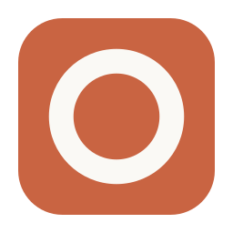
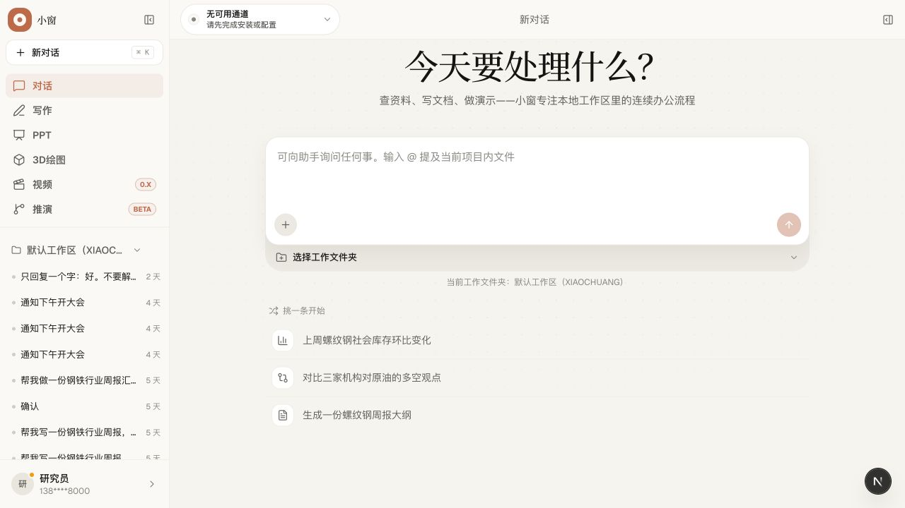
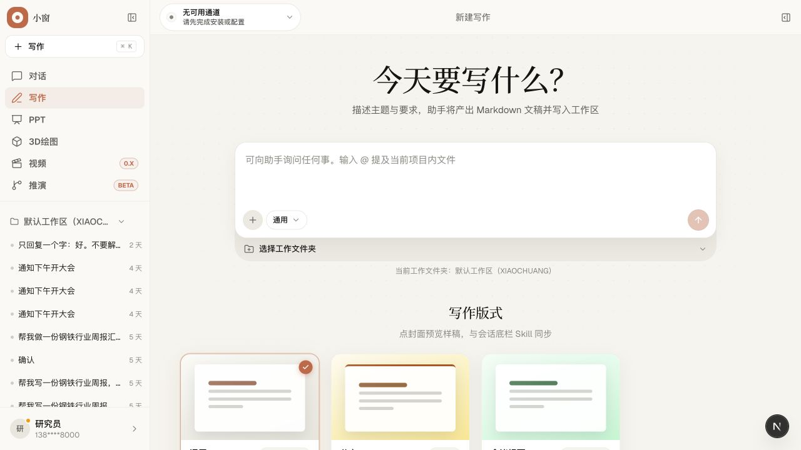
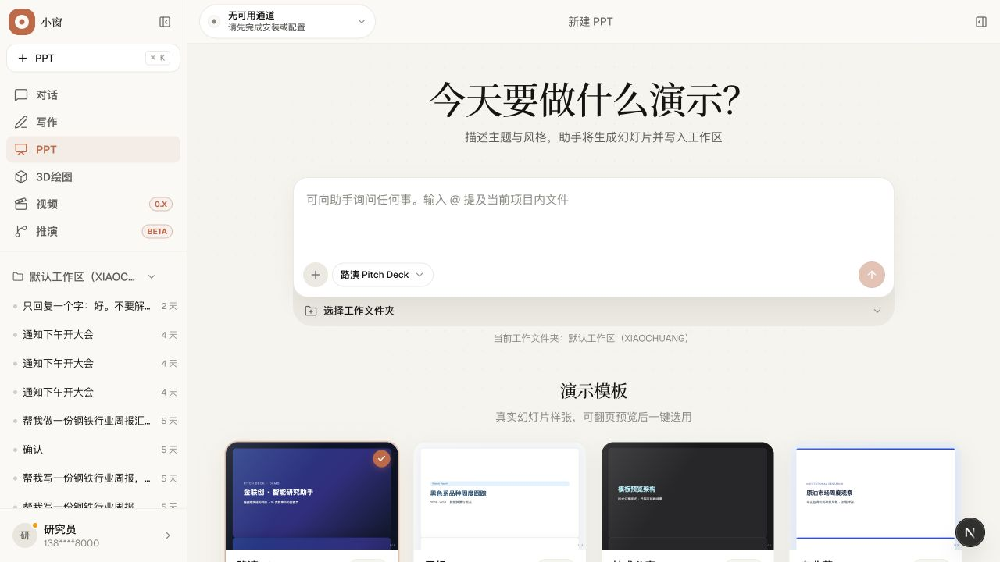
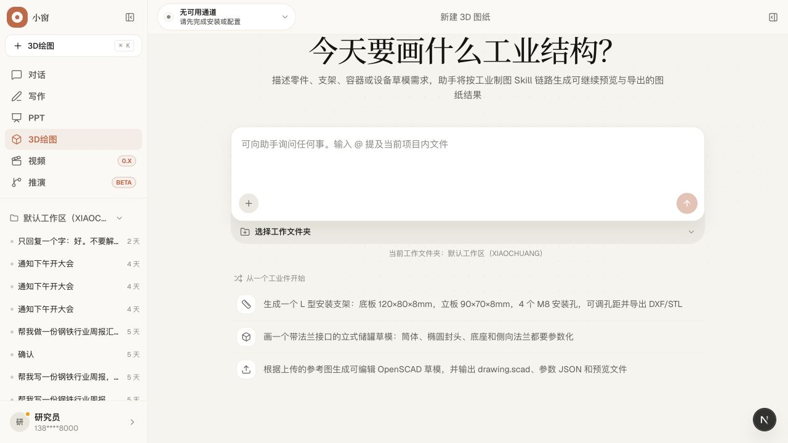
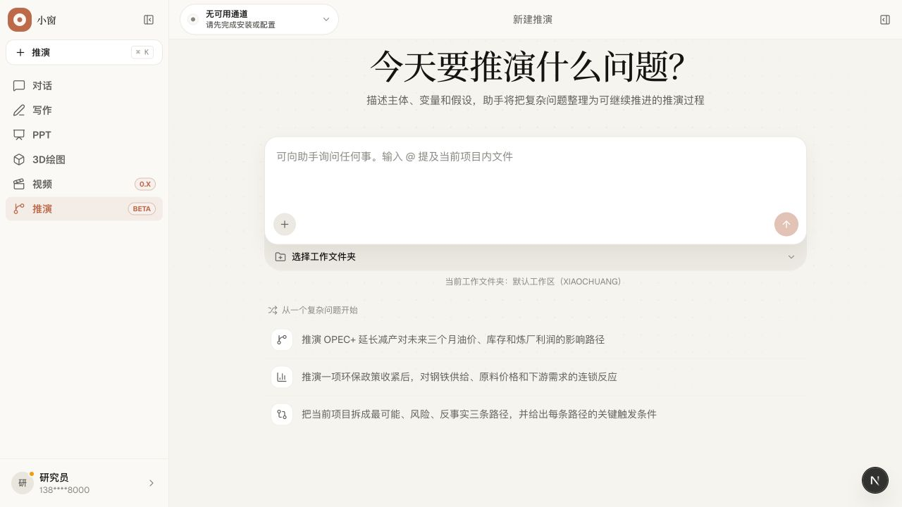
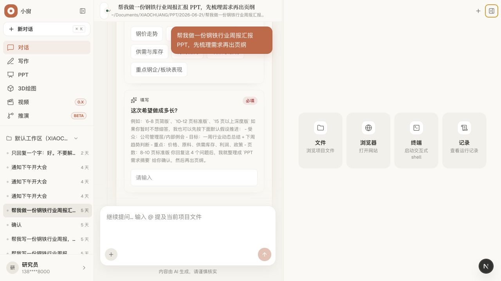
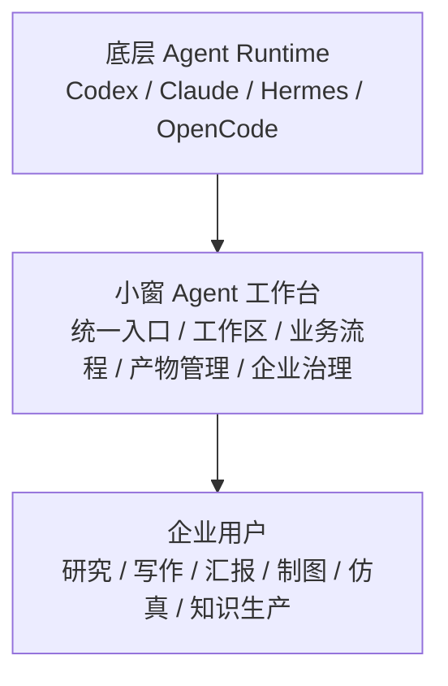
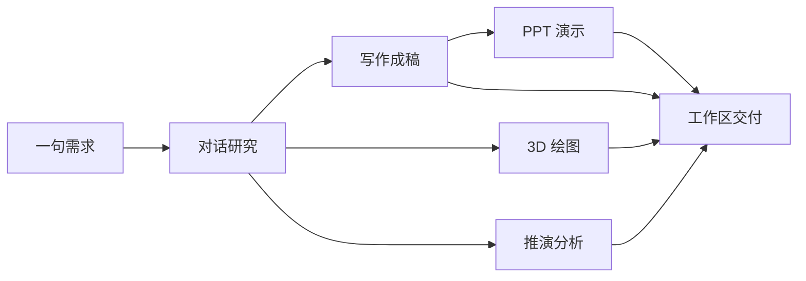

<p align="center">
  
</p>

<h1 align="center">小窗XIAOCHUANGx</h1>

<p align="center">
  研究、写作、演示、制图、推演，一个工作台搞定。
</p>

<p align="center">
  <a href="#首页视频">首页视频</a> ·
  <a href="#一个故事讲清楚小窗">故事主线</a> ·
  <a href="#典型界面">典型界面</a> ·
  <a href="#核心架构">核心架构</a> ·
  <a href="#交流与共建">交流与共建</a>
</p>

## 首页视频

下面就是小窗首页宣传片，可以直接在 README 里看。

<p align="center">
  <video src="https://raw.githubusercontent.com/zhaozhaozhiyi/XIAOCHUANGx/main/web/public/login-video.mp4" poster="web/public/readme/video-cover.png" controls muted playsinline width="100%"></video>
</p>

如果当前客户端没有展示播放器，也可以直接打开：[`web/public/login-video.mp4`](./web/public/login-video.mp4)

## 一个故事讲清楚小窗

很多知识工作，表面上看是在“写点东西”“做个汇报”“画个图”，但真正麻烦的，从来不是某一个动作本身，而是这一整条链路太碎了。

查资料在一个地方，记结论在一个地方，写文稿在一个地方，做 PPT 又去另一个地方。等到真正要交付时，内容、素材、结构、结论，已经散在一堆窗口和文件夹里。人不是在做工作，人是在找工作。

小窗想做的，就是把这条链路重新收回来。

### 从一句话开始

你只需要说一句话。

比如：

> `2026 年上半年中国成品油市场复盘`

小窗就从这里开始，把研究工作真正接起来。

### 先做研究

对话不是终点，而是入口。

你提出问题之后，小窗会把信息整理成更清晰的结论、摘要和结构。不是让你在一长串聊天记录里自己翻重点，而是帮你先把问题收敛下来。

一句话概括这一步：

> 说一句话，小窗就开始帮你研究。

### 需要成稿，就进入写作

研究完，很多时候下一步不是“继续聊”，而是“把它写出来”。

于是同一条工作链自然进入写作：确认需求，整理结构，生成大纲，继续写成稿件。你可以确认，也可以改；你可以让它先给框架，也可以直接推进正文。

这一步最重要的不是“会写”，而是：

> 研究的结论，不再丢在聊天里，而是继续长成真正的文稿。

### 需要汇报，就继续做 PPT

当文稿已经成型，下一步往往是演示和汇报。

小窗会继续把内容转成页纲、结构、页面表达。路演、汇报、复盘、介绍，不需要把前面的工作重做一遍，而是顺着同一条线继续往前走。

这一步想表达的是：

> 从内容到表达，不需要换脑子，也不需要换工作台。

### 需要画图，就进入 3D 绘图

有些工作不是写和讲，而是要画出来、建出来、导出来。

这时你依然可以从一句需求开始，把对象变成参数化模型，再继续调整，再继续导出成工程文件。不是把制图变成孤岛，而是让它也回到同一个工作过程里。

这一步想解决的是：

> 制图不该脱离上下文，工程文件也应该属于同一个交付链路。

### 遇到复杂问题，就进入推演

还有一些问题，既不是简单回答，也不是直接写稿，而是要拆结构、看变量、走路径、做判断。

这时，小窗会把复杂问题拆开，把影响关系展开，把不同路径并排放出来，让人不是只看到一个答案，而是看到一组更可判断的方向。

这一段的重点是：

> 把复杂问题，变成可以继续推下去的结构。

### 最后，所有结果回到工作区

研究、写作、演示、制图、推演，最后都不该只停在界面上。

它们应该回到一个真实工作区里，变成真正能交付、能复用、能继续加工的文件和结果。这样你做的不是“一次对话”，而是一份真正留下来的工作。

这也是小窗最想守住的一件事：

> AI 跑完整个过程，人负责确认和交付。  
> 聊天可以结束，结果必须留下。

## 小窗能做什么

- 对话研究：把一个问题收敛成结构化结论
- 写作成稿：把研究继续推进成文稿
- PPT 演示：把内容继续转成汇报表达
- 3D 绘图：把需求变成可调整、可导出的模型
- 推演分析：把复杂问题拆开、展开、继续往下推
- 工作区交付：把所有结果沉淀成真正可用的文件资产

## 典型界面

下面这组画面来自项目宣传片中的典型帧，基本就是上面这段故事的视觉版。

<table>
  <tr>
    <td width="50%">
      <strong>对话研究</strong><br />
      
    </td>
    <td width="50%">
      <strong>写作成稿</strong><br />
      
    </td>
  </tr>
  <tr>
    <td width="50%">
      <strong>PPT 演示</strong><br />
      
    </td>
    <td width="50%">
      <strong>3D 绘图</strong><br />
      
    </td>
  </tr>
  <tr>
    <td width="50%">
      <strong>推演分析</strong><br />
      
    </td>
    <td width="50%">
      <strong>工作区交付</strong><br />
      
    </td>
  </tr>
</table>

## 核心价值

### 一个工作台

研究、写作、演示、制图、推演，不再分散在一堆互不相干的工具里。

### 一条工作链

前一步的结果，能自然流到下一步，不需要重复搬运、重复整理、重复解释。

### 一套交付心智

不是只生成内容，而是把结果沉淀成真实工作区里的交付物。

### 一种更适合知识工作的产品方式

它不只是回答问题，而是陪你把问题做完。

## 产品定位

小窗不是要重新实现 Hermes、Codex、Claude Code 或 OpenCode 这类底层 Agent Runtime，而是站在它们之上，做面向企业业务场景的 Agent 工作台。

一句话说：

> 小窗是面向企业业务场景的 Agent 工作台：统一接入多种 Agent Runtime，围绕工作区、业务流程、交付物和治理体系，把 Agent 的执行能力转化为稳定的业务生产力。

### 统一 Agent 入口

用户不需要理解不同 Agent 的底层差异，也不应该在一堆工具之间来回切换。

小窗提供统一入口，把 Codex、Claude、Hermes、OpenCode 以及未来更多 Agent 能力编排到同一个工作过程里。底层 Agent 可以替换，但用户面对的是一致的任务入口、会话体验、工作区和结果展示。

### 业务工作流产品化

底层 Agent 负责“会干活”，小窗负责把“会干活”变成稳定的业务流程。

写作、PPT、研究分析、工业绘图、仿真、视频、知识整理这些场景，需要的不只是一次对话或一次工具调用，而是清晰的流程、模板、上下文、产物结构和验收标准。

### 交付物管理

CLI 和 TUI 擅长执行任务，但不擅长管理最终产物。

小窗要把 Agent 产出的文档、PPT、HTML、图表、3D 模型、工程文件和分析结果沉淀到真实工作区里，支持预览、编辑、导出、版本延续和历史追溯，让结果不是停留在聊天记录里，而是成为可以继续加工和交付的文件资产。

### 多 Agent 编排

不同 Agent 擅长不同任务：Codex 更适合代码和工程修改，Claude 更适合长文分析与综合表达，Hermes 更适合长期记忆、Skill 和自主工具调用，OpenCode 更适合工程工作流。

小窗的价值不是让用户手动判断每一步该用谁，而是把 agent、模型、prompt、skill、工作区和上下文组织好，让多个 Agent 能力服务于同一条业务链路。

### 企业治理与协作

企业场景不仅要求“能跑”，还要求“可控、可查、可复用”。

小窗需要承担项目隔离、权限边界、审计记录、Skill 管理、模板规范、团队协作、产物归档、统一配置以及私有化 / 本地化部署边界。这些是个人 Agent 工具通常不会优先解决，但企业工作台必须解决的问题。

### 与底层 Agent 的关系

Hermes 解决“Agent 如何自己干活”，小窗解决“企业用户如何稳定使用 Agent 完成业务工作并沉淀产物”。



## 核心架构

README 这里不展开讲实现细节，但会保留最重要的一层理解：小窗的设计，不是围绕“单个功能页”组织，而是围绕“完整工作过程”组织。



## 快速开始

```bash
pnpm install
pnpm dev
```

如果你想分开调试，也可以分别启动：

```bash
docker compose up -d
cp api/.env.example api/.env
pnpm db:push
pnpm dev:api
pnpm companion:dev
pnpm dev:web
pnpm desktop:dev
```

## 适合谁来共建

我们尤其欢迎这些朋友：

- 全栈工程师：愿意一起把链路做稳，把边界做清楚
- AIGC 工程师：愿意一起接模型、调流程、做能力编排
- 产品经理：愿意一起把体验、流程和策略做深
- 设计师：愿意一起把创作工作台打磨得更专业
- 内容创作者：愿意用真实场景给系统提要求

能提 Issue、能提 PR、能给建议、能指出“这里不对劲”，都非常欢迎。

开源不是大家来围观我表演，而是大家一起把事情做成。认真地说，真的很需要你。

## 联系我

如果你想聊产品、聊技术、聊 AI 内容生产，或者想认真参与共建，欢迎来加我。

### 个人微信


- 微信号：待补充
- 添加备注：`小窗 + 来意`

## 如果这个项目对你有一点点启发

欢迎你做三件小事：

- 点一个 [GitHub Star](https://github.com/zhaozhaozhiyi/XIAOCHUANGv) 支持一下
- 提一个 Issue 告诉我你最想一起做的方向
- 把它转给可能会感兴趣的朋友

Star 对开源项目真的很重要。  
它既是鼓励，也是信号，还是一种很朴素但很有效的“别停，继续做”。

所以如果你觉得这个方向值得，就拜托点一下。  
小窗先谢谢你，认真谢谢，也稍微调皮地谢谢。

## License

本项目基于 [MIT License](./LICENSE) 开源。你可以自由使用、修改、分发和商用，但请保留原始版权声明与许可声明。
