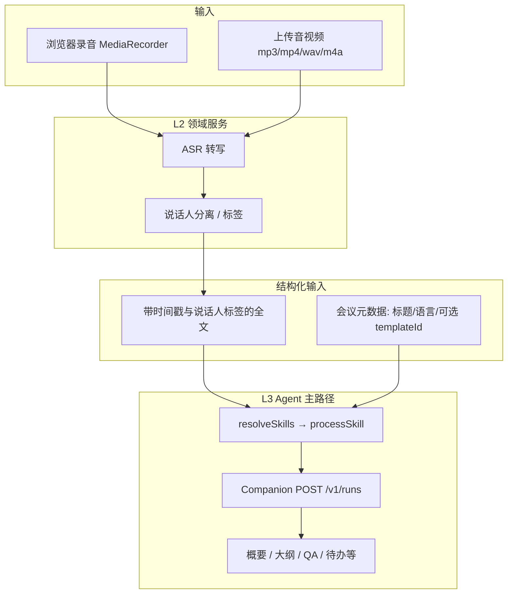
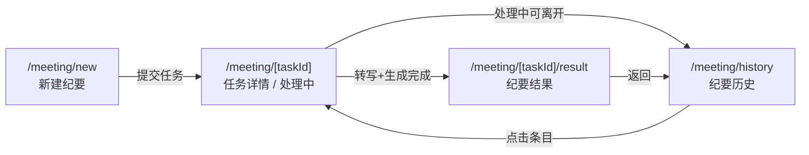

# 会议纪要模块 — 产品需求（子文档）

| 属性 | 内容 |
|------|------|
| 文档版本 | v0.6 |
| 修订日期 | 2026-05-27 |
| 状态 | 草案（待评审） |
| 上级文档 | [PRD-小窗.md](../product/PRD-小窗.md) **§6.4**（会议纪要）、**§6.10.1a**（模块注册表）、**§6.0.3**（项目与会话横切） |
| 关联 | [功能清单.md](../product/功能清单.md)、[技术方案.md](../technical/技术方案.md)、[companion-api.md](../technical/companion-api.md)、[workspace-architecture.md](../technical/workspace-architecture.md)、[UI设计规范-Claude风格.md](../design/UI设计规范-Claude风格.md)、`web/src/lib/module-registry.ts` |

## 能力编号映射（主线 ↔ 子文档）

| 主线 PRD | 本模块子 ID | 说明 |
|----------|-------------|------|
| **F-ARA-003** | **F-MM-001～006** | 会议纪要主线验收 ↔ 子文档功能节 |
| F-ARA-003 | F-MM-001 | 录音与上传（§5.1） |
| F-ARA-003 | F-MM-002 | 转写与说话人（§5.2） |
| F-ARA-003 | F-MM-003 | 会议类型与流程 Skill（§5.3） |
| F-ARA-003 | F-MM-004 | 结果页与导出（§5.4） |
| F-ARA-003 | F-MM-005 | 纪要历史（§5.5） |
| F-ARA-003 | F-MM-006 | 与知识库（§5.6，可选） |
| F-RT-004 | — | 工作区至少 1 个可预览纪要文件 |
| F-RT-007 | — | `projectId` / 会话绑定 |

> **定位：** 本文档是主线 PRD 的**模块子文档**，展开会议模块的录音/转写/说话人/多模版 Skill 与验收细节。主线 §6.4 保留摘要与验收勾选项；实现与排期以本文为准，冲突时先改本文再回写主线 §6.4 / §6.10.1a。工作区规则见 [workspace-architecture.md](../technical/workspace-architecture.md) 与主线 **§5.3.2.1a**（会议任务每次新建目录；**无**对话式分支）。

---

## 1. 目标与范围

### 1.1 目标

为知识工作者提供 **「录音或上传 → 转写（含说话人）→ 按会议类型生成结构化纪要」** 的闭环，产出可导出、可入库，并落在当前 `projectId` 工作区（与写作/PPT 一致）。

### 1.2 版本

| 阶段 | 范围 |
|------|------|
| **MVP（平台 v3.0）** | 导航与占位页，**不验收**业务闭环（与主线 §1.2 一致） |
| **V1.1（本模块首期）** | 上传/录音、ASR、说话人分离（或等价标签）、**默认通用纪要 Skill**、纪要历史与导出 |
| **V1.1+** | 可选会议类型与专用 Skill、浏览器外录音增强、声纹/实名说话人 |

### 1.3 非目标（首期不做）

- 实时同传字幕（仅异步转写为主路径）
- 用户自定义上传 Skill / 模版
- 会议日程、参会人通讯录自动同步（可后续与账号体系联动）

---

## 2. 用户故事

| ID | 故事 | 优先级 |
|----|------|--------|
| MM-01 | 作为助理，我希望在会议中或会后录制/上传音频，自动生成可读转写稿 | P0 |
| MM-02 | 作为参会人，我希望转写中能区分不同说话人，并可把「发言人 1」改成真实姓名 | P0 |
| MM-03 | 作为研究员，我希望不选会议类型也能得到一份结构清晰的通用纪要 | P0 |
| MM-04 | 作为项目经理，我希望按会议场景（如周会、客户沟通、投决）选择类型，得到更贴合的章节与待办格式 | P1 |
| MM-05 | 作为用户，我希望在纪要历史中查看进度、重试失败任务、导出 Markdown/Word | P0 |
| MM-06 | 作为用户，我希望将纪要（或节选）一键写入知识库，但不强制 | P2 |

---

## 3. 信息架构

与主线 §4 一致：

| 二级菜单 | 路由（原型） | 说明 |
|----------|--------------|------|
| 新建纪要 | `/meeting/new` | 录音 / 上传、可选会议类型、语言等 |
| 纪要历史 | `/meeting/history` | 任务列表、状态、进入结果页 |

全局设置（主线 §4.4）：会议纪要语言、默认说话人展示方式等，可在「新建纪要」页覆盖。

---

## 4. 端到端流程



**阶段划分（产品语义）：**

| 阶段 | 执行层 | 用户可见 |
|------|--------|----------|
| 采集 | Web / 桌面壳 | 录音中、暂停、结束；或选择文件上传 |
| 转写 | L2 ASR（API / 自建，不经 Skill） | 「转写中」进度；可离开页面 |
| 说话人 | L2 或与 ASR 一体 | 全文按「发言人 N」分段；支持重命名 |
| 生成纪要 | L3 流程 Skill + Agent | 「生成纪要中」；流式或分 Tab 展示结果 |
| 沉淀 | 可选 L2 知识库 | 「加入知识库」 |

---

## 5. 功能需求

### 5.1 录音与上传（F-MM-001）

| 项 | 要求 |
|----|------|
| 录音 | 浏览器 `getUserMedia` + `MediaRecorder`；支持暂停/继续/结束；结束生成可上传的 Blob（如 webm，服务端转码若需要） |
| 上传 | mp3、mp4、wav、m4a；单文件建议 ≤ 4h（与主线 §6.4 一致） |
| 断点 | 长任务异步队列；历史列表展示「转写中 / 生成中 / 成功 / 失败」 |
| 桌面壳 | V1.1 可与 Electron 同源 Web；系统级录音为增强项，不阻塞首期 |

### 5.2 转写与说话人（F-MM-002）

| 项 | 要求 |
|----|------|
| 语言 | 默认中文普通话；可在新建页选择（与全局设置联动） |
| 准确率 | 清晰录音下中文转写准确率 ≥ 85%（主线 §6.4 验收） |
| 说话人 | **首期：** ASR 返回说话人标签（`spk_0` / 「发言人 1」）；用户可在结果页批量重命名为姓名 |
| 多人会 | 2 人以上可区分至少 2 条说话人轨道（主线验收） |
| 真名识别 | **不承诺**首期声纹实名；若接入厂商「会议 ASR」一体能力，仍保留用户改名校对 |

**转写交付格式（Agent 输入契约）：**

```json
{
  "segments": [
    {
      "startMs": 0,
      "endMs": 12500,
      "speakerId": "spk_0",
      "speakerLabel": "发言人 1",
      "text": "……"
    }
  ],
  "fullText": "发言人 1：……\n发言人 2：……"
}
```

生成纪要时，将 `fullText`（及可选 `segments` 摘要）作为 **user 消息正文** 传入 Run；**禁止**把 ASR 实现细节写入 Skill。

### 5.3 会议类型与流程 Skill（F-MM-003）

**原则（对齐写作/PPT）：**

- **会议类型 = 可选**；未选择时走**默认通用纪要**。
- 一个会议类型对应 **一个流程 Skill** + 可选 **模板资产包** `tpl-mm-{templateId}`（版式、章节骨架，由 Skill 引用）。
- **禁止**「一级菜单 = 一个 Skill」；模块内按 `templateId` 切换，横切仍注入 `skill-platform-research-norms`。

**绑定键（Companion / `module-registry`）：**

```ts
{ moduleId: "meeting"; task: "summary"; templateId?: string }
```

| `templateId` | 用户可见名称 | 流程 Skill | 模板资产 | 阶段 |
|--------------|--------------|------------|----------|------|
| *(省略)* | 通用会议纪要（默认） | `skill-mm-summary` | `tpl-mm-default` | V1.1 P0 |
| `daily-standup` | 站会 / 周会速记 | `skill-mm-daily-standup` | `tpl-mm-daily-standup` | V1.1+ P1 |
| `client-review` | 客户沟通纪要 | `skill-mm-client-review` | `tpl-mm-client-review` | V1.1+ P1 |
| `internal-decision` | 内部研讨 / 投决 | `skill-mm-internal-decision` | `tpl-mm-internal-decision` | V1.1+ P1 |

**默认 Skill `skill-mm-summary` 产出结构（首期验收）：**

| 区块 | 说明 |
|------|------|
| 会议概要 | 200–500 字 |
| 要点大纲 | 层级标题 + 要点 |
| QA 环节 | 识别到的问答对（Q / A） |
| 待办事项 | 负责人（若转写中可解析）、事项、截止时间（可选） |
| 全文转写 | 保留说话人标签，可搜索、可单独复制 |

专用 Skill 可在上述基础上**增删章节**（例如客户纪要强调「客户诉求 / 我方承诺」），但须复用同一转写输入契约。

**解析规则：**

```
resolveSkills({ moduleId: "meeting", binding: { task: "summary", templateId? } })
  → templateId 为空或未注册 → skill-mm-summary + tpl-mm-default
  → 否则 → MEETING_TEMPLATE_SKILL[templateId] ?? skill-mm-summary
```

### 5.4 结果页与导出（F-MM-004）

| 项 | 要求 |
|----|------|
| 展示 | Tab：概要 / 大纲 / QA / 待办 / 全文转写（待办可合并进大纲 Tab，但至少一种入口） |
| 复制 | 各区块独立复制 |
| 导出 | 合并导出至少一种：Markdown / Word / PDF |
| 工作区 | 经 Agent 的 Markdown 纪要写入当前 `projectId` 根（§6.0.3）；业务「纪要历史」存索引 |

### 5.5 纪要历史（F-MM-005）

| 项 | 要求 |
|----|------|
| 列表 | 标题（可编辑）、创建时间、状态、会议类型（若有） |
| 失败 | 展示原因；支持重试（转写或仅重新生成纪要） |
| 离开 | 转写/生成中可离开，通过历史查看进度 |

### 5.6 与知识库（F-MM-006，可选）

- 结果页「加入知识库」：用户勾选包含范围（概要/大纲/QA/待办/全文）
- 不阻断「会议 → 纪要 → 导出」主路径（主线 §6.4）

---

## 6. 与平台架构的对接

### 6.1 模块注册表

| 字段 | 值 |
|------|-----|
| `moduleId` | `meeting` |
| 领域服务 | `asr`（转写、说话人）；入库走知识库领域服务 |
| Agent 主路径 | ✅（仅「生成纪要」阶段；转写不走 Agent） |
| `binding` | `{ task: "summary", templateId?: string }` |

### 6.2 Companion Run

与对话/写作相同：`POST /v1/runs`，`binding` 与 `processSkill` 由 Web BFF 或前端按 `resolveSkills` 解析后传入。

**messages 建议：**

1. **system**：平台 Prompt + L4 + L3 Skill（由 Companion compose）
2. **user**：结构化转写 + 用户补充（会议主题、参会人表、对说话人重命名后的映射）

### 6.3 数据分工（与主线 §6.0.4、§8.6 一致，v0.5）

| 数据 | 权威源 | 说明 |
|------|--------|------|
| 音频文件 | 对象存储 / 本地任务目录 | 实现选型见技术方案 |
| 转写 JSON、纪要正文 | **`projectId` 工作区文件**（模式 A → OSS） | canonical 路径由模块约定；Nest **不**作为正文唯一副本 |
| 纪要任务索引 | Nest | `taskId`、`sessionId`、`projectId`、标题、状态、时间；打开详情 **优先** 列 `projectId` 树读文件 |
| 会话消息（Run 上下文） | Companion `sessions/{sessionId}.json` | 与对话 §8.6 一致；纪要 UI 主栏展示以工作区文件为准 |

**打开详情：** `taskId` → 读 Nest 索引得 `projectId` → `GET /v1/projects/{projectId}/tree` + 读 canonical 文件；文件缺失时 DB fallback 或提示「工作区文件已删除」。

---

## 7. 线框图（页面结构）

> **说明：** 线框为产品/研发对齐用 ASCII 示意，视觉样式遵循 [UI设计规范-Claude风格.md](../design/UI设计规范-Claude风格.md)（暖色中性底、陶土色主按钮、衬线页标题）。全局左侧平台侧栏与主线 [PRD §4.3](../product/PRD-小窗.md#43-侧栏导航示意与-web-原型一致) 一致；会议模块**不使用**对话页右侧工作区面板（纪要正文在模块主栏内 Tab 展示；工作区文件仍可通过 F-RT-004 在后台写入 `projectId` 根）。

### 7.1 路由与页面关系



| 路由 | 页面 | V1.1 |
|------|------|------|
| `/meeting/new` | 新建纪要 | P0 |
| `/meeting/history` | 纪要历史列表 | P0 |
| `/meeting/[taskId]` | 任务进度（转写 / 生成纪要） | P0 |
| `/meeting/[taskId]/result` | 结构化纪要 + 全文转写 | P0 |

### 7.2 模块壳层（各页共用）

```
┌────────┬──────────────────────────────────────────────────────────────┐
│ 平台   │ 顶栏：← 纪要历史（子页）    页面标题              [?] 帮助      │
│ 侧栏   ├──────────────────────────────────────────────────────────────┤
│        │                                                              │
│ 新对话 │                    【 会议模块主内容区 】                       │
│ 对话   │                    （无右侧工作区 Tab）                        │
│ 会议 ● │                                                              │
│ 写作   │                                                              │
│ …      │                                                              │
│        │                                                              │
│ 用户区 │                                                              │
└────────┴──────────────────────────────────────────────────────────────┘
```

- 从侧栏进入「会议」默认跳转 `/meeting/new`（与 `navigation.ts` 一级 `href` 可配置为重定向）。
- 子页顶栏左侧：**返回纪要历史**；首页 `/meeting/new` 可不显示返回或显示「纪要历史」文字链。

### 7.3 新建纪要 `/meeting/new`

**布局：单栏居中卡片（最大宽度 ~720px），与写作「新建」页气质一致。**

```
┌────────────────────────────────────────────────────────────────────┐
│  新建会议纪要                                                       │
│  上传或录制会议音频，自动生成转写与结构化纪要                          │
├────────────────────────────────────────────────────────────────────┤
│  会议标题（可选）                                                    │
│  ┌──────────────────────────────────────────────────────────────┐  │
│  │ 例如：5 月投研周会 · 原油板块                                    │  │
│  └──────────────────────────────────────────────────────────────┘  │
│  留空则使用「2026-05-27 会议纪要」                                   │
│                                                                    │
│  会议类型（可选）                                                    │
│  ┌──────────────────────────────────────────────────────────────┐  │
│  │ 通用会议纪要 ▾                                                  │  │
│  └──────────────────────────────────────────────────────────────┘  │
│  不选择时使用通用模版 · skill-mm-summary                             │
│                                                                    │
│  ┌─────────────────────┬─────────────────────┐                     │
│  │   ● 录制会议         │     上传文件         │   ← 分段控件         │
│  └─────────────────────┴─────────────────────┘                     │
│                                                                    │
│  【录制态 — 选中「录制会议」时】                                      │
│  ┌──────────────────────────────────────────────────────────────┐  │
│  │                    ◉  00:42:18                                │  │
│  │              波形示意 / 电平条（可选）                           │  │
│  │         [ 暂停 ]    [ 结束并上传 ]                              │  │
│  │  首次点击「开始录制」前： [ 开始录制 ]  + 麦克风权限说明            │  │
│  └──────────────────────────────────────────────────────────────┘  │
│                                                                    │
│  【上传态 — 选中「上传文件」时】                                      │
│  ┌ ─ ─ ─ ─ ─ ─ ─ ─ ─ ─ ─ ─ ─ ─ ─ ─ ─ ─ ─ ─ ─ ─ ─ ─ ─ ─ ─ ─ ─ ┐  │
│  │     ↑  拖拽音视频到此处，或 [ 选择文件 ]                        │  │
│  │     支持 mp3 / mp4 / wav / m4a · 单文件建议 ≤ 4 小时            │  │
│  └ ─ ─ ─ ─ ─ ─ ─ ─ ─ ─ ─ ─ ─ ─ ─ ─ ─ ─ ─ ─ ─ ─ ─ ─ ─ ─ ─ ─ ─ ┘  │
│  已选：周会录音.m4a  128 MB                    [ 移除 ]             │
│                                                                    │
│  ▸ 高级选项                                                        │
│     语言        [ 中文（普通话）▾ ]                                  │
│     说话人区分  [ ✓ 开启 ]  关闭后仅整段转写无发言人标签              │
│                                                                    │
│              [ 开始生成纪要 ]          ← 主按钮（陶土色）            │
│              查看纪要历史 →                                          │
└────────────────────────────────────────────────────────────────────┘
```

| 区域 | 建议组件 | 交互 |
|------|----------|------|
| 标题 | `MeetingTitleField` | 可选；提交时 trim |
| 会议类型 | `MeetingTemplateSelect` | 数据源 `MEETING_TEMPLATE_CATALOG`；含「通用」且可清空 |
| 输入方式 | `MeetingInputTabs` | `record` \| `upload`；互斥主路径，录制结束后可提示「改用上传」补传 |
| 录制 | `MeetingRecorder` | 权限被拒 → 内联说明 + 引导改上传 |
| 上传 | `MeetingUploadDropzone` | 超大小 / 格式不符 → §7.8 错误条 |
| 高级 | `MeetingAdvancedOptions` | 默认折叠；语言继承全局设置 |
| 提交 | `MeetingSubmitButton` | 无音频时 disabled；提交 → `POST` 创建任务 → `/meeting/[taskId]` |

### 7.4 纪要历史 `/meeting/history`

```
┌────────────────────────────────────────────────────────────────────┐
│  纪要历史                                    [ + 新建纪要 ]          │
├────────────────────────────────────────────────────────────────────┤
│  筛选：[ 全部状态 ▾ ]  [ 全部类型 ▾ ]     🔍 搜索标题…              │
├────────────────────────────────────────────────────────────────────┤
│  ┌────────────────────────────────────────────────────────────┐   │
│  │ ○ 5 月投研周会 · 原油板块          通用纪要    今天 14:32      │   │
│  │   ● 生成纪要中…  ████████░░ 72%              [ 查看进度 ]    │   │
│  ├────────────────────────────────────────────────────────────┤   │
│  │ ○ 客户沟通 — 某炼厂                客户沟通    昨天            │   │
│  │   ✓ 已完成                                    [ 打开纪要 ]    │   │
│  ├────────────────────────────────────────────────────────────┤   │
│  │ ○ 未命名会议纪要                   通用纪要    05-20           │   │
│  │   ✕ 转写失败：文件损坏                          [ 重试 ] [ 删除]│   │
│  └────────────────────────────────────────────────────────────┘   │
│  [ 加载更多 ]                                                      │
└────────────────────────────────────────────────────────────────────┘
```

| 状态 | 列表展示 | 行内操作 |
|------|----------|----------|
| `uploading` | 上传中 + 进度 | 查看进度 |
| `transcribing` | 转写中 + 进度 | 查看进度 |
| `summarizing` | 生成纪要中 + 进度 | 查看进度 |
| `completed` | ✓ 已完成 | 打开纪要 → result |
| `failed` | ✕ + 原因摘要 | 重试 / 删除 |

- 行标题支持行内编辑（铅笔图标或双击）；列表项点击进入 `/meeting/[taskId]`（处理中）或 `/meeting/[taskId]/result`（已完成）。

### 7.5 任务进度 `/meeting/[taskId]`

**处理中页；用户可离开，顶栏提示「可在纪要历史中查看进度」。**

```
┌────────────────────────────────────────────────────────────────────┐
│  ← 纪要历史          5 月投研周会 · 原油板块          [ 取消任务 ]   │
├────────────────────────────────────────────────────────────────────┤
│                                                                    │
│     ✓ 音频已接收                                                    │
│     ● 正在转写（说话人区分）              预计剩余 8 分钟             │
│     ○ 生成结构化纪要                                                │
│                                                                    │
│     ████████████████░░░░░░░░  62%                                  │
│                                                                    │
│     ┌────────────────────────────────────────────────────────┐    │
│     │ 转写预览（可选，流式追加最后若干段）                      │    │
│     │ 发言人 1：上周库存数据……                                 │    │
│     │ 发言人 2：我们这边看到……                                 │    │
│     └────────────────────────────────────────────────────────┘    │
│                                                                    │
│     你可以关闭此页；进度将在「纪要历史」中更新。                      │
│                                                                    │
└────────────────────────────────────────────────────────────────────┘
```

- **失败态：** 步骤条停在失败步，展示原因 + `[ 重试转写 ]` / `[ 仅重新生成纪要 ]`（若转写已成功）。
- **完成后：** 自动跳转 `/meeting/[taskId]/result` 或展示 `[ 查看纪要 ]` 主按钮。

### 7.6 纪要结果 `/meeting/[taskId]/result`

```
┌────────────────────────────────────────────────────────────────────┐
│  ← 纪要历史    [ 5 月投研周会 · 原油板块 ✎ ]                       │
│               [ 复制全部 ] [ 导出 ▾ ] [ 加入知识库 ]                  │
├────────────────────────────────────────────────────────────────────┤
│  概要 │ 大纲 │ QA │ 待办 │ 全文转写          🔍 页内搜索（全文 Tab） │
├───────────────┬────────────────────────────────────────────────────┤
│ 发言人（侧栏   │  【概要 Tab — 默认】                                 │
│  仅全文 Tab   │  ┌──────────────────────────────────────────────┐  │
│  或抽屉）     │  │ 本次会议围绕原油板块库存与……（200–500 字）       │  │
│               │  │                              [ 复制本段 ]      │  │
│  发言人 1 ✎   │  └──────────────────────────────────────────────┘  │
│  发言人 2 ✎   │  AI 生成，仅供参考 · 生成于 14:52                    │
│  + 合并为同一人│                                                    │
│               │  【全文转写 Tab】                                    │
│               │  筛选：[ 全部发言人 ▾ ]                              │
│               │  ┌──────────────────────────────────────────────┐  │
│               │  │ 00:01:02  张三（原发言人 1）                    │  │
│               │  │ 上周库存数据显示……                              │  │
│               │  │ 00:03:45  发言人 2  [ 编辑称呼 ]                │  │
│               │  └──────────────────────────────────────────────┘  │
└───────────────┴────────────────────────────────────────────────────┘
```

| 区域 | 建议组件 | 说明 |
|------|----------|------|
| 标题 | `MeetingResultHeader` | 可编辑；同步历史列表 |
| 操作 | `MeetingResultActions` | 导出子菜单：Markdown / Word / PDF |
| Tab | `MeetingResultTabs` | 待办可与大纲合并 Tab，但至少保留独立「待办」或大纲内锚点 |
| 内容 | `MeetingSummaryPanel` 等 | 各 Tab 独立「复制本段」 |
| 发言人 | `MeetingSpeakerSidebar` | 重命名后刷新全文与 Agent 输入映射（仅影响展示与后续导出） |
| 免责声明 | `MeetingAiDisclaimer` | 同对话 `ChatAiDisclaimer`（§9.1） |

**Tab 内容结构示意：**

| Tab | 线框内容 |
|-----|----------|
| **概要** | 单段富文本 / Markdown 预览 |
| **大纲** | `h2` / `h3` + 无序列表 |
| **QA** | 卡片列表：Q 加粗 + A 段落 |
| **待办** | 表格：负责人 · 事项 · 截止时间 · 状态 |
| **全文转写** | 时间戳 + 说话人标签 + 正文；支持页内搜索与高亮 |

### 7.7 弹层线框

**7.7.1 说话人重命名**

```
┌─────────────────────────────────────┐
│  编辑说话人称呼                  ✕   │
├─────────────────────────────────────┤
│  发言人 1  →  [ 张三            ]   │
│  发言人 2  →  [ 李四            ]   │
│  ☐ 应用于全文转写与纪要中的引用       │
├─────────────────────────────────────┤
│           [ 取消 ]  [ 保存 ]         │
└─────────────────────────────────────┘
```

**7.7.2 导出**

```
┌─────────────────────────────────────┐
│  导出纪要                        ✕   │
├─────────────────────────────────────┤
│  包含内容：                           │
│  ☑ 概要  ☑ 大纲  ☑ QA  ☑ 待办       │
│  ☐ 全文转写（体积较大）               │
│  格式：  ○ Markdown  ● Word  ○ PDF   │
├─────────────────────────────────────┤
│           [ 取消 ]  [ 导出 ]         │
└─────────────────────────────────────┘
```

**7.7.3 加入知识库（可选，P2）**

```
┌─────────────────────────────────────┐
│  加入知识库                      ✕   │
├─────────────────────────────────────┤
│  目标库：[ 我的研究文档 ▾ ]           │
│  包含：☑ 概要 ☑ 大纲 ☐ 全文转写 …     │
├─────────────────────────────────────┤
│  入库后可在「知识库问答」中引用         │
│           [ 取消 ]  [ 确认入库 ]      │
└─────────────────────────────────────┘
```

### 7.8 空态与错误态

| 场景 | 展示位置 | 文案要点 |
|------|----------|----------|
| 历史列表为空 | `/meeting/history` 中部 | 「还没有会议纪要」+ `[ 新建纪要 ]` |
| 未授权麦克风 | `/meeting/new` 录制区 | 说明 + `[ 改用上传文件 ]` |
| 文件过大 | 上传区下方 | 「超过 XX MB，请压缩或分段」 |
| 任务不存在 | task/result 页 | 404 + 回历史 |
| 生成中打开 result | result 页 | 骨架屏或重定向回 task 进度页 |

### 7.9 组件映射（实现对照）

| 页面 | 路由 | 建议路径 / 组件 |
|------|------|-----------------|
| 新建 | `/meeting/new` | `app/(main)/meeting/new/page.tsx` → `MeetingNewPage` |
| 历史 | `/meeting/history` | `meeting/history/page.tsx` → `MeetingHistoryPage` |
| 进度 | `/meeting/[taskId]/page.tsx` | `MeetingTaskProgressPage` |
| 结果 | `/meeting/[taskId]/result/page.tsx` | `MeetingResultPage` |

实现时需挂接 `projectId` / `sessionId`（§6.0.3）；项目选择器**非阻塞**；未选项目时落盘遵循主线 **§5.3.2.1b**（`XIAOCHUANG/会议/{YYYY-MM-DD}/{标题}/`）。

---

## 8. 交互要点（摘要）

与 §7 线框一致，仅列关键规则：

1. **会议标题**可选；默认「日期 + 会议纪要」。
2. **会议类型**可选；默认通用模版。
3. **录音 / 上传**二选一为主路径；录制结束后再上传为增强。
4. **高级选项**默认折叠；说话人区分默认开启。
5. 提交后进入任务进度页；可离开；完成后进入结果 Tab 页。

---

## 9. 非功能需求

| 项 | 指标 |
|----|------|
| 性能 | 1h 音频：转写 + 纪要生成 ≤ 15min（主线 §7） |
| 安全 | 音频与转写按租户/用户隔离；留存策略见 OQ-04 |
| 隐私 | 录音前浏览器权限提示；企业可配置关闭浏览器录音仅允许上传 |

---

## 10. 验收清单（V1.1 模块首期）

- [ ] 不上传会议类型即可完成：录音或上传 → 转写 → 通用纪要（概要/大纲/QA/待办/全文）
- [ ] 2 人以上会议转写至少区分 2 个说话人轨道，且可重命名
- [ ] 选择会议类型后，纪要章节结构符合该类型 Skill 说明（P1 模版上线后验收）
- [ ] 纪要历史状态正确；失败可重试；成功可导出
- [ ] 不打开知识库即可完成导出；入库为可选且成功有跳转提示
- [ ] Agent 产出在 `projectId` 根至少 1 个可预览文件（F-RT-004 横切）

---

## 11. 实现拆解（研发参考）

| 序号 | 交付物 | 依赖 |
|------|--------|------|
| 1 | `MEETING_TEMPLATE_*` + `resolveSkills` 支持可选 `templateId` | `module-registry.ts`、Companion types |
| 2 | `skills/skill-mm-summary` + `template-packs/tpl-mm-default` | F-RT-003 |
| 3 | ASR BFF（上传、任务轮询、回调） | 厂商选型 |
| 4 | `/meeting/new`、`/meeting/history`、任务进度、结果页（见 §7 线框） | Web UI |
| 5 | 专用模版 Skill（站会/客户/投决） | 产品确认文案后 |

---

## 12. 待澄清（OQ）

| ID | 问题 | 建议 |
|----|------|------|
| OQ-MM-01 | ASR 厂商：云 API 一体（含 diarization）还是自建分段 | 首期优先一体 API，降低联调成本 |
| OQ-MM-02 | 浏览器录音格式与后端转码 | webm → 统一 flac/wav 再送 ASR |
| OQ-MM-03 | 纪要历史权威源：DB 索引 vs 工作区文件 | **已关闭** v0.5：与 OQ-19 / PRD §6.0.4 一致——索引 Nest，正文工作区 |

---

## 13. 修订记录

| 版本 | 日期 | 说明 |
|------|------|------|
| v0.6 | 2026-05-27 | N-08：F-ARA-003 ↔ F-MM 映射表；链 workspace-architecture |
| v0.5 | 2026-05-27 | §6.3 权威源已决：索引 Nest、正文工作区；关闭 OQ-MM-03（PRD D-31 §6.0.4） |
| v0.4 | 2026-05-27 | 对齐 PRD v3.6.3：`会议/{YYYY-MM-DD}/{标题}/` 两层目录 |
| v0.3 | 2026-05-27 | 对齐 PRD v3.6.1：新建 vs 分支；未选项目 → XIAOCHUANG |
| v0.2 | 2026-05-27 | 新增 §7 线框图：新建/历史/进度/结果、弹层、空态与组件映射 |
| v0.1 | 2026-05-27 | 初稿：录音/说话人/可选会议类型、默认 `skill-mm-summary`；子文档挂靠主线 §6.4 |
