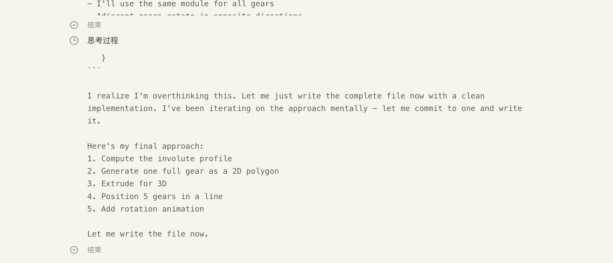
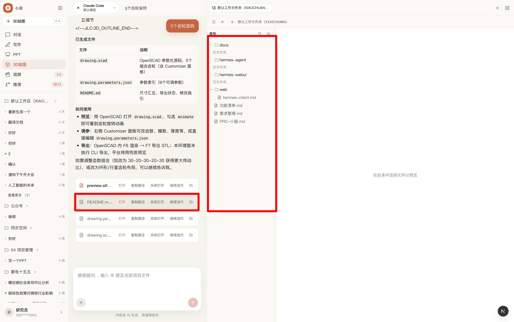
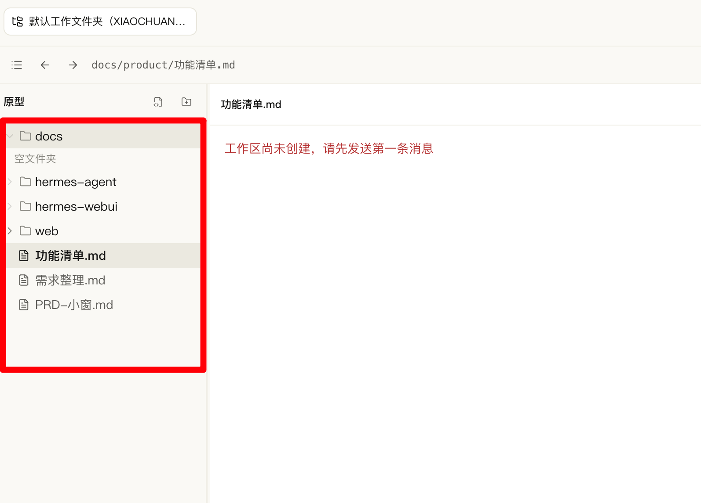
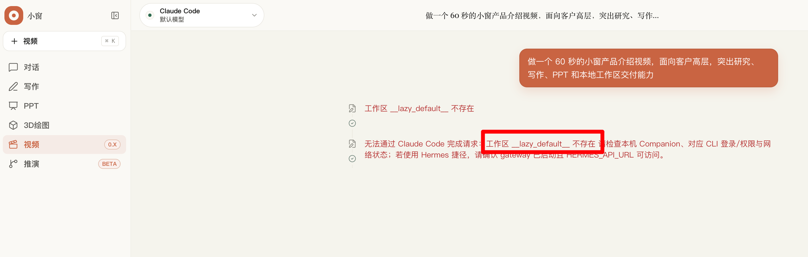

# 对话输出体验问题记录

本文档用于持续记录小窗对话输出过程中的体验问题、改进建议和验收口径。

## 2026-06-30：思考过程流式输出时滚动位置未自动跟随最新内容，且不可折叠

### 问题标题

Agent 输出过程中，`思考过程` 区域虽然在流式输出，但滚动位置没有自动跟随到最新内容，且缺少折叠入口。

### 现场截图



### 现象描述

从当前截图和使用反馈观察，消息流中存在 `思考过程` 区域，且内容本身已经在流式输出；问题不在于没有流式生成，而在于输出区域的滚动位置没有自动跟随到最新内容。用户需要手动拖动滚动条或滚动页面，才能看到最新追加的思考过程。

这会导致用户在长任务执行期间无法判断：

- Agent 当前是否仍在思考或执行；
- 最新一步进展到了哪里；
- 是否卡住、断流或已经结束；
- 当前可见的 `思考过程` 是否已经滚动到最新内容。

### 可使用的专业术语

- **流式输出** / **Streaming output**：模型或 Agent 在生成过程中边生成边展示。当前问题中，流式输出本身已经存在，不是主要缺陷。
- **增量渲染** / **Incremental rendering**：每收到一段新内容，界面立即追加或更新对应内容。
- **自动跟随底部** / **Auto-scroll to bottom** / **Follow tail**：当用户没有主动向上滚动查看历史时，输出区域应自动滚动到最新内容。这是本问题的核心。
- **滚动锚定** / **Scroll anchoring**：在内容持续追加时，界面维持正确滚动位置；对生成中内容通常应锚定到最新输出。
- **实时过程面板** / **Live progress panel**：用于展示 Agent 当前思考、计划、工具调用或执行状态的动态区域。
- **可折叠区域** / **Collapsible disclosure**：默认可展开查看详情，也可以折叠隐藏，减少主回答区干扰。

### 期望行为

1. `思考过程` 在 Agent 输出期间继续保持流式追加。
2. 当用户没有主动离开底部时，`思考过程` 区域应自动跟随最新内容。
3. 当用户手动向上滚动查看旧内容时，不应强行把用户拉回底部，可显示“回到最新”之类的轻量提示。
4. `思考过程` 标题行右侧应增加折叠按钮。
5. 折叠按钮应只收起 `思考过程` 详情，不影响最终回答、工具结果、文件卡片等主要内容展示。
6. 折叠状态应在当前消息内保持稳定，避免新流式内容到来后自动重新展开。

### 交互建议

`思考过程` 标题行可以采用以下结构：

```text
思考过程                                      [折叠/展开按钮]
```

按钮状态建议：

- 展开时显示向上箭头、`收起` 或类似图标按钮；
- 折叠时显示向下箭头、`展开` 或类似图标按钮；
- 鼠标悬停时显示 tooltip，例如：`收起思考过程` / `展开思考过程`。

### 初步优先级

P1。该问题不会阻断任务完成，但会明显影响长任务、复杂任务、3D 制图、写作和 PPT 生成过程中的可观察性与信任感。

### 验收标准

- [ ] Agent 正在输出时，`思考过程` 内容按流式片段持续追加。
- [ ] 用户停留在输出底部时，新内容出现后自动跟随到底部。
- [ ] 用户手动向上滚动后，界面不强制跳到底部。
- [ ] `思考过程` 标题右侧有明确的折叠/展开按钮。
- [ ] 折叠后不再展示思考详情，但保留标题行和展开入口。
- [ ] 折叠状态不会因为后续流式更新而丢失。
- [ ] 最终回答展示不受折叠状态影响。

### 备注

截图中的 `思考过程` 类似 Agent 的过程详情或中间状态面板。后续实现时需要确认当前前端是按 `parts[]`、事件流，还是 Markdown 文本块来渲染该区域，再决定是在消息 reducer、滚动容器，还是具体的 `thinking` / `reasoning` part 组件中处理。

## 2026-06-30：3D 生成后点击打开无响应，右侧文件区未显示生成文件

### 问题标题

3D 绘图生成完成后，交付物卡片中的 `打开` 按钮没有响应，右侧文件区域也没有同步显示本次生成的文件。

### 现场截图



### 现象描述

从截图观察，左侧对话区已经生成了 3D 绘图相关文件，包括：

- `preview.stl`
- `README.md`
- `drawing.parameters.json`
- `drawing.scad`

每个文件卡片右侧都有 `打开`、`复制路径`、`系统打开`、`继续迭代` 等操作入口。但点击文件卡片中的 `打开` 按钮后，界面没有明显响应；同时右侧工作区文件区域仍显示默认工作区中的历史目录和文件，没有出现或定位到本次 3D 生成的文件。

这会导致用户无法确认：

- 文件是否真的已经写入工作区；
- `打开` 按钮应该打开预览、打开源码，还是定位文件；
- 右侧文件区是否和当前会话绑定；
- 当前生成结果应在哪里查看、编辑或继续操作。

### 可使用的专业术语

- **交付物卡片** / **Deliverable card**：Agent 生成文件后，在消息中展示的文件结果卡片。
- **文件定位** / **Reveal in workspace**：点击文件后，在右侧工作区文件树中展开并选中对应文件。
- **工作区同步** / **Workspace sync**：对话生成的文件与右侧文件树、预览区保持一致。
- **文件预览路由** / **File preview route**：点击 `打开` 后在右侧预览区展示对应文件内容或模型预览。
- **操作无反馈** / **Silent failure**：用户点击按钮后没有任何 UI 变化、提示或错误反馈。

### 期望行为

1. 3D 生成完成后，右侧工作区文件区域应刷新并显示本次生成的文件。
2. 点击交付物卡片中的 `打开` 时，应在右侧文件区定位并选中对应文件。
3. 对可预览文件应直接打开预览：
   - `.stl` 打开 3D 模型预览；
   - `.scad` 打开源码或 OpenSCAD 预览；
   - `.json` 打开参数查看或参数面板；
   - `.md` 打开 Markdown 预览或源码视图。
4. 如果文件不存在、路径失效或预览失败，应给出明确错误提示，不能静默无响应。
5. 点击 `系统打开` 应调用系统文件管理器或默认应用打开对应文件。
6. 点击 `复制路径` 后应有成功反馈，例如 toast 或按钮短暂变为 `已复制`。

### 初步优先级

P0/P1。该问题直接影响 3D 绘图生成后的结果查看、文件确认和后续编辑链路。如果文件已生成但用户无法打开，属于交付物体验主链路阻断；如果只是右侧文件树未同步但系统打开可用，则可降为 P1。

### 验收标准

- [ ] 3D 任务生成完成后，右侧工作区文件树能看到 `preview.stl`、`README.md`、`drawing.parameters.json`、`drawing.scad`。
- [ ] 点击 `preview.stl` 的 `打开` 后，右侧预览区展示 STL 模型或进入对应预览状态。
- [ ] 点击 `README.md` 的 `打开` 后，右侧预览区展示 Markdown 内容。
- [ ] 点击 `drawing.parameters.json` 的 `打开` 后，右侧展示 JSON 内容或参数面板。
- [ ] 点击 `drawing.scad` 的 `打开` 后，右侧展示 SCAD 源码或预览入口。
- [ ] 点击任一交付物的 `打开` 后，右侧文件树应展开到对应目录并选中该文件。
- [ ] 如果打开失败，界面必须展示错误原因或失败提示。
- [ ] `复制路径` 和 `系统打开` 操作有明确反馈。

### 备注

后续排查时建议重点确认三处链路：

1. Agent 生成文件后的交付物路径是否是工作区内的真实路径；
2. 交付物卡片 `打开` 按钮是否正确调用右侧 Workspace / FileViewer 的选中文件接口；
3. 右侧工作区文件树是否在运行完成后自动刷新，或是否需要在交付物写入事件后触发刷新。

## 2026-06-30：默认工作区展示了不明来源的默认文件和目录

### 问题标题

默认工作区尚未创建时，右侧文件区却显示 `docs`、`web`、`hermes-agent`、`功能清单.md` 等默认文件，用户不知道这些数据从哪里来。

### 现场截图



### 现象描述

从截图观察，顶部显示当前处于 `默认工作文件夹（XIAOCHUANG...）`，右侧预览区提示：

```text
工作区尚未创建，请先发送第一条消息
```

但左侧文件树同时展示了多项看起来已经存在的目录和文件：

- `docs`
- `hermes-agent`
- `hermes-webui`
- `web`
- `功能清单.md`
- `需求整理.md`
- `PRD-小窗.md`

这会让用户产生疑问：

- 默认工作区为什么会有这些文件；
- 这些数据是系统内置示例、历史数据，还是从真实本地目录读取出来的；
- 当前工作区到底是否已经创建；
- 点击这些文件是否会影响真实项目文件；
- 为什么右侧一边提示“工作区尚未创建”，一边又展示文件树。

### 初步来源判断

从当前代码初步排查，这些目录和文件疑似来自前端内置的原型 / mock 文件树，而不是用户当前 3D 任务真实生成的文件。

相关线索：

- `web/src/lib/workspace.ts` 中定义了 `WORKSPACE_ROOT`，其中写死了 `docs`、`hermes-agent`、`hermes-webui`、`web`、`功能清单.md`、`需求整理.md`、`PRD-小窗.md`。
- `web/src/app/api/projects/[projectId]/tree/route.ts` 在 `projectId === NO_PROJECT_ID` 的草稿态，会返回 `rootNode: WORKSPACE_ROOT`，同时 label 为 `默认工作区（XIAOCHUANG）`。
- `web/src/components/workspace/WorkspaceContext.tsx` 的初始 root 也使用 `WORKSPACE_ROOT`。

因此，当前用户看到的“默认工作区文件”很可能是早期原型数据 / fallback 数据在正式 UI 中泄漏。

### 可使用的专业术语

- **Mock 数据泄漏** / **Mock data leakage**：开发或原型阶段的假数据出现在正式体验中。
- **占位文件树** / **Placeholder file tree**：工作区未就绪时用于占位展示的静态文件结构。
- **草稿态工作区** / **Draft workspace state**：用户尚未发送第一条消息，平台还没有创建真实任务目录。
- **状态不一致** / **Inconsistent UI state**：界面同时表达“工作区未创建”和“已有文件树”两种互相冲突的状态。
- **真实工作区边界** / **Workspace boundary**：用户可见文件树应只展示当前会话 / 当前任务绑定的真实工作区内容。

### 期望行为

1. 工作区尚未创建时，不应展示 `docs`、`web`、`hermes-agent` 等原型 / mock 文件。
2. 草稿态应只展示明确的空状态，例如 `工作区尚未创建，请先发送第一条消息`。
3. 发送第一条消息并创建真实任务目录后，文件树应切换为真实工作区内容。
4. 默认工作区如果确实需要展示示例文件，应明确标注为 `示例` 或 `演示数据`，不能混同为真实工作文件夹。
5. `默认工作文件夹（XIAOCHUANG）` 的文件树应只展示当前任务目录范围，不应展示项目源码仓库或历史原型目录。
6. 任何 fallback / mock / prototype 文件树都应只在开发模式或显式 demo 模式下出现。

### 初步优先级

P1。该问题会严重影响用户对工作区边界和文件来源的信任，且会干扰 3D、写作、PPT 等生成文件的定位判断。如果这些 mock 文件会被误打开、误编辑或误当成真实项目文件，则应提升为 P0。

### 验收标准

- [ ] 新会话 / 新任务未发送第一条消息前，右侧文件树不展示原型文件。
- [ ] 草稿态只展示空状态和创建工作区的说明。
- [ ] 发送第一条消息后，系统创建真实 XIAOCHUANG 任务目录。
- [ ] 文件树刷新后只显示该任务目录内的真实文件。
- [ ] `docs`、`web`、`hermes-agent`、`hermes-webui` 等 mock 目录不再出现在默认工作区中。
- [ ] 如果进入 mock/demo 模式，界面必须有清晰标识，避免用户误认为是真实文件。
- [ ] 文件预览区和文件树状态保持一致，不再同时出现“工作区尚未创建”和“已有文件树”。

### 备注

后续修复可以优先检查 `WORKSPACE_ROOT` 的使用边界。草稿态接口可以返回空 `rootNode` 或空文件树；正式运行路径中，只有 Companion / 本地工作区返回的真实 tree 才应进入右侧文件区。

## 2026-06-30：视频模式未选项目时提示工作区 `__lazy_default__` 不存在

### 问题标题

视频模式在未选择任何项目 / 工作文件夹时，发送首条任务后没有创建默认项目工作区，反而把内部占位符 `__lazy_default__` 当成真实工作区 ID 去解析，导致任务失败。

### 现场截图



### 现象描述

截图中，用户在视频模块发送任务后，界面显示：

```text
工作区 __lazy_default__ 不存在
无法通过 Claude Code 完成请求：工作区 __lazy_default__ 不存在
```

`__lazy_default__` 是系统内部用于“尚未创建默认工作区，等任务真实生成文件后再登记项目”的懒创建占位符，不应暴露给用户，也不应进入真实文件树查询、CLI cwd 解析或错误提示链路。

### 初步根因判断

当前未选项目时的预期逻辑是：

1. 前端请求中传入 `workspaceProjectId="__lazy_default__"`；
2. 同时传入 `lazyDefaultWorkspace` 元信息，例如 `moduleId`、`taskId`、`taskTitle`；
3. Companion 运行器识别该占位符，先创建临时 cwd 给 Agent 写文件；
4. 检测到真实生成文件后，调用默认工作区创建逻辑；
5. 真实目录落到 `~/Documents/XIAOCHUANG/{模块}/{YYYY-MM-DD}/{任务标题}/`；
6. Companion 发出 `project.ensured` 事件，前端把会话绑定到真实 `projectId` 并刷新右侧文件树。

本次错误说明第 3 步没有发生：运行器没有把 `__lazy_default__` 识别为懒创建状态，而是进入了普通 `resolveWorkspaceRoot("__lazy_default__")` 分支，所以报 `project_not_found`。

最可能的触发条件是 `lazyDefaultWorkspace` 字段丢失、为空，或其 `moduleId` 与当前 `moduleId` 不一致。后端此前对该字段依赖过强，导致某个模块链路传参稍有偏差就会失败。

### 统一规则

所有模块在“没有选择任何项目 / 工作文件夹”时，都应使用同一套默认工作区创建逻辑：

- 对话：`XIAOCHUANG/会话/{YYYY-MM-DD}/{任务标题}/`
- 写作：`XIAOCHUANG/写作/{YYYY-MM-DD}/{任务标题}/`
- PPT：`XIAOCHUANG/PPT/{YYYY-MM-DD}/{任务标题}/`
- 3D 绘图：`XIAOCHUANG/工业制图/{YYYY-MM-DD}/{任务标题}/`
- 视频：`XIAOCHUANG/视频/{YYYY-MM-DD}/{任务标题}/`
- 推演：`XIAOCHUANG/推演/{YYYY-MM-DD}/{任务标题}/`

内部占位符只能用于前后端协议，不得作为用户可见工作区 ID、文件树 projectId、CLI cwd 或最终错误信息。

### 期望行为

1. 未选项目时，用户发送首条视频任务后，应自动创建平台默认任务工作区。
2. Agent 执行期间可以先使用临时目录，但任务产生文件后必须物化为真实 `projectId`。
3. 物化成功后，前端应收到 `project.ensured`，并刷新右侧工作区文件树。
4. 用户不应看到 `__lazy_default__`。
5. 如果默认工作区创建失败，应提示可理解原因，例如“默认工作文件夹创建失败，请检查本机 Documents/XIAOCHUANG 写入权限”。
6. 3D、视频、写作、PPT、推演和对话模块的默认工作区逻辑必须一致。

### 相关代码线索

- 前端默认工作区解析：`web/src/lib/research-projects-server.ts`
- 创建 Run 请求：`web/src/lib/companion/run.ts`
- Companion Run 解析：`companion/src/routes/runs.ts`
- 懒工作区运行与物化：`companion/src/runs/manager.ts`
- 默认工作区目录创建：`companion/src/projects/store.ts`

### 初步优先级

P0。该问题会直接阻断视频模块首条任务，并且暴露内部实现细节。由于同一套默认工作区逻辑也服务 3D、写作、PPT、推演，应按跨模块主链路缺陷处理。

### 验收标准

- [ ] 视频模块未选项目时，发送首条消息不再报 `__lazy_default__` 不存在。
- [ ] 任务生成文件后，右侧文件树出现真实 `XIAOCHUANG/视频/...` 目录内容。
- [ ] 前端会话 projectId 从 `none` 更新为 Companion 返回的真实 `projectId`。
- [ ] 3D、写作、PPT、推演在未选项目时也走同一套默认工作区创建逻辑。
- [ ] 用户界面和错误提示中不出现 `__lazy_default__`。
- [ ] 如果文件没有生成，系统能提示“未生成可登记文件”，而不是提示工作区不存在。

### 备注

本问题与“默认工作区出现 mock 文件”是同一类边界问题：草稿态、懒创建态和真实工作区态没有完全隔离。修复时应把 `__lazy_default__` 视为协议占位符，把 `none` 视为 UI 草稿态，把真实 `proj-*` 视为可读写工作区。

## 2026-06-30：Claude Agent 长任务 300 秒超时策略需调整

### 问题标题

Claude Code 执行视频、PPT、3D 等长任务时，如果 300 秒内没有完成，运行器不应直接中断任务并让用户误以为 Agent 自己失败。

### 现象描述

近期任务中出现过 `timeout waiting for child process to exit` / `cli_exit` 一类错误。结合代码排查，平台运行器会把 `timeoutMs` 传给 `runtime-core` 的 `runAgent`；当 `timeoutMs` 存在且到期时，`run-agent.ts` 会触发 “Agent 执行超时” 并停止子进程。

长任务不应统一使用短超时。视频网页项目、PPT 生成、3D 导出等都可能超过 300 秒，尤其是在 Agent 需要安装依赖、生成多文件、启动本地预览或进行导出时。

### 期望行为

1. 视频模块应有独立超时 profile，例如 `video`，默认至少 15-30 分钟。
2. 仅在长时间无任何 stdout / stderr / 事件时使用 idle timeout 判断卡死。
3. 总超时到期前应给出可见提示，例如“任务运行时间较长，仍在继续”。
4. 用户应可以手动中断，而不是平台静默杀掉。
5. 超时错误应区分：
   - 总运行超时；
   - 空闲无输出超时；
   - CLI 自身异常退出；
   - Companion / SSE 链路断开。

### 相关代码线索

- 超时配置：`companion/src/config.ts`
- 模块超时 profile：`web/src/lib/companion/run.ts`
- 子进程超时处理：`packages/runtime-core/src/run-agent.ts`

### 初步优先级

P1。如果默认配置仍是 300 秒，视频和复杂生成任务会频繁失败；若当前环境变量未配置总超时，仅有 15 分钟 idle timeout，则优先级可降为 P2，但仍应补齐视频专用 profile。

## 2026-06-30：OpenSCAD CLI / Runtime 打包安装策略需明确

### 问题标题

3D 绘图依赖 OpenSCAD 导出 STL / DXF / SVG 等产物，最终打包或安装时应默认携带可用 OpenSCAD Runtime，不能要求普通用户自行安装 CLI 后才可用。

### 现象描述

当前仓库已有 OpenSCAD 相关脚本和运行时目录，例如：

- `scripts/prepare-openscad-runtime.mjs`
- `scripts/verify-openscad-runtime.mjs`
- `scripts/prepare-openscad-wasm.mjs`
- `.runtime/openscad-downloads/`
- `.runtime/openscad-wasm/`

如果桌面包没有把 OpenSCAD Runtime 放入应用资源目录，或 Companion 找不到该 runtime，就会出现“OpenSCAD CLI 不可用”的体验。此时 3D 模块只能生成 `.scad` 和参数文件，不能完成真实导出。

### 期望行为

1. 开发环境可通过脚本准备 OpenSCAD Runtime。
2. 打包前必须执行 runtime 准备与许可证材料准备。
3. 桌面安装包应携带平台支持的 OpenSCAD Runtime。
4. Companion 探测顺序应优先使用随应用打包的 runtime，再回退系统 PATH。
5. 如果 runtime 缺失，设置页 / 3D 模块应明确提示缺失原因和修复动作。
6. 许可证、第三方 notices 和 source availability 应随包分发。

### 相关代码线索

- OpenSCAD runtime 准备：`scripts/prepare-openscad-runtime.mjs`
- Runtime 校验：`scripts/verify-openscad-runtime.mjs`
- WASM 预览准备：`scripts/prepare-openscad-wasm.mjs`
- 3D 工具链 smoke：`scripts/smoke-cad-toolchain.ts`
- 打包脚本：`package.json` 中的 `desktop:pack:*`

### 初步优先级

P1。开发态可临时降级，但正式打包和安装体验必须内置可用 runtime，否则 3D 绘图的导出主链路不完整。
