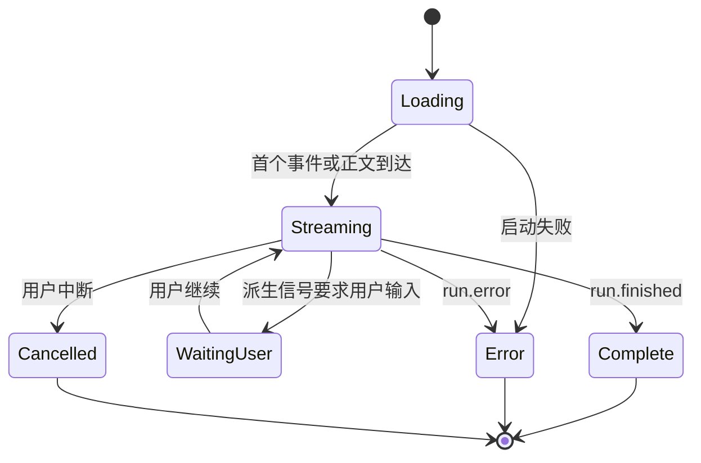
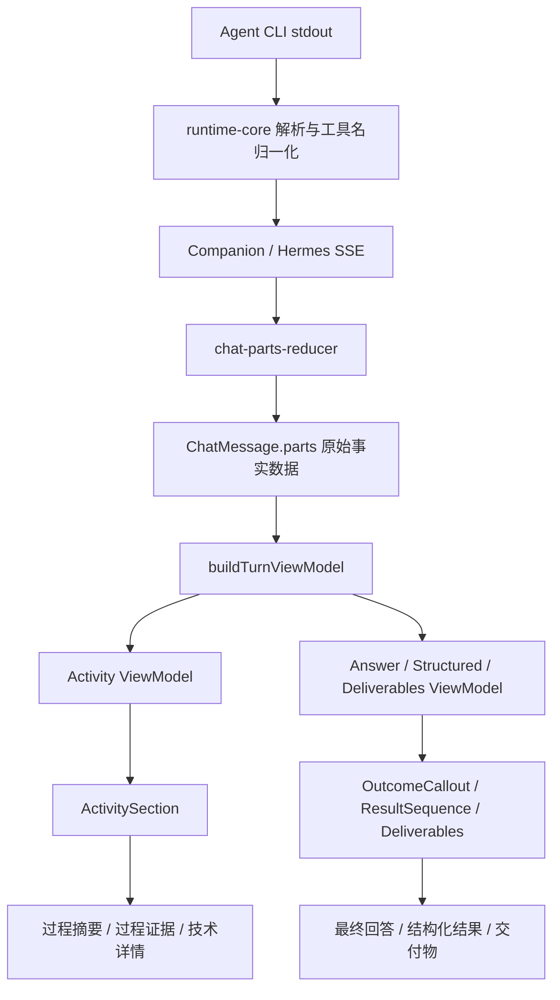

# 对话过程收束与结果展示实施方案

| 属性 | 内容 |
| --- | --- |
| 文档版本 | v1.3 |
| 日期 | 2026-07-15 |
| 状态 | 已评审，待实施 |
| 适用范围 | Web 对话页、桌面壳对话页、历史会话回放 |
| 核心决策 | 处理过程固定在上，最终结果固定在下；系统默认过程始终为固定高度单行，只有用户主动展开才增加高度 |
| 首期边界 | 仅调整 Web 展示层和折叠状态接线，不改 CLI、Companion、SSE 与 `ChatPart` 协议 |
| 视觉方向 | 参考 Cursor 类开发者工具的信息层级，实际样式严格复用小窗现有 token 与组件规范 |
| 关联文档 | `docs/design/chat-process-display-spec.md`、`docs/technical/chat-message-parts.md`、`docs/technical/agent-cli-activity-mapping.md` |

---

## 1. 方案摘要

当前助手消息把过程旁白、工具事件、文件操作、推理内容和最终回答放在同一条时间线中，造成三类问题：

1. 最终结果被大量低价值过程打断，用户难以快速定位结论。
2. 同一文件、图片或命令反复出现，完成后的消息仍像实时日志。
3. `reasoning`、Skill、内部状态和工具载荷等研发信息直接暴露，普通用户不知道这些内容的意义。

本方案不删除过程数据，也不延迟过程数据。目标是根据消息状态改变过程的展示密度：

- **运行中**：过程区域位于回答上方，以固定高度单行实时显示当前阶段和累计动作；用户可以主动展开完整过程。
- **完成后**：过程区域保持原位置和单行高度，只更新完成状态、最终计数与耗时；最终回答正文和交付物继续位于下方。
- **回看历史**：默认先看到一行过程摘要，再阅读完整结果；需要排查时可以展开原始证据。

最终稳定布局如下：

```text
处理过程：查看 3 张图片 · 编辑 2 个文件 · 运行 4 条命令 · 用时 42 秒
[默认收起，可点击展开]

最终回答正文

交付物 / 截图 / 文件
```

运行中的默认布局如下：

```text
正在验证页面 · 已查看 2 张图片 · 已编辑 1 个文件                 [展开]

正在生成的回答正文…
```

这里的关键不是“结果优先于时间顺序”，而是：

- 过程始终在上，符合先执行、后得到结果的时间关系。
- 结果始终在下，流式过程结束时不发生 DOM 大范围重排。
- 系统默认状态下，完成前后只更新单行文案和图标，不自动改变过程区域高度。
- 只有用户主动展开时，完整过程才会把结果向下推移；这是明确的用户操作反馈，而不是系统造成的布局跳动。

### 1.1 与参考截图的关系

参考截图可以作为“用户主动展开后仍能追溯过程”的方向参考，但不能作为默认完成态，也不能原样复制其完整时间线。截图中有四个值得保留与修正的部分：

| 截图特征 | 本方案处理 |
| --- | --- |
| 能看出先读取、再编辑、再继续处理 | 保留为一级展开态的阶段时序 |
| 文件条目可识别、可点击 | 保留，并对同一步骤内的重复读写聚合 |
| narration、读取、编辑和“思考”连续平铺 | 不保留；默认只显示一行，展开后也先显示精简阶段 |
| 大段“思考”卡片占据主要高度 | 放入二级技术详情，默认不挂载、不占高 |

三个目标状态必须明确区分：

```text
完成后默认：
处理过程：读取 1 个文件 · 编辑 1 个文件 · 用时 42 秒          [展开]

最终回答正文

交付物 / 文件
```

```text
用户主动展开：
处理过程：读取 1 个文件 · 编辑 1 个文件 · 用时 42 秒          [收起]
  1. 读取当前实现
     fishing_cat.html
  2. 调整人物形象
     编辑 fishing_cat.html
  3. 验证修改
     运行 1 条命令
  技术详情                                                         [展开]

最终回答正文
```

```text
技术详情展开：
处理过程 ...                                                       [收起]
  精简阶段仍保留
  技术详情                                                         [收起]
    原始状态 / Skill / reasoning / 工具 input-output / 原始时间线

最终回答正文
```

一级展开的目标是回答“按什么顺序做了哪些事”，二级技术详情才回答“每个底层事件和载荷是什么”。实现不得把一级展开直接等同于当前 `ActivityProcessList` 的逐 Part 时间线。

---

## 2. 当前实现与根因

### 2.1 已有能力

当前代码已经具备本次改造需要的大部分基础：

- `ChatPart` 已定义 `zone: "summary" | "activity"`。
- `ChatMessage` 已保存 `activityCollapse`。
- reducer 在运行结束时已经写入 `activityCollapse: "collapsed"`。
- 已有 `activitySummaryLabel()`、`isActivityExpanded()` 和 `toggleActivityCollapse()`。
- 已有 `canonicalOutput.finalAnswer.markdown` 作为标准最终回答来源。
- 已有文件、命令、工具批次、推理、交付物等独立渲染组件。
- 已有 `streamSeq`，可以保留过程区域内部的真实时序。

### 2.2 主要根因

当前 `buildTurnViewModel()` 生成的 `contentParts` 只排除了少量状态与调试 Part，仍包含：

- `narration`
- `reasoning`
- `tool`
- `command`
- `file_read`
- `document_read`
- `file_edit`
- `document_edit`

`AssistantMessageBubble` 又把整个 `contentParts` 交给 `ActivityProcessList`，因此主回答和执行过程被渲染到同一时间线中。

### 2.3 次要根因

1. `compactToolParts()` 只合并普通 `tool`，没有聚合同一路径的文件读写。
2. Bash 类工具同时生成 `command` 与 `tool`，视觉上可能重复。
3. `activityCollapse` 已存在但未接入助手消息的主渲染路径。
4. `reasoning` 和 `narration` 虽然属于 `activity`，仍在主消息中直接出现。
5. 当前文档存在方向冲突：一份文档要求结果与过程分层，另一份文档要求所有内容严格交错。

---

## 3. 实施原则

### 3.1 必须遵守

1. **不让用户空等**：运行中必须持续显示当前阶段或累计动作。
2. **不删除证据**：所有原始 Part 继续保存在消息中，展示聚合不修改持久化数据。
3. **不绑定 CLI**：React 展示组件不得根据 `agentId` 编写 Codex、Claude、Hermes 专属分支。
4. **不依赖 canonical output**：有 canonical output 时优先使用，没有时必须正常回退。
5. **不在完成时重排或自动改高**：过程在运行中和完成后始终位于结果上方，系统默认均保持固定高度单行。
6. **默认降低噪音**：普通用户默认不看原始 reasoning、Skill、内部状态和工具载荷。
7. **未知类型保守处理**：未知 summary 内容可见，未知 activity 内容进入技术详情。
8. **展示去重不等于数据去重**：首期只在 ViewModel 层聚合，不能破坏 Activity Log 和历史事件。
9. **状态必须有唯一解释入口**：页面不得直接把 `message.status` 当成完整 Turn 状态，必须经过统一的 `resolveTurnDisplayState()`。
10. **用户偏好不得被运行事件覆盖**：`user_expanded/user_collapsed` 由消息 UI 状态持有，SSE reducer 只提供系统默认提示。
11. **原始载荷先脱敏后展示**：隐藏或折叠不是安全边界，工具 input/output 必须先经过限制与脱敏。
12. **用户触发的布局变化优先保护阅读位置**：展开、收起和最终正文协调不能被通用贴底逻辑当成普通流式增长。
13. **长回答不能丢失运行上下文**：当前活动消息的过程摘要在正文滚动期间保持可见，但不得额外复制一套过程 UI。
14. **窄屏按语义降级**：摘要片段必须按状态优先级取舍，不能仅依靠字符串末尾省略。
15. **以用户结果衡量成效**：除工程正确性外，必须观察找到结果的时间、消息占屏高度、下一步操作时间和运行状态可见率。
16. **展开态保留阶段时序**：不能为了聚合把所有读取、编辑和命令全局重排；重复动作只在所属阶段内收束。

### 3.2 首期非目标

首期明确不做以下工作：

- 不修改 `CHAT_PARTS_PROTOCOL_VERSION`。
- 不新增 SSE 事件。
- 不要求 Companion 提供新的阶段字段。
- 不修改 Codex、Claude、Hermes 的 stdout 解析器。
- 不删除 `command + tool` 原始双事件。
- 不对 narration 做大模型语义摘要。
- 不重新设计整个聊天页面或工作区布局。
- 不引入新的前端主题、字体或颜色体系。
- 不将完整推理链作为普通用户功能重点。
- 不改变 `ChatMessage.status` 枚举来新增 `waiting_user`；等待状态由现有信号派生。

---

## 4. 目标信息架构

单条 assistant 消息固定分为以下区域：

| 顺序 | 区域 | 作用 | 默认可见性 |
| --- | --- | --- | --- |
| 1 | 等待用户提示 | 显示需要用户回答、选择或授权的动作 | 条件可见 |
| 2 | 处理过程 | 当前阶段、累计动作、过程详情、技术详情 | 摘要始终可见；详情按状态折叠 |
| 3 | Outcome 提示 | 失败、中断、等待、无结果等不会被正文掩盖的状态 | 条件可见 |
| 4 | 结果序列 | Markdown 正文与结构化结果，保留 summary zone 内的业务顺序 | 有内容时可见 |
| 5 | 交付物 | 文件、截图、成品与附件 | 有产物时可见 |

### 4.1 为什么处理过程必须在上

1. 它符合“执行发生在结果之前”的自然顺序。
2. 运行开始时，页面已经有稳定的过程容器，不需要等待正文出现。
3. 正文流式出现时只在过程下方增长；系统默认过程保持单行，不会持续把正文向下推。
4. 完成时只更新过程摘要，不需要折叠多行系统预览，也不需要把过程从底部移动到顶部。
5. 历史回看时，用户先看到简短执行摘要，再进入最终结果，信息关系清楚。

### 4.2 结果序列的顺序

结果区不能简单固定为“全部 Markdown → 全部结构化卡片”，否则会破坏 requirements、outline、图片、引用和推演卡片的业务语义。应生成有序的 `ResultItem[]`：

1. summary zone 的非正文 Part 继续按 `streamSeq` 排序。
2. 所有 `text/summary` 合并为一个合成正文项。
3. 合成正文项锚定在第一条 `text/summary` 的 `streamSeq` 位置。
4. clarification、requirements、outline、simulation、image、chart、citation 保持相对顺序。
5. deliverables 与去重后的 artifact 始终放在结果序列之后。
6. error、cancelled、complete-without-result 不作为普通 ResultItem，而进入前置 Outcome 提示。

### 4.3 过程区域内部层级

过程区域内部再分为三层：

| 层级 | 内容 | 默认状态 |
| --- | --- | --- |
| 过程摘要 | 当前阶段、动作计数、耗时、失败数 | 始终可见 |
| 过程证据 | 按时序排列的精简阶段；阶段内包含聚合后的文件、命令、搜索和工具动作 | 仅用户主动展开后可见 |
| 技术详情 | reasoning、Skill、原始 status、工具 input/output、未知 activity、原始逐事件时间线 | 默认隐藏 |

技术详情位于过程容器内部，但不应做成一张嵌套卡片。建议使用弱分隔线和二级 disclosure，保持视觉层级克制。

一级过程证据必须同时满足：

1. 阶段按 `streamSeq` 保持先后顺序，用户能理解“先做什么、后做什么”。
2. 同一阶段内对重复读取、重复编辑和 command/tool 双记录进行聚合。
3. narration/status 优先转化为阶段标题，不再作为大段正文与动作行重复出现。
4. 没有可靠阶段信号时，按连续动作批次形成保守阶段，不做大模型语义概括。
5. 原始事件仍可在技术详情中按真实顺序查看。

---

## 5. 状态与交互规范

### 5.1 `TurnDisplayState` 不是 `ChatMessage.status`

`ChatMessage.status` 只有 `loading`、`streaming`、`complete`、`error`、`cancelled`。`waiting_user` 不能加入该枚举，也不能仅通过 `message.status` 判断。展示层新增派生状态：

| TurnDisplayState | 语义 |
| --- | --- |
| `preparing` | 已创建消息，尚未进入稳定执行阶段 |
| `running` | 正在执行或生成 |
| `waiting_user` | 等待用户回答、选择、确认或授权 |
| `complete` | 已完成且存在可显示结果 |
| `complete_empty` | 运行已完成，但没有正文、结构化结果或交付物 |
| `error` | 整轮运行失败 |
| `cancelled` | 用户或系统中断 |
| `restoring` | 历史会话正在从 Run Record / Event 重建 |

### 5.2 派生状态解析顺序

统一实现 `resolveTurnDisplayState(message)`，所有组件和 Activity ViewModel 只能使用它的结果。优先级如下：

1. `message.status === "error"` 或 canonical outcome 为 failed → `error`。
2. `message.status === "cancelled"` 或 canonical outcome 为 cancelled → `cancelled`。
3. 存在未提交 clarification / requirements → `waiting_user`。
4. `canonicalOutput.nextAction.type === "ask_user"` → `waiting_user`。
5. 存在 waiting_user status Part、turn_meta 或 canonical outcome → `waiting_user`。
6. `message.status === "loading"` 且尚无有效事件 → `preparing`。
7. `message.status` 为 loading/streaming → `running`。
8. 消息正在执行远程事件恢复 → `restoring`。
9. 完成后存在正文、结构化结果或交付物 → `complete`。
10. 其余已结束情况 → `complete_empty`。

普通行内 `error` Part 可能是非阻断错误，不能仅凭任意 error Part 把整轮判为 `error`。终态优先使用 `message.status` 与 canonical outcome。

### 5.3 状态矩阵

| 派生状态 | 固定单行过程摘要 | Outcome 提示 | 结果序列 | 交付物 |
| --- | --- | --- | --- | --- |
| `preparing` | “正在准备…” | 无 | 通常为空 | 隐藏 |
| `running` | 实时阶段与累计计数 | 无 | 显示临时响应 | 有则保留 |
| `waiting_user` | 已完成动作摘要 | 等待用户卡置顶 | 保留已有内容 | 保留 |
| `complete` | 最终计数与耗时 | 无 | 显示权威结果 | 显示 |
| `complete_empty` | 最终过程摘要 | “任务已结束，但没有生成可显示的结果” | 空 | 无 |
| `error` | 失败状态与已完成动作 | 错误原因、恢复动作、“以下为部分结果” | 保留部分内容 | 保留已产生项 |
| `cancelled` | 中断状态与已完成动作 | “已中断，以下为中断前生成的部分结果” | 保留部分内容 | 保留已产生项 |
| `restoring` | “正在恢复任务状态…” | 无 | 保留已加载内容 | 保留 |

所有系统状态默认只显示固定高度单行摘要，不因 running、error 或 cancelled 自动展开过程证据。

### 5.4 折叠状态的唯一所有权

`message.activityCollapse` 是用户界面偏好的持久化来源；`AssistantPartsState.activityCollapse` 只表示运行生命周期给出的系统默认提示。合并规则：

1. 如果消息值为 `user_expanded` 或 `user_collapsed`，任何 SSE patch、finish、error、cancel、历史事件重放都必须保留该值。
2. 如果消息值是系统值 `expanded/collapsed` 或缺失，可以根据派生 Turn 状态和 reducer 默认值决定。
3. `applyPartsStateToMessage()` 合并时先检查消息上的 `user_*`，不得被 `partsStateRef` 覆盖。
4. 历史事件重放初始化时带入原消息的用户偏好，重放完成后再次应用 `user_*`。
5. 用户点击折叠只更新消息 UI 偏好，不修改原始 Activity Part。

现有字段的展示解释：

| activityCollapse | 用户偏好 | 默认显示 |
| --- | --- | --- |
| `expanded` | auto | 固定单行摘要；不自动展示多行过程 |
| `collapsed` | auto | 固定单行摘要 |
| `user_expanded` | expanded | 完整过程证据 |
| `user_collapsed` | collapsed | 固定单行摘要 |

最终 `displayMode` 只需要：

| displayMode | 说明 |
| --- | --- |
| `summary` | 固定高度单行摘要，所有系统状态默认模式 |
| `full` | 用户主动展开的完整过程证据 |

技术详情是 full 模式内部的独立局部状态，不写入 `activityCollapse`，也不引入第三种顶层展示模式。

### 5.5 用户操作与自动状态

- 用户主动展开后，运行完成不能自动收起。
- 用户主动收起后，新的 SSE 事件不能自动展开。
- 系统自动状态只更新单行摘要中的图标、阶段、计数和耗时。
- 如果焦点位于过程详情内部，任何系统事件都不能卸载该详情。
- 只有用户再次点击摘要按钮才改变 full/summary。

### 5.6 状态变化



状态变化只改变单行摘要和 Outcome 提示；是否渲染完整过程完全由用户偏好决定。

### 5.7 长回答中的运行态可见性

过程摘要虽然位于结果上方，但长回答持续增长后，原始摘要可能滚出视口。此时只保留 Composer 停止按钮或侧栏运行点，能够说明“还在运行”，却无法说明“当前正在做什么”。首期采用**当前活动消息内部粘顶**，不新增全局悬浮条：

1. 仅最新一条处于 `preparing`、`running` 或 `restoring` 的 assistant 消息启用粘顶摘要。这里的“最新活动消息”按消息时序和派生 Turn 状态确定，不是 `useActiveTurn()` 用于滚动导航的可见 Turn ID。
2. 摘要仍是 `ActivitySection` 中同一个 DOM 控件，使用消息容器内的 `position: sticky`；不得复制第二个摘要实例。
3. 粘顶边界不得越过当前 assistant 消息，用户滚回更早的 Turn 时不会看到后续任务的状态。
4. `waiting_user` 仍以 WaitingUser / Outcome 交互区为主要入口，不依赖粘顶摘要替代用户必须完成的操作。
5. `complete`、`complete_empty`、`error` 和 `cancelled` 终态立即取消粘顶，历史回看保持普通文档流。
6. 当前 `.chat-turn--active .chat-turn-user-panel` 已经粘顶。过程摘要必须进入同一个 sticky 栈，`top` 为用户问题面板实际底部加固定间距，不能与用户问题共用硬编码 top。
7. 用户问题高度可能受多行文本、附件和响应式布局影响。`ChatTurnList` 应通过 ref + `ResizeObserver` 将活动用户面板的实际高度写入 Turn 级 CSS 变量；无用户面板时回退到现有 `--chat-sticky-gap`。
8. 粘顶摘要使用不透明的现有 surface token、弱分隔线和受控 z-index，不能让正文穿透，也不能遮住用户问题或 ChatTopBar。
9. 粘顶本身不修改 `scrollTop`，不改变 pinned 状态，也不自动展开过程。
10. Composer 停止按钮和侧栏状态点继续保留，分别承担中断入口和跨会话状态；它们不重复显示阶段与动作计数。

这条规则保证“过程仍在结果上方”的 DOM 和阅读语义不变，同时让长任务中的当前阶段在视口内持续可见。

### 5.8 布局变化的来源与滚动所有权

滚动管理必须区分以下三类高度变化：

| 来源 | 示例 | 默认滚动策略 |
| --- | --- | --- |
| `stream_growth` | 新 token、新 Part、新消息 | 仅用户原本贴底时继续贴底；用户上滑后不打断阅读 |
| `user_disclosure` | 展开/收起过程、展开技术详情或工具详情 | 保持触发控件在视口中的位置，不自动滚到底部 |
| `answer_reconcile` | provisional 正文替换为 canonical final | 优先保持可复用正文块锚点；无锚点时保持现有 `scrollTop`，贴底用户继续贴底 |

现有 `useChatScrollPin()` 的 `ResizeObserver` 会把所有高度变化都交给 `applyPinnedScroll(false)`。如果用户在贴底状态点击展开，新增详情会触发 observer，并立即把视口拉到展开内容底部。实施时需要给滚动 Hook 增加一次性布局意图通道：

1. 用户点击 disclosure 前，记录 `reason`、消息 ID、触发按钮或首个可见锚点、锚点相对 scroll root 的 `top`，以及点击前是否 pinned。
2. React 提交 DOM 后，布局意图有效期内的每次相关 `ResizeObserver` 回调都不得执行通用贴底逻辑，而应按新旧锚点 `top` 差值补偿 `scrollTop`。
3. disclosure 动画存在时，意图保持到 `transitionend`；reduced motion 或无动画时，在连续两个 animation frame 高度稳定后结束。
4. 意图结束后重新测量 pinned 状态。展开后用户通常会离开底部，此时应显示“回到底部”，不能沿用点击前的 pinned 值。
5. 同期到达的 SSE 仍写入 DOM，但在用户布局意图窗口内不能抢占滚动所有权；意图结束后按最新位置重新判定，而不是补滚全部累计高度。
6. 收起过程、二级技术详情和工具详情使用同一机制，不能只修一级过程按钮。
7. 焦点继续留在触发按钮；键盘展开与鼠标展开遵循相同行为。
8. 新消息发送、用户点击“回到底部”和显式会话切换可以覆盖尚未结束的旧布局意图。

滚动意图是瞬时 UI 状态，不写入 `ChatMessage`，不持久化，也不进入 SSE 或 CLI 协议。

---

## 6. Part 分类规则

分类以 `zone` 为第一依据，以 `kind` 为覆盖规则。

### 6.1 主回答与结构化结果

| Part kind | 目标区域 | 处理规则 |
| --- | --- | --- |
| `summary` | 结果序列 | 与 text 合并为一个合成正文项，锚定第一条正文的 streamSeq |
| `text` | 结果序列 | 流式阶段作为临时响应，完成后由标准最终回答替代 |
| `clarification` | 等待用户 / 结构化结果 | 始终可见并保持交互能力 |
| `writing_requirements` | 结构化结果 | 始终可见 |
| `ppt_requirements` | 结构化结果 | 始终可见 |
| `3d_requirements` | 结构化结果 | 始终可见 |
| `video_requirements` | 结构化结果 | 始终可见 |
| `simulation_requirements` | 结构化结果 | 始终可见 |
| 各类 `*_requirement_summary` | 结构化结果 | 保持现有卡片 |
| 各类 `*_outline` | 结构化结果 | 保持现有卡片和确认逻辑 |
| `simulation_scenario` | 结构化结果 | 保持业务逻辑 |
| `simulation_summary` | 结构化结果 | 保持业务逻辑 |
| `simulation_next_action` | 结构化结果 | 保持业务逻辑 |
| `simulation_suggestion` | 结构化结果 | 保持业务逻辑 |
| `image` | 结构化结果 | 显示图片 |
| `chart` | 结构化结果 | 显示图表 |
| `research_map` | 结构化结果 | 显示研究导图 |
| `citation` | 结构化结果 | 保留 summary zone 内的相对 streamSeq 顺序 |

### 6.2 交付物

| Part kind | 目标区域 | 处理规则 |
| --- | --- | --- |
| `artifact` | 交付物 | 与 deliverables 按规范化路径去重 |
| `deliverables` | 交付物 | 优先作为本轮成品列表 |

如果 `artifact` 与 `deliverables.items` 指向同一路径：

- 主交付区域只显示一次。
- 优先保留 `deliverables` 中更完整的标签、MIME 和 primary 信息。
- 原始 artifact Part 不删除，仍可在数据和调试路径中访问。

### 6.3 用户可读过程

| Part kind | 目标区域 | 处理规则 |
| --- | --- | --- |
| `narration` | 阶段标题候选 / 技术详情 | 运行中可提供 currentStage；展开后优先作为 Episode 标题，不单独平铺成长段正文 |
| `status` | 过程摘要 / 阶段标题候选 | 用户可理解的阶段用于摘要或 Episode 标题，原始状态进入技术详情 |
| `tool` | 过程证据 | 按工具族聚合 |
| `tool_batch` | 过程证据 | 计数进入摘要，明细进入展开区 |
| `command` | 过程证据 | 作为 Bash 的主要可见形式 |
| `file_read` | 过程证据 | 按路径聚合 |
| `document_read` | 过程证据 | 按路径聚合 |
| `file_edit` | 过程证据 | 按路径聚合 |
| `document_edit` | 过程证据 | 按路径聚合 |
| `turn_meta` | 过程摘要 | 提供耗时与运行状态 |

### 6.4 技术详情

| Part kind | 目标区域 | 处理规则 |
| --- | --- | --- |
| `reasoning` | 技术详情 | 默认隐藏，不作为最终答案来源 |
| `skill` | 技术详情 | 显示 Skill 名称和角色，仅排障使用 |
| `status_chip` | 技术详情 | 默认隐藏 |
| `json` | 技术详情 | 默认隐藏，展开后限制高度 |
| 原始工具 input/output | 技术详情 | 只在用户主动展开时渲染 |
| 未知 activity kind | 技术详情 | 保留 Unsupported 提示，不污染主回答 |

### 6.5 特殊 Part

| Part kind | 规则 |
| --- | --- |
| `todo` | 继续由 Pinned Todo 展示，气泡内部不重复 |
| `error` | 提升到 Outcome 区或过程失败详情；非阻断 error 不改变整轮终态 |
| `simulation_node` / `simulation_edge` / `simulation_path` | 继续服务推演画布，不因气泡分层而丢失数据 |
| 未知 summary kind | 在结构化结果区显示 Unsupported 提示，不能静默隐藏 |

---

## 7. 最终回答选择与去重

### 7.1 完成态来源优先级

完成态最终正文按以下优先级选择：

1. `canonicalOutput.finalAnswer.markdown`
2. `summary` / `text` Part 合并结果
3. `message.content`

### 7.2 流式内容是临时响应

流式态按以下优先级选择：

1. 当前 `text` / `summary` Part 合并结果
2. 已到达但尚未完成的 canonical 文本，仅作为兜底
3. `message.content`

流式 `text` 不能在数据模型中命名为 final answer。不同 CLI 可能在工具调用前发送普通文本，`message.interim` 也不能覆盖所有 provider 的语义差异。ViewModel 应输出：

| 字段 | 说明 |
| --- | --- |
| `answerPhase: "provisional"` | loading/streaming 阶段的临时响应 |
| `answerPhase: "final"` | complete/error/cancelled 后选定的权威或部分结果 |

UI 不必显示“临时响应”标签，但代码和测试必须区分这两个阶段。

### 7.3 完成时的协调规则

- `loading` 和 `streaming` 阶段不要用最终 canonical output 覆盖正在增长的 text。
- `complete` 后一次性将 canonical final answer 作为权威正文。
- 切换时保持最终正文容器稳定，避免重复显示旧 text 和 canonical answer。
- canonical final 非空时，完成态只显示 canonical final，不再同时渲染旧 text。
- canonical final 为空时，继续使用合并后的 text/summary。
- provisional text 被 canonical 替换后仍保留在原始 parts 中，但不自动搬入用户可读过程区。
- 如果 canonical final 与 provisional text 明显不同，这是合法协调，不使用淡出、位移动画掩盖内容变化。
- error/cancelled 时没有权威 final answer，则把现有 text 标记为“部分结果”并保留。

完成态正文协调还必须遵守阅读位置规则：

1. provisional 与 final 复用同一个回答容器和稳定 React key，`answerPhase` 不能作为 remount key。
2. Markdown 渲染层应给标题、段落、列表、代码块等顶层块提供仅用于本地滚动恢复的稳定锚点。锚点可由块类型、规范化文本的本地不透明 hash 和同 hash 出现序号构成，不暴露原文，也不进入埋点。
3. 协调前记录第一个可见回答块及其相对 scroll root 的位置；协调后若 final 中仍有该块，按位置差补偿 `scrollTop`。
4. 如果没有可复用块，未贴底用户保持原 `scrollTop`；final 变短导致总高度不足时，只允许浏览器钳制到最近有效位置，不能主动跳到回答开头或页面底部。
5. 原本贴底的用户在协调后继续贴底，因为其阅读意图是跟随最新输出。
6. 完成协调只执行一次且幂等；重复 `run.finished` 或历史事件重放不能再次触发滚动恢复。
7. 不用淡出、骨架屏或高度动画掩盖正文替换；这些效果会延长用户确认最终结果的时间。

如果首期 MarkdownRenderer 无法低风险提供块级锚点，允许先以“稳定回答容器 + scrollTop 保持”作为降级实现，但必须保留较短 final、较长 final 和无共同文本三类 E2E，块级锚点仍是正式发布目标，不应从方案中删除。

### 7.4 正文去重

正文去重只处理以下明确情况：

- 完全相同的 Markdown。
- 规范化空白后完全相同。
- 长文本中一个版本完整包含另一个版本，且短文本长度超过安全阈值。
- `message.interim.alreadyStreamed === true` 时不得再次加入正文或 narration。

不得进行模糊语义去重，避免把两个相似但不同的结论误删。

### 7.5 结构化卡片去重

- clarification、requirements、outline 以 Part ID 和业务 ID 为准。
- deliverables 和 artifact 以规范化路径为准。
- 图片以 src 为准。
- citation 以来源标识或 URL 为准；缺少稳定标识时不激进去重。

---

## 8. Activity ViewModel 设计

建议新建纯函数模块 `web/src/lib/chat-activity-view-model.ts`，不引用 React，不修改输入数组。

### 8.1 输入

- `message.parts`
- `message.status`
- `message.activityCollapse`
- `message.runStartedAt`
- `message.canonicalOutput`
- `message.canonicalEvents`（仅运行时可选，用于 callId 身份关联；持久化后不能依赖）

### 8.2 输出

| 字段 | 说明 |
| --- | --- |
| `displayMode` | summary 或 full |
| `state` | `resolveTurnDisplayState()` 返回的派生状态 |
| `headline` | 当前阶段或完成状态 |
| `summaryLabel` | 读取、搜索、编辑、命令、耗时等摘要 |
| `summarySegments` | 带 kind、priority、fullText、compactText 的语义片段，供不同视口按状态取舍 |
| `currentStage` | 当前用户可理解的阶段文案 |
| `occurrences` | 去除生命周期重复后的真实动作序列 |
| `episodes` | 按 streamSeq 排列的用户可读阶段；每个阶段内部聚合重复动作 |
| `activityParts` | 保持原始 ChatPart[] 兼容路径，供推演模块和技术时间线使用 |
| `debugParts` | reasoning、Skill、内部状态、原始载荷 |
| `durationMs` | 本轮耗时 |
| `hasErrors` | 是否存在失败工具或 Error Part |
| `errorCount` | 失败数量 |
| `rawPartCount` | 原始 Activity Part 数量，仅用于诊断 |

### 8.3 中间层 `ActivityOccurrence`

Part 不能直接等同于“一次真实操作”：同一调用可能经历 running/success 两个事件，Bash 还会同时产生 command/tool。聚合前先构造不持久化的 occurrence：

| 字段 | 说明 |
| --- | --- |
| `occurrenceId` | callId 优先；无 callId 时使用保守的派生 ID |
| `family` | read、search、edit、command、other |
| `status` | running、success、error、cancelled、unknown |
| `label` | 用户可读摘要 |
| `sourcePartIds` | 对应全部原始 Part ID |
| `firstStreamSeq` | 首次出现顺序 |
| `lastStreamSeq` | 最后更新顺序 |
| `resourceKey` | 可选路径、URL 或命令身份键 |

身份来源优先级：

1. canonical event / tool Part 的 callId。
2. reducer 明确生成的相邻 command + Bash tool 模式。
3. 完全一致的资源键与严格限定的 streamSeq 邻接。
4. 无法确认时创建独立 occurrence，不能激进合并。

### 8.4 中间层 `ActivityEpisode`

`ActivityOccurrence[]` 解决“一次真实操作被多个 Part 重复记录”，但不能直接解决参考截图中的阅读问题。一级展开态还需要一个不持久化的 `ActivityEpisode[]`，在保留时序的同时收束连续动作：

| 字段 | 说明 |
| --- | --- |
| `episodeId` | 本地稳定 ID，不进入持久化协议 |
| `label` | 用户可理解的阶段标题；来自受控 status、简短 narration 或动作族回退 |
| `status` | running、success、error、cancelled、unknown |
| `firstStreamSeq` | 阶段开始顺序 |
| `lastStreamSeq` | 阶段结束顺序 |
| `occurrences` | 该阶段内按首次出现顺序排列的聚合动作 |
| `familyCounts` | read、search、edit、command、other 的阶段内计数 |
| `sourcePartIds` | 可追溯的全部原始 Part ID |

Episode 构造规则：

1. 有意义的 waiting/status/narration 阶段变化可以开启新 Episode。
2. 完全相同或规范化后相同的相邻阶段标题合并，不能生成多个连续“正在读取”。
3. `accepted`、`connecting`、provider 初始化和纯 Skill 状态不能开启用户可读 Episode。
4. 同一 Episode 内按 family/resourceKey 聚合重复动作，但 `occurrences` 首次出现顺序不变。
5. 同一资源在不同 Episode 中出现时分别保留，例如“读取配置”和“验证后再次读取”不能全局合并成一行；全局摘要仍按唯一资源计数。
6. narration/status 后没有对应动作时，只有它表达用户可理解的实质阶段才保留；“好的”“继续处理”等空泛句丢弃或进入技术详情。
7. 缺少阶段标记时，按连续动作族变化形成保守 Episode，例如连续 read 合并、随后 edit 开启下一阶段；不能调用大模型重新总结。
8. Episode 最终按 `firstStreamSeq` 排序，禁止再按 read/search/edit/command 固定族顺序全局重排。
9. 所有原始事件继续通过 `activityParts` 和 `sourcePartIds` 可追溯，Episode 只改变一级展示。

动作族仍用于阶段内部的标签、计数和聚合：

| family | 用户文案 | 包含内容 |
| --- | --- | --- |
| `read` | 读取与查看 | 文件、文档、图片读取 |
| `search` | 搜索与检索 | grep、search、web search、MCP 查询 |
| `edit` | 文件修改 | 文件与文档编辑 |
| `command` | 命令执行 | Bash、shell、terminal |
| `other` | 其他操作 | 无法归类但可理解的工具 |

---

## 9. 聚合与去重算法

### 9.1 基本原则

- 聚合只改变展示模型，不改变 `message.parts`。
- 摘要中的文件数量默认表示唯一文件数。
- 展开区可以同时显示“唯一资源数”和“实际操作次数”。
- 无法可靠判断是否重复时，宁可保留。
- 聚合结果必须可追溯回原始 Part ID 列表。

### 9.2 路径规范化

用于比较的规范化路径执行：

1. 去掉首尾空白。
2. 将反斜杠转换为正斜杠。
3. 合并重复分隔符。
4. 保留大小写，不主动 lowercase，避免大小写敏感文件系统误合并。
5. 不解析 `..` 到真实文件系统，避免展示层引入路径副作用。
6. UI 标签使用 basename，title 和打开行为继续使用原始完整路径。

### 9.3 文件读取

全局摘要计数键：

```text
read:{normalizedPath}
```

Episode 内展示键：

```text
{episodeId}:read:{normalizedPath}
```

规则：

- 同一路径读取 6 次，摘要统计为“读取 1 个文件”。
- 6 次读取属于同一 Episode 时，展开区显示“文件名 ×6”。
- 同一路径出现在不同 Episode 时，各阶段分别显示该文件及阶段内次数，不能用全局摘要键合并展示行。
- 有 lineRange 时，作为该文件下的明细保留。
- 相同 lineRange 重复出现可以显示次数，不直接删除。
- document_read 与 file_read 指向同一路径时可以合并到同一资源，但保留类型标签。

### 9.4 图片识别

只有满足以下任一条件时，摘要才使用“查看 N 张图片”：

1. Part 或关联 artifact 提供受信任的 `image/*` MIME。
2. 规范化路径扩展名属于受控集合：`.png`、`.jpg`、`.jpeg`、`.webp`、`.gif`、`.avif`、`.bmp`、`.tif`、`.tiff`、`.heic`。
3. 已知截图/图像查看工具提供明确的结构化类型，不依赖自然语言猜测。

无法可靠识别时使用“读取 N 个文件”或“处理 N 项”，不能为了更生动而猜成图片。浏览器截图与本地图片读取分别保留 occurrence，但摘要可合并为“查看 N 张图片”。

### 9.5 文件编辑

全局摘要计数键：

```text
edit:{normalizedPath}
```

Episode 内展示键：

```text
{episodeId}:edit:{normalizedPath}
```

规则：

- 同一路径多次编辑在摘要中计为一个文件。
- 同一 Episode 内显示“编辑 N 次”；跨 Episode 的修改分别保留在对应阶段。
- additions/deletions 不跨事件盲目累加。
- 优先显示最后一个同时包含 additions/deletions 的可信 Part。
- diffPreview 只在用户展开对应文件时加载或渲染。
- document_edit 和 file_edit 可以归入同一“文件修改”组。

### 9.6 Bash `command + tool` 视觉去重

当前 reducer 对 Bash 同时生成 `command` 和 `tool`。首期不改 reducer，通过展示模型配对。

配对优先级：

1. canonical event 或 tool Part 的相同 `callId`。
2. 当前 reducer 已知模式中，command 与 Bash tool 的规范化命令完全相同。
3. 两个事件在 `streamSeq` 上严格相邻或处于已测试的限定距离内。
4. 状态时间关系符合同一次 running 到 success/error 生命周期。

配对成功后：

- 普通过程区只显示 `command` 行。
- 摘要只计一条命令。
- `tool.input`、`tool.output` 和 callId 进入技术详情。
- 原始两个 Part 都保留在 sourcePartIds 中。

配对失败时：

- 不强行合并。
- 两项都进入完整过程或技术详情。
- 两项都保留并分别计数；宁可暂时多计，也不能把真实重复执行误删。
- 将无法配对的 Bash 双记录纳入诊断指标，推动后续通过 callId 解决。

### 9.7 普通工具

- 优先使用 callId 识别一次调用。
- running、success、error 是一次调用的状态，不是多次调用。
- tool_batch 中每个 item 作为一个调用参与计数。
- 已经被 command 吸收的 Bash tool 不再参与普通工具计数。
- 未知工具归入 `other`，摘要显示“处理 N 项”，不直接显示陌生工具名。

### 9.8 Narration

- 运行中只选最近一条非空 narration 作为 live 辅助内容。
- 完成后 narration 不进入摘要；有实质含义的简短 narration 优先成为 ActivityEpisode 标题。
- narration 成为 Episode 标题后不再作为独立正文行重复渲染。
- 过长 narration 只提取受控长度的首个完整句作为标题，完整内容进入技术详情；不调用大模型改写。
- 完全相同的 narration 去重。
- 规范化后一个长文本完整包含另一个文本时，可保留更完整版本。
- 不对短句进行包含去重，避免“正在验证”和“验证完成”被误判。
- 不把 narration 当作最终回答。

对于被 provider 标记为 `text/summary` 的“我先读取文件”等疑似过程文字，不使用中文/英文关键词或句式启发式强行改成 narration：

1. canonical final 存在时，终态按 7.1 用 canonical 替换 provisional text，过程文字自然不进入最终结果。
2. Part 已明确为 activity/narration 时，按 Episode 规则处理。
3. 缺少 canonical 且 Part 被明确标记为 summary/text 时，保守保留在结果区，避免误删真实回答。
4. 这类来源映射误差记录为 provider fixture 问题，后续应在 parser / mapping 层修正，不在 React 中维护语言关键词表。

### 9.9 Status

状态分为用户可读状态与内部状态。

用户可读状态包括：

- 正在读取文件
- 正在搜索资料
- 正在分析
- 正在生成
- 正在验证
- 等待你选择或确认

内部状态包括：

- accepted
- requesting
- connecting
- provider/model 初始化细节
- Skill slug
- run id

选择 currentStage 的优先级：

1. waiting_user 的明确动作。
2. 最近的用户可读 status。
3. 最近的 running tool 对应的人话文案。
4. 最近的 narration 简短版本。
5. 通用“处理中”。

内部状态不直接进入主摘要，只在技术详情中保留。

### 9.10 Reasoning

- 不计入工具数量。
- 不进入最终回答。
- 不用于生成 currentStage，除非只显示通用“思考中”。
- 默认收进技术详情。
- reasoning 原文过长时限制高度，并且只在主动展开后挂载。
- “思考 12 秒”属于时间信息，不等于展示 reasoning 原文。

### 9.11 技术载荷安全

工具 input/output、命令输出、JSON 与 reasoning 在进入 React 渲染前必须经过 `sanitizeActivityDetail()`：

1. 按键名递归遮盖 `authorization`、`api_key`、`apiKey`、`token`、`secret`、`password`、`cookie` 等敏感字段。
2. 对字符串识别 Bearer Token、常见 API Key、私钥头和高熵凭据模式。
3. 限制递归深度、对象键数量、数组长度和最终字符数。
4. 二进制、base64 大块和不可序列化值只显示类型与大小摘要。
5. 脱敏发生在格式化和复制之前，不能只通过 CSS 隐藏。
6. 普通用户界面不提供“一键复制全部原始载荷”。
7. 分享、导出和截图模式默认排除技术详情。
8. 原始 parts 是否持久化属于现有数据策略；本次至少保证新增 UI 不直接放大敏感内容暴露面。

---

## 10. 过程摘要文案规范

### 10.1 固定顺序

摘要片段固定按以下顺序生成：

```text
查看/读取 → 搜索/检索 → 编辑 → 命令 → 其他 → 失败 → 耗时
```

### 10.2 示例

- `查看 3 张图片 · 编辑 2 个文件 · 运行 4 条命令 · 用时 42 秒`
- `读取 3 个文件 · 搜索 2 次 · 用时 18 秒`
- `编辑 1 个文件 · 运行 2 条命令 · 1 项失败`
- `正在验证页面 · 已查看 2 张图片 · 已编辑 1 个文件`
- `等待你选择目录 · 已读取 4 个文件`
- `已中断 · 保留 2 个已修改文件`

### 10.3 长度控制

- ViewModel 不能只输出一条已经拼接好的字符串；应同时输出带 `kind`、`priority`、`fullText` 和 `compactText` 的 `summarySegments[]`，由响应式组件选择片段。
- 桌面端默认最多显示 4 个摘要片段；窄屏默认显示 1～2 个，其余收束为“等 N 项操作”。
- `preparing/running/restoring` 的窄屏优先级：当前阶段或运行状态 → 等待/警告/失败信号 → 主要动作计数 → 耗时。
- `waiting_user/error/cancelled/complete_empty` 的窄屏优先级：必须处理的状态 → 失败或部分结果信号 → 已完成主要动作 → 耗时。
- `complete` 的窄屏优先级：主要动作计数 → 失败数 → 耗时 → 次要动作计数。
- “主要动作”按用户结果价值选择，默认优先编辑/生成、命令、查看/读取、搜索/检索、其他；同等级保持固定摘要顺序，不因事件到达顺序跳动。
- 无论多窄，状态图标、最高优先级片段和 disclosure 图标都不能被挤掉；最低宽度下只允许最高优先级文本自身省略。
- 摘要不能先拼完整句再用 CSS 从末尾截断，因为这会稳定地丢掉后置的失败与耗时信息。
- 按钮的可访问名称必须包含完整摘要；完整信息还可放入辅助描述，不能只依赖 hover title。
- basename 过长时使用 compactText 或截断，完整路径只在展开详情中显示。

### 10.4 空过程

以下情况不显示过程区域：

- 没有任何可渲染 Activity。
- 只有被过滤的 connect/accepted 状态，且任务已经完成。
- 历史消息只有正文，没有过程 Part。

不要显示“无执行过程”或“过程 0 项”。

---

## 11. 组件结构

目标组件树：

```text
AssistantMessageBubble
├── WaitingUserCallout
├── ActivitySection
│   ├── ActivitySummaryButton
│   ├── ActivityEvidenceList
│   └── TechnicalDetailsDisclosure
├── OutcomeCallout
├── ResultSequence
│   ├── SynthesizedAnswerItem
│   └── StructuredResultItem
├── DeliverablesSection
│   └── DeliverablesCard / ArtifactRow
```

### 11.1 `ActivitySection`

建议新增：

```text
web/src/components/chat/parts/ActivitySection.tsx
```

职责：

- 渲染过程摘要按钮。
- 根据 displayMode 渲染 summary 或 full。
- 接收当前消息是否为最新活动消息，在运行阶段为同一个摘要控件增加消息内 sticky 行为。
- 处理一级过程折叠。
- 处理二级技术详情折叠。
- 在所有 disclosure 切换前上报 `user_disclosure` 滚动意图和锚点元素。
- full 模式调用新的 ActivityEvidenceList 渲染聚合证据。
- 不负责 Part 分类和聚合。

### 11.2 `ActivitySummaryButton`

使用原生 `<button>`，包含：

- Chevron 图标。
- 运行中 spinner 或状态图标。
- 按优先级选择后的 `summarySegments`，而不是不可拆分的整句摘要。
- 可选耗时。
- `aria-expanded`。
- `aria-controls`。
- 明确的可访问名称，例如“展开处理过程，查看 3 张图片、编辑 2 个文件、运行 4 条命令”。

不得使用只有 click handler 的 div。

摘要按钮在所有系统状态下保持稳定高度，运行中只更新一行文字和状态图标。不能在按钮下方自动插入“最近活动”预览。

运行态 sticky 复用该按钮外层容器；按钮自身保持相同尺寸、语义、焦点和 `aria-controls`，避免普通态与 sticky 态切换时 remount。

### 11.3 `ActivityEvidenceList`

- 接收 `ActivityEpisode[]`，严格按 Episode 的 `firstStreamSeq` 显示精简阶段。
- Episode 内按 occurrence 首次出现顺序显示聚合动作，不按 read/search/edit/command 全局重排。
- 阶段标题已经表达“读取 1 个文件”且只有一个动作时，不再重复一层同义组标题；直接显示可点击文件行。
- 每个文件、命令和工具项可进一步展开详情。
- 文件行继续支持点击打开工作区。
- 命令详情继续支持查看 input/output。
- 超过 12 个 Episode 时默认显示最近 8 个，并提供“更早 N 个步骤” disclosure；这是 full 模式内部的长度控制，不影响全局 summary/full 偏好。
- 单个 Episode 超过 8 个动作时显示前 5 个和阶段计数，其余通过“另外 N 项”展开，不能把整条消息无限撑长。
- 不改变现有 `ActivityProcessList(ChatPart[])` 的公共 API；原始逐 Part 时间线只在技术详情或推演模块中复用。

### 11.4 `TechnicalDetailsDisclosure`

- 默认收起。
- 标签使用“技术详情”，不使用“思考过程”作为整个区域名称。
- reasoning 在技术详情内部仍保持单独折叠。
- Skill、status、status_chip、未知工具和原始载荷按时间顺序展示。
- 可复用 `ActivityProcessList(activityParts)` 提供原始时间线，但不得在一级 ActivityEvidenceList 中直接渲染。
- 技术详情不得使用主强调色抢占注意力。
- 所有载荷先经过 `sanitizeActivityDetail()`，再交给现有 PartRenderer 或专用详情组件。

### 11.5 `OutcomeCallout`

- waiting_user：明确用户需要做什么，保留原交互卡。
- error：回答“发生了什么、已知原因、用户能做什么”，并提示后续内容是部分结果。
- cancelled：提示已中断，后续内容是中断前结果。
- complete_empty：提示任务已结束但没有可显示结果，并提供重试或继续操作。
- 普通 complete/running 不渲染 OutcomeCallout。

### 11.6 `ResultSequence`

- 接收按 summary zone `streamSeq` 构造的 `ResultItem[]`。
- 合成正文项只接收 provisional/final Markdown，不接收 activity。
- provisional/final 复用稳定的 SynthesizedAnswerItem 容器，协调前后不得更换 React key。
- `ChatMarkdown` 为顶层 Markdown block 暴露本地 `data-scroll-anchor`，供 `answer_reconcile` 恢复阅读位置。
- 负责 requirements、outline、simulation、image、chart、citation 等结构化结果项。
- 保留当前提交、继续、草稿更新和 outline commit 回调。
- 不得因为主回答重构而破坏 AI-to-UI 卡片交互。

---

## 12. 逐文件实施范围

### 12.1 必改文件

| 文件 | 当前职责 | 实施内容 |
| --- | --- | --- |
| `web/src/lib/chat-turn-view-model.ts` | 构造消息展示数据 | 拆分 activity、answer、structured、deliverables、errors；移除混合 contentParts 职责 |
| `web/src/lib/chat-parts-utils.ts` | Part 工具函数 | 增加用户偏好优先的折叠合并；保留兼容函数 |
| `web/src/lib/chat-parts-reducer.ts` | 构造与应用 PartsState | `applyPartsStateToMessage` 保留消息上的 `user_*`，终态和重放不得覆盖用户偏好 |
| `web/src/components/chat/parts/AssistantMessageBubble.tsx` | 助手消息总布局 | 固定“过程在上、结果在下”的 DOM 顺序 |
| `web/src/components/chat/parts/ChatMarkdown.tsx` | Markdown 分块渲染 | 为可复用顶层块提供稳定本地滚动锚点；不改变正文语义与样式 |
| `web/src/components/chat/parts/ActivityTimeline.tsx` | 原始 Activity 时间线 | 保持 `ChatPart[]` API；移除 `slice().some()` 的 O(n²) 扫描 |
| `web/src/components/chat/parts/ToolCardRow.tsx` | 工具详情 | 未展开时不序列化载荷；接入脱敏、深度和长度限制 |
| `web/src/components/chat/ChatTurnList.tsx` | Turn 列表 | 透传 activity collapse 与滚动意图回调；按消息时序和派生状态确定 latestExecutingMessageId，不复用 activeTurnId；测量活动用户问题高度供 sticky 栈使用 |
| `web/src/components/chat/ChatMessageList.tsx` | 兼容消息列表 | 同步透传回调 |
| `web/src/components/chat/ChatThread.tsx` | 消息状态与持久化 | 按 message ID 更新 `activityCollapse` |
| `web/src/components/chat/useChatScrollPin.ts` | 流式贴底与 ResizeObserver | 区分 stream_growth、user_disclosure、answer_reconcile；增加锚点补偿与意图结束后的重新测量 |
| `web/src/lib/simulation-topic-analysis-activity.ts` | 推演分析过程选择器 | 从新 ViewModel 的 activity 字段读取，不能继续依赖被移除的 contentParts |
| `web/src/app/globals.css` | 全局样式与 token 使用 | 增加过程摘要、展开区和状态样式，严格复用现有 token |
| `web/tests/e2e/chat.spec.ts` | 对话 E2E | 增加完成态、实时态、折叠、重复聚合和回归测试 |

### 12.2 建议新增文件

| 文件 | 职责 |
| --- | --- |
| `web/src/lib/chat-activity-view-model.ts` | Activity 分类、聚合、摘要与视觉去重纯函数 |
| `web/src/lib/chat-turn-display-state.ts` | 统一派生 preparing/running/waiting/complete/error/cancelled 等展示状态 |
| `web/src/lib/activity-detail-sanitize.ts` | 工具载荷脱敏、限深、限长和二进制摘要 |
| `web/src/lib/chat-scroll-anchor.ts` | 可选：布局意图、锚点捕获和恢复的 DOM 辅助函数；不保存业务数据 |
| `web/src/components/chat/parts/ActivitySection.tsx` | 固定单行过程摘要、完整过程与技术详情容器 |
| `web/src/components/chat/parts/ActivityEvidenceList.tsx` | 聚合后的用户可读过程证据 |
| `scripts/verify-chat-activity-view-model.ts` | 无浏览器纯函数 fixture 验证 |

### 12.3 首期不改文件

| 文件或模块 | 原因 |
| --- | --- |
| `packages/contracts/src/chat.ts` | 现有 zone、kind、collapse 已足够；不新增 waiting_user 消息状态 |
| `packages/runtime-core/src/map-tool-progress.ts` | 已完成 CLI 工具归一化，首期不需要协议调整 |
| `companion/src/runs/*` | SSE 数据不变 |
| Codex / Claude parser | 通过统一 ChatPart 兼容 |
| 数据库存储结构 | 原始消息数据不变，无迁移需求 |

### 12.4 后续可选改动

展示层稳定后再考虑：

- reducer 对 Bash 只生成一个富 command Part。
- command Part 增加 callId、input、output 等字段。
- canonical output 提供更稳定的阶段摘要。
- 设置页增加“默认展开处理过程”或“开发者技术详情”选项。

这些改动需要协议评审，不纳入首期。

---

## 13. 数据流



边界说明：

- A 到 E 保持不变。
- 本次主要修改 F 到 L。
- E 始终是完整事实数据，G 和 H 只是可丢弃、可重算的展示模型。

---

## 14. CLI 与历史兼容

### 14.1 Codex CLI

典型输入：

- `status`
- `command`
- Bash `tool`
- `text`
- 可选 canonical output

预期：

- command 与 Bash tool 视觉去重。
- 状态进入过程摘要。
- commentary phase 继续进入 narration；非 commentary text 作为 provisional response，完成后再协调为 final。
- 没有文件事件时不虚构文件数量。

### 14.2 Claude Code

典型输入：

- `reasoning`
- `Read` / `Edit` / `Write`
- Bash
- WebSearch
- `text`

预期：

- reasoning 默认隐藏。
- 文件读写按路径聚合。
- Bash 只显示一个普通过程条目。
- thinking delta 不进入结果序列。
- 工具调用前的普通 text 先作为 provisional response，不能假定已经是最终结论。

### 14.3 Hermes Gateway

典型输入：

- `hermes.tool.progress`
- `message.delta`
- 可能没有 canonical output

预期：

- 从 parts 或 content 正常回退。
- 未知工具进入 other 或技术详情。
- 没有 canonical output 不影响最终回答显示。

### 14.4 Plain CLI 回退

典型输入只有最终正文。

预期：

- 不显示空过程区域。
- 正文正常显示。
- 不因缺少 run metadata 报错。

### 14.5 Mock / simulate

- 使用与真实 CLI 相同的分类与聚合函数。
- 不为 Mock 编写专属 UI。
- 现有演示数据应更新快照预期，但不需要改变事件协议。

### 14.6 历史会话

| 历史数据形态 | 兼容策略 |
| --- | --- |
| 只有 `content` | 转换为一个 summary，不显示过程区 |
| 有 parts、无 canonical | 从 summary/text 回退 |
| 有 canonical、旧 parts | canonical 作为完成态正文，旧 parts 作为过程证据 |
| 无 `activityCollapse` | complete 默认 collapsed，streaming 默认 live |
| 已保存 `user_expanded` | 保持完整展开 |
| 已保存 `user_collapsed` | 保持折叠 |

远程 Run Event 重放必须以原消息的 `user_*` 作为最终 UI 偏好。事件重放只重建事实 Parts 和系统状态，不能把偏好重置为 reducer 的 `expanded/collapsed`。

### 14.7 未来未知类型

- 运行时未知 `zone: summary`：放入结构化结果并显示 Unsupported 提示。
- 运行时未知 `zone: activity`：放入技术详情。
- 缺少 zone 的非法 Part：记录诊断信息，放入技术详情，不让页面崩溃。

### 14.8 推演模块兼容

- `SimulationTopicAnalysisPanel` 继续使用原始 `ActivityProcessList(ChatPart[])`。
- `selectSimulationTopicAnalysisActivity()` 改为读取新 ViewModel 的 activityParts，而不是 contentParts。
- 主对话的 ActivityEvidenceList 不替换推演画布的紧凑时间线。
- 推演模块单独保留其局部折叠偏好，不能与聊天消息的 `activityCollapse` 混用。

---

## 15. 视觉规范

### 15.1 设计系统选择

采用 Cursor 类开发者工具的克制层级作为参考，但不复制品牌色、字体或营销页面语言。实现优先级为：

1. 小窗现有设计 token。
2. 小窗现有 Activity、Tool、File、Deliverables 组件。
3. Cursor 式“轻摘要 + 可追溯详情”的信息组织。

### 15.2 过程摘要

- 使用普通正文以下一级的字号和对比度。
- 单行按钮设置稳定的 `min-height` 和一致的垂直 padding，运行前后不改变盒模型。
- 不做大卡片，不使用强阴影。
- 可以使用一条弱分隔线或轻量背景区分。
- 运行状态使用现有 `--activity-running-*` token。
- 完成状态使用中性色，不把 success 绿色铺满整行。
- 错误状态同时使用图标和文字，不能只靠颜色。
- 最新活动消息的运行态摘要可在消息范围内 sticky；sticky 态与普通态尺寸一致，使用不透明 surface 和弱下边界，不能覆盖正文、现有 sticky 用户问题或页面顶栏。
- sticky 摘要的 top 使用活动 Turn 上动态测量的用户问题底部 CSS 变量，不能假设用户问题恒定为单行高度。

### 15.3 展开后的过程证据

- 使用紧凑纵向步骤列表或时间轴，不把每个 Episode 做成独立大卡片。
- 阶段标题、动作行、资源链接形成三级以内层级；禁止“卡片里再套卡片”。
- 保留“先读取、再编辑、再验证”的顺序，这是参考截图中应继承的核心价值。
- narration 只承担阶段标题或短辅助说明，不能像参考截图一样在每个工具前后平铺成长段正文。
- reasoning 不以大面积“思考”卡片出现在一级展开态；技术详情未打开时不占 DOM 高度。
- 单资源动作避免重复显示“已读取 1 个文件”与“已读取 文件名”两层同义文案。
- 文件、图片和交付物使用现有图标与资源行；过程中的编辑记录不替代结果后的正式交付物。
- Episode 之间使用留白、细线或小型状态图标区分，不使用强背景和大圆角容器。

### 15.4 最终回答

- 正文字号、行高和 Markdown 样式保持当前产品规范。
- 过程折叠不能降低最终回答宽度。
- 过程摘要和回答之间保留明确但不过大的垂直间距。
- 技术详情中的命令、路径和载荷使用 mono 字体。
- provisional 与 final 使用同一正文容器和排版，不通过位置变化表达协调状态。
- error/cancelled 的部分结果前必须有静态文字说明，不能只靠颜色或图标。

### 15.5 展开动画

- 动画时长建议 150～200ms。
- 只做高度、透明度或 Chevron 旋转等轻量反馈。
- 支持 `prefers-reduced-motion`。
- 系统状态变化不触发高度折叠动画，只更新单行摘要内容。
- 用户主动展开/收起使用 150ms 以内的状态确认动画，并保持当前焦点和滚动锚点。

### 15.6 响应式

- 桌面端摘要可以显示 3～4 个片段。
- 窄屏按 10.3 的状态优先级显示 1～2 个片段，其余收束为总数；不能简单保留字符串最左侧内容。
- 不通过 viewport width 动态缩放字号；使用截断和摘要片段收束。
- 文件名和命令必须截断或换行，不能撑破消息宽度。
- 展开按钮最小目标尺寸达到 24×24 CSS px，建议实际高度接近 36～40px。
- 展开后的命令和 JSON 允许横向或局部滚动，不让整页横向滚动。
- 390px 及更窄视口中，运行态必须保留当前阶段，完成态必须保留至少一个主要动作；error/waiting/cancelled 状态文字不能被动作计数挤掉。
- sticky 摘要在窄屏仍占单行，不增加第二行；需考虑安全区和 ChatTopBar 实际高度作为 `top` 偏移。

---

## 16. 可访问性

### 16.1 控件语义

- 过程摘要使用原生 button。
- 使用 `aria-expanded` 表达展开状态。
- 使用 `aria-controls` 关联过程详情容器。
- Chevron 作为装饰图标使用 `aria-hidden`。
- 技术详情使用独立 button，不在一级按钮内部嵌套 button。

### 16.2 状态播报

- 运行开始和明显阶段变化可通过预先存在的 `role="status"` 容器礼貌播报。
- 文件读取、命令结束等高频事件不逐条触发屏幕阅读器播报。
- 完成时播报“处理完成”，不自动移动焦点。
- 错误使用可见错误文案，并根据严重程度使用 `role="alert"`。
- 高频更新的可见摘要与 aria-live 文本分离；只有阶段发生语义变化时更新 live region。

### 16.3 键盘

- Tab 可以到达过程摘要和技术详情按钮。
- Enter 和 Space 均可展开或收起。
- 展开、收起不改变焦点位置。
- 不使用正数 tabindex。
- 文件行和命令详情沿用现有键盘操作能力。

### 16.4 对比度与焦点

- 正常文字达到 4.5:1。
- 图标和边界达到 3:1。
- `:focus-visible` 必须清晰可见。
- 不能通过 `outline: none` 移除焦点而不提供替代。

---

## 17. 性能约束

### 17.1 计算

- Activity 聚合以单次遍历和 Map 为主，目标复杂度 O(n)。
- 不在每个 Part 渲染时重新扫描完整 parts 数组。
- 使用 `useMemo` 按 message 引用或稳定字段重算 ViewModel。
- 对路径、命令规范化结果进行局部缓存仅在确有需要时引入。
- `ActivityTimeline` 预计算最后一个 episode 索引，禁止在 map 内执行 `slice(index + 1).some()`。

### 17.2 渲染

- summary 模式不挂载完整过程列表。
- 系统运行态只渲染固定单行摘要，不挂载最近活动列表。
- reasoning、JSON、工具 output 只在技术详情展开时挂载。
- `ToolCardRow` 未展开时只做空值判断，不执行 `JSON.stringify(input/output)`。
- 载荷格式化在展开后执行，并应用字符数、递归深度、键数量和数组长度上限。
- 大型 diff 不直接渲染，继续跳转工作区。
- 1000 个 Activity Part 不应导致明显输入卡顿或滚动阻塞。

### 17.3 滚动稳定性

- 过程容器从运行开始就占据固定顺序位置。
- 正文只在过程下方增长。
- run finished 只更新固定高度摘要，不应触发滚动位置变化。
- 用户已经向上阅读历史内容时，不强制滚到底部。
- 用户钉底时，状态更新后继续保持钉底。
- `useChatScrollPin` 不得再把所有 ResizeObserver 回调视为同一种增长；必须实现 5.8 的布局来源区分。
- 用户展开或收起任意过程详情时，触发按钮相对 scroll root 的位置在动画前后误差目标不超过 2 CSS px。
- 用户 disclosure 意图期间到达的流式内容不能覆盖锚点恢复；意图结束后按真实位置重新计算 pinned。
- provisional/final 协调优先恢复第一个可复用可见 Markdown block；没有共同块时保持原 `scrollTop` 并限制到合法范围。
- 运行态 sticky 只改变绘制位置，不调用 `scrollTo`，也不修改 `pinnedRef`。
- 禁止依赖浏览器默认 scroll anchoring 作为唯一保障；不同浏览器、CSS overflow 和 React 重渲染下行为不一致。

---

## 18. 测试方案

### 18.1 纯函数 Fixture

建议用仓库已有 `tsx` 执行方式建立轻量验证脚本，不为单一功能立即引入新的大型测试框架。

最低测试样本：

| 编号 | 场景 | 关键断言 |
| --- | --- | --- |
| F01 | 只有 content 的旧消息 | 有回答，无过程区 |
| F02 | canonical final answer + activity | canonical 只显示一次 |
| F03 | 无 canonical，多个 text segment | 合并为连续回答 |
| F04 | `message.interim.alreadyStreamed` | 不重复加入正文或 narration |
| F05 | 同一 Episode 内同一文件读取 6 次 | 摘要计 1 个文件，详情显示 ×6 |
| F06 | 同一文件不同 lineRange | 资源聚合，范围保留 |
| F07 | 同一 Episode 内同一文件编辑 3 次 | 摘要计 1 个文件，详情显示 3 次 |
| F08 | Bash command + tool | 摘要计 1 条命令 |
| F09 | 同一命令真实运行 3 次 | 计 3 次，不误删 |
| F10 | 未知工具 | 进入 other 或技术详情，不进正文 |
| F11 | reasoning 全英文且很长 | 默认不可见，展开可查看 |
| F12 | status=complete + canonical ask_user | 派生为 waiting_user，用户操作提示可见 |
| F13 | error + 部分正文 | 错误提示位于部分正文之前，过程仍为单行 |
| F14 | cancelled + 部分交付物 | 部分结果和交付物保留 |
| F15 | artifact 与 deliverables 重复路径 | 主交付只显示一次 |
| F16 | requirements / outline | 交互卡不丢失 |
| F17 | 1000 个 Activity Part | 结果正确，计算耗时可接受 |
| F18 | 无 activityCollapse | 使用状态对应默认值 |
| F19 | user_expanded | 历史回看保持展开 |
| F20 | user_collapsed | 流式阶段也保持折叠 |
| F21 | 用户展开后继续收到 SSE | 下一次 patch 不覆盖 user_expanded |
| F22 | 用户展开后 run.finished | 完成事件不自动收起 |
| F23 | Run Event 重放 | 重放后保留原消息 user_* |
| F24 | complete 但无正文/结构化结果/交付物 | 派生 complete_empty 并显示恢复动作 |
| F25 | Claude 工具前普通 text + canonical final | 流式为 provisional，完成后只显示 final |
| F26 | 图片路径无 MIME | 仅受控图片扩展名可计为图片 |
| F27 | 工具载荷包含 token/secret | 展开详情仍为脱敏内容 |
| F28 | summary zone 文本、图片、outline 交错 | ResultItem 保持相对 streamSeq |
| F29 | 推演分析 Activity | 原 ActivityProcessList 消费路径不回归 |
| F30 | 连续两次 finalize / run.finished 重放 | 完成逻辑幂等，不覆盖偏好或延长耗时 |
| F31 | 窄屏 running 摘要片段超限 | 保留当前阶段，再保留最高优先级动作，低优先级收束 |
| F32 | 窄屏 complete 且存在失败 | 保留主要动作与失败数，耗时可降级，失败不能被普通计数挤掉 |
| F33 | waiting/error 摘要同时有大量动作 | 必须处理的状态始终是最高优先级片段 |
| F34 | narration → read → narration → edit → command | 生成三个按 streamSeq 排列的 Episode，不按动作族全局重排 |
| F35 | 同一文件在读取与验证两个 Episode 出现 | 全局摘要计一个文件，两个阶段分别保留对应动作 |
| F36 | 连续重复 narration/status | 合并为一个 Episode 标题，不生成空阶段 |
| F37 | “好的”“继续处理”等空泛 narration | 不创建用户可读 Episode，原文仅进入技术详情 |
| F38 | 无 canonical 的 provider 把过程句标为 text | 保守留在结果区，不用语言关键词误删 |

### 18.2 Playwright 行为测试

至少覆盖：

1. 运行开始后过程区域出现在回答上方。
2. 新正文在过程区域下方增长。
3. 运行完成后过程保持单行高度，只更新状态、计数和耗时。
4. 完成时没有过程与回答上下换位。
5. 点击摘要可以展开完整过程。
6. 点击技术详情才显示 reasoning 和原始状态。
7. 展开状态在下一条 SSE、完成、刷新和远程事件重放后仍保持。
8. 文件项仍可打开工作区。
9. clarification 和 requirements 仍可提交。
10. 错误和中断状态不会被折叠隐藏。
11. 完成前后默认过程摘要高度不变化。
12. error/cancelled 的 Outcome 提示位于部分结果之前。
13. 推演模块仍可展开其独立 Activity 时间线。
14. 贴底时点击展开过程，摘要按钮保持原视口位置，不被 ResizeObserver 拉到详情底部。
15. 展开动画期间持续到达 SSE，用户锚点仍优先，动画结束后 pinned 状态重新计算。
16. 收起一级过程、技术详情和工具详情均使用同一滚动保护规则。
17. 长回答增长到一屏以上时，最新活动消息的同一个过程摘要在消息范围内 sticky；滚出该消息或完成后不再 sticky。
18. provisional 替换为更长、更短和无共同块的 final 时，分别验证贴底与未贴底阅读位置。
19. 390px 窄屏下分别验证 running、waiting、error、complete 的摘要片段优先级。
20. 键盘展开后焦点不变，页面不会自动滚到底部。
21. 一级展开按“读取 → 编辑 → 验证”的阶段顺序展示，重复文件动作只在所属 Episode 内聚合。
22. 一级展开不出现 reasoning 大卡片；只有打开技术详情后才挂载 reasoning 和原始时间线。
23. 超过 12 个 Episode 和单阶段超过 8 个动作时，局部 disclosure 正确工作且不改变顶层 user_expanded。

### 18.3 视觉截图测试

视口至少包括：

- 桌面：1440×900。
- 窄桌面：1024×768。
- 移动或窄栏：390×844。

截图场景：

- 空过程、只有回答。
- 运行中 summary 模式。
- 完成后 summary 模式。
- 用户展开 full 模式。
- 参考截图对应 fixture 的 full 模式：保留阶段时序，但不出现交错 narration 和大块“思考”卡片。
- 技术详情展开。
- 超长文件名和命令。
- 100 条以上过程事件。
- 错误与中断。
- 长流式回答中的 sticky 过程摘要，以及摘要到达当前消息边界后的状态。
- 与现有 sticky 用户问题同时出现，覆盖单行、多行、带附件三种用户消息，验证两者不重叠。
- 390px 下 running、waiting、error、complete 四类优先级摘要。
- final 比 provisional 明显更长和明显更短的协调前后画面。

### 18.4 CLI 回归

| CLI / 来源 | 必测行为 |
| --- | --- |
| Codex | 命令去重、阶段摘要、最终正文 |
| Claude | reasoning 隐藏、Read/Edit 聚合、Bash 去重 |
| Hermes | 无 canonical 回退、未知工具兼容 |
| Mock | 与真实流相同的 UI 行为 |
| 历史会话 | 旧 content 和旧 parts 正常回放 |

### 18.5 静态检查

- ESLint。
- TypeScript `tsc --noEmit`。
- Web production build。
- 相关 Playwright 测试。
- 必要时运行 Companion smoke，确认展示改造没有反向影响消息消费。

---

## 19. 分阶段实施计划

### 阶段 0：规则冻结与文档统一，0.5 天

任务：

- 将本文作为本次实施的主规格。
- 修订 `chat-message-parts.md` 中“全量交错、无全局过程折叠”的旧结论。
- 修订 `chat-process-display-spec.md`，明确“过程在上、结果在下”。
- 更新 `agent-cli-activity-mapping.md` 中 Bash 的展示结果为“一条视觉记录、两条原始证据”。
- 收集 Codex、Claude、Hermes、Mock 各一份真实 parts fixture。

完成条件：

- 产品规则不存在互相矛盾的文档。
- 样本能覆盖截图中的重复问题。

### 阶段 1：纯 ViewModel 与聚合，1～1.5 天

任务：

- 新建 Activity ViewModel 纯函数。
- 新建 TurnDisplayState 解析器。
- 构造 ActivityOccurrence 生命周期中间层。
- 构造 ActivityEpisode 时序阶段层，阶段内聚合、阶段间保留重复资源语义。
- 建立完整 Part 分类表。
- 实现路径规范化。
- 实现文件读写聚合。
- 实现普通工具计数。
- 实现 Bash 视觉去重。
- 实现图片识别的保守规则。
- 实现技术载荷脱敏、限深和限长。
- 实现摘要文案。
- 实现 displayMode 计算。
- 实现 provisional/final 回答协调和 ResultItem 顺序。
- 调整 TurnViewModel 输出结构。
- 建立 fixture 验证脚本。

完成条件：

- 不依赖 React 即可验证所有分类、聚合和去重结果。
- 原始 parts 不发生修改。
- 所有已知 Part kind 都有明确落位。

### 阶段 2：助手消息组件重组，1～1.5 天

任务：

- 新增 ActivitySection。
- 新增 ActivityEvidenceList 和 OutcomeCallout。
- 固定 ActivitySection 位于 OutcomeCallout 和 ResultSequence 上方。
- 将普通正文从 ActivityProcessList 移出。
- 保持 ActivityProcessList 的 `ChatPart[]` API并修复 O(n²) 扫描。
- 接入 summary、full 两种模式。
- ActivityEvidenceList 按 Episode 时序渲染，原始 ActivityProcessList 仅留在技术详情和推演模块。
- 接入 `summarySegments` 响应式优先级渲染。
- 为最新活动消息接入消息范围内的运行态 sticky 摘要。
- 测量活动用户问题高度并建立共享 sticky 栈，避免用户问题与过程摘要重叠。
- 增加技术详情二级折叠。
- 调整 ToolCardRow，未展开时不序列化 input/output。
- 迁移 simulation-topic-analysis-activity 到新 ViewModel activity 字段。
- 保留 structured result 的全部交互回调。

完成条件：

- 运行中过程在上、回答在下。
- 完成前后系统默认过程保持固定单行。
- narration、reasoning、tool 不再穿插最终正文。

### 阶段 3：折叠状态持久化，0.5 天

任务：

- 从 AssistantMessageBubble 发出折叠变更。
- 经 ChatTurnList / ChatMessageList 透传。
- 在 ChatThread 按 message ID 更新状态。
- 修改 applyPartsStateToMessage，消息上的 `user_*` 优先于 partsStateRef。
- 历史 Run Event 重放前后保留用户偏好。
- 使用现有 session 保存路径持久化。
- 验证 user_expanded 和 user_collapsed 的优先级。

完成条件：

- 刷新或重新进入会话后，用户手动选择仍保留。
- 新消息继续使用系统默认策略。

### 阶段 4：样式、可访问性与滚动稳定，1.5～2 天

任务：

- 使用现有 token 完成 summary 和 full 样式。
- 增加 focus-visible、ARIA 和键盘行为。
- 处理超长路径、命令和窄屏。
- 处理 reduced motion。
- 验证运行完成时单行摘要更新不会改变滚动锚点。
- 扩展 `useChatScrollPin`，区分 stream_growth、user_disclosure 和 answer_reconcile。
- 实现 disclosure 前锚点捕获、动画期间补偿、结束后 pinned 重算。
- 为 ChatMarkdown 顶层块增加稳定滚动锚点，处理 provisional/final 协调。
- 验证 sticky 摘要的消息边界、顶栏偏移和窄屏表现。
- 验证现有 sticky 用户问题与过程摘要的动态 top、z-index 和多行/附件场景。

完成条件：

- 桌面和窄屏无重叠、溢出或布局跳动。
- 键盘和屏幕阅读器基本路径可用。
- 展开、收起和最终正文协调不会夺走用户阅读位置。
- 长回答运行期间始终能看到当前阶段，完成后不残留 sticky 状态。

### 阶段 5：测试、指标与 CLI 回归，1.5～2.5 天

任务：

- 完成纯函数 fixture。
- 完成 Playwright 行为测试。
- 完成桌面和窄屏截图。
- 接入不含内容的用户结果指标；若项目暂无统一埋点，至少完成本地测量脚本和灰度记录格式。
- 运行 Codex、Claude、Hermes、Mock 回归。
- 验证旧会话。
- 运行 lint、typecheck、build。

完成条件：

- 所有验收标准通过。
- 没有 CLI 专属 UI 分支。
- 没有消息数据迁移。
- 能按长短任务、视口和功能开关比较用户结果，不只统计技术错误。

### 阶段 6：可选 reducer 清理，另计 0.5～1 天

仅在首期稳定后评估：

- command Part 是否需要 callId、input、output。
- Bash 是否应停止生成普通 tool Part。
- 是否把展示层配对逻辑下沉到 reducer。

这一阶段需要协议与历史兼容评审，不应与首期 UI 一起发布。

---

## 20. 发布与回滚

### 20.1 发布策略

建议保留一个短期前端功能开关：

- 旧路径：交错时间线。
- 新路径：过程在上、结果在下。

功能开关只切换渲染器，两条路径共享同一份消息数据。实现时应在统一前端配置模块定义 `CHAT_ACTIVITY_V2_ENABLED`，禁止在多个组件分别读取环境变量。开关必须有删除版本和负责人，不能永久保留双路径。

### 20.2 为什么可以低风险回滚

- 不修改数据库。
- 不迁移历史消息。
- 不改变 SSE。
- 不改变 CLI parser。
- 不删除原始 Part。
- 不改变 canonical output。
- Activity ViewModel 是纯展示派生数据。

发生问题时可以切回旧渲染路径，不需要恢复数据。

### 20.3 建议灰度顺序

1. 开发和测试环境默认开启。
2. 内部用户开启。
3. 验证至少一轮 Codex、Claude、Hermes 长任务。
4. 验证历史会话和错误场景。
5. 全量开启。
6. 稳定一个版本后删除旧路径和临时开关。

### 20.4 规格文档版本控制

本文已通过 `.gitignore` 精确例外变为可跟踪文件；只开放本文件，不开放整个本地 `docs/` 目录。实施 PR 必须包含本文或将其关键决策同步到已有受跟踪设计文档，避免代码与主规格分离。

---

## 21. 观测指标

不能只用“展开率降低”证明改造有效。用户可能因为摘要足够而不展开，也可能因为不知道可以展开而不展开；同一个数字有相反解释。观测分为用户结果、体验护栏和工程诊断三层。

### 21.1 用户结果指标

| 指标 | 明确定义 | 期望变化 |
| --- | --- | --- |
| `time_to_result_visible_ms` | 从 Turn 进入终态，到结果区首个有意义内容至少 25% 进入视口；终态前已可见记为 0 | 长任务显著下降 |
| `result_revisit_visible_ms` | 用户从历史列表重新进入已完成任务，到最终结果首次进入视口 | 历史回看显著下降 |
| `completed_turn_height_vh` | 完成后整条 assistant 消息高度 / 当时 viewport 高度 | 在相近结果长度下下降 |
| `process_footprint_px` | summary 模式下过程区域占用高度，不含最终回答和交付物 | 收敛到稳定单行 |
| `time_to_next_meaningful_action_ms` | 从完成到用户首次复制结果、打开/下载交付物、提交结构化操作或发送下一条消息 | 不劣化，理想情况下降 |
| `running_stage_visibility_rate` | 用户正在跟随最新输出或当前 assistant 消息与视口相交期间，含当前阶段的摘要实际可见时长占比 | 长回答接近持续可见 |
| `waiting_user_action_latency_ms` | 进入 waiting_user 到用户开始或提交所需操作 | 不得因折叠改造上升 |

“有意义内容”不读取正文，只判断 ResultSequence 中正文、结构化结果或交付物容器是否与视口相交。内容进入视口只是“用户可能找到结果”的代理，不等于用户已经理解；必须与下一步操作时间、历史回看指标和可用性任务共同解释。`completed_turn_height_vh` 必须同时按最终结果字符数/结构化项数量分桶，否则长答案本身会掩盖过程收束收益。用户主动滚回较早 Turn 的时段不计入 `running_stage_visibility_rate` 分母，避免把正常阅读行为误判为运行状态不可见。

### 21.2 体验护栏与困惑信号

| 指标 | 用途 |
| --- | --- |
| 运行中过程展开率 | 判断单行阶段是否不足，不能单独判定好坏 |
| 完成后过程展开率 | 判断用户是否需要核查执行证据 |
| 技术详情展开率 | 判断排障信息需求和默认层级是否合理 |
| 展开后 2 秒内立即收起比例 | 发现误触、摘要文案或 disclosure 可发现性问题 |
| “回到底部”点击率与出现时长 | 发现滚动锚点是否经常丢失；需区分主动上滑与 disclosure 触发 |
| 运行中取消后短时间重试比例 | 仅作为“可能误判卡住”的弱信号，不能直接认定原因 |
| error / waiting_user 后的恢复完成率 | 防止结果优先设计掩盖必须处理的状态 |

“用户是否困惑任务仍在运行”无法仅凭点击准确推断。灰度阶段应增加 5～8 名内部用户的长任务可用性测试，记录其是否能在不询问的情况下回答“任务是否还在运行、当前大致在做什么”；如果产品已有轻量反馈机制，可对少量长任务询问一次，不新增常驻问卷。

### 21.3 工程诊断指标

| 指标 | 用途 |
| --- | --- |
| 未识别 Part 数量 | 发现新 CLI 或协议事件 |
| 空回答但有 Activity 的消息数量 | 发现最终答案提取失败 |
| canonical / parts / content 回退比例 | 评估统一输出协议覆盖情况 |
| anchor restore 成功/降级比例 | 发现 final 协调或 disclosure 无法找到稳定锚点 |
| sticky summary 可见性异常 | 发现被 overflow、顶栏或消息边界裁剪 |
| Activity ViewModel 计算耗时 | 防止长任务聚合造成主线程阻塞 |

### 21.4 事件与属性边界

建议复用现有遥测入口记录 `chat_turn_terminal`、`chat_result_first_visible`、`chat_result_revisit_visible`、`chat_turn_next_action`、`chat_activity_toggle`、`chat_scroll_anchor_restore` 和 `chat_running_stage_visibility`。只允许附带：

- feature flag 版本。
- 派生 Turn 状态。
- viewport 桶（mobile / narrow / desktop）。
- 任务耗时桶、Activity 数量桶和结果长度桶。
- provider/CLI 类型的受控枚举。
- 布局变化 reason、锚点是否恢复和降级原因枚举。

禁止上报：

- 文件完整路径。
- 命令内容。
- reasoning 内容。
- 工具 input/output。
- 用户正文。
- 交付物内容。

### 21.5 上线判断

先在旧渲染路径采集一轮基线，再按同类任务比较 feature flag 两组。初始发布门槛建议为：

1. 长任务的 `time_to_result_visible_ms` 中位数至少下降 25%。
2. 相近结果长度下，`process_footprint_px` 的 P75 至少下降 50%，`completed_turn_height_vh` 有方向一致的改善。
3. `time_to_next_meaningful_action_ms` 不劣化，waiting_user 操作完成率和错误恢复率的相对下降不超过 5%。
4. 长回答 `running_stage_visibility_rate` 达到 95% 以上。
5. disclosure 和 answer reconcile 的锚点恢复无高频失败，且不存在可复现的强制跳底。
6. 各 CLI、mobile/desktop 和历史回放分组均无显著回归。

具体阈值可在基线数据后调整，但调整原因必须记录；不能因为指标不理想而事后只保留有利指标。

---

## 22. 风险与控制

| 风险 | 影响 | 控制措施 |
| --- | --- | --- |
| 最终回答被误分类为过程 | 用户看不到结果 | canonical/parts/content 三层回退；未知 summary 保守可见 |
| waiting_user 被当成 complete | 用户错过必须操作 | 使用统一 TurnDisplayState 解析器，不直接判断 message.status |
| 结构化卡片被过滤 | 业务流程中断 | 建立穷尽分类表和 requirements/outline E2E |
| ResultItem 被强制重排 | 图片、大纲或引用语义改变 | 合成正文锚定第一条正文 streamSeq，其余 summary Part 保持相对顺序 |
| 一级过程按动作族全局分组 | 读取、编辑、验证的因果顺序丢失 | 引入 ActivityEpisode，按 streamSeq 排阶段，只在阶段内聚合动作 |
| 一级展开直接复用原始时间线 | 展开后重新变成参考截图中的长日志 | ActivityEvidenceList 只接收 Episode；ActivityProcessList 仅用于技术详情和推演 |
| Bash 误合并 | 隐藏真实多次执行 | 限定时序和命令完全匹配；不确定则保留 |
| 文件修改数误统计 | 摘要误导 | 唯一文件数和操作次数分开；不盲目累加 diff |
| 图片数量误判 | 摘要提供错误事实 | MIME、受控扩展名或结构化工具类型确认；未知时使用“文件” |
| 完成时页面跳动 | 阅读位置丢失 | 系统默认过程始终固定单行，完成时不改变高度 |
| 用户展开过程后被拉到底部 | 触发按钮和刚展开内容离开视口 | 区分 user_disclosure 与 stream_growth；ResizeObserver 使用锚点补偿而不是通用贴底 |
| disclosure 与 SSE 同时增长 | 滚动所有权竞争、页面抖动 | 用户意图窗口优先，结束后重新测量 pinned，不补滚累计高度 |
| 运行中信息不足 | 用户怀疑卡住 | 固定单行摘要保留当前阶段、累计计数和运行图标 |
| 长回答把过程摘要滚出视口 | 用户只知道在运行，不知道当前阶段 | 最新活动消息内 sticky，同一控件、不跨消息边界，终态取消 |
| sticky 摘要遮挡正文或顶栏 | 可读面积下降、点击冲突 | 单行稳定高度、正确 top offset、不透明 surface、消息边界与多视口截图 |
| sticky 摘要与现有用户问题重叠 | 两个关键信息控件互相遮挡 | 共享 sticky 栈，动态测量用户问题高度并通过 Turn 级 CSS 变量计算摘要 top |
| 窄屏截断隐藏关键状态 | waiting/error/失败信息不可见 | ViewModel 输出语义片段，按 Turn 状态选择优先级，不对整句做盲目截断 |
| provisional 被误认为 final | 完成时内容突变或丢失 | 明确 answerPhase，canonical 只在终态协调，保留原始 parts |
| 用语言关键词识别过程句 | 不同语言或正常回答被误删 | 只信任 zone/kind/canonical；无权威信号时保守保留 text/summary |
| final 替换改变正文高度 | 用户正在阅读的位置漂移 | 稳定回答容器、可复用 Markdown 块锚点、无共同块时保持 scrollTop |
| 技术详情仍然过多 | 普通用户困惑 | 二级折叠，默认隐藏 reasoning、Skill、原始状态 |
| 技术载荷泄露凭据 | 本地界面、截图或分享泄密 | 渲染前递归脱敏、限深限长，导出默认排除技术详情 |
| 未知 CLI 工具破坏页面 | 兼容失败 | unknown activity 进入 other/debug，永不进入正文 |
| 大量 Part 导致卡顿 | 长任务体验差 | O(n) 聚合、memo、折叠时不挂载详情 |
| 用户折叠偏好被 SSE 覆盖 | 交互不可信 | message.user_* 优先，applyPartsState、终态和事件重放均不得覆盖 |
| 修改共享 ActivityTimeline 导致推演回归 | 推演模块不可用 | 保持原 ChatPart[] API，主聊天新增独立 ActivityEvidenceList |
| 工程指标看似改善但用户无收益 | 发布错误结论 | 同时观察结果可见时间、下一步时间、消息高度、运行阶段可见率与可用性测试 |
| 遥测收集敏感内容 | 隐私和安全风险 | 仅上报枚举、时长和数量桶，禁止正文、路径、命令、reasoning 和载荷 |
| 文档再次冲突 | 后续实现回退 | 阶段 0 统一主规格并更新关联文档 |

---

## 23. 验收标准

### 23.1 核心体验

- [ ] 处理过程始终位于 Outcome 与结果序列上方。
- [ ] 运行中可以看到实时阶段和累计动作，不会空白等待。
- [ ] 最终回答在过程下方连续显示，不被旁白、命令或文件行切断。
- [ ] 完成前后过程都保持固定高度单行，除非用户主动展开。
- [ ] 完成时过程与结果不交换位置。
- [ ] 用户可以展开查看完整过程证据。
- [ ] 一级展开保留阶段时序，能看出“先读取、再编辑、再验证”，不会按动作族全局重排。
- [ ] 一级展开是精简 Episode 列表，不直接渲染逐 Part ActivityProcessList。
- [ ] 技术详情默认隐藏。
- [ ] 长回答运行期间，当前消息的过程摘要在消息范围内保持可见；任务完成或滚出消息边界后不再 sticky。
- [ ] sticky 摘要与普通摘要是同一个控件，不产生重复读屏或重复状态行。
- [ ] sticky 用户问题与过程摘要按动态高度纵向排列；多行问题和附件场景无重叠。
- [ ] 窄屏 running 优先显示当前阶段，waiting/error 优先显示必须处理的状态，complete 优先显示主要动作与失败。

### 23.2 去重与聚合

- [ ] 同一文件多次读取不再平铺成多行主过程。
- [ ] 同一文件多次编辑显示唯一文件数和实际编辑次数。
- [ ] 同一资源在不同 Episode 中出现时不会被全局误删，阶段内重复才聚合。
- [ ] Bash command + tool 在普通过程区只显示一次。
- [ ] 相同命令真实运行多次不会被误删。
- [ ] narration 不进入最终回答。
- [ ] narration 作为 Episode 标题后不再重复显示为独立长段落；空泛 narration 不创建空阶段。
- [ ] reasoning 不进入最终回答，默认不可见。

### 23.3 状态

- [ ] preparing、running、waiting_user、complete、complete_empty、error、cancelled、restoring 均有明确表现。
- [ ] waiting_user 从现有信号正确派生，不要求新增 ChatMessage.status。
- [ ] 错误、中断和空结果 Outcome 位于部分结果之前。
- [ ] 中断保留已有正文和交付物。
- [ ] 用户手动展开或折叠状态可以持久化，并且不会被 SSE、finish 或事件重放覆盖。
- [ ] 用户在贴底或非贴底状态展开/收起过程时，触发控件不会被自动拉出视口。
- [ ] disclosure 与 SSE 同时发生时，以用户滚动锚点为准，结束后 pinned 状态正确。
- [ ] provisional/final 协调在贴底、非贴底、final 更长、final 更短和无共同块时均符合 7.3。

### 23.4 兼容

- [ ] Codex 正常显示。
- [ ] Claude Code 正常显示。
- [ ] Hermes 正常显示。
- [ ] Mock / simulate 正常显示。
- [ ] 旧 content-only 会话正常显示。
- [ ] 无 canonical output 时正常回退。
- [ ] 未知工具或 activity Part 不导致页面崩溃。
- [ ] requirements、outline、simulation 等结构化流程不受影响。
- [ ] 推演模块继续使用原始 ActivityProcessList，不受主聊天分组 UI 影响。
- [ ] provider 缺少 canonical 且把过程句标成 text 时，前端保守显示，不通过语言关键词删除。

### 23.5 工程质量

- [ ] 原始 `message.parts` 不被展示聚合函数修改。
- [ ] 首期不修改协议版本、SSE 和 CLI parser。
- [ ] 聚合复杂度接近 O(n)。
- [ ] summary 模式不渲染重型详情。
- [ ] 未展开工具卡不序列化 input/output。
- [ ] 技术载荷在格式化、复制和展示前完成脱敏与限长。
- [ ] lint、typecheck、build 和相关 E2E 通过。
- [ ] 桌面和窄屏截图无溢出、遮挡和明显跳动。
- [ ] 展开控件满足键盘与可访问性要求。
- [ ] sticky 状态不修改 scrollTop 或 pinnedRef，不遮挡顶栏和正文。
- [ ] 滚动恢复失败时有受控降级，不出现循环 ResizeObserver 或滚动抖动。

### 23.6 用户收益

- [ ] 灰度前存在旧路径基线，能按任务长度、视口、CLI 和结果长度分桶比较。
- [ ] 长任务找到结果的时间和过程占屏高度达到 21.5 的初始门槛，或有经过记录的阈值调整依据。
- [ ] 下一步操作时间、waiting_user 完成率和错误恢复率没有显著劣化。
- [ ] 内部长任务可用性测试中，用户能够判断任务是否仍在运行以及当前大致阶段。
- [ ] 所有指标不采集用户正文、文件路径、命令、reasoning、工具载荷或交付物内容。

---

## 24. 工作量估算

按一名熟悉当前代码的前端工程师估算：

| 阶段 | 预计时间 |
| --- | --- |
| 规则与文档统一 | 0.5 天 |
| Turn 状态、ViewModel 与 ResultItem | 1～1.5 天 |
| Occurrence、Episode、聚合、脱敏与 fixture | 1.5～2 天 |
| 组件重组与推演兼容 | 1.5～2 天 |
| 状态所有权与持久化 | 0.5～1 天 |
| 样式、可访问性、sticky 与滚动锚点 | 1.5～2 天 |
| 测试、用户指标与 CLI 回归 | 1.5～2.5 天 |
| 合计 | 8～12 天 |

如果只完成最小可用版本，不做完整技术详情、脱敏、历史重放、sticky、滚动锚点和用户收益验证，大约 3～4 天；但该版本无法解决本轮评审发现的真实阅读问题，不适合作为正式发布标准。

可选 reducer 清理另计 0.5～1 天。

如果项目尚无可复用的前端遥测入口，生产级指标接入另计 0.5～1 天；本地测量、Playwright 断言和内部可用性测试仍包含在上述正式工期内。

---

## 25. 推荐实施顺序清单

- [ ] 确认本文为本次改造主规格。
- [ ] 统一三份冲突文档。
- [ ] 冻结四类 CLI fixture。
- [ ] 新建 TurnDisplayState 解析器。
- [ ] 新建 Activity ViewModel 纯函数。
- [ ] 构造 ActivityOccurrence 生命周期中间层。
- [ ] 构造 ActivityEpisode 时序阶段层。
- [ ] 完成 Part 穷尽分类。
- [ ] 完成文件聚合。
- [ ] 完成 Bash 视觉去重。
- [ ] 完成图片识别保守规则。
- [ ] 完成技术载荷脱敏与限长。
- [ ] 完成过程摘要文案。
- [ ] 输出可按状态和视口选择的 summarySegments。
- [ ] 完成 provisional/final 回答协调与 ResultItem 排序。
- [ ] 重构 TurnViewModel。
- [ ] 新建 ActivitySection。
- [ ] 新建 ActivityEvidenceList 与 OutcomeCallout。
- [ ] ActivityEvidenceList 只消费精简 Episode，原始时间线仅在技术详情中复用。
- [ ] 固定过程在上、结果在下。
- [ ] 接入 summary/full。
- [ ] 接入最新活动消息范围内的 sticky 过程摘要。
- [ ] 接入技术详情二级折叠。
- [ ] 接入 activityCollapse 唯一所有权与持久化。
- [ ] 修复 SSE/finish/事件重放覆盖 user_* 的竞争。
- [ ] 保持 ActivityProcessList API并迁移推演选择器。
- [ ] 修复 ActivityTimeline O(n²) 与 ToolCardRow 提前序列化。
- [ ] 为 useChatScrollPin 增加 stream_growth、user_disclosure、answer_reconcile 意图。
- [ ] 完成 disclosure 锚点捕获、补偿和 pinned 重算。
- [ ] 为 ChatMarkdown 顶层块增加稳定滚动锚点并验证 final 协调。
- [ ] 完成可访问性。
- [ ] 完成纯函数 fixture。
- [ ] 完成 Playwright 行为与截图测试。
- [ ] 完成 Codex、Claude、Hermes、Mock 回归。
- [ ] 采集旧路径基线并接入用户结果、体验护栏和工程诊断指标。
- [ ] 完成长任务内部可用性测试。
- [ ] 灰度开启新渲染路径。
- [ ] 稳定后删除旧路径。
- [ ] 单独评审 reducer 与协议清理。

---

## 26. 最终定义

本次改造完成后，助手消息不再是一条不断累积的技术事件流，而是一个稳定的两段式结构：

1. **上方处理过程**：系统默认始终为固定高度单行，运行中实时更新、完成后更新最终计数；用户主动展开后按时序显示精简 Episode，技术详情再提供原始事件。
2. **下方最终结果**：正文连续、结构化内容完整、交付物明确。

过程数据继续完整保留，但不再与最终回答竞争阅读注意力。首期通过 Web 展示层完成，不要求任何 CLI 或 Companion 配合，因此兼容风险和回滚成本都保持在可控范围内。

对用户的预期收益不是“少看几行日志”这么单一：短回答几乎保持原样；长代码任务、图片迭代、资料研究和反复文件/命令操作会明显缩短过程占屏高度，让结果成为连续内容；运行中的 sticky 摘要又保留当前阶段，避免收束过程后形成新的信息真空。错误、等待确认和部分结果仍在正文之前显式出现，因此效率提升不以牺牲可控性为代价。

与参考截图相比，本方案保留其“过程可展开、文件可识别、执行顺序可追溯”的优点，但默认不展示整段过程；一级展开也不会平铺 narration、工具和大段 reasoning。只有用户继续打开技术详情时，才接近原始时间线视图。

这项改造不能提升模型答案质量，也不能让 CLI 产生原本不存在的阶段语义。它能改善的是信息层级、结果定位、阅读稳定和过程可追溯性。最终是否让用户受益，应以第 21 节的灰度数据和可用性测试判断，而不是仅凭视觉整洁度下结论。

---

## 27. 修订记录

| 版本 | 日期 | 说明 |
| --- | --- | --- |
| v1.0 | 2026-07-14 | 初版：确定过程在上、结果在下，完成后折叠 |
| v1.1 | 2026-07-15 | 自评审修订：系统默认过程固定单行；新增 TurnDisplayState、折叠状态所有权、ResultItem 顺序、Occurrence、推演依赖、性能、脱敏、空结果和历史重放规范；调整正式实施工期 |
| v1.2 | 2026-07-15 | 二次推演补充：解决 disclosure 与 ResizeObserver 贴底冲突；增加长回答运行态 sticky、移动端摘要优先级、provisional/final 块级滚动锚点，以及用户结果指标、灰度门槛和对应测试；正式工期调整为 8～12 天 |
| v1.3 | 2026-07-15 | 参考截图复审：明确截图只作为展开态参考；引入 ActivityEpisode，在阶段间保留时序、阶段内聚合重复动作；原始时间线和 reasoning 下沉到技术详情；补充 provider 模糊 text 的保守兼容、视觉目标、风险和测试 |
