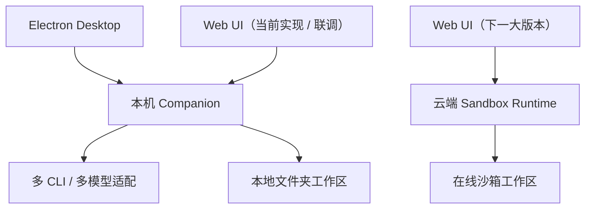

# 小窗 — 产品需求文档（PRD）

| 属性 | 内容 |
|------|------|
| 平台发布版本 | `0.1.2-alpha` |
| 产品阶段 | Desktop Alpha → Desktop Beta 收口过渡 |
| 文档版本 | v4.1 |
| 创建日期 | 2026-05-19 |
| 修订日期 | 2026-06-26 |
| 产品名称 | **小窗** |
| 产品定位 | **未来办公场景（works）** 的智能工作台 |
| 文档状态 | 当前版本（按 2026-06-26 代码与计划文档对齐） |
| 依据文档 | [docs/product/需求整理.md](./需求整理.md)、[docs/product/功能清单.md](./功能清单.md)、[docs/technical/技术方案.md](../technical/技术方案.md)、[docs/plans/chat-execution-roadmap.md](../plans/chat-execution-roadmap.md)、[docs/plans/product-roadmap-v4.md](../plans/product-roadmap-v4.md)、[docs/plans/writing-ppt-v1.1-status.md](../plans/writing-ppt-v1.1-status.md)、[docs/plans/industrial-drawing-m1-status.md](../plans/industrial-drawing-m1-status.md)、[docs/product/modules/writing-module-prd.v2.md](./modules/writing-module-prd.v2.md)、[docs/product/modules/ppt-module-prd.v2.md](./modules/ppt-module-prd.v2.md)、[docs/product/modules/industrial-drawing-module-prd.v1.md](./modules/industrial-drawing-module-prd.v1.md)、[docs/product/modules/video-module-prd.v1.md](./modules/video-module-prd.v1.md)、[docs/product/modules/simulation-module-prd.v0.md](./modules/simulation-module-prd.v0.md) |
| 原型工程 | `web/`、`companion/`、`apps/desktop/`、`packages/*` |
| 技术方案 | [docs/technical/技术方案.md](../technical/技术方案.md) |

---

## 目录

1. [文档说明](#1-文档说明)
2. [产品概述](#2-产品概述)
3. [目标用户与核心场景](#3-目标用户与核心场景)
4. [信息架构与菜单](#4-信息架构与菜单)
5. [产品架构](#5-产品架构)
6. [功能需求详述](#6-功能需求详述)
7. [非功能需求](#7-非功能需求)
8. [数据与集成](#8-数据与集成)
9. [交互与体验规范](#9-交互与体验规范)
10. [版本规划](#10-版本规划)
11. [下线范围与边界](#11-下线范围与边界)

---

## 1. 文档说明

### 1.1 编写目的

本文档用于统一小窗当前产品范围、业务模块、版本节奏与验收边界，供产品、设计、研发、测试与业务方对齐使用。

### 1.2 当前范围

> **2026-06-26 产品决策：小窗当前导航全部可见。**  
> 当前导航包含 **对话 / 写作 / PPT / 3D绘图 / 视频 / 推演**。其中对话、写作、PPT 是 Desktop Alpha / Beta 主验收线；3D绘图已进入 M1 真实链路；视频、推演已完成模块 PRD 并接入入口 / 路由 / 基座 Skill，作为 0.x / Beta 子线并行推进。**翻译、会议纪要** 不进入当前导航，可放到后续版本重新评估；**知识库** 明确不需要，不再建设独立模块。  
> 当前产品形态以 **Desktop + 本地 Companion + 本地文件夹工作区** 为准；Web 端升级为完整在线沙箱产品，放到**下一大版本**推进。
>
> **2026-06-26 增量决策：视频与推演先做“可见入口 + 基座接入”，不伪装成完整闭环。**  
> 视频模块与写作、PPT 同级对待，落点 [`docs/product/modules/video-module-prd.v1.md`](./modules/video-module-prd.v1.md)；推演模块落点 [`docs/product/modules/simulation-module-prd.v0.md`](./modules/simulation-module-prd.v0.md) 与技术附录。两者均**不进入 `0.1.0-alpha` 验收**。当前代码已完成导航、路由、模块注册、聊天面和默认基座 Skill 接入；视频的 Remotion 渲染闭环、推演的沙盘画布闭环仍按子线继续实现。

| 一级模块 | `0.1` Desktop Alpha | `0.2` Desktop Beta | Web Sandbox |
|----------|----------------------|---------------------|-------------|
| **对话** | **全文验收**：对话内容、状态、工作区最小联动 | 数据源、图表、多信源、可溯源增强 | 多人协作与云端延展 |
| **写作** | 骨架 / 共享对话主干 | **正式收口** | 企业模板与协作 |
| **PPT** | 骨架 / 共享对话主干 | **正式收口** | 协作与品牌资产 |
| **3D绘图** | 入口可见（不纳入 Alpha 主验收） | M1 子线验收（真实链路已走通，发布闸门待确认） | CAD Runtime 与企业模板 |
| **视频** | 入口 / 路由 / 基座 Skill 已接入，不进入 Alpha 验收 | 候选收口（待定，见 §F-VIDEO）；Remotion 渲染闭环未完成 | 云渲染（Remotion Lambda）与协作 |
| **推演** | 入口 / 路由 / 基座 Skill 已接入，不进入 Alpha 验收 | 候选收口；画布 / Round 快照闭环未完成 | 沙盘画布、Round 快照与协作 |
| **桌面壳** | Electron 最小集 | HMAC / 托盘 / 捆绑 / 自动更新 | 企业分发 |
| **账号与登录** | 本机单用户 | 保持单用户形态 | 多用户后台 |
| **全局设置** | 智能体 / 账号 / 关于 | 工作区 / 对话默认 / BYOK 增强 | 管理员能力 |
| **智能体运行时** | Companion + 多 CLI / 多模型适配 | PTY / BYOK / Handoff 强化 + **Remotion 工具集**（视频模块） | 模式 A 云端完整 |

#### 当前实现进展（2026-06-26）

| 模块 / 平台面 | 当前阶段 | 已完成进展 | 未完成 / 风险 | 验收判断 |
|---------------|----------|------------|---------------|----------|
| 对话 | Desktop Alpha 主线 | 登录、桌面壳、Companion / CLI、真实流式、`parts[]`、停止生成、状态点、Turn 吸顶、工作区落文件等 Alpha 基线已完成；`pnpm mvp:verify` 与关键 Web / Desktop 回归已通过 | 剩余为签名、公证、首次启动与 Desktop Beta 体验打磨 | Alpha 有条件通过 |
| 写作 | Desktop Beta 收口 | F1/F2/F3、T2/T3、T9/T10 真实 smoke / E2E 已通过；`.md` 真实落盘已确认；重复 part 已纳入 smoke 失败条件 | DOCX 本地交付物体验（生成到工作区、打开、定位、另存 / 导出副本）、历史侧栏 UI、更多真实多轮场景仍需 Beta 回归 | 主链路可用，进入 Beta 稳定化 |
| PPT | Desktop Beta 收口 | F4/F5/F6、T5 真实 smoke 已通过；`.html` / `.pptx` 真实落盘已确认；重复 part 已纳入 smoke 失败条件 | PPTX 本地交付物体验（打开、定位、另存 / 导出副本）、历史侧栏 UI、更多真实多轮迭代仍需 Beta 回归 | 主链路可用，进入 Beta 稳定化 |
| 3D绘图 | 0.x / M1 | `/3d` 路由、模块注册、共享历史、Skill、OpenSCAD CLI / WASM、导出链路与 smoke 已完成 | Runtime 制品、许可证材料、UI WASM 开关、更多 fixture 需发布前确认 | 可按 M1 子线验收 |
| 视频 | 0.x 立项 + 基座接入 | 模块 PRD v1.0 草案、导航、路由、注册表、聊天面、`skill-vp-base`、catalog 已完成 | `vp_*` parts、Remotion 工具、BFF、MP4 预览下载、真实 smoke 未完成 | 仅承诺入口与规划基座 |
| 推演 | Beta 占位 + 基座接入 | 模块 PRD v0.2、技术附录、导航、路由、注册表、聊天面、`skill-simulation-base`、catalog 已完成 | `simulation_*` parts、React Flow 画布、Round 快照、报告导出、真实 smoke 未完成 | 仅承诺入口与规划基座 |
| 桌面壳 | Alpha 基线 + Beta 增强 | Electron 加载 Web、系统选目录、Companion 连接；HMAC / 托盘 / 捆绑 / 自动更新已有代码进展 | 打包态、签名、公证、更新源、系统通知与首次启动体验仍需验收 | Alpha 可演示，Beta 需打包验收 |
| Web Sandbox | 下一大版本 | 已有路线图与边界文档 | 云端 Runtime、在线沙箱、多用户后台、协作与企业部署未实现 | 不属于当前 Desktop 交付 |

### 1.3 术语定义

| 术语 | 定义 |
|------|------|
| works | 小窗覆盖的知识工作场景：研究、写作、演示、制图、视频与推演 |
| 本地 Companion | 用户本机常驻服务，负责项目工作区、CLI 探测、子进程执行、SSE 回传 |
| 桌面壳 | Electron 包装同一套 Web UI，增强系统选目录、托盘、更新等本机能力 |
| `projectId` | 逻辑工作区实体；当前六个业务模块都绑定到具体工作区 |
| `workspaceKind` | 工作区类型：`sandbox`、`local_bound`、`cloud` |
| 流程 Skill | 绑定在模式、模板或任务类型上的 Agent 工作流 |
| 横切规范 Skill | 全平台叠加的研究与输出规范 |

---

## 2. 产品概述

### 2.1 背景

知识工作者在办公中高频进行研究问题、生成内容、制作汇报、制图、视频表达与复杂决策推演。这些工作通常散落在浏览器、本地文件夹、外部模型工具和各类文档之间，难以形成连续、可交付、可追溯的生产流程。

小窗希望把这条链路收敛到同一个工作台中：用户围绕一个工作区完成研究、写作、演示、制图、视频和推演，所有过程都由统一的智能体执行层和工作区文件产出承接。

### 2.2 产品定位

| 维度 | 说明 |
|------|------|
| **名称** | **小窗** |
| **对标关系** | Cursor / Codex 面向 coding；小窗面向 works |
| **核心形态** | 当前以 Electron 桌面壳为主；Web 在线沙箱为下一大版本目标 |
| **执行方式** | 当前由本机 Companion + 本机 CLI 承接；浏览器不直接碰本机特权 |
| **工作载体** | 始终围绕 `projectId` 工作区组织产出 |

### 2.3 产品目标

| 目标维度 | 描述 |
|----------|------|
| 效率 | 缩短研究、写作、做稿的时间 |
| 质量 | 通过多信源、结构化流程和模板提升内容质量 |
| 交付感 | 所有关键结果都落到工作区文件，而不是停留在聊天气泡中 |
| 可扩展 | 通过模块注册表、Skill、Companion 让后续能力扩展保持统一主干 |

### 2.4 成功标准（`0.1.0-alpha` Desktop Alpha）

**交付形态：** 当前研究员主要通过桌面应用进入小窗，连接本机 Companion，在真实本地工作区中完成对话研究。浏览器直连 Companion 仅作为当前实现与联调用入口，不代表最终 Web 产品边界。

**`0.1.0-alpha` 验收重点**

- [x] 未登录访问业务页会跳转 `/login`（代码：`web/src/middleware.ts`、`web/src/app/login/page.tsx`）
- [x] 桌面壳可加载 `web/` 对话页面并完成系统选目录（代码：`apps/desktop/src/main/index.ts`、`apps/desktop/src/main/import-folder.ts`）
- [x] Companion 能探测并切换多款已适配 CLI（代码：`companion/src/routes/agents.ts`、`companion/src/agents/detect.ts`、设置页 Agent 切换）
- [x] 对话具备真实流式、`parts[]`、停止生成、状态点（`pnpm mvp:verify` 与关键回归已通过）
- [x] Turn 吸顶已修复并接入 `ChatTurnList`；`stable long-session` 回归通过（见 `docs/plans/mvp-closure-checklist.md` D5）
- [x] 新会话能绑定 `projectId` 并在工作区落文件（代码：`ensure-default-task-project`、`import-folder`、Companion Run `cwd`）
- [x] 全局设置可展示智能体与模型、账号信息、关于信息（代码：`SettingsDrawer`、`AgentSettingsSection`、`AccountSettingsSection`、`AboutSettingsSection`）

**`0.1.0-alpha` 明确不含**

- 写作 / PPT 作为 Alpha 必交付项的正式业务闭环（当前已进入 Beta 收口，不压 Alpha 发布）
- 3D / 视频 / 推演完整业务闭环（入口可见，但按子线验收）
- 模式 A 云端完整工作区
- 多用户后台

---

## 3. 目标用户与核心场景

### 3.1 用户画像

| 角色 | 描述 | 核心诉求 |
|------|------|----------|
| 研究员 / 分析师 | 日常查数、看资料、做结论 | 对话研究、图表、长文输出 |
| 内容生产岗 | 写文稿、改稿、拼材料 | 写作、格式化交付 |
| 汇报岗 | 对内对外做演示 | PPT、文稿到演示转化 |

### 3.2 核心场景

**场景 A：对话研究**  
用户以快速或深度模式发起问题，Agent 完成检索、分析和输出，必要时落工作区文件。

**场景 B：从研究到成稿**  
用户基于对话结论进入写作，对话内确认大纲、补充结构，生成 Markdown / Word 成稿。

**场景 C：从文稿到演示**  
用户基于主题或已有文稿进入 PPT，生成大纲、调整页次并导出 PPTX。

---

## 4. 信息架构与菜单

### 4.1 设计原则

- 一级菜单只保留用户会反复进入的核心业务能力
- 不再保留知识库、会议纪要这类当前没有明确主链路的模块占位
- 新增可见模块必须至少有 PRD、模块注册、路由与基座 Skill；未闭环能力必须明确标注为子线
- 所有内容生产 / 分析模块都共用同一套对话式主干与工作区机制

### 4.2 一级 / 二级菜单

| 一级菜单 | 二级菜单 |
|----------|----------|
| **对话** | 新对话、历史会话；（页内）自动问答策略 |
| **写作** | 写作 |
| **PPT** | PPT |
| **3D绘图** | 3D绘图 |
| **视频** | 视频 |
| **推演** | 推演 |

### 4.3 全局设置

全局设置不占左侧业务导航，由侧栏底部用户区进入。

`0.1.0-alpha` 菜单项：

- 智能体与模型
- 账号与权限
- 关于与帮助

Desktop Beta 扩展项：

- 研究与对话默认
- 数据与图表默认
- 工作区偏好

---

## 5. 产品架构

### 5.1 总体结构

### 5.2 核心原则

- **TypeScript 主栈**
- **不自研 Agent 工具循环**
- **浏览器不碰本机特权**
- **Artifact-first**
- **模块共用统一执行主干**
- **AI 优先承担业务判断**：对于写作 / PPT 这类需求收敛型流程，是否需要追问、追问哪些问题、何时进入摘要与大纲，优先由 AI 决定；工程层不预设业务问卷，也不增加硬编码前置裁决来替代 AI 判断。
- **基座轻量、交接压缩**：写作 / PPT 基座 Skill 应作为轻量流程编排层存在，避免与下游模板 / 成稿 Skill 重复消耗 token；交接时优先传结构化 brief，而不是把整段上下文全文重复灌给下游。

### 5.3 工作区规则

- 始终存在 `projectId`
- Desktop 未选本地项目时，平台创建默认工作区目录
- Desktop 默认工作区必须是真实本地文件夹，不是内部托管沙箱
- 切换项目 = 新建会话
- 当前六个业务模块都围绕当前 `projectId` 产出文件；视频 / 推演当前先承接入口与基座产物，完整渲染 / 画布闭环按子线补齐

### 5.4 执行模式

| 模式 | 说明 |
|------|------|
| **当前 Desktop 主路径** | Electron Desktop → 本机 Companion → 本机 CLI → 本地文件夹工作区 |
| **当前 Web 工程路径** | Web UI → 本机 Companion（仅实现 / 联调 / 降级入口） |
| **下一大版本 Web 目标** | Web UI → 云端 Sandbox Runtime → 在线沙箱工作区 |

---

## 6. 功能需求详述

### 6.1 对话

| 能力 | 说明 |
|------|------|
| 快速 / 深度 | 两档模式切换 |
| `parts[]` | 过程与正文分块展示 |
| 状态点 | 会话执行 / 未读 / 待确认 |
| Turn 吸顶 | 当前视口问题 sticky |
| 工作区联动 | 文件产出与打开 |

### 6.2 写作

| 能力 | 说明 |
|------|------|
| 对话式写作 | 复用 `ChatHome` 主干 |
| Skill 切换 | 通用、公文、专题、行业等 |
| 大纲确认 | 在对话中完成 |
| 文稿导出 | 先 DOCX，后 PDF |

### 6.3 PPT

| 能力 | 说明 |
|------|------|
| 对话式生成 | 以主题、文稿或目标受众驱动 |
| 大纲编辑 | 在对话中完成 |
| 交付物预览 | 工作区预览 `.pptx` / `.html` |
| 导出 | 先 PPTX，后 PDF |

### 6.4 3D绘图

> **状态：** 0.x / M1 子线；**不进入 `0.1.0-alpha` 主验收**。模块级 PRD 见 [`docs/product/modules/industrial-drawing-module-prd.v1.md`](./modules/industrial-drawing-module-prd.v1.md)，实现状态见 [`docs/plans/industrial-drawing-m1-status.md`](../plans/industrial-drawing-m1-status.md)。  
> 当前 3D绘图已经从“入口占位”推进到 M1 真实链路：路由、模块注册、共享历史、OpenSCAD CLI / WASM、导出链路与 smoke 均已有落地；发布前重点在 Runtime 制品、许可证材料和更多真实 UI 回归。

| 能力 | 说明 |
|------|------|
| 对话式制图 | 复用聊天壳，通过 `skill-industrial-drawing-base` 收敛需求 |
| 参数化源文件 | 工作区落盘 `.scad`、参数 JSON 与说明文件 |
| 预览与导出 | OpenSCAD CLI 生成 STL / DXF；SVG / PDF 保留参数轮廓 fallback；WASM 用于浏览器快速预览 |
| 参数编辑 | `.scad` / `.dxf` / 文本产物可在 Workspace Viewer 中编辑保存 |
| 历史与工作区 | 复用对话 / 写作 / PPT 同一套会话历史与 `projectId` 绑定 |

### 6.5 视频（§F-VIDEO，占位）

> **状态：** 0.x 子线：PRD v1.0 草案已成稿，入口 / 路由 / 模块注册 / 基座 Skill 已接入；**不进入 `0.1.0-alpha` 验收**。模块级 PRD 见 [`docs/product/modules/video-module-prd.v1.md`](./modules/video-module-prd.v1.md)（v1.0 草案，26 章）。  
> 本节为主 PRD 中的能力摘要与边界声明，详细需求 / 数据契约 / 验收标准 / 实施任务以模块 PRD 为准。

#### 6.5.1 模块定位

视频模块与写作、PPT 同级，采用相同范式：**对话 + 视频 Skill + 交付物（Remotion 项目）+ 导出（MP4）**。复用聊天组件、Companion 与工作区；不建独立 UI，不做时间轴剪辑器。

#### 6.5.2 能力清单（摘要）

| 能力 | 说明 |
|------|------|
| 对话式生成 | 以主题、研究结论、文稿或目标受众驱动 |
| AI to UI 需求采集 | 默认基座 `skill-vp-base`，输出 `vp_requirements` 表单卡 |
| 分镜确认 | 在对话中完成（`vp_storyboard` 卡片，支持逐镜编辑） |
| 主资产 | 工作区落盘完整 Remotion 项目（`remotion/` + `props.json`），可独立运行 |
| 派生物 | `exports/*.mp4`，历史版本不自动覆盖 |
| 渲染状态 | `vp_render_status` 卡（进度 / ETA / 取消 / 失败码） |
| 能力探测 | Companion 探测 Node / Chromium / ffmpeg；缺失时降级提示但不阻断对话 |
| 导出 | MP4 下载；Desktop Beta 可选「在 Remotion Studio 中打开」 |

#### 6.5.3 默认 Skill 矩阵

| 角色 | Skill | 优先级 |
|------|-------|--------|
| 流程基座（默认） | `skill-vp-base` | P0 |
| 默认风格模板 | `skill-vp-product-intro` | P0 |
| 数据故事 / 研究解读 / 活动回顾 等 | `skill-vp-data-story` / `skill-vp-event-recap` / `skill-vp-pitch-trailer` / `skill-vp-research-explainer` 等 | P1~P2，按真实诉求逐个补 |

#### 6.5.4 关键边界

- **非范围（与写作 / PPT 一致的不做项）**：视频模板选择页、时间轴剪辑器、媒资管理页、步骤向导、我的视频列表、快速 / 深度模式切换；
- **本模块产出"模板驱动的合成视频"**，不做 text-to-video 模型集成（Sora / Pika / Runway 类不在范围）；用户可将外部生成素材放入 `assets/` 由模板调用；
- **0.x 不上云渲染、不内置 TTS、不内置 BGM 库**，把首期主链路压到最小可信集；
- **AI 写出的 `scenes/*.tsx` 必须经过静态扫描**，禁用 `eval` / `child_process` / `fs`，依赖白名单（详见模块 PRD §12.4）；
- **沙箱工作区暂不支持渲染**（无本机 Companion），仅支持生成项目与分镜脚本。

#### 6.5.5 与对话 / 写作链路打通

- 视频会话与写作 / PPT 共享同一 `projectId` 工作区；
- 远期通过 `skill-vp-research-explainer` 支持"从研究报告一键讲解"入口（P2，模块 PRD §22 Q8）。

#### 6.5.6 待 PO 拍板项（影响主 PRD 范围）

- **Q10**：视频模块是否升为 `0.2.0-beta` 必交付项？当前主 PRD 默认按 0.x 子线推进；
- **Q3**：v1 是否直接集成 TTS 配音；
- **Q14**：Web Sandbox 是否提供"先生成项目、再导出到本机渲染"的离线路径。

> 其余开放问题（Q1~Q14 共 14 条）见模块 PRD §22。

### 6.6 推演

> **状态：** Beta 占位 + 基座接入；**不进入 `0.1.0-alpha` 验收**。模块级 PRD 见 [`docs/product/modules/simulation-module-prd.v0.md`](./modules/simulation-module-prd.v0.md)，技术附录见 [`docs/product/modules/simulation-module-tech-appendix.md`](./modules/simulation-module-tech-appendix.md)。  
> 当前推演已完成产品形态、画布数据模型、Run / Round / Stage、SSE 事件映射和技术拆解，并已接入导航、路由、模块注册、聊天面与 `skill-simulation-base`；React Flow 沙盘画布、`simulation_*` parts、Round 快照和报告导出仍未形成真实闭环。

| 能力 | 说明 |
|------|------|
| 对话式输入 | 用户用自然语言提出复杂问题，默认由 `skill-simulation-base` 收敛目标、范围、变量和判断口径 |
| 沙盘画布 | 目标形态是主体、变量、假设、路径、触发条件和结果分支的可操作画布 |
| Round 推进 | MVP 设计支持 Round 维度切换与路径选择，Stage 切换放到后续 |
| 右侧工作区 | 推演报告、证据材料、轮次快照、结构化结果和导出文件沿用统一工作区 |
| 报告导出 | MVP 只验 Markdown 报告导出，后续再扩 PDF / 独立报告页 |

### 6.7 智能体与工作区（横切）

| 能力 | 说明 |
|------|------|
| 多 CLI / 多模型适配 | 平台核心竞争力 |
| 文件夹导入 | Desktop 以系统选目录为正式主路径；当前 Web 本地路径接入仅作工程态兼容 |
| 工作区文件 | 预览、打开、定位、导出 / 另存副本；Web Sandbox 可补充下载 |
| 流式与取消 | 可中断、可保留部分输出（含视频渲染子进程） |
| 超长会话 | 先做自动压缩，再做 Handoff |
| Remotion 工具集 | Companion 新增 `remotion.*` 工具与能力探测（服务视频模块；详见 §6.5 与模块 PRD §8） |

### 6.8 全局设置与登录（横切）

| 能力 | 说明 |
|------|------|
| 手机号登录 | 登录即注册 |
| 智能体设置 | 默认 Agent / 模型档位 / 运行状态 |
| 关于与帮助 | 版本、诊断、反馈 |

---

## 7. 非功能需求

### 7.1 性能

- 快速模式响应尽可能在 5 秒级
- 对话流式首屏尽快可见
- 工作区文件树与切换体验保持顺滑

### 7.2 稳定性

- Companion 不可用时要明确报错
- 真实 CLI 失败不得静默伪装成功
- `mock` 只能用于开发联调与演示，占位完成不等于真实验收通过
- 涉及数据流、SSE、文件写入、预览、打开、定位、导出 / 另存副本的能力，必须补充真实链路测试；Web Sandbox 的下载链路另行验收
- 桌面壳与浏览器共用主 UI，避免双端分叉

### 7.3 安全

- 浏览器不直接读写本机目录
- CLI 调用受平台登记适配集约束
- 工作区边界清晰，不允许跨项目越权

---

## 8. 数据与集成

### 8.1 数据分工

| 域 | 当前权威源 |
|----|------------|
| 消息正文 | Companion / 本地会话存储 |
| 会话索引 | 当前以 Web / 本地为主，后续可接 `api/` |
| 工作区文件 | `projectId` 对应目录 |

### 8.2 模型与 Agent 接入

- 默认接入 Codex / Claude / Hermes
- 平台统一维护 CLI 适配层
- BYOK 作为 Desktop Beta 增强能力

### 8.3 外部能力边界

- 数据源与图表：对话增强能力
- 写作 / PPT / 视频：通过基座 Skill、模板 Skill 与模板资产组织
- 3D绘图：通过制图 Skill、CAD Runtime 与工作区文件组织
- 推演：通过推演 Skill、画布协议、Round 快照与报告文件组织

---

## 9. 交互与体验规范

### 9.1 对话体验

- 结果优先，过程可折叠
- Turn 级别阅读节奏清晰
- 文件、交付物、路径引用可操作

### 9.2 模块一致性

- 写作 / PPT / 3D绘图 / 视频 / 推演都复用同一个对话主壳与工作区心智
- 用户不需要为每个模块学习一套完全不同的交互；未闭环子线必须在 UI 与文档中明确提示能力边界

### 9.3 桌面优先

- 桌面壳是推荐交付形态
- 系统选目录优先于浏览器目录能力
- Web 在线沙箱化不挤占当前 Desktop 路线，放到下一大版本建设

---

## 10. 版本规划

### 10.1 里程碑

| 版本 | 范围摘要 | 状态 / 时间 |
|------|----------|-------------|
| **`0.1.0-alpha` / Desktop Alpha** | 对话 + 桌面壳 + Companion/CLI + 登录 + 全局设置子集；3D / 视频 / 推演入口可见但不进 Alpha 主闸门 | 有条件通过：核心链路、Turn 吸顶、关键 Web 回归、Desktop pack:dir 与冷启动已通过；剩余为签名、公证与 Desktop Beta 体验项 |
| **`0.2.0-beta` / Desktop Beta** | 写作 / PPT 收口；对话增强；桌面壳增强套件 | 进行中：写作 / PPT 真实 smoke、T9/T10、落盘与重复 parts 防回归已通过；本地打开 / 定位 / 另存体验、历史侧栏和真实多轮场景继续回归 |
| **3D绘图 M1 / 0.x 子线** | 参数化制图、OpenSCAD CLI / WASM、导出与工作区闭环 | 已走通真实链路：发布前确认 Runtime 制品、许可证材料、UI 开关和异常 fixture |
| **视频 0.x 子线** | 视频 brief、分镜、Remotion 项目、MP4 渲染 | PRD 已成稿，入口 / 路由 / 基座 Skill 已接入；Remotion 渲染闭环未完成 |
| **推演 Beta 子线** | 多路径推演、沙盘画布、Round 快照、报告导出 | PRD / 技术附录已成稿，入口 / 路由 / 基座 Skill 已接入；画布与快照闭环未完成 |
| **Web Sandbox 1.0 / 下一大版本** | Web 在线沙箱工作区、云端运行时、多用户后台、多人协作、企业部署 | 后续阶段：不属于当前 Desktop 交付 |

### 10.2 `0.1.0-alpha` 裁剪

**必须包含**

- 对话两档模式
- `parts[]`
- 侧栏状态
- Turn 吸顶
- Electron 桌面壳
- Companion + 多 CLI / 多模型适配
- 文件夹导入
- 登录与全局设置子集

**不包含**

- 写作 / PPT 作为 Alpha 必交付项的正式业务闭环（当前已进入 Beta 收口，不压 Alpha 发布）
- 3D / 视频 / 推演完整业务闭环（入口可见，但按子线验收）
- Web 在线沙箱完整能力
- 多用户后台

### 10.3 `0.2.0-beta` / Desktop Beta 重点

- 写作模块正式收口：真实 `.md` 落盘已通过；DOCX 生成到工作区、打开 / 定位 / 另存副本、历史侧栏与恢复回归继续补齐
- PPT 模块正式收口：真实 `.html` / `.pptx` 落盘已通过；PPTX 打开 / 定位 / 另存副本、历史侧栏与多轮迭代继续补齐
- **3D绘图 M1 子线发布前确认**：Runtime 制品、许可证材料、WASM UI 开关、异常 fixture 与 smoke 闸门
- **视频模块 0.x 子线推进**：基座 + 默认模板 + Companion `remotion.*` 工具链；是否升为 Beta 必交付项待 PO 拍板，见 §6.5.6 / 模块 PRD §22 Q10
- **推演模块 Beta 子线推进**：`simulation_*` parts、React Flow 画布、Round 快照、Markdown 报告导出与 smoke
- 对话数据源 / 图表 / 多信源 / 溯源能力
- 桌面壳增强：HMAC、托盘、捆绑、自动更新
- F-RT-006 / F-RT-009-B / BYOK 增强

---

## 11. 延期、下线范围与边界

### 11.1 模块处理结论

| 模块 | 处理方式 |
|------|----------|
| **会议纪要** | 不进入当前 Desktop Alpha / Beta 主线；从当前导航与近期任务中移除，作为后续版本候选能力保留评估空间 |
| **知识库** | 明确不需要；从产品导航、版本规划、代码注册表与后续路线中移除，不再建设独立模块 |

### 11.2 保留但不扩展的历史痕迹

- 写作中的 `skill-writing-meeting-minutes` 可保留为文本体裁能力，不代表会议纪要模块进入当前版本
- 部分历史文档可留档，但不再作为当前 PRD 范围依据

### 11.3 当前内容沉淀方式

当前平台的内容沉淀不再依赖知识库模块，而是统一通过以下两种方式完成：

- 历史会话
- 工作区文件产出
