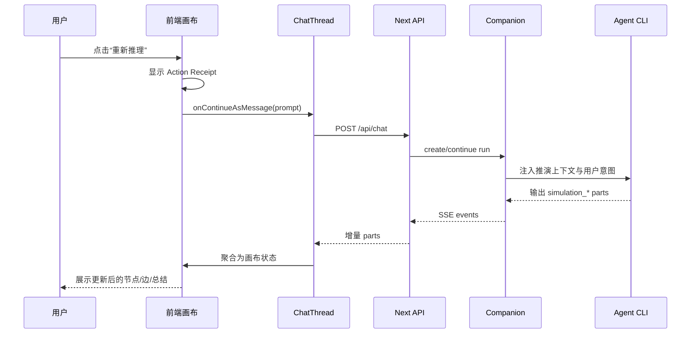
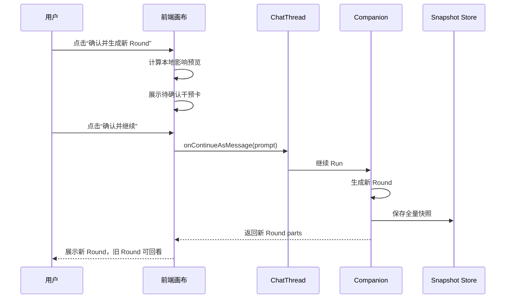
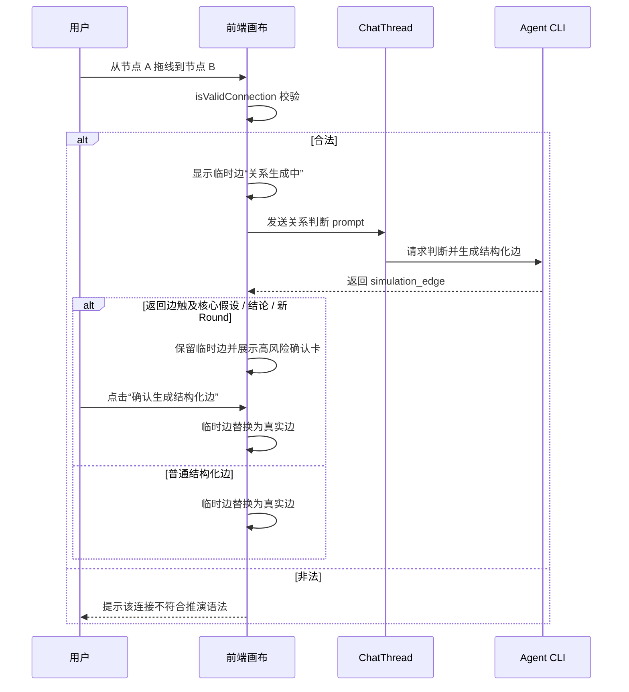
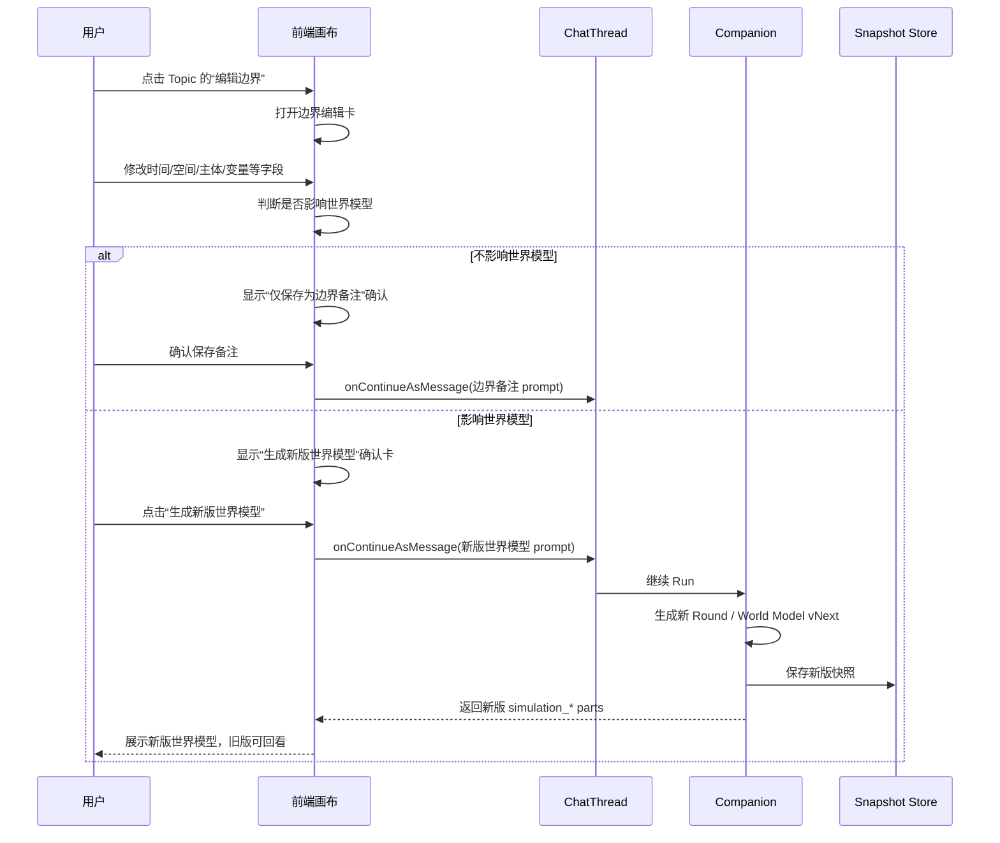

# 小窗 `0.1.4-alpha` 版本内容梳理

| 属性 | 内容 |
|------|------|
| 平台版本 | `0.1.4-alpha` |
| 阶段定位 | Desktop Alpha 推演画布交互闭环补丁版 |
| 文档版本 | v0.8 |
| 日期 | 2026-07-10 |
| 上一版本 | `0.1.3-alpha` |
| 后续目标 | `0.2.0-beta` / Desktop Beta |
| 适用范围 | Desktop + 本地 Companion + 本地文件夹工作区 |
| 核心目标 | 以用户可理解的世界模型版本流为主线，补齐推演画布交互定义、点击反馈、确认机制与自动化回归 |

> 本文件为 `0.1.3-alpha` 之后、`0.2.0-beta` 之前的 Alpha 补丁版本执行需求稿。P0、P1、P2 已完成代码实现并通过自动化验收；根 `package.json` 与各包版本已统一升到 `0.1.4-alpha`。

---

## 1. 版本定位

`0.1.4-alpha` 是一个小范围补丁版本，不改变平台主架构，不新增一级业务模块，不把推演画布升级为完整图编辑器。

本版本重点解决推演画布当前的交互落差：

- 用户能点很多按钮，但不总能清楚知道系统把点击理解成什么。
- 部分按钮文案像是立即执行确定动作，实际是发起下一轮 Agent 推演。
- 高风险动作、低风险动作、纯本地动作的确认与反馈不够统一。
- `确认进入世界模型`、`编辑边界`、`补充条件` 的语义边界不够清楚：修改边界可能改变整个世界模型，但当前按钮没有明确告诉用户是否会生成新版世界模型。
- 右侧节点详情面板存在遮挡节点问题，影响自动化和真实使用。
- `smoke:simulation:ui` 后半段被 Inspector 遮挡阻塞，画布按钮回归覆盖不完整。

一句话目标：

> 让推演画布从“可交互 Demo”进入“可复测、可解释、可稳定演示”的状态。

---

## 2. 范围原则

### 2.1 纳入范围

- 推演画布按钮行为定义与交互分级。
- Topic 问题边界编辑与新版世界模型生成流程。
- 点击后的本地反馈、pending 状态与 Action Receipt。
- 高风险动作统一确认卡。
- 本地影响预览和受影响节点高亮。
- Inspector 遮挡体验修复。
- 手动画线与边上插点的反馈和自动化覆盖。
- 推演画布 UI smoke 恢复与扩展。

### 2.2 不纳入范围

- 完整 Operation Executor。
- 节点 / 边 / 变量的数据库 CRUD API。
- 完整图状态撤销系统。
- 多人协作、Web Sandbox、云端 Runtime。
- PDF / PPTX 报告导出闭环。
- 大规模重构推演画布架构。
- 写作 / PPT 的 Desktop Beta 完整收口。

---

## 3. 版本内容清单

本版本不是从零建设推演画布交互，而是在现有实现上补齐行为定义、确认边界、点击反馈和自动化验收。

现有代码基础：

- 已完成统一确认卡、Action Receipt、影响预览、边界编辑卡和 Topic 状态机。
- 已完成 `canvasActions.ts` 按钮行为注册表及 68 项行为快照。
- 已完成 `smoke:simulation:ui` 主链路与 Inspector 遮挡、画布根节点 selector 稳定性修复。
- 已完成最近操作日志：从统一 `showActionFeedback` 写入当前画布会话内的最近 12 条有效操作。

| 编号 | 模块 | 内容 | 现状 | 任务性质 | 依赖 | 优先级 | 状态 |
|------|------|------|------|----------|------|--------|------|
| `A014-SIM-001` | 推演画布 | 修复右侧 Inspector 遮挡节点的问题，恢复 `smoke:simulation:ui` 后半段自动化 | Inspector 已存在，自动化有遮挡风险 | 修复 | 无 | P0 | 已完成 / UI smoke 已验收 |
| `A014-SIM-002` | 推演画布 | 建立画布按钮行为注册表，统一定义 `local` / `prompt` / `confirm` / `snapshot` / `pending` | 当前无统一行为枚举，逻辑分散在组件内 | 抽象现有逻辑 | 无 | P0 | 已完成 / 68 项快照 |
| `A014-SIM-003` | 推演画布 | 统一待确认干预卡：路径、变量、情景、风险、事件、行动等硬选择点共用确认机制 | 已有 `SimulationPendingInterventionCard`，但覆盖不完整 | 补齐 / 统一 | `A014-SIM-002` | P0 | 已完成 / UI smoke 已验收 |
| `A014-SIM-004` | 推演画布 | 增加 Action Receipt：点击后显示系统理解、目标节点、预期动作、是否生成新 Round | 暂无独立 Receipt 组件，部分按钮有 pending 卡 | 新增轻量组件 | `A014-SIM-002` | P1 | 已完成 / UI smoke 已验收 |
| `A014-SIM-005` | 推演画布 | 明确 Topic 边界状态机：确认进入世界模型、编辑边界、补充条件、生成新版世界模型 | Topic 按钮已存在，但状态语义不清 | 规则补齐 / 文案校准 | `A014-SIM-002` | P0 | 已完成 / UI smoke 已验收 |
| `A014-SIM-006` | 推演画布 | 边界编辑卡支持字段级编辑，并在提交前判断是否需要生成新版世界模型 | 问题字段已有展示，缺编辑卡和影响确认 | 补齐 | `A014-SIM-005` | P1 | 已完成 / UI smoke 已验收 |
| `A014-SIM-007` | 推演画布 | 本地影响预览：点击变量、风险、路径等动作时即时高亮受影响节点 | 已有影响计算和详情卡，缺点击后的统一联动 | 补齐 / 复用 | `A014-SIM-002` | P1 | 已完成 / UI smoke 已验收 |
| `A014-SIM-008` | 推演画布 | 手动画线反馈优化：展示“关系生成中 / 判断失败 / 已生成结构化边”等状态 | 已有手动画线和 pending 边基础 | 补齐 | `A014-SIM-002` | P1 | 已完成 / UI smoke 已验收 |
| `A014-SIM-009` | 推演画布 | 边上插点菜单自动化覆盖：假设、事件、证据、推理、风险、行动 | 插点菜单已有入口，自动化覆盖不足 | QA 补齐 | `A014-QA-001` | P1 | 已完成 / UI smoke 已验收 |
| `A014-SIM-010` | 推演画布 | 节点动作降噪：Topic 最多 3 个主动作，普通节点最多 2 个主动作，其余进入“更多” | 节点动作较多，分散在 Inspector 中 | 体验优化 | `A014-SIM-002` | P1 | 已完成 / UI smoke 已验收 |
| `A014-SIM-011` | 推演画布 | 操作文案校准：避免“打开原文 / 生成演示稿”等未真实落地动作造成误解 | 按钮已存在，文案承诺过强 | 文案校准 | `A014-SIM-002` | P1 | 已完成 / UI smoke 已验收 |
| `A014-SIM-012` | 推演画布 | 增加最近操作日志：记录用户点击、目标节点、生成 Round 或报告动作 | 当前画布会话内最近 12 条有效操作 | 新增 | `A014-SIM-004` | P2 | 已完成 / UI smoke 已验收 |
| `A014-QA-001` | QA | 恢复并扩展 `smoke:simulation:ui`，覆盖按钮主链路 | 脚本已有，需恢复后半段稳定性 | 修复 / 扩展 | `A014-SIM-001` | P0 | 已完成 / UI smoke 已验收 |
| `A014-QA-002` | QA | 增加画布按钮行为快照测试，防止按钮无意变成空动作 | 暂无行为映射快照 | 新增测试 | `A014-SIM-002` | P1 | 已完成 / 68 项快照 |

### 3.1 实施依赖顺序

`A014-SIM-002` 是本版本的交互地基，必须先做。推荐顺序按 P0 最小闭环和 P1 扩展链路拆开：

```text
P0 最小闭环:
A014-SIM-001
A014-SIM-002
  -> A014-SIM-003
  -> A014-SIM-005
A014-SIM-001 + A014-SIM-003 + A014-SIM-005
  -> A014-QA-001

P1 扩展链路:
A014-SIM-002
  -> A014-SIM-004
  -> A014-SIM-007
  -> A014-SIM-008
  -> A014-SIM-011
  -> A014-SIM-010
  -> A014-QA-002
A014-SIM-005
  -> A014-SIM-006
A014-QA-001
  -> A014-SIM-009
A014-SIM-004
  -> A014-SIM-012
```

`A014-SIM-003`、`A014-SIM-004`、`A014-SIM-007`、`A014-SIM-010`、`A014-SIM-011`、`A014-QA-002` 不应各自定义一套按钮分类；必须复用 `A014-SIM-002` 的注册表。

### 3.2 P0 / P1 / P2 分期计划

0.1.4 的分期原则：

- P0 只做“没有它版本不成立”的闭环修复。
- P1 做“明显改善体验，但不阻塞版本发布”的增强。
- P2 做“有价值但不阻塞发布”的长期治理项。

| 优先级 | 目标 | 纳入任务 | 本版完成定义 | 不纳入 |
|--------|------|----------|--------------|--------|
| P0 | 让画布按钮可解释、可确认、可复测 | `A014-SIM-001`、`A014-SIM-002`、`A014-SIM-003`、`A014-SIM-005`、`A014-QA-001` | 按钮行为注册表落地；高风险动作至少覆盖变量、路径、情景、风险、行动；Topic 边界状态清楚；UI smoke 不再因 Inspector 遮挡中断 | 完整边界表单、操作日志、复杂按钮分组 |
| P1 | 提升反馈质量和可用性 | `A014-SIM-004`、`A014-SIM-006`、`A014-SIM-007`、`A014-SIM-008`、`A014-SIM-009`、`A014-SIM-010`、`A014-SIM-011`、`A014-QA-002` | Action Receipt 轻量可见；边界编辑有影响确认；影响预览联动；画线 / 插点反馈清楚；主按钮完成减法；按钮行为快照覆盖主入口 | 完整 undo、完整 Operation Executor |
| P2 | 长期可维护性 | `A014-SIM-012` | 最近操作日志可追溯 | 不阻塞 0.1.4 发版，可进入 `0.1.5-alpha` 或 `0.2.0-beta` |

P0 推荐拆成 4 个开发切片：

| 切片 | 内容 | 依赖 | 验收 |
|------|------|------|------|
| P0-A | Inspector 遮挡修复，恢复 UI smoke 主链路 | 无 | `smoke:simulation:ui` 能跑过主链路 |
| P0-B | 按钮行为注册表，抽象现有分散点击逻辑 | P0-A 可并行 | 所有主入口按钮有 `actionId` 和 `behaviorType` |
| P0-C | 统一确认卡覆盖硬选择点 | P0-B | 变量、路径、情景、风险、行动 5 类动作出现统一确认 |
| P0-D | Topic 边界状态机与文案校准 | P0-B | 未建模时生成世界模型；已有世界模型后核心边界变化生成新版世界模型 |

P1 推荐拆成 4 个增强切片：

| 切片 | 内容 | 依赖 | 验收 |
|------|------|------|------|
| P1-A | Action Receipt：prompt 点击后解释“将发起什么” | P0-B | 300ms 内显示目标节点、动作理解、是否可能生成新 Round |
| P1-B | 边界编辑卡：字段级编辑和新版世界模型确认 | P0-D | 修改核心边界会提示生成新版世界模型；小补充可保存为边界备注 |
| P1-C | 影响预览、手动画线、边上插点反馈 | P0-B / P0-C | 影响节点可高亮；画线有 pending / 失败 / 成功；插点菜单自动化覆盖 6 类 |
| P1-D | 文案校准、按钮减法和按钮行为快照 | P0-B | 不再承诺未落地动作；普通节点最多 2 个主动作；快照锁行为映射，不锁 prompt 全文 |

P2 保留为 1 个治理切片，现已完成：

| 切片 | 内容 | 依赖 | 验收 |
|------|------|------|------|
| P2-A | 最近操作日志：记录点击、目标节点、Round / 报告动作 | P1-A | 已完成：用户能回看最近 12 条有效操作，不作为 undo 使用 |

版本切线策略：

| 情况 | 决策 |
|------|------|
| P0 全部完成，P1 只完成一部分 | 可以发布 `0.1.4-alpha`，未完成 P1 顺延到 `0.1.5-alpha` |
| `A014-SIM-002` 未完成 | 不进入开发验收，按钮行为会继续分散，0.1.4 不成立 |
| `A014-SIM-001` 未完成 | 不发布，自动化和用户点击都会继续被 Inspector 遮挡 |
| `A014-SIM-003` 未完成 | 不发布，高风险动作仍可能无确认，交互风险过高 |
| `A014-SIM-005` 未完成 | 不发布，Topic / 世界模型 / 新版世界模型的边界仍不清 |
| `A014-QA-001` 因环境问题失败 | 需记录具体环境依赖；只有在主链路有人工截图和 selector 证据时可临时豁免 |
| P1 的 Action Receipt 未完成 | 可延期，但所有 prompt / confirm 点击仍必须有最小反馈 |
| P1 的边界编辑卡超出预期 | 保留 P0 的状态机和确认规则，字段级编辑延期 |
| P2 未完成 | 不影响 `0.1.4-alpha` 发布 |

### 3.3 情况矩阵

实现前必须覆盖以下情况，避免只处理“理想路径”：

| 维度 | 情况 | 期望行为 | 优先级 |
|------|------|----------|--------|
| Run 状态 | Agent 正在运行 | 禁用会触发新 Round 的确认按钮，或提示等待当前 Run 完成 | P0 |
| Run 状态 | Agent 已完成 / waiting_user | 允许 prompt / confirm / snapshot 操作 | P0 |
| Run 状态 | 上一轮失败 | 显示恢复动作；重试 / 基于快照重新开始走确认 | P0 |
| Round 状态 | 正在查看历史 Round | `回到最新` 是 `snapshot`；`从此继续` 是 `confirm`，会生成分支或新 Round | P0 |
| Topic 状态 | 尚未生成世界模型 | “生成世界模型”直接进入 prompt，可生成 `Round 1` | P0 |
| Topic 状态 | 已有世界模型，小补充 | 作为边界备注或局部补充，不强制重建全图 | P1 |
| Topic 状态 | 已有世界模型，核心边界变化 | 必须确认后生成新版世界模型，旧 Round 保留 | P0 |
| 按钮风险 | 低风险查询 | 显示 Action Receipt 后发送 prompt | P1 |
| 按钮风险 | 高风险修改 | 先显示确认卡，确认后发送 prompt | P0 |
| 按钮风险 | 纯本地视图 | 即时反馈，不进入 Agent 链路 | P0 |
| 图结构 | 节点无下游 | Receipt 明确“未识别明确下游”，仍允许继续 | P1 |
| 图结构 | 大图影响计算慢 | 300ms 内先显示动作和目标，影响范围可延迟补齐 | P1 |
| 手动画线 | 非法连接 | 阻止连接并显示原因 | P1 |
| 手动画线 | 合法普通边 | 先 pending，Agent 返回后落真实边 | P1 |
| 手动画线 | 合法但高风险边 | pending 后回补确认卡，确认后再落边 | P1 |
| 后端 / Agent | prompt 发送失败 | Receipt 或确认卡进入失败态，可重试 | P0 |
| 后端 / Agent | Agent 返回结构化 parts 不完整 | 保留旧画布，显示恢复 / 重试动作 | P0 |
| 文案 | 动作不真实打开文件 | 使用“请求定位 / 生成大纲 / 寻找替代” | P1 |
| 自动化 | Inspector 遮挡节点 | 自动化可关闭 / 折叠 / pan，不能卡住主链路 | P0 |

---

## 4. 按钮行为定义

`0.1.4-alpha` 应明确每个画布按钮属于哪一种行为类型，避免“看起来立即执行、实际发给 Agent”的预期错位。

| 行为类型 | 定义 | 典型按钮 |
|----------|------|----------|
| `local` | 只改变前端视图状态，不触发后端或 Agent | 图层切换、缩放、适应画布、关闭详情、复制节点、撤销布局 |
| `prompt` | 拼接结构化 prompt，通过 `sendMessage` 进入下一轮 Agent 推演 | 重新推理、补充证据、生成报告、分析关系 |
| `confirm` | 先展示确认卡，用户确认后再发起 prompt 或继续 Run | 变量重算、路径继续、选择情景继续、风险压力测试、模拟行动执行 |
| `snapshot` | 读取已有 Round 快照或切换历史视图 | 推演轮次、回到最新 |
| `pending` | 前端先展示临时状态，等待 Agent 返回结构化 parts 覆盖 | 手动画线、边上插点 |

### 4.1 高风险动作

以下动作必须使用 `confirm`：

- 修改问题定义。
- 已有世界模型后的边界编辑。
- 边界变化导致世界模型主体、变量、路径或结论需要重建。
- 删除、替换、锁定核心假设。
- 变量确认并生成新 Round。
- 路径 / 情景继续推演。
- 风险压力测试。
- 行动执行 / 对比不执行。
- 生成新 Round 的任何操作。

### 4.2 中低风险动作

以下动作可以使用 `prompt`，但必须显示 Action Receipt：

- 查看证据。
- 补充变量。
- 补充事件。
- 分析关系。
- 核验证据。
- 提取摘要。
- 继续追问。

### 4.3 纯本地动作

以下动作必须保持即时反馈，不应进入 Agent 链路：

- 图层筛选。
- 缩放、fit view。
- 布局撤销 / 重做 / 恢复自动布局。
- 节点复制。
- 关闭详情面板。

### 4.4 状态相关行为类型

按钮注册表必须支持“同一物理按钮在不同节点状态下解析为不同行为类型”。`Topic` 的世界模型入口和边界编辑是本版唯一必须支持的状态相关切换：

| 场景 | 显示文案 | 行为类型 | 规则 |
|------|----------|----------|------|
| Topic 尚未生成世界模型 | 生成世界模型 | `prompt` | 生成 `Round 1 / World Model v1` |
| Topic 已有世界模型，边界未变 | 编辑边界 / 查看影响 / 继续推演 | `local` / `prompt` / `confirm` | 不常驻展示 `生成新版世界模型` |
| Topic 已有世界模型，点击编辑边界且只是小补充 | 保存为边界备注 | `prompt` | 不重建全图，不生成新版世界模型 |
| Topic 已有世界模型，点击编辑边界且核心边界变化 | 生成新版世界模型 | `confirm` | 只在确认卡中出现，确认后生成 `Round N+1 / World Model vNext` |

注册表建议用 `resolveBehavior(context)` 而不是静态字段：

```ts
type CanvasActionBehavior = "local" | "prompt" | "confirm" | "snapshot" | "pending";

type CanvasActionContext = {
  nodeType?: string;
  hasWorldModel?: boolean;
  changesCoreBoundary?: boolean;
  createsNewRound?: boolean;
};
```

---

## 5. 关键交互设计

### 5.1 用户可见主流程与减法原则

`0.1.4-alpha` 的用户体验不应围绕 `prompt / confirm / pending / snapshot / local` 这些工程行为类型展开。工程侧需要注册表，但用户侧只需要理解一条主线：

```text
你可以不断调整世界模型的边界；每次重大修改都会生成一个新版世界模型，旧版本不会丢。
```

用户可见主流程：

| 阶段 | 主按钮 | 用户理解的结果 | 工程侧行为 |
|------|--------|----------------|------------|
| 问题定义阶段 | 生成世界模型、编辑边界、补充边界条件 | 把问题变成可推演的世界模型 | `prompt` / `local` |
| 已有世界模型 | 编辑边界、查看影响、继续推演 | 小改可补充，核心变化生成新版世界模型 | `confirm` / `prompt` |
| 普通节点选中 | 查看影响、继续推演 | 看这个节点影响什么，或基于它进入下一轮 | `prompt` / `confirm` |
| 路径 / 情景选中 | 基于此继续、对比 Baseline | 选择一条分支继续验证 | `confirm` / `prompt` |
| 历史 Round | 回到最新、从此继续 | 旧版本可回看，也可作为分支起点 | `snapshot` / `confirm` |

按钮减法规则：

1. Topic 节点默认最多 3 个主按钮：`生成世界模型`、`编辑边界`、`补充边界条件`。
2. 已有世界模型后，Topic 不再展示 `生成世界模型`，只在核心边界变化确认卡中出现 `生成新版世界模型`。
3. 普通节点默认最多 2 个主按钮：`查看影响`、`继续推演`。节点特有动作进入 `更多`。
4. 路径 / 情景默认最多 2 个主按钮：`基于此继续`、`对比 Baseline`。反事实、复制、导出等进入 `更多`。
5. 高风险动作不作为“顺手点一下”的按钮铺在页面上，必须通过确认卡说明影响范围和是否生成新 Round。
6. 工程行为类型只用于实现和测试，不作为用户可见标签。

反馈层级：

| 动作风险 | 反馈方式 | 显示强度 |
|----------|----------|----------|
| 纯本地视图变化 | 按钮态 / 小 toast / 面板变化 | 轻，不打断 |
| 低风险 Agent 请求 | 内联 Action Receipt，可自动折叠 | 轻，不弹窗 |
| 会改变 Round / 世界模型 / 结论 | 待确认干预卡 | 强，必须确认 |
| 等待 Agent 判断的临时对象 | pending 边 / pending 插点 / loading 标记 | 中，保留上下文 |

### 5.2 Action Receipt

用户点击 `prompt` / `pending` 类型按钮，或确认 `confirm` 动作后，画布应在 300ms 内给出明确反馈。Action Receipt 不是强弹窗，应优先以按钮附近、详情面板顶部或画布底部状态条的方式出现；低风险动作成功进入 Agent 后可以自动折叠。

示例：

```text
已识别为：变量重算
作用对象：需求恢复速度
预计影响：3 个节点、2 条路径、1 个情景
下一步：确认后生成新 Round，旧 Round 可回看
```

Action Receipt 中的“预计影响 N 个节点 / 路径 / 情景”必须来自前端当前图状态，而不是等待 Agent 返回。

数据来源与算法：

- 复用现有 `computeInterventionImpact(node, normalizedScenario)` 与 `formatInterventionImpact(...)`。
- 遍历范围为当前可见 / 归一化 Reasoning Graph 的全量下游，不限制 N 跳。
- 邻接关系来自两类来源的并集：显式 `edges.source -> edges.target`，以及节点声明依赖 `upstreamNodeIds`。
- 计数口径：`downstreamNodes.length`、`affectedEdges.length`、`affectedPaths.length`、`affectedScenarios.length`。
- `staleCandidates` 只用于提示需重新评估的节点，不等同于删除清单。
- 大图性能保护：若节点数超过前端阈值，Receipt 可先显示“影响范围计算中”，但 300ms 内仍要显示目标节点与动作类型。

对于低风险动作：

```text
已请求补充证据
目标节点：库存缓慢下降
系统将寻找独立证据并标注影响的推理链
```

对于 pending 动作：

```text
关系生成中
系统正在判断“需求恢复速度 → 炼厂利润”是否构成有效因果边
```

### 5.3 统一待确认干预卡

确认卡应包含：

- 操作类型。
- 目标节点或目标路径。
- 预计影响节点、路径、情景。
- 是否会生成新 Round。
- 旧 Round 是否保留。
- `确认并继续` 与 `取消` 两个动作。

确认卡不应阻塞整个页面，也不应隐藏当前画布上下文。

### 5.4 本地影响预览

用户点击变量、风险、路径、情景等动作时，前端应立即基于当前节点和边计算下游影响范围：

- 受影响节点轻微高亮。
- 受影响边显示强调线。
- 详情面板列出预计影响对象。
- Agent 返回新结构后清除本地预览。

本地影响预览只负责即时空间反馈，不替代 Agent 的语义判断。

### 5.5 Inspector 遮挡修复

候选方案按优先级：

1. 点击画布节点前自动关闭已有详情面板，确保自动化可继续。
2. 面板支持折叠为窄栏。
3. 选择被遮挡节点时自动 pan，为 Inspector 预留安全边距。
4. 后续版本再考虑可拖动 Inspector。

`0.1.4-alpha` 至少完成方案 1，并优先验证 `smoke:simulation:ui`。方案 1 是临时自动化修复，不应作为长期交互目标；目标态仍是方案 2 的折叠窄栏，避免破坏用户对比两个节点的真实工作流。

复现与验收路径：

- 脚本：`scripts/smoke-simulation-ui.mjs`。
- 关键区间：进入 `SCENARIO_SESSION_ID` 后的主链路，连续选择 `prompt -> topic -> scenario -> path -> entity -> variable -> event -> inference -> risk -> decision -> action -> evidence -> deliverables`。
- 典型风险：详情 Inspector 打开后覆盖后续节点，导致 `selectCanvasNodeUntilPanel(...)` 或后续 `button:has-text(...)` 超时。
- 验收：在 `1440x1000` 视口下完整跑过该区间，不因 Inspector 遮挡导致节点无法点击。

### 5.6 Topic 边界编辑与新版世界模型

`确认进入世界模型` 与 `编辑边界` 必须区分两个阶段：

| 当前阶段 | 用户动作 | 应发生的结果 |
|----------|----------|--------------|
| 还未进入世界模型 | 确认进入世界模型 | 基于当前 Topic 生成 `Round 1 / World Model v1` |
| 还未进入世界模型 | 编辑边界 | 更新 Topic 字段，仍停留在问题定义阶段，等待确认进入世界模型 |
| 已有世界模型 | 编辑边界且改变时间、空间、行业、目标、核心主体、关键变量或初始假设 | 进入高风险确认，确认后生成新版世界模型 `Round N+1 / World Model v2`，旧版保留可回看 |
| 已有世界模型 | 补充小条件，不改变问题范围 | 可生成局部补充节点或边界备注，不强制重建全图 |

Topic 节点按钮建议：

```text
[生成世界模型]
[编辑边界]
[补充边界条件]
```

当已经存在世界模型时，`确认进入世界模型` 不应继续显示为主按钮，应改为：

```text
[编辑边界]
[查看影响]
[继续推演]
```

`生成新版世界模型` 不常驻为主按钮，只在用户编辑核心边界并触发确认时出现，避免用户误点生成不必要的新版本。

`编辑边界` 点击后打开边界编辑卡，字段至少包含：

- 问题。
- 推演目标。
- 时间范围。
- 空间范围。
- 行业。
- 核心主体。
- 关键变量。
- 初始假设。

用户提交边界编辑后，系统必须先展示影响确认，而不是直接覆盖旧 Topic 或静默重算。

示例确认文案：

```text
边界变化会影响当前世界模型

变化：
- 时间范围：未来三个月 → 未来六个月
- 新增主体：美国页岩油生产商
- 新增变量：页岩油增产弹性

预计影响：
- 世界模型主体层需要更新
- 变量层需要新增节点
- 已有路径和结论需要重算

结果：
确认后会生成新版世界模型，当前 Round 保留可回看。

[生成新版世界模型] [仅保存为边界备注] [取消]
```

`仅保存为边界备注` 只允许用于不改变推演地基的补充说明，不应改变已确认的核心边界字段。

---

## 6. 按钮文案校准

当前部分按钮文案承诺过强，容易让用户误以为是立即执行的确定功能。

| 当前文案 | 建议文案 | 原因 |
|----------|----------|------|
| 打开原文 | 请求定位原文 | 当前主要是发起 Agent 定位，不一定直接打开文件或 URL |
| 生成演示稿 | 生成演示稿大纲 | 避免暗示已真实生成 PPTX |
| 替换证据 | 寻找替代证据 | 当前是请求 Agent 提出替代来源 |
| 删除假设 | 请求删除假设 | 删除属于高风险动作，应先确认 |
| 取消创建 | 停止当前推演起点 | 更明确影响范围 |
| 确认重算 | 确认并生成新 Round | 让用户理解会进入新轮次 |
| 修改边界 | 编辑边界 | 先编辑字段，不直接承诺重建 |
| 确认进入世界模型 | 生成世界模型 | 对未进入世界模型的 Topic 更直接 |
| 确认进入世界模型（已有世界模型后） | 生成新版世界模型 | 只在核心边界变化确认卡中出现，避免用户误以为仍是第一次确认 |
| 补充条件 | 补充边界条件 | 区分小条件补充与核心边界修改 |

### 6.1 第一批按钮整改清单

以下是 `0.1.4-alpha` 第一批应优先改掉的按钮与交互定义。原则是：少承诺“已经完成”，多说明“将发起什么动作”；会改变世界模型、Round、路径或结论的操作必须先确认。本表是行为校准清单，不代表这些按钮都要同时作为主按钮露出。

| 位置 | 当前按钮 | 建议按钮 | 行为类型 | 点击后应发生什么 | 是否生成新 Round |
|------|----------|----------|----------|------------------|------------------|
| Topic 节点 / 问题边界 | 确认进入世界模型 | 生成世界模型 | `prompt` | 显示 Action Receipt，说明将从 Topic 生成 World Model v1，再发送结构化 prompt | 首次生成 `Round 1` |
| Topic 节点 / 已有世界模型且核心边界变化 | 确认进入世界模型 / 编辑边界后确认 | 生成新版世界模型 | `confirm` | 不作为常驻主按钮；只在确认卡中列出旧版与新版边界差异，确认后生成 World Model vNext | 是，生成 `Round N+1` |
| Topic 节点 | 修改边界 / 修改定义 | 编辑边界 | `confirm` 或 `prompt` | 打开边界编辑卡；未进入世界模型时只更新 Topic，已有世界模型时先判断是否影响地基 | 仅核心边界变化时生成 |
| Topic 节点 | 补充条件 | 补充边界条件 | `prompt` | 收集补充条件，并判断是边界备注还是核心边界变化 | 默认否，核心变化需二次确认 |
| Prompt 节点 | 取消创建 | 停止当前推演起点 | `confirm` | 提示停止后不会继续基于该起点生成世界模型，确认后发送停止 prompt | 否 |
| Variable 节点 | 查看影响 | 预览影响 | `prompt` | 只输出影响范围，不重算、不改画布 | 否 |
| Variable 节点 | 恢复默认 | 恢复为默认假设 | `prompt` | 先恢复草稿值，再说明会影响哪些路径和结论 | 默认否 |
| Variable 节点 | 确认重算 | 确认并生成新 Round | `confirm` | 展示变量值变化、下游路径和结论影响，确认后重算 | 是 |
| Evidence 节点 | 打开原文 | 请求定位原文 | `prompt` | 请求 Agent 给出原文位置、页码、章节或 URL，不承诺直接打开文件 | 否 |
| Evidence 节点 | 替换证据 | 寻找替代证据 | `confirm` | 展示当前证据影响范围，确认后寻找替代来源并标注需重算对象 | 可能，替换被采纳后生成 |
| Hypothesis 节点 | 删除假设 | 请求删除假设 | `confirm` | 列出会失去依据的推理、证据关系、情景路径和结论，确认后再处理 | 是 |
| Hypothesis 节点 | 替换假设 / 锁定假设 / 生成分支 | 保持文案，但统一确认 | `confirm` | 所有会改变推演假设的动作都先进确认卡 | 可能 |
| Action 节点 | 补充条件 | 补充执行条件 | `prompt` | 补充行动成立所需前置条件、资源约束、时间窗口和触发阈值 | 默认否 |
| Action 节点 | 模拟执行 / 对比不执行 | 保持文案，但统一确认 | `confirm` | 展示行动对象、成本、副作用和影响路径，确认后模拟 | 是 |
| Next Action 卡片 | 执行动作 | 执行 Next Action | `confirm` | 确认 actionType、targetId、expectedEffect，确认后再进入下一轮 | 可能 |
| Scenario View | 选择情景继续 | 基于此情景继续推演 | `confirm` | 展示情景节点、边、路径和 Baseline 差异，确认后继续推演 | 是 |
| Path | 选择这条继续 | 基于此路径继续推演 | `confirm` | 展示路径摘要和受影响情景，确认后继续该路径 | 是 |
| Deliverables / 报告 | 生成演示稿 | 生成演示稿大纲 | `prompt` | 只生成演示稿大纲或结构，不暗示已生成 PPTX 文件 | 否 |

### 6.2 推荐的按钮分组

为减少按钮数量，画布 Inspector 采用“主动作 + 更多”的结构。主动作只回答用户最常见的两个问题：这个节点影响什么，我能否基于它继续推演。

| 节点类型 | 默认主按钮 | 更多动作 | 说明 |
|----------|------------|----------|------|
| Topic，未生成世界模型 | 生成世界模型 / 编辑边界 / 补充边界条件 | 重新解析、停止当前起点 | 三个按钮服务问题定义阶段 |
| Topic，已有世界模型 | 编辑边界 / 查看影响 / 继续推演 | 补充边界条件、重新解析、停止当前起点 | `生成新版世界模型` 只在核心边界变化确认卡中出现 |
| Variable / Event / Inference / Risk | 查看影响 / 继续推演 | 锁定变量、恢复默认、重新推理、寻找反证、压力测试、生成预警变量 | 高风险动作在更多中触发后仍进入确认卡 |
| Evidence / Conclusion | 查看影响 / 核验证据 | 请求定位原文、查找反例、寻找替代证据、补充证据、挑战结论、要求反驳 | 不承诺直接打开原文或真实替换证据 |
| Hypothesis | 查看影响 / 继续推演 | 替换假设、锁定假设、生成分支、请求删除假设 | 假设修改默认高风险 |
| Action / Decision / Next Action | 查看影响 / 模拟执行 | 对比不执行、修改行动、补充执行条件、评估副作用、暂缓决策、补充决策变量 | 执行动作默认可能生成新 Round |
| Scenario / Path | 基于此继续 / 对比 Baseline | 生成反事实、复制路径摘要、查看关联节点 | 继续推演默认进入确认卡 |
| Report / Deliverables | 更新报告 / 提取摘要 | 生成演示稿大纲、复制引用链、打开关联文件 | 演示稿只生成大纲，不承诺 PPTX 文件 |
| Canvas / Snapshot | 查看详情 / 回到最新 | 从此继续、重试本轮、基于快照重新开始、图层切换、复制节点信息 | 历史 Round 的“从此继续”必须确认 |

主按钮上限：

- Topic 未生成世界模型：最多 3 个。
- Topic 已有世界模型：最多 3 个，但不常驻展示 `生成新版世界模型`。
- 其他节点：最多 2 个。
- 多余动作统一进入 `更多`，但不得隐藏当前任务的唯一可用下一步。

### 6.3 点击反馈标准

每个按钮点击后必须进入以下一种反馈状态，不能无声发送：

| 行为类型 | 反馈样式 | 用户看到的结果 |
|----------|----------|----------------|
| `local` | 即时 UI 状态变化 | 选中、折叠、缩放、复制成功等 |
| `prompt` | 轻量 Action Receipt | “已请求 / 将生成 / 将核验”，并显示目标节点；成功进入 Agent 后可自动折叠 |
| `confirm` | 待确认干预卡 | 操作类型、影响范围、是否生成新 Round、确认 / 取消 |
| `snapshot` | 快照读取状态 | “正在载入 Round 2 / 已回到最新” |
| `pending` | 临时对象或 loading 标记 | “关系生成中 / 插点生成中 / 等待 Agent 返回” |

---

## 7. 交互时序

### 7.1 普通 prompt 动作



### 7.2 硬选择 confirm 动作



### 7.3 手动画线 pending 动作



`pending` 与 `confirm` 允许串联：手动画线先展示临时边；如果 Agent 判断这条边会改变核心假设、关键结论、世界模型边界或生成新 Round，前端必须回补确认卡，确认后才能替换临时边。

### 7.4 边界编辑生成新版世界模型



---

## 8. 验收标准

| 验收项 | 标准 |
|--------|------|
| Inspector 遮挡 | 在 1440x1000 视口下，自动化能连续点击 inference / risk / decision 等节点 |
| 按钮定义 | 所有画布按钮可归类到 5 种行为类型之一 |
| 按钮减法 | Topic 未建模最多 3 个主按钮；Topic 已建模最多 3 个主按钮且不常驻“生成新版世界模型”；普通节点最多 2 个主按钮 |
| 硬选择点 | 路径、变量、情景、风险、行动至少 5 类动作出现统一确认卡 |
| 边界编辑 | 未进入世界模型时只更新 Topic；已有世界模型后，核心边界变化必须提示生成新版世界模型 |
| 新版世界模型 | 编辑核心边界并确认后生成新 Round，旧 Round 保留可回看 |
| 点击反馈 | 点击后 300ms 内出现本地反馈、轻量 Action Receipt、确认卡或 pending 状态；低风险回执不强弹窗 |
| 插点菜单 | 边上插点 6 个选项可被 Playwright 稳定打开并触发 |
| 手动画线 | 合法线显示 pending，非法线被阻止并有可理解反馈 |
| Round 回看 | 历史轮次切换和回到最新不回归 |
| 文案可信度 | 未真实落地的动作不使用“已打开 / 已生成 / 已替换”等确定完成式文案 |
| 非推演模块 | Chat / Writing / PPT / 3D / Video 不出现推演控件 |

### 8.1 按钮基线清单

`A014-SIM-002` 的注册表必须覆盖当前画布已出现的按钮。每个按钮至少登记 `actionId`、`behaviorType`、`source`、`targetKind`、`createsNewRound`、`requiresConfirmation`。

本清单是工程覆盖基线，不是 UI 主按钮展示清单。实际展示必须遵守第 5.1 和第 6.2 的按钮减法规则。

| 位置 | 按钮基线 | 备注 |
|------|----------|------|
| Prompt / Topic | 重新解析、修改原问题、停止当前推演起点、生成世界模型、生成新版世界模型、编辑边界、补充边界条件、修改定义 | `生成世界模型` 是状态相关按钮：未建模为 `prompt`，已有世界模型后核心变化为 `confirm` |
| World / Entity / Decision / Hypothesis | 补充变量、补充事件、分析关系、比较分支、暂缓决策、补充决策变量、替换假设、锁定假设、请求删除假设、生成分支 | 假设类修改默认高风险，至少先进入确认卡 |
| Variable | 预览影响、锁定变量、恢复为默认假设、确认并生成新 Round、沿此节点展开 | `确认并生成新 Round` 必须列出影响范围 |
| Inference / Risk / Event / Action | 查看证据、重新推理、寻找反证、加入缓释措施、生成预警变量、压力测试、假设发生、假设未发生、模拟执行、对比不执行、修改行动、补充执行条件、评估副作用 | 风险、行动、事件假设进入 confirm；查询类进入 prompt |
| Conclusion / Evidence / Report | 挑战结论、要求反驳、生成报告、核验证据、请求定位原文、查找反例、寻找替代证据、补充证据、更新报告、生成演示稿大纲、提取摘要 | 不承诺真实打开文件、真实生成 PPTX 或真实替换证据 |
| Snapshot / Recovery / Canvas | 对比最新、回到最新、从此继续、重试本轮、查看已保存内容、基于快照重新开始、查看详情、复制节点信息、图层切换、手动画线、边上插点 | snapshot / local / pending 三类动作必须分清 |
| Scenario / Path / Next Action | 基于此情景继续推演、对比 Baseline、生成反事实、基于此路径继续推演、执行 Next Action | 继续推演和执行动作默认可能生成新 Round |

### 8.2 QA 覆盖映射

| 验证入口 | 覆盖内容 | 不锁定内容 |
|----------|----------|------------|
| `pnpm smoke:simulation` | 结构化 parts、Round 快照、prompt trace、推演数据完整性 | 不锁 UI 文案全文 |
| `pnpm smoke:simulation:ui` | 入口确认、Topic / World / Variable / Event / Inference / Risk / Scenario / Path / Report 主链路、Inspector 遮挡回归 | 不锁视觉像素级样式 |
| `A014-QA-002` 按钮行为快照 | `actionId -> behaviorType -> targetKind -> createsNewRound -> requiresConfirmation` 映射 | 不锁 prompt 全文，避免文案校准导致无意义快照失败 |
| 人工验收截图 | 边界编辑、确认卡、Action Receipt、手动画线 pending、插点菜单 | 不替代自动化主链路 |

---

## 9. 研发规格说明与实施计划

### 9.1 研发目标

本版研发目标不是重写推演画布，而是在现有组件上建立一层“按钮行为协议”，把分散在各节点面板里的点击逻辑收束成可测试、可解释、可渐进迁移的实现。

研发完成后应满足：

- 用户看到的是少量主按钮和清晰反馈，不看到工程行为类型。
- 工程侧每个按钮都有稳定 `actionId` 和行为定义。
- 高风险动作统一进入确认卡。
- 低风险动作显示轻量 Action Receipt，不强打断。
- 修改核心边界只通过确认卡生成新版世界模型。
- 现有推演结构、Round 快照、Agent parts 协议不做破坏性重构。

### 9.2 主要改动文件

| 文件 | 研发职责 | 优先级 |
|------|----------|--------|
| `web/src/components/simulation/canvas/canvasTypes.ts` | 增加按钮行为、回执、确认、边界编辑相关类型 | P0 |
| `web/src/components/simulation/canvas/canvasHelpers.ts` | 复用 / 扩展影响范围计算，提供行为判断辅助函数 | P0 / P1 |
| `web/src/components/simulation/canvas/canvasActions.ts` | 新增按钮行为注册表与 `resolveBehavior(context)` | P0 |
| `web/src/components/simulation/SimulationPendingInterventionCard.tsx` | 扩展确认卡字段和按钮文案 | P0 |
| `web/src/components/simulation/SimulationActionReceipt.tsx` | 新增轻量 Action Receipt 组件 | P1 |
| `web/src/components/simulation/SimulationBoundaryEditCard.tsx` | 新增或内联实现边界编辑卡 | P1 |
| `web/src/components/simulation/SimulationQuestionLayerPanel.tsx` | 接入 Topic 状态机、边界编辑入口、按钮减法 | P0 / P1 |
| `web/src/components/simulation/canvas/SimulationCanvasInspector.tsx` | 接入行为注册表、主按钮 / 更多分组、确认卡、回执 | P0 / P1 |
| `web/src/components/simulation/SimulationCanvas.tsx` | 管理 `pendingIntervention`、`actionReceipt`、`boundaryDraft`、`pendingCanvasEdge` | P0 / P1 |
| `web/src/components/simulation/canvas/SimulationCanvasEdge.tsx` | 补齐手动画线 / 边上插点 pending、失败、成功状态 | P1 |
| `scripts/smoke-simulation-ui.mjs` | 恢复并扩展主链路 UI 自动化 | P0 / P1 |
| 新增行为快照测试脚本 | 校验 `actionId -> behaviorType` 映射，不锁 prompt 全文 | P1 |

`canvasActions.ts` 是建议新增文件。如果研发时发现现有目录不适合新增文件，可放在 `canvasHelpers.ts` 旁边，但不得继续把按钮行为散落到 Inspector 的 JSX 分支里。

### 9.3 核心类型规格

按钮行为类型：

```ts
type CanvasActionBehavior = "local" | "prompt" | "confirm" | "snapshot" | "pending";
type CanvasActionRisk = "low" | "medium" | "high";
type CanvasActionSurface = "primary" | "more" | "hidden";
```

行为上下文：

```ts
type CanvasActionContext = {
  sessionId: string;
  roundId?: string;
  selectedNode?: SimulationNode | null;
  selectedEdge?: SimulationEdge | null;
  hasWorldModel: boolean;
  isViewingHistoricalRound: boolean;
  runStatus?: "running" | "completed" | "waiting_user" | "failed";
  changesCoreBoundary?: boolean;
};
```

行为定义：

```ts
type CanvasActionDefinition = {
  actionId: string;
  label: string;
  targetKind: string;
  defaultSurface: CanvasActionSurface;
  risk: CanvasActionRisk;
  resolveBehavior: (context: CanvasActionContext) => CanvasActionBehavior;
  createsNewRound: (context: CanvasActionContext) => boolean;
  requiresConfirmation: (context: CanvasActionContext) => boolean;
  buildPrompt?: (context: CanvasActionContext) => string;
  buildReceipt?: (context: CanvasActionContext) => CanvasActionReceipt;
};
```

轻量回执：

```ts
type CanvasActionReceipt = {
  id: string;
  actionId: string;
  targetId?: string;
  title: string;
  body: string;
  status: "queued" | "sent" | "running" | "failed" | "done";
  impactLines?: string[];
  autoCollapse?: boolean;
};
```

确认卡建议扩展现有 `PendingIntervention`，但保持向后兼容：

```ts
type PendingIntervention = {
  title: string;
  targetNodeId: string;
  targetLabel: string;
  nextValue?: string;
  impactLines: string[];
  message: string;
  actionId?: string;
  targetKind?: string;
  createsNewRound?: boolean;
  oldRoundPreserved?: boolean;
  confirmLabel?: string;
  cancelLabel?: string;
};
```

边界编辑草稿：

```ts
type SimulationBoundaryDraft = {
  question: string;
  goal?: string;
  timeRange?: string;
  spaceRange?: string;
  industry?: string;
  actors?: string[];
  keyVariables?: string[];
  initialAssumptions?: string[];
};
```

核心边界变化判断：

| 字段 | 变化类型 | 是否核心变化 |
|------|----------|--------------|
| `question` | 语义主问题改变 | 是 |
| `goal` | 推演目标改变 | 是 |
| `timeRange` | 时间范围扩大 / 缩小影响结论窗口 | 是 |
| `spaceRange` | 空间范围改变 | 是 |
| `industry` | 行业或市场范围改变 | 是 |
| `actors` | 新增 / 删除核心主体 | 是 |
| `keyVariables` | 新增 / 删除关键变量 | 是 |
| `initialAssumptions` | 改变初始假设 | 是 |
| 补充说明 | 只增加解释、约束备注、资料来源 | 否 |

### 9.4 点击事件分流规格

所有按钮点击统一进入 `handleCanvasAction(actionId, context)`，再按行为类型分流。

```text
点击按钮
  -> 从 registry 读取 action definition
  -> resolveBehavior(context)
  -> local: 直接改变前端状态
  -> prompt: 显示轻量 Receipt，发送 onContinueAsMessage(prompt)
  -> confirm: 计算 impact，显示 PendingInterventionCard
  -> snapshot: 切换 / 读取 Round 快照
  -> pending: 创建临时对象，等待 Agent 返回结构化 parts
```

确认动作的二段式流程：

```text
用户点击高风险动作
  -> computeInterventionImpact(...)
  -> setPendingIntervention(...)
  -> 用户确认
  -> 显示轻量 Receipt
  -> onContinueAsMessage(prompt)
  -> Agent 返回 simulation_* parts
  -> 清理 pending / receipt / impact preview
```

失败处理：

| 失败点 | 处理 |
|--------|------|
| registry 找不到 `actionId` | 禁用按钮并在开发环境输出 warning，不发送空 prompt |
| `buildPrompt` 返回空 | 阻止发送，Receipt 显示失败态 |
| Agent 请求失败 | Receipt / 确认卡进入失败态，保留重试入口 |
| Agent 返回 parts 不完整 | 保留旧画布，显示恢复 / 重试，不覆盖当前图 |
| pending 边被判定非法 | 移除临时边，显示失败原因 |
| 高风险 pending 边 | 保留临时边，回补确认卡，确认后落真实边 |

### 9.5 UI 组件规格

Action Receipt：

- 位置：优先在 Inspector 顶部或按钮组下方内联显示。
- 展示：标题、目标、动作理解、影响摘要、状态。
- 行为：低风险请求发送成功后可自动折叠；失败态必须保留。
- 不做：不做全屏弹窗，不替代确认卡。

确认卡：

- 位置：Inspector 中当前节点上下文内。
- 展示：操作类型、目标对象、影响范围、是否生成新 Round、旧 Round 是否保留。
- 主按钮：按动作定制，例如 `确认并生成新 Round`、`生成新版世界模型`、`确认生成结构化边`。
- 副按钮：`取消`，必要时提供 `仅保存为边界备注`。
- 不做：不隐藏画布，不强制用户失去空间上下文。

边界编辑卡：

- 未生成世界模型：编辑后更新 Topic 草稿，不生成新版世界模型。
- 已生成世界模型：提交后先判断核心变化。
- 小补充：允许保存为边界备注或发送补充条件 prompt。
- 核心变化：展示新版世界模型确认卡。

按钮分组：

- 主按钮由 registry 的 `defaultSurface` 和上下文共同决定。
- 超出主按钮上限的动作进入 `更多`。
- 如果当前状态只有一个有效下一步，不能把它藏进 `更多`。
- `生成新版世界模型` 不是主按钮，只是确认卡中的结果动作。

Inspector 遮挡：

- P0 先实现自动关闭 / 折叠，恢复自动化主链路。
- 目标态支持折叠窄栏。
- 不在 0.1.4 做可拖动 Inspector。

### 9.6 P0 研发计划

| 顺序 | 任务 | 交付物 | 验收 |
|------|------|--------|------|
| 1 | 修复 Inspector 遮挡 | 点击节点前可关闭 / 折叠 Inspector | UI smoke 不再卡在节点选择 |
| 2 | 新增 `canvasActions.ts` 与核心类型 | `CanvasActionDefinition`、`resolveBehavior`、首批 action registry | 主入口按钮都有 `actionId` |
| 3 | 接入 `handleCanvasAction` | Inspector / Question panel 点击不再直接散写 prompt | 找不到 action 时不会发送空 prompt |
| 4 | 扩展确认卡 | `PendingIntervention` 支持 `createsNewRound`、`oldRoundPreserved`、自定义按钮文案 | 路径、变量、情景、风险、行动 5 类动作可确认 |
| 5 | Topic 状态机 | 未建模生成世界模型；已有模型编辑核心边界进入确认 | 不常驻显示 `生成新版世界模型` |
| 6 | 恢复 UI 主链路 | 更新 `smoke-simulation-ui.mjs` selector 和断言 | `pnpm smoke:simulation:ui` 主链路通过 |

P0 完成后，`0.1.4-alpha` 才具备可发版基础。

### 9.7 P1 研发计划

| 顺序 | 任务 | 交付物 | 验收 |
|------|------|--------|------|
| 1 | Action Receipt | `SimulationActionReceipt.tsx` 与 `actionReceipt` 状态 | 低风险动作 300ms 内显示轻量反馈 |
| 2 | 边界编辑卡 | `SimulationBoundaryEditCard` 或等价内联卡 | 字段级编辑可判断核心变化 |
| 3 | 影响预览联动 | 复用 `computeInterventionImpact` 高亮受影响节点 / 边 | 点击查看影响有空间反馈 |
| 4 | 手动画线反馈 | pending / failed / success 三态 | 合法线 pending，非法线显示原因 |
| 5 | 边上插点覆盖 | 插点 6 类选项接入行为定义 | Playwright 可稳定打开并触发 |
| 6 | 按钮减法 | Topic 3 个主按钮，普通节点 2 个主按钮，其余进 `更多` | 验收标准中的按钮数量通过 |
| 7 | 文案校准 | 请求定位原文、生成演示稿大纲、寻找替代证据等文案 | 不出现未落地动作的完成式承诺 |
| 8 | 行为快照测试 | 快照锁 `actionId -> behaviorType -> targetKind -> createsNewRound -> requiresConfirmation` | 文案改字不导致快照失败 |

P1 可部分延期，但按钮减法、文案校准和边界编辑确认不建议延期，因为它们直接决定用户是否能理解。

### 9.8 P2 研发计划

| 任务 | 交付物 | 验收 |
|------|--------|------|
| 最近操作日志 | `CanvasOperationLogEntry`、工具栏时钟图标、可关闭日志面板 | 已完成：日志从统一 `showActionFeedback` 写入；展示目标、时间、是否生成新 Round、是否请求报告；最多保留当前画布会话内 12 条；不能当 undo 使用 |

P2 已完成，不再作为 `0.1.4-alpha` 的延期项。

### 9.9 自动化与测试规格

必须覆盖：

- `pnpm smoke:simulation`：结构化 parts、Round 快照、prompt trace 不回归。
- `pnpm smoke:simulation:ui`：入口、Topic、Scenario、Path、Entity、Variable、Event、Inference、Risk、Decision、Action、Evidence、Deliverables、Round 回看主链路。
- 行为快照测试：只锁行为映射，不锁完整 prompt 文本。
- TypeScript：新增类型必须通过 `pnpm -C web exec tsc --noEmit --pretty false`。
- Lint：通过 `pnpm --filter web lint`。

建议新增断言：

| 断言 | 目的 |
|------|------|
| 所有主按钮有 `data-action-id` | 防止空按钮和无注册按钮 |
| Topic 已有世界模型时不出现常驻 `生成新版世界模型` | 防止误触发新版模型 |
| 普通节点主按钮数量不超过 2 | 验证按钮减法 |
| 高风险动作出现确认卡 | 防止直接发送高风险 prompt |
| 低风险动作出现轻量 Receipt | 防止点击无反馈 |
| 行为快照不包含完整 prompt 文本 | 降低测试维护成本 |

### 9.10 里程碑与工单拆分建议

建议按 5 个里程碑推进，P0 不拆散发布，P1 可按完成度截断。

| 里程碑 | 范围 | 预计投入 | 可交付结果 |
|--------|------|----------|------------|
| M0 研发准备 | 确认文档、建分支、列出当前按钮与 selector 基线 | 0.5 天 | action 清单、开发分支、UI smoke 当前失败点记录 |
| M1 P0 地基 | Inspector 遮挡、registry、`handleCanvasAction`、确认卡扩展、Topic 状态机 | 1.5-2 天 | 画布主按钮有行为定义，高风险动作可确认 |
| M2 P0 验证 | 修复 / 扩展 UI smoke 主链路，跑 smoke / lint / tsc | 0.5-1 天 | P0 可发版证据 |
| M3 P1 体验 | Action Receipt、边界编辑卡、影响预览、手动画线 / 插点反馈、按钮减法、文案校准 | 2-3 天 | 用户侧按钮更少、点击反馈更清楚 |
| M4 P1 QA | 行为快照测试、UI smoke 扩展、人工截图验收 | 1 天 | P1 可验收证据 |
| M5 P2 治理 | 最近操作日志 | 0.5-1 天 | 最近操作可回看，可延期 |

建议工单拆分：

| 工单 | 对应任务 | 说明 |
|------|----------|------|
| `A014-DEV-001` | `A014-SIM-001` | Inspector 遮挡修复与 UI smoke 恢复 |
| `A014-DEV-002` | `A014-SIM-002` | `canvasActions.ts`、行为类型、registry、`handleCanvasAction` |
| `A014-DEV-003` | `A014-SIM-003` | 统一确认卡字段扩展和 5 类高风险动作接入 |
| `A014-DEV-004` | `A014-SIM-005` | Topic 状态机、世界模型 / 新版世界模型入口控制 |
| `A014-DEV-005` | `A014-QA-001` | P0 UI smoke 主链路恢复 |
| `A014-DEV-006` | `A014-SIM-004` | 轻量 Action Receipt |
| `A014-DEV-007` | `A014-SIM-006` | 边界编辑卡和核心变化判断 |
| `A014-DEV-008` | `A014-SIM-007` | 影响预览和受影响节点 / 边高亮 |
| `A014-DEV-009` | `A014-SIM-008` / `A014-SIM-009` | 手动画线和边上插点反馈 |
| `A014-DEV-010` | `A014-SIM-010` / `A014-SIM-011` | 按钮减法与文案校准 |
| `A014-DEV-011` | `A014-QA-002` | 按钮行为快照测试 |
| `A014-DEV-012` | `A014-SIM-012` | 最近操作日志 |

开发顺序要求：

- `A014-DEV-002` 必须早于所有按钮接入类任务。
- `A014-DEV-003` 与 `A014-DEV-004` 必须在 P0 QA 前完成。
- `A014-DEV-006` 可在 P0 之后做，不得阻塞 P0 发版。
- `A014-DEV-010` 虽然是 P1，但应尽早做，因为它直接影响用户是否愿意使用。

### 9.11 发布与回滚策略

发布前：

- `versioning.md` 已登记 `0.1.4-alpha`。
- 根 `package.json` 与各包版本已统一升到 `0.1.4-alpha`。
- P0 全部完成后才允许标记 `0.1.4-alpha` 可发。

回滚策略：

- registry 可按节点类型渐进接入；未迁移节点保留旧逻辑，但必须标记为未覆盖。
- Action Receipt 可关闭，不影响确认卡和 Agent prompt。
- 边界编辑卡如延期，必须保留 P0 的“核心变化生成新版世界模型”确认规则。
- 按钮减法若影响某节点唯一可用动作，应优先恢复该动作可见，而不是让用户进 `更多` 才能继续。

研发完成定义：

- 无空点击。
- 无高风险动作绕过确认。
- 无低风险动作点击后静默。
- 无常驻 `生成新版世界模型` 主按钮。
- 旧 Round 可回看，新 Round 生成可解释。
- smoke / lint / tsc 的 release gate 有明确结果。

---

## 10. 建议必跑命令

```bash
pnpm smoke:simulation
pnpm smoke:simulation:ui
pnpm --filter web lint
pnpm -C web exec tsc --noEmit --pretty false
```

可选补充：

```bash
pnpm contracts:build
pnpm runtime-core:build
pnpm --filter web test:e2e
```

---

## 11. 与相邻版本关系

| 版本 | 定位 |
|------|------|
| `0.1.3-alpha` | 交付物结构化、3D 交付卡动作、视频三路径、推演图例、QA gate 补强 |
| `0.1.4-alpha` | 推演画布交互闭环补丁：按钮定义、确认反馈、自动化稳定 |
| `0.2.0-beta` | Desktop Beta：写作 / PPT 收口、对话增强、桌面壳增强，推演进入更完整真实闭环 |

---

## 12. 发布说明草稿

`0.1.4-alpha` 聚焦推演画布体验补强：统一按钮行为、补齐点击反馈、优化硬选择确认、修复详情面板遮挡、增加最近操作回看，并恢复推演画布自动化回归，为 `0.2.0-beta` 的推演 Beta 子线打底。
