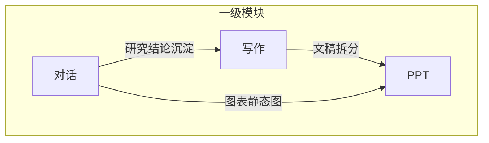

# 小窗产品需求整理

> 来源：小窗办公平台能力规划  
> 信息架构：按能力模块划分一级菜单，详见 [docs/product/功能清单.md](./功能清单.md)  
> 技术选型：详见 [docs/technical/技术方案.md](../technical/技术方案.md)  
> **当前产品范围（2026-06-26）：** 导航全部可见：**对话 / 写作 / PPT / 3D绘图 / 视频 / 推演**。其中对话、写作、PPT 为 Desktop Alpha / Beta 主线；3D绘图、视频、推演按 0.x 子线或 M1 / Beta 节奏推进。**翻译、会议纪要** 放到后续版本候选，不进入当前导航；**知识库** 明确不需要，不再建设独立模块。  
> **`0.1.0-alpha` / Desktop Alpha：** 深度交付 **对话** + **Electron 桌面壳**（包装同一 `web/`）+ Companion/CLI；3D / 视频 / 推演入口可见但不纳入 Alpha 主验收。  
> **`0.2.0-beta` / Desktop Beta：** 收口 **写作 / PPT**，并增强对话能力；3D M1 / 视频 0.x / 推演 Beta 按子线节奏验收。  
> **交付形态：** 小窗平台（独立部署，不内嵌第三方客户端）；当前以 **Desktop + 本地 Companion + 本地文件夹工作区** 为准；Web 在线沙箱化放到**下一大版本**。  
> **账号：** 手机号 + 验证码，登录即注册；不与外部业务系统账号打通。  
> **原型：** `web/`、`apps/desktop/`、`companion/`；见 [docs/plans/chat-execution-roadmap.md](../plans/chat-execution-roadmap.md)。

---

## 锁定规范：Web / Desktop 数据边界

- `Web` 只使用自己的隔离沙箱存储根，不读写桌面端本地项目目录。
- `Desktop` 只使用本地工作区：要么是用户显式选择的本地目录，要么是平台自动创建的默认本地目录，不回写 Web 沙箱。
- 两端默认不共享工作区文件、执行目录、运行缓存或任务执行状态，不做自动同步。
- 账号、登录态、业务元数据服务可按平台统一设计，但不改变工作区与执行面隔离原则。
- 跨端流转只允许通过显式导入、导出、下载、上传或分享完成。

---

## 导航结构（一级 / 二级）

| 一级菜单 | 二级菜单 |
|----------|----------|
| **对话** | 新对话、历史会话；（页内）快速 / 深度 |
| **写作** | 写作 |
| **PPT** | PPT |
| **3D绘图** | 3D绘图 |
| **视频** | 视频 |
| **推演** | 推演 |

---

## 1. 对话

### 1.1 模式

| 模式 | 说明 |
|------|------|
| 快速 | 快速响应 |
| 深度 | 分步推理或完整研究流程，由 Agent 按问题复杂度自行决策；复杂任务可展示研究导图并导出摘要 |

### 1.2 数据获取

- 接入数据源

### 1.3 可交互图表生成

- 提供**表格**和**图表**两种视图
- **表格**：可编辑、可排序；一键环比；一键变频
- **图表**：图例可自定义
- **通用**：一键复制；快速导出数据或图片

### 1.4 多信源分析

- 根据内容权威度对资讯、公告、研报、数据等分别总结分析
- 提供总结、异同点分析并给出信源推荐

### 1.5 可溯源

- 关键结论、数据、引用可跳转原文或数据源详情

---

## 2. 写作

### 2.1 模块定位

- 写作采用**对话式主路径**
- 默认加载 `skill-writing-general`
- 政策、专题、行业、宏观、行业数据等体裁通过对话内切换 Skill 触发

### 2.2 生成流程

- 用户描述需求
- Agent 判断是否先出大纲
- 大纲确认后继续成稿
- 产出 `.md` 落工作区，可导出 Word

### 2.3 输出

- 展示数据图表（复用对话模块能力）
- 输出文稿正文
- 支持 DOCX 导出，PDF 作为后续增强

---

## 3. PPT

### 3.1 模块定位

- PPT 采用**对话式主路径**
- 默认加载 `skill-ppt-pitch-deck`
- 其他模板与风格通过对话内切换 Skill 触发

### 3.2 生成流程

- 用户输入主题、用途、受众或直接给出文稿
- Agent 生成幻灯片大纲
- 用户确认后生成交付物
- 产出 `.pptx` / `.html` 落工作区

### 3.3 输出

- 在线预览
- 导出 **PPTX**
- 可选导出 PDF

---

## 模块关系概览

---

## 5. 智能体运行时（平台横切）

### 5.0 `0.1.0-alpha` 范围

| 纳入 `0.1.0-alpha` | 不纳入 `0.1.0-alpha`（`0.2.0-beta`+） |
|----------|---------------------|
| 对话两档模式、`parts[]`、侧栏状态、Turn 吸顶 | 数据源图表、多信源、可溯源 |
| **桌面壳**：Electron + `pickAndImportFolder` | 写作、PPT 正式业务闭环 |
| Companion + 多 CLI / 多模型/API 接入 | 模式 A 云端完整、管理员增强项 |
| 文件夹导入（桌面选目录主路径；手填降级） | HMAC、托盘、自动更新 |

### 5.1 执行模式

| 模式 | 说明 |
|------|------|
| **当前 Desktop 主路径** | **桌面壳（推荐）** → **本机 Companion** → 本机 CLI → 本地文件夹工作区（用户项目或平台默认目录） |
| **当前 Web 工程路径** | 浏览器 → **本机 Companion**；仅用于当前实现、联调与降级入口 |
| **下一大版本 Web 目标** | 浏览器 → 云端 Sandbox Runtime → 在线沙箱工作区 |

### 5.2 Agent CLI 适配集

| CLI | 说明 |
|-----|------|
| **Codex CLI** | 多文件工作区、写作、PPT |
| **Claude Code** | 深度分析、长文整理 |
| **Hermes CLI** | 与企业 Hermes 栈对齐；对话与工具扩展 |
| **其他已登记 CLI** | 纳入平台适配集的多 CLI / 多模型能力，按统一适配协议接入 |

### 5.3 能力要点

- **Companion**：当前 Desktop 新建对话默认创建平台默认本地工作区；「进入项目工作」通过**文件夹导入**绑定 `local_bound`
- **编排层**：模块注册表 → 流程 Skill（按模式/模板/任务类型）+ 横切规范 Skill
- **对话编排**：采用 `hybrid-steer`，即平台轻推送、Agent 自主选工具
- **统一执行主干**：CLI 与模型 API 后续共用同一套会话编排、工作区、Skills 与 SSE 事件流

---

## 6. 全局设置

### 6.1 入口

- **侧栏底部用户区**点击 → **弹出菜单** → 进入设置面板
- 不占对话/写作等四个业务一级菜单

### 6.2 弹出菜单（研究员 MVP）

| 菜单项 | 说明 |
|--------|------|
| 智能体与模型 | Companion 连接状态；CLI 状态；默认 Agent（Codex/Claude/Hermes）；模型档位 |
| 账号与权限 | 只读：脱敏手机号、已开通模块、数据权限摘要 |
| 关于与帮助 | 版本、复制诊断信息、帮助反馈 |

---

## 7. 账号与登录

| 项 | MVP |
|----|-----|
| 形态 | 独立 Web；路由 `/login` |
| 方式 | 手机号 + 短信验证码 |
| 注册 | 登录即注册，无单独注册页 |
| 退出 | 弹出菜单「退出登录」→ `/login` |
| 不做 | 微信扫码；外部业务系统账号绑定/SSO |

---

## 8. 当前版本判断

| 版本 | 重点 |
|------|------|
| **`0.1.0-alpha` / Desktop Alpha** | 对话 + 桌面壳 + Companion/CLI |
| **`0.2.0-beta` / Desktop Beta** | 写作 / PPT 收口，对话增强 |
| **Web Sandbox 1.0 / 下一大版本** | Web 在线沙箱工作区、云端运行时、多人协作、Nest 多用户后台 |

---

## 9. 延期与下线范围

- **会议纪要**：放到后续版本候选，不进入当前 Desktop Alpha / Beta 主线；是否恢复独立模块需重新立项
- **知识库**：明确不需要，不再作为平台业务模块推进
- 相关“入知识库”“知识库问答”等流程，不再作为当前或后续已规划范围
- 会议转写、会议纪要独立工作流不进入当前版本，但可作为后续版本候选重新评估
- 当前内容沉淀方式统一为：**历史会话 + 工作区文件产出**
- 当前 Desktop 默认工作区策略成立：未手动选项目时自动创建默认本地目录，这属于正式产品定义，不是待修问题
