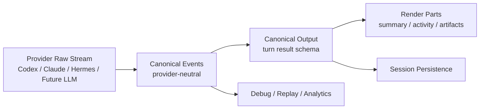

# 对话输出协议（多 CLI / 多 LLM 统一骨架）

| 属性 | 内容 |
|------|------|
| 文档版本 | v0.1 Draft |
| 创建日期 | 2026-05-22 |
| 状态 | Draft |
| 作者 | **Codex** |
| 目标 | 为 `codex` / `claude` / `hermes` 及未来更多 CLI / LLM 提供统一的对话输出协议与展示骨架 |
| 关联 | [chat-message-parts.md](./chat-message-parts.md)、[companion-api.md](./companion-api.md)、[chat-core-architecture.md](./chat-core-architecture.md) |

---

## 1. 背景与问题

当前对话模块已经具备：

1. 多 CLI 执行入口。
2. SSE 流式回传。
3. `parts[]` 分块渲染。
4. 工作区、文件、交付物等扩展能力。

但如果项目的核心目标是“**适配多 CLI、适配未来多 LLM**”，那么当前输出层仍有三个结构性问题：

1. **原始事件与展示分块耦合过深**：解析器、SSE、reducer、UI 都在重写语义。
2. **不同 Provider 输出协议差异大**：Codex / Claude / Hermes 事件模型不同，前端只能用启发式归一。
3. **最终答案骨架不稳定**：有时是正文流、有时是摘要块、有时过程噪声压过结论。

因此，本协议的目标不是限制 Agent “怎么思考”，而是约束系统“**无论接哪个 CLI / LLM，最终都要交付同一种可预期的输出结构**”。

---

## 2. 设计原则

### 2.1 Provider 自由，协议收敛

- 允许不同 CLI / LLM 采用各自擅长的推理、工具调用、阶段规划方式。
- 平台只要求它们最终映射成统一事件与统一输出骨架。

### 2.2 原始事件不丢，展示输出不混

- **Raw Events**：忠实记录 Provider 原始流事件。
- **Canonical Output**：跨 Provider 的标准化结果。
- **Render Parts**：前端最终展示模型。

三层分开，禁止直接把 Raw Events 当最终 UI。

### 2.3 最终答案优先

- UI 的主阅读对象必须是 `final_answer`。
- 推理、工具、阶段、命令、文件变更都属于辅助信息。
- 默认情况下，用户第一眼先看到结论，再决定是否展开过程。

### 2.4 结构稳定高于文风稳定

不同 LLM 的语气、长度、措辞可以不同；但以下结构必须稳定：

1. 是否完成。
2. 最终答案在哪里。
3. 引用在哪里。
4. 产物在哪里。
5. 下一步动作是什么。

---

## 3. 三层模型



### 3.1 Raw Events

来源于不同 Provider 的原始输出：

- Codex `exec --json`
- Claude `stream-json`
- Hermes `plain` / 未来结构化事件
- 未来 API model 的 function/tool stream

Raw Events 必须可存档、可回放，但**不直接暴露给用户 UI**。

### 3.2 Canonical Events

平台将 Raw Events 统一映射为标准事件流。

### 3.3 Canonical Output

一轮对话结束后，必须沉淀出统一的结果对象；前端、持久化、历史回灌都基于它。

### 3.4 Render Parts

`parts[]` 继续保留，但它不再是“唯一真相”，而是 `Canonical Output` 的展示投影。

---

## 4. Canonical Events（统一事件协议）

建议定义如下标准事件：

```ts
type CanonicalEvent =
  | { type: "run_accepted"; runId: string; timestamp: number; message?: string }
  | { type: "run_started"; runId: string; timestamp: number; provider: string; agentId: string; model?: string }
  | { type: "status_changed"; runId: string; timestamp: number; phase: string; label: string }
  | { type: "assistant_delta"; runId: string; timestamp: number; text: string }
  | { type: "reasoning_delta"; runId: string; timestamp: number; text: string }
  | { type: "tool_started"; runId: string; timestamp: number; callId: string; tool: string; message?: string; input?: unknown }
  | { type: "tool_finished"; runId: string; timestamp: number; callId: string; tool: string; status: "success" | "error" | "cancelled"; message?: string; output?: unknown }
  | { type: "artifact_found"; runId: string; timestamp: number; path: string; mime?: string; label?: string }
  | { type: "citation_found"; runId: string; timestamp: number; title: string; source: string; url?: string; snippet?: string }
  | { type: "todo_updated"; runId: string; timestamp: number; items: TodoItem[] }
  | { type: "run_waiting_user"; runId: string; timestamp: number; question?: string }
  | { type: "run_finished"; runId: string; timestamp: number }
  | { type: "run_failed"; runId: string; timestamp: number; code?: string; message: string }
  | { type: "run_cancelled"; runId: string; timestamp: number };
```

### 4.1 约束

1. 每个 Provider 适配层只负责 `Raw -> CanonicalEvent`。
2. reducer / UI / 持久化禁止直接解析 Provider 私有字段。
3. 所有事件必须带 `runId` 与 `timestamp`，以便回放与排障。

### 4.2 兼容现有实现

当前可以这样对齐：

- `message.delta` -> `assistant_delta`
- `tool.progress` -> `status_changed` / `tool_started` / `tool_finished`
- `run.started` -> `run_started`
- `run.finished` -> `run_finished`
- `run.error` -> `run_failed`
- `run.cancelled` -> `run_cancelled`

---

## 5. Canonical Output（统一轮次结果）

每一轮 assistant 输出结束后，必须产出一个标准结果对象。

```ts
type CanonicalTurnOutput = {
  protocolVersion: "1";
  sessionId: string;
  turnId: string;
  runId: string;
  provider: {
    agentId: string;
    providerId: string;
    model?: string;
  };
  outcome: {
    status: "success" | "waiting_user" | "cancelled" | "failed";
    finishedAt?: number;
    durationMs?: number;
    code?: string;
    message?: string;
  };
  finalAnswer: {
    markdown: string;
    title?: string;
    confidence?: "low" | "medium" | "high";
    language?: string;
  };
  rationale?: {
    summary?: string;
    bullets?: string[];
  };
  citations?: Array<{
    id: string;
    title: string;
    source: string;
    url?: string;
    snippet?: string;
  }>;
  artifacts?: Array<{
    path: string;
    label?: string;
    mime?: string;
    kind?: "primary" | "attachment" | "preview";
  }>;
  workspaceChanges?: Array<{
    path: string;
    kind: "read" | "created" | "modified" | "deleted";
    additions?: number;
    deletions?: number;
  }>;
  todos?: TodoItem[];
  nextAction?: {
    type: "none" | "ask_user" | "continue" | "open_artifact";
    message?: string;
  };
  debug?: {
    eventCount?: number;
    toolCallCount?: number;
    compressedHistory?: boolean;
  };
};
```

### 5.1 必填项

以下字段必须有：

1. `protocolVersion`
2. `sessionId`
3. `turnId`
4. `runId`
5. `provider.agentId`
6. `outcome.status`
7. `finalAnswer.markdown`

### 5.2 关键要求

#### A. `finalAnswer` 必须单独存在

禁止再依赖“把若干 `text part` 合并后猜出最终正文”。

#### B. `outcome` 必须单独存在

结束态不能只靠 UI 推断。

#### C. `citations` / `artifacts` / `workspaceChanges` 必须结构化

不要混在 Markdown 里碰运气抽取。

---

## 6. Render Parts（展示层建议）

建议保留 `parts[]`，但改成从 `CanonicalTurnOutput` 派生。

### 6.1 Summary 区

固定顺序：

1. `final_answer`
2. `citations`
3. `artifacts` / `deliverables`

### 6.2 Activity 区

固定顺序：

1. `status timeline`
2. `tool summary`
3. `workspace changes`
4. `rationale summary`

### 6.3 默认策略

- 默认先展示 `finalAnswer.markdown`
- Activity 默认折叠
- Reasoning 不展示完整原始流，只展示“摘要式 rationale”

---

## 7. 去掉 `fast / deep` 后的输出策略

如果用户侧去掉 `fast / deep`，平台仍需要保留**内部输出策略层**。

建议将每轮任务隐式归类为：

```ts
type TurnExecutionClass =
  | "direct_answer"
  | "light_analysis"
  | "tool_required"
  | "artifact_oriented";
```

### 7.1 作用

它不是给用户选的模式，而是给平台决定：

1. 是否强制要求 `citations`
2. 是否需要 `workspaceChanges`
3. 是否需要 `artifacts`
4. 是否允许只返回简短 `finalAnswer`

### 7.2 原则

Agent / LLM 可以自行决定下一步动作；  
但平台必须约束最终交付骨架。

---

## 8. 历史回灌建议

后续给模型回灌历史时，建议只回灌 `CanonicalTurnOutput` 的稳定字段，而不是整段展示噪声。

### 8.1 建议保留

1. 用户约束与明确要求
2. `finalAnswer.markdown` 摘要
3. `artifacts`
4. `nextAction`
5. 用户尚未完成的 `todos`

### 8.2 建议不回灌或弱化

1. 原始工具流水
2. 冗长 reasoning 全文
3. 展示性状态文案
4. 纯 UI 衍生字段

这样能降低上下文漂移，提升跨轮一致性。

---

## 9. 与现有代码的落地映射

### 9.1 `runtime-core`

新增职责：

1. Provider 解析器输出 `CanonicalEvent`
2. `CanonicalEvent` 聚合为 `CanonicalTurnOutput`
3. 输出给 Companion SSE 与会话持久化

### 9.2 Companion

SSE 不再只发“弱语义事件”，而是逐步升级为：

1. `canonical.event`
2. `canonical.output.patch`
3. `canonical.output.final`

兼容期内可继续保留现有：

1. `message.delta`
2. `tool.progress`
3. `part.append`

### 9.3 Web

前端分三层消费：

1. 调试视图读取 `CanonicalEvent`
2. 正常对话 UI 读取 `CanonicalTurnOutput`
3. `parts[]` 仅作为渲染适配层

---

## 10. 迁移路径

### Phase 0：协议先行

只新增类型与文档，不改现网逻辑。

### Phase 1：解析层收口

将 `codex-json`、`claude-jsonl`、`plain` 统一改为输出 `CanonicalEvent`。

### Phase 2：结果层落地

Companion 在每轮结束时生成 `CanonicalTurnOutput`。

### Phase 3：前端改读标准结果

`ChatTurnList`、`AssistantMessageBubble` 从“基于事件流临时拼装”迁移到“基于标准结果展示”。

### Phase 4：历史与评测

历史回灌、导出、稳定性回归测试全部基于 `CanonicalTurnOutput`。

---

## 11. 稳定性验收标准

对每个 Provider / LLM，都至少验证以下 6 项：

1. 是否稳定产出 `finalAnswer`
2. 是否稳定产出 `outcome`
3. 是否能把答案与过程分离
4. 是否能正确挂出 `citations` / `artifacts`
5. 是否能正确表达 `waiting_user` / `failed` / `cancelled`
6. 同类输入跨 Provider 时，结构是否同构

建议建立固定评测集，覆盖：

1. 直接问答
2. 多轮追问
3. 工具调用
4. 文件读写
5. 产物生成
6. 中断 / 失败 / 等待补充

---

## 12. 本文结论

这个项目如果要长期承载“多 CLI、多 LLM”的扩展，真正需要统一的不是 prompt 文风，而是**输出协议**。

建议采用：

1. `Raw Events`
2. `Canonical Events`
3. `Canonical Turn Output`
4. `Render Parts`

这四层分离模型。

这样做的收益是：

1. Provider 可自由替换
2. UI 输出稳定
3. 历史回灌更干净
4. 调试与回放更容易
5. 后续去掉 `fast / deep` 也不会丢失输出一致性

---

## 13. 作者说明

本文作者为 **Codex**，用于当前仓库“对话模块统一输出协议”讨论与后续实现收敛。
