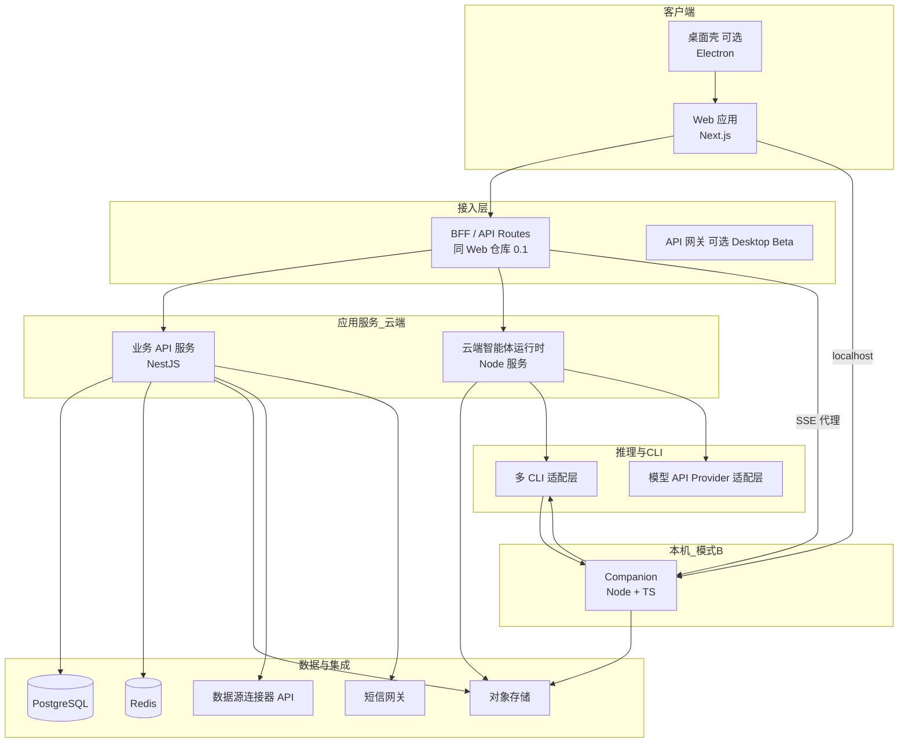
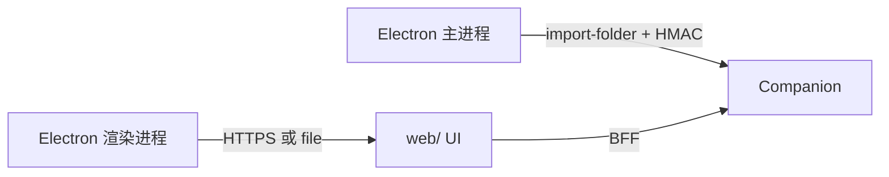

# 小窗 — 技术方案

| 属性 | 内容 |
|------|------|
| 文档版本 | v1.5 |
| 创建日期 | 2026-05-21 |
| 修订日期 | 2026-05-27 |
| 文档状态 | **已定稿（当前平台 `0.1.0-alpha` / Desktop Alpha；工作区架构按 PRD v4.1）** |
| 关联文档 | [PRD-小窗.md](../product/PRD-小窗.md)（v4.1 §5.3.2.1a/c、§6.0.4、§8.6）、[功能清单.md](../product/功能清单.md)、[mvp-closure-checklist.md](../plans/mvp-closure-checklist.md)、[hermes-client.md](./hermes-client.md) |
| 原型工程 | monorepo：`web/`、`companion/`、`apps/desktop/`、`packages/*` |
| 业务 API | `api/`（NestJS，见 [api/README.md](../../api/README.md)） |

> 本文档补齐 PRD 中分散的「实现阶段定义」项，给出 **语言、框架、运行时边界** 的统一口径。产品能力、分期与验收仍以 PRD 为准。

---

## 1. 总体原则

| 原则 | 说明 |
|------|------|
| **TypeScript 为主栈** | Web、BFF、云端 API、Companion、共享契约同一语言，降低 DTO 与 SSE 事件漂移 |
| **不自研 Agent 工具循环** | 模型与工具调用委托 **Agent CLI / LLM Provider Adapter**；平台只做统一编排、工作区、鉴权与领域 API |
| **浏览器不碰本机特权** | 读写信源、spawn CLI、真实路径解析仅在 **Companion**（当前 Desktop 主路径）或 **云端运行时**（下一大版本 Web 目标） |
| **Artifact-first** | 模块闭环以 `projectId` 工作区内可持久化文件为准；UI「不使用项目」时仍须 **一任务一目录**（§5.3.2.1a） |
| **Web / Desktop 存储域隔离** | `Web` 使用独立沙箱存储根；`Desktop` 使用本地工作区（用户选定目录或平台默认本地目录）；两端默认**不互通**，禁止自动 fallback 到对方存储域 |
| **Web-only 扩展** | `cloud-runtime`、`workspaceKind = cloud`、Web 专属 `catalogProfile`、Web 执行配置仅允许在 Web 运行面启用；桌面端固定继续使用 `companion` / `local_bound` 主路径 |
| **Surface Profile 硬隔离** | 每个运行面必须显式声明 `surfaceProfile`：`desktop` 或 `web`；不同 profile 的 execution backend、workspace kind、catalog profile、sandbox provider 不可混用 |
| **参考 Open Design 边界** | 本地执行面形态对齐 `open-design` 的 **Web + Daemon** 分工（见 §4.3）；小窗不整体 fork OD 产品，只复用架构模式与可借鉴模块 |

---

## 2. 系统分层与仓库规划



### 2.1 代码仓库（当前 monorepo）

| 目录 | 职责 | 语言 | 当前状态 |
|------|------|------|----------|
| `web/` | Web UI + BFF（`/api/chat`、`/api/sessions`、项目代理等） | TypeScript | ✅ 主入口 |
| `companion/` | 本机 Companion：spawn CLI、SSE、`/v1/sessions` 消息持久化 | TypeScript | ✅ 模式 B 执行面 |
| `apps/desktop/` | Electron 壳：选目录 IPC、内嵌 Web 打包 | TypeScript | ✅ 代码；安装包 ⬜ |
| `packages/runtime-core/` | Prompt 组装、Agent Kit、transcript 压缩、CLI spawn | TypeScript | ✅ |
| `packages/contracts/` | `@jlc/contracts`：auth、chat、sessions、projects DTO | TypeScript | ✅ |
| `api/` | NestJS：登录、项目与会话**元数据**（PostgreSQL） | TypeScript | 🔶 已初始化；Web 未全量切 |
| `prompts/platform/` | 平台 system Prompt（含 `chat-orchestration.md`） | Markdown | ✅ |
| `skills/` | 流程 Skill、横切规范、Catalog Profile（desktop / web） | Markdown | ✅ |
| `runtime/`（规划） | Web 在线沙箱所需云端智能体运行时 | TypeScript | 下一大版本 |
| `参考项目/open-design/` | 架构参考，**非**生产部署单元 | — | — |

**数据分工（`0.1.0-alpha`）：** 见 PRD **§8.6** — 消息全文在 Companion；Nest 管账号与会话索引；Web 不 spawn CLI。

`0.1.0-alpha` 默认 **`CHAT_EXECUTION=companion`**；`api` 与 Web 登录可并行演进，不阻塞单机演示。

### 2.1.1 Surface Profile 锁定

| `surfaceProfile` | 允许的执行面 | 允许的工作区 | 允许的 catalog profile | 说明 |
|------------------|--------------|--------------|-------------------------|------|
| `desktop` | `companion` | `local_bound` | `desktop` | 正式桌面主路径；不得启用 Web sandbox provider |
| `web` | `cloud-runtime` | `cloud` | `web` | 正式 Web 主路径；不得回退本机 Companion / 本地路径 |
| `dev-only` | `companion` 或调试 gateway | `local_bound` 或临时测试根 | `desktop` 或测试 profile | 仅限开发 / 演示，不得进入正式环境 |

运行时必须在启动阶段校验 `surfaceProfile` 与执行后端、工作区类型、catalog profile 的组合是否合法；非法组合直接报错，不允许静默 fallback。

### 2.2 Next.js 与 NestJS：关系与分工

二者**不是**同一框架的两种模式，也**不是**父子或替代关系，而是同一 TypeScript 生态里、各管一层的两个独立框架。

#### 各自定位

| | **Next.js** | **NestJS** |
|---|-------------|------------|
| 核心产物 | 研究员使用的 **Web 应用**（React 页面） | 云端 **业务 API 服务**（REST/内部 RPC） |
| 设计重心 | 路由、SSR、组件、静态资源、Route Handlers | 模块化解耦、守卫鉴权、ORM、队列、OpenAPI |
| 在本项目中的仓库 | `web/` | `api/`（规划新建） |
| 能否单独撑起全站 | 可以（API Routes 兼做后端），但 **不适合** 承载全部业务与 Agent 执行面 | 可以（仅 API），但 **不能** 替代 React 前端 |

#### 在本项目中的协作方式

```text
浏览器
  └─ Next.js（页面 + 薄 BFF：/api/*）
        ├─→ NestJS（用户、租户、项目元数据、设置、短信、数据源等业务 CRUD）
        ├─→ Companion（本机文件树、spawn CLI，localhost）
        └─→ 云端 Runtime（SSE 代理、对话与 Agent 流；内部可运行 Hermes/Codex/Claude 等执行器）
```

- **Next.js**：只面向浏览器；负责 UI 与 **BFF**（Cookie 会话、SSE 转发、隐藏内部密钥）。**不**在本进程内 spawn CLI、**不**直接读写用户本机目录。
- **NestJS**：面向 **服务端与内部调用**；负责要落库、要权限、要异步队列的 **领域服务**。**不**承担对话页渲染，也 **不** 替代 Companion / Runtime 的 Agent 执行职责。

#### 为何两个都要（而不是只用一个 Next）

| 若只用 Next API Routes 当全部后端 | 若拆出 NestJS |
|----------------------------------|---------------|
| 业务逻辑与 UI 同仓，后期 `web/` 臃肿 | 业务 API 独立部署、扩缩容 |
| Agent、Companion、长任务与页面发布耦合 | 权限、审计、业务索引等模块边界清晰 |
| 团队并行时易冲突 | 契约包 `packages/contracts` 由双方共同消费 |

`0.1.0-alpha` 可继续在 `web/src/app/api` 里 **Mock 或直连** NestJS；后续 Desktop Beta 起业务接口逐步以 Nest 为权威实现，Next 仅保留 BFF 与页面。

#### 常见误解（评审对照）

| 误解 | 正解 |
|------|------|
| 「用了 Next 就不需要 Nest」 | 小产品可以；本项目有 Companion、Runtime、大量领域 API，**建议拆分** |
| 「Nest 可以替代 Next 做前端」 | 不能；Nest 不提供 React 页面体系 |
| 「Nest 和 Next 必须绑死一家厂商」 | 无绑定；只是同属 Node/TS，便于共享类型与 monorepo |
| 「BFF 和业务 API 是同一件事」 | BFF 为浏览器适配（Cookie、聚合、代理）；Nest 为业务真相源（库表、规则） |

#### 与 PRD 术语的对应

| PRD 表述 | 技术落点 |
|----------|----------|
| 独立 Web | Next.js（`web/`） |
| 领域服务（登录、项目元数据、数据源等） | NestJS（`api/`） |
| 本地 Companion / 云端运行时 | 独立 Node 服务，**并列**于 Nest，不嵌套在 Nest 内 |
| 原型工程 `web/`（Next.js） | 当前已存在；Nest 为后续 `api/` 仓库 |

---

## 3. 前端技术栈

### 3.1 语言与框架

| 项 | 选型 | 版本建议 | 说明 |
|----|------|----------|------|
| 语言 | **TypeScript** | 5.x | 与 BFF、契约包一致 |
| 框架 | **Next.js**（App Router） | 16.x（与原型 `web/package.json` 对齐） | SSR/路由/API Routes；独立 Web 主入口 |
| UI 库 | **React** | 19.x | 与 Next 16 配套 |
| 样式 | **Tailwind CSS** | 4.x | 与 企业品牌视觉规范对接时，用 CSS 变量 / design tokens |
| 图标 | **lucide-react** | 当前原型已用 | — |
| 字体 | **next/font**（Geist + 思源宋体等） | — | 中文研报场景可读性 |

### 3.2 前端状态与数据

| 场景 | 方案 |
|------|------|
| 服务端会话、登录 | Cookie 经 BFF 读写；浏览器不存长期 Token（见 §5.2） |
| 对话流式 | `fetch` + **SSE**（`ReadableStream`）；事件类型见 `packages/contracts`；Turn 吸顶 + parts 见 PRD F-QA-009/007、[docs/technical/chat-message-parts.md](./chat-message-parts.md) |
| 工作区文件树 | 当前 Desktop：`GET` Companion；下一大版本 Web：`GET` 业务 API / Runtime |
| 客户端 UI 状态 | React `useState` / `useContext`；复杂设置面板可用 **Zustand**（Desktop Beta 引入，`0.1.0-alpha` 不强制） |
| 表单 | 原生 + 轻量校验；登录等可用 **react-hook-form** + **zod**（与契约共用 schema） |

### 3.3 前端工程化

| 项 | 选型 |
|----|------|
| 包管理 | **pnpm**（monorepo 时）/ npm（仅 `web/` 时可用 npm） |
| 代码规范 | **ESLint** + `eslint-config-next` |
| 组件文档 | 无 Storybook 要求；以 PRD + 原型页面为准 |
| 浏览器支持 | Chrome、Edge 最新两个大版本（PRD §7.4） |

### 3.4 桌面壳（Electron + Companion，`0.1.0-alpha` / Desktop Alpha §5.3.7）

> 详细设计：[docs/technical/folder-import-and-desktop-shell.md](./folder-import-and-desktop-shell.md)、[docs/technical/desktop-shell.md](./desktop-shell.md)

| 项 | 选型 | 说明 |
|----|------|------|
| 壳技术 | **Electron**（已决） | 与 Open Design `apps/desktop` 同构；主进程 `showOpenDialog` + `pickAndImportFolder` IPC |
| Companion | **独立进程**（不变） | 桌面壳不内嵌 spawn CLI；仍连 `127.0.0.1:9477` |
| 备选 | Tauri | 仅当 IT 强约束体积时评估；**非**当前 Desktop 主路径 |
| 与 Web 关系 | dev：`loadURL(localhost:3000)`；**打包**：`embedded-web.ts` 启动 `resources/web-standalone`（Next `output: "standalone"`） | 与浏览器同一构建产物 |
| 文件夹导入 | 主进程 → `POST /v1/projects/import-folder` | 渲染进程仅收 `projectId`；Web 降级为手填路径 + Companion 校验 |
| 安全 | `contextIsolation` + 窄 IPC；Desktop Beta **HMAC** `X-JLC-Desktop-Import-Token` | 对齐 OD PR #974 思路 |
| 打包 | **electron-builder** + `scripts/prepare-desktop-web.mjs` | `pnpm desktop:pack`；Companion 仍独立进程 |
| 仓库 | `apps/desktop/` | 见 PRD §5.3.7、§12.5.8 |



**分期：** **`0.1.0-alpha` / Desktop Alpha** = `apps/desktop` Electron 加载 `web/` + `pickAndImportFolder` + 独立 Companion + 对话真流；当前浏览器手填路径仅作工程降级；**`0.2.0-beta` / Desktop Beta** = HMAC、托盘、Companion 捆绑、自动更新、内测包签名分发。

---

## 4. 后端与服务端技术栈

后端按 **三条运行时** 划分，避免把 CLI 与业务 CRUD 耦在一个进程里。

### 4.1 BFF（边界层）

| 项 | 选型 | 说明 |
|----|------|------|
| 实现 | **Next.js Route Handlers**（`web/src/app/api/**`） | `0.1.0-alpha` 与 UI 同仓，减少联调成本 |
| 职责 | 鉴权 Cookie 转发、SSE 代理、聚合下游 API、隐藏内部密钥 | **不**直接 spawn CLI、**不**直连本机文件系统 |
| 运行时 | Node.js（`export const runtime = "nodejs"`） | 与现有 `/api/chat` 一致 |

Desktop Beta 后若团队扩大，可将 BFF 迁到独立 `gateway` 或由 **Nginx / 云 API 网关** 承担静态路由，Web 仅保留纯静态 + SSR。

### 4.2 业务 API 服务（云端）

| 项 | 选型 | 说明 |
|----|------|------|
| 语言 | **TypeScript** | |
| 框架 | **NestJS** | 模块化（用户、租户、项目元数据、设置、审计）；适合企业内 CRUD 与守卫 |
| HTTP | REST（JSON）；部分列表/导出可用流式 | OpenAPI 文档用 `@nestjs/swagger` |
| ORM | **Prisma** | 迁移清晰，与 PostgreSQL 配合 |
| 校验 | **Zod** 或 **class-validator** | 与 `packages/contracts` 对齐 |
| 任务队列 | **BullMQ** + Redis | 异步导出、文件处理、长任务编排 |
| 文件 | 上传走 API → **对象存储**；元数据入 PG | |

**不负责：** spawn Agent CLI、解析 CLI stdout（交给 Runtime 或 Companion）。

业务 API、账号、租户、项目元数据、审计索引可以被 Web / Desktop 共同使用；隔离的是**工作区文件、执行目录、运行缓存、任务执行状态与沙箱资源**，不是强制拆成两套后台主库。

### 4.3 Companion（模式 B，本机）

| 项 | 选型 | 说明 |
|----|------|------|
| 语言 | **TypeScript** | |
| 运行时 | **Node.js** LTS（20+） | 与 CLI 子进程、文件 IO 成熟 |
| HTTP 服务 | **Fastify** 或 **Hono** | 轻量、localhost 监听；仅本机访问 |
| 本地存储 | **SQLite**（`better-sqlite3`） | 缓存项目索引、配对状态、最近会话；**非**业务主库 |
| 文件 | 直接读写 `local_bound` 根目录；**平台默认工作区** `{Documents}/XIAOCHUANG/{module}/{YYYY-MM-DD}/{标题}/`（PRD §5.3.2.1b） | `import-folder` 绑定不复制；`ensure-default-task-project`；`realpath` + 主目录边界 |
| Agent | 受控模板 spawn **平台登记的多款 CLI** | 禁止用户任意 shell；对齐 Open Design daemon `agents` 边界 |
| 流式 | **SSE** 或 NDJSON 推送到 Web | 事件名与 `packages/contracts` 一致 |
| 打包 | **electron-builder** 捆绑（随桌面壳）或独立安装包 | Windows / macOS 当前至少一种 |

实现上 **参考** `open-design/apps/daemon` 的模块划分（`fs` / `agents` / `tasks` / `projects`），按小窗 PRD 裁剪（数据源、平台登记 CLI 适配集、企业扩展表）。

**代码骨架：** [`companion/`](../../companion/README.md)（`pnpm --filter @jlcresearch/companion dev`，默认 `127.0.0.1:9477`）。

### 4.4 云端智能体运行时（下一大版本 Web 目标）

| 项 | 选型 | 说明 |
|----|------|------|
| 语言 | **TypeScript** | 可复用 `packages/runtime-core` 中与运行面无关的能力；Web profile 的 catalog、provider、workspace broker 必须独立配置 |
| 部署 | 容器 **Docker** + **Kubernetes**（或企业等价 PaaS） | 多租户隔离 |
| 工作区 | **对象存储**（见 §6）+ 索引表在 PostgreSQL | `workspaceKind = cloud` |
| CLI | 镜像内预装平台登记的 CLI 适配集 | 版本矩阵与 Companion 一致，CI 回归 |
| 与 API 关系 | Runtime 通过内部消息或 HTTP 回调 API 更新任务状态 | 避免 Runtime 直接操作用户表 |

#### 4.4.1 Web Sandbox 参考 Suna 的可抄边界

> 参考对象：`kortix-ai/suna`。只抄“执行底座”，不抄“公司级 agent command center”外壳。

| 可抄内容 | 说明 |
|---------|------|
| 独立云端沙箱执行面 | Web 的正式执行面应是独立云端 Runtime，而不是复用用户本机进程 |
| 任务级隔离 | 每个会话 / Run 进入独立工作区或临时执行根，运行结束后只保留产物与审计 |
| 受控 CLI 执行 | CLI 只是 Runtime 内部执行器，按白名单 / 镜像固定版本运行 |
| 资源与权限隔离 | 容器、网络、文件、密钥按租户 / 会话 / 任务隔离 |
| 审计与回放 | Run 事件、文件产物、审批动作都要可追踪 |
| 显式产物流 | 文件、报告、导出、下载、预览都应归入统一产物链路 |

| 不建议照搬 | 原因 |
|----------|------|
| Git repo / branch / change request 作为主叙事 | 我们的主产品是内容生产与工作区产出，不是代码协作平台 |
| 每个 session 都以“开分支-提交-提审”定义交付 | 对我们而言交付物应直接落工作区，必要时才附加审阅流 |
| 重型企业 command center 门面 | 会把产品心智拉偏到“agent 管理台”，不利于对话 / 写作 / PPT 的主路径 |
| 将 Agent 暴露为对外主角色 | 我们对外应讲“智能执行引擎”与“工作区”，而不是 Agent 平台 |

**推荐落点：**

- 借鉴 Suna 的 sandbox 与审计思路，作为 Web 的执行底座。
- 不借鉴它的 repo-centric 产品叙事，避免把 Web 做成“AI 版 GitHub 工作台”。

#### 4.4.2 Web Sandbox 锁定原则

`Web Sandbox 1.0` 按以下原则锁定：

1. **不抄外壳，只抄底座。** Web 不采用 `git repo / branch / change request` 作为主产品叙事，不采用 `command center` 门面，不将 Agent 作为对外主角色。
2. **产品心智以任务、工作区、产物为中心。** 用户看到的是对话、写作、PPT、文件、导出、预览与继续处理，不是仓库分支与会话代码流。
3. **执行纪律必须保留。** 即使不采用 Suna 的产品外壳，也必须保留云端沙箱、任务级隔离、受控 CLI、密钥注入、审计回放、资源限制、审批点等运行时底座能力。
4. **Agent 仅作为内部智能执行引擎。** `hermes`、`codex`、`claude` 等执行器属于 Runtime 内部实现细节；前端与产品文案统一面向“智能执行”与“工作区产出”。
5. **Skill 仍是核心驱动层。** 复杂场景、模块差异、模板切换、流程分支仍由 Skill / 模板 / 编排决定；Agent 只负责执行 Skill 要求的动作，不作为业务主语。
6. **交付物直接落工作区。** Web 的正式交付以工作区文件和产物卡片为准；如后续需要审阅流，应作为附加能力建设，而不是把 Git CR 流程上升为主路径。
7. **Web-only 配置不可回流桌面。** `cloud-runtime`、Web 专属 catalog、Web workspace 语义、Web 专属沙箱 provider 只能在 Web 运行面生效；Desktop 固定锁定 `companion + local_bound`，不跟随 Web 新特性自动升级。

这意味着：**我们可以深度借鉴 Suna 的 sandbox 技术方案，但不把产品做成 Suna。**

#### 4.4.3 Web Sandbox 1.0 首版 Provider 契约

Web Sandbox 1.0 需先锁一版最小 `SandboxProvider` 契约，研发按此实现：

| 能力 | 首版要求 |
|------|----------|
| 建箱单位 | **每个 Run 一个独立容器 / Pod**，默认不复用长期共享执行容器 |
| 执行镜像 | 预装平台登记 CLI、基础系统工具、平台运行时依赖 |
| 工作区挂载 | 为每个 Run 分配独立 `cloud workspace` 前缀，并映射到容器内工作目录 |
| 密钥注入 | 按租户 / 用户 / Run 注入最小必要密钥，Run 结束自动失效 |
| 网络策略 | 默认白名单出网；是否开放公网搜索、抓取、第三方 API 按 Skill / 模块策略控制 |
| 资源限制 | CPU、内存、磁盘、超时必须可配置，并记录到审计 |
| 产物抽取 | 运行结束后扫描工作区产物并回写索引；前端只看产物链路，不看容器内部路径 |
| 清理策略 | Run 结束后执行 TTL 清理；只保留产物、日志、审计、必要恢复信息 |

首版不要求多 provider 并行，但接口必须预留 `SandboxProvider` 抽象；默认实现可锁为 `k8s-pod-provider` 或企业等价实现。

### 4.5 对话执行：Companion API（当前主路径）与 Web 执行后端约束

| 项 | 选型 | 说明 |
|----|------|------|
| **当前主路径** | Companion `POST /v1/runs` + SSE | 按 `agentId` spawn 本机**平台登记 CLI**；契约见 [docs/technical/companion-api.md](./companion-api.md)、PRD §8.5 |
| Desktop 正式后端 | `CHAT_EXECUTION=companion` | 仅允许在 `surfaceProfile=desktop` 或本地开发态使用 |
| Web 正式后端 | `CHAT_EXECUTION=cloud-runtime` | 正式 Web 唯一允许的执行后端 |
| **原型捷径** | [hermes-agent](https://github.com/NousResearch/hermes-agent) gateway | 仅允许开发 / 演示态临时接入，不得定义为正式 Web 架构分支；见 [docs/technical/hermes-client.md](./hermes-client.md) |
| 定位 | `Hermes`、`Codex`、`Claude` 属于 Runtime / Companion 内部 `agentId` 或执行器实现细节 | 它们不是产品架构层的执行分支 |

#### 4.5.1 ExecutionBackend 锁定

| `surfaceProfile` | `ExecutionBackend` | 是否允许 |
|------------------|--------------------|----------|
| `desktop` | `companion` | ✅ |
| `desktop` | `cloud-runtime` | ⛔ 默认禁止，除非未来单独立项 |
| `web` | `cloud-runtime` | ✅ |
| `web` | `companion` | ⛔ 正式环境禁止 |
| `web` | `hermes-gateway-direct` | ⛔ 正式环境禁止 |
| `dev-only` | `companion` / `hermes-gateway-direct` / `cloud-runtime` | ✅ 仅开发态 |

---

## 5. 横切能力选型

### 5.1 数据存储

#### 5.1.0 Web / Desktop 存储隔离总则

| 项 | 规范 |
|------|------|
| Web 存储根 | 仅使用平台提供的隔离沙箱根或其对象存储前缀 |
| Desktop 存储根 | 仅使用本地工作区根：用户显式选择的本地目录，或平台自动创建的默认本地目录 |
| 数据互通 | 默认不共享**工作区文件、执行目录、运行缓存、任务执行状态**；账号与业务元数据服务是否共享由平台单独定义 |
| 自动同步 | 默认禁止；如后续需要，只能作为显式能力单独设计 |
| 兼容实现 | 上层只依赖统一 `workspace root` 抽象；运行时分别解析为 `webSandboxRoot` 与 `localWorkspaceRoot` |
| 禁止项 | 不得让 Web 回退读写本地项目目录；不得让 Desktop 回退读写 Web 沙箱或云端工作区 |

> 说明：Companion 的应用级元数据、配对信息、诊断状态等可存放在独立应用数据目录；该目录不属于用户工作区，也不构成 Web / Desktop 工作区互通。

| 用途 | 技术 | 说明 |
|------|------|------|
| 业务主库 | **PostgreSQL** 15+ | 用户、租户、会话元数据、`projectId` 映射、审计 |
| 缓存 / 会话辅助 | **Redis** 7+ | 验证码限流、登录会话索引、BullMQ、热点配置 |
| Web 在线工作区 / 上传文件 | **对象存储**（S3 兼容） | 阿里云 OSS / 腾讯云 COS / MinIO（内网）；**实现选型由运维确定**，应用层统一 S3 SDK |

### 5.1.1 Web 在线工作区 OSS 前缀（与 PRD §5.3.2.1c 一致，v3.6.6）

| 项 | 约定 |
|----|------|
| 用途 | `workspaceKind = cloud` 的任务级工作区；Agent 产出、用户上传、文件树/`@` 均指向此前缀 |
| 桶 | 企业独立 bucket 或前缀隔离；`tenantId` / `userId` 强制出现在 key 路径中 |
| Key 模板 | `tenants/{tenantId}/users/{userId}/XIAOCHUANG/{moduleSegment}/{YYYY-MM-DD}/{标题简写}/` |
| `moduleSegment` | 与 `web/src/lib/module-registry.ts` 的 `workspaceSegment` 一致，禁止硬编码 |
| `projectId` 映射 | PostgreSQL `projects.storage_prefix`（或等价字段）存完整前缀；API 返回 `pathSummary` 为任务展示名，**不**返回 OSS URI |
| Runtime | 容器内将前缀挂载为 cwd，或 S3 SDK 读写；Companion **不**代理 Web 在线工作区（无 Companion 场景） |
| 与本地 XIAOCHUANG | 语义对齐、物理分离；模式 B 落 `~/Documents/XIAOCHUANG/…`；**不**假设 cloud 可读本地盘 |
| 阶段 | **下一大版本** 实现与验收；当前版本可不部署 Runtime/OSS 工作区 API |
| Companion 本地 | **SQLite** | 仅本机；不同步为权威数据源 |
| 向量检索（后续如启用） | **pgvector** 或专用向量库 | 仅在后续确有在线检索需求时评估 |

### 5.2 身份认证与会话

| 项 | 已定选型 |
|----|----------|
| 登录方式 | 手机号 + 短信验证码（PRD §6.12） |
| 会话载体 | **HttpOnly + Secure + SameSite=Lax Cookie**，存服务端会话 ID |
| 会话存储 | Redis（TTL）+ PostgreSQL 会话表（审计、踢下线） |
| 不使用 | `0.1.0-alpha` 不做外部 SSO、微信 OAuth |
| BFF | 校验 Cookie，转发 `X-User-Id` / 内部 JWT 给 API（内网 mTLS 或签名头） |

> PRD 中「Cookie 或 Bearer 二选一」：**对外 Web 统一 Cookie**；服务间可用短期 **Bearer（内部 JWT）**。

### 5.3 实时与通信

| 场景 | 协议 |
|------|------|
| 对话 / Agent 进度 | **SSE**（首选） |
| Companion ↔ Web | HTTPS localhost 或 127.0.0.1 HTTP（开发）；生产配对 token（PRD OQ-13） |
| WebSocket | Desktop Beta 可选（终端推送）；协作放到 Web Sandbox；`0.1.0-alpha` 不引入 |

### 5.4 外部集成

| 集成 | 方式 |
|------|------|
| 数据源连接器 API | 业务 API 服务端调用；权限按本平台 `userId`/租户 |
| 短信 | 阿里云短信 / 腾讯云短信（当前选定其一，抽象 `SmsProvider` 接口） |
| 翻译 | 第三方 API（翻译模块）；异步队列 |
| BYOK | Runtime / Companion 出站代理；SSRF 防护、Key 加密存储（PRD §7.6） |

---

## 6. Skill、编排与模块注册

| 项 | 实现 |
|----|------|
| 模块注册表 | TypeScript 配置 `web/src/lib/module-registry.ts`（或 `packages/contracts`） |
| 流程 Skill | 仓库 `skills/<slug>/SKILL.md` + `references/` |
| Catalog Profile | 至少拆分 `desktop` / `web` 两套 profile；允许共享 Skill 仓库，不允许共享同一份可见面配置 |
| 横切规范 | `skills/platform-research-norms/` 固定注入 |
| 模板资产 | `templates/` 静态资源（HTML PPT、报告版式等），由 Skill 引用，**不**作为 Agent 入口 |
| 注入时机 | Companion / Runtime 在 spawn CLI 前组装 system + skill 片段 |
| **对话编排（F-RT-008）** | **hybrid-steer**：`mode` → 基座 `skill-qa-*`；按 `catalogProfile` 选择 `desktop` 或 `web` catalog 摘要进 system；`prompts/platform/chat-orchestration.md`；扩展 Skill/工具 **Agent 自选**，无 mandatory Router |

与 PRD §6.10.1a、F-RT-008、[docs/technical/chat-core-architecture.md](./chat-core-architecture.md) 一致；Open Design「functional skills vs design-templates」分工不变。

### 6.1 Skill 的职责边界

| 层 | 谁负责 | 做什么 | 不做什么 |
|----|--------|--------|----------|
| 业务入口 | Web / Desktop UI | 识别用户意图、模块、模式、模板 | 不直接决定 CLI 行为 |
| Skill 解析 | `module-registry` + `catalogProfile` + `resolveSkills()` | 选择基座 Skill、候选 Skill、横切规范 | 不执行任务本身 |
| Prompt 编排 | `runtime-core` | 按 `surfaceProfile` / `catalogProfile` 组装 system / user / kit | 不替代业务策略 |
| 执行引擎 | Companion / Cloud Runtime | spawn CLI、读写文件、流式回传 | 不决定业务语义 |
| 结果归档 | 工作区 / 产物卡片 | 保存文件、导出物、摘要、审计 | 不替代 Skill 逻辑 |

### 6.2 Skill 驱动原则

Web / Desktop 的复杂场景必须由 Skill 驱动，原因如下：

1. **Skill 是流程语义，不是执行器细节。** 对话、写作、PPT、数据整理、导出、审阅等场景，真正需要稳定的是“怎么做”，而不是“哪个 CLI 在跑”。
2. **Skill 是模块差异的承载层。** 同样是 `agentId=codex`，进入写作、PPT、对话时应分别走不同的流程 Skill 与模板，而不是靠执行器猜。
3. **Skill 是治理与复用单位。** 模板、约束、示例、参考文件、输出格式都应跟随 Skill 演进，便于版本化、审阅和回滚。
4. **Skill 由平台选择，执行由 Agent 完成。** 平台负责在 Run 启动前装配正确的 Skill 栈；Agent 负责按 Skill 要求完成具体动作。
5. **Skill 不等于硬路由。** 我们不做每轮 mandatory Router，但必须保留可见目录、按需 Pull、基座默认注入和显式触发。

### 6.3 推荐的 Skill 使用顺序

1. `module-registry` 根据 `moduleId` 和 `binding` 选出基座 Skill。
2. `catalogProfile` 根据 `surfaceProfile` 选择 `desktop` 或 `web` 的可见 Catalog；Catalog 只提供候选，不强制注入。
3. `skills/platform-research-norms` 作为横切规范固定叠加。
4. `runtime-core` 组装 system / user / kit。
5. Agent 在执行过程中按需 Pull 额外 Skill、`references/`、模板资产或工作区文件。

这样做的结果是：**流程由 Skill 主导，执行由 Agent 完成，产品由工作区产物承接。**

---

## 7. 部署与运维

| 环境 | 组件 |
|------|------|
| 开发 | `web`: `pnpm dev`；Companion 本地进程；Hermes `gateway`；API/Postgres/Redis Docker Compose |
| 测试 / 预发 | Web 静态 + Node BFF 或 Vercel 预览；API + Runtime K8s；OSS 独立桶 |
| 生产 | Web：**CDN + Node 宿主**（或 Vercel 仅托管 Web 层）；API/Runtime：**K8s**；OSS + RDS + Redis 托管 |
| 本机分发 | Companion + CLI 版本矩阵通过 **MDM / 安装包**（PRD §5.3.4 B0） |

| 项 | 选型 |
|----|------|
| 容器基础镜像 | `node:20-bookworm-slim` |
| CI | GitHub Actions / 企业 GitLab CI：lint、typecheck、单测、镜像构建 |
| 观测 | **OpenTelemetry** + 日志聚合（实现可选 Datadog / 自建 ELK）；关键路径：对话首 token、CLI 退出码、Companion 心跳 |

---

## 8. 与 PRD 的对应关系

| PRD 概念 | 本方案落点 |
|----------|------------|
| 独立 Web | §3 Next.js |
| 模式 B Companion | §4.3 Node + TS，Fastify/Hono |
| Web 在线沙箱运行时 | §4.4 TS Runtime + K8s + **OSS 工作区**（§5.1.1） |
| 多 CLI 适配集 | §4.3 / §4.4 受控 spawn |
| WorkspaceAdapter / ExecutionAdapter | `packages/contracts` + Companion/Runtime 各实现适配器 |
| 领域服务（ASR、RAG、数据源） | §4.2 NestJS API |
| 桌面壳 / 文件夹导入 | §3.4 Electron **Desktop Alpha**；[folder-import-and-desktop-shell.md](./folder-import-and-desktop-shell.md) |
| `0.1.0-alpha` 业务深度 | 仅对话；`web/` + `apps/desktop/` + `companion/` |
| 对话混合编排 | F-RT-008；路线图 S1O；[chat-core-architecture.md](./chat-core-architecture.md) |

---

## 9. 分期落地顺序

| 阶段 | 交付 | 技术动作 |
|------|------|----------|
| **Phase 0** | 契约 + 适配层 | 建 `packages/contracts`；`Project` / `Session` / SSE 类型；Web 抽象 `WorkspaceAdapter` |
| **`0.1.0-alpha` / Desktop Alpha** | 对话 + 桌面壳 + Desktop 本地主路径 | `apps/desktop` + `companion` + `web` 对话 S1/S2/S4；**不**强制 Web 在线沙箱、Nest 全量业务模块 |
| **`0.2.0-beta` / Desktop Beta** | 主线模块收口 + Desktop 增强 | 写作 / PPT 收口、对话增强；3D / 视频 / 推演按子线推进；HMAC、托盘；F-RT-006；继续强化本地 Companion 主路径 |
| **Web Sandbox 1.0 / 下一大版本** | Web 在线沙箱完整、企业共享能力 | 云端 Runtime、多区域 OSS、多用户与协作 |

---

## 10. 已定 vs 待运维确认

### 10.1 已定（研发按此执行）

- 前端：**TypeScript + Next.js 16 + React 19 + Tailwind 4**
- BFF：**Next.js Route Handlers（Node）**
- 业务 API：**TypeScript + NestJS + Prisma + PostgreSQL**
- Companion / 云端 Runtime：**TypeScript + Node.js**；Companion HTTP 用 Fastify/Hono
- 缓存队列：**Redis + BullMQ**
- 文件：**S3 兼容对象存储**
- 对外鉴权：**HttpOnly Cookie 会话**
- Agent：**多 CLI / 多模型适配**（不自研 loop）
- Skill：**流程主驱动层**，负责场景路由、模板切换、步骤编排与输出约束
- Surface Profile：**`desktop` / `web` 硬隔离**，启动阶段必须校验 execution backend、workspace kind、catalog profile、provider 组合合法
- Desktop 兼容护栏：**Web-only 的 runtime / workspace / catalog / provider 配置不进入桌面默认路径**
- Web Sandbox 借鉴边界：**只借鉴 Suna 的云端沙箱执行底座，不借鉴其 repo-centric 产品外壳**
- Web 正式执行后端：**仅 `cloud-runtime`**；`Hermes gateway` 仅保留开发 / 演示态捷径
- 桌面壳：**Electron + 独立 Companion**（`0.1.0-alpha` / Desktop Alpha §5.3.7）
- 本地项目：**文件夹导入** `import-folder`；正式产品路径以 Desktop 系统选目录为主；Web 手填路径仅保留工程降级

### 10.2 待运维 / 企业确认（不影响架构选型）

| 项 | 选项 |
|----|------|
| 对象存储厂商 | 阿里云 OSS / 腾讯云 COS / MinIO |
| 短信厂商 | 阿里云 / 腾讯云 |
| K8s 平台 | 客户现有容器云 |
| 内网 Hermes / API 地址 | 环境配置 |
| Companion 配对鉴权细节 | token vs 一次性配对码（PRD OQ-13） |

---

## 11. 修订记录

| 版本 | 日期 | 说明 |
|------|------|------|
| v1.4 | 2026-05-23 | 对齐 PRD v3.5：§2.1 当前 monorepo 表、§8.6 数据分工引用、§3.4 内嵌 Web 打包 |
| v1.3 | 2026-05-21 | 对齐 PRD v3.3：F-RT-008 hybrid-steer、chat-catalog |
| v1.2 | 2026-05-21 | 对齐 PRD v3.0：MVP = 对话 + Electron 桌面壳；§3.4、§9 分期 |
| v1.1 | 2026-05-21 | 新增 §2.2：Next.js 与 NestJS 关系与分工 |
| v1.0 | 2026-05-21 | 初版：前后端语言、框架、运行时边界、存储与分期 |
