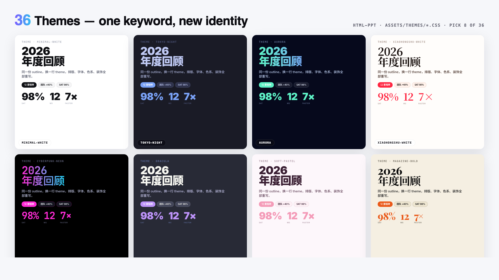
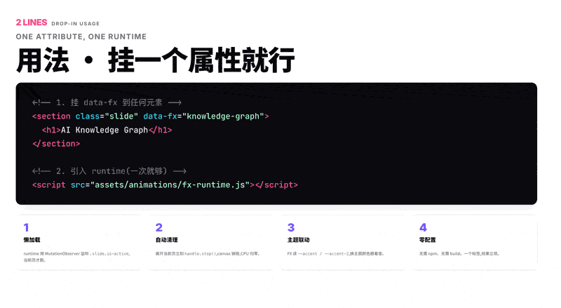
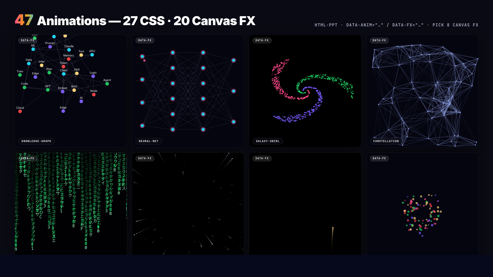

# html-ppt — HTML PPT Studio

> Uma AgentSkill de classe mundial para produzir apresentações HTML profissionais em
> **36 temas**, **15 templates de deck completo**, **31 layouts de página**,
> **47 animações** (27 CSS + 20 canvas FX) e um **modo apresentador de verdade**
> com previews pixel-perfect + roteiro do orador + cronômetro — tudo em
> HTML/CSS/JS estático puro, sem build step.

**Autor:** lewis &lt;sudolewis@gmail.com&gt;
**Licença:** MIT
**中文文档:** [README.zh-CN.md](README.zh-CN.md)
**English:** [README.md](README.md)


> Um comando instala **36 temas × 20 canvas FX × 31 layouts × 15 decks completos + modo apresentador**. Cada preview acima é um iframe ao vivo de um arquivo de template real renderizando dentro do deck — sem screenshots, sem mock-ups.

## 🎤 Modo Apresentador (novo!)

Aperte `S` em qualquer deck para abrir uma janela dedicada de apresentador com quatro
**magnetic cards** arrastáveis e redimensionáveis: slide atual, preview do próximo
slide, roteiro do orador (逐字稿) e cronômetro. As duas janelas ficam sincronizadas
via `BroadcastChannel`.


**Por que os previews são pixel-perfect:** cada card é um `<iframe>` que carrega o
mesmo HTML do deck com um query param `?preview=N`. O runtime detecta isso e
renderiza apenas o slide N sem chrome — então o preview usa **o mesmo CSS,
tema, fontes e viewport** que a visão da audiência. Cor e layout ficam
garantidamente idênticos.

**Navegação suave (sem reload):** ao mudar de slide, a janela apresentador
manda `postMessage({type:'preview-goto', idx:N})` para cada iframe. O iframe
apenas alterna `.is-active` entre slides — **sem reload, sem flicker**.

**Regras de roteiro do orador (3 de ouro):**
1. **Sinais de prompt, não falas para ler** — destaque as palavras-chave em negrito,
   separe frases de transição em parágrafos próprios
2. **150–300 palavras por slide** — esse é o ritmo de ~2–3 min/página
3. **Escreva como você fala** — conversacional, não prosa escrita

Veja [`references/presenter-mode.md`](references/presenter-mode.md) para o
guia completo de autoria, ou copie o template pronto em
`templates/full-decks/presenter-mode-reveal/`, que vem com roteiros completos
de 150–300 palavras em todos os slides.

## Instalação (um comando)

```bash
npx skills add https://github.com/lewislulu/html-ppt-skill
```

Isso registra a skill no seu runtime de agente. Após a instalação, qualquer agente
que suporta AgentSkills pode autorar apresentações pedindo coisas como:

> "做一份 8 页的技术分享 slides，用 cyberpunk 主题"
> "transforme este outline num pitch deck"
> "做一个小红书图文，9 张，白底柔和风"

## O que vem na caixa

| | Quantidade | Onde |
|---|---|---|
| 🎤 **Modo apresentador** | **NOVO** | tecla `S` / `?preview=N` |
| 🎨 **Temas** | **36** | `assets/themes/*.css` |
| 📑 **Templates de deck completo** | **15** | `templates/full-decks/<nome>/` |
| 🧩 **Layouts de página única** | **31** | `templates/single-page/*.html` |
| ✨ **Animações CSS** | **27** | `assets/animations/animations.css` |
| 💥 **Animações Canvas FX** | **20** | `assets/animations/fx/*.js` |
| 🖼️ **Decks de showcase** | 4 | `templates/*-showcase.html` |
| 📸 **Screenshots de verificação** | 56 | `scripts/verify-output/` |

### 36 Temas

`minimal-white`, `editorial-serif`, `soft-pastel`, `sharp-mono`, `arctic-cool`,
`sunset-warm`, `catppuccin-latte`, `catppuccin-mocha`, `dracula`, `tokyo-night`,
`nord`, `solarized-light`, `gruvbox-dark`, `rose-pine`, `neo-brutalism`,
`glassmorphism`, `bauhaus`, `swiss-grid`, `terminal-green`, `xiaohongshu-white`,
`rainbow-gradient`, `aurora`, `blueprint`, `memphis-pop`, `cyberpunk-neon`,
`y2k-chrome`, `retro-tv`, `japanese-minimal`, `vaporwave`, `midcentury`,
`corporate-clean`, `academic-paper`, `news-broadcast`, `pitch-deck-vc`,
`magazine-bold`, `engineering-whiteprint`.



Cada um é um arquivo de tokens CSS puro — troque um `<link>` para reskinnar o deck inteiro.
Navegue por todos em `templates/theme-showcase.html` (cada slide renderizado em um
iframe isolado, garantindo visualmente que tema ≠ tema).


### 15 Templates de deck completo

Oito extraídos de decks reais, sete scaffolds genéricos por cenário:

**Visuais extraídos**
- `xhs-white-editorial` — 小红书白底杂志风
- `graphify-dark-graph` — 暗底 + 力导向知识图谱
- `knowledge-arch-blueprint` — 蓝图 / 架构图风
- `hermes-cyber-terminal` — 终端 cyberpunk
- `obsidian-claude-gradient` — 紫色渐变卡
- `testing-safety-alert` — 红 / 琥珀警示风
- `xhs-pastel-card` — 柔和马卡龙图文
- `dir-key-nav-minimal` — 方向键极简

**Decks de cenário**
- `pitch-deck`, `product-launch`, `tech-sharing`, `weekly-report`,
  `xhs-post` (9 slides 3:4), `course-module`,
  **`presenter-mode-reveal`** 🎤 — template completo de palestra com roteiros
  completos de 150–300 palavras em todos os slides, pensado em torno do modo
  apresentador da tecla `S`

Cada um é uma pasta self-contained com CSS escopado em `.tpl-<nome>` para que múltiplos
decks possam ser previewados lado a lado sem colisão. Navegue pela galeria completa
em `templates/full-decks-index.html`.


### 31 Layouts de página única

cover · toc · section-divider · bullets · two-column · three-column ·
big-quote · stat-highlight · kpi-grid · table · code · diff · terminal ·
flow-diagram · timeline · roadmap · mindmap · comparison · pros-cons ·
todo-checklist · gantt · image-hero · image-grid · chart-bar · chart-line ·
chart-pie · chart-radar · arch-diagram · process-steps · cta · thanks

Todos os layouts vêm com dados de demo realistas para você jogar num deck
e ver renderizar imediatamente.



*O iframe grande está carregando `templates/single-page/<nome>.html` direto e ciclando entre os 31 layouts a cada 2,8 segundos.*



### 27 animações CSS + 20 Canvas FX

**CSS (leves)** — fades direcionais, `rise-in`, `zoom-pop`, `blur-in`,
`glitch-in`, `typewriter`, `neon-glow`, `shimmer-sweep`, `gradient-flow`,
`stagger-list`, `counter-up`, `path-draw`, `morph-shape`, `parallax-tilt`,
`card-flip-3d`, `cube-rotate-3d`, `page-turn-3d`, `perspective-zoom`,
`marquee-scroll`, `kenburns`, `ripple-reveal`, `spotlight`, …

**Canvas FX (cinematográficos)** — `particle-burst`, `confetti-cannon`, `firework`,
`starfield`, `matrix-rain`, `knowledge-graph` (física force-directed),
`neural-net` (pulsos de sinal), `constellation`, `orbit-ring`, `galaxy-swirl`,
`word-cascade`, `letter-explode`, `chain-react`, `magnetic-field`,
`data-stream`, `gradient-blob`, `sparkle-trail`, `shockwave`,
`typewriter-multi`, `counter-explosion`. Cada um é um módulo canvas real, escrito
à mão e auto-inicializado ao entrar no slide via `fx-runtime.js`.

## Início rápido (manual, após install ou git clone)

```bash
# Scaffold a new deck from the base template
./scripts/new-deck.sh my-talk

# Browse everything
open templates/theme-showcase.html         # all 36 themes (iframe-isolated)
open templates/layout-showcase.html        # all 31 layouts
open templates/animation-showcase.html     # all 47 animations
open templates/full-decks-index.html       # all 14 full decks

# Render any template to PNG via headless Chrome
./scripts/render.sh templates/theme-showcase.html
./scripts/render.sh examples/my-talk/index.html 12
```

## Atalhos de teclado

```
← → Space PgUp PgDn Home End   navigate
F                               fullscreen
S                               open presenter window (magnetic cards)
N                               quick notes drawer (bottom)
R                               reset timer (in presenter window)
O                               slide overview grid
T                               cycle themes (syncs to presenter)
A                               cycle a demo animation on current slide
#/N (URL)                       deep-link to slide N
?preview=N (URL)                preview-only mode (single slide, no chrome)
```

## Estrutura do projeto

```
html-ppt-skill/
├── SKILL.md                      agent-facing dispatcher
├── README.md                     this file
├── references/                   detailed catalogs
│   ├── themes.md                 36 themes with when-to-use
│   ├── layouts.md                31 layout types
│   ├── animations.md             27 CSS + 20 FX catalog
│   ├── full-decks.md             14 full-deck templates
│   └── authoring-guide.md        full workflow
├── assets/
│   ├── base.css                  shared tokens + primitives
│   ├── fonts.css                 webfont imports
│   ├── runtime.js                keyboard + presenter + overview
│   ├── themes/*.css              36 theme token files
│   └── animations/
│       ├── animations.css        27 named CSS animations
│       ├── fx-runtime.js         auto-init [data-fx] on slide enter
│       └── fx/*.js               20 canvas FX modules
├── templates/
│   ├── deck.html                 minimal starter
│   ├── theme-showcase.html       iframe-isolated theme tour
│   ├── layout-showcase.html      all 31 layouts
│   ├── animation-showcase.html   47 animation slides
│   ├── full-decks-index.html     14-deck gallery
│   ├── full-decks/<name>/        14 scoped multi-slide decks
│   └── single-page/*.html        31 layout files with demo data
├── scripts/
│   ├── new-deck.sh               scaffold
│   ├── render.sh                 headless Chrome → PNG
│   └── verify-output/            56 self-test screenshots
└── examples/demo-deck/           complete working deck
```

## Filosofia

- **Design system orientado a tokens.** Todas as decisões de cor, raio, sombra e
  fonte vivem em `assets/base.css` + o arquivo de tema atual. Mude uma variável,
  o deck inteiro recompõe com bom gosto.
- **Isolamento de iframe para previews.** Showcases de tema / layout / deck
  completo usam `<iframe>` por slide, então cada preview é um render real e
  independente.
- **Zero build.** HTML/CSS/JS estático puro. CDN só para webfonts, highlight.js
  e chart.js (opcionais).
- **Defaults de designer sênior.** Escala tipográfica opinada, ritmo de
  espaçamento, gradientes e tratamentos de card — sem clima de "Corporate
  PowerPoint 2006".
- **Chinês + Inglês como cidadãos de primeira classe.** Noto Sans SC / Noto
  Serif SC pré-importadas.

## Licença

MIT © 2026 lewis &lt;sudolewis@gmail.com&gt;.
