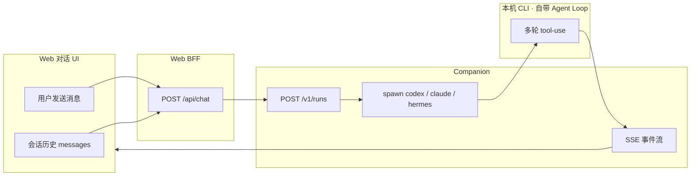
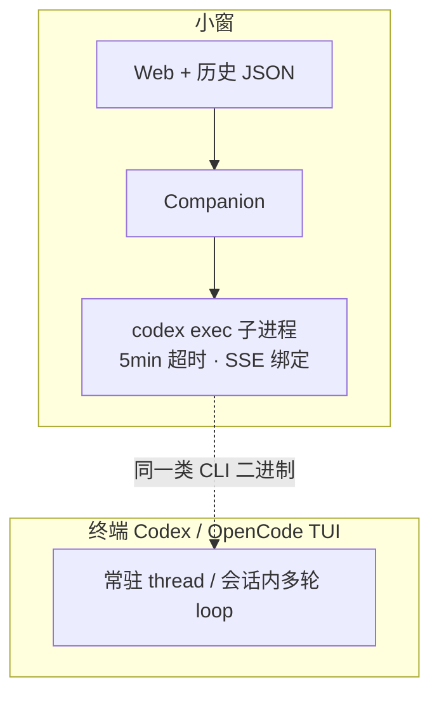

# Agent Loop 与小窗执行架构分析

| 属性 | 内容 |
|------|------|
| 文档版本 | v1.0 |
| 创建日期 | 2026-05-22 |
| 状态 | 分析稿（供产品 / 架构评审） |
| 关联文档 | [chat-core-architecture.md](./chat-core-architecture.md)、[chat-skill-orchestration-analysis.md](./chat-skill-orchestration-analysis.md)、[companion-api.md](./companion-api.md)、[chat-execution-roadmap.md](./chat-execution-roadmap.md) |
| 代码锚点 | `companion/src/runs/manager.ts`、`packages/runtime-core/src/run-agent.ts`、`packages/runtime-core/src/prompt.ts`、`packages/runtime-core/src/agents/build-args.ts` |

---

## 1. 文档目的

本文档汇总关于以下问题的讨论结论：

1. 小窗项目是否内置 **agent loop**？
2. 为何在 **小窗对话** 与 **终端 Codex / OpenCode** 中，即使用同一模型，体验差异很大，且小窗侧常出现「断开」感？
3. 差异主因是 **工具少** 还是 **Skill 少**？
4. OpenCode 能 **持续生成**，对小窗架构意味着什么？
5. 产品是否需要 **自研 agent loop**？

**读者：** 产品、架构、Companion / runtime-core / Web 研发。

---

## 2. 结论摘要（Executive Summary）

| 问题 | 结论 |
|------|------|
| 仓库里有没有名为 `agentloop` 的模块？ | **没有**。主工程无 `agentloop` / `AgentLoop` 实现；`参考项目/hermes-agent` 中有完整自研 loop（仅供对照）。 |
| 小窗有没有 agent loop **能力**？ | **有，但外包给本机 CLI**（Codex / Claude / Hermes），非小窗自研。 |
| 「经常断开」主因？ | **不是** CLI 内部 loop 坏了，而是 **「一条消息 = 一次 Run = 子进程 + SSE」** 的生命周期模型，叠加超时、链路中断、Codex resume 丢 system 等。 |
| 工具少？ | **大体不是**。选 `agentId=codex` 时仍是本机 `codex` 可执行文件及其自带工具；差异多在 **cwd、沙箱、工作区是否对齐真实项目**。 |
| Skill 少？ | **不是少，而是换了一套，且续聊时会变**。首轮注入平台 Prompt + 基座 Skill + 目录摘要；Codex `resume` 后 **system 置空**，平台 Skill 不再注入。 |
| 需要自研 agent loop 吗？ | **通常不需要**。需要 **会话级、不中断地用好 CLI 自带 loop**；仅 BYOK/纯云端/强合规等场景再考虑窄能力自建。 |

---

## 3. 术语：Agent Loop 是什么

**Agent loop**（智能体循环）指 Agent 在一次任务中反复执行：

```text
接收目标 → 模型推理 → 调用工具 → 观察结果 → 再推理 → … → 产出终稿
```

直到任务完成或用户取消。终端 **Codex TUI**、**OpenCode 客户端**、**Hermes-agent** 均在产品内部实现或托管该循环。

小窗的架构选择（见 [chat-core-architecture.md](./chat-core-architecture.md)）是：

- **不**自研完整 tool-use harness；
- **委托** 用户本机 Agent CLI 的 native loop；
- 平台负责 **轻 Push 编排**（Prompt、基座 Skill、Catalog 摘要、Agent Kit）与 **执行外壳**（Companion、SSE、工作区）。

这与 Open Design 文档中的 thesis 一致：「不重新发明 agent loop，而是对接已有 CLI」。

---

## 4. 小窗当前执行链路

### 4.1 端到端路径（模式 B · Companion）



### 4.2 每轮 Run 在 Companion 内做了什么

1. 解析 `workspaceProjectId` → `cwd`
2. `composeRunPrompts`：组装 system（平台 Prompt、横切规范、基座 `skill-qa-fast` / `skill-qa-deep`、Skill Catalog 摘要、Agent Kit 路径说明）
3. 格式化 user（单条或「对话历史 + 当前用户消息」）
4. `runAgent` → `spawn` 子进程，默认 **300s 超时**（`packages/runtime-core/src/run-agent.ts`）
5. 解析 stdout（如 `codex-json`）→ `message.delta` / `tool.progress`
6. 子进程结束 → `run.finished`，SSE 关闭

### 4.3 已登记的 Agent

当前产品目标已调整为 **MVP 以多 CLI / 多模型适配为核心能力**；下表仅描述**当前实现快照**中的已登记核心样例（`web/src/lib/agent-catalog.ts`、`companion/src/agents/catalog.ts` 等）：

| agentId | 显示名 |
|---------|--------|
| `codex` | Codex CLI |
| `claude` | Claude Code |
| `hermes` | Hermes CLI |

**说明：** PRD 已将多 CLI 适配提升为 MVP 核心能力；本文这一段若与当前实现数量不一致，应以运行时注册表和实现快照为准，而非再沿用“仅三款”口径。

---

## 5. 与终端 Codex / OpenCode 的差异

### 5.1 两种产品形态对比

| 维度 | 小窗对话（包了一层） | 终端 Codex / OpenCode 直连 |
|------|---------------------|---------------------------|
| 会话归属 | 每条消息触发一次 **Run** | **一个会话**长期存在 |
| 进程模型 | `codex exec` **子进程**，跑完退出 | TUI / 服务 **常驻** |
| 流传输 | 浏览器 SSE → Companion → stdout 解析 | 产品内原生流式 |
| 超时 | 外壳默认 **5 分钟**杀进程 | 通常无此层硬超时 |
| 工作区 | `projectId` / 沙箱 `cwd` | 用户当前 repo |
| 指令来源 | 小窗 `prompts/` + `skills/` 注入 | CLI 默认 + `AGENTS.md` 等 |
| OpenCode | 未作为 agent 接入 | 用户直接使用 OpenCode 产品 |

### 5.2 架构对比图



**要点：** 不是「GPT 在小窗里变笨」，而是 **同一只 CLI 被不同的会话生命周期与 Prompt 策略包装**。

### 5.3 OpenCode「一直能生成」说明什么

- 用户在本机使用的 **OpenCode 客户端 / TUI** = 完整产品，loop 生命周期 = **会话生命周期**。
- 参考项目 Open Design 集成 OpenCode 时，单次任务仍可能使用 `opencode run --format json …`（**一次 Run 一条命令**），与「OpenCode 桌面/TUI 常驻会话」不是同一层。
- 因此：**OpenCode 能持续生成，不能反推「小窗该加更多工具」**；更应反推 **「小窗应会话级托管 CLI loop，而不是消息级 exec」**。

---

## 6. 「断开」与体验差的成因分析

### 6.1 现象归类

用户感知的「断开」可能包括：

- 流式输出中途停止；
- 一轮结束后无法像终端那样「接着同一 thread 自然写下去」；
- 长任务未完成即报错；
- 第 2 轮起回答风格/能力突然变化。

### 6.2 技术层原因（按常见程度）

| 原因 | 说明 | 相关实现 |
|------|------|----------|
| **Run 生命周期 = SSE 生命周期** | 子进程结束即 `run.finished`，连接关闭 | `companion/src/runs/manager.ts` |
| **硬超时** | 默认 300s `SIGTERM` | `packages/runtime-core/src/run-agent.ts` |
| **CLI 异常退出 / 无输出** | `cli_exit`、`empty_output` | `run-agent.ts` + `manager.ts` |
| **Codex resume 剥离 system** | 第 2 轮起 `cliSystem = ""`，仅发本轮用户句 | `manager.ts` L249–252 |
| **历史非原生多轮 API** | 历史拼进 user prompt，96k 总字符预算、单条 16k 截断 | `conversation-prompt.ts` |
| **工作区不一致** | `cwd` 非用户编码目录，读不到 `AGENTS.md` / 真实代码树 | `resolveWorkspaceRoot` |
| **Mock / 模拟路径** | `COMPANION_USE_MOCK`、`runMode=spawn/simulate` | `companion/config`、`manager.ts` |
| **Hermes Gateway 捷径** | 与「选 Codex 却走 Gateway」的验收口径混淆 | `runHermesGateway` 分支 |

### 6.3 Codex 多轮续跑特例（重要）

Companion 对 Codex 的约定（见 [companion-api.md](./companion-api.md) §3）：

- **首轮**：`codex exec …`，system 经 stdin 注入小窗组装的 `systemPrompt`
- **后续轮**（同 `sessionId` + 工作区且已有 `thread_id`）：`codex exec resume <thread_id> <本轮用户消息>`
- **实现行为**：resume 时 **`systemPrompt` 置空**，仅传 **当前用户消息**

```typescript
// companion/src/runs/manager.ts（逻辑摘要）
const cliSystem = useCodexResume ? "" : systemPrompt;
const cliUser = useCodexResume
  ? userTurn(lastUserMsg?.content ?? userText)
  : userPrompt;
```

**影响：**

- 第 1 轮：平台规范、`skill-qa-fast/deep`、Catalog 摘要均在 system 中。
- 第 2 轮起（resume 成功）：**不再**注入上述内容，仅靠 Codex thread 记忆 → 易出现「首轮很听话、后续漂移」。

终端 Codex 无此「外壳剥 system」行为，故长对话一致性更好。

---

## 7. 工具与 Skill：是否「更少」？

### 7.1 工具（Tools）

| 判断 | 说明 |
|------|------|
| 小窗是否削减 Codex 工具集？ | **否**。`agentId=codex` 时仍 spawn 本机 `codex`，工具能力由 Codex 自带。 |
| 为何仍感觉「干不了活」？ | 常见为 **cwd 不对**、**沙箱策略**（`build-args.ts` 中 `workspace-write` 等）、**项目未绑定真实目录**。 |
| 平台是否预绑工具列表？ | **否**（原则 P5：工具不设门禁，见 chat-core-architecture）。 |

### 7.2 Skill

| 判断 | 说明 |
|------|------|
| Skill 数量更少？ | **否**。小窗 **额外注入** L0 平台 Prompt、L4 横切规范、L3 基座流程 Skill、Catalog **摘要**。 |
| 与终端差异 | 终端依赖 Codex/OpenCode **原生** 项目配置（如 `AGENTS.md`、`~/.opencode/skills/`）；小窗依赖 `skills/` + `prompts/`。 |
| Hermes 式 Pull | `skills_list` / `skill_view` **未**接入小窗 runtime（除非走 Hermes CLI 自带）。 |
| 续聊后 Skill | Codex **resume 后 system 为空** → 平台 Skill **不再 Push**，与「Skill 少」直觉相反，是 **续聊策略** 问题。 |

### 7.3 差异优先级（经验排序）

1. 会话是否常驻（子进程 vs TUI）
2. 工作区 `cwd` 是否同一目录
3. 续聊时 system / Skill 是否保留
4. 历史如何注入（拼 prompt / resume thread / 截断）
5. 工具集（通常非主因，除非 cwd/沙箱导致碰不到文件）
6. Skill 条目数量（非主因；编排与续聊策略更关键）

---

## 8. 小窗仓库内与 Agent Loop 相关的资产

| 位置 | 内容 |
|------|------|
| **主工程** | 无 `agentloop` 模块；`runAgent` 委托 CLI |
| `packages/runtime-core/src/run-agent.ts` | spawn + 流解析 + 5min 超时 |
| `companion/src/runs/manager.ts` | Run 编排、Codex resume、Gateway 回退 |
| `packages/runtime-core/src/prompt.ts` | system/user 组装 |
| `参考项目/hermes-agent/agent/conversation_loop.py` | 完整自研 loop（参考，非小窗运行时） |
| `参考项目/open-design/docs/agent-adapters.md` | 委托 CLI loop 的产品 thesis |

---

## 9. 是否需要自研 Agent Loop？

### 9.1 两个层次

| 层次 | 是否需要 |
|------|----------|
| **Agent loop 能力**（多轮推理 + 工具） | **需要**。否则无法完成研究、写稿、改工作区等多步任务。 |
| **自研 agent loop**（自管模型、工具、上下文） | **MVP 阶段通常不需要**。 |

### 9.2 建议继续「委托 CLI」的条件

- 目标产品是 **works 工作台**（查、写、记、汇），而非第二个 Hermes/OpenCode OS；
- 用户本机已有 Codex / Claude（未来可扩展 OpenCode）；
- 团队优先 **Skill 编排、工作区、对话 UI**，而非维护 tool runtime。

### 9.3 建议考虑「窄能力自建」的条件

- 本机 CLI 不可用仍要 Agent（纯云端 / BYOK API）；
- 强合规：每一 tool call 必须入库审计；
- 强制 Router：每轮必须命中指定 Skill，CLI 无法满足；
- 产品战略转向 **通用 Agent OS**（多通道、自进化 Skill、cron 等）——与当前 PRD 主路径冲突，需单独立项。

### 9.4 决策矩阵

| 方案 | 投入 | 收益 | 建议 |
|------|------|------|------|
| 维持消息级 `exec` + 现状 resume | 低 | 体验持续落后终端/OpenCode | 仅作 MVP 短期 |
| **会话级托管 CLI**（长驻进程 / 稳定 thread，resume 保留 system） | 中 | 直接缓解「断开」与长对话漂移 | **P0 推荐** |
| 接入 OpenCode 为第四款 agent | 中 | 满足用户习惯，仍委托 loop | P1 |
| 完整自研 loop + 工具集 | 高 | 与 Codex 生态重复，维护成本高 | **不建议** 除非战略变更 |

---

## 10. 推荐演进路线

### 10.1 P0 — 不自研 loop，修好「外壳」

1. **会话级 Run**：同一 `sessionId` 对应稳定 CLI 会话（或可靠 Codex thread），避免每条消息冷启动 `exec`。
2. **resume 不剥 system**：续聊时仍携带平台规范 + 基座 Skill（或改由 CLI 原生 session 持久化等价指令）。
3. **工作区对齐**：`workspaceProjectId` / `cwd` 与用户真实项目一致；文档化「无项目 / 沙箱」的能力边界。
4. **长任务策略**：可配置 `timeoutMs`；对深度研究模式放宽或分段 Run。
5. **可观测性**：在 `run.started` / Activity 中暴露 `useCodexResume`、`cwd`、`orchestrationMode`，便于排障。

### 10.2 P1 — 扩展与降级

1. 评估 **OpenCode** adapter（`opencode run --format json` 或常驻会话 API）。
2. **模型 API / BYOK** 路径：同样进入统一执行主干；能力差异通过 capability 与提示体现，不再单独演化成第二套产品架构。
3. 消除 **Gateway 与所选 agentId 不一致** 的误导（D-05 / D-11）。

### 10.3 不建议

- 在 Node 内重写完整 `while (tool_calls)` 循环并复制 Codex 工具面；
- 为追赶 OpenCode/Hermes 而把小窗做成通用 Agent 操作系统（除非 PRD 修订）。

---

## 11. 自检清单（排障用）

发一条消息后，可对照：

| 检查项 | 期望（真 CLI） | 异常信号 |
|--------|----------------|----------|
| `X-JLC-Execution-Mode` | `cli` | `mock` / `simulate` / `spawn` |
| Activity 文案 | `正在运行 {agentId}（全量 transcript + stdin）` | 仅「探测版本」后模拟回复 |
| `run.started.cwd` | 预期项目根路径 | 沙箱 ID 与用户项目不符 |
| 轮次 | 每轮 Instructions 均在 composed prompt 内 | 回答明显丢失「研究规范 / 深度流程」 |
| 结束事件 | `run.finished` | `run.error` + `timeout` / `cli_exit` / `empty_output` |
| 终端对照 | 同 cwd、同 prompt 在 `codex` TUI 复现 | 仅小窗失败 → 查外壳与 resume |

---

## 12. 附录：与参考项目的关系

| 参考项目 | Agent Loop 策略 | 对小窗的启示 |
|----------|-----------------|--------------|
| **open-design** | 委托 CLI；daemon 解析 JSON 事件流 | 可借鉴 adapter 与 `opencode run`；小窗 Companion 可对齐会话级 Run |
| **hermes-agent** | 自研 `conversation_loop` + 丰富工具链 | 借鉴 Pull 式 Skill 目录思想；**不必**克隆为运行时 |
| **OpenCode 产品** | 内置 loop + `~/.opencode/skills/` | 体验对标对象；接入时仍委托 loop |

---

## 13. 为何曾只改 Codex？已做的 Open Design 对齐（2026-05-22）

### 13.1 为何分析/缺陷清单里 Codex 出镜最多

历史上 **只有 Codex** 在小窗里接了 `exec resume` + 第二轮 **剥 system**，属于 **Codex 专属捷径**，Claude/Hermes 一直是「每轮冷启动 + 拼历史」。因此问题在 Codex 上最刺眼，不等于只需修 Codex。

### 13.2 对齐 Open Design 的统一策略（多 CLI 适配一致）

参考 `参考项目/open-design` 的 daemon + `buildDaemonTranscript`：

| 做法 | 小窗落地 |
|------|----------|
| 每轮冷启动 spawn，不用 CLI native resume | 移除 `codex exec resume` |
| Instructions + 全量 transcript 合并 stdin | `composeAgentRunPayload` + `# Instructions` / `# User request` |
| 单条 prior 消息 12k 截断 | `daemon-transcript.ts` `MAX_TRANSCRIPT_MESSAGE_CHARS = 12000` |
| prompt 不走 argv（防 E2BIG） | Codex/Claude 仅 stdin；Hermes 小 prompt 用 `-q`，大 prompt 改 stdin |
| Claude 不拆 `--system-prompt` + 分离 user | 全文进 stream-json user 行 |

**代码：** `packages/runtime-core/src/compose-daemon-prompt.ts`、`daemon-transcript.ts`、`agents/build-args.ts`、`companion/src/runs/manager.ts`。

### 13.3 已做（2026-05-22 续）

| 能力 | 说明 |
|------|------|
| **context warning** | `buildPriorRunContextWarning`：长 transcript / 长 assistant / 多轮时写入 transcript 头部 |
| **换工作区裁剪** | `scopeHistoryToWorkspace`：仅保留本轮 user，清 `cli-threads` |
| **换 Agent 裁剪** | `scopeHistoryToAgentChange` + Web 写入 `message.agentId` |
| **prompt 硬上限** | 先 **自动压缩** 再继续；仅压缩后仍超 1.2MB 才 `prompt_too_large` |
| **自动压缩** | `prepareMessagesForRun`：较早消息 → 摘要块 + 保留最近 8 条（可收紧到 4/2） |

**代码：** `transcript-scope.ts`、`transcript-compress.ts`、`sessions/run-context.ts`、`daemon-transcript.ts`。

**压缩触发：** 历史 ≥ **120k 字符** 或 ≥ **24 条消息**（ proactive）；合成 prompt 仍超硬上限则二次收紧。

**与 OD handoff 差异：** 当前为 **确定性摘要**（无需 BYOK）；完整 UI 历史不变，仅发给 CLI 的 transcript 被压缩。后续可接 LLM handoff 提升摘要质量。

### 13.4 PRD 需求登记（BYOK 后 · F-RT-009-B）

产品需求已写入 [PRD-小窗.md](../../PRD-小窗.md) **§6.10 F-RT-009**（文档版本 v3.4）：

| 编号 | 内容 |
|------|------|
| RT-009-B1 | LLM Handoff 摘要（BYOK） |
| RT-009-B2 | 自动/手动触发策略 |
| RT-009-B3 | 摘要持久化与复用 |
| RT-009-B4 | 摘要后开新对话（继承 `projectId`） |
| RT-009-B5～B8 | 双通道一致、审计、失败降级、SSE 重连（可选） |

### 13.5 仍未做（与 OD 差距）

- Claude **同 Run 内** `AskUserQuestion` → stdin 保持打开 + `tool-result` API
- **LLM Handoff 实现**（见 PRD F-RT-009-B，依赖 F-RT-002）
- SSE **reattach** 同 `runId`（进程在跑但浏览器断线）

---

## 14. 修订记录

| 版本 | 日期 | 说明 |
|------|------|------|
| v1.0 | 2026-05-22 | 初稿：汇总 Agent Loop 现状、断开成因、工具/Skill 辨析、OpenCode 对比、自研必要性及 P0/P1 建议 |
| v1.1 | 2026-05-22 | §13：OD 对齐实现说明；移除 Codex-only resume |
| v1.2 | 2026-05-22 | §13.3：context warning、工作区/Agent 裁剪、自动压缩后继续 |
| v1.3 | 2026-05-22 | §13.4：PRD v3.4 F-RT-009-B（BYOK 后 LLM Handoff）需求登记 |

---

*本文档由产品与技术讨论整理，若实现变更请同步更新 `companion-api.md` 与 `chat-execution-roadmap.md`。*
