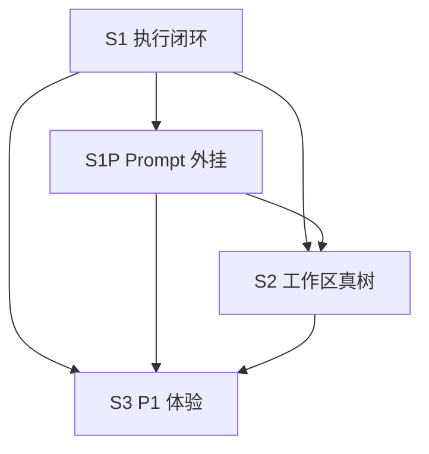

# 对话模块执行闭环 — 实施任务清单

| 属性 | 内容 |
|------|------|
| 文档版本 | v1.5（对齐 PRD **v3.5**） |
| 修订日期 | 2026-05-23 |
| 目标 | **MVP**：对话内容（`parts[]`、快速/深度两档、侧栏状态、Turn 吸顶）+ **Electron 桌面壳** + Companion 真 CLI；纪要/写作等不做 |
| 关联 | PRD §5.3.2.2、§5.3.7、§6.10 **F-RT-003/008/007c**；[chat-core-architecture.md](./chat-core-architecture.md)；[folder-import-and-desktop-shell.md](./folder-import-and-desktop-shell.md)；[chat-message-parts.md](./chat-message-parts.md)；[companion-api.md](./companion-api.md) |
| 原则 | **先执行闭环（S1）→ Prompt 外挂与 Agent Kit（S1P）→ 工作区真树（S2）→ P1 体验（S3）** |

---

## 总览（MVP 节奏，建议 8～10 周）

| 阶段 | 周期 | 交付物 | MVP |
|------|------|--------|-----|
| **S4** | Week 1（优先） | Electron 壳 + `pickAndImportFolder` + 加载 Web | ✅ P0 |
| **S1** | Week 1～2 | Companion + 真 CLI 流 + SSE/parts | ✅ P0 |
| **S1P** | Week 2 | Prompt 外挂（可简化） | 🔶 建议 |
| **S1O** | Week 2～3 | 对话混合编排（F-RT-008） | ✅ 代码 |
| **S2** | Week 2～3 | 工作区真树 + import-folder 联调 | ✅ P0 |
| **S3** | Week 3+ | 吸顶、状态点、文件深链、输出 UX | 🔶 P1 |



**与 PRD v3.0 MVP 的对应：**

| 路线图阶段 | PRD |
|------------|-----|
| S1P | F-RT-003（`prompts/platform`、`skills/`、Agent Kit、system/user 分离） |
| S1O | F-RT-008（`chat-orchestration.md`、`chat-catalog.json`、`hybrid-steer`） |
| S1 | F-RT-001、F-RT-005、§12.5.6 |
| S2 | F-RT-004、F-RT-007、**F-RT-007c**（文件夹导入） |
| S2.3 | §5.3.2.2 Web 手填路径；下线 `showDirectoryPicker` |
| S4 | §5.3.7 Electron 桌面壳（**MVP P0**） |
| S3 | F-QA-009 P1、F-QA-010 |

---

## 进度快照（2026-05-23 · MVP 收口）

> 与 PRD [§12.5.9](../../PRD-小窗.md#1259-实现快照2026-05-23) 一致。

| ID | 状态 | 说明 |
|----|------|------|
| S1.0 | ✅ | 默认 `CHAT_EXECUTION=companion`、`COMPANION_RUN_MODE=cli` |
| S1.1 | ✅ | `COMPANION_CLI_FALLBACK=error`；`pnpm smoke:companion` (codex) + `pnpm smoke:companion:claude` 双 CLI 真流 PASS；`mvp:verify` 至少一条通过即可（详见 [mvp-closure-checklist §1](./mvp-closure-checklist.md#1-自动化冒烟必须先过)） |
| S1.2 | 🔶 | 自动化 SSE 已验；Web UI 见 checklist D1–D4 |
| S1.3 | 🔶 | `ChatTurnList` 已落地；吸顶见 checklist D5 |
| S1.4 | ✅ | `runtimeStatusTitle` →「Companion 已连接 · {agentId} CLI 可用」 |
| S1.5 | ✅ | cancel Run 已接 |
| **S1P** | ✅ | `composeRunPrompts` + Agent Kit + `prompts/platform` |
| **S1O** | ✅ | `hybrid-steer` + `chat-catalog.json` + `run.started` 元数据 |
| **S1.9** | ✅ | F-RT-009-A：`prepareMessagesForRun` 在 Companion Run |
| **MVP** | 🔶 | `pnpm mvp:verify` + [mvp-closure-checklist](./mvp-closure-checklist.md) 人工项 |
| **S2.0** | ✅ 部分 | `WorkspaceAdapter`、BFF `/api/projects`、真树接入 `WorkspaceContext` |
| S2.1 | 🔶 部分 | `@` 提及读真树；路径仍进 user 文本（待结构化附件） |
| S2.2 | ✅ 代码 | `ResearchProjectsProvider` + `/api/projects`；侧栏/下拉真列表 |
| **S2.3** | ✅ 代码 | `import-folder` Companion + BFF；`ProjectWorkPicker` 手填路径 |
| S4.0～S4.2 | ✅ 代码 | Electron + IPC + `embedded-web` 打包路径 |
| S3.2 | ✅ | F-QA-010 文件深链 |
| S3.3 | ✅ | Companion `GET/PUT /v1/sessions/.../messages` + Web BFF |
| S3.1 | ✅ | 节奏化 parts（`tool_batch` 等） |
| **S3.5** | 🔶 | 思考耗时 ✅；`DeliverablesCard` UI ✅；探索摘要 ⬜ |
| **Nest** | 🔶 | `api/` auth + chat-sessions；Web 未全量切（PRD §8.6） |

---

## S1 — 执行闭环（Week 1，P0）

### S1.0 环境基线（半天）

**目标：** 本机固定走 Companion → CLI，不再依赖 Hermes Gateway。

| 步骤 | 操作 |
|------|------|
| 1 | 仓库根：`pnpm install` |
| 2 | 终端 A：`COMPANION_RUN_MODE=cli pnpm --filter @jlcresearch/companion dev` |
| 3 | 终端 B：复制并编辑 `web/.env.local`（见下表） |
| 4 | 终端 B：`pnpm --filter web dev` |
| 5 | 本机安装并登录 **codex**（优先）或 **claude**；`GET http://127.0.0.1:9477/v1/agents` 中 `status: available` |

**`web/.env.local`（推荐）：**

```env
CHAT_EXECUTION=companion
COMPANION_BASE_URL=http://127.0.0.1:9477
COMPANION_USE_MOCK=false
```

**`companion` 进程环境：**

```env
COMPANION_RUN_MODE=cli
COMPANION_CLI_FALLBACK=error
COMPANION_DEFAULT_AGENT=codex
```

**代码默认值（已落地）：**

| 文件 | 状态 |
|------|------|
| `web/src/lib/companion/config.ts` | ✅ `CHAT_EXECUTION` 默认 `companion` |
| `companion/src/config.ts` | ✅ `runMode` 默认 `cli`；`cliFallback` 默认 `error` |

**验收：**

- [x] `GET http://127.0.0.1:9477/v1/health` → `runMode: "cli"`
- [x] `GET /api/runtime/health` → `execution: "companion"`, `ok: true`, `mode: "live"`（`pnpm smoke:companion` 同日验证）
- [x] 顶栏状态点 tooltip 含「Companion 已连接 · codex CLI 可用」（`runtime-health.ts`，见 S1.4）

---

### S1.1 Companion CLI 路径硬化

**目标：** 真 CLI 失败时行为可观测，少静默回退 simulate。

| ID | 任务 | 文件 | 状态 |
|----|------|------|------|
| S1.1a | CLI 失败策略 | `companion/src/config.ts`, `manager.ts` | ✅ `COMPANION_CLI_FALLBACK` |
| S1.1b | stderr 尾部 | `run-agent.ts`, `manager.ts` | ✅ |
| S1.1c | Codex stdin / system 写入 | `run-agent.ts`, `build-args.ts` | ✅ `smoke:companion` 通过 |
| S1.1d | 超时与取消 | `manager.ts`, cancel API | ⬜ |
| S1.1e | tsx watch 重启期间 `/v1/agents` 半失败 | `companion/src/agents/detect.ts` `detectAllAgents`；考虑过渡期返回 503 / `agentsStatus:"reloading"` | ⬜ 已知小坑（2026-06-06 复现：dev 重载窗口内 `which` 全失败，Web 顶栏会瞬间变橙黄） |

**验收：**

- [x] Web 发短 prompt，Activity 有 `tool.progress`、正文流式、`run.finished`（`pnpm smoke:companion`）
- [x] `reduceStreamFinished` → `activityCollapse: collapsed`；`tool_batch` 流结束后默认折叠
- [ ] 停 Companion → 明确 `run.error`，非模拟回复（checklist D7）

---

### S1.2 SSE → `parts[]` 双通道统一

| ID | 任务 | 文件 | 状态 |
|----|------|------|------|
| S1.2a | companion 格式分支 | `chat-stream.ts` | 🔶 已有 |
| S1.2b | reducer | `useChatSend.ts`, `chat-parts-reducer.ts` | 🔶 已有 |
| S1.2c | Hermes tool progress | `api/chat/route.ts` | 🔶 |

**验收：** 见 [chat-message-parts.md §11](./chat-message-parts.md) P0 四条。

---

### S1.3 Turn 吸顶联调（F-QA-009）

代码已有（`ChatTurnList`、`useActiveTurn`）；本项为验收 + 修 bug。

**验收：** 当前视口 Turn 用户问吸顶；流式时不闪烁。

---

### S1.4 顶栏运行时状态（D-11）

**目标：** 状态点 = Companion + **当前 `agentId` CLI**，非 Hermes Gateway。

| 文件 | 状态 |
|------|------|
| `HermesStatusBadge.tsx` | 🔶 Mock 黄点已加；文案待完全对齐 |

---

### S1.5 取消 Run（可选）

| ID | 任务 | 文件 |
|----|------|------|
| S1.5a | Web 停止 | `ChatComposer.tsx`, `useChatSend.ts` |
| S1.5b | BFF cancel | `web/src/app/api/chat/cancel/route.ts`（新建） |

---

## S1P — Prompt 外挂与 Agent Kit（PRD v2.7 F-RT-003）

> **产品意图（与 Open Design 对齐处与差异）：**  
> - **对齐：** 每次 Run 前从磁盘组装 prompt；`skills/` + `prompts/` 为交付源；system 与 user 分离。  
> - **差异：** **不**在每个 `projectId` 下复制 Skill；用 `~/.jlcresearch/agent-kit/runs/<runId>/` + CLI `--add-dir`。

### S1P.0 交付目录（已立目录，待接入 runtime）

| 路径 | 职责 | 状态 |
|------|------|------|
| `prompts/platform/identity.md` | 平台身份 | ✅ 占位文件 |
| `prompts/platform/mode-hints.md` | 快速/深度两档说明 | ✅ |
| `prompts/platform/workflow.md` | 通用工作流 | ✅ |
| `skills/skill-platform-research-norms/` | 横切规范 | ✅ |
| `skills/skill-qa-fast/`、`skill-qa-deep/` | 对话流程 Skill | ✅ |

**禁止：** 在用户 `projectId` 根下创建 `.jlc-skills/` 或 per-project Skill 副本。

---

### S1P.1 `composeSystemPrompt` + `userTurn`（拆分）

**目标：** 替代单段 `composePrompt` 全文塞进 stdin。

| ID | 任务 | 文件 | 说明 |
|----|------|------|------|
| S1P.1a | 加载 `prompts/platform/*.md` | `packages/runtime-core/src/prompt-loader.ts`（新建）或扩展 `skill-loader.ts` | `JLC_PROMPTS_DIR`，默认仓库 `prompts/` |
| S1P.1b | `composeSystemPrompt` | `packages/runtime-core/src/prompt.ts` | 栈序：platform → L4 skill → L3 skill → Agent Kit 路径说明 |
| S1P.1c | `userTurn` | 同上 | 仅用户问题（+ 后续 `@` 附件） |
| S1P.1d | 废弃 `MODE_HINT` 硬编码 | `prompt.ts` | 迁入 `mode-hints.md` |
| S1P.1e | Companion 接入 | `companion/src/runs/manager.ts` | 传 system + user 给 `runAgent` |
| S1P.1f | CLI 双通道 | `run-agent.ts`, `build-args.ts` | Codex/Claude：system 参数或等价；Hermes 可合并降级 |

**验收：**

- [ ] 改 `prompts/platform/identity.md` 一句 → 重启 Companion → 回复人设变化（无需改 Web）
- [ ] `pnpm skills:verify` 仍通过；且 `prompts` 被加载
- [ ] 日志 / `run.started` 可见 `injectedSkills` + platform 文件列表（可脱敏）

---

### S1P.2 Agent Kit 刷新 + `--add-dir`

**目标：** 长 `references/` 不全文进 prompt；Agent 从本机 Kit 目录按需读。

| ID | 任务 | 文件 | 说明 |
|----|------|------|------|
| S1P.2a | Kit 根目录 | `packages/runtime-core/src/agent-kit.ts`（新建） | 默认 `~/.jlcresearch/agent-kit`；`JLC_AGENT_KIT_DIR` |
| S1P.2b | 每 Run 同步 | `packages/runtime-core/src/agent-kit.ts` `stageAgentKitForRun` | 从 `JLC_SKILLS_DIR/<processSkill>/references/` 复制到 `runs/<runId>/` |
| S1P.2c | system 路径说明 | `composeSystemPrompt` | 写入绝对路径，如 `…/agent-kit/runs/<runId>/references/checklist.md` |
| S1P.2d | `--add-dir` | `build-args.ts`, `run-agent.ts` | 只读；与 `-C workspaceProjectId` 并存 |
| S1P.2e | `run.started` 字段 | `manager.ts`, `companion-api.md`, `types.ts` | `agentKitPath`, `injectedSkills`, `skillsRoot`, `promptsRoot` |
| S1P.2f | 下线 reference 全文内联 | `skill-loader.ts` `formatSkillForPrompt` | 默认仅 `SKILL.md` 进 system；reference 走 Kit |

**验收：**

- [ ] 发深度档复杂问题；Agent 能读 Kit 内 `checklist.md`（日志或工具调用可见）
- [ ] 用户沙箱目录内**无** `.jlc-skills` / `agent-kit` 文件夹
- [ ] 并发两 Run 时 `runs/<runId>` 隔离（不互相覆盖）

---

### S1P.3 清理 Web 硬编码模式

| ID | 任务 | 文件 |
|----|------|------|
| S1P.3a | 移除 `CHAT_MODES` system 字符串 | `web/src/lib/chat.ts` 或等价 |
| S1P.3b | 文档 | `skills/README.md`, PRD §12.5.7 | 已同步 PRD；路线图本文 |

**验收：** 对话行为仅由 `mode`（`fast`/`deep`）→ 注册表 → `skills/` + `prompts/platform` 驱动（PRD D-14/D-18 关闭）。

---

## S1O — 对话混合编排（F-RT-008，PRD v3.3）

**目标：** 轻 Push（基座 + 编排指引 + Catalog 摘要）+ Agent Pull（扩展 Skill / 工具自选）；**不**实现 mandatory Skill Router。

**规格：** [chat-core-architecture.md](./chat-core-architecture.md)

### S1O.1 编排文案

| ID | 任务 | 文件 | 状态 |
|----|------|------|------|
| S1O.1a | 对话编排指引 | `prompts/platform/chat-orchestration.md` | ✅ 已立 |
| S1O.1b | 基座 Skill 补充 Catalog 说明 | `skills/skill-qa-fast/SKILL.md`、`skill-qa-deep/SKILL.md` | 🔶 待接入 compose 后验收 |

### S1O.2 Skill Catalog

| ID | 任务 | 文件 | 状态 |
|----|------|------|------|
| S1O.2a | Catalog 静态配置 | `skills/chat-catalog.json` | ✅ |
| S1O.2b | `loadChatCatalog` + 摘要段 | `packages/runtime-core/src/chat-catalog.ts` | ✅ |
| S1O.2c | `composeSystemPrompt` 拼 `<available_skills>` 摘要 | `prompt.ts` | ✅ |
| S1O.2d | `pnpm skills:verify` 校验 Catalog slug 存在 | `package.json` | ✅ |

### S1O.3 编排解析与可观测

| ID | 任务 | 文件 | 状态 |
|----|------|------|------|
| S1O.3a | `resolveChatOrchestration({ mode })` | `chat-orchestration.ts`, `companion/run.ts` | ✅ |
| S1O.3b | `run.started` 字段 | `manager.ts`, `companion-api.md` | ✅ |
| S1O.3c | Activity 展示基座 slug | `chat-run-started.ts`, `reduceRunStarted` | ✅ |

**验收（S1O DoD）：**

- [x] `moduleId=chat` 的 system 含 `chat-orchestration.md` + Catalog 摘要，且**仅一个**流程 Skill 正文（`pnpm skills:verify`）
- [x] `run.started.orchestrationMode === "hybrid-steer"`（Companion `manager.ts`）
- [x] 未实现每轮 `augmentSkills` 强制注入（D-19）

**非范围：** §7 mandatory Router（见 [chat-skill-orchestration-analysis.md](./chat-skill-orchestration-analysis.md)）→ V1.1。

---

### S1P DoD（Prompt 交付闭环）

- [ ] 客户仅替换 `JLC_SKILLS_DIR` / `JLC_PROMPTS_DIR` 指向定制包即可切换行为
- [ ] PRD F-RT-003 验收条目中与 Prompt 相关的项可勾选

---

## S2 — 工作区与 `projectId`（Week 2～3）

（与 v1.0 相同，略作交叉引用）

### S2.0 Phase 0 适配层

`WorkspaceAdapter`、`companion/client.ts`、BFF 代理、`WorkspaceContext` 接真树。

### S2.1 `@` 提及

`getMentionableFiles` 读真树；发送时 `@` 路径进 **userTurn**（非 system）。

### S2.2 侧栏与项目列表（F-RT-007）

| ID | 任务 | 文件 | 状态 |
|----|------|------|------|
| S2.2a | `ResearchProjectsProvider` + `/api/projects` | `contexts/ResearchProjectsContext.tsx` | ✅ |
| S2.2b | 侧栏分组标题接真项目名 | `ChatHistorySidebar.tsx` | ✅ |
| S2.2c | `getResearchProject` 读 Companion 缓存 | `research-projects-cache.ts` | ✅ |

---

### S2.3 文件夹导入（F-RT-007c，PRD v3.0）

> 设计全文：[folder-import-and-desktop-shell.md](./folder-import-and-desktop-shell.md)

| ID | 任务 | 文件 | 状态 |
|----|------|------|------|
| S2.3a | `POST /v1/projects/import-folder` | `companion/src/projects/store.ts`, `routes/projects.ts` | ✅ |
| S2.3b | BFF 转发 | `web/src/app/api/projects/import-folder/route.ts` | ✅ |
| S2.3c | Web 路径表单 | `ProjectWorkPicker.tsx` | ✅ |
| S2.3d | 发对话前 ensure 仅演示 ID | `research-projects-server.ts` | 🔶 已有 ensure |

**验收：**

- [ ] 手填 `~/Projects/foo` 导入后真树与磁盘一致
- [ ] Agent 写入文件出现在 `foo` 目录
- [ ] 无 `showDirectoryPicker` 误导流程
- [ ] 错误路径提示清晰（不存在 / 不在主目录下）

---

## S3 — P1 体验与深链（Week 3+）

### S3.1 节奏化 `parts` ✅

| ID | 任务 | 文件 | 状态 |
|----|------|------|------|
| S3.1a | 流式 `tool_batch`（`compactToolParts` 增量） | `chat-parts-reducer.ts`, `chat-parts-normalize.ts` | ✅ |
| S3.1b | `todo` / `file_read` / `file_edit` / `command` | `PartRenderer.tsx`, reducer | ✅ |
| S3.1c | Companion simulate + CLI fallback 发活动事件 | `simulated-activity.ts`, `manager.ts` | ✅ |
| S3.1d | 共用 mock 事件 + `part.append` | `@jlc/runtime-core`, `mock-activity-sse.ts` | ✅ |
| S3.1e | Codex `command_execution` + 阶段事件 | `codex-json.ts` | ✅ |
| S3.1g | Claude `tool_use` / `WebSearch` / 推理 | `claude-jsonl.ts`, `map-tool-progress.ts` | ✅ |
| S3.1h | 映射文档 + PRD F-RT-005 | `agent-cli-activity-mapping.md` | ✅ |
| S3.1f | `part.patch` 消费 | `chat-stream.ts`, `reducePartPatch` | ✅ |

**验收：** 深度/研究模式流式出现阶段标签、`tool_batch`、todo、文件读写行、命令行；simulate 与 Web mock 行为一致。

### S3.2 F-QA-010 文件深链

| ID | 任务 | 文件 | 状态 |
|----|------|------|------|
| S3.2a | `resolveFileInTree` + `openFileAt` | `file-path-resolve.ts`, `WorkspaceContext.tsx` | ✅ |
| S3.2b | 过程行 `file_read` / `file_edit` | `FileDiffRow.tsx` | ✅ |
| S3.2c | Summary 内联路径 | `InlinePathText.tsx` | ✅ |
| S3.2d | `artifact` 块 | `ArtifactRow.tsx`, `PartRenderer.tsx` | ✅ |
| S3.2e | 行号高亮 | `FileSourceView.tsx` | ✅ |

### S3.3～S3.4

`part.append`（可选）、Session API 持久化。

### S3.5 Agent 输出体验增强（竞品对齐）

> 详细需求：[chat-agent-output-ux.md](./chat-agent-output-ux.md)

| ID | 任务 | 说明 | 状态 |
|----|------|------|------|
| S3.5a | **思考耗时** | 步间 `思考 Ns`（`ThinkingGapRow` / 渲染层计算）；与 `turn_meta` 互补 | ✅ |
| S3.5b | **探索摘要** | `tool_batch` 中文标题（探索/读取/搜索/检索）；Read 行号；完成后默认折叠 | ⬜ |
| S3.5c | **成品列表卡** | 契约 `deliverables` + `DeliverablesCard`；主交付 + 多行打开 | ✅ |

**验收：**

- [ ] 深度模式时间线：探索摘要为「已探索/读取/搜索」而非裸工具名；batch 完成后默认收起。
- [ ] 步间间隔 ≥3s 显示「思考 Ns」；快速模式可隐藏或提高阈值。
- [ ] 研究 mock 在正文后出现成品卡，主交付 + ≥2 附件，点击 `openFileAt` 打开。

**建议顺序：** S3.5b → S3.5a → S3.5c。

---

## S4 — 桌面壳 Electron（MVP P0，优先于纯 Web 手填路径）

> 摘要：[desktop-shell.md](./desktop-shell.md) · PRD v3.0 §5.3.7

| ID | 任务 | 说明 | 状态 |
|----|------|------|------|
| S4.0 | `apps/desktop` 脚手架 | dev 加载 `localhost:3000`；`pnpm desktop:dev` | ✅ |
| S4.1 | `pickAndImportFolder` IPC | 主进程 `showOpenDialog` → Companion `import-folder` | ✅（2026-06-06 端到端 PASS） |
| S4.2 | preload `electronAPI` | `ProjectWorkPicker` 优先桌面通道 | ✅ |
| S4.3 | 内测安装包 | `electron-builder` + `pnpm desktop:pack` | ✅ 配置；本机 `pack` 冒烟 ⬜ |
| S4.4 | HMAC + `/v1/desktop/register` | 防伪造 `baseDir` | ⬜ **V1.1 P0** |
| S4.5 | 托盘 / Companion 安装检测 | 首次启动引导 | ⬜ **V1.1 P0** |

**MVP 验收（2026-06-06 收口）：**

- [x] 桌面应用启动进入对话；与浏览器同一 Web 产物
- [x] 选目录后 Web 仅见 `projectId` + `pathSummary`
- [x] 选目录 → 新建会话 → Companion 真树 + Agent 写入课题目录

> **V1.1 桌面壳完整路线图：[desktop-v1.1-roadmap.md](./desktop-v1.1-roadmap.md)（2026-06-06 立）**  
> 6 项增量：Companion 守护 / 托盘 / HMAC / 捆绑 / 自动更新 / 系统通知，约 8~10d。

---

## 明确不做（本阶段）

| 项 | 原因 |
|----|------|
| 每个 `projectId` 下复制 Skill（`.jlc-skills`） | PRD v2.8 已决；用 Agent Kit |
| 把平台 Prompt 写死在 Web/Companion TS | 交付改 `prompts/platform/` |
| Choice / 多信源 / 纪要写作 PPT 翻译主流程 | PRD v3.0 MVP 不验收 |
| Web `showDirectoryPicker` 作主路径 | PRD D-15；改手填路径 |
| Tauri 主路径 | PRD §5.3.7；Electron 优先 |
| PTY / 配对 | V1.1（与 S4 可并行） |

---

## 联调命令速查

```bash
# Companion 健康 + 短 Run SSE（S1.0/S1.2）
pnpm smoke:companion

# Companion
curl -s http://127.0.0.1:9477/v1/health | jq '.runMode'
curl -s http://127.0.0.1:9477/v1/agents | jq

# Skill 加载冒烟
pnpm skills:verify

# Agent Kit（实现后）
ls ~/.jlcresearch/agent-kit/runs/

# Web BFF
curl -s http://localhost:3000/api/runtime/health | jq
```

---

## 任务看板

| 状态 | ID | 标题 | 预估 |
|------|-----|------|------|
| ✅ | S1.0 | 环境基线 Companion+CLI | 0.5d |
| ✅ | S1.1 | CLI 路径硬化（部分） | 1d |
| ⬜ | S1.2 | SSE/reducer 验收 | 0.5d |
| ⬜ | S1.3 | Turn 吸顶联调 | 0.5d |
| 🔶 | S1.4 | 顶栏 Runtime 状态 | 0.5d |
| 🔶 | S1.5 | 取消 Run | 1d |
| ✅ | **S1P.0** | 交付目录 prompts+skills | 0.5d |
| ✅ | **S1P.1** | composeSystemPrompt + userTurn | 1.5d |
| ✅ | **S1P.2** | Agent Kit + --add-dir | 1.5d |
| ✅ | **S1P.3** | Hermes modes 标注；Companion 不走 Web system | 0.5d |
| 🔶 | **S1O** | 对话混合编排 F-RT-008 | 1～2d |
| 🔶 | S2.0 | WorkspaceAdapter + 真树 | 2d |
| 🔶 | S2.1 | @ 提及（真树） | 0.5d |
| ✅ | S2.2 | 侧栏分组 + Companion 项目列表 | 0.5d |
| ✅ | **S2.3** | 文件夹导入 import-folder + Web 表单 | 1.5d |
| ✅ | S3.1 | P1 节奏化 parts | 2d |
| ✅ | S3.2 | F-QA-010 深链 | 1.5d |
| ✅ | S3.5a | 思考耗时 | 0.5d |
| ⬜ | S3.5b | 探索摘要 | 1d |
| ✅ | S3.5c | 成品列表卡 | 1.5d |
| ⬜ | S3.3 | part.append（可选） | 1d |
| ⬜ | S3.4 | Session API | 3d+ |
| ✅ | **S4.0～S4.1** | Electron 最小壳 + pickAndImport | 2d |
| ⬜ | S4.2～S4.4 | HMAC / 托盘（V1.1） | 2d |

**推荐实施顺序（MVP v3.0）：** **S4.0～S4.2**（桌面壳联调）∥ **S1.0～S1.2**（真流）→ S2.0/S2.3 → S1P（可选）→ S3 P1。

**MVP 完成定义：** 桌面壳选目录 → 新建对话 → Codex 真流 → `parts[]` 可见；侧栏状态 + Turn 吸顶可演示；无纪要/写作验收项。

---

## 参考文件索引

| 领域 | 路径 |
|------|------|
| PRD v3.0 MVP | `PRD-小窗.md` §2.4、§10.2、§5.3.7 |
| 文件夹导入 / 桌面壳 | `web/docs/folder-import-and-desktop-shell.md`、`desktop-shell.md` |
| 平台 Prompt | `prompts/platform/`、`prompts/README.md` |
| 流程 Skill | `skills/`、`skills/README.md` |
| Prompt 组装（当前） | `packages/runtime-core/src/prompt.ts`, `skill-loader.ts` |
| parts 契约 | `packages/contracts/src/chat.ts` |
| Agent 输出 UX（思考/探索/成品） | `web/docs/chat-agent-output-ux.md` |
| Web 发送 | `web/src/components/chat/useChatSend.ts` |
| Companion | `companion/src/runs/manager.ts` |
| CLI spawn | `packages/runtime-core/src/run-agent.ts`, `agents/build-args.ts` |
| 模块注册表 | `web/src/lib/module-registry.ts` |

---

| 版本 | 日期 | 说明 |
|------|------|------|
| v1.3 | 2026-05-21 | 对齐 PRD v3.0：MVP = 对话 + 桌面壳；S4 提升为 P0；全模块业务移出 MVP |
