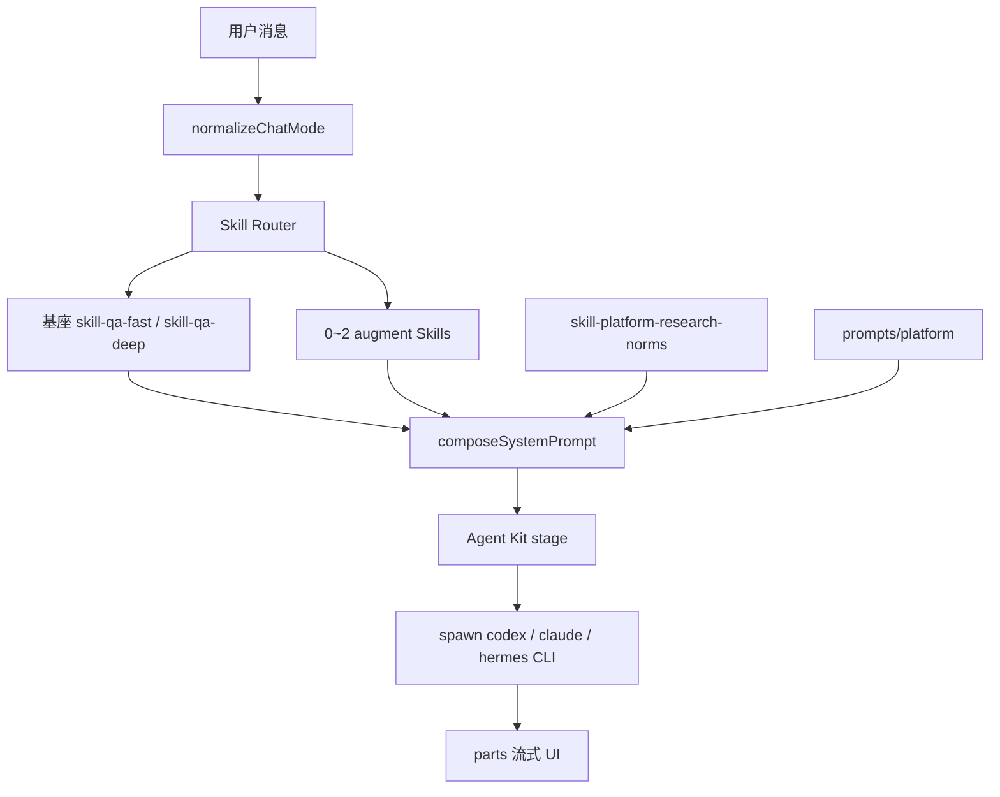

# 对话 Skill 编排与行业方案分析

| 属性 | 内容 |
|------|------|
| 文档版本 | v1.1 |
| 创建日期 | 2026-05-21 |
| 状态 | 分析稿（§2.3、§7 已决方向见 [chat-core-architecture.md](./chat-core-architecture.md)） |
| 关联文档 | [PRD-小窗.md](../../PRD-小窗.md)（v3.3）、[chat-core-architecture.md](./chat-core-architecture.md)、[skills/README.md](../../skills/README.md)、[chat-execution-roadmap.md](./chat-execution-roadmap.md)、[companion-api.md](./companion-api.md) |
| 参考项目 | [参考项目/hermes-agent](../参考项目/hermes-agent)、Open Design |

---

## 1. 文档目的

本文档汇总小窗「对话模块如何按意图使用 Skill 库」相关讨论中的**专业术语**、**当前实现**、**行业常见做法**、**Hermes 逻辑**与**推荐演进路线**，便于产品、研发、测试在同一套语言下评审后续能力（如 F-RT-008 对话 Skill 路由）。

**读者：** 产品、架构、前端、Companion / runtime-core 研发。

---

## 2. 背景与目标

### 2.1 业务目标

- **第一个窗口（对话）能力极强**：对标 Cursor / Codex——一个会话内完成查资料、推理、写稿、改工作区文件、甚至触发 PPT/写作类工作流，尽量减少「先选模块再干活」的摩擦。
- **Skill 库可扩展**：`skills/` 下除 `skill-qa-fast` / `skill-qa-deep` 外，还有 PPT、写作等流程 Skill；对话应能**按意图选用**，而非仅依赖用户手动切换大量页内模式。

### 2.2 已决变更（PRD v3.2）

- 页内问答模式由 **三档**（快速 / 深度思考 / 深度研究）合并为 **两档**（**快速 / 深度**）。
- 「深度思考」与「深度研究」**不再在 UI 区分**；复杂与否由 **`skill-qa-deep` + Agent** 在单次 Run 内决策。
- 协议：`ChatModeId = "fast" | "deep"`；历史或 API 中的 `mode=research` **映射为** `deep`。

### 2.3 已决方向（PRD v3.3 · F-RT-008）

**结论：采用「混合编排 · 方向引导」（`hybrid-steer`），而非 mandatory Skill Router。**

| 议题 | 已决 |
|------|------|
| 是否每轮 Router 强制 augment？ | **否**。仅 Push 基座 + Catalog 摘要；扩展 Skill 由 Agent **按需 Pull**。 |
| 与 Hermes 渐进披露 | **借鉴** Catalog + 按需读盘；**保留** 小窗 Push 基座、Agent Kit、横切规范；**不**复制 Hermes「匹配则必须 skill_view」的强制语气。 |
| 权威架构文档 | [chat-core-architecture.md](./chat-core-architecture.md) |

§7 原「mandatory Router + augment Push」草案 **降级为 V1.1 可选软提示**，不作为 MVP/S1O 默认。

---

## 3. 专业术语表（Glossary）

### 3.1 产品与架构

| 术语 | 英文/缩写 | 含义（小窗语境） |
|------|-----------|------------------|
| **小窗** | — | 面向 works（查、写、记、汇、译、讲）的智能工作台；对标 Cursor/Codex 面向 coding。 |
| **产品模块** | `moduleId` | 一级菜单能力域（`chat`、`writing`、`ppt` 等）；含路由、页内 IA、领域服务；**不等于**一个 Skill。 |
| **页内问答模式** | `binding.mode` | 对话输入区用户可选档位：**快速** / **深度**（v3.2）；映射流程 Skill，深度档内再由 Agent 细分行为。 |
| **绑定键** | `bindingKey` | 解析流程 Skill 的键：对话 `{ mode }`；写作 `{ templateId }`；纪要 `{ task }` 等。 |
| **模块注册表** | `module-registry` | `web/src/lib/module-registry.ts`：维护 `moduleId` → 领域服务、流程 Skill、模板资产等映射。 |
| **工作区** | `projectId` / `cwd` | 某研究项目根目录；Agent CLI 的 `cwd`；非「每条消息一个子目录」。 |
| **沙箱项目** | `sandbox` | UI「不使用项目」时，执行层仍绑定的默认 `projectId`。 |
| **对话会话** | `sessionId` | 一条聊天线程；创建时固定绑定 `projectId`，切换本地项目须新建会话。 |

### 3.2 Agent 运行时

| 术语 | 含义 |
|------|------|
| **模式 B（主路径）** | 本机 Companion + 本机 CLI + 本地/沙箱 `projectId`。 |
| **模式 A** | 云端工作区降级（V1.1+ 完整验收）。 |
| **Companion** | 本机守护进程；探测 CLI、`POST /v1/runs`、SSE 推流到 Web。 |
| **Agent CLI** | MVP 默认三款：`codex`、`claude`、`hermes`；由 Companion **spawn 本机可执行文件**，用户三选一。 |
| **Agent Kit** | `~/.jlcresearch/agent-kit/runs/<runId>/`；每 Run 从当前 `processSkill` 同步 `references/`；CLI `--add-dir` 只读访问；**不**复制到用户 `projectId` 内。 |
| **BYOK** | Bring Your Own Key；CLI 不可用时的 API 降级通道。 |

### 3.3 Prompt 与 Skill 分层（PRD §6.10.1a）

| 层级 | 名称 | 交付路径 | 作用 |
|------|------|----------|------|
| **L0** | 平台 Prompt | `prompts/platform/*.md` | 平台身份、模式说明、通用工作流；进 **system**。 |
| **L1** | 产品模块 | Web 路由 + 注册表 | 菜单、权限、领域服务编排。 |
| **L2** | 领域服务 | API / Companion | 数据源、ASR、幻灯片引擎等；**不写进 Skill**。 |
| **L3** | 流程 Skill | `skills/<slug>/SKILL.md` | 模块内 Agent 工作流；绑 `mode` / `templateId` / `task`。 |
| **L4** | 横切规范 Skill | `skill-platform-research-norms` | 每次 Agent 任务**固定叠加**（信源、免责等）。 |

| 术语 | 含义 |
|------|------|
| **流程 Skill** | `SKILL.md` + 可选 `references/`；如 `skill-qa-fast`、`skill-ppt-deck`。 |
| **工具类 Skill** | 不单独绑模板，由主流程 Skill 引用（如 `skill-ppt-html-studio`）。 |
| **模板资产包** | `tpl-*`、`assets/template.*`；版式/母版；由流程 Skill 引用，非独立 Agent 入口。 |
| **System Prompt** | `composeSystemPrompt` 组装栈：L0 + L4 + L3 + Agent Kit 路径说明。 |
| **User Turn** | `userTurn`：本轮用户输入（及 `@` 等）；与 system **分通道**传 CLI。 |
| **产出物** | Artifact：可打开/导出的 `report.md`、PPTX 等。 |

### 3.4 对话 UI 与消息

| 术语 | 含义 |
|------|------|
| **`parts[]`** | 单 Turn 内 assistant 消息按时间序的分块（Activity + Summary）。 |
| **Activity 区** | 工具、阶段、推理、`todo` 等过程块；Turn 结束后可折叠。 |
| **Summary 区** | 最终答案、`artifact`、`research_map` 等。 |
| **Turn 吸顶** | 滚动时当前视口对应用户问题 sticky（F-QA-009）。 |
| **侧栏状态点** | 执行中 / 未读 / 待确认 / 已读（F-QA-008）。 |

### 3.5 Skill 编排相关（本文核心）

| 术语 | 含义 |
|------|------|
| **Skill 注入（Push）** | Run **启动前**由平台选定 `processSkill`，将 `SKILL.md` 正文（或摘要）写入 system prompt。 |
| **Skill 自拉（Pull）** | System 仅含 **Skill 目录**（name + description）；Agent 通过 `skills_list` / `skill_view` 或读文件**按需**加载全文。 |
| **渐进披露** | Progressive Disclosure：L0 目录 → L1 全文 → L2 reference 文件；控制 token。 |
| **Skill Catalog** | 全库 Skill 元数据索引（slug、描述、触发词、scope、kind）；不全文进 prompt。 |
| **Skill Router** | 平台组件：根据用户句 + 上下文 → `{ baseProcessSkill, augmentSkills[] }`。 |
| **基座 Skill** | 对话每轮必有：v3.2 为 `skill-qa-fast` 或 `skill-qa-deep`。 |
| **Augment Skill** | 意图命中时叠加的流程 Skill（如 `skill-ppt-pitch-deck`）；0～N 个，需治理上限。 |
| **显式触发** | 用户 slash（如 `/plan`）或 UI 强制指定 Skill，覆盖 Router 猜测。 |
| **条件门控** | 按 OS、工具集、数据源是否可用过滤 Skill 是否出现在目录（非 LLM 路由）。 |
| **API 别名** | `mode=research` 规范为 `deep`（v3.2 兼容）。 |

### 3.6 Hermes 相关（易混淆，见 §5）

| 术语 | 在小窗中的含义 |
|------|----------------|
| **Hermes CLI** | 三款默认 Agent **之一**；Companion spawn 的本机 `hermes` 进程，与 Codex/Claude **平行**。 |
| **Hermes Gateway** | **仅原型**：`hermes gateway` 的 OpenAI 兼容 API（如 `:8642`）；Web BFF 临时统一转发；**不是**量产架构。 |
| **Hermes-agent** | 参考仓库 `参考项目/hermes-agent`：Nous 完整 Agent 产品（Skill 工具链、Gateway 多通道、记忆等）。 |
| **`hermes.tool.progress`** | Gateway SSE 中的工具进度事件；映射为对话区 Activity。 |

### 3.7 差异与决策编号

| 编号 | 主题 |
|------|------|
| **D-05** | 量产 Companion spawn CLI；原型曾统一走 Gateway。 |
| **D-11** | 顶栏状态应反映**当前所选 CLI**，而非仅 Gateway 健康。 |
| **D-14** | 模式说明迁入 `prompts/platform`，下线 Web `CHAT_MODES` 硬编码 system。 |
| **D-18** | v3.2：三档合并为快速/深度；`research`→`deep`；子策略在 `skill-qa-deep` 内。 |

---

## 4. 当前小窗实现（v3.2 对齐后）

### 4.1 运行时链路

```text
用户发送（mode: fast | deep）
  → Web BFF POST /api/chat 或 Companion POST /v1/runs
  → normalizeChatMode（research → deep）
  → resolveSkills({ moduleId: "chat", binding: { mode } })
       fast  → skill-qa-fast
       deep  → skill-qa-deep
  → platformNormSkill: skill-platform-research-norms（固定）
  → composeRunPrompts（system + userTurn）
  → stageAgentKitForRun（当前 processSkill 的 references/）
  → spawn agentId 对应 CLI（目标架构）
       或 agentId=hermes 且 Gateway 可用时 runHermesGateway（原型）
  → SSE → Web parts[] 展示
```

### 4.2 代码锚点

| 职责 | 路径 |
|------|------|
| 页内两档定义 | `web/src/lib/navigation.ts` → `CHAT_MODES` |
| mode 规范化 | `packages/runtime-core/src/chat-mode.ts` → `normalizeChatMode` |
| Skill 解析 | `web/src/lib/module-registry.ts` → `resolveSkills` |
| Prompt 组装 | `packages/runtime-core/src/prompt.ts` → `composeRunPrompts` |
| Run 构建 | `web/src/lib/companion/run.ts` → `buildCreateRunRequest` |
| Companion 执行 | `companion/src/runs/manager.ts` |

### 4.3 刻意**未**实现的能力

- 对话模块**不会**根据自然语言自动切换 `skill-ppt-*` / `skill-wr-*` 等（无 Skill Router）。
- **不会**把 `skills/` 全库 `SKILL.md` 全文注入 system（PRD 禁止，token 与治理原因）。
- Hermes-agent 的 `skills_list` / `skill_view` **未**接入小窗 runtime（除非走 Hermes CLI 自带能力）。

---

## 5. Hermes 逻辑三层辨析

避免将以下三者混为一谈：

```text
┌─────────────────────────────────────────────────────────────┐
│  A. 小窗产品语义：Hermes = 可选 Agent CLI（三选一之一）        │
├─────────────────────────────────────────────────────────────┤
│  B. 小窗原型捷径：Hermes Gateway = HTTP 联调通道（临时）       │
├─────────────────────────────────────────────────────────────┤
│  C. 参考实现：hermes-agent = 完整 Agent 操作系统             │
│     （Skill 工具链 / Gateway 多平台 / 记忆 / 自进化 Skill）   │
└─────────────────────────────────────────────────────────────┘
```

### 5.1 A — 小窗中的 Hermes CLI

- 用户顶栏选择 `agentId=hermes` 时，Companion 应 spawn **本机 `hermes` 可执行文件**（与选 Codex 跑 Codex 同级）。
- Prompt 仍由小窗 `composeRunPrompts` + `skills/skill-qa-*` 决定，**不自动**变成 Hermes 的 `~/.hermes/skills/` 库。

### 5.2 B — Hermes Gateway（原型）

- `packages/runtime-core/src/run-hermes-gateway.ts`：请求 `/v1/chat/completions`，解析 SSE 与 `hermes.tool.progress`。
- `companion/src/runs/manager.ts`：当 `agentId===hermes` 且 `hermesGatewayPreferred` 且 health 通过时优先走 Gateway。
- **问题**：Web 可能显示选 Codex，后台仍走 Gateway → 违反 D-05 / §12.5.6 验收口径。

### 5.3 C — hermes-agent 的 Skill 体系（行业参考）

| 机制 | 说明 |
|------|------|
| **Skill 根目录** | `~/.hermes/skills/`（安装时 seed bundled；Hub / Agent 可增删改）。 |
| **渐进披露** | `skills_list()` 仅元数据；`skill_view(name)` 加载全文；`skill_view(name, path)` 加载 reference。 |
| **System 索引** | `build_skills_system_prompt()` 生成 `<available_skills>` 列表 + **强制**「匹配则必须 skill_view」。 |
| **Slash 命令** | `/skill-name` 显式加载，等价于高置信意图。 |
| **条件门控** | `platforms`、`fallback_for_toolsets`、`requires_toolsets` 等过滤可见 Skill。 |
| **自进化** | 任务后可 `skill_manage` 创建/修补 Skill（小窗 MVP 未采纳，需治理）。 |

**结论：** 小窗若要做「对话自动选 Skill」，应**借鉴 C 的 Pull 思想**，但**保留小窗的 Push 注册表与 Agent Kit**；不必把整个产品变成 Hermes-agent 克隆。

---

## 6. 行业常见方案对比

### 6.1 四种编排模式

| 模式 | 代表 | 优点 | 缺点 |
|------|------|------|------|
| **纯 Push（注册表绑定）** | 小窗 v3.2、Open Design 模块绑定 | 可预期、可审计、交付改 Skill 即可 | 能力扩展靠加模式或改映射 |
| **纯 Pull（目录 + 工具）** | Hermes-agent、Cursor Skills、agentskills.io | 库可很大、token 可控、像「强对话」 | 模型可能漏加载；企业合规需额外约束 |
| **显式触发** | `/plan`、`@skill` | 意图 100% 明确 | 学习成本、不适合新手 |
| **混合：轻 Push + Agent Pull（方向引导）** | **小窗 v3.3 已决**、Cursor 类主窗口 | 基座可审计 + 库可扩展 + **少控模型** | 需 Catalog 与编排文案治理 |
| **混合：Router Push + Agent Pull** | 部分企业强合规场景 | 关键 augment 可控 | 易过度控制 Agent；**非小窗 MVP 默认** |

### 6.2 与 Cursor / Codex 的对齐点

| Cursor/Codex 用户感知 | 小窗对应能力 |
|------------------------|--------------|
| 一个 Chat + 仓库工作区 | 对话 + `projectId` + 工作区预览 |
| 工具/终端可见 | `parts[]` Activity、CLI 工具映射（进行中） |
| 规则/Skill 按需生效 | **目标（v3.3）**：Catalog 摘要 + Agent 自选 + Kit；**非** mandatory Router；现状：固定 `skill-qa-*` |
| 少选手动「子模式」 | v3.2 已合并为快速/深度 |

### 6.3 「是否流行」的结论

- **仅两档 UI + 单 Skill 内分支**：已实现（v3.2），偏简，适合 MVP。
- **Catalog + 选择性 Pull**：与 PRD 五层模型、Agent Kit **不冲突**；小窗 **不默认** 每轮 LLM Router 强制 augment（见 F-RT-008）。
- **完全 Hermes 式无 Router**：在**开源个人 Agent** 流行；在**企业研究工作台**通常仍会加 Push 层满足合规与模板。

---

## 7. 备选架构：mandatory Skill Router（草案 · 非默认）

> **v3.3 已决：** 产品默认采用 [chat-core-architecture.md](./chat-core-architecture.md) 的 **hybrid-steer**（轻 Push + Agent Pull）。  
> 本节保留 **强 Router** 方案供 V1.1 合规或显式 `@skill` 场景参考，**不作为 MVP/S1O 实现范围**。

### 7.1 设计原则

1. **禁止**每 Run 全库 `SKILL.md` 全文进 system。
2. **每 Run 必有基座**：`skill-qa-fast` 或 `skill-qa-deep`。
3. **Augment 上限**：建议 0～2 个流程 Skill，正文摘要 + Kit 路径。
4. **可观测**：`run.started` 输出 `baseProcessSkill`、`augmentSkills`、`routerReason`。
5. **用户可覆盖**：显式「用路演模板」「深度」等仍优先于 Router 低置信结果。

### 7.2 Router 输入 / 输出

**输入：**

- `userTurn`、 `mode`（fast | deep）
- 会话摘要、 `@` 附件类型
- 可选：关键词 / 嵌入 Top-K / 小模型分类

**输出示例：**

```json
{
  "baseProcessSkill": "skill-qa-deep",
  "augmentSkills": ["skill-ppt-pitch-deck"],
  "routerReason": "keyword:pitch+deck",
  "routerConfidence": 0.82
}
```

### 7.3 与 fast / deep 两档的关系

| 用户档 | 基座 | Router 策略 |
|--------|------|----------------|
| **快速** | `skill-qa-fast` | 仅允许 **tool** 类 augment；复杂 workflow 只给 catalog 提示 |
| **深度** | `skill-qa-deep` | 允许 workflow augment；基座内仍由 Agent 决定轻量推理 vs 完整研究 |

### 7.4 Skill Catalog 字段（建议）

| 字段 | 说明 |
|------|------|
| `slug` | 目录名，如 `skill-ppt-pitch-deck` |
| `scope` | `chat` / `ppt` / `writing` … 对话 Router 只扫 `chat` 或 `chatOrchestrable` |
| `kind` | `workflow` \| `tool` |
| `triggers` | 触发词/正则（规则 Router） |
| `requires` | 依赖领域服务（如无 slide-engine 则降级） |
| `maxInject` | `body` \| `catalog-only` |

### 7.5 架构图



### 7.6 分阶段落地

| 阶段 | 交付 | 验收 |
|------|------|------|
| **P0** | Skill Catalog 元数据 + 规则 Router（关键词） | `run.started` 可见选用 slug；Mock 可演示 PPT 意图 |
| **P1** | `composeRunPrompts` 多 Skill 栈 + augment Kit 同步 | 改 `skill-ppt-*` 行为无需改 Web 组件 |
| **P2** | 嵌入 / 小模型 Router + 用户覆盖 UI | 置信度 &lt; 阈值仅 catalog |
| **P3** | 与 Hermes CLI 原生 `skill_view` 双通道（若 CLI 支持） | Agent 可自救 Router 漏选 |

---

## 8. 概念关系一览

```text
页内模式 (fast/deep)
    └── 绑定键 binding.mode
            └── 模块注册表 resolveSkills
                    └── processSkill（基座，Push）
                            └── skill-qa-fast | skill-qa-deep
                                    └── 深度档：Agent 内部分支（轻量推理 | 完整研究）

【已决 v3.3】hybrid-steer
    └── Push：基座 + L0/L4 + chat-orchestration + Catalog 摘要
    └── Pull：Agent 自选 Catalog Skill / 工具 / Kit references

【备选 V1.1】mandatory Skill Router
    └── augmentSkills Push（§7，非默认）

Hermes Gateway ≠ Skill Router
    └── 仅是 hermes 的一种 HTTP 执行通道（原型）

hermes-agent Skill 体系 ≠ 小窗 skills/ 目录
    └── 可参考渐进披露与索引；实现路径不同
```

---

## 9. 风险与治理

| 风险 | 缓解 |
|------|------|
| Router 选错 Skill | UI 展示本轮 Skill；允许用户一句话纠正；低置信只上 catalog |
| Token 膨胀 | augment 摘要 + Kit；禁止全库正文 |
| 跨模块能力越界 | `scope` + 领域服务门控；必要时仍跳转 `/ppt` 向导 |
| 与 PRD 冲突 | 保持「一级菜单 ≠ 一个 Skill」；对话是**编排**而非替代模块 |
| Gateway 误导 | 量产 Companion spawn；状态点按 agentId（D-11） |

---

## 10. 建议 PRD / 研发下一步

1. **PRD**：✅ **F-RT-008** 已写入 v3.3；权威实现规格见 [chat-core-architecture.md](./chat-core-architecture.md)。
2. **实现（S1O）**：`resolveChatOrchestration` + `chat-catalog.json` + `composeSystemPrompt` 拼 Catalog 段；**不**实现 mandatory Router。
3. **原型 UI**：Activity 可选展示基座 slug（`skill-qa-fast` / `skill-qa-deep`），不必列出 augment。
4. **Hermes**：量产 Hermes 仅作 CLI 之一；若 CLI 自带 `skill_view`，在 `chat-orchestration.md` 说明与平台 Catalog 共存（V1.1 验收）。
5. **V1.1 可选**：§7 强 Router、`@skill` 用户覆盖、软提示 Router。

---

## 11. 修订记录

| 版本 | 日期 | 说明 |
|------|------|------|
| v1.1 | 2026-05-21 | §2.3 已决 hybrid-steer；§7 标为非默认；指向 chat-core-architecture；§10 对齐 S1O |
| v1.0 | 2026-05-21 | 首版：术语表、v3.2 现状、行业对比、Hermes 三层、Router 草案、风险与建议 |

---

*文档结束*
