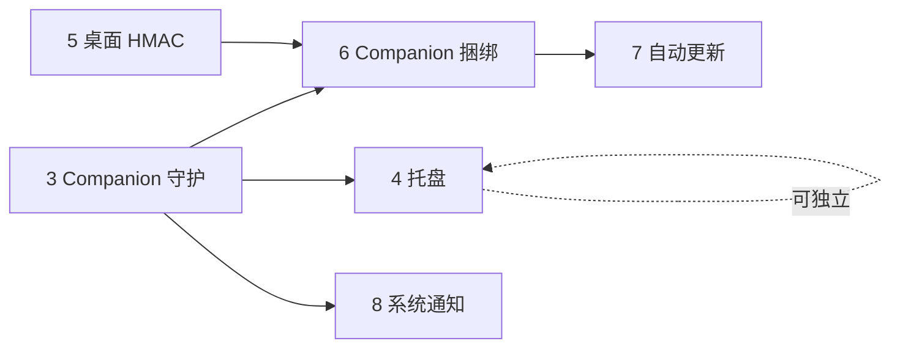

# 桌面壳 V1.1 路线图

| 属性 | 内容 |
|------|------|
| 文档版本 | v0.1 |
| 修订日期 | 2026-06-06 |
| 状态 | 草案（V1.1 主路径） |
| 上级文档 | [PRD-小窗.md](../../PRD-小窗.md) §1.2、§5.3.7、§10.1、§10.3 |
| 关联 | [desktop-shell.md](./desktop-shell.md)、[folder-import-and-desktop-shell.md](./folder-import-and-desktop-shell.md)、[chat-execution-roadmap.md](./chat-execution-roadmap.md) |

---

## 1. 背景与决策

**2026-06-06 产品决策**：基于"本机单用户 + Companion + agent CLI"产品形态，**V1.1 聚焦桌面端能力**，Web 浏览器版与 Nest 多用户后台整体推到 **V2.0**。

V1.1 桌面壳能力是 V1.1 主路径的支柱，包含 **6 项**增量（按优先级排序）：

| 优先级 | 能力 | 工作量 | 章节 |
|------|------|------|------|
| P0 | **Companion 自动启动 / 健康守护** | 1.5d | §3 |
| P0 | **托盘（Tray）** | 1d | §4 |
| P0 | **桌面 HMAC** | 1.5d | §5 |
| P1 | **Companion 捆绑安装** | 2~3d | §6 |
| P1 | **自动更新（electron-updater）** | 1.5d | §7 |
| P2 | **系统通知（Run 完成 / 错误）** | 0.5d | §8 |

**总计：约 8~10 个工作日。**

---

## 2. MVP 已交付（基线）

| ID | 能力 | 文件 | 状态 |
|----|------|------|------|
| D-MVP-1 | Electron 主进程加载 `web/` UI | `apps/desktop/src/main/index.ts` | ✅ |
| D-MVP-2 | `pickAndImportFolder` IPC | `apps/desktop/src/main/import-folder.ts` | ✅ |
| D-MVP-3 | `getCompanionHealth` IPC | `apps/desktop/src/main/companion-health.ts` | ✅ |
| D-MVP-4 | 自定义标题栏（File/Edit/View/Window/Help 五菜单） | `apps/desktop/src/main/shortcuts.ts` + DesktopTitleBar | ✅ |
| D-MVP-5 | electron-builder 打包（mac dmg / Win nsis） | `apps/desktop/electron-builder.yml` | ✅ |
| D-MVP-6 | 内嵌 Next standalone | `scripts/prepare-desktop-web.mjs` + `embedded-web.ts` | ✅ |
| D-MVP-7 | Win/Linux 标题栏图标无 squircle 内边距 | `cc39ccc` (2026-06-06) | ✅ |

---

## 3. P0：Companion 自动启动 / 健康守护（1.5d）

### 3.1 目标

桌面壳启动时**自动检测**本机 Companion，未跑则自动 spawn 子进程；运行期监听健康，崩溃自动重启（最多 3 次 / 5 分钟）。**前提**：MVP 阶段用户必须手动 `pnpm companion:dev`，是企业部署门槛。

### 3.2 设计

| 组件 | 路径 | 职责 |
|------|------|------|
| `CompanionSupervisor` | `apps/desktop/src/main/companion-supervisor.ts`（新建） | spawn / 健康轮询 / 重启策略 / 退出清理 |
| `findCompanionBinary()` | 同上 | 优先用打包态 sidecar；开发态从 PATH 找 / 或不启动（用户用 dev 命令） |
| 健康轮询 | 同上 | `GET /v1/health` 5s 间隔；连续 3 次失败 → 重启 |
| 失败兜底 | 同上 | 重启 ≥3 次 / 5min → 弹窗提示用户手动检查 |

### 3.3 IPC 增量

| 通道 | 方向 | 说明 |
|------|------|------|
| `companion:status` | 主 → 渲染（事件） | broadcast `{ status: 'starting' \| 'running' \| 'crashed' \| 'restarting', pid?, restartCount? }` |

### 3.4 验收

- [ ] 桌面壳冷启动后 5s 内 Companion 可用
- [ ] kill -9 Companion → 5~10s 内自动重启，渲染进程顶栏 Badge 经历 yellow → green
- [ ] kill 3 次后 Companion 进入"需人工"，弹窗提示
- [ ] 桌面壳关闭 → Companion 子进程随之 SIGTERM 退出（不留僵尸）

---

## 4. P0：托盘（Tray）（1d）

### 4.1 目标

最小化到托盘后桌面壳后台运行，**Companion 任务进度通过托盘标签可见**；右键菜单含"打开主窗口 / 检查 Companion 状态 / 退出"。

### 4.2 设计

| 组件 | 路径 | 职责 |
|------|------|------|
| `TrayManager` | `apps/desktop/src/main/tray.ts`（新建） | `nativeImage` 加载图标、`Menu.buildFromTemplate` 构建右键菜单、`tooltip` 同步 |
| 图标 | `apps/desktop/build/tray-icon.png` + `@2x.png`（mac） | 16×16 / 32×32 单色（mac 需 `template` 命名） |
| 关闭行为 | `index.ts` 改 `window.on('close')` | Win/Linux：最小化到托盘（默认）+ 设置项可改"真退出"；mac：dock 隐藏即可（沿用系统行为） |

### 4.3 右键菜单

```
小窗
─────────
打开主窗口
─────────
Companion: 已连接（绿）/ 重启中（黄）/ 未连接（红）
重启 Companion
─────────
关于小窗 v0.1
退出
```

### 4.4 验收

- [x] 关闭主窗口后托盘图标存在；点击恢复主窗口（Win/Linux：`win.on('close')` 拦截后 `win.hide()`；mac：沿用系统行为）
- [x] Companion 状态变化时 tooltip 实时更新（`CompanionSupervisor.subscribe` → `TrayManager.refresh`）
- [x] 右键"重启 Companion"→ 触发 `CompanionSupervisor.restart()`
- [x] 右键"退出"→ `setQuittingFlag(true)` + `app.quit()`，`before-quit` 内 `supervisor.stop()` 清理 Companion 子进程

---

## 5. P0：桌面 HMAC（1.5d）

> 完整设计：[folder-import-and-desktop-shell.md §4.3](./folder-import-and-desktop-shell.md#43-桌面-hmacv11)

### 5.1 目标

防止渲染进程或第三方进程**伪造 `baseDir`** 调用 Companion `import-folder`。桌面主进程持有 secret 签发 HMAC token，Companion 校验后才标 `fromTrustedPicker: true`。

### 5.2 设计

| 端 | 改动 | 路径 |
|----|------|------|
| 桌面主进程 | 启动时 `POST /v1/desktop/register` 注册 + 拿 secret；后续 `import-folder` 请求带 `X-JLC-Desktop-Import-Token: HMAC(secret, baseDir\|nonce\|exp)` | `apps/desktop/src/main/companion-register.ts`（新建）+ `import-folder.ts` 改造 |
| Companion | `POST /v1/desktop/register`（新增）下发 secret + 持久化（`~/.jlcresearch/companion/desktop-secrets.json`）；`import-folder` 校验 token | `companion/src/routes/desktop.ts`（新建）+ `routes/projects.ts` 校验 |
| Web 浏览器路径 | 不带 token；`fromTrustedPicker: false`；保留为降级（V1.1 不动） | `companion/src/projects/store.ts` |

### 5.3 验收

- [x] 桌面壳路径：`POST /v1/projects/import-folder` 带 token，Companion 标 `fromTrustedPicker: true`，可读 `~/Projects/...` 之外的目录（按企业策略放宽）—— `companion/src/routes/projects.ts` import-folder 校验 + `validateLocalBaseDir({ trusted })` 放宽 `must_be_under_home`，仍保留 `forbidden` / `in_data_dir` 两条硬规则
- [x] 浏览器路径：无 token，`fromTrustedPicker: false`，仅允许 `~/` 下子目录（`baseDir_must_be_under_home`）
- [x] 第三方进程伪造 `baseDir` POST 到 Companion 带乱填 / 过期 token → `401 desktop_import_token_invalid (missing|malformed)` / `403 desktop_import_token_invalid (unknown_client|bad_signature|expired)`
- [x] 桌面壳重启后 secret 持久化生效（`${userData}/desktop-credentials.json` + `${COMPANION_DATA_DIR}/desktop-secrets.json`），register 调用幂等返回已有 secret

---

## 6. P1：Companion 捆绑安装（2~3d）

### 6.1 目标

终端用户**不感知 Companion 单独存在**——下载小窗安装包即装好桌面壳 + Companion；卸载也一并清理。

### 6.2 设计（实施版 · 2026-06-08 决策偏离原 6.3）

| 平台 | 策略 |
|------|------|
| **Win NSIS** | `extraResources` 含 `companion/companion.cjs`（esbuild 打的 CJS bundle）；运行时由 supervisor `spawn(process.execPath, [companion.cjs], { ELECTRON_RUN_AS_NODE: "1" })` 启动 |
| **mac dmg** | 同上策略；签名 entitlements 见 `apps/desktop/build/entitlements.mac.plist`（已写好占位，待 Apple Developer 证书 + `hardenedRuntime: true`） |
| **Linux** | V1.1+ 暂不交付 |

> **决策偏离 §6.3**：原计划 pkg/nexe 打 Node 单二进制，最终改用 **esbuild bundle + Electron `ELECTRON_RUN_AS_NODE` 共享 runtime**。理由：(1) Electron binary 内嵌 Node，不必再带一份 Node ≈ 省 ~50MB DMG 体积；(2) bundle ~1.8MB，比 pkg 单二进制（≈ 50MB）小一个数量级；(3) D1.5 electron-updater 替换整个 .app/.exe 时 bundle 自动跟随更新；(4) 不需要 Node 预构建，跨平台构建零成本；(5) skills/prompts 仍以静态目录形态外挂，便于企业用户就地修改。详见 [desktop-d1.4-bundle-status.md](./desktop-d1.4-bundle-status.md)。

### 6.3 工程（实施版）

| 任务 | 实施 | 状态 |
|------|------|------|
| Companion bundle | `pnpm --filter @jlcresearch/companion bundle` → `companion/dist-bin/companion.cjs`（esbuild、CJS、target node20，1.8MB） | ✅ |
| Prepare 脚本 | `scripts/prepare-companion-bundle.mjs` 同步 bundle + skills + prompts 到 `apps/desktop/resources/` | ✅ |
| `electron-builder.yml` 改造 | `extraResources` 加 `companion/`、`skills/`、`prompts/` 三项 | ✅ |
| `CompanionSupervisor.findCompanionBundle()` | 返回 `{ execPath, bundlePath, skillsDir, promptsDir }`；`trySpawnSidecar` 用 `process.execPath` + `ELECTRON_RUN_AS_NODE=1` + 注入 `JLC_SKILLS_DIR/JLC_PROMPTS_DIR` | ✅ |
| mac entitlements | `apps/desktop/build/entitlements.mac.plist` 含 `network.server/client`、`allow-jit`、`inherit` 等；当前 `hardenedRuntime: false` 不生效，签名时直接打开即可 | ✅ 占位 |
| 代码签名 | Apple Developer 证书 + Win EV 证书；本批不接（需证书） | ⏸ 推后 |

### 6.4 验收

- [x] 改 supervisor / electron-builder.yml / package.json 后 4 套 tsc 干净
- [x] `pnpm --filter @jlcresearch/companion bundle` 跑通（bundle 1.8MB）
- [x] bundle 真起 fastify on `127.0.0.1:9477` 验证（COMPANION_PORT=19477 烟测通过）
- [x] `scripts/prepare-companion-bundle.mjs` 跑通，`apps/desktop/resources/{companion,skills,prompts}/` 三目录到位
- [ ] 实跑 `pnpm --filter @jlc/desktop pack:dir`：dmg / nsis 装后立即可用（手测，需本地 Electron prebuild）
- [ ] 卸载小窗 → Companion 进程退出 + bundle/skills/prompts 清理（用户数据 `~/.jlcresearch/` 保留）
- [ ] mac Gatekeeper / Win SmartScreen 打开（需签名后再验）

---

## 7. P1：自动更新（electron-updater）（1.5d）

### 7.1 目标

后台静默检查更新，下载完成后下次启动应用 / 用户主动触发"立即重启更新"。

### 7.2 设计

| 项 | 内容 |
|----|------|
| 更新源 | 企业内部 nginx / OSS 静态目录（`https://updates.jlcresearch.com/小窗/`）；或暂用 GitHub Releases（早期） |
| `electron-updater` 配置 | `autoDownload: true, autoInstallOnAppQuit: true`；启动后 30s 检查一次 + 每 4h 复查 |
| UI 提示 | 检查到更新 → 顶栏出小红点 + 全局设置「关于」页显示版本与"立即更新"按钮 |
| 增量更新 | nsis：差分包；mac：dmg 全量（`electron-updater` 默认） |

### 7.3 工程

| 任务 | 文件 |
|------|------|
| 引入 `electron-updater` | `apps/desktop/package.json` |
| `AutoUpdater` 主进程模块 | `apps/desktop/src/main/auto-updater.ts`（新建） |
| Build CI 上传到更新源 | `pnpm desktop:pack:publish`（新增）+ CI/CD 脚本 |
| 渲染层"立即更新" | `web/src/components/settings/sections/AboutSettingsSection.tsx` 加 IPC 调用 |

### 7.4 验收

- [ ] 安装包 v0.1 → 服务端发布 v0.2 → 桌面壳启动后 30s 检查到更新 → 后台下载 → 重启后已是 v0.2（**待服务端**：publish 占位 `https://updates.jlcresearch.com/小窗/` 还未接入；代码路径全通，等运维上 nginx/OSS 静态目录即生效）
- [x] 全局设置「关于」页显示当前版本 + "检查更新"按钮 + "下载进度"（`AboutSettingsSection` + `UpdaterPanel`，2026-06-08）
- [x] 网络错误时静默失败，不阻塞主功能（`auto-updater.ts` 走 'error' 状态透出 hint 不抛；详见 [desktop-d1.5-d1.6-status.md](./desktop-d1.5-d1.6-status.md)）

---

## 8. P2：系统通知（Run 完成 / 错误）（0.5d）

### 8.1 目标

长 Run（≥30s）完成或出错时弹系统通知，让用户最小化时也能察觉。

### 8.2 设计

| 触发 | 说明 |
|------|------|
| `run.finished`（runtime ≥30s） | "🎉 Run 已完成 · 共 N 个文件"；点击通知 → 聚焦主窗口跳到对应会话 |
| `run.error` | "⚠️ Run 失败 · {message 简化}"；点击通知 → 聚焦主窗口 |
| `tool.progress` 等 | 不通知（频率太高） |

### 8.3 工程

| 文件 | 改动 |
|------|------|
| `apps/desktop/src/preload/preload.cjs` | 暴露 `electronAPI.notify({ title, body, sessionId })` |
| `apps/desktop/src/main/notifications.ts`（新建） | `new Notification(...)` + `click → window.focus + send 'open-session' to renderer` |
| `web/src/components/chat/useChatRunController.ts` | run 时长跟踪；finished/error 时调 `electronAPI?.notify` |

### 8.4 验收

- [ ] Run 跑 1 分钟后切到其它窗口 → 完成时 macOS / Windows 系统通知出现
- [ ] 点击通知 → 桌面壳前置 + 跳到对应会话
- [ ] 短 Run（<30s）不通知；快速模式默认不通知

---

## 9. 依赖与并行性



**关键路径**：3 → 6 → 7（守护 → 捆绑 → 更新）

**可并行**：4（托盘）独立、5（HMAC）独立、8（通知）依赖 3

---

## 10. 验收清单（V1.1 桌面壳收口）

完整套件验收（按优先级排序，可逐项打勾发版本）：

- [ ] **D1.1（P0）** Companion 自动启动 / 健康守护：冷启动 5s 内可用；崩溃自动重启
- [x] **D1.2（P0）** 托盘：最小化到托盘 + 右键菜单 + tooltip 状态（2026-06-08；`apps/desktop/src/main/tray.ts`）
- [x] **D1.3（P0）** HMAC：`fromTrustedPicker` 区分桌面 vs 浏览器路径；第三方伪造 401/403（2026-06-08；`companion/src/desktop/secrets.ts` + `routes/desktop.ts` + `apps/desktop/src/main/companion-register.ts`）
- [x] **D1.4（P1）** Companion 捆绑：esbuild bundle + ELECTRON_RUN_AS_NODE 共享 runtime（2026-06-08；偏离原 §6.3 pkg/nexe 路线，详见 [desktop-d1.4-bundle-status.md](./desktop-d1.4-bundle-status.md)；DMG/NSIS 实跑与签名留作手测）
- [x] **D1.5（P1）** 自动更新：electron-updater + AboutSettingsSection 状态 / 检查 / 立即重启更新（2026-06-08；publish 占位 `https://updates.jlcresearch.com/小窗/` 待运维接入）
- [ ] **D1.6（P2）** 系统通知：长 Run 完成 / 错误弹 macOS/Windows 通知

---

## 11. 不在 V1.1 桌面壳范围

| 项 | 推到 |
|----|------|
| Linux 安装包 | V1.1+（Win/mac 优先） |
| 多窗口 / 多 instance | V2.0 |
| 模式 A 云端工作区切换 | V2.0 |
| 设置面板独立窗口 | V2.0 |
| 浏览器扩展 / Web Push | V2.0 |
| 跨设备会话同步 | V2.0（依赖 Nest） |
| 离线模式 | V1.1+ |

---

## 12. 修订记录

| 版本 | 日期 | 说明 |
|------|------|------|
| v0.1 | 2026-06-06 | 初稿；基于 V1.1 范围调整决策（Web/Nest 推 V2.0 + 桌面优先） |
