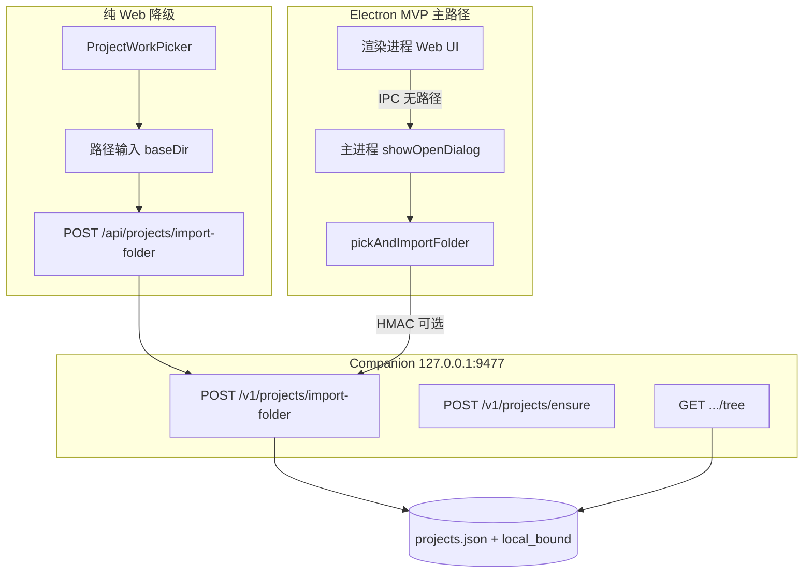

# 本地文件夹导入与桌面壳 — 设计方案

| 属性 | 内容 |
|------|------|
| 文档版本 | v1.1 |
| 修订日期 | 2026-05-21 |
| 对齐 PRD | **v3.0 MVP** §5.3.2.2、§5.3.7、F-RT-007b/c、§8.5 |
| 参考实现 | [Open Design architecture](../../参考项目/open-design/docs/architecture.md)、`apps/desktop`、`POST /api/import/folder` |
| 关联契约 | [companion-api.md](./companion-api.md)、[chat-execution-roadmap.md](./chat-execution-roadmap.md)、[技术方案.md](../../技术方案.md) §3.4 |

---

## 1. 问题与目标

研究员在**已有本地课题目录**上工作，需要：

1. 将目录绑定为 `local_bound` 的 `projectId`，Agent **直接在原目录读写**（不复制到沙箱）。
2. **纯 Web + Companion**：用户手填 `~/Projects/...`，Companion `realpath` 校验。
3. **桌面壳**：系统文件夹对话框选目录，渲染进程**不持有** `baseDir` 明文。
4. 与 Cursor/Codex 式「进入项目工作」一致：换文件夹 = **新建对话会话**（F-RT-007）。

**非目标：** 浏览器 `showDirectoryPicker` 作为主路径；per-project Skill 目录；把用户目录复制进 `dataDir/projects/`。

---

## 2. 架构总览



| 组件 | 职责 |
|------|------|
| **Web BFF** | 鉴权、转发 `import-folder`；**不**读用户磁盘 |
| **Companion** | `realpath`、边界校验、落库 `projectId`、列真树、spawn `cwd` |
| **Electron 主进程** | 系统选目录、可选 HMAC 签名、调 Companion |
| **Web 渲染 / 桌面渲染** | 仅展示 `projectId`、`name`、`pathSummary`（`~/` 缩写） |

---

## 3. 文件夹导入语义

### 3.1 绑定而非复制

| 项 | 约定 |
|----|------|
| `workspaceKind` | `local_bound` |
| `baseDir` | `realpath` 后的绝对路径，存 Companion `projects.json` |
| Agent `cwd` | `baseDir` 根 |
| Skill / Prompt | **不**写入 `baseDir`；走 Agent Kit（`~/.jlcresearch/agent-kit/runs/<runId>/`） |
| 平台默认工作区 | UI「不绑定课题文件夹」→ Companion `ensure-default-task-project` 建 `{文稿}/XIAOCHUANG/…`（PRD §5.3.2.1a、§12.5.3）；**非** `sandbox-default` |

### 3.2 路径校验（Companion）

| 规则 | 行为 |
|------|------|
| 目录存在且可读 | 通过 |
| `realpath` | 必须；拒绝符号链接逃逸（实现阶段细化） |
| 主目录边界 | 默认须在用户 `$HOME` 下（可 `~/` 展开） |
| 禁止 | `dataDir` 内路径、系统敏感路径（`/etc` 等） |
| 桌面 HMAC（V1.1+） | 带 `X-JLC-Desktop-Import-Token` 的请求可打标 `fromTrustedPicker: true` |

### 3.3 `import-folder` vs `ensure`

| API | 用途 | 谁可调用 |
|-----|------|----------|
| `POST /v1/projects/import-folder` | 用户主动导入；生成或复用 `projectId` | Web BFF（手填路径）、桌面主进程（受信路径） |
| `POST /v1/projects/ensure` | 固定 `projectId` 与 MOCK 列表对齐 | 演示、BFF 在发对话前预热；**不能**替代受信选目录 |

---

## 4. API 契约摘要

详见 [companion-api.md](./companion-api.md) §2。

### 4.1 Companion — `POST /v1/projects/import-folder`

**请求：**

```json
{
  "name": "蒙电十五五",
  "baseDir": "/Users/me/Projects/蒙电十五五"
}
```

**响应 200：**

```json
{
  "projectId": "proj-mengdian",
  "name": "蒙电十五五",
  "workspaceKind": "local_bound",
  "pathSummary": "~/Projects/蒙电十五五"
}
```

**错误：** `400` 路径非法；`404` 目录不存在；`403` 越界。

### 4.2 Web BFF — `POST /api/projects/import-folder`

- Body 同 Companion（仅 `name?`、`baseDir`）。
- 转发至 `COMPANION_BASE_URL/v1/projects/import-folder`。
- 未连接 Companion → `503` + 引导安装文案。

### 4.3 桌面 HMAC（V1.1+）

| 头 | 说明 |
|----|------|
| `X-JLC-Desktop-Import-Token` | `HMAC(secret, baseDir \| nonce \| exp)` |
| 注册 | 桌面壳启动时 `POST /v1/desktop/register`（待实现）下发 `secret` |

防止渲染进程伪造 `baseDir` 打开任意目录。

---

## 5. Web UI：`ProjectWorkPicker`

### 5.1 纯 Web（MVP）

| 步骤 | UI |
|------|-----|
| 1 | 用户点击「添加新项目」 |
| 2 | 弹层：**文件夹路径**输入框，占位 `~/Projects/课题名` |
| 3 | 可选显示名称 |
| 4 | 确认 → `POST /api/projects/import-folder` |
| 5 | 成功 → `addCustomResearchProject` + 若当前会话已发消息则 `router.push` 新 `/chat/[id]` |

**禁止：** `showDirectoryPicker` + 二次让用户猜路径（PRD D-15）。

### 5.2 桌面壳（V1.1）

```ts
// preload 暴露（示例）
interface ElectronAPI {
  pickAndImportFolder(opts?: { name?: string }): Promise<{
    projectId: string;
    name: string;
    pathSummary: string;
  }>;
}
```

| 步骤 | 行为 |
|------|------|
| 1 | `window.electronAPI?.pickAndImportFolder` 存在则走桌面通道 |
| 2 | 主进程 `dialog.showOpenDialog({ properties: ['openDirectory'] })` |
| 3 | 主进程调 Companion `import-folder`（带 HMAC） |
| 4 | 渲染进程只收 `{ projectId, name, pathSummary }` |

### 5.3 选择已有项目

- 列表来自 `GET /api/projects`（Companion + 演示 MOCK 合并策略见 `research-projects-server.ts`）。
- 发对话 / 拉树前对 `local_bound` 可调 `ensure` 预热（演示 ID）。

---

## 6. 桌面壳方案（已决：Electron + Companion）

### 6.1 进程模型

| 进程 | 技术 | 职责 |
|------|------|------|
| 主进程 | Electron Node | 选目录、IPC、托盘、自动更新、Companion 子进程管理（可选） |
| Companion | 独立 Node（Fastify） | 与浏览器共用同一 daemon；**不**并入渲染进程 |
| 渲染进程 | Chromium | 加载 `web` 构建产物或 `http://localhost:3000`（开发） |

### 6.2 仓库布局（V1.1）

```
apps/desktop/
  src/main/           # index.ts, runtime.ts, ipc.ts
  src/preload/        # contextBridge → electronAPI
  electron-builder.yml
companion/            # 不变
web/                  # 不变
```

### 6.3 与 Open Design 对照

| Open Design | 小窗 |
|-------------|--------|
| `POST /api/import/folder` | `POST /v1/projects/import-folder` |
| `pickAndImport` IPC | `pickAndImportFolder` |
| `metadata.baseDir` | `projects.json` 中 `baseDir` |
| Daemon | Companion |

### 6.4 分期

| 阶段 | 交付 |
|------|------|
| **MVP（v3.0）** | **Electron 主路径**：`pickAndImportFolder` + load `web/`；Companion `import-folder`；Web 手填路径为**无壳降级** |
| **V1.1** | HMAC、托盘、Companion 安装检测、electron-builder 签名分发 |

---

## 7. 实施任务（路线图摘录）

| ID | 任务 | 依赖 |
|----|------|------|
| S2.3a | Companion `import-folder` 实现 + 校验 | — |
| S2.3b | BFF `POST /api/projects/import-folder` | S2.3a |
| S2.3c | `ProjectWorkPicker` Web 路径表单 | S2.3b |
| S2.3d | 下线 `showDirectoryPicker` 主路径 | S2.3c |
| S4.0 | `apps/desktop` 脚手架 + `showOpenDialog` | S2.3a |
| S4.1 | preload `pickAndImportFolder` | S4.0 |
| S4.2 | 桌面 HMAC + `fromTrustedPicker` | S4.1 |

完整排期见 [chat-execution-roadmap.md](./chat-execution-roadmap.md) §S2.3、§S4。

---

## 8. 验收清单

- [ ] 导入 `~/Projects/真实目录` 后，`GET .../tree` 与 Finder 一致
- [ ] Agent 写入文件出现在该目录，而非 `dataDir/projects/<id>/`
- [ ] Web：无 Directory Picker；路径错误有中文提示
- [ ] 切换本地项目后旧会话 `projectId` 不变；新会话绑定新项目
- [ ] 桌面：DevTools Network 无完整 `baseDir` 泄露（仅 `pathSummary`）
- [ ] `ensure` 仅用于 MOCK/演示，文档与 UI 不误导为「已授权选目录」

---

## 9. 参考索引

| 文档 | 路径 |
|------|------|
| PRD v3.0 | `PRD-小窗.md` §10.2 |
| Companion API | `web/docs/companion-api.md` |
| 技术方案 §3.4 | `技术方案.md` |
| 功能清单 F-RT-007c | `功能清单.md` |
| 原型组件 | `web/src/components/chat/ProjectWorkPicker.tsx` |
| Companion 项目存储 | `companion/src/projects/store.ts` |
