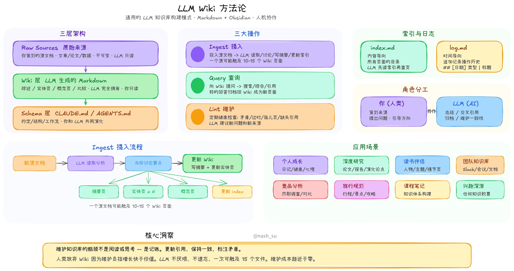
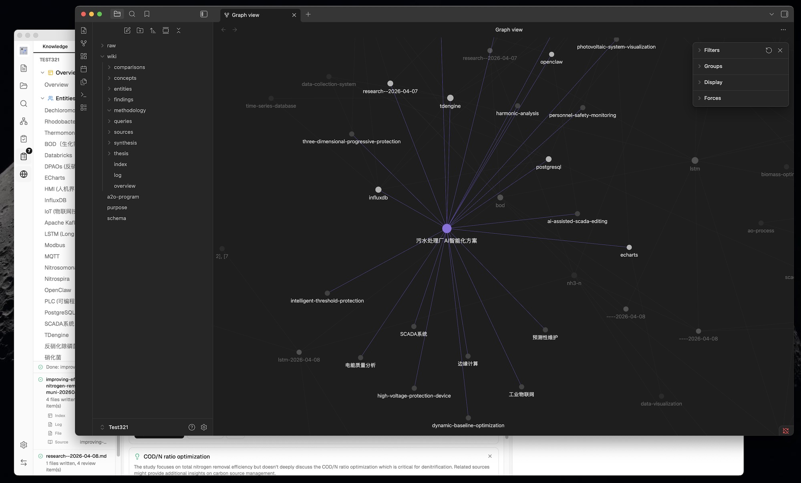
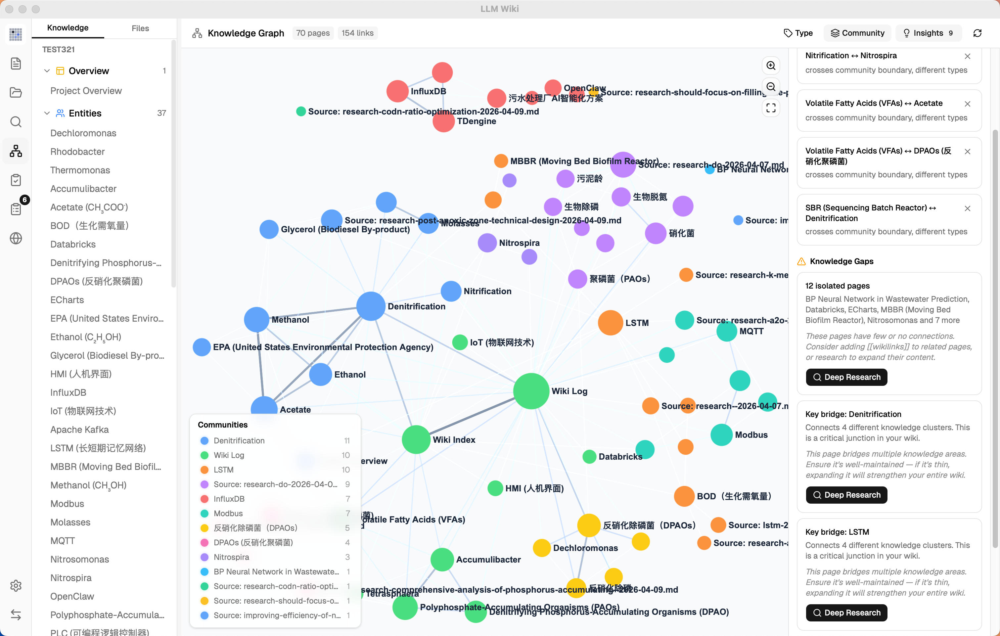
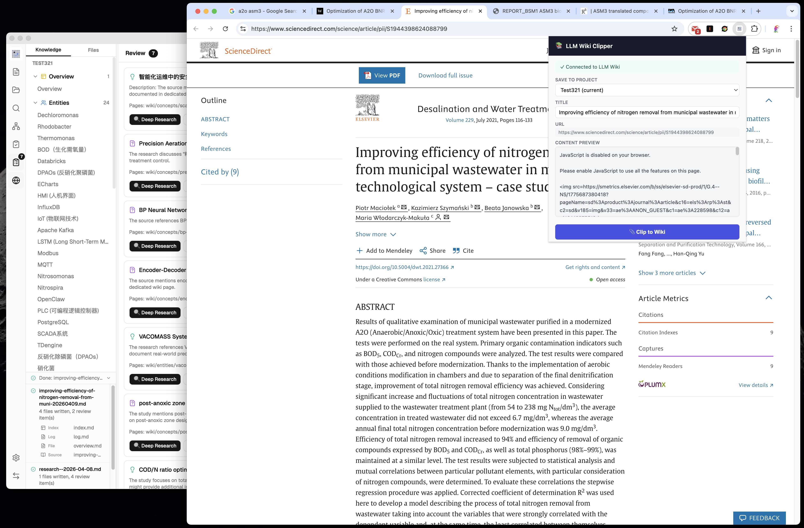

# LLM Wiki

<p align="center">
  
</p>

<p align="center">
  <strong>一个能自我构建的个人知识库。</strong><br>
  LLM 阅读你的文档，构建结构化 Wiki，并持续保持更新。
</p>

<p align="center">
  <a href="#这是什么">这是什么？</a> •
  <a href="#我们的修改与新增">功能特性</a> •
  <a href="#技术栈">技术栈</a> •
  <a href="#安装">安装</a> •
  <a href="#致谢">致谢</a> •
  <a href="#许可证">许可证</a>
</p>

<p align="center">
  <a href="README.md">English</a> | 中文 | <a href="README_JA.md">日本語</a>
</p>

---

<p align="center">
  
</p>

## 功能亮点

- **两步思维链摄入** — LLM 先分析再生成 Wiki 页面，来源可追溯，支持增量缓存
- **多模态图片摄入** — 自动提取 PDF 内嵌图片，调用视觉模型生成事实性描述，搜索结果按图文分区，支持 lightbox 预览与跳转到原始文档对应位置
- **四信号知识图谱** — 直接链接、来源重叠、Adamic-Adar、类型亲和四维关联度模型
- **Louvain 社区检测** — 自动发现知识聚类，内聚度评分
- **图谱洞察** — 惊奇连接与知识空白检测，一键触发 Deep Research
- **向量语义搜索** — 可选的 embedding 检索，基于 LanceDB，支持任意 OpenAI 兼容端点
- **持久化摄入队列** — 串行处理，崩溃恢复，取消/重试，进度可视化
- **文件夹导入** — 递归导入保留目录结构，文件夹路径作为 LLM 分类上下文
- **Source 文件夹自动监听** — 检测 `raw/sources/` 的外部变更，并同步触发摄入或删除清理
- **深度研究** — LLM 智能生成搜索主题，通过 Tavily、SerpApi 或 SearXNG 进行多查询网络搜索，研究结果自动摄入 Wiki
- **异步审核系统** — LLM 在摄入时标记需人工判断的项，预定义操作，预生成搜索查询
- **Chrome 网页剪藏** — 一键捕获网页内容，自动摄入知识库
- **本地 HTTP API + AI Agent Skill** — 内置 `127.0.0.1:19828` JSON API（Token 鉴权），支持 Hybrid 检索、文件读取、知识图谱遍历、源资料重新扫描；配套 [agent skill](https://github.com/nashsu/llm_wiki_skill) 一行命令接入 Claude Code / Codex（`npx skills add …`）

## 这是什么？

LLM Wiki 是一个跨平台桌面应用，能将你的文档自动转化为有组织、相互关联的知识库。与传统 RAG（每次查询都从头检索和回答）不同，LLM 会从你的资料中**增量构建并维护一个持久化的 Wiki**。知识只编译一次并持续更新，而非每次查询都重新推导。

本项目基于 [Karpathy 的 LLM Wiki 方法论](https://gist.github.com/karpathy/442a6bf555914893e9891c11519de94f) —— 一套使用 LLM 构建个人知识库的方法论。我们将其核心理念实现为一个完整的桌面应用，并做了大量增强。

<p align="center">
  
</p>

## 致谢

基础方法论来自 **Andrej Karpathy** 的 [llm-wiki.md](https://gist.github.com/karpathy/442a6bf555914893e9891c11519de94f)，描述了使用 LLM 增量构建和维护个人 Wiki 的设计模式。原始文档是一个抽象的设计范式；本项目是一个具体的实现，并有大量扩展。

## 保留的原始设计

核心架构忠实遵循 Karpathy 的方法论：

- **三层架构**：原始资料（不可变）→ Wiki（LLM 生成）→ Schema（规则和配置）
- **三个核心操作**：Ingest（摄入）、Query（查询）、Lint（检查）
- **index.md** 作为内容目录和 LLM 导航入口
- **log.md** 作为可解析格式的时序操作记录
- **[[wikilink]]** 语法用于交叉引用
- **YAML frontmatter** 存在于每个 Wiki 页面
- **Obsidian 兼容** —— Wiki 目录可直接作为 Obsidian 仓库使用
- **人类策展，LLM 维护** —— 基本角色分工

<p align="center">
  
</p>

## 我们的修改与新增

### 1. 从命令行到桌面应用

原始设计是一个抽象的模式文档，设计上是复制粘贴给 LLM agent 使用的。我们将其构建为**完整的跨平台桌面应用**：
- **三栏布局**：知识树 / 文件树（左）+ 聊天（中）+ 预览（右）
- **图标侧边栏** —— 在 Wiki、资料源、搜索、图谱、Lint、审核、深度研究、设置之间快速切换
- **自定义可调面板** —— 左右面板支持拖拽调整大小，带最小/最大约束
- **活动面板** —— 实时处理状态，逐文件显示摄入进度
- **全状态持久化** —— 对话、设置、审核项、项目配置在重启后保持
- **场景模板** —— 研究、阅读、个人成长、商业、通用 —— 每个模板预配置 purpose.md 和 schema.md

### 2. Purpose.md —— Wiki 的灵魂

原始设计有 Schema（Wiki 如何运作），但没有正式定义 **为什么** 这个 Wiki 存在。我们新增了 `purpose.md`：
- 定义目标、关键问题、研究范围、演进中的论点
- LLM 在每次摄入和查询时都会读取它以获取上下文
- LLM 可以根据使用模式建议更新
- 与 schema 不同 —— schema 是结构规则，purpose 是方向意图

### 3. 两步思维链摄入

原始设计描述的是 LLM 同时阅读和写入的单步摄入。我们将其拆分为**两次顺序 LLM 调用**，显著提升质量：

```
第一步（分析）：LLM 阅读资料 → 结构化分析
  - 关键实体、概念、论点
  - 与现有 Wiki 内容的关联
  - 与现有知识的矛盾和张力
  - Wiki 结构建议

第二步（生成）：LLM 基于分析 → 生成 Wiki 文件
  - 带 frontmatter 的资料摘要（type, title, sources[]）
  - 实体页面、概念页面及交叉引用
  - 更新 index.md、log.md、overview.md
  - 需要人工判断的审核项
  - 深度研究的搜索查询
```

超越原始设计的摄入增强：
- **SHA256 增量缓存** —— 摄入前检查源文件内容哈希，未变更则自动跳过，节省 LLM token 和时间
- **持久化摄入队列** —— 串行处理防止并发 LLM 调用；队列持久化到磁盘，应用重启后自动恢复；失败任务自动重试最多 3 次
- **文件夹导入** —— 递归导入保留目录结构；文件夹路径作为分类上下文传给 LLM（如 "papers > energy" 帮助分类）
- **Source 文件夹自动监听** —— 在应用外新增、修改或删除 `raw/sources/` 文件时会被自动检测，并复用应用内相同的摄入/删除生命周期
- **队列可视化** —— 活动面板显示进度条、排队/处理中/失败任务，支持取消和重试
- **自动 Embedding** —— 开启向量搜索时，新页面摄入后自动生成 embedding
- **来源可追溯** —— 每个生成的 Wiki 页面在 YAML frontmatter 中包含 `sources: []` 字段，链接回贡献的原始资料文件
- **overview.md 自动更新** —— 全局概要页面在每次摄入后重新生成，反映 Wiki 最新状态
- **保证资料摘要生成** —— 兜底机制确保资料摘要页面始终被创建，即使 LLM 遗漏
- **语言感知生成** —— LLM 按用户配置的语言（中文或英文）响应
- **资料源渐进渲染** —— 大型资料目录会随滚动分批渲染，保持 Sources 页面流畅

### 4. 知识图谱与关联度模型

<p align="center">
  
</p>

原始设计提到了 `[[wikilinks]]` 用于交叉引用，但没有图分析。我们构建了**完整的知识图谱可视化和关联度引擎**：

**四信号关联度模型：**
| 信号 | 权重 | 描述 |
|------|------|------|
| 直接链接 | ×3.0 | 通过 `[[wikilinks]]` 链接的页面 |
| 来源重叠 | ×4.0 | 共享同一原始资料的页面（通过 frontmatter `sources[]`） |
| Adamic-Adar | ×1.5 | 共享共同邻居的页面（按邻居度数加权） |
| 类型亲和 | ×1.0 | 相同页面类型的加分（实体↔实体，概念↔概念） |

**图谱可视化（sigma.js + graphology + ForceAtlas2）：**
- 按页面类型或社区着色节点，按链接数缩放节点大小（√ 缩放）
- 边的粗细和颜色按关联权重变化（绿色=强，灰色=弱）
- 悬停交互：邻居节点保持可见，非邻居变暗，边高亮并显示关联度分数
- 缩放控件（放大、缩小、适应屏幕）
- 位置缓存防止数据更新时布局跳动
- 图例根据着色模式自动切换类型计数或社区信息

### 5. Louvain 社区检测

原始设计中没有。基于 **Louvain 算法**（graphology-communities-louvain）自动发现知识聚类：

- **自动聚类** —— 根据链接拓扑发现哪些页面自然归为一组，独立于预定义的页面类型
- **类型 / 社区 一键切换** —— 按页面类型（实体、概念、资料...）或按发现的知识集群着色
- **内聚度评分** —— 每个社区按内部边密度（实际边数 / 可能边数）评分；低内聚社区（< 0.15）标警告
- **12 色调色板** —— 集群之间视觉区分清晰
- **社区图例** —— 显示核心节点标签、成员数和内聚度

<p align="center">
  
</p>

### 6. 图谱洞察 —— 惊奇连接与知识空白

原始设计中没有。系统**自动分析图谱结构**，呈现可操作的洞察：

**惊奇连接：**
- 检测意外关联：跨社区边、跨类型链接、边缘↔核心耦合
- 复合惊奇度评分排序最值得关注的连接
- 可消除 —— 标记为已查看后不再重复出现

**知识空白：**
- **孤立页面**（度 ≤ 1）—— 与 Wiki 其余部分缺少连接的页面
- **稀疏社区**（cohesion < 0.15，≥ 3 页）—— 内部交叉引用薄弱的知识领域
- **桥接节点**（连接 3+ 个集群）—— 维系多个知识领域的关键枢纽页面

**交互：**
- 点击洞察卡片**高亮**图谱中对应节点和边；再次点击取消
- 知识空白和桥接节点附带 **Deep Research 按钮** —— 触发 LLM 智能主题生成（读取 overview.md + purpose.md 获取领域上下文）
- 研究主题在**可编辑确认对话框**中展示 —— 用户可修改主题和搜索查询后再启动

<p align="center">
  
</p>

### 7. 优化的查询检索管线

原始设计描述了 LLM 读取相关页面的简单查询。我们构建了支持可选向量搜索的**多阶段检索管线**：

```
阶段 1：分词搜索
  - 英文：分词 + 停用词过滤
  - 中文：CJK 二元组分词（每个 → [每个, 个…]）
  - 标题匹配加分（+10 分）
  - 同时搜索 wiki/ 和 raw/sources/

阶段 1.5：向量语义搜索（可选）
  - 通过任意 OpenAI 兼容的 /v1/embeddings 端点生成 embedding
  - 存储在 LanceDB（Rust 后端）中进行快速 ANN 检索
  - 余弦相似度发现即使没有关键词重叠也语义相关的页面
  - 结果合并：增强已有匹配 + 添加新发现

阶段 2：图谱扩展
  - 搜索结果作为种子节点
  - 四信号关联度模型发现相关页面
  - 2 跳遍历带衰减，发现更深层关联

阶段 3：预算控制
  - 可配置上下文窗口：4K → 1M tokens
  - 比例分配：60% Wiki 页面，20% 聊天历史，5% 索引，15% 系统提示
  - 页面按搜索 + 图谱关联度综合分数排序

阶段 4：上下文组装
  - 编号页面附完整内容（非仅摘要）
  - 系统提示包含：purpose.md、语言规则、引用格式、index.md
  - LLM 被指示按编号引用页面：[1]、[2] 等
```

**向量搜索**完全可选 —— 默认关闭，在设置中开启，有独立的端点、API Key 和模型配置。关闭时管线 fallback 到分词搜索 + 图谱扩展。基准测试：开启向量搜索后整体召回率从 58.2% 提升至 71.4%。

### 8. 多对话聊天与持久化

原始设计只有单一查询接口。我们构建了**完整的多对话支持**：

- **独立聊天会话** —— 创建、重命名、删除对话
- **对话侧边栏** —— 快速切换不同主题
- **逐对话持久化** —— 每个对话保存到 `.llm-wiki/chats/{id}.json`
- **可配置历史深度** —— 限制作为上下文发送的消息数量（默认：10）
- **引用参考面板** —— 每条回复上可折叠的区域，显示使用了哪些 Wiki 页面，按类型分组并附图标
- **引用持久化** —— 引用的页面直接存储在消息数据中，重启后稳定不变
- **重新生成** —— 一键重新生成最后一条回复（移除最后的助手+用户消息对，重新发送）
- **保存到 Wiki** —— 将有价值的回答归档到 `wiki/queries/`，然后自动摄入提取实体/概念到知识网络

### 9. 思维链 / 推理过程展示

原始设计中没有。针对会输出 `<think>` 块的 LLM（DeepSeek、QwQ 等）：

- **流式思维展示** —— 生成中滚动显示 5 行，带透明度渐变
- **默认折叠** —— 生成完成后思维块隐藏，点击展开
- **视觉分离** —— 思维内容以独特样式显示，与主回复分开

### 10. KaTeX 数学公式渲染

原始设计中没有。跨所有视图的完整 LaTeX 数学支持：

- **KaTeX 渲染** —— 行内 `$...$` 和块级 `$$...$$` 公式通过 remark-math + rehype-katex 渲染
- **Milkdown 数学插件** —— 预览编辑器通过 @milkdown/plugin-math 原生渲染数学公式
- **自动检测** —— 裸 `\begin{aligned}` 等 LaTeX 环境自动补上 `$$` 定界符
- **Unicode 降级** —— 100+ 符号映射（α, ∑, →, ≤ 等）用于数学块外的简单行内符号

### 11. 审核系统（异步人机协作）

原始设计建议在摄入时全程参与。我们新增了**异步审核队列**：

- LLM 在摄入过程中标记需要人工判断的项目
- **预定义操作类型**：创建页面、深度研究、跳过 —— 约束操作防止 LLM 凭空生成任意操作
- **摄入时生成搜索查询** —— LLM 预先为每个审核项生成优化的网络搜索查询
- 用户可在方便时处理审核 —— 不阻塞摄入流程

### 12. 深度研究

<p align="center">
  
</p>

原始设计中没有。当 LLM 识别出知识空白时：

- **网络搜索** 支持 Tavily、SerpApi 或 SearXNG，查找相关资料并返回完整内容（非截断摘要）
- **Provider 独立配置** —— Tavily 和 SerpApi 使用各自 API Key；SerpApi 支持选择搜索引擎，SearXNG 使用实例 URL 和搜索分类
- **多条搜索查询** —— 摄入时由 LLM 生成，针对搜索引擎优化
- **LLM 智能主题生成** —— 从图谱洞察触发时，LLM 读取 overview.md + purpose.md 生成领域精准的研究主题和查询（非泛泛关键词）
- **用户确认对话框** —— 研究主题和搜索查询可编辑，确认后才开始研究
- **LLM 综合** 搜索结果生成 Wiki 研究页面，并交叉引用现有 Wiki
- **思维链展示** —— 综合过程中 `<think>` 块显示为可折叠区域，自动滚动到最新内容
- **自动摄入** —— 研究结果自动进入两步摄入流程，提取实体/概念到 Wiki
- **任务队列** —— 最多 3 个并发任务
- **研究面板** —— 专用侧边面板，动态高度，实时流式进度

### 13. 浏览器扩展（网页剪藏）

<p align="center">
  
</p>

原始设计提到了 Obsidian Web Clipper。我们构建了**专用 Chrome 扩展**（Manifest V3）：

- **Mozilla Readability.js** 精确提取文章内容（去除广告、导航、侧边栏）
- **Turndown.js** 将 HTML 转换为 Markdown，支持表格
- **项目选择器** —— 选择剪藏到哪个 Wiki（支持多项目）
- **本地 HTTP API**（端口 19827，tiny_http）—— 扩展 ↔ 应用通信
- **自动摄入** —— 剪藏内容自动触发两步摄入流程
- **剪藏监听** —— 每 3 秒轮询新剪藏，自动处理
- **离线预览** —— 即使应用未运行也能显示提取的内容

### 14. 多格式文档支持

原始设计聚焦于纯文本/Markdown。我们支持保留文档语义的结构化提取：

| 格式 | 方法 |
|------|------|
| PDF | pdf-extract（Rust）+ 文件缓存 |
| DOCX | docx-rs —— 标题、加粗/斜体、列表、表格 → 结构化 Markdown |
| PPTX | ZIP + XML —— 逐页提取，保留标题/列表结构 |
| XLSX/XLS/ODS | calamine —— 正确的单元格类型、多工作表支持、Markdown 表格 |
| 图片 | 原生预览（png, jpg, gif, webp, svg 等） |
| 视频/音频 | 内置播放器 |
| 网页剪藏 | Readability.js + Turndown.js → 干净的 Markdown |

### 15. 文件删除级联清理

原始设计没有删除机制。我们新增了**智能级联删除**：

- 删除资料文件时同时移除其 Wiki 摘要页面
- **三重匹配** 查找相关 Wiki 页面：frontmatter `sources[]` 字段、资料摘要页面名称、frontmatter 章节引用
- **共享实体保护** —— 链接到多个资料的实体/概念页面仅从其 `sources[]` 数组中移除被删除的资料，而非删除整个页面
- **索引清理** —— 被移除的页面从 index.md 中清除
- **Wiki 链接清理** —— 指向已删除页面的失效 `[[wikilinks]]` 从其余 Wiki 页面中移除

### 16. 可配置上下文窗口

原始设计中没有。用户可配置 LLM 接收多少上下文：

- **4K 到 1M tokens 滑块** —— 适配不同 LLM 的能力
- **比例预算分配** —— 更大的窗口按比例获得更多 Wiki 内容
- **60/20/5/15 分配** —— Wiki 页面 / 聊天历史 / 索引 / 系统提示

### 17. 跨平台兼容

原始设计与平台无关（抽象模式）。我们处理了具体的跨平台问题：

- **路径规范化** —— 统一的 `normalizePath()` 在 22+ 个文件中使用，反斜杠 → 正斜杠
- **Unicode 安全字符串处理** —— 基于字符而非字节的切片（防止中文文件名导致崩溃）
- **macOS 关闭隐藏** —— 关闭按钮隐藏窗口（程序后台运行），点击 Dock 图标恢复，Cmd+Q 退出
- **Windows/Linux 关闭确认** —— 关闭时弹出确认对话框，防止误操作导致数据丢失
- **Tauri v2** —— macOS、Windows、Linux 原生桌面
- **GitHub Actions CI/CD** —— 自动构建 macOS（ARM + Intel）、Windows（.msi）、Linux（.deb / .AppImage）

### 18. 其他新增

- **国际化** —— 中英文界面（react-i18next）
- **设置持久化** —— LLM 提供商、API 密钥、模型、上下文大小、语言通过 Tauri Store 保存
- **Obsidian 配置** —— 自动生成 `.obsidian/` 目录及推荐设置
- **Markdown 渲染** —— 带边框的 GFM 表格、代码块、聊天和预览中的 wikilink 处理
- **多 LLM 提供商** —— OpenAI、Anthropic、Google、Ollama、自定义 —— 各有特定的流式传输和请求头
- **15 分钟超时** —— 长时间摄入操作不会过早失败
- **dataVersion 信号** —— 图谱和 UI 在 Wiki 内容变更时自动刷新

## 技术栈

| 层级 | 技术 |
|------|------|
| 桌面 | Tauri v2（Rust 后端） |
| 前端 | React 19 + TypeScript + Vite |
| UI | shadcn/ui + Tailwind CSS v4 |
| 编辑器 | Milkdown（基于 ProseMirror 的所见即所得） |
| 图谱 | sigma.js + graphology + ForceAtlas2 |
| 搜索 | 分词搜索 + 图谱关联度 + 可选向量（LanceDB） |
| 向量数据库 | LanceDB（Rust，嵌入式，可选） |
| PDF | pdf-extract |
| Office | docx-rs + calamine |
| 国际化 | react-i18next |
| 状态管理 | Zustand |
| LLM | 流式 fetch（OpenAI、Anthropic、Google、Ollama、自定义） |
| 网络搜索 | Tavily、SerpApi、SearXNG JSON API |

## 安装

### 预编译二进制文件

从 [Releases](https://github.com/nashsu/llm_wiki/releases) 下载：
- **macOS**：`.dmg`（Apple Silicon + Intel）
- **Windows**：`.msi`
- **Linux**：`.deb` / `.AppImage`

### 从源码构建

```bash
# 前置条件：Node.js 20+, Rust 1.70+
git clone https://github.com/nashsu/llm_wiki.git
cd llm_wiki
npm install
npm run tauri dev      # 开发模式
npm run tauri build    # 生产构建
```

### Chrome 扩展

1. 打开 `chrome://extensions`
2. 启用「开发者模式」
3. 点击「加载已解压的扩展程序」
4. 选择 `extension/` 目录

## 快速开始

1. 启动应用 → 创建新项目（选择模板）
2. 进入 **设置** → 配置 LLM 提供商（API 密钥 + 模型）
3. 可选：在 **设置** 中配置网络搜索 Provider 和 source 文件夹自动监听
4. 进入 **资料源** → 导入文档（PDF、DOCX、MD 等）
5. 观察 **活动面板** —— LLM 自动构建 Wiki 页面
6. 使用 **聊天** 查询你的知识库
7. 浏览 **知识图谱** 查看关联
8. 查看 **审核** 处理需要你关注的项目
9. 定期运行 **Lint** 维护 Wiki 健康度

## 本地 HTTP API + AI Agent Skill

LLM Wiki 内置一个本地 HTTP API（监听 `http://127.0.0.1:19828`，Token 鉴权，仅本机可达），任何外部工具——包括 **Claude Code**、**Codex** 这类 AI Agent，或者任意能发 HTTP 请求的脚本——都可以直接查询你的知识库：

- `GET /api/v1/health` —— 服务状态（无需鉴权）
- `GET /api/v1/projects` —— 项目列表
- `GET /api/v1/projects/{id}/files` / `files/content` —— 读取文件树与内容
- `POST /api/v1/projects/{id}/search` —— **Hybrid 混合检索**（关键词 + 向量），返回 `mode`、`tokenHits`、`vectorHits`，每条结果带 `vectorScore`
- `GET /api/v1/projects/{id}/graph` —— Wikilinks 知识图谱
- `POST /api/v1/projects/{id}/sources/rescan` —— 触发后端重新扫描

在 **设置 → API 服务** 中开启 API 并生成 Token。

### 一条命令把 AI Agent 接进你的知识库

LLM Wiki 配套的 **agent skill** 单独维护在另一个仓库。把它装进 Claude Code / Codex / 任意兼容 skills 的 runtime：

```bash
npx skills add https://github.com/nashsu/llm_wiki_skill.git --skill llm_wiki_skill
```

安装完成后，Agent 就能响应 "我的 LLM Wiki 里关于 X 是怎么说的"、"在我的知识库里搜 Y"、"展示我 wiki 图谱里 Z 的邻居"、"重新索引我的资料源" 等请求——直接调用本机运行的 App，默认只读，引用 wiki 页面路径方便你在 App 内核对。

- **Skill 仓库**：<https://github.com/nashsu/llm_wiki_skill>
- **触发约束**：刻意**不会**响应"搜我的笔记"/"看我的 Obsidian / Notion / Logseq"这类泛指的请求——只有你明确说 LLM Wiki / `我的 wiki` / `我的知识库` 时才会被调用。

## 项目结构

```
my-wiki/
├── purpose.md              # 目标、关键问题、研究范围
├── schema.md               # Wiki 结构规则、页面类型
├── raw/
│   ├── sources/            # 上传的文档（不可变）
│   └── assets/             # 本地图片
├── wiki/
│   ├── index.md            # 内容目录
│   ├── log.md              # 操作历史
│   ├── overview.md         # 全局概要（自动更新）
│   ├── entities/           # 人物、组织、产品
│   ├── concepts/           # 理论、方法、技术
│   ├── sources/            # 资料摘要
│   ├── queries/            # 保存的聊天回答 + 研究
│   ├── synthesis/          # 跨资料分析
│   └── comparisons/        # 并列对比
├── .obsidian/              # Obsidian 仓库配置（自动生成）
└── .llm-wiki/              # 应用配置、聊天历史、审核项
```

## Star History

<a href="https://www.star-history.com/?repos=nashsu%2Fllm_wiki&type=date&legend=top-left">
 <picture>
   <source media="(prefers-color-scheme: dark)" srcset="https://api.star-history.com/chart?repos=nashsu/llm_wiki&type=date&theme=dark&legend=top-left" />
   <source media="(prefers-color-scheme: light)" srcset="https://api.star-history.com/chart?repos=nashsu/llm_wiki&type=date&legend=top-left" />
   
 </picture>
</a>

## 许可证

本项目基于 **GNU 通用公共许可证 v3.0** 授权 —— 详见 [LICENSE](LICENSE)。
