# Open Design

> [!IMPORTANT]
> ### 🔥 `0.8.0-preview` уже здесь. Старый мир дизайна заканчивается здесь.
>
> Open-source, agent-native альтернатива Claude Design / Figma — 40k звёзд за две недели довели нас до этой точки. **Дальше — только с тобой.**
>
> **Быстрая итерация на `main`** — 0.8.0 — следующая фаза Open Design. Кидай PR, бросай безумную идею, заводи баг — что приносишь ты, таким и становится это движение.
>
> → [**Прочитать анонс · скачать установщик · присоединиться к движению**](https://github.com/nexu-io/open-design/discussions/1727) · устанавливается параллельно с твоей текущей 0.7.

> **Открытая альтернатива [Claude Design][cd].** Локально-ориентированная, пригодная для web-деплоя, с BYOK на каждом уровне: **16 CLI coding-агентов** автоматически обнаруживаются в вашем `PATH` (Claude Code, Codex, Devin for Terminal, Cursor Agent, Gemini CLI, OpenCode, Qwen, Qoder CLI, GitHub Copilot CLI, Hermes, Kimi, Pi, Kiro, Kilo, Mistral Vibe, DeepSeek TUI) и превращаются в движок генерации дизайна, управляемый **31 комбинируемым навыком** и **72 дизайн-системами уровня бренда**. Нет CLI? OpenAI-совместимый BYOK-прокси даёт тот же цикл без локального запуска агента.

<p align="center">
  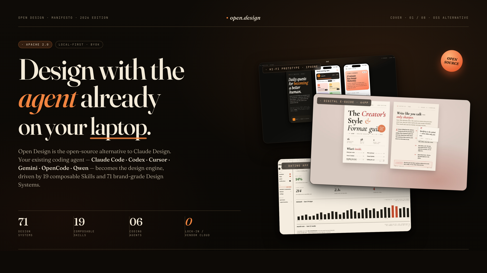
</p>

<p align="center">
  <a href="https://github.com/nexu-io/open-design/stargazers"></a>
  <a href="https://github.com/nexu-io/open-design/network/members"></a>
  <a href="https://github.com/nexu-io/open-design/issues"></a>
  <a href="https://github.com/nexu-io/open-design/pulls"></a>
  <a href="https://github.com/nexu-io/open-design/graphs/contributors"></a>
  <a href="https://github.com/nexu-io/open-design/commits/main"></a>
  <a href="https://github.com/nexu-io/open-design/commits/main"></a>
</p>

<p align="center">
  <a href="https://open-design.ai/"></a>
  <a href="https://github.com/nexu-io/open-design/releases"></a>
  <a href="LICENSE"></a>
  <a href="#поддерживаемые-coding-agent-cli"></a>
  <a href="#системы-дизайна"></a>
  <a href="#навыки"></a>
  <a href="https://discord.gg/qhbcCH8Am4"></a>
  <a href="QUICKSTART.md"></a>
</p>

<p align="center"><a href="README.md">English</a> · <a href="README.es.md">Español</a> · <a href="README.pt-BR.md">Português (Brasil)</a> · <a href="README.de.md">Deutsch</a> · <a href="README.fr.md">Français</a> · <a href="README.zh-CN.md">简体中文</a> · <a href="README.zh-TW.md">繁體中文</a> · <a href="README.ko.md">한국어</a> · <a href="README.ja-JP.md">日本語</a> · <a href="README.ar.md">العربية</a> · <b>Русский</b> · <a href="README.uk.md">Українська</a> · <a href="README.tr.md">Türkçe</a></p>

---

## Зачем это существует

Anthropic [Claude Design][cd] (выпущен 2026-04-17, на Opus 4.7) показал, что происходит, когда LLM перестаёт писать прозу и начинает выдавать готовые дизайн-артефакты. Продукт моментально стал вирусным — и остался закрытым, платным, облачным и жёстко привязанным к модели Anthropic и внутренним навыкам Anthropic. Никакого checkout, никакого self-host, никакого деплоя на Vercel, никакой замены агента на своего.

**Open Design (OD) — открытая альтернатива.** Тот же цикл, та же логика artifact-first, но без lock-in. Мы не поставляем собственного агента: самые сильные coding-агенты уже стоят у вас на ноутбуке. Мы связываем их с skill-driven workflow для дизайна, который запускается локально через `pnpm tools-dev`, умеет выкладывать web-слой на Vercel и остаётся BYOK на каждом уровне.

Введите `make me a magazine-style pitch deck for our seed round`. Ещё до того, как модель импровизирует хоть один пиксель, появляется интерактивная форма вопросов. Агент выбирает одно из пяти отобранных визуальных направлений. Живой план `TodoWrite` стримится в UI. Демон создаёт на диске реальную проектную папку с seed-шаблоном, библиотекой раскладок и checklist’ом самопроверки. Агент читает их — pre-flight обязателен — прогоняет пятимерную критику собственного результата и выдаёт единый `<artifact>`, который через несколько секунд рендерится в sandboxed iframe.

Это не «ИИ пытается что-то задизайнить». Это ИИ, который prompt stack приучил вести себя как senior-дизайнер с рабочей файловой системой, детерминированной библиотекой палитр и культурой checklist’ов — ровно та планка, которую задал Claude Design, только в открытом и вашем варианте.

OD стоит на плечах четырёх open-source проектов:

- [**`alchaincyf/huashu-design`**](https://github.com/alchaincyf/huashu-design) — философский компас дизайна. Junior-Designer workflow, 5-step protocol для brand assets, anti-AI-slop checklist, 5-dimensional self-critique и идея «5 schools × 20 design philosophies» для выбора направления — всё это distilled в [`apps/daemon/src/prompts/discovery.ts`](apps/daemon/src/prompts/discovery.ts).
- [**`op7418/guizang-ppt-skill`**](https://github.com/op7418/guizang-ppt-skill) — режим deck. Встроен без изменений в [`skills/guizang-ppt/`](skills/guizang-ppt/) с сохранением исходной LICENSE; журнальные раскладки, WebGL hero и P0/P1/P2 checklists.
- [**`OpenCoworkAI/open-codesign`**](https://github.com/OpenCoworkAI/open-codesign) — UX-северная звезда и наш ближайший peer. Мы заимствуем streaming-artifact loop, шаблон sandboxed iframe preview (vendored React 18 + Babel), live agent panel (todos + tool calls + interruptible generation) и набор из пяти форматов экспорта (HTML / PDF / PPTX / ZIP / Markdown). Осознанное расхождение — в форм-факторе: они делают desktop Electron app с bundled [`pi-ai`][piai], мы — web app + local daemon, делегирующий работу вашему существующему CLI.
- [**`multica-ai/multica`**](https://github.com/multica-ai/multica) — архитектура демона и runtime. PATH-scan detection агентов, local daemon как единственный привилегированный процесс и мировоззрение agent-as-teammate.

## С первого взгляда

| | Что вы получаете |
|---|---|
| **Coding-agent CLI (16)** | Claude Code · Codex CLI · Devin for Terminal · Cursor Agent · Gemini CLI · OpenCode · Qwen Code · Qoder CLI · GitHub Copilot CLI · Hermes (ACP) · Kimi CLI (ACP) · Pi (RPC) · Kiro CLI (ACP) · Kilo (ACP) · Mistral Vibe CLI (ACP) · DeepSeek TUI — автоматически обнаруживаются в `PATH`, переключаются одним кликом |
| **BYOK fallback** | OpenAI-совместимый прокси на `/api/proxy/stream` — вставьте `baseUrl` + `apiKey` + `model`, и любой вендор (Anthropic-via-OpenAI, DeepSeek, Groq, MiMo, OpenRouter, self-hosted vLLM или любой другой OpenAI-compatible provider) станет движком. На границе демона заблокированы internal IP / SSRF. |
| **Design systems built-in** | **129** — 2 вручную написанных стартера + 70 продуктовых систем (Linear, Stripe, Vercel, Airbnb, Tesla, Notion, Anthropic, Apple, Cursor, Supabase, Figma, Xiaohongshu, …) из [`awesome-design-md`][acd2], плюс 57 design skills из [`awesome-design-skills`][ads], добавленных напрямую в `design-systems/` |
| **Skills built-in** | **31** — 27 в режиме `prototype` (web-prototype, saas-landing, dashboard, mobile-app, gamified-app, social-carousel, magazine-poster, dating-web, sprite-animation, motion-frames, critique, tweaks, wireframe-sketch, pm-spec, eng-runbook, finance-report, hr-onboarding, invoice, kanban-board, team-okrs, …) + 4 в режиме `deck` (`guizang-ppt` · `simple-deck` · `replit-deck` · `weekly-update`). В picker группируются по `scenario`: design / marketing / operation / engineering / product / finance / hr / sale / personal. |
| **Media generation** | Режимы image · video · audio идут рядом с дизайн-циклом. **gpt-image-2** (Azure / OpenAI) — для постеров, аватаров, инфографики и иллюстрированных карт; **Seedance 2.0** (ByteDance) — для кинематографичных 15s text-to-video и image-to-video; **HyperFrames** ([heygen-com/hyperframes](https://github.com/heygen-com/hyperframes)) — для HTML→MP4 motion graphics (product reveals, kinetic typography, charts, social overlays, logo outros). Галерея из **93 готовых к воспроизведению промптов** — 43 для gpt-image-2, 39 для Seedance и 11 для HyperFrames — лежит в [`prompt-templates/`](prompt-templates/), с preview thumbnail и указанием источника. Тот же чатовый surface, что и для кода; на выходе в проектном workspace появляется реальный `.mp4` / `.png`. |
| **Visual directions** | 5 отобранных школ (Editorial Monocle · Modern Minimal · Warm Soft · Tech Utility · Brutalist Experimental) — каждая с детерминированной OKLch-палитрой и стеком шрифтов ([`apps/daemon/src/prompts/directions.ts`](apps/daemon/src/prompts/directions.ts)) |
| **Device frames** | iPhone 15 Pro · Pixel · iPad Pro · MacBook · Browser Chrome — pixel-perfect, общие для навыков, хранятся в [`assets/frames/`](assets/frames/) |
| **Agent runtime** | Local daemon запускает CLI в папке проекта — агент получает реальные `Read`, `Write`, `Bash`, `WebFetch` поверх реальной on-disk среды, с Windows fallback’ами для `ENAMETOOLONG` (stdin / prompt-file) на каждом адаптере |
| **Imports** | Перетащите ZIP-экспорт из [Claude Design][cd] в welcome dialog — `POST /api/import/claude-design` превратит его в реальный проект, чтобы ваш агент продолжил редактирование там, где остановился Anthropic |
| **Persistence** | SQLite в `.od/app.sqlite`: projects · conversations · messages · tabs · saved templates. Откройте завтра — и todo card с открытыми файлами будут ровно там, где вы их оставили. |
| **Lifecycle** | Единая точка входа: `pnpm tools-dev` (start / stop / run / status / logs / inspect / check) — поднимает daemon + web (+ desktop) под typed sidecar stamps |
| **Desktop** | Опциональная Electron-оболочка с sandboxed renderer + sidecar IPC (STATUS / EVAL / SCREENSHOT / CONSOLE / CLICK / SHUTDOWN) — именно через неё работает `tools-dev inspect desktop screenshot` для E2E |
| **Deployable to** | Локально (`pnpm tools-dev`) · web-слой на Vercel · упакованное Electron desktop-приложение для macOS (Apple Silicon) и Windows (x64) — скачать на [open-design.ai](https://open-design.ai/) или на [странице последнего релиза](https://github.com/nexu-io/open-design/releases) |
| **License** | Apache-2.0 |

[acd2]: https://github.com/VoltAgent/awesome-design-md
[ads]: https://github.com/bergside/awesome-design-skills

## Демо

<table>
<tr>
<td width="50%">
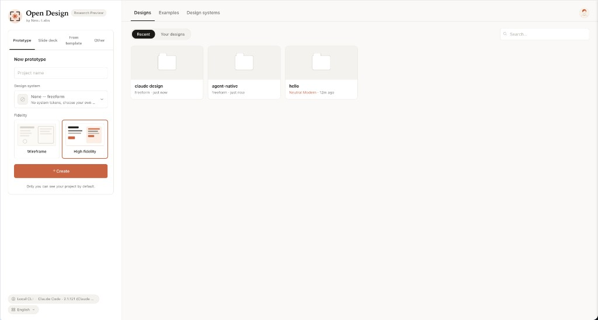<br/>
<sub><b>Экран входа</b> — выберите skill, design system и введите brief. Один и тот же surface для прототипов, deck’ов, мобильных приложений, dashboard’ов и editorial pages.</sub>
</td>
<td width="50%">
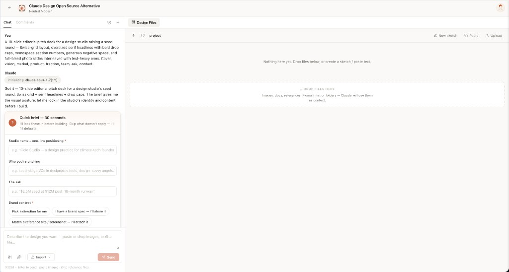<br/>
<sub><b>Форма первичной диагностики</b> — до того как модель нарисует хотя бы пиксель, OD фиксирует brief: surface, audience, tone, brand context, scale. 30 секунд с radio buttons лучше 30 минут редиректов.</sub>
</td>
</tr>
<tr>
<td width="50%">
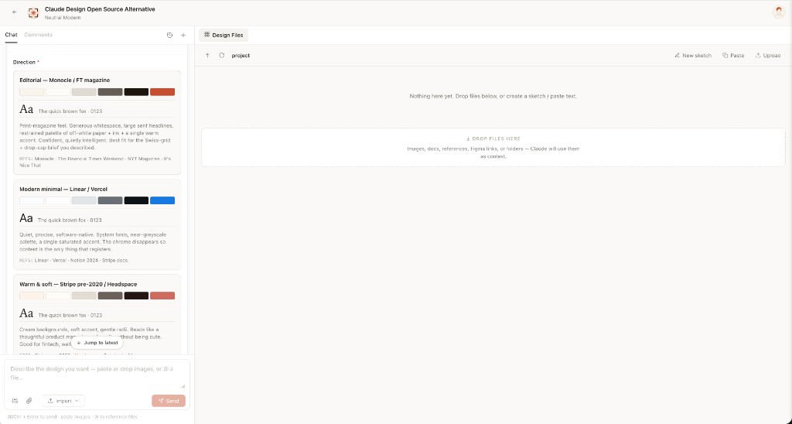<br/>
<sub><b>Выбор направления</b> — если у пользователя нет бренда, агент выводит вторую форму с 5 curated directions (Monocle / Modern Minimal / Tech Utility / Brutalist / Soft Warm). Один radio click → детерминированная палитра и стек шрифтов, без model freestyle.</sub>
</td>
<td width="50%">
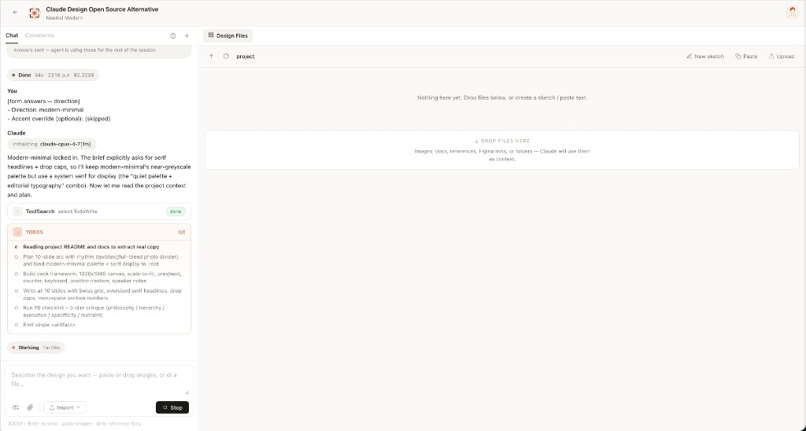<br/>
<sub><b>Живой прогресс по задачам</b> — план агента стримится как live card. Обновления <code>in_progress</code> → <code>completed</code> прилетают в реальном времени. Пользователь может недорого скорректировать курс прямо на лету.</sub>
</td>
</tr>
<tr>
<td width="50%">
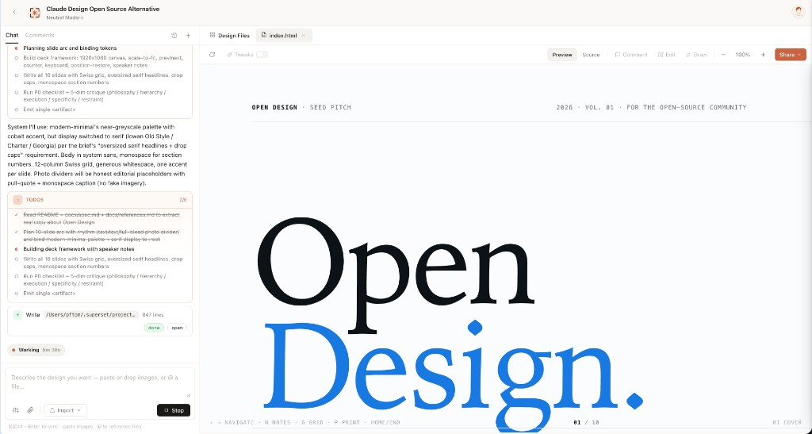<br/>
<sub><b>Песочничный предпросмотр</b> — каждый <code>&lt;artifact&gt;</code> рендерится в чистом srcdoc iframe. Его можно редактировать на месте через файловый workspace и скачивать как HTML, PDF или ZIP.</sub>
</td>
<td width="50%">
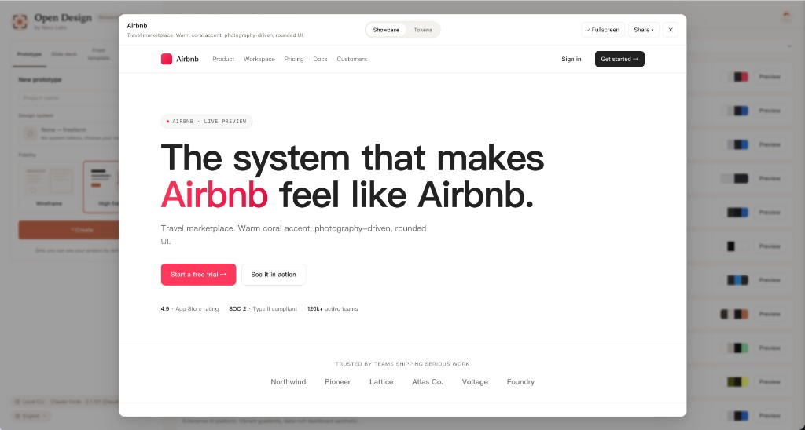<br/>
<sub><b>Библиотека из 72 систем</b> — каждая продуктовая система показывает свою 4-цветную сигнатуру. По клику открываются полные <code>DESIGN.md</code>, сетка swatch’ей и live showcase.</sub>
</td>
</tr>
<tr>
<td width="50%">
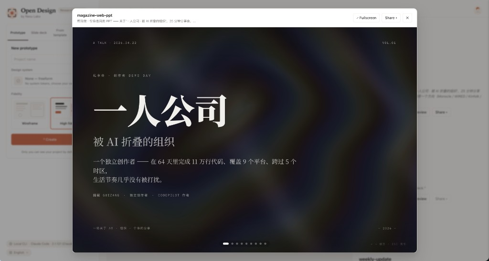<br/>
<sub><b>Режим deck (guizang-ppt)</b> — встроенный <a href="https://github.com/op7418/guizang-ppt-skill"><code>guizang-ppt-skill</code></a> подключён без изменений. Журнальные раскладки, WebGL hero-фоны, single-file HTML output, экспорт в PDF.</sub>
</td>
<td width="50%">
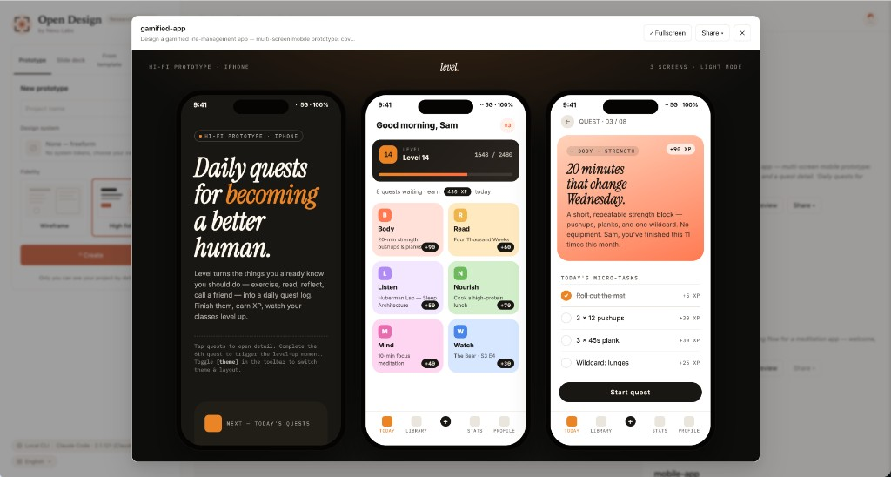<br/>
<sub><b>Мобильный прототип</b> — pixel-perfect chrome iPhone 15 Pro (Dynamic Island, status bar SVG, home indicator). Многоэкранные прототипы используют общие ресурсы <code>/frames/</code>, поэтому агент никогда не перерисовывает телефон заново.</sub>
</td>
</tr>
</table>

## Навыки

**31 навык поставляется из коробки.** Каждый — это папка в [`skills/`](skills/), следующая Claude Code-конвенции [`SKILL.md`][skill] с расширенным `od:` frontmatter, который демон парсит как есть: `mode`, `platform`, `scenario`, `preview.type`, `design_system.requires`, `default_for`, `featured`, `fidelity`, `speaker_notes`, `animations`, `example_prompt` ([`apps/daemon/src/skills.ts`](apps/daemon/src/skills.ts)).

Два верхнеуровневых **режима** образуют каталог: **`prototype`** (27 навыков — всё, что рендерится как одностраничный артефакт: от журнальной landing page до экрана телефона или PM spec doc) и **`deck`** (4 навыка — горизонтально перелистываемые презентации с deck-framework chrome). Поле **`scenario`** используется picker’ом для группировки: `design` · `marketing` · `operation` · `engineering` · `product` · `finance` · `hr` · `sale` · `personal`.

### Витринные примеры

Самые визуально характерные skills, которые вы, скорее всего, запустите первыми. Каждый поставляется с реальным `example.html`, который можно открыть прямо из репозитория и увидеть точный тип результата — без авторизации и без настройки.

<table>
<tr>
<td width="50%" valign="top">
<a href="skills/dating-web/"></a><br/>
<sub><b><a href="skills/dating-web/"><code>dating-web</code></a></b> · <i>prototype</i><br/>Потребительский dashboard для знакомств / мэтчинга — левая навигационная колонка, тикер, KPI, график взаимных совпадений за 30 дней, editorial typography.</sub>
</td>
<td width="50%" valign="top">
<a href="skills/digital-eguide/">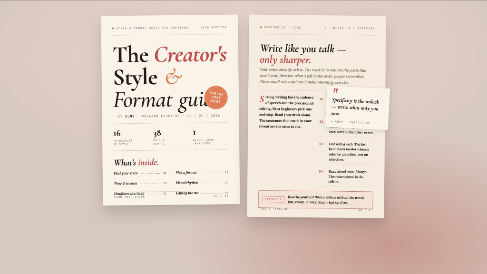</a><br/>
<sub><b><a href="skills/digital-eguide/"><code>digital-eguide</code></a></b> · <i>template</i><br/>Двухразворотный digital e-guide — обложка (заголовок, автор, teaser оглавления) + учебный разворот с pull quote и списком шагов. Тон — creator / lifestyle.</sub>
</td>
</tr>
<tr>
<td width="50%" valign="top">
<a href="skills/email-marketing/">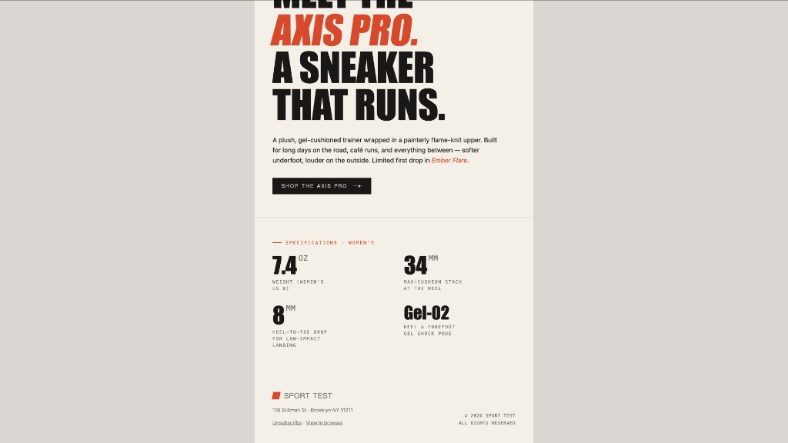</a><br/>
<sub><b><a href="skills/email-marketing/"><code>email-marketing</code></a></b> · <i>prototype</i><br/>Брендовое HTML-письмо для product launch — masthead, hero image, headline lockup, CTA и сетка характеристик. Центрированная одноколоночная структура, безопасная для table fallback.</sub>
</td>
<td width="50%" valign="top">
<a href="skills/gamified-app/">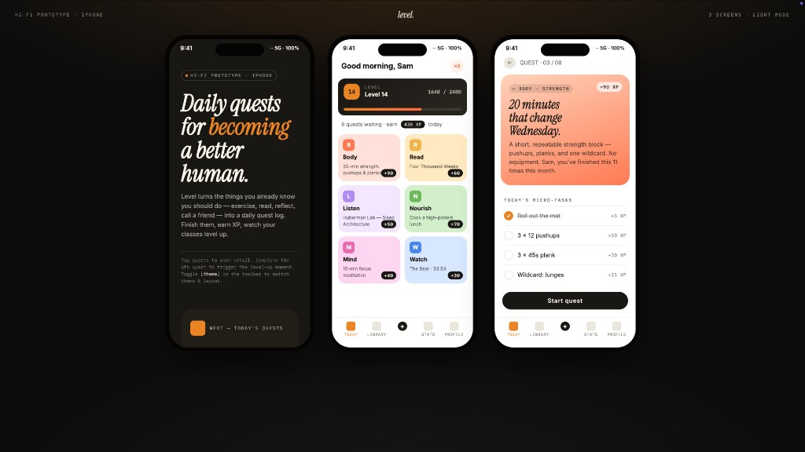</a><br/>
<sub><b><a href="skills/gamified-app/"><code>gamified-app</code></a></b> · <i>prototype</i><br/>Трёхэкранный gamified mobile-app prototype на тёмной showcase-сцене — обложка, сегодняшние квесты с XP-ленточками и уровневой шкалой, детали квеста.</sub>
</td>
</tr>
<tr>
<td width="50%" valign="top">
<a href="skills/mobile-onboarding/"></a><br/>
<sub><b><a href="skills/mobile-onboarding/"><code>mobile-onboarding</code></a></b> · <i>prototype</i><br/>Трёхэкранный mobile onboarding flow — splash, value proposition, sign-in. Status bar, точки свайпа, основной CTA.</sub>
</td>
<td width="50%" valign="top">
<a href="skills/motion-frames/">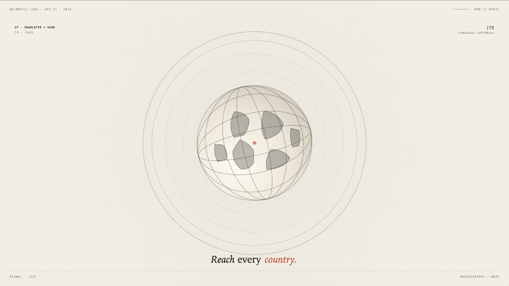</a><br/>
<sub><b><a href="skills/motion-frames/"><code>motion-frames</code></a></b> · <i>prototype</i><br/>Однокадровый motion-design hero с циклическими CSS-анимациями — вращающееся типографическое кольцо, анимированный глобус, отсчитывающий таймер. Готово к hand-off в HyperFrames.</sub>
</td>
</tr>
<tr>
<td width="50%" valign="top">
<a href="skills/social-carousel/">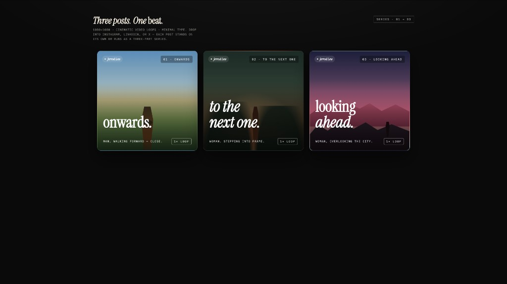</a><br/>
<sub><b><a href="skills/social-carousel/"><code>social-carousel</code></a></b> · <i>prototype</i><br/>Карусель для соцсетей из трёх карточек 1080×1080 — кинематографичные панели с display-заголовками, связывающими серию, brand mark и явным намёком на цикл просмотра.</sub>
</td>
<td width="50%" valign="top">
<a href="skills/sprite-animation/">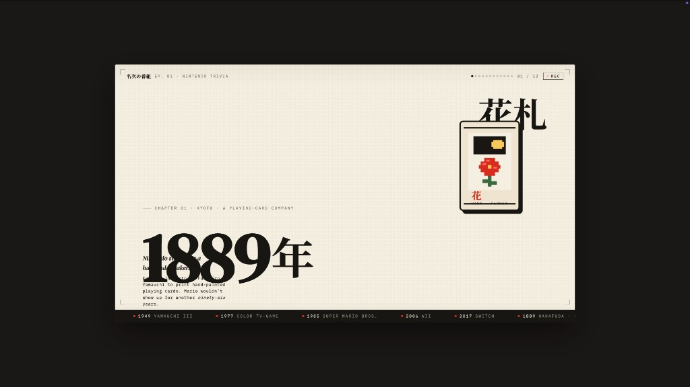</a><br/>
<sub><b><a href="skills/sprite-animation/"><code>sprite-animation</code></a></b> · <i>prototype</i><br/>Пиксельный / 8-bit анимированный explainer slide — full-bleed кремовая сцена, анимированный pixel mascot, кинетическая японская display-типографика, зацикленные CSS keyframes.</sub>
</td>
</tr>
</table>

### Поверхности для дизайна и маркетинга (режим prototype)

| Skill | Платформа | Сценарий | Что создаёт |
|---|---|---|---|
| [`web-prototype`](skills/web-prototype/) | desktop | design | Одностраничный HTML — landing pages, marketing, hero pages (по умолчанию для prototype) |
| [`saas-landing`](skills/saas-landing/) | desktop | marketing | Маркетинговая раскладка: hero / features / pricing / CTA |
| [`dashboard`](skills/dashboard/) | desktop | operation | Admin / analytics с боковой панелью и плотной сеткой данных |
| [`pricing-page`](skills/pricing-page/) | desktop | sale | Самостоятельная pricing page и сравнительные таблицы |
| [`docs-page`](skills/docs-page/) | desktop | engineering | Трёхколоночная документационная раскладка |
| [`blog-post`](skills/blog-post/) | desktop | marketing | Длинный editorial material |
| [`mobile-app`](skills/mobile-app/) | mobile | design | Экран(ы) приложения во фреймах iPhone 15 Pro / Pixel |
| [`mobile-onboarding`](skills/mobile-onboarding/) | mobile | design | Многоэкранный mobile onboarding flow (splash · value-prop · sign-in) |
| [`gamified-app`](skills/gamified-app/) | mobile | personal | Трёхкадровый gamified mobile-app prototype |
| [`email-marketing`](skills/email-marketing/) | desktop | marketing | Брендовое HTML-письмо для product launch (безопасно для table fallback) |
| [`social-carousel`](skills/social-carousel/) | desktop | marketing | Карусель из 3 карточек 1080×1080 |
| [`magazine-poster`](skills/magazine-poster/) | desktop | marketing | Одностраничный постер в журнальном стиле |
| [`motion-frames`](skills/motion-frames/) | desktop | marketing | Motion-design hero с циклическими CSS-анимациями |
| [`sprite-animation`](skills/sprite-animation/) | desktop | marketing | Пиксельный / 8-bit анимированный explainer slide |
| [`dating-web`](skills/dating-web/) | desktop | personal | Макет пользовательского dashboard для знакомств |
| [`digital-eguide`](skills/digital-eguide/) | desktop | marketing | Двухразворотный digital e-guide (обложка + lesson spread) |
| [`wireframe-sketch`](skills/wireframe-sketch/) | desktop | design | Ручной ideation sketch — для раннего «показать что-то видимое» |
| [`critique`](skills/critique/) | desktop | design | Пятимерный лист самокритики (Philosophy · Hierarchy · Detail · Function · Innovation) |
| [`tweaks`](skills/tweaks/) | desktop | design | Tweaks-панель, сгенерированная ИИ — модель выводит параметры, которые имеет смысл подкрутить |

### Поверхности для deck’ов (режим deck)

| Skill | Значение по умолчанию | Что создаёт |
|---|---|---|
| [`guizang-ppt`](skills/guizang-ppt/) | **по умолчанию** для deck | Журнальный web PPT — встроен дословно из [op7418/guizang-ppt-skill][guizang], с сохранением исходной LICENSE |
| [`simple-deck`](skills/simple-deck/) | — | Минималистичный горизонтально пролистываемый deck |
| [`replit-deck`](skills/replit-deck/) | — | Product-walkthrough deck в стиле Replit |
| [`weekly-update`](skills/weekly-update/) | — | Еженедельный командный цикл в формате swipe deck (progress · blockers · next) |

### Поверхности для офиса и операций (режим prototype, документные сценарии)

| Skill | Сценарий | Что создаёт |
|---|---|---|
| [`pm-spec`](skills/pm-spec/) | product | Документ спецификации PM с оглавлением и decision log |
| [`team-okrs`](skills/team-okrs/) | product | Таблицу оценки OKR |
| [`meeting-notes`](skills/meeting-notes/) | operation | Журнал решений по встрече |
| [`kanban-board`](skills/kanban-board/) | operation | Снимок доски |
| [`eng-runbook`](skills/eng-runbook/) | engineering | Incident runbook |
| [`finance-report`](skills/finance-report/) | finance | Финансовое summary для руководства |
| [`invoice`](skills/invoice/) | finance | Одностраничный счёт |
| [`hr-onboarding`](skills/hr-onboarding/) | hr | План онбординга по роли |

Добавление skill — это одна папка. Изучите [`docs/skills-protocol.md`](docs/skills-protocol.md), чтобы разобраться в расширенном frontmatter, форкните существующий skill, перезапустите демон — и он появится в picker. Каталог доступен по `GET /api/skills`; сборка seed-материалов для конкретного skill (template + side-file references) реализована в `GET /api/skills/:id/example`.

## Шесть несущих идей

### 1 · Мы не поставляем своего агента. Ваш уже достаточно хорош.

На старте демон сканирует `PATH` в поисках [`claude`](https://docs.anthropic.com/en/docs/claude-code), [`codex`](https://github.com/openai/codex), `devin`, [`cursor-agent`](https://www.cursor.com/cli), [`gemini`](https://github.com/google-gemini/gemini-cli), [`opencode`](https://opencode.ai/), [`qwen`](https://github.com/QwenLM/qwen-code), `qodercli`, [`copilot`](https://github.com/features/copilot/cli), `hermes`, `kimi`, [`pi`](https://github.com/badlogic/pi-mono/tree/main/packages/coding-agent), [`kiro-cli`](https://kiro.dev) и [`vibe-acp`](https://github.com/mistralai/mistral-vibe). Всё найденное становится кандидатами на роль design engine — каждый работает через свой stdio-adapter и может переключаться из picker’а модели. CLI не установлен? `POST /api/proxy/stream` даёт тот же pipeline, только без spawn: вставьте любой OpenAI-compatible `baseUrl` + `apiKey`, и демон будет форвардить SSE chunks назад, при этом loopback / link-local / RFC1918 назначения отсекаются на границе.

### 2 · Skills — это файлы, а не плагины.

Следуя [`SKILL.md` convention](https://docs.anthropic.com/en/docs/claude-code/skills) из Claude Code, каждый skill — это `SKILL.md` + `assets/` + `references/`. Достаточно положить папку в [`skills/`](skills/), перезапустить демон — и skill появится в picker’е. Встроенный `magazine-web-ppt` — это [`op7418/guizang-ppt-skill`](https://github.com/op7418/guizang-ppt-skill), добавленный дословно, с сохранением исходной лицензии и атрибуции.

### 3 · Design Systems — это переносимый Markdown, а не theme JSON.

Схема `DESIGN.md` из девяти разделов от [`VoltAgent/awesome-design-md`][acd2] — цвет, типографика, отступы, компоновка, компоненты, motion, voice, brand, anti-patterns. Каждый артефакт читает активную систему. Сменили систему — следующий рендер берёт новые токены. В выпадающем списке уже есть **Linear, Stripe, Vercel, Airbnb, Tesla, Notion, Apple, Anthropic, Cursor, Supabase, Figma, Resend, Raycast, Lovable, Cohere, Mistral, ElevenLabs, X.AI, Spotify, Webflow, Sanity, PostHog, Sentry, MongoDB, ClickHouse, Cal, Replicate, Clay, Composio, Xiaohongshu…** — плюс 57 design skills из [`awesome-design-skills`][ads].

### 4 · Интерактивная форма вопросов убирает 80% редиректов.

В prompt stack OD жёстко зашито `RULE 1`: каждый новый дизайн-бриф начинается с `<question-form id="discovery">`, а не с кода. Surface · audience · tone · brand context · scale · constraints. Даже длинный бриф оставляет массу открытых решений — визуальный тон, цветовую позицию, масштаб — и как раз их форма фиксирует за 30 секунд.

Это и есть **режим Junior-Designer**, distilled из [`huashu-design`](https://github.com/alchaincyf/huashu-design): задаём вопросы upfront, быстро показываем что-то видимое (хотя бы wireframe с серыми блоками), даём пользователю дёшево скорректировать курс. В сочетании с brand-asset protocol (locate · download · `grep` hex · write `brand-spec.md` · vocalise) это, пожалуй, главный фактор, из-за которого output перестаёт быть AI freestyle и начинает ощущаться как работа внимательного дизайнера.

### 5 · Демон делает так, будто агент работает прямо на вашем ноутбуке, потому что так и есть.

Демон запускает CLI с `cwd`, указывающим на artifact-папку проекта внутри `.od/projects/<id>/`. Агент получает `Read`, `Write`, `Bash`, `WebFetch` — реальные инструменты поверх реальной файловой системы. Он может читать `assets/template.html` конкретного skill, делать `grep` по CSS ради hex-цветов, записывать `brand-spec.md`, складывать туда сгенерированные изображения и выпускать `.pptx` / `.zip` / `.pdf`, которые затем появляются в файловом workspace как chips для скачивания. Sessions, conversations, messages и tabs живут в local SQLite DB — откройте проект завтра, и todo card агента будет лежать там же, где вы её оставили.

### 6 · Prompt stack — это и есть продукт.

То, что композируется в момент отправки, — это не просто «system + user». Это:

```
DISCOVERY directives  (turn-1 form, turn-2 brand branch, TodoWrite, 5-dim critique)
  + identity charter   (OFFICIAL_DESIGNER_PROMPT, anti-AI-slop, junior-pass)
  + active DESIGN.md   (72 systems available)
  + active SKILL.md    (31 skills available)
  + project metadata   (kind, fidelity, speakerNotes, animations, inspiration ids)
  + skill side files   (auto-injected pre-flight: read assets/template.html + references/*.md)
  + (deck kind, no skill seed) DECK_FRAMEWORK_DIRECTIVE   (nav / counter / scroll / print)
```

Каждый слой компонуем. Каждый слой — это файл, который можно редактировать. Откройте [`apps/daemon/src/prompts/system.ts`](apps/daemon/src/prompts/system.ts) и [`apps/daemon/src/prompts/discovery.ts`](apps/daemon/src/prompts/discovery.ts), чтобы увидеть реальный контракт.

## Архитектура

```
┌────────────────────── browser (Next.js 16) ──────────────────────┐
│  chat · file workspace · iframe preview · settings · imports     │
└──────────────┬───────────────────────────────────┬───────────────┘
               │ /api/* (rewritten in dev)          │
               ▼                                    ▼
   ┌──────────────────────────────────┐   /api/proxy/stream (SSE)
   │  Local daemon (Express + SQLite) │   ─→ any OpenAI-compat
   │                                  │       endpoint (BYOK)
   │  /api/agents          /api/skills│       w/ SSRF blocking
   │  /api/design-systems  /api/projects/…
   │  /api/chat (SSE)      /api/proxy/stream (SSE)
   │  /api/templates       /api/import/claude-design
   │  /api/artifacts/save  /api/artifacts/lint
   │  /api/upload          /api/projects/:id/files…
   │  /artifacts (static)  /frames (static)
   │
   │  optional: sidecar IPC at /tmp/open-design/ipc/<ns>/<app>.sock
   │  (STATUS · EVAL · SCREENSHOT · CONSOLE · CLICK · SHUTDOWN)
   └─────────┬────────────────────────┘
             │ spawn(cli, [...], { cwd: .od/projects/<id> })
             ▼
   ┌──────────────────────────────────────────────────────────────────┐
   │  claude · codex · devin (ACP) · gemini · opencode · cursor-agent │
   │  qwen · qoder · copilot · hermes (ACP) · kimi (ACP) · pi (RPC) · kiro (ACP) · vibe (ACP)     │
   │  reads SKILL.md + DESIGN.md, writes artifacts to disk            │
   └──────────────────────────────────────────────────────────────────┘
```

| Слой | Стек |
|---|---|
| Frontend | Next.js 16 App Router + React 18 + TypeScript, готово к деплою на Vercel |
| Daemon | Node 24 · Express · SSE streaming · `better-sqlite3`; таблицы: `projects` · `conversations` · `messages` · `tabs` · `templates` |
| Agent transport | `child_process.spawn`; typed-event parsers для `claude-stream-json` (Claude Code), `qoder-stream-json` (Qoder CLI), `copilot-stream-json` (Copilot), `json-event-stream`-парсеры на каждый CLI (Codex / Gemini / OpenCode / Cursor Agent), `acp-json-rpc` (Devin / Hermes / Kimi / Kiro / Kilo / Mistral Vibe через Agent Client Protocol), `pi-rpc` (Pi через stdio JSON-RPC), `plain` (Qwen Code / DeepSeek TUI) |
| BYOK proxy | `POST /api/proxy/stream` → OpenAI-compatible `/v1/chat/completions`, SSE pass-through; отвергает loopback / link-local / RFC1918 hosts на границе демона |
| Storage | Обычные файлы в `.od/projects/<id>/` + SQLite в `.od/app.sqlite` (в `.gitignore`, создаётся автоматически). Для изоляции тестов можно переопределить корень через `OD_DATA_DIR` |
| Preview | Sandboxed iframe через `srcdoc` + parser `<artifact>` для каждого skill ([`apps/web/src/artifacts/parser.ts`](apps/web/src/artifacts/parser.ts)) |
| Export | HTML (с inline assets) · PDF (browser print, aware of deck mode) · PPTX (через skill и агента) · ZIP (archiver) · Markdown |
| Lifecycle | `pnpm tools-dev start \| stop \| run \| status \| logs \| inspect \| check`; порты задаются через `--daemon-port` / `--web-port`, namespaces — через `--namespace` |
| Desktop (optional) | Electron shell — узнаёт web URL через sidecar IPC, без угадывания портов; тот же канал `STATUS`/`EVAL`/`SCREENSHOT`/`CONSOLE`/`CLICK`/`SHUTDOWN` используется `tools-dev inspect desktop …` для E2E |

## Быстрый старт

### Скачать desktop-приложение (без сборки)

Самый быстрый способ попробовать Open Design — готовое desktop-приложение, без Node, pnpm и клонирования:

- **[open-design.ai](https://open-design.ai/)** — официальная страница загрузки
- **[GitHub-релизы](https://github.com/nexu-io/open-design/releases)**

### Запуск из исходников

```bash
git clone https://github.com/nexu-io/open-design.git
cd open-design
corepack enable
corepack pnpm --version   # должно вывести 10.33.2
pnpm install
pnpm tools-dev run web
# откройте web URL, который напечатает tools-dev
```

Требования к окружению: Node `~24` и pnpm `10.33.x`. `nvm`/`fnm` — только вспомогательные инструменты; если вы ими пользуетесь, выполните `nvm install 24 && nvm use 24` или `fnm install 24 && fnm use 24` перед `pnpm install`.

Пользователи Windows могут воспользоваться [`docs/windows-troubleshooting.md`](docs/windows-troubleshooting.md), где описаны нативный путь установки и небольшой лаунчер для запуска по двойному клику.

Для desktop/background startup, перезапуска на фиксированных портах и проверки dispatcher’а media generation (`OD_BIN`, `OD_DAEMON_URL`, `apps/daemon/dist/cli.js`) смотрите [`QUICKSTART.md`](QUICKSTART.md).

При первой загрузке:

1. Определяется, какие agent CLI доступны в `PATH`, и один из них выбирается автоматически.
2. Загружаются 31 skill + 72 design systems.
3. Появляется welcome dialog, куда можно вставить ключ Anthropic (он нужен только для fallback-пути BYOK).
4. **Автоматически создаётся `./.od/`** — локальная runtime-папка для SQLite-базы проектов, артефактов по проектам и сохранённых рендеров. Шаг `od init` не нужен: демон сам делает `mkdir` всего необходимого при запуске.

Введите промпт, нажмите **Send**, дождитесь формы вопросов, заполните её, наблюдайте за стримом todo card и рендером артефакта. Нажмите **Save to disk** или скачайте проект как ZIP.

### Состояние первого запуска (`./.od/`)

Демон владеет одной скрытой папкой в корне репозитория. Всё внутри неё игнорируется git’ом и привязано к вашей машине — коммитить это не нужно.

```
.od/
├── app.sqlite                 ← projects · conversations · messages · open tabs
├── artifacts/                 ← одноразовые рендеры “Save to disk” (с метками времени)
└── projects/<id>/             ← рабочая директория проекта, она же cwd агента
```

| Хотите… | Сделайте так |
|---|---|
| Посмотреть содержимое | `ls -la .od && sqlite3 .od/app.sqlite '.tables'` |
| Сбросить всё к чистому состоянию | `pnpm tools-dev stop`, `rm -rf .od`, затем снова `pnpm tools-dev run web` |
| Перенести папку в другое место | пока не поддерживается — путь жёстко привязан к репозиторию |

Полная карта файлов, скрипты и troubleshooting → [`QUICKSTART.md`](QUICKSTART.md).

## Структура репозитория

```text
open-design/
├── README.md                      ← этот файл
├── README.de.md                   ← Deutsch
├── README.ru.md                   ← Русский
├── README.zh-CN.md                ← 简体中文
├── QUICKSTART.md                  ← руководство по запуску / сборке / деплою
├── package.json                   ← pnpm workspace, единственный bin: od
│
├── apps/
│   ├── daemon/                    ← Node + Express, единственный сервер
│   │   ├── src/                   ← исходники демона на TypeScript
│   │   │   ├── cli.ts             ← исходник bin `od`, компилируется в dist/cli.js
│   │   │   ├── server.ts          ← маршруты /api/* (projects, chat, files, exports)
│   │   │   ├── agents.ts          ← PATH scanner + builders argv для каждого CLI
│   │   │   ├── claude-stream.ts   ← streaming JSON parser для stdout Claude Code
│   │   │   ├── skills.ts          ← loader frontmatter из SKILL.md
│   │   │   └── db.ts              ← схема SQLite (projects/messages/templates/tabs)
│   │   ├── sidecar/               ← sidecar wrapper демона для tools-dev
│   │   └── tests/                 ← package tests демона
│   │
│   └── web/                       ← Next.js 16 App Router + React client
│       ├── app/                   ← entrypoints App Router
│       ├── next.config.ts         ← dev rewrites + prod static export в out/
│       └── src/                   ← client modules React + TypeScript
│           ├── App.tsx            ← routing, bootstrap, settings
│           ├── components/        ← chat, composer, picker, preview, sketch, …
│           ├── prompts/
│           │   ├── system.ts      ← composeSystemPrompt(base, skill, DS, metadata)
│           │   ├── discovery.ts   ← форма первого хода + ветка второго + 5-мерная критика
│           │   └── directions.ts  ← 5 visual directions × OKLch palette + font stack
│           ├── artifacts/         ← streaming parser для <artifact> + manifests
│           ├── runtime/           ← iframe srcdoc, markdown, export helpers
│           ├── providers/         ← daemon SSE + BYOK API transports
│           └── state/             ← config + projects (localStorage + daemon-backed)
│
├── e2e/                           ← Playwright UI + external integration/Vitest harness
│
├── packages/
│   ├── contracts/                 ← общие контракты web/daemon
│   ├── sidecar-proto/             ← протокол sidecar Open Design
│   ├── sidecar/                   ← базовые runtime-примитивы sidecar
│   └── platform/                  ← общие process/platform primitives
│
├── skills/                        ← 31 bundle-навык SKILL.md (27 prototype + 4 deck)
│   ├── web-prototype/             ← значение по умолчанию для prototype mode
│   ├── saas-landing/  dashboard/  pricing-page/  docs-page/  blog-post/
│   ├── mobile-app/  mobile-onboarding/  gamified-app/
│   ├── email-marketing/  social-carousel/  magazine-poster/
│   ├── motion-frames/  sprite-animation/  digital-eguide/  dating-web/
│   ├── critique/  tweaks/  wireframe-sketch/
│   ├── pm-spec/  team-okrs/  meeting-notes/  kanban-board/
│   ├── eng-runbook/  finance-report/  invoice/  hr-onboarding/
│   ├── simple-deck/  replit-deck/  weekly-update/   ← режим deck
│   └── guizang-ppt/               ← bundled magazine-web-ppt (по умолчанию для deck)
│       ├── SKILL.md
│       ├── assets/template.html   ← seed
│       └── references/{themes,layouts,components,checklist}.md
│
├── design-systems/                ← 72 системы DESIGN.md
│   ├── default/                   ← Neutral Modern (starter)
│   ├── warm-editorial/            ← Warm Editorial (starter)
│   ├── linear-app/  vercel/  stripe/  airbnb/  notion/  cursor/  apple/  …
│   └── README.md                  ← обзор каталога
│
├── assets/
│   └── frames/                    ← общие device frames (используются разными skills)
│       ├── iphone-15-pro.html
│       ├── android-pixel.html
│       ├── ipad-pro.html
│       ├── macbook.html
│       └── browser-chrome.html
│
├── templates/
│   ├── deck-framework.html        ← базовая основа deck (nav / counter / print)
│   └── kami-deck.html             ← starter deck в духе kami (пергамент / ink-blue serif)
│
├── scripts/
│   └── sync-design-systems.ts     ← повторный импорт upstream tarball из awesome-design-md
│
├── docs/
│   ├── spec.md                    ← спецификация продукта, сценарии, дифференциация
│   ├── architecture.md            ← топологии, поток данных, компоненты
│   ├── skills-protocol.md         ← расширенный od:-frontmatter для SKILL.md
│   ├── agent-adapters.md          ← detection + dispatch по каждому CLI
│   ├── modes.md                   ← prototype / deck / template / design-system
│   ├── references.md              ← развёрнутая provenance-документация
│   ├── roadmap.md                 ← поэтапная поставка
│   ├── schemas/                   ← JSON schemas
│   └── examples/                  ← канонические примеры артефактов
│
└── .od/                           ← runtime-данные, в .gitignore, создаётся автоматически
    ├── app.sqlite                 ← projects / conversations / messages / tabs
    ├── projects/<id>/             ← рабочая папка проекта (cwd агента)
    └── artifacts/                 ← сохранённые одноразовые рендеры
```

## Системы дизайна

<p align="center">
  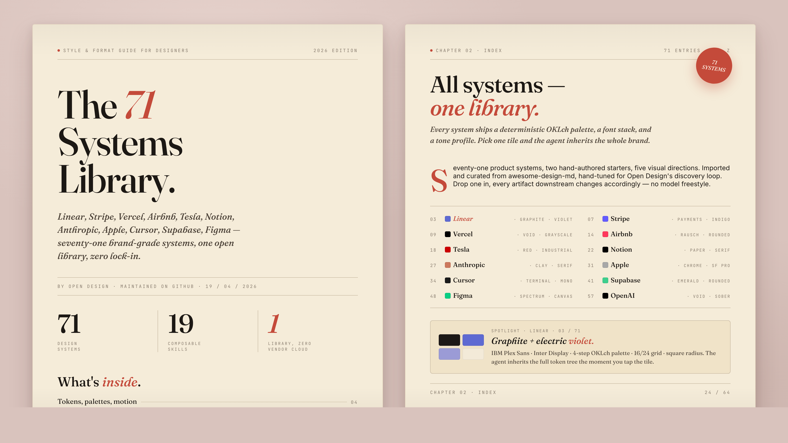
</p>

72 системы из коробки, каждая — один файл [`DESIGN.md`](design-systems/README.md):

<details>
<summary><b>Полный каталог</b> (нажмите, чтобы развернуть)</summary>

**AI & LLM** — `claude` · `cohere` · `mistral-ai` · `minimax` · `together-ai` · `replicate` · `runwayml` · `elevenlabs` · `ollama` · `x-ai`

**Developer Tools** — `cursor` · `vercel` · `linear-app` · `framer` · `expo` · `clickhouse` · `mongodb` · `supabase` · `hashicorp` · `posthog` · `sentry` · `warp` · `webflow` · `sanity` · `mintlify` · `lovable` · `composio` · `opencode-ai` · `voltagent`

**Productivity** — `notion` · `figma` · `miro` · `airtable` · `superhuman` · `intercom` · `zapier` · `cal` · `clay` · `raycast`

**Fintech** — `stripe` · `coinbase` · `binance` · `kraken` · `mastercard` · `revolut` · `wise`

**E-Commerce** — `shopify` · `airbnb` · `uber` · `nike` · `starbucks` · `pinterest`

**Media** — `spotify` · `playstation` · `wired` · `theverge` · `meta`

**Automotive** — `tesla` · `bmw` · `ferrari` · `lamborghini` · `bugatti` · `renault`

**Other** — `apple` · `ibm` · `nvidia` · `vodafone` · `sentry` · `resend` · `spacex`

**Starters** — `default` (Neutral Modern) · `warm-editorial`

</details>

Библиотека product systems импортируется через [`scripts/sync-design-systems.ts`](scripts/sync-design-systems.ts) из [`VoltAgent/awesome-design-md`][acd2]. Чтобы обновить её, достаточно заново запустить импорт. 57 design skills берутся из [`bergside/awesome-design-skills`][ads] и добавляются напрямую в `design-systems/`.

## Визуальные направления

Когда у пользователя нет brand spec, агент выводит вторую форму с пятью curated directions — это адаптация fallback-модели [`huashu-design` с «5 schools × 20 design philosophies»](https://github.com/alchaincyf/huashu-design#%E8%AE%BE%E8%AE%A1%E6%96%B9%E5%90%91%E9%A1%BE%E9%97%AE-fallback). Каждое направление — детерминированная спецификация: палитра в OKLch, стек шрифтов, поведенческие подсказки по layout posture и референсы. Агент подставляет всё это дословно в `:root` seed-шаблона. Один radio click → полностью определённая визуальная система. Без импровизации, без AI-slop.

| Direction | Настроение | Референсы |
|---|---|---|
| Editorial — Monocle / FT | Печатный журнал, чернила + крем + тёплая ржавчина | Monocle · FT Weekend · NYT Magazine |
| Modern minimal — Linear / Vercel | Холодный, структурный, с минимальным акцентом | Linear · Vercel · Stripe |
| Tech utility | Информационная плотность, моноширинность, терминальность | Bloomberg · Bauhaus tools |
| Brutalist | Сырой, с крупной типографикой, без теней, с жёсткими акцентами | Bloomberg Businessweek · Achtung |
| Soft warm | Просторный, низкоконтрастный, в персиково-нейтральной гамме | Notion marketing · Apple Health |

Полная спецификация → [`apps/daemon/src/prompts/directions.ts`](apps/daemon/src/prompts/directions.ts).

## Генерация медиа

OD не заканчивается на коде. Тот же чатовый surface, который производит HTML-артефакты через `<artifact>`, умеет запускать и **image**, и **video**, и **audio** generation — через media pipeline демона ([`apps/daemon/src/media-models.ts`](apps/daemon/src/media-models.ts), [`apps/web/src/media/models.ts`](apps/web/src/media/models.ts)). Каждый результат сохраняется как реальный файл в project workspace — `.png` для image, `.mp4` для video — и в конце хода появляется как downloadable chip.

Сегодня основную нагрузку несут три семейства моделей:

| Surface | Model | Provider | Для чего используется |
|---|---|---|---|
| **Image** | `gpt-image-2` | Azure / OpenAI | Постеры, profile avatars, illustrated maps, infographics, magazine-style social cards, photo restoration, exploded-view product art |
| **Video** | `seedance-2.0` | ByteDance Volcengine | 15s cinematic t2v + i2v со звуком — narrative shorts, character close-ups, product films, MV-style choreography |
| **Video** | `hyperframes-html` | [HeyGen / OSS](https://github.com/heygen-com/hyperframes) | HTML→MP4 motion graphics — product reveals, kinetic typography, charts, social overlays, logo outros, TikTok-style verticals с karaoke captions |

Растущая **галерея промптов** в [`prompt-templates/`](prompt-templates/) поставляется с **93 ready-to-replicate prompts** — 43 image (`prompt-templates/image/*.json`), 39 Seedance (`prompt-templates/video/*.json`, кроме `hyperframes-*`) и 11 HyperFrames (`prompt-templates/video/hyperframes-*.json`). Каждый объект включает preview thumbnail, полный текст prompt body, целевую модель, aspect ratio и блок `source` с лицензией и атрибуцией. Демон отдаёт всё это по `GET /api/prompt-templates`, а web app показывает их карточками во вкладках **Image templates** и **Video templates** на entry view; один клик переносит prompt в composer с уже выбранной нужной моделью.

### gpt-image-2 — галерея изображений (пример из 43)

<table>
<tr>
<td width="20%" valign="top"><br/><sub><b>3D Stone Staircase Evolution Infographic</b><br/>трёхшаговая инфографика в эстетике высеченного камня</sub></td>
<td width="20%" valign="top"><br/><sub><b>Illustrated City Food Map</b><br/>editorial-постер о путешествии с ручной иллюстрацией</sub></td>
<td width="20%" valign="top"><br/><sub><b>Cinematic Elevator Scene</b><br/>однокадровый editorial fashion still</sub></td>
<td width="20%" valign="top"><br/><sub><b>Cyberpunk Anime Portrait</b><br/>profile avatar — неоновый текст по лицу</sub></td>
<td width="20%" valign="top"><br/><sub><b>Glamorous Woman in Black Portrait</b><br/>editorial studio portrait</sub></td>
</tr>
</table>

Полный набор → [`prompt-templates/image/`](prompt-templates/image/). Источник большинства примеров — [`YouMind-OpenLab/awesome-gpt-image-prompts`](https://github.com/YouMind-OpenLab/awesome-gpt-image-prompts) (CC-BY-4.0), с сохранённой атрибуцией авторов для каждого template.

### Seedance 2.0 — галерея видео (пример из 39)

<table>
<tr>
<td width="20%" valign="top"><a href="https://customer-qs6wnyfuv0gcybzj.cloudflarestream.com/c4515f4f328539e1ded2cc32f4ce63e7/downloads/default.mp4"></a><br/><sub><b>Music Podcast & Guitar Technique</b><br/>кинематографичный студийный фильм в 4K</sub></td>
<td width="20%" valign="top"><a href="https://customer-qs6wnyfuv0gcybzj.cloudflarestream.com/4a47ba646e7cedd79363c861864b8714/downloads/default.mp4"></a><br/><sub><b>Emotional Face Close-up</b><br/>исследование микроэмоций в киноязыке</sub></td>
<td width="20%" valign="top"><a href="https://customer-qs6wnyfuv0gcybzj.cloudflarestream.com/7e8983364a95fe333f0f88bd1085a0e8/downloads/default.mp4"></a><br/><sub><b>Luxury Supercar Cinematic</b><br/>нарративный product film</sub></td>
<td width="20%" valign="top"><a href="https://customer-qs6wnyfuv0gcybzj.cloudflarestream.com/0279a674ce138ab5a0a6f020a7273d89/downloads/default.mp4"></a><br/><sub><b>Forbidden City Cat Satire</b><br/>стилизованный сатирический short</sub></td>
<td width="20%" valign="top"><a href="https://github.com/YouMind-OpenLab/awesome-seedance-2-prompts/releases/download/videos/1402.mp4"></a><br/><sub><b>Japanese Romance Short Film</b><br/>15-секундный narrative clip на Seedance 2.0</sub></td>
</tr>
</table>

Нажмите на любой thumbnail, чтобы воспроизвести реальный сгенерированный MP4. Полный набор → [`prompt-templates/video/`](prompt-templates/video/) (entries с `*-seedance-*` и меткой Cinematic). Источники: [`YouMind-OpenLab/awesome-seedance-2-prompts`](https://github.com/YouMind-OpenLab/awesome-seedance-2-prompts) (CC-BY-4.0), с сохранёнными оригинальными ссылками на твиты и author handles.

### HyperFrames — HTML→MP4 motion graphics (11 готовых шаблонов)

[**`heygen-com/hyperframes`**](https://github.com/heygen-com/hyperframes) — это open-source, agent-native video framework от HeyGen: вы (или агент) пишете HTML + CSS + GSAP, а HyperFrames рендерит всё в детерминированный MP4 через headless Chrome + FFmpeg. Open Design поставляет HyperFrames как first-class video model (`hyperframes-html`) в dispatch-пайплайне демона, плюс skill `skills/hyperframes/`, объясняющий агенту контракт таймлайна, правила переходов между сценами, audio-reactive patterns, captions/TTS и catalog blocks (`npx hyperframes add <slug>`).

Одиннадцать hyperframes-промптов лежат в [`prompt-templates/video/hyperframes-*.json`](prompt-templates/video/), и каждый из них описывает конкретный archetype:

<table>
<tr>
<td width="25%" valign="top"><a href="prompt-templates/video/hyperframes-product-reveal-minimal.json"></a><br/><sub><b>5s minimal product reveal</b> · 16:9 · push-in title card with shader transition</sub></td>
<td width="25%" valign="top"><a href="prompt-templates/video/hyperframes-saas-product-promo-30s.json"></a><br/><sub><b>30s SaaS product promo</b> · 16:9 · в стиле Linear/ClickUp с UI 3D reveal</sub></td>
<td width="25%" valign="top"><a href="prompt-templates/video/hyperframes-tiktok-karaoke-talking-head.json"></a><br/><sub><b>TikTok karaoke talking-head</b> · 9:16 · TTS + captions, синхронизированные по словам</sub></td>
<td width="25%" valign="top"><a href="prompt-templates/video/hyperframes-brand-sizzle-reel.json"></a><br/><sub><b>30s brand sizzle reel</b> · 16:9 · beat-synced kinetic typography, audio-reactive</sub></td>
</tr>
<tr>
<td width="25%" valign="top"><a href="prompt-templates/video/hyperframes-data-bar-chart-race.json"></a><br/><sub><b>Animated bar-chart race</b> · 16:9 · data-infographic в духе NYT</sub></td>
<td width="25%" valign="top"><a href="prompt-templates/video/hyperframes-flight-map-route.json"></a><br/><sub><b>Flight map (origin → dest)</b> · 16:9 · кинематографичный route reveal в духе Apple</sub></td>
<td width="25%" valign="top"><a href="prompt-templates/video/hyperframes-logo-outro-cinematic.json"></a><br/><sub><b>4s cinematic logo outro</b> · 16:9 · сборка по частям + bloom</sub></td>
<td width="25%" valign="top"><a href="prompt-templates/video/hyperframes-money-counter-hype.json"></a><br/><sub><b>$0 → $10K money counter</b> · 9:16 · Apple-style hype с зелёной вспышкой и burst</sub></td>
</tr>
<tr>
<td width="25%" valign="top"><a href="prompt-templates/video/hyperframes-app-showcase-three-phones.json"></a><br/><sub><b>3-phone app showcase</b> · 16:9 · парящие телефоны с callout’ами по функциям</sub></td>
<td width="25%" valign="top"><a href="prompt-templates/video/hyperframes-social-overlay-stack.json"></a><br/><sub><b>Social overlay stack</b> · 9:16 · X · Reddit · Spotify · Instagram по очереди</sub></td>
<td width="25%" valign="top"><a href="prompt-templates/video/hyperframes-website-to-video-promo.json"></a><br/><sub><b>Website-to-video pipeline</b> · 16:9 · съёмка сайта в 3 viewport’ах + transitions</sub></td>
<td width="25%" valign="top">&nbsp;</td>
</tr>
</table>

Паттерн тот же, что и в остальных режимах: выберите template, отредактируйте brief, отправьте. Агент прочитает встроенный `skills/hyperframes/SKILL.md` (там описан OD-специфичный render workflow — composition source files складываются в `.hyperframes-cache/`, чтобы не засорять file workspace, демон запускает `npx hyperframes render`, обходя зависания macOS sandbox-exec / Puppeteer, и только финальный `.mp4` попадает в проект как chip), соберёт композицию и выпустит MP4. Thumbnails catalog blocks © HeyGen и отдаются с их CDN; сам OSS-framework лицензирован по Apache-2.0.

> **Уже подключено, но пока не вынесено в шаблоны:** Kling 2.0 / 1.6 / 1.5, Veo 3 / Veo 2, Sora 2 / Sora 2-Pro (через Fal), MiniMax video-01 — всё это уже живёт в `VIDEO_MODELS` ([`apps/web/src/media/models.ts`](apps/web/src/media/models.ts)). На стороне audio поддерживаются Suno v5 / v4.5, Udio v2, Lyria 2 (музыка) и gpt-4o-mini-tts, MiniMax TTS (речь). Шаблоны для них — открытая область для вкладов: добавьте JSON в `prompt-templates/video/` или `prompt-templates/audio/`, и он появится в picker’е.

## Не только чат — что ещё уже поставляется

Чатовый / артефактный цикл получает больше всего внимания, но в OD уже встроено ещё несколько менее заметных возможностей, о которых полезно знать до любых сравнений:

- **Импорт ZIP из Claude Design.** Перетащите экспорт из claude.ai в welcome dialog. `POST /api/import/claude-design` распакует его в реальный `.od/projects/<id>/`, откроет entry file как tab и подготовит prompt «продолжить с того места, где остановился Anthropic» для вашего локального агента. Никакого переформулирования, никакого «попросите модель восстановить то, что уже было». ([`apps/daemon/src/server.ts`](apps/daemon/src/server.ts) — маршрут `/api/import/claude-design`)
- **OpenAI-compatible BYOK proxy.** `POST /api/proxy/stream` принимает `{ baseUrl, apiKey, model, messages }`, нормализует путь до `…/v1/chat/completions`, форвардит SSE chunks обратно в браузер и отвергает loopback / link-local / RFC1918 адреса для защиты от SSRF. Подойдёт всё, что говорит на схеме OpenAI chat — Anthropic-via-OpenAI shim, DeepSeek, Groq, MiMo, OpenRouter, self-hosted vLLM. Для MiMo автоматически выставляется `tool_choice: 'none'`, потому что его схема tool-use плохо ведёт себя при free-form generation.
- **Шаблоны, сохранённые пользователем.** Когда вам нравится результат, `POST /api/templates` делает snapshot HTML и metadata в SQLite-таблицу `templates`. В следующем проекте он появляется в строке «your templates» внутри picker’а — в том же surface, что и встроенные 31 skill, только уже ваш.
- **Сохранение вкладок.** Каждый проект помнит открытые файлы и активную вкладку в таблице `tabs`. Откройте проект завтра — и workspace будет выглядеть ровно так, как вы его оставили.
- **Artifact lint API.** `POST /api/artifacts/lint` запускает структурные проверки над сгенерированным артефактом (сломанная рамка `<artifact>`, отсутствие обязательных side files, устаревшие palette tokens) и возвращает findings, которые агент может использовать в следующем ходе. Пятимерная самокритика использует этот API, чтобы опираться на реальные сигналы, а не на интуицию.
- **Sidecar protocol + desktop automation.** Процессы daemon, web и desktop получают типизированные пятикомпонентные stamps (`app · mode · namespace · ipc · source`) и открывают JSON-RPC IPC-канал по адресу `/tmp/open-design/ipc/<namespace>/<app>.sock`. `tools-dev inspect desktop status \| eval \| screenshot` управляет именно этим каналом, благодаря чему headless E2E работает поверх реальной Electron-shell, без особых harness’ов ([`packages/sidecar-proto/`](packages/sidecar-proto/), [`apps/desktop/src/main/`](apps/desktop/src/main/)).
- **Дружественный к Windows spawning.** Каждый адаптер, который иначе упёрся бы в лимит `CreateProcess` примерно в 32 KB по argv на длинных composition prompt’ах (Codex, Gemini, OpenCode, Cursor Agent, Qwen, Qoder CLI, Pi), вместо этого отправляет prompt через stdin. Claude Code и Copilot сохраняют `-p`; если даже этого мало, демон переходит на временный prompt-file.
- **Runtime data по namespace’ам.** `OD_DATA_DIR` и `--namespace` дают полностью изолированные деревья в духе `.od/`, так что Playwright, beta-каналы и ваши реальные проекты не делят одну SQLite-базу.

## Механика против AI-slop

Вся эта механика — прямое переложение методологии [`huashu-design`](https://github.com/alchaincyf/huashu-design) в prompt stack OD с enforce’ом через side-file pre-flight. Текущие формулировки можно посмотреть в [`apps/daemon/src/prompts/discovery.ts`](apps/daemon/src/prompts/discovery.ts):

- **Сначала question form.** Ход 1 — только `<question-form>`, без размышлений, без tools, без narration. Пользователь выбирает дефолты со скоростью radio-click.
- **Извлечение brand spec.** Если пользователь прикладывает screenshot или URL, агент перед написанием CSS проходит пятишаговый протокол (locate · download · grep hex · codify `brand-spec.md` · vocalise). **Никогда не угадывает brand colors по памяти.**
- **Пятимерная критика.** Перед тем как выдать `<artifact>`, агент молча оценивает результат по шкале 1–5 по осям philosophy / hierarchy / execution / specificity / restraint. Всё, что ниже 3/5, считается регрессией — исправить и переоценить. Два прохода — норма.
- **Checklist P0/P1/P2.** Каждый skill поставляется с `references/checklist.md`, где есть жёсткие P0-гейты. До эмиссии артефакта агент обязан пройти P0.
- **Список запрещённого slop’а.** Агрессивные фиолетовые градиенты, generic emoji icons, rounded card с left-border accent, hand-drawn SVG-люди, Inter как *display*-шрифт, вымышленные метрики — всё это прямо запрещено в prompt’е.
- **Честные placeholders лучше фальшивых цифр.** Если у агента нет реального числа, он пишет `—` или подписанный серый блок, а не «10× faster».

## Сравнение

| Axis | [Claude Design][cd] (Anthropic) | [Open CoDesign][ocod] | **Open Design** |
|---|---|---|---|
| License | Closed | MIT | **Apache-2.0** |
| Form factor | Web (claude.ai) | Desktop (Electron) | **Web app + local daemon** |
| Deployable on Vercel | ❌ | ❌ | **✅** |
| Agent runtime | Bundled (Opus 4.7) | Bundled ([`pi-ai`][piai]) | **Delegated to user's existing CLI** |
| Skills | Proprietary | 12 custom TS modules + `SKILL.md` | **31 file-based [`SKILL.md`][skill] bundles, можно просто положить в папку** |
| Design system | Proprietary | `DESIGN.md` (v0.2 roadmap) | **`DESIGN.md` × 129 поставляемых систем** |
| Provider flexibility | Anthropic only | 7+ via [`pi-ai`][piai] | **16 CLI-адаптеров + OpenAI-compatible BYOK proxy** |
| Init question form | ❌ | ❌ | **✅ Жёсткое правило, ход 1** |
| Direction picker | ❌ | ❌ | **✅ 5 детерминированных направлений** |
| Live todo progress + tool stream | ❌ | ✅ | **✅** (UX-паттерн из open-codesign) |
| Sandboxed iframe preview | ❌ | ✅ | **✅** (паттерн из open-codesign) |
| Claude Design ZIP import | n/a | ❌ | **✅ `POST /api/import/claude-design` — продолжайте там, где остановился Anthropic** |
| Comment-mode surgical edits | ❌ | ✅ | 🟡 частично — comments по preview-элементам и chat attachments уже есть, но надёжность точечных правок ещё в работе |
| AI-emitted tweaks panel | ❌ | ✅ | 🚧 в roadmap — отдельная chat-side panel UX пока не реализована |
| Filesystem-grade workspace | ❌ | partial (Electron sandbox) | **✅ Реальный cwd, реальные tools, persisted SQLite (projects · conversations · messages · tabs · templates)** |
| 5-dim self-critique | ❌ | ❌ | **✅ Pre-emit gate** |
| Artifact lint | ❌ | ❌ | **✅ `POST /api/artifacts/lint` — findings возвращаются агенту** |
| Sidecar IPC + headless desktop | ❌ | ❌ | **✅ Stamped processes + `tools-dev inspect desktop status \| eval \| screenshot`** |
| Export formats | Limited | HTML / PDF / PPTX / ZIP / Markdown | **HTML / PDF / PPTX (через агента) / ZIP / Markdown** |
| PPT skill reuse | N/A | Built-in | **[`guizang-ppt-skill`][guizang] подключается как есть (по умолчанию для deck mode)** |
| Minimum billing | Pro / Max / Team | BYOK | **BYOK — вставьте любой OpenAI-compatible `baseUrl`** |

[cd]: https://x.com/claudeai/status/2045156267690213649
[ocod]: https://github.com/OpenCoworkAI/open-codesign
[piai]: https://github.com/badlogic/pi-mono/tree/main/packages/ai
[acd]: https://github.com/VoltAgent/awesome-claude-design
[guizang]: https://github.com/op7418/guizang-ppt-skill
[skill]: https://docs.anthropic.com/en/docs/claude-code/skills

## Поддерживаемые coding-agent CLI

Автоматически обнаруживаются в `PATH` при запуске демона. Никакой настройки не нужно. Streaming dispatch живёт в [`apps/daemon/src/agents.ts`](apps/daemon/src/agents.ts) (`AGENT_DEFS`), а парсеры для каждого CLI — рядом. Список моделей заполняется либо probing’ом через `<bin> --list-models` / `<bin> models` / ACP handshake, либо curated fallback-списком, если CLI не умеет сам сообщать модели.

| Agent | Bin | Stream format | Форма argv (путь для composed prompt) |
|---|---|---|---|
| [Claude Code](https://docs.anthropic.com/en/docs/claude-code) | `claude` | `claude-stream-json` (typed events) | `claude -p <prompt> --output-format stream-json --verbose [--include-partial-messages] [--add-dir …] --permission-mode bypassPermissions` |
| [Codex CLI](https://github.com/openai/codex) | `codex` | `json-event-stream` + parser `codex` | `codex exec --json --skip-git-repo-check --sandbox workspace-write -c sandbox_workspace_write.network_access=true [-C cwd] [--model …] [-c model_reasoning_effort=…]` (prompt через stdin) |
| Devin for Terminal | `devin` | `acp-json-rpc` | `devin --permission-mode dangerous --respect-workspace-trust false acp` |
| [Gemini CLI](https://github.com/google-gemini/gemini-cli) | `gemini` | `json-event-stream` + parser `gemini` | `gemini --output-format stream-json --skip-trust --yolo [--model …] -` (prompt через stdin) |
| [OpenCode](https://opencode.ai/) | `opencode` | `json-event-stream` + parser `opencode` | `opencode run --format json --dangerously-skip-permissions [--model …] -` (prompt через stdin) |
| [Cursor Agent](https://www.cursor.com/cli) | `cursor-agent` | `json-event-stream` + parser `cursor-agent` | `cursor-agent --print --output-format stream-json --stream-partial-output --force --trust [--workspace cwd] [--model …] -` (prompt через stdin) |
| [Qwen Code](https://github.com/QwenLM/qwen-code) | `qwen` | `plain` (сырые stdout chunks) | `qwen --yolo [--model …] -` (prompt через stdin) |
| Qoder CLI | `qodercli` | `qoder-stream-json` (типизированные события) | `qodercli -p --output-format stream-json --permission-mode bypass_permissions [--cwd cwd] [--model …] [--add-dir …]` (prompt через stdin) |
| [GitHub Copilot CLI](https://github.com/features/copilot/cli) | `copilot` | `copilot-stream-json` (typed events) | `copilot -p <prompt> --allow-all-tools --output-format json [--model …] [--add-dir …]` |
| [Hermes](https://github.com/eqlabs/hermes) | `hermes` | `acp-json-rpc` (Agent Client Protocol) | `hermes acp --accept-hooks` |
| Kimi CLI | `kimi` | `acp-json-rpc` | `kimi acp` |
| [Kiro CLI](https://kiro.dev) | `kiro-cli` | `acp-json-rpc` | `kiro-cli acp` |
| Kilo | `kilo` | `acp-json-rpc` | `kilo acp` |
| [Mistral Vibe CLI](https://github.com/mistralai/mistral-vibe) | `vibe-acp` | `acp-json-rpc` | `vibe-acp` |
| DeepSeek TUI | `deepseek` | `plain` (raw stdout chunks) | `deepseek exec --auto [--model …] <prompt>` |
| [Pi](https://github.com/badlogic/pi-mono/tree/main/packages/coding-agent) | `pi` | `pi-rpc` (stdio JSON-RPC) | `pi --mode rpc [--model …] [--thinking …]` (prompt отправляется как RPC-команда `prompt`) |
| **OpenAI-compatible BYOK** | n/a | SSE pass-through | `POST /api/proxy/stream` → `<baseUrl>/v1/chat/completions`; SSRF-защита от loopback / link-local / RFC1918 |

Добавить новый CLI — это одна запись в [`apps/daemon/src/agents.ts`](apps/daemon/src/agents.ts). Формат стрима выбирается из `claude-stream-json`, `qoder-stream-json`, `copilot-stream-json`, `json-event-stream` (с отдельным `eventParser` на CLI), `acp-json-rpc`, `pi-rpc` или `plain`.

## Источники и происхождение

Здесь собраны все внешние проекты, из которых этот репозиторий что-то заимствует. Каждая ссылка ведёт к источнику, чтобы provenance можно было проверить самостоятельно.

| Project | Роль в проекте |
|---|---|
| [`Claude Design`][cd] | Закрытый продукт, для которого этот репозиторий служит open-source альтернативой. |
| [**`alchaincyf/huashu-design`**](https://github.com/alchaincyf/huashu-design) | Ядро дизайн-философии. Junior-Designer workflow, 5-step protocol для brand assets, anti-AI-slop checklist, пятимерная самокритика и библиотека «5 schools × 20 design philosophies» для direction picker’а — всё это distilled в [`apps/daemon/src/prompts/discovery.ts`](apps/daemon/src/prompts/discovery.ts) и [`apps/daemon/src/prompts/directions.ts`](apps/daemon/src/prompts/directions.ts). |
| [**`op7418/guizang-ppt-skill`**][guizang] | Skill для magazine-web-PPT, встроенный без изменений в [`skills/guizang-ppt/`](skills/guizang-ppt/) с сохранением оригинальной LICENSE. Используется по умолчанию в режиме deck. Культура P0/P1/P2 checklist’ов позаимствована для всех остальных skills. |
| [**`multica-ai/multica`**](https://github.com/multica-ai/multica) | Архитектура демона и адаптеров. PATH-scan detection агентов, local daemon как единственный привилегированный процесс, worldview agent-as-teammate. Мы переняли модель, а не vendored code. |
| [**`OpenCoworkAI/open-codesign`**][ocod] | Первая open-source альтернатива Claude Design и наш ближайший peer. Заимствованные UX-паттерны: streaming-artifact loop, sandboxed iframe preview (vendored React 18 + Babel), live agent panel (todos + tool calls + interruptible), список из пяти экспортных форматов (HTML/PDF/PPTX/ZIP/Markdown), local-first storage hub, `SKILL.md`-внедрение вкуса и первая версия preview-аннотаций для comment mode. Всё ещё в roadmap: полная надёжность surgical edits и tweaks panel, генерируемая ИИ. **Мы намеренно не вендорим [`pi-ai`][piai]** — open-codesign включает его как runtime агента, а мы делегируем исполнение тому CLI, который уже установлен у пользователя. |
| [`VoltAgent/awesome-claude-design`][acd] / [`awesome-design-md`][acd2] | Источник схемы `DESIGN.md` из 9 разделов и 70 продуктовых систем, импортируемых через [`scripts/sync-design-systems.ts`](scripts/sync-design-systems.ts). |
| [`bergside/awesome-design-skills`][ads] | Источник 57 design skills, нормализованных как файлы `DESIGN.md` в `design-systems/`. |
| [`farion1231/cc-switch`](https://github.com/farion1231/cc-switch) | Вдохновение для symlink-based distribution навыков между разными agent CLI. |
| [Claude Code skills][skill] | Конвенция `SKILL.md`, заимствованная без изменений — любой Claude Code skill можно положить в `skills/`, и демон его подхватит. |

Подробный provenance-разбор — что именно мы берём и что принципиально не берём — лежит в [`docs/references.md`](docs/references.md).

## Дорожная карта

- [x] Daemon + detection агентов (13 CLI adapters) + registry skills + catalog design systems
- [x] Web app + chat + question form + picker из 5 направлений + todo progress + sandboxed preview
- [x] 31 skill + 72 design systems + 5 visual directions + 5 device frames
- [x] SQLite-backed projects · conversations · messages · tabs · templates
- [x] OpenAI-compatible BYOK proxy (`/api/proxy/stream`) с SSRF-защитой
- [x] Claude Design ZIP import (`/api/import/claude-design`)
- [x] Sidecar protocol + Electron desktop с IPC automation (STATUS / EVAL / SCREENSHOT / CONSOLE / CLICK / SHUTDOWN)
- [x] Artifact lint API + 5-dim self-critique pre-emit gate
- [ ] Comment-mode surgical edits — частично уже есть: comments по preview elements и chat attachments; надёжный targeted patching ещё в работе
- [ ] UX tweaks panel, которую создаёт ИИ — пока не реализована
- [ ] Рецепт деплоя на Vercel + через tunnel (Topology B)
- [ ] Однокомандный `npx od init`, создающий проект с `DESIGN.md`
- [ ] Marketplace навыков (`od skills install <github-repo>`) и CLI surface `od skill add | list | remove | test` (набросан в [`docs/skills-protocol.md`](docs/skills-protocol.md), реализация впереди)
- [x] Packaged Electron build на базе `apps/packaged/` — загрузки для macOS (Apple Silicon) и Windows (x64) на [open-design.ai](https://open-design.ai/) и [странице релизов GitHub](https://github.com/nexu-io/open-design/releases)

Поэтапная поставка → [`docs/roadmap.md`](docs/roadmap.md).

## Статус

Это ранняя реализация, но замкнутый цикл (detect → выбрать skill + design system → chat → parse `<artifact>` → preview → save) уже работает end-to-end. Основная ценность сосредоточена в prompt stack и библиотеке skills, и они уже достаточно стабильны. UI на уровне компонентов выкатывается практически ежедневно.

## Поставьте звезду

<p align="center">
  <a href="https://github.com/nexu-io/open-design">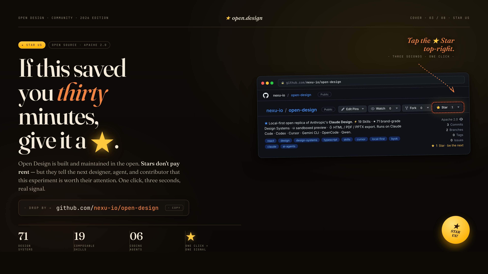</a>
</p>

Если OD сэкономил вам хотя бы тридцать минут — подарите ему ★. Звёзды не платят аренду, но показывают следующему дизайнеру, агенту и контрибьютору, что этот эксперимент заслуживает внимания. Один клик, три секунды, реальный сигнал: [github.com/nexu-io/open-design](https://github.com/nexu-io/open-design).

## Как участвовать

Issues, PR, новые skills и новые design systems приветствуются. Самые ценные вклады чаще всего — это одна папка, один Markdown-файл или один adapter-PR:

- **Добавить skill** — положите папку в [`skills/`](skills/) по конвенции [`SKILL.md`][skill].
- **Добавить design system** — положите `DESIGN.md` в [`design-systems/<brand>/`](design-systems/), следуя схеме из 9 разделов.
- **Подключить новый coding-agent CLI** — одна запись в [`apps/daemon/src/agents.ts`](apps/daemon/src/agents.ts).

Полный walkthrough, bar-for-merging, code style и список того, что мы не принимаем → [`CONTRIBUTING.md`](CONTRIBUTING.md) ([Deutsch](CONTRIBUTING.de.md), [Français](CONTRIBUTING.fr.md), [简体中文](CONTRIBUTING.zh-CN.md)).

## Участники

Спасибо всем, кто помогает двигать Open Design вперёд — кодом, документацией, обратной связью, новыми skills, новыми design systems или просто точным issue. Вклад любого реального масштаба здесь важен, а стена ниже — самый простой способ сказать это вслух.

<a href="https://github.com/nexu-io/open-design/graphs/contributors">
  
</a>

Если вы только что отправили свой первый PR — добро пожаловать. Метка [`good-first-issue`/`help-wanted`](https://github.com/nexu-io/open-design/issues?q=is%3Aissue+is%3Aopen+label%3A%22good+first+issue%22%2C%22help+wanted%22) — хорошая точка входа.

## Активность репозитория

<picture>
  
</picture>

SVG выше ежедневно пересобирается workflow [`.github/workflows/metrics.yml`](.github/workflows/metrics.yml) с помощью [`lowlighter/metrics`](https://github.com/lowlighter/metrics). Если нужен refresh раньше, запустите workflow вручную во вкладке **Actions**; для более богатых плагинов (traffic, follow-up time) добавьте секрет репозитория `METRICS_TOKEN` с fine-grained PAT.

## История звёзд

<a href="https://star-history.com/#nexu-io/open-design&Date">
  <picture>
    <source media="(prefers-color-scheme: dark)" srcset="https://api.star-history.com/svg?repos=nexu-io/open-design&type=Date&theme=dark&cache_bust=2026-05-18" />
    <source media="(prefers-color-scheme: light)" srcset="https://api.star-history.com/svg?repos=nexu-io/open-design&type=Date&cache_bust=2026-05-18" />
    
  </picture>
</a>

Если кривая идёт вверх — это и есть тот сигнал, на который мы смотрим. Поставьте ★ этому репозиторию, чтобы помочь ей расти.

## Благодарности

Семейство skills HTML PPT Studio — главный [`skills/html-ppt/`](skills/html-ppt/) и template-wrapper’ы в [`skills/html-ppt-*/`](skills/) (15 full-deck templates, 36 themes, 31 single-page layouts, 27 CSS animations + 20 canvas FX, keyboard runtime и magnetic-card presenter mode) — интегрировано из open-source проекта [`lewislulu/html-ppt-skill`](https://github.com/lewislulu/html-ppt-skill) (MIT). Upstream LICENSE лежит в репозитории по пути [`skills/html-ppt/LICENSE`](skills/html-ppt/LICENSE), а авторская атрибуция принадлежит [@lewislulu](https://github.com/lewislulu). Каждая Examples card конкретного template (`html-ppt-pitch-deck`, `html-ppt-tech-sharing`, `html-ppt-presenter-mode`, `html-ppt-xhs-post`, …) делегирует guidance по authoring master-skill’у, чтобы поведение upstream «prompt → output» сохранялось end-to-end после клика **Use this prompt**.

Журнальный / горизонтально перелистываемый deck flow в [`skills/guizang-ppt/`](skills/guizang-ppt/) интегрирован из [`op7418/guizang-ppt-skill`](https://github.com/op7418/guizang-ppt-skill) (MIT). Авторская атрибуция принадлежит [@op7418](https://github.com/op7418).

## Лицензия

Apache-2.0. Встроенный `skills/guizang-ppt/` сохраняет свою исходную [LICENSE](skills/guizang-ppt/LICENSE) (MIT) и авторскую атрибуцию [op7418](https://github.com/op7418). Встроенный `skills/html-ppt/` сохраняет свою исходную [LICENSE](skills/html-ppt/LICENSE) (MIT) и авторскую атрибуцию [lewislulu](https://github.com/lewislulu).
