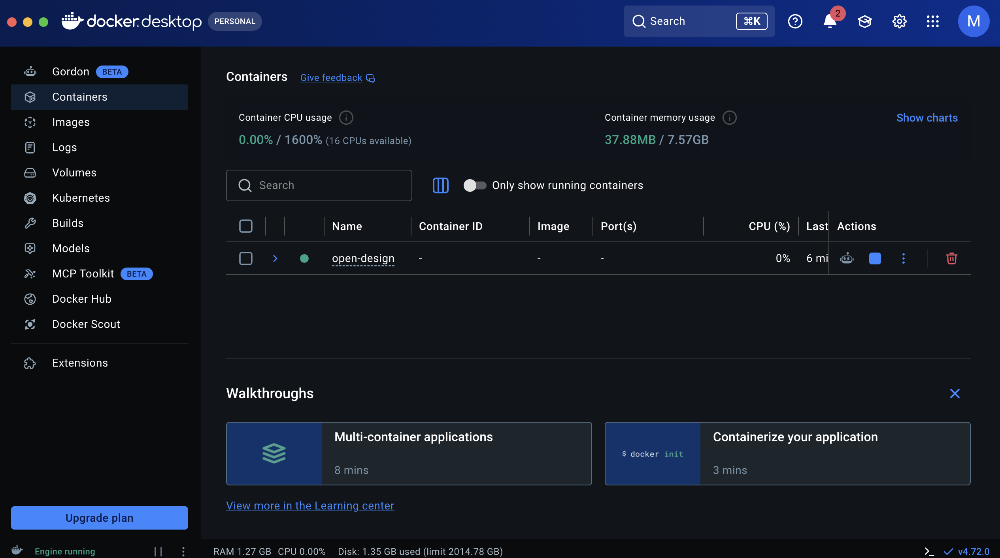
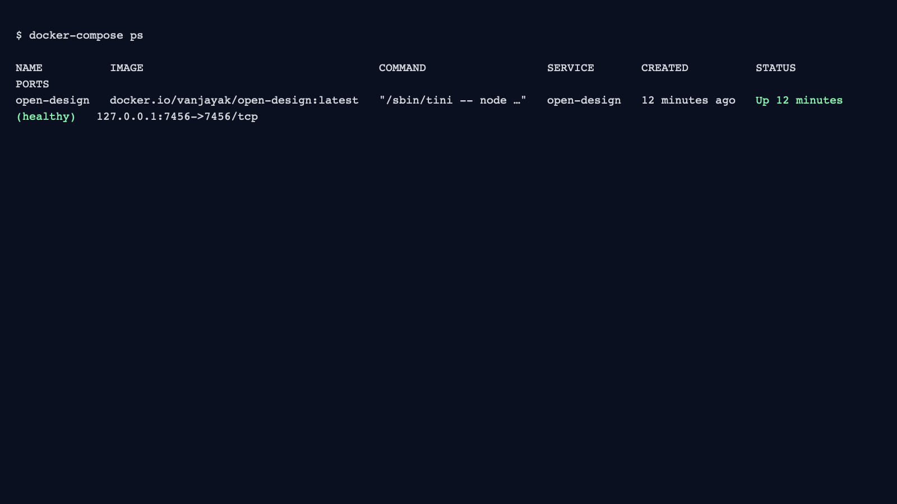
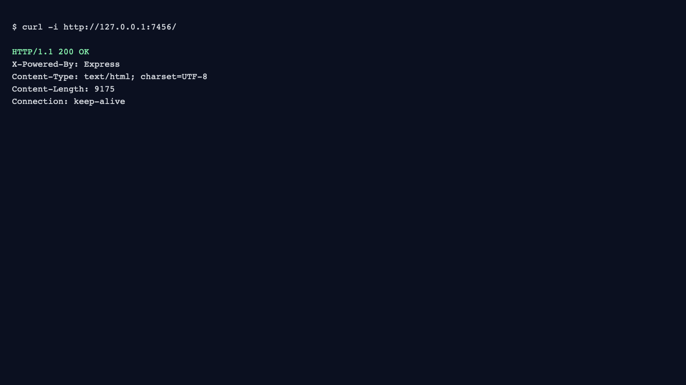
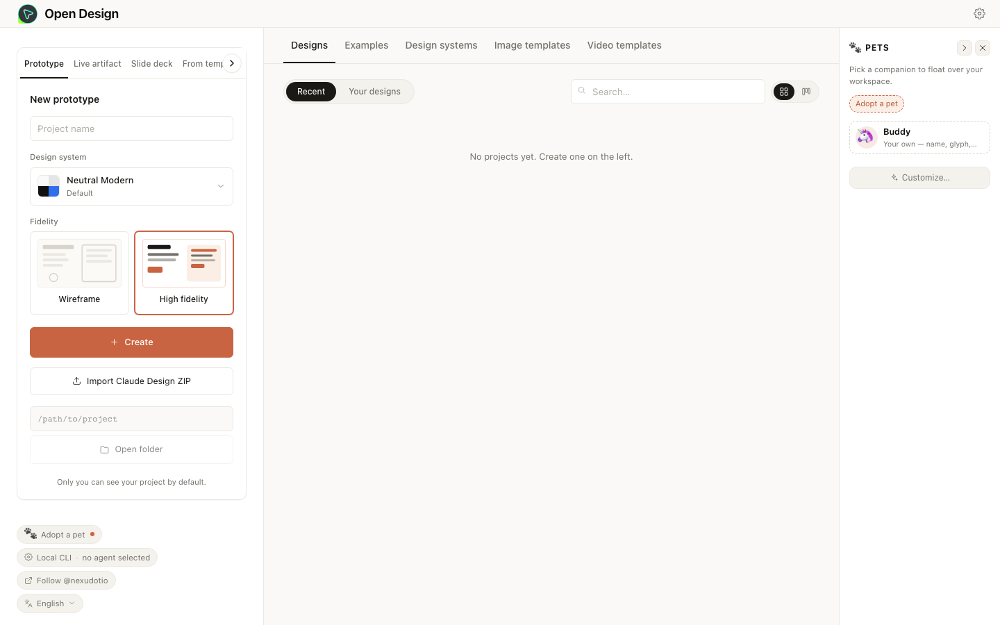
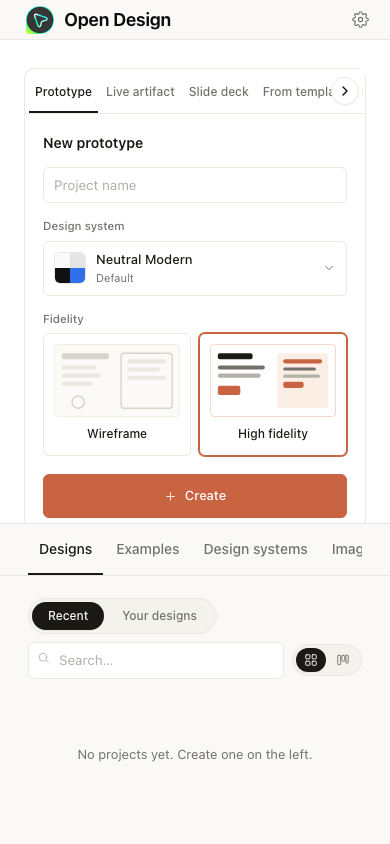

# Docker and Docker Compose

This is the easiest self-hosting path for beginners.

## Before You Start

- Docker Desktop installed and running
- Internet connection (first run downloads the image)

## Step 1: Open the Deploy Folder

```bash
git clone https://github.com/nexu-io/open-design.git
cd open-design/deploy
```

What this does:
- Downloads the project
- Moves into the folder that contains `docker-compose.yml`

## Step 2: Start Open Design

```bash
docker-compose up -d
```

What to expect:
- First run can take 1-2 minutes while Docker pulls the image
- You should see container creation and startup messages

## Step 3: Confirm Container Health

```bash
docker-compose ps
```

Success looks like:
- `open-design` container is listed
- `STATUS` shows `Up` and eventually `healthy`
- Port mapping includes `127.0.0.1:7456->7456/tcp`




## Step 4: Verify HTTP Response

```bash
curl -i http://127.0.0.1:7456/
```

Success looks like:
- HTTP status `200 OK`



## Step 5: Open Open Design in Your Browser

Open:
- `http://localhost:7456/`

You should see the Open Design interface.




## Common Issues

- `failed to connect to the docker API`: Docker Desktop is not running yet
- `address already in use`: Port `7456` is occupied by another process
- `curl: (7) Failed to connect`: container is still starting; wait 10-20 seconds and retry
