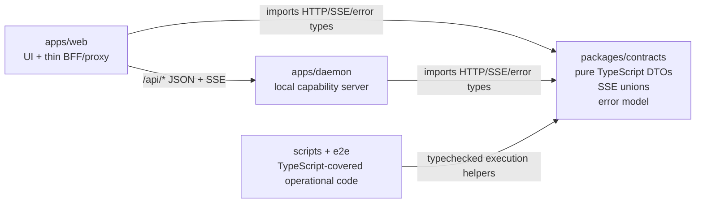

## Overview

### Problem Statement

`apps/web` and `apps/daemon` need the next maintainability-roadmap workstreams implemented: W2 and W3 from `specs/current/maintainability-roadmap.md`. This spec targets a full project migration to TypeScript as the end state; the implementation plan can still use incremental steps so each step is easy to validate.

### Goals

- Implement W2: define shared API, SSE, and error contracts covering R2, R7, and R8.
- Implement W3 as a full TypeScript migration for project-owned JavaScript entrypoints, modules, scripts, tests, and reporters, covering R1 and related maintainability risk across the repository.
- Provide shared request/response types, an SSE event union, and an error model that can be imported by both web and daemon code.
- Configure TypeScript so all migrated project code is checked consistently, with migration steps ordered for safe verification.

### Scope

- Create or update the shared contract layer for web/daemon request, response, error, and SSE event types.
- Add TypeScript configuration and package/script integration needed to migrate daemon, repository scripts, and test support code to TypeScript.
- Keep the existing architecture boundary from the roadmap: `apps/web` remains the Next.js frontend and thin BFF/proxy layer; `apps/daemon` remains the local runtime/backend.

### Constraints

- W2 depends on the completed W1 ownership and capability boundaries.
- W3 should build on W2 for highest-value shared types.
- Runtime validation, server modularization, process/task manager work, and broader daemon test pyramid work belong to later roadmap workstreams.

### Success Criteria

- Web and daemon can import the same contract types.
- Project-owned source, scripts, tests, and reporters have a TypeScript migration path with a typed end state.
- Typecheck covers the shared contracts, web, daemon, scripts, and test support code included in this spec.
- The new contracts explicitly cover HTTP payloads, SSE events, and the unified error model.

## Research

### Existing System

- W2 covers the implicit web/daemon API contract, inconsistent error handling, and under-specified SSE protocol; the roadmap's W3 text names daemon TypeScript support as the original output. Source: `specs/current/maintainability-roadmap.md:57-58`
- W1 defines the shared boundary as pure JavaScript or TypeScript usable by both web and daemon, with API DTO types, runtime schemas, task states, SSE event names, and error codes as allowed shared contents. Source: `specs/current/architecture-boundaries.md:41-56`
- `apps/web` communicates with daemon-owned capabilities through API DTOs and streaming events, while privileged local filesystem, SQLite, agent CLI, task lifecycle, logs, and artifacts stay daemon-owned. Source: `specs/current/architecture-boundaries.md:13-40`
- The workspace currently has no `packages/*` workspace entries; `pnpm-workspace.yaml` includes `apps/*` and `e2e` only. Source: `pnpm-workspace.yaml:1-3`
- No shared package currently exists under `packages/*`. Source: file search `packages/*/package.json`
- Root scripts run daemon, web, build, tests, and typecheck through pnpm filters; root `typecheck` currently targets only `@open-design/web`. Source: `package.json:12-25`
- Dev-mode web rewrites `/api/*`, `/artifacts/*`, and `/frames/*` to the local daemon origin; the config notes that `/api/chat` SSE streams through the rewrite. Source: `apps/web/next.config.ts:35-44`
- Web-side daemon chat types live in `apps/web/src/providers/daemon.ts`: `DaemonStreamOptions` sends `agentId`, `history`, `systemPrompt`, `projectId`, `attachments`, `model`, and `reasoning`. Source: `apps/web/src/providers/daemon.ts:19-38`
- The web chat client posts `/api/chat` with JSON fields `agentId`, `systemPrompt`, `message`, `projectId`, `attachments`, `model`, and `reasoning`. Source: `apps/web/src/providers/daemon.ts:57-77`
- The daemon `/api/chat` handler reads the same request fields from `req.body`, validates agent and message ad hoc, and returns HTTP 400 JSON errors for invalid agent, missing binary, or missing message. Source: `apps/daemon/src/server.ts:868-884`
- Web-side `AgentEvent` currently models UI events as `status`, `text`, `thinking`, `tool_use`, `tool_result`, `usage`, and `raw`. Source: `apps/web/src/types.ts:32-39`
- Daemon SSE setup for `/api/chat` writes `text/event-stream` frames with `event: <name>` and JSON `data`, using events such as `start`, `agent`, `stdout`, `stderr`, `error`, and `end`. Source: `apps/daemon/src/server.ts:1035-1044`, `apps/daemon/src/server.ts:1087-1095`, `apps/daemon/src/server.ts:1136-1180`
- The web SSE parser consumes frame separators, parses event/data fields, maps `stdout` to text, buffers `stderr`, translates `agent` payloads, handles `start`, treats `error` as terminal, and reads `end` exit code. Source: `apps/web/src/providers/daemon.ts:85-151`
- Web translation accepts daemon `agent` payload types `status`, `text_delta`, `thinking_delta`, `thinking_start`, `tool_use`, `tool_result`, `usage`, and `raw`; unknown payloads are ignored. Source: `apps/web/src/providers/daemon.ts:178-228`
- Agent JSON event parsing emits normalized events such as `status`, `text_delta`, `tool_use`, `tool_result`, `usage`, and `raw`; OpenCode error payloads currently become a `raw` event with embedded error text. Source: `apps/daemon/src/json-event-stream.ts:35-91`
- The daemon API proxy has a separate SSE endpoint at `/api/proxy/stream` with request fields `baseUrl`, `apiKey`, `model`, `systemPrompt`, and `messages`, and returns `start`, `delta`, `error`, and `end` SSE events. Source: `apps/daemon/src/server.ts:1188-1192`, `apps/daemon/src/server.ts:1241-1250`, `apps/daemon/src/server.ts:1262-1275`, `apps/daemon/src/server.ts:1291-1303`
- HTTP error responses are ad hoc: project routes often return `{ error: string }`, upload errors return `{ code, error }`, and preview errors derive status plus `{ error }`. Source: `apps/daemon/src/server.ts:200-205`, `apps/daemon/src/server.ts:147-177`, `apps/daemon/src/server.ts:755-763`
- Project CRUD and conversation/message routes shape common response envelopes such as `{ projects }`, `{ project, conversationId }`, `{ project }`, `{ conversations }`, `{ conversation }`, and `{ messages }`. Source: `apps/daemon/src/server.ts:200-269`, `apps/daemon/src/server.ts:325-424`
- File routes shape common response envelopes such as `{ files }`, `{ file }`, and `{ ok: true }`, while raw file routes return binary data. Source: `apps/daemon/src/server.ts:725-752`, `apps/daemon/src/server.ts:776-833`, `apps/daemon/src/server.ts:840-864`
- `apps/daemon/src/projects.ts` owns project file DTO construction with fields `name`, `path`, `type`, `size`, `mtime`, `kind`, `mime`, `artifactKind`, and `artifactManifest`. Source: `apps/daemon/src/projects.ts:30-70`
- Web application types already include daemon-adjacent DTOs such as `AgentInfo`, `ProjectFileKind`, `ProjectFile`, `Project`, and chat attachment/message/event types in `apps/web/src/types.ts`. Source: `apps/web/src/types.ts:41-101`, `apps/web/src/types.ts:150-160`
- `apps/web` has TypeScript configured with `strict`, `noUncheckedIndexedAccess`, `allowJs`, `noEmit`, and a `typecheck` script using `tsc -b --noEmit`. Source: `apps/web/tsconfig.json:2-23`, `apps/web/package.json:6-10`
- `apps/daemon` is ESM, starts with `node cli.js`, tests with `vitest run -c vitest.config.ts`, and currently has no `typecheck` script. Source: `apps/daemon/package.json:1-23`
- The daemon test config is TypeScript and includes `**/*.test.{ts,tsx,js,mjs,cjs}` under a Node test environment. Source: `apps/daemon/vitest.config.ts:1-8`
- `apps/daemon` currently contains JavaScript and MJS project code alongside TypeScript test/config files: `cli.js`, `server.js`, `db.js`, `agents.js`, stream parsers, project/design-system helpers, artifact helpers, `json-event-stream.test.mjs`, `artifact-manifest.test.ts`, and `vitest.config.ts`. Source: file search `apps/daemon/**/*.{js,mjs,cjs,ts,tsx}`
- `apps/web` source and config files are TypeScript/TSX, including `next.config.ts`, `app/**/*.tsx`, `src/**/*.ts`, `src/**/*.tsx`, and `vitest.config.ts`. Source: file search `apps/web/**/*.{js,mjs,cjs,ts,tsx}`
- `e2e` is mixed: Playwright and Vitest config/tests are TypeScript, while runtime/support scripts and reporters include `.mjs` and `.cjs` files. Source: `e2e/package.json:6-12`, `e2e/playwright.config.ts:1-58`, `e2e/vitest.config.ts:1-12`, file search `e2e/**/*.{js,mjs,cjs,ts,tsx}`
- Root scripts are currently MJS files: `scripts/resolve-dev-ports.mjs`, `scripts/dev-all.mjs`, and `scripts/sync-design-systems.mjs`. Source: file search `scripts/**/*.{js,mjs,cjs,ts,tsx}`

### Available Approaches

- **Add a new shared workspace package**: create a workspace package for contracts and add it to the pnpm workspace so both `apps/web` and `apps/daemon` can import pure shared TypeScript. This matches the roadmap output of a shared contract layer and the W1 shared-boundary rules. Source: `specs/current/maintainability-roadmap.md:57-58`, `specs/current/architecture-boundaries.md:41-56`, `pnpm-workspace.yaml:1-3`
- **Keep shared contracts inside an existing app**: moving contract types under `apps/web` would reuse the current location of many UI-adjacent types, but W1 says shared code should contain pure DTOs and avoid framework or environment-specific APIs. Source: `apps/web/src/types.ts:32-101`, `specs/current/architecture-boundaries.md:41-56`
- **Start with type-only contracts**: W2 can define request/response, SSE event, and error model types first, while runtime schemas remain in the later W4 workstream. Source: `specs/current/maintainability-roadmap.md:57-60`
- **Migrate repository code to a typed end state in phases**: W3 can add TypeScript configs and package scripts first, then convert daemon modules, root scripts, and e2e support files in bounded batches while running typecheck/test verification after each batch. Source: `apps/daemon/package.json:9-13`, `apps/daemon/vitest.config.ts:1-8`, `e2e/package.json:6-12`, file search `apps/daemon/**/*.{js,mjs,cjs,ts,tsx}`, file search `scripts/**/*.{js,mjs,cjs,ts,tsx}`
- **Broaden root typecheck**: root `typecheck` currently targets only web, so full project TypeScript verification requires daemon, shared package, scripts, and e2e/support coverage. Source: `package.json:23`, `apps/daemon/package.json:9-13`, `e2e/package.json:6-12`

### Constraints & Dependencies

- W2 depends on completed W1 ownership boundaries, and W3 depends on W2 for the highest-value shared types. Source: `specs/current/maintainability-roadmap.md:56-58`
- Runtime validation for HTTP inputs, paths, agents, models, uploads, task IDs, and command args is W4 scope, so research for W2/W3 should capture type boundaries without implementing full validation policy yet. Source: `specs/current/maintainability-roadmap.md:59`
- Shared code must stay free of Next.js, Express, Node filesystem/process APIs, browser APIs, SQLite, and daemon internals. Source: `specs/current/architecture-boundaries.md:41-56`
- API DTOs should prefer workspace-scoped logical or relative paths; machine absolute paths should remain daemon-internal. Source: `specs/current/architecture-boundaries.md:58-64`
- The `/api/chat` stream currently includes daemon-internal `cwd` in the `start` SSE event. Source: `apps/daemon/src/server.ts:1087-1095`
- Current daemon SSE lifecycle has no heartbeat or version field in emitted events. Source: `apps/daemon/src/server.ts:1035-1044`, `apps/daemon/src/server.ts:1087-1180`
- Current error responses and SSE errors do not use a unified model with `code`, `message`, `details`, `retryable`, and `requestId/taskId`. Source: `apps/daemon/src/server.ts:147-177`, `apps/daemon/src/server.ts:200-205`, `apps/daemon/src/server.ts:868-884`, `apps/daemon/src/server.ts:1170-1180`
- Daemon package devDependencies currently include `vitest` only; TypeScript and Node/Express type packages are available in web but not daemon. Source: `apps/daemon/package.json:21-23`, `apps/web/package.json:19-24`
- Full-project TypeScript migration includes CommonJS/MJS operational edges such as Playwright reporter loading and Node test/script execution. Source: `e2e/playwright.config.ts:22-37`, `e2e/package.json:8-12`, `package.json:14-15`

### Key References

- `specs/current/maintainability-roadmap.md:57-58` - W2/W3 outputs and dependency relationship.
- `specs/current/architecture-boundaries.md:41-56` - allowed shared contract contents and shared-code restrictions.
- `apps/web/next.config.ts:35-44` - dev proxy boundary for web-to-daemon API and SSE.
- `apps/web/src/providers/daemon.ts:19-38` - web-side `/api/chat` request options.
- `apps/web/src/providers/daemon.ts:85-151` - web-side SSE frame handling.
- `apps/web/src/providers/daemon.ts:178-228` - web-side daemon agent event translation.
- `apps/web/src/types.ts:32-39` - current UI `AgentEvent` union.
- `apps/daemon/src/server.ts:868-884` - daemon `/api/chat` request field handling and ad hoc HTTP errors.
- `apps/daemon/src/server.ts:1035-1044` - daemon SSE frame writer.
- `apps/daemon/src/server.ts:1087-1180` - daemon `/api/chat` start/agent/stdout/stderr/error/end lifecycle.
- `apps/daemon/src/server.ts:1188-1303` - daemon API proxy stream request and SSE events.
- `apps/daemon/src/json-event-stream.ts:35-91` - normalized agent JSON event output.
- `apps/daemon/package.json:9-23` - daemon scripts and dependencies.
- `apps/web/tsconfig.json:2-23` - web TypeScript baseline.
- `e2e/package.json:6-12` - e2e test scripts that currently execute TS config plus MJS runtime support.
- `pnpm-workspace.yaml:1-3` - current workspace package globs.

## Design

### Architecture Overview

### Design Decisions

- Decision: Add a new `packages/contracts` workspace package for W2. The package exports pure TypeScript types for daemon HTTP DTOs, SSE event unions, task states, and error codes; this aligns with the shared-boundary allowed contents and the roadmap's shared-contract output. Source: `specs/current/architecture-boundaries.md:41-56`, `specs/current/maintainability-roadmap.md:57-58`, `pnpm-workspace.yaml:1-3`
- Decision: Keep `apps/web/src/types.ts` as the UI/application type layer and move only daemon-facing DTOs/events/errors into `packages/contracts`. Web owns UI state and communicates with daemon through API DTOs and streaming events; current UI `AgentEvent` is a presentation union. Source: `specs/current/architecture-boundaries.md:13-27`, `apps/web/src/types.ts:32-39`, `apps/web/src/types.ts:150-179`, `apps/web/src/types.ts:215-252`
- Decision: Model the current daemon API before tightening behavior. Start with type contracts for `/api/chat`, `/api/proxy/stream`, project routes, conversation/message routes, file routes, artifacts, health, agents, skills, and design systems, then add runtime schemas in W4. Source: `specs/current/maintainability-roadmap.md:57-60`, `apps/daemon/src/server.ts:200-269`, `apps/daemon/src/server.ts:725-864`, `apps/daemon/src/server.ts:868-884`, `apps/daemon/src/server.ts:1188-1303`
- Decision: Define separate transport-level SSE unions and UI-level event unions. `/api/chat` transport events cover `start`, `agent`, `stdout`, `stderr`, `error`, and `end`; normalized agent payloads cover `status`, `text_delta`, `thinking_delta`, `thinking_start`, `tool_use`, `tool_result`, `usage`, and `raw`; web translation remains liberal for forward compatibility. Source: `apps/daemon/src/server.ts:1035-1044`, `apps/daemon/src/server.ts:1087-1180`, `apps/web/src/providers/daemon.ts:85-151`, `apps/web/src/providers/daemon.ts:178-228`, `apps/daemon/src/json-event-stream.ts:35-91`
- Decision: Define a versioned SSE contract shape for future W8/W6 compatibility while preserving the existing event names during W2 adoption. Include a protocol version constant and typed event payloads; heartbeat, cancellation, and canonical task lifecycle events remain future extensions. Source: `specs/current/maintainability-roadmap.md:40-41`, `specs/current/maintainability-roadmap.md:57-64`, `apps/daemon/src/server.ts:1035-1044`, `apps/daemon/src/server.ts:1087-1180`
- Decision: Introduce a unified `ApiError` and `SseErrorEvent` type with `code`, `message`, `details`, `retryable`, `requestId`, and `taskId`, plus compatibility helpers for existing `{ error }` and `{ code, error }` responses. Current routes return multiple ad hoc shapes; W2 should make the target contract explicit. Source: `specs/current/maintainability-roadmap.md:39-40`, `apps/daemon/src/server.ts:147-177`, `apps/daemon/src/server.ts:200-205`, `apps/daemon/src/server.ts:868-884`, `apps/daemon/src/server.ts:1170-1180`
- Decision: Treat machine absolute paths as daemon-internal in public contracts. DTOs should use project-relative or logical paths; the existing `/api/chat` `start` event's `cwd` field should be typed as legacy/internal and removed from web-facing assumptions during adoption. Source: `specs/current/architecture-boundaries.md:58-64`, `apps/daemon/src/server.ts:1087-1095`
- Decision: W3's end state is a compiled TypeScript daemon runtime with a transitional `allowJs` phase. The daemon currently runs `node cli.js` and exposes `./cli.js` as its bin, so TypeScript entrypoint migration needs a deliberate build output and script/bin update. Source: `apps/daemon/package.json:6-13`, `package.json:9-24`
- Decision: Broaden typechecking from web-only to contracts, daemon, scripts, and e2e support. Root `typecheck` currently filters only `@open-design/web`; daemon has tests but no typecheck script; e2e already uses TypeScript configs and MJS/CJS operational files. Source: `package.json:19-25`, `apps/daemon/package.json:9-23`, `apps/web/tsconfig.json:2-23`, `e2e/package.json:6-12`, `e2e/playwright.config.ts:1-58`
- Decision: Migrate JavaScript/MJS/CJS files in dependency order: pure parsers/helpers, project/artifact helpers, DB/agent modules, server/CLI entrypoints, root scripts, then e2e scripts/reporters. This keeps each step verifiable and limits runtime-loader risk around Playwright reporter loading. Source: `apps/daemon/vitest.config.ts:1-8`, `apps/daemon/src/json-event-stream.ts:35-91`, `e2e/playwright.config.ts:22-37`, `e2e/package.json:8-12`, `package.json:14-15`

### Why this design

- A dedicated shared package makes the web/daemon boundary explicit while preserving the existing product architecture: web handles UI/proxy behavior and daemon owns local runtime capabilities. Source: `specs/current/architecture-boundaries.md:13-40`
- Type-only W2 contracts deliver immediate drift protection and give W4 a stable target for runtime schemas. Source: `specs/current/maintainability-roadmap.md:57-60`
- Separating transport events from UI events keeps daemon protocol evolution independent from rendering concerns and preserves the current liberal parser behavior. Source: `apps/web/src/providers/daemon.ts:85-151`, `apps/web/src/providers/daemon.ts:178-228`
- A compiled daemon TypeScript target is the safest full migration end state for the package bin and root `od` entrypoint. Source: `apps/daemon/package.json:6-13`, `package.json:9-10`

### Implementation Steps

1. Create `packages/contracts`, add it to the pnpm workspace, and expose typed exports for API DTOs, SSE events, errors, task states, and shared constants.
2. Add package-level and root-level TypeScript configuration so contracts typecheck independently and participate in root `pnpm run typecheck`.
3. Replace duplicated web daemon-facing types with imports from `packages/contracts`, keeping UI-only state and presentation unions in `apps/web/src/types.ts`.
4. Type daemon request handlers, response envelopes, SSE send helpers, and normalized JSON event parsing against the shared contracts while preserving current runtime behavior.
5. Introduce compatibility error helpers and adopt the unified error model first in `/api/chat`, upload errors, project/file routes, and proxy stream errors.
6. Add daemon TypeScript config and scripts, migrate daemon modules in dependency order, and switch runtime/bin scripts to compiled JavaScript output once `cli.ts` and `server.ts` are converted.
7. Convert root scripts and e2e support scripts/reporters with an explicit execution strategy for Node scripts and Playwright reporter loading.
8. Broaden root verification to contracts, web, daemon, scripts, and e2e support, then run targeted daemon/web/e2e tests.

### Test Strategy

- Contracts: run `pnpm --filter @open-design/contracts typecheck`; add lightweight type-level coverage via exported example payloads or `tsc`-checked fixture files. Source: `specs/current/maintainability-roadmap.md:57-58`
- Web adoption: run `pnpm --filter @open-design/web typecheck` and existing web tests after importing shared DTO/SSE/error types. Source: `apps/web/package.json:6-10`, `apps/web/tsconfig.json:2-23`
- Daemon adoption: add and run `pnpm --filter @open-design/daemon typecheck`, then `pnpm --filter @open-design/daemon test`; daemon already uses Vitest with TypeScript config. Source: `apps/daemon/package.json:9-23`, `apps/daemon/vitest.config.ts:1-8`
- SSE compatibility: add or update parser/translator tests around `/api/chat` `start`, `agent`, `stdout`, `stderr`, `error`, and `end` frames plus normalized agent payloads. Source: `apps/web/src/providers/daemon.ts:85-151`, `apps/daemon/src/json-event-stream.ts:35-91`
- Error model compatibility: add daemon route/helper tests for existing `{ error }` and `{ code, error }` inputs mapping into the new `ApiError` shape. Source: `apps/daemon/src/server.ts:147-177`, `apps/daemon/src/server.ts:200-205`, `apps/daemon/src/server.ts:868-884`
- Runtime migration: after each TypeScript conversion batch, run daemon tests and root typecheck; after script/e2e migration, run `pnpm --filter @open-design/e2e test` and a Playwright reporter smoke run when feasible. Source: `package.json:19-25`, `e2e/package.json:6-12`, `e2e/playwright.config.ts:22-37`

### Pseudocode

Flow:
  Add shared package
  Export contract modules
    api/chat.ts
    api/projects.ts
    api/files.ts
    sse/chat.ts
    sse/proxy.ts
    errors.ts
  Web imports contracts
    build typed request body
    parse transport SSE frame
    translate typed transport event to UI AgentEvent
  Daemon imports contracts
    type request body reads
    type response envelopes
    type send(event, data)
    wrap legacy errors into ApiError shape
  TypeScript migration proceeds by dependency order
    helpers/parsers
    DTO builders
    services/adapters
    server/CLI
    scripts/e2e

### File Structure

- `packages/contracts/package.json` - new workspace package metadata, exports, and typecheck script.
- `packages/contracts/tsconfig.json` - strict declaration-emitting TypeScript config for shared contracts.
- `packages/contracts/src/index.ts` - public export surface.
- `packages/contracts/src/api/*.ts` - HTTP request/response DTOs and response envelopes.
- `packages/contracts/src/sse/*.ts` - chat/proxy SSE event unions and protocol constants.
- `packages/contracts/src/errors.ts` - error codes, `ApiError`, `ApiErrorResponse`, and SSE error payload types.
- `packages/contracts/src/tasks.ts` - task state/lifecycle constants shared with later W6/W8 work.
- `apps/web/src/types.ts` - keep UI/application types; import shared daemon DTOs where applicable.
- `apps/web/src/providers/daemon.ts` - consume shared chat request and SSE event types; retain UI translator.
- `apps/daemon/tsconfig.json` - new daemon TypeScript config with transitional `allowJs` and strict checking target.
- `apps/daemon/package.json` - add `typecheck`, build/runtime scripts, and TypeScript/type dependencies as migration steps require.
- `apps/daemon/**/*.ts` - migrated daemon modules, server, CLI, parsers, and helpers.
- `scripts/**/*.ts` - migrated root operational scripts.
- `e2e/**/*.ts` - migrated e2e support scripts and reporter strategy.
- `AGENTS.md` - repository development conventions for future work: shared contracts first for web/daemon boundaries, TypeScript-first implementation, no project-owned JavaScript entrypoints/modules/scripts/tests/reporters after W3.

### Interfaces / APIs

- `ChatRequest`: `{ agentId, message, systemPrompt?, projectId?, attachments?, model?, reasoning? }`, matching web post body and daemon handler reads. Source: `apps/web/src/providers/daemon.ts:57-77`, `apps/daemon/src/server.ts:868-884`
- `ChatSseEvent`: discriminated union for `start`, `agent`, `stdout`, `stderr`, `error`, and `end`, with `cwd` treated as legacy/internal on `start`. Source: `apps/daemon/src/server.ts:1035-1044`, `apps/daemon/src/server.ts:1087-1180`
- `DaemonAgentPayload`: discriminated union for normalized agent payloads emitted inside `agent` events. Source: `apps/web/src/providers/daemon.ts:178-228`, `apps/daemon/src/json-event-stream.ts:35-91`
- `ProxyStreamRequest` and `ProxySseEvent`: request fields `baseUrl`, `apiKey`, `model`, `systemPrompt`, and `messages`; events `start`, `delta`, `error`, and `end`. Source: `apps/daemon/src/server.ts:1188-1303`
- `ApiError`: `{ code, message, details?, retryable?, requestId?, taskId? }`; `ApiErrorResponse`: `{ error: ApiError }`; compatibility helpers accept legacy string errors during migration. Source: `specs/current/maintainability-roadmap.md:39-40`, `apps/daemon/src/server.ts:147-177`, `apps/daemon/src/server.ts:200-205`
- Response envelopes: projects, conversations, messages, files, and file mutation responses should mirror the current daemon JSON shapes and reuse existing web DTO fields. Source: `apps/daemon/src/server.ts:200-269`, `apps/daemon/src/server.ts:325-424`, `apps/daemon/src/server.ts:725-864`, `apps/web/src/types.ts:150-179`, `apps/web/src/types.ts:215-252`

### Edge Cases

- Existing SSE consumers should continue ignoring unknown `agent` payloads, so new union members can be added safely. Source: `apps/web/src/providers/daemon.ts:178-228`
- Malformed or partial SSE frames should preserve current parser tolerance until W4 validation defines stricter behavior. Source: `apps/web/src/providers/daemon.ts:163-176`
- `/api/chat` currently emits terminal SSE errors and HTTP 400 JSON errors through different shapes; W2 should type both and allow incremental adoption. Source: `apps/daemon/src/server.ts:868-884`, `apps/daemon/src/server.ts:1170-1180`
- Playwright reporter loading currently points to a `.cjs` reporter path; migration needs a compiled JS reporter path or supported TS execution path. Source: `e2e/playwright.config.ts:22-37`
- The root `od` bin and daemon package bin currently point at JavaScript entrypoints; conversion to `.ts` requires a compiled output target before script/bin paths change. Source: `package.json:9-10`, `apps/daemon/package.json:6-13`
- Shared contracts should stay pure and free of Next, Express, Node filesystem/process APIs, browser APIs, SQLite, and daemon internals. Source: `specs/current/architecture-boundaries.md:41-56`

## Plan

- [x] Step 1: Establish shared contracts package
  - [x] Substep 1.1 Implement: Add `packages/contracts` workspace package, exports, and strict TypeScript config.
  - [x] Substep 1.2 Implement: Define `ApiError`, error codes, task states, and common response envelope helpers.
  - [x] Substep 1.3 Implement: Define HTTP DTOs for chat, proxy stream, projects, conversations, messages, files, agents, skills, design systems, artifacts, and health.
  - [x] Substep 1.4 Implement: Define `/api/chat` and `/api/proxy/stream` SSE event unions and normalized agent payload unions.
  - [x] Substep 1.5 Verify: Run contracts typecheck and root package graph install/type resolution checks.
- [x] Step 2: Adopt contracts in web and daemon boundary code
  - [x] Substep 2.1 Implement: Import shared chat/proxy/file/project DTOs in web provider and app types while keeping UI-only unions local.
  - [x] Substep 2.2 Implement: Type daemon response envelopes, chat request body reads, proxy stream request body reads, and SSE send helpers.
  - [x] Substep 2.3 Implement: Add compatibility error helpers and adopt them in chat, upload, project/file, and proxy stream paths.
  - [x] Substep 2.4 Verify: Run web typecheck, daemon tests, and targeted SSE/error compatibility tests.
- [x] Step 3: Add daemon TypeScript foundation
  - [x] Substep 3.1 Implement: Add daemon `tsconfig.json`, `typecheck` script, and required TypeScript/Node/Express type dependencies.
  - [x] Substep 3.2 Implement: Configure transitional `allowJs` checking for current daemon modules.
  - [x] Substep 3.3 Implement: Update root `typecheck` to include contracts and daemon.
  - [x] Substep 3.4 Verify: Run daemon typecheck, daemon tests, and root typecheck.
- [x] Step 4: Migrate daemon modules to TypeScript
  - [x] Substep 4.1 Implement: Convert pure parsers/helpers and their tests first.
  - [x] Substep 4.2 Implement: Convert project/file/artifact helper modules and DTO builders.
  - [x] Substep 4.3 Implement: Convert DB, agents, runtime adapter, and stream orchestration modules.
  - [x] Substep 4.4 Implement: Convert `server` and `cli` entrypoints and switch package/runtime bin paths to compiled output.
  - [x] Substep 4.5 Verify: Run daemon typecheck/tests after each conversion batch and smoke the daemon CLI locally.
- [x] Step 5: Migrate scripts and e2e support to TypeScript
  - [x] Substep 5.1 Implement: Convert root scripts with a documented Node execution strategy.
  - [x] Substep 5.2 Implement: Convert e2e runtime/support scripts and preserve Playwright reporter loading through compiled output or supported TS loading.
  - [x] Substep 5.3 Implement: Update root `typecheck` to include scripts and e2e support.
  - [x] Substep 5.4 Verify: Run root typecheck, repo test suite, e2e tests, and a Playwright reporter smoke check when feasible.
- [x] Step 6: Lock in typed end state and future conventions
  - [x] Substep 6.1 Implement: Add or update root `AGENTS.md` with W2/W3 development conventions: put shared web/daemon contracts in `packages/contracts`, keep UI-only types in web, keep daemon capability logic in daemon, use TypeScript for new project-owned code, and route runtime validation work to the later validation workstream.
  - [x] Substep 6.2 Implement: Add an automated residual-JavaScript check for project-owned entrypoints, modules, scripts, tests, and reporters, with explicit allowlist entries only for generated, vendored, or compatibility-output files.
  - [x] Substep 6.3 Verify: Run the residual-JavaScript check and confirm no project-owned `.js`, `.mjs`, or `.cjs` source files remain outside the documented allowlist.
  - [x] Substep 6.4 Verify: Re-run root typecheck and full test suite after the final convention and residual-file checks are in place.

## Notes

<!-- Optional sections — add what's relevant. -->

### Implementation

- `pnpm-workspace.yaml` - added `packages/*` so shared packages participate in the workspace graph.
- `packages/contracts/package.json` - added `@open-design/contracts` package metadata, source exports, and `typecheck` script.
- `packages/contracts/tsconfig.json` - added strict TypeScript configuration for shared contracts.
- `packages/contracts/src/common.ts` - added JSON, nullable, and response envelope helper types.
- `packages/contracts/src/errors.ts` - added `ApiError`, error codes, compatibility response types, SSE error payloads, and small pure construction helpers.
- `packages/contracts/src/tasks.ts` - added shared task state and task status contracts.
- `packages/contracts/src/api/*.ts` - added HTTP DTOs for chat, proxy stream, projects, conversations, messages, files, agents, skills, design systems, artifacts, and health.
- `packages/contracts/src/sse/*.ts` - added typed SSE event helpers plus `/api/chat` and `/api/proxy/stream` event unions with protocol constants.
- `packages/contracts/src/examples.ts` - added tsc-checked example payloads for key contracts.
- `packages/contracts/src/index.ts` - added the public export surface.
- `apps/web/package.json` and `apps/daemon/package.json` - added workspace dependencies on `@open-design/contracts` for boundary type adoption.
- `apps/web/src/types.ts` - re-exported shared chat, registry, project, file, and conversation DTOs while keeping UI/config-only types local.
- `apps/web/src/providers/daemon.ts` - typed `/api/chat` request construction, chat SSE frame handling, daemon agent payload translation, and unified SSE error payload reading with shared contracts.
- `apps/daemon/src/server.ts` - added JSDoc contract imports, typed project/file response envelopes, typed chat/proxy request body reads, typed SSE send events, and shared-shape compatibility error helpers.
- `apps/daemon/src/server.ts` - adopted `ApiErrorResponse`/`SseErrorPayload` shapes for chat, upload, project/file, and proxy stream error paths while preserving runtime behavior.
- `apps/web/src/providers/sse.test.ts` - added coverage for unified daemon SSE error payload handling.
- `apps/daemon/sse-response.test.mjs` - added coverage for compatibility `ApiErrorResponse` construction.
- `apps/daemon/tsconfig.json` - added a strict daemon TypeScript foundation with `allowJs` for the current JavaScript/MJS transition and bundler resolution for workspace contract source imports.
- `apps/daemon/package.json` - added a `typecheck` script plus TypeScript, Node, Express, Multer, and better-sqlite3 type dependencies.
- `package.json` - broadened root `typecheck` to run contracts, web, and daemon checks through Corepack-pinned pnpm.
- `pnpm-lock.yaml` - updated lockfile entries for daemon TypeScript/type dependencies.
- `apps/daemon/*.ts` - migrated remaining daemon-owned modules, helpers, server entrypoint, CLI entrypoint, and daemon tests from `.js`/`.mjs` to `.ts` while preserving runtime `.js` ESM import specifiers for compiled output.
- `apps/daemon/tsconfig.json` - switched daemon compilation to NodeNext module resolution, disabled JavaScript source inclusion, and added `dist` declaration/source-map emit.
- `apps/daemon/package.json` - added daemon `build`, routed daemon/dev/start through compiled `dist/cli.js`, and updated the package bin to compiled output.
- `package.json` - updated the root `od` bin to the compiled daemon CLI path.
- `scripts/*.ts` - migrated root development and design-system sync scripts from MJS to TypeScript, using Node 24 `--experimental-strip-types` for direct script execution.
- `scripts/tsconfig.json` - added strict TypeScript coverage for root operational scripts.
- `e2e/scripts/*.ts` - migrated e2e cleanup and live runtime-adapter smoke scripts to TypeScript; the live script now builds and imports the compiled daemon output.
- `e2e/reporters/markdown-reporter.ts` and `e2e/cases/report-metadata.ts` - migrated the Playwright markdown reporter and report metadata from CommonJS to TypeScript ESM.
- `e2e/tsconfig.json` and `e2e/package.json` - added e2e support typechecking plus Node strip-types execution for support scripts.
- `e2e/playwright.config.ts` - updated root script imports and reporter paths to TypeScript files and routed the Playwright webServer command through Corepack-pinned pnpm.
- `package.json` - broadened root `typecheck` to cover scripts and e2e support, and routed root pnpm-invoking scripts through Corepack so the pinned pnpm version is used consistently.
- `AGENTS.md` - updated project shape, command notes, TypeScript-first conventions, shared contract boundaries, daemon ownership rules, runtime validation scope, and migrated `.ts` file references for future agents.
- `scripts/check-residual-js.ts` - added an automated residual JavaScript scanner for project-owned `.js`, `.mjs`, and `.cjs` files, with documented output/vendor/generated allowlist prefixes and local scratch/dependency directory skips.
- `package.json` - added `check:residual-js` and made root `typecheck` run the residual JavaScript check after package/support typechecks and daemon build output generation.

### Verification

- `corepack pnpm install` - passed; workspace graph recognized all 5 projects and updated lockfile state.
- `corepack pnpm --filter @open-design/contracts typecheck` - passed.
- `corepack pnpm --filter @open-design/web typecheck` - passed as a package graph/type resolution sanity check.
- `corepack pnpm typecheck` - attempted; failed because the root script invokes `pnpm` from PATH version 10.28.0 while the repo requires `>=10.33.2 <11`. The Corepack package-level equivalent above passed.
- `corepack pnpm install` - passed after adding app dependencies on `@open-design/contracts`; lockfile links web and daemon to the workspace package.
- `corepack pnpm --filter @open-design/contracts typecheck` - passed after Step 2 adoption.
- `corepack pnpm --filter @open-design/web typecheck` - passed after Step 2 adoption.
- `corepack pnpm --filter @open-design/web test -- src/providers/sse.test.ts` - passed; Vitest also ran existing artifact manifest tests in the web package.
- `corepack pnpm --filter @open-design/daemon test -- sse-response.test.mjs` - passed; Vitest also ran existing daemon artifact manifest and json event stream tests.
- `corepack pnpm install` - passed after adding daemon TypeScript/type dependencies.
- `corepack pnpm --filter @open-design/daemon typecheck` - passed after adding the daemon TypeScript foundation.
- `corepack pnpm --filter @open-design/daemon test` - passed; all 18 daemon tests passed.
- `corepack pnpm typecheck` - passed after root `typecheck` was broadened to contracts, web, and daemon and routed through Corepack-pinned pnpm.
- `corepack pnpm --filter @open-design/daemon typecheck` - passed after daemon module conversion.
- `corepack pnpm --filter @open-design/daemon build` - passed and emitted compiled daemon output under `apps/daemon/dist`.
- `corepack pnpm --filter @open-design/daemon test` - passed after daemon module conversion; all 18 daemon tests passed.
- `node apps/daemon/dist/cli.js --help` - passed as a compiled CLI smoke check.
- `corepack pnpm typecheck` - passed after daemon module conversion and compiled-bin package updates.
- `corepack pnpm --filter @open-design/e2e exec tsc -p ../scripts/tsconfig.json --noEmit` - passed for root TypeScript scripts.
- `corepack pnpm --filter @open-design/daemon build` - passed before e2e support typechecking and live-script import validation.
- `corepack pnpm --filter @open-design/e2e typecheck` - passed for Playwright config, reporter, report metadata, and e2e support scripts.
- `corepack pnpm typecheck` - passed after script and e2e support migration.
- `node --experimental-strip-types` import smoke checks for `scripts/resolve-dev-ports.ts` and `e2e/reporters/markdown-reporter.ts` - passed.
- `corepack pnpm test` - passed; web 15 tests, daemon 18 tests, and e2e Vitest 9 tests passed.
- `corepack pnpm --filter @open-design/e2e test:ui:clean` - passed against the TypeScript cleanup script.
- `corepack pnpm --filter @open-design/e2e exec playwright test -c playwright.config.ts --list` - passed as a Playwright config/reporter loading smoke check and listed 15 Chromium UI tests.
- `corepack pnpm run check:residual-js` - passed; no project-owned residual `.js`, `.mjs`, or `.cjs` files were found outside the documented allowlist.
- `corepack pnpm --filter @open-design/e2e exec tsc -p ../scripts/tsconfig.json --noEmit` - passed after adding the residual JavaScript scanner.
- `corepack pnpm typecheck` - passed after Step 6; contracts, web, daemon typecheck, daemon build, scripts typecheck, e2e typecheck, and residual JavaScript check all passed.
- `corepack pnpm test` - passed after Step 6; web 15 tests, daemon 18 tests, and e2e Vitest 9 tests passed.
