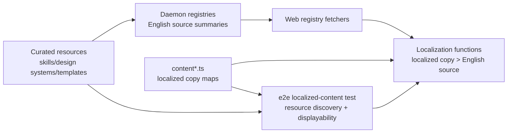

## Overview

### Problem Statement

- `content.ts`, `content.fr.ts`, and `content.ru.ts` maintain large hand-authored English fallback ID arrays for localized resource display.
- Runtime localization already uses English resource fields when localized copy is absent, so the arrays mostly exist to satisfy coverage tests.
- Multiple PRs that add skills, design systems, or prompt templates edit the same fallback arrays, causing large merge conflicts.
- Moving fallback declarations into `SKILL.md` frontmatter would shift that bookkeeping burden to asset authors and make skill contributions harder.

### Goals

- Make English fallback the default runtime behavior for resource display in every locale.
- Remove `*_IDS_WITH_EN_FALLBACK` arrays from `content.ts`, `content.fr.ts`, and `content.ru.ts`.
- Keep localized copy maps as the only hand-authored resource localization data.
- Preserve the existing display behavior: localized copy wins, English source data fills any missing copy.
- Keep resource coverage scoped to `de`, `fr`, and `ru`, the current locales with resource display copy dictionaries.
- Keep coverage that proves every discovered curated resource has the English source fields needed for fallback display.

### Scope

- Update web localized ID construction so it tracks localized copy dictionaries and category/tag dictionaries without fallback arrays.
- Remove hand-maintained fallback arrays and their imports/exports.
- Update localized coverage tests to validate default fallback semantics from discovered resource source data.
- Leave `SKILL.md`, `DESIGN.md`, and prompt-template JSON asset metadata unchanged.

### Constraints

- Do not commit a generated registry file.
- Avoid moving merge conflicts from centralized content files into asset metadata.
- Keep `packages/contracts` unchanged unless runtime API payloads actually change.
- Keep resource-localized locale scope explicit: current localized resource content exists for `de`, `fr`, and `ru`.

### Success Criteria

- Adding a new English-only skill, design system, or prompt template requires no per-resource fallback ID list edit or per-resource localized copy edit for display fields; category/tag taxonomy localization still follows existing coverage.
- Concurrent asset PRs do not need to touch fallback arrays.
- Localized display still shows translated copy when present and English resource fields when absent.
- Coverage fails when a discovered curated resource lacks required English source fields for fallback display.

## Research

### Existing System

- Supported UI locales include many languages, but resource display localization is only wired for `de`, `ru`, and `fr` through `LOCALIZED_CONTENT_IDS`. Source: `apps/web/src/i18n/types.ts:1-5`; `apps/web/src/i18n/content.ts:1114-1174`
- Web i18n display content currently stores localized copy maps plus three fallback ID arrays per resource-localized locale. Source: `apps/web/src/i18n/content.ts:40-49,367-439,542-551`; `apps/web/src/i18n/content.fr.ts:320-393,493-502`; `apps/web/src/i18n/content.ru.ts:320-393,493-502`
- `LOCALIZED_CONTENT` wires `de`, `ru`, and `fr` to copy maps and fallback arrays; `buildLocalizedContentIds` merges copy keys with fallback IDs for coverage. Source: `apps/web/src/i18n/content.ts:1114-1174`
- Runtime localization already falls back to English source fields when a localized resource copy is missing. Source: `apps/web/src/i18n/content.ts:1188-1232`
- Localized coverage is an e2e Vitest test that imports `LOCALIZED_CONTENT_IDS`, discovers skills, design systems, and prompt templates from resource directories, and expects every discovered resource ID to appear in localized IDs. Source: `e2e/tests/localized-content.test.ts:26-37,53-60,154-174`
- Skill IDs are discovered by scanning `skills/*/SKILL.md`; the test reads frontmatter `name` when present, then falls back to the directory name. Source: `e2e/tests/localized-content.test.ts:62-89,133-151`
- Design system IDs are discovered from `design-systems/*/DESIGN.md`; categories are parsed from a `> Category:` blockquote line. Source: `e2e/tests/localized-content.test.ts:91-104`
- Prompt template IDs, categories, and tags are discovered from `prompt-templates/{image,video}/*.json`. Source: `e2e/tests/localized-content.test.ts:107-130`
- Daemon resource registries already expose source English fields used by runtime fallback; web registry fetchers consume those daemon endpoints. Source: `apps/daemon/src/skills.ts:94-171`; `apps/daemon/src/design-systems.ts:23-48`; `apps/daemon/src/prompt-templates.ts:36-70`; `apps/web/src/providers/registry.ts:86-94,170-198`
- Git history shows fallback arrays grew as a coverage mechanism after resource imports and locale additions: `abaae96e` added design-system coverage for 57 imported systems, `f12471f2` generalized fallback arrays, `10e8e2d3` copied the model for Russian, and `c881c0ca` copied it for French. Source: `git log -S 'WITH_EN_FALLBACK' -- apps/web/src/i18n/content.ts apps/web/src/i18n/content.fr.ts apps/web/src/i18n/content.ru.ts`

### Available Approaches

- **Option A: default English fallback with e2e displayability checks**. Remove manual resource fallback IDs, keep localized copy maps, and let coverage derive displayability from discovered source resources plus existing runtime fallback behavior. Source: `apps/web/src/i18n/content.ts:1188-1232`; `e2e/tests/localized-content.test.ts:62-130,154-174`
- **Option B: keep centralized fallback arrays**. Current implementation stores explicit fallback arrays per locale and per asset family in `content.ts`, `content.fr.ts`, and `content.ru.ts`. Source: `apps/web/src/i18n/content.ts:367-439,542-551`; `apps/web/src/i18n/content.fr.ts:320-393,493-502`; `apps/web/src/i18n/content.ru.ts:320-393,493-502`
- **Option C: asset self-declared fallback metadata**. Asset scanners could read `i18n.fallbackToEnglish` from owner files, but this adds required i18n bookkeeping to every English-only asset contribution. Source: `apps/daemon/src/skills.ts:94-171`; `apps/daemon/src/design-systems.ts:23-48`; `apps/daemon/src/prompt-templates.ts:36-70`
- **Option D: generated fallback registry consumed by web**. The repository already has a generated-artifact pattern for artifact manifests, but the i18n coverage test currently computes coverage directly from source content and on-disk assets. Source: `apps/web/src/artifacts/manifest.ts:68-93,96-145`; `apps/web/tests/artifacts/manifest.test.ts:10-57,107-120`; `e2e/tests/localized-content.test.ts:154-174`

### Constraints & Dependencies

- `packages/contracts` is the shared web/daemon app contract layer and must stay pure TypeScript; web/daemon DTO changes belong there when API payload shapes change. Source: `packages/AGENTS.md:5-13`; `packages/contracts/src/api/registry.ts:25-83`
- App tests live under package/app-level `tests/`; cross-app/resource consistency checks belong in `e2e/tests/`. Source: `AGENTS.md:54-60`; `apps/AGENTS.md:27-32`; `e2e/AGENTS.md:19-38`
- Web source code receives resource lists from daemon/runtime summaries, while e2e can scan repository directories directly for cross-resource coverage. Source: `apps/web/src/providers/registry.ts:86-94,170-198`; `e2e/tests/localized-content.test.ts:62-130`
- Some current code catches missing resource directories or malformed asset files and returns empty lists or skips entries. E2E discovery for this coverage should fail fast on missing roots, malformed JSON/frontmatter, missing IDs, and missing required English display fields. Source: `apps/daemon/src/skills.ts:94-110`; `apps/daemon/src/design-systems.ts:23-51`; `apps/daemon/src/prompt-templates.ts:36-59`; `e2e/tests/localized-content.test.ts:53-60`
- Coverage currently validates the union of localized copy keys and fallback arrays, so removing fallback arrays requires updating the test contract around `LOCALIZED_CONTENT_IDS`. Source: `apps/web/src/i18n/content.ts:1150-1174`; `e2e/tests/localized-content.test.ts:154-174`

### Key References

- `apps/web/src/i18n/content.ts:40-49,367-439,542-551,1114-1174` - central localized content bundle, German fallback arrays, localized ID construction.
- `apps/web/src/i18n/content.fr.ts:320-393,493-502` - French fallback arrays.
- `apps/web/src/i18n/content.ru.ts:320-393,493-502` - Russian fallback arrays.
- `apps/web/src/i18n/content.ts:1188-1232` - runtime localization functions and existing English fallback behavior.
- `e2e/tests/localized-content.test.ts:26-37,53-60,62-130,154-174` - coverage test and resource discovery logic.
- `apps/web/src/i18n/types.ts:1-5` - full UI locale set.
- `apps/web/src/providers/registry.ts:86-94,170-198` - runtime resource summaries flow from daemon APIs into web.

## Design

### Architecture Overview



Recommended architecture: default English fallback, web-owned resource-localization semantics, and e2e-owned cross-resource coverage.

### Change Scope

- Area: asset metadata. Impact: leave `SKILL.md`, `DESIGN.md`, and prompt-template JSON unchanged; no `i18n.fallbackToEnglish` declarations. Source: `skills/dcf-valuation/SKILL.md:1-26`; `design-systems/wechat/DESIGN.md:1-5`; `prompt-templates/image/social-media-post-showa-day-retro-culture-magazine-cover.json:1-22`
- Area: contracts and daemon APIs. Impact: no API DTO changes for fallback; existing English summaries remain the fallback source. Source: `packages/contracts/src/api/registry.ts:25-83`; `apps/daemon/src/static-resource-routes.ts:46-68,148-176`; `apps/web/src/providers/registry.ts:86-94,170-198`
- Area: web i18n. Impact: remove hand-authored fallback arrays and keep localized copy/category/tag maps; runtime localization keeps localized-copy-first English fallback. Source: `apps/web/src/i18n/content.ts:40-49,1114-1174,1188-1232`; `apps/web/src/i18n/content.fr.ts:320-393,493-502`; `apps/web/src/i18n/content.ru.ts:320-393,493-502`
- Area: localized ID semantics. Impact: keep `LOCALIZED_CONTENT_IDS` focused on localized copy/category/tag dictionaries; move all-resource displayability coverage to e2e discovery. Source: `apps/web/src/i18n/content.ts:1150-1174`; `e2e/tests/localized-content.test.ts:154-174`
- Area: coverage. Impact: update `e2e/tests/localized-content.test.ts` to discover resources, fail fast on malformed resource sources, and assert each resource has required English fallback fields; keep category/tag coverage for `de`, `fr`, and `ru`. Source: `e2e/tests/localized-content.test.ts:53-60,62-130,154-197`; `e2e/AGENTS.md:19-38`

### Design Decisions

- Decision: English fallback is implicit at runtime for every locale; coverage for resource-localized dictionaries remains scoped to `de`, `fr`, and `ru`. Source: `apps/web/src/i18n/content.ts:1188-1232`; `apps/web/src/i18n/content.ts:1114-1174`; `e2e/tests/localized-content.test.ts:62-130,154-174`
- Decision: `de`, `fr`, and `ru` remain the explicit resource-localized locale set because only those locales have resource display copy modules. Source: `apps/web/src/i18n/content.ts:1114-1174`; `apps/web/src/i18n/types.ts:1-5`
- Decision: `SKILL.md` frontmatter and other asset metadata stay focused on asset behavior, not fallback bookkeeping. Source: `apps/daemon/src/skills.ts:29-34,94-171`; `skills/dcf-valuation/SKILL.md:1-26`
- Decision: keep web i18n as the owner of fallback semantics because localized copy maps and runtime display functions live there. Source: `apps/web/src/i18n/content.ts:40-49,1114-1174,1188-1232`
- Decision: keep cross-resource coverage in e2e because it spans apps/web i18n source and top-level resource directories. Source: `AGENTS.md:54-60`; `e2e/AGENTS.md:19-38`; `e2e/tests/localized-content.test.ts:26-37,62-130`
- Decision: avoid generated fallback registries; e2e discovery and runtime daemon summaries already provide resource lists in their respective environments. Source: `e2e/tests/localized-content.test.ts:62-130`; `apps/web/src/providers/registry.ts:86-94,170-198`

### Why this design

- It removes merge conflict hotspots without adding i18n chores to every asset contribution.
- It matches current runtime behavior: localized copy overrides English source data, and missing localized copy displays English.
- It keeps locale semantics centralized in web i18n.
- It preserves coverage for displayability while turning missing translation into translation debt instead of contributor-blocking metadata.

### Test Strategy

- Web i18n: add or update tests for exported localized IDs to prove fallback arrays are gone and localized copy/category/tag dictionaries still drive localized metadata coverage. Source: `apps/AGENTS.md:27-32`; `apps/web/src/i18n/content.ts:1150-1174`
- E2E: update `e2e/tests/localized-content.test.ts` so source resource displayability derives from discovered resources plus default English fallback. Required fields: skill description, design-system summary/category fallback input, prompt-template title and summary; skill `examplePrompt` remains optional. Source: `e2e/tests/localized-content.test.ts:62-130,154-197`; `e2e/AGENTS.md:19-38`
- E2E: keep category and prompt tag coverage against localized dictionaries because category/tag strings do not come from a single resource summary fallback path. Source: `e2e/tests/localized-content.test.ts:176-197`
- Validation commands: run package-scoped checks for changed packages plus repo-level guard/typecheck. Source: `AGENTS.md:87-108`; `apps/AGENTS.md:47-59`; `packages/AGENTS.md:22-36`; `e2e/AGENTS.md:40-55`

### Pseudocode

```ts
const RESOURCE_LOCALIZED_LOCALES = ['de', 'fr', 'ru'] as const;

function buildLocalizedContentIds(content) {
  return {
    skills: Object.keys(content.skillCopy),
    designSystems: Object.keys(content.designSystemSummaries),
    promptTemplates: Object.keys(content.promptTemplateCopy),
    designSystemCategories: Object.keys(content.designSystemCategories),
    promptTemplateCategories: Object.keys(content.promptTemplateCategories),
    promptTemplateTags: Object.keys(content.promptTemplateTags),
  };
}

function expectResourceDisplayable(locale, resource) {
  const localized = localizeResource(locale, resource);
  expect(requiredDisplayFields(localized)).toBeNonEmpty();
}

// Required English fallback fields:
// - skills: description; examplePrompt is optional
// - design systems: summary or category
// - prompt templates: title and summary

function discoverResourcesOrThrow() {
  // Fail on missing resource roots, malformed JSON/frontmatter,
  // missing IDs, and missing required English fallback fields.
}
```

### File Structure

- `apps/web/src/i18n/content.ts` - remove hand-maintained fallback arrays and keep localized-copy-first runtime fallback behavior.
- `apps/web/src/i18n/content.fr.ts` - remove exported fallback arrays.
- `apps/web/src/i18n/content.ru.ts` - remove exported fallback arrays.
- `apps/web/tests/i18n/content.test.ts` or existing i18n tests - localized ID and fallback behavior coverage.
- `e2e/tests/localized-content.test.ts` - default fallback displayability coverage.

### Interfaces / APIs

```ts
type ResourceLocalizedLocale = Extract<Locale, 'de' | 'fr' | 'ru'>;

type LocalizedContentIds = {
  skills: string[];
  designSystems: string[];
  designSystemCategories: string[];
  promptTemplates: string[];
  promptTemplateCategories: string[];
  promptTemplateTags: string[];
};
```

### Edge Cases

- Resource appears in localized copy map but is missing from discovered resources: keep it in localized IDs and let coverage/reporting surface stale copy if useful.
- Resource has partial localized copy, such as only `examplePrompt`: localized field wins field-by-field and English fills missing fields.
- New locale with UI dictionary only: runtime resource display uses English fallback; category/tag resource-localization coverage starts when that locale gets resource copy dictionaries.
- Category/tag localization remains dictionary-based; missing category/tag entries should remain visible in coverage because the gallery cannot infer translated labels from resource summaries.
- Derived skill IDs follow existing discovery behavior and runtime source summaries; no fallback metadata inheritance is needed.

## Plan

- [x] Step 1: Remove manual fallback arrays from web i18n
  - [x] Substep 1.1 Implement: Remove fallback array fields from `LocalizedContentBundle` in `apps/web/src/i18n/content.ts`.
  - [x] Substep 1.2 Implement: Remove `DE_*_IDS_WITH_EN_FALLBACK`, `FR_*_IDS_WITH_EN_FALLBACK`, and `RU_*_IDS_WITH_EN_FALLBACK` definitions/imports/exports.
  - [x] Substep 1.3 Implement: Keep localized-copy-first English fallback in `localizeSkill*`, `localizeDesignSystemSummary`, and `localizePromptTemplateSummary`.
  - [x] Substep 1.4 Verify: Add or update web i18n tests for localized copy precedence and English field fallback.
- [x] Step 2: Update localized resource coverage semantics
  - [x] Substep 2.1 Implement: Update `e2e/tests/localized-content.test.ts` to discover skills, design systems, and prompt templates with fail-fast parsing.
  - [x] Substep 2.2 Implement: Assert required English fallback fields exist: skill description, design-system summary/category fallback input, prompt-template title and summary.
  - [x] Substep 2.3 Implement: Keep category and tag coverage against localized dictionaries for `de`, `fr`, and `ru`.
  - [x] Substep 2.4 Implement: Add clear assertion messages that distinguish missing English fallback fields from missing category/tag translations.
  - [x] Substep 2.5 Verify: Run the localized-content e2e test file.
- [x] Step 3: Clean up docs and validate
  - [x] Substep 3.1 Implement: Remove comments that describe fallback arrays as required bookkeeping.
  - [x] Substep 3.2 Verify: Run affected web/e2e typechecks and tests.
  - [x] Substep 3.3 Verify: Run `pnpm guard` and `pnpm typecheck`.

## Notes

### Implementation

- `apps/web/src/i18n/content.ts` - removed fallback ID fields and arrays; `LOCALIZED_CONTENT_IDS` now derives IDs from localized copy/category/tag dictionaries only.
- `apps/web/src/i18n/content.fr.ts` - removed French exported fallback ID arrays.
- `apps/web/src/i18n/content.ru.ts` - removed Russian exported fallback ID arrays.
- `apps/web/tests/i18n/content.test.ts` - added runtime coverage for localized precedence, English fallback, and localized ID derivation.
- `e2e/tests/localized-content.test.ts` - moved resource displayability coverage to discovered English resource fields, added fail-fast resource parsing, and kept localized category/tag coverage for `de`, `fr`, and `ru`.

### Verification

- `pnpm --filter @open-design/web exec vitest run -c vitest.config.ts tests/i18n/content.test.ts` - passed.
- `pnpm typecheck` from `e2e/` - passed.
- `pnpm test tests/localized-content.test.ts` from `e2e/` - passed.
- Reviewer subagent - no blocking issues after fixes.
- `pnpm guard` - passed.
- `pnpm typecheck` - passed.
