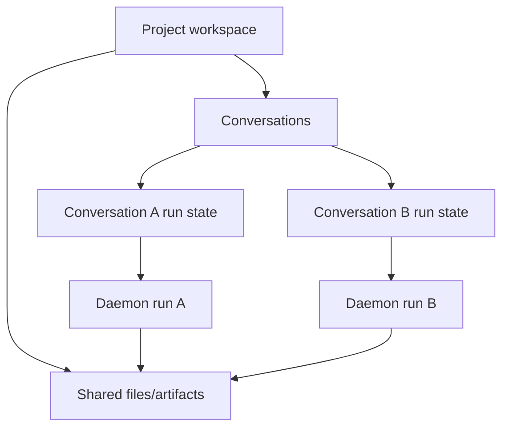

## Overview

Issue #138 reports that an unfinished task in one conversation blocks sending in another conversation in the same project. Related issue #148 describes the same underlying run-state isolation bug as leaked running/failed/elapsed state across conversations.

Goal: make chat run UI state conversation-scoped while keeping the project workspace shared.

Constraints:
- Do not introduce a project-level writer lock or run scheduler for this fix.
- Allow multiple conversations in the same project to run concurrently.
- Let real file-write conflicts fail visibly through the existing agent/tool path.
- Keep daemon run cancellation explicit: switching conversations should detach local SSE listeners, not cancel background runs.

Open questions:
- Whether future UX should surface a project-wide “another conversation is modifying files” hint.
- Whether future persistence should guarantee long-running background transcript recovery beyond the current daemon event buffer behavior.

## Research

### Existing System

- `ProjectView` currently stores chat busy state as one project-level `streaming` boolean. Source: `apps/web/src/components/ProjectView.tsx:263`
- `handleSend` blocks every send when `streaming` is true, regardless of active conversation. Source: `apps/web/src/components/ProjectView.tsx:1073-1082`
- `ChatComposer` uses the same `streaming` prop to prevent submit and switch the send button into Stop mode. Source: `apps/web/src/components/ChatComposer.tsx:599-627,910-929`
- Conversation switches abort browser-side SSE listeners and leave daemon runs alive; cleanup intentionally avoids aborting cancel signals. Source: `apps/web/src/components/ProjectView.tsx:428-453`
- Reattach already queries active runs by `projectId` and `conversationId`. Source: `apps/web/src/components/ProjectView.tsx:864-899`, `apps/web/src/providers/daemon.ts:204-210`
- The daemon run service stores `projectId`, `conversationId`, and `assistantMessageId` on each run. Source: `apps/daemon/src/runs.ts:15-24`
- The daemon run list supports filtering by project, conversation, and active status. Source: `apps/daemon/src/runs.ts:117-123`, `apps/daemon/src/chat-routes.ts:65-70`
- Run creation does not enforce a project-wide mutex. Source: `apps/daemon/src/chat-routes.ts:46-63`

### Available Approaches

- **Conversation-scoped UI busy state**: track active run/listener state per conversation and derive current composer state from `activeConversationId`. Source: `apps/web/src/components/ProjectView.tsx:256-263,1073-1082`
- **Project-level scheduler/lock**: serialize runs per project, which conflicts with #138’s requirement that a fresh conversation can send while another remains unfinished. Source: issue #138 discussion and `apps/daemon/src/chat-routes.ts:46-63`
- **Daemon API rewrite**: unnecessary for the primary fix because run identity and filters already include `conversationId`. Source: `apps/daemon/src/runs.ts:15-24,117-123`

### Constraints & Dependencies

- Project files and live artifacts remain project-scoped shared resources, so concurrent conversations can produce interleaved file events. Source: `apps/web/src/components/ProjectView.tsx:552-617,1173-1226`
- Stop handling currently cancels all active assistant messages visible in the current `messages` array and uses shared cancel refs; it must become current-conversation scoped. Source: `apps/web/src/components/ProjectView.tsx:1640-1674`
- Completion notification logic depends on a `streaming` true-to-false edge and must be adjusted when busy state becomes conversation-scoped. Source: `apps/web/src/components/ProjectView.tsx:469-523`

### Key References

- GitHub issue #138 - user-facing send block symptom.
- GitHub issue #148 - duplicate state-leak regression case.

## Design

### Architecture Overview

### Change Scope

- Area: `ProjectView` run lifecycle. Impact: replace project-wide chat busy assumptions with current-conversation busy derivation. Source: `apps/web/src/components/ProjectView.tsx:263,1073-1082`
- Area: `ChatPane` / `ChatComposer` props. Impact: composer should receive whether the active conversation is busy, not whether any project run is busy. Source: `apps/web/src/components/ProjectView.tsx:2129-2152`, `apps/web/src/components/ChatComposer.tsx:599-627,910-929`
- Area: run reattach and stop behavior. Impact: reattach and cancellation should apply to the active conversation’s run only. Source: `apps/web/src/components/ProjectView.tsx:864-899,1640-1674`
- Area: daemon tests. Impact: add/keep regression coverage for conversation-filtered active run listing. Source: `apps/daemon/src/runs.ts:117-123`

### Design Decisions

- Decision: Track chat run busy state at conversation granularity in the web UI, and derive `currentConversationBusy` from `activeConversationId`. Source: `apps/web/src/components/ProjectView.tsx:256-263,1073-1082`
- Decision: Keep project files/artifacts project-scoped and allow concurrent writes to fail through the existing tool/file path. Source: `apps/web/src/components/ProjectView.tsx:552-617,1173-1226`
- Decision: Do not add daemon-level project serialization in this fix because daemon runs are already conversation-identifiable and unblocked at creation. Source: `apps/daemon/src/runs.ts:15-24`, `apps/daemon/src/chat-routes.ts:46-63`
- Decision: Conversation switching should detach browser SSE listeners while preserving daemon background runs. Source: `apps/web/src/components/ProjectView.tsx:428-453`
- Decision: Stop should target only the current conversation’s active run/controller. Source: `apps/web/src/components/ProjectView.tsx:1640-1674`

### Why this design

- It fixes the state boundary mismatch directly: conversation owns messaging/run UI state, project owns shared files.
- It keeps the implementation small and observable.
- It preserves fail-fast behavior for real concurrent file conflicts instead of hiding them behind queues or optimistic merges.

### Test Strategy

Primary validation should be unit/component tests. E2E is optional later because reliably creating a long-running agent run requires a deterministic test agent or fixture.

#### Web component/unit tests

Add a focused regression file such as `apps/web/tests/components/ProjectView.run-isolation.test.tsx`.

- Test #138 send-lock regression:
  - Arrange project `p1` with conversations `conv-a` and `conv-b`.
  - Load `conv-a` messages with an assistant message whose `runStatus` is `running` and `runId` is `run-a`.
  - Switch to `conv-b` or create/select `conv-b` with no active run.
  - Type in the composer and click Send.
  - Assert the composer shows Send mode for `conv-b` and sending is not blocked by `conv-a`.
  - Assert the daemon run creation body includes `conversationId: 'conv-b'`.
  - Source: `apps/web/src/components/ProjectView.tsx:1073-1082,1353-1362,2129-2152`

- Test #148 state-leak regression:
  - Arrange `conv-a` with `runStatus: 'running'` or `runStatus: 'failed'` and elapsed/error state.
  - Switch to `conv-b` whose messages have no active assistant run.
  - Assert `conv-b` does not render `conv-a` running/failed/elapsed state.
  - Assert the composer is in Send mode and the last `conv-b` assistant message is not treated as streaming.
  - Source: `apps/web/src/components/ChatPane.tsx:304-307`, `apps/web/src/components/ProjectView.tsx:2129-2152`

- Test conversation switch preserves background run:
  - Arrange `conv-a` with active `run-a` and a mounted SSE listener.
  - Switch to `conv-b`.
  - Assert browser-side listener cleanup runs without calling `/api/runs/run-a/cancel`.
  - Switch back to `conv-a`.
  - Assert reattach queries active runs for `projectId: 'p1'` and `conversationId: 'conv-a'`.
  - Source: `apps/web/src/components/ProjectView.tsx:428-453,864-899`, `apps/web/src/providers/daemon.ts:204-210`

- Test Stop scope:
  - Arrange `conv-a` and `conv-b` each with active run state.
  - Make `conv-b` active and click Stop.
  - Assert only `/api/runs/<run-b>/cancel` is called.
  - Assert `conv-a` remains active and is not marked canceled by the current view.
  - Source: `apps/web/src/components/ProjectView.tsx:1640-1674`

#### Daemon unit test

Add to `apps/daemon/tests/runs.test.ts`:

- Create two active runs in the same project with `conversationId: 'conv-a'` and `conversationId: 'conv-b'`.
- Call `runs.list({ projectId: 'p1', conversationId: 'conv-b', status: 'active' })`.
- Assert only the `conv-b` run is returned.
- Source: `apps/daemon/src/runs.ts:117-123`

#### Validation commands

- `pnpm --filter @open-design/web test`
- `pnpm --filter @open-design/daemon test`
- `pnpm typecheck`

### Pseudocode

Flow:
  On send:
    if activeConversationId is missing, return
    if currentConversationBusy, return
    create user + assistant message in active conversation
    start daemon run with active conversationId
    mark activeConversationId busy with run/controller metadata

  On conversation switch:
    detach current browser SSE listener
    keep daemon run alive
    load selected conversation messages
    derive composer busy from selected conversation state/messages
    reattach selected conversation active run when present

  On stop:
    find current activeConversationId run/controller
    abort its cancel signal
    mark only current conversation messages canceled

### File Structure

- `apps/web/src/components/ProjectView.tsx` - conversation-scoped run state, send gate, stop, reattach, notification edge adjustments.
- `apps/web/src/components/ChatPane.tsx` - pass active-conversation busy state to composer and message streaming render.
- `apps/web/src/components/ChatComposer.tsx` - unchanged semantics, receives scoped busy prop via existing `streaming` prop or renamed prop.
- `apps/web/tests/components/*` - regression coverage for #138/#148 behavior.
- `apps/daemon/tests/runs.test.ts` - daemon run filtering regression.

## Plan

- [x] Step 1: Add regression coverage
  - [x] Substep 1.1 Verify: reproduce blocked send when another conversation has an active run.
  - [x] Substep 1.2 Verify: cover conversation-filtered active run listing in daemon service.
- [x] Step 2: Scope web run UI state to active conversation
  - [x] Substep 2.1 Implement: derive busy state from active conversation load/run state.
  - [x] Substep 2.2 Implement: clear stale message/render state on conversation switches.
  - [x] Substep 2.3 Implement: block sends while target conversation messages are still loading.
  - [x] Substep 2.4 Verify: prevent duplicate empty conversation creation while a fresh conversation is loading.
- [x] Step 3: Validate implementation
  - [x] Substep 3.1 Verify: run focused ProjectView regression tests.
  - [x] Substep 3.2 Verify: run focused daemon run service test.
  - [x] Substep 3.3 Verify: run guard and typecheck.

## Notes

<!-- Optional sections — add what's relevant. -->

### Implementation

- `apps/web/src/components/ProjectView.tsx` - added active-conversation message ownership state, loading-aware busy derivation, send gating, and synchronous conversation-switch cleanup.
- `apps/web/tests/components/ProjectView.run-isolation.test.tsx` - added regression tests for sending in a different conversation, loading-window send blocking, and fresh-conversation duplicate prevention.
- `apps/daemon/tests/runs.test.ts` - added service-level regression coverage for active run filtering by conversation within one project.

### Verification

- Confirmed new web regression failed before the fix: `expected 'streaming' to be 'idle'` after switching to `conv-b`.
- `pnpm --filter @open-design/web exec vitest run -c vitest.config.ts tests/components/ProjectView.run-isolation.test.tsx tests/components/ProjectView.run-cleanup.test.tsx tests/components/ProjectView.pendingPrompt.test.tsx` - passed.
- `pnpm --filter @open-design/daemon exec vitest run -c vitest.config.ts tests/runs.test.ts` - passed.
- `pnpm --filter @open-design/web typecheck` - passed.
- `pnpm guard` - passed.
- `pnpm typecheck` - passed.
- Reviewer subagent final pass: no remaining blocking issues.
