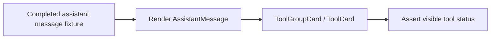

## Overview

### Problem Statement
- GitHub issue 145 reports that artifact generation can complete while the chat task/tool status remains visually stuck on "running".
- The current discussion narrowed reproduction to a unit-level case: an assistant message has ended successfully, but a `tool_use` event has no paired `tool_result`.

### Goal
- Add a web unit/component test that reproduces the issue deterministically.
- Prefer a focused `AssistantMessage` rendering test over e2e because the failure is a UI state derivation bug.

### Scope
- Cover the case `streaming={false}` + `endedAt`/succeeded message + missing `tool_result`.
- Verify the current behavior exposes `Running`, then use the test as the regression target for the fix.

### Success Criteria
- The test fails against the current buggy behavior when written with the desired expectation: completed message should not show a running tool state.
- After the implementation fix, the same test passes.

## Research

### Existing System
- `AssistantMessage` builds render blocks from `message.events` and passes `streaming` to tool groups; `endedAt` is only used by the footer. Source: `apps/web/src/components/AssistantMessage.tsx:68-75,124-130,151-157`.
- `ProjectView` marks an assistant message complete on successful stream completion by setting `endedAt`, resolving run status to succeeded, and setting `streaming` false. Source: `apps/web/src/components/ProjectView.tsx:1250-1268`.
- Web SSE handling calls `handlers.onDone(acc)` after receiving or recovering a terminal succeeded status. Source: `apps/web/src/providers/daemon.ts:338-371`.
- Daemon run completion emits an `end` event and closes SSE clients, but this run-level completion path does not synthesize missing tool results. Source: `apps/daemon/src/runs.ts:72-80`.
- Tool group summaries currently treat any tool item without `result` as running. Source: `apps/web/src/components/AssistantMessage.tsx:633-639,736-739`.
- Individual tool badges currently treat missing `result` as `op-status-running`. Source: `apps/web/src/components/ToolCard.tsx:330-334`.

### Available Approaches
- **Component/unit reproduction**: render `AssistantMessage` with a completed assistant message containing `tool_use` without `tool_result`. This directly targets the UI state derivation. Source: `apps/web/src/components/AssistantMessage.tsx:56-67,736-739`; `apps/web/src/components/ToolCard.tsx:330-334`.
- **Provider-level reproduction**: simulate SSE `tool_use -> end` and assert the provider calls `onDone` while events remain unpaired. This proves the upstream state is possible, while the visible bug still needs component coverage. Source: `apps/web/src/providers/daemon.ts:338-371,440-449`.
- **E2E reproduction**: mock or force a daemon stream sequence `tool_use -> end`; this covers the full UI but requires more harness control. Source: `apps/daemon/src/runs.ts:49-56,72-80`; `apps/web/src/providers/daemon.ts:338-371`.

### Constraints & Dependencies
- App tests belong under `apps/web/tests/`, not under `apps/web/src/`. Source: `apps/AGENTS.md#Test layout`.
- The repository prefers package-scoped validation, including `pnpm --filter @open-design/web test`. Source: `AGENTS.md#Common commands`.
- The current requested scope is reproduction via unit test; implementation fix can follow after the failing/pinning test is in place. Source: conversation.

### Key References
- `apps/web/src/components/AssistantMessage.tsx:633-639,736-739` - missing tool result maps to running state.
- `apps/web/src/components/ToolCard.tsx:330-334` - missing result renders the running badge.
- `apps/web/src/components/ProjectView.tsx:1250-1268` - message completion is tracked separately from tool result pairing.
- `apps/daemon/src/runs.ts:72-80` - run end is emitted at the daemon level.

## Design

### Architecture Overview



### Change Scope
- Area: web component tests. Impact: deterministic regression coverage for issue 145 without requiring daemon or Playwright orchestration. Source: `apps/web/src/components/AssistantMessage.tsx:56-67`; `apps/AGENTS.md#Test layout`.
- Area: assistant message/tool rendering. Impact: test exercises the current `tool_use` without `tool_result` path. Source: `apps/web/src/components/AssistantMessage.tsx:763-817`; `apps/web/src/components/ToolCard.tsx:330-334`.

### Design Decisions
- Decision: Add a component test for `AssistantMessage` rather than an e2e test as the first reproduction. Source: `apps/web/src/components/AssistantMessage.tsx:736-739`; `apps/web/src/components/ToolCard.tsx:330-334`.
- Decision: Use a fixture with `streaming={false}`, `endedAt`, `runStatus: 'succeeded'`, and a single `tool_use` event missing `tool_result`. Source: `apps/web/src/components/ProjectView.tsx:1250-1268`; `apps/web/src/components/AssistantMessage.tsx:785-788`.
- Decision: Place the test under `apps/web/tests/components/`, matching existing component test ownership. Source: `apps/AGENTS.md#Test layout`; `apps/web/tests/components/assistant-message-unfinished-todos.test.tsx`.
- Decision: Write the desired post-fix assertion: completed assistant messages should not present a missing result as a running tool state. Source: `apps/web/src/components/AssistantMessage.tsx:151-157,736-739`; `apps/web/src/components/ToolCard.tsx:330-334`.

### Why this design
- The bug is produced by UI state derivation: message completion and tool result pairing are tracked independently.
- A component test can reproduce the precise state directly and runs faster than an e2e flow.
- Provider or e2e coverage can be added later after the UI regression test pins the expected behavior.

### Test Strategy
- Add a Vitest/Testing Library component test in `apps/web/tests/components/assistant-message-tool-status.test.tsx`. Validation: render a completed assistant message with an unpaired `Write` tool and assert the completed message does not show `Running`. Source: `apps/web/src/components/AssistantMessage.tsx:56-67`; `apps/web/src/components/ToolCard.tsx:330-334`.
- Run `pnpm --filter @open-design/web test` after adding the test. Source: `AGENTS.md#Common commands`.

### Pseudocode

```ts
render(
  <AssistantMessage
    message={{
      id: 'assistant-1',
      role: 'assistant',
      content: '',
      startedAt: 1000,
      endedAt: 2000,
      runStatus: 'succeeded',
      events: [
        { kind: 'tool_use', id: 'tool-1', name: 'Write', input: { file_path: 'index.html', content: '<html>done</html>' } },
      ],
    }}
    streaming={false}
    projectId="project-1"
  />
);

expect(screen.queryByText(/running/i)).toBeNull();
expect(screen.getByText(/done/i)).toBeInTheDocument();
```

### File Structure
- `apps/web/tests/components/assistant-message-tool-status.test.tsx` - focused reproduction/regression test for completed messages with unpaired tool events.

## Plan

- [x] Step 1: Add issue 145 reproduction test
  - [x] Substep 1.1 Implement: create `assistant-message-tool-status.test.tsx` with the completed-message/unpaired-tool fixture.
  - [x] Substep 1.2 Verify: run the web component test and confirm it exposes the current bug with the desired assertion.
- [x] Step 2: Apply UI status fix
  - [x] Substep 2.1 Implement: update assistant/tool rendering so completed runs do not display missing tool results as running.
  - [x] Substep 2.2 Verify: rerun the web test and confirm it passes.

## Notes

<!-- Optional sections — add what's relevant. -->

### Implementation

- `apps/web/tests/components/assistant-message-tool-status.test.tsx` - added issue 145 regression coverage for completed and streaming runs with missing `tool_result`.
- `apps/web/src/components/AssistantMessage.tsx` - made grouped tool summary/running state depend on `runStreaming` so completed turns with missing results render as done.
- `apps/web/src/components/ToolCard.tsx` - threaded `runStreaming` into built-in result badges and treated missing results as done only after the run has ended.
- `apps/web/src/runtime/tool-renderers.ts` - aligned custom renderer status derivation with the same completed-run behavior.
- `apps/web/tests/runtime/tool-renderers.test.tsx` - updated renderer status expectations for completed runs missing a result.
- Follow-up review tightened the fallback so failed/canceled terminal runs with missing `tool_result` surface as error rather than done.

### Verification

- Reproduction confirmed before the fix: the new component test failed because a completed run without `tool_result` rendered `running…` instead of `Done`.
- Passed: `pnpm --filter @open-design/web test -- tests/components/assistant-message-tool-status.test.tsx tests/runtime/tool-renderers.test.tsx` (`84` files, `751` tests).
- Passed: `pnpm --filter @open-design/web typecheck`.
- Final code review found no blocking issues.
