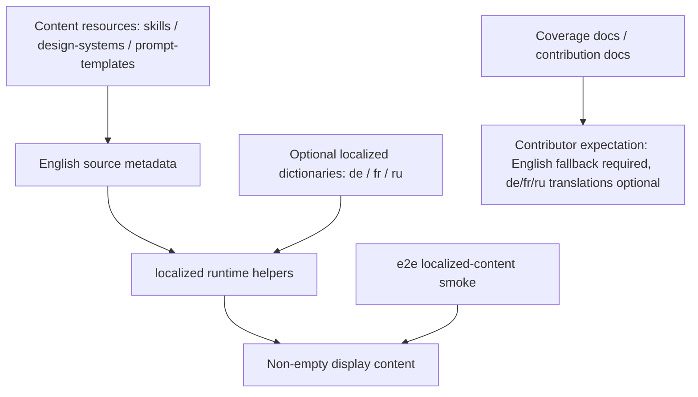

## Overview

### Problem Statement

- Content translations under `apps/web/src/i18n` include `de`, `fr`, and `ru`, but current translation coverage is incomplete.
- These content-oriented i18n translations need to become optional so content contributors are not required to fill in every related language entry.

### Goals

- Lower the barrier for content-oriented contributions.
- Reduce the chance of conflicts when multilingual content is completed later.

### Scope

- Adjust the requirements for content-oriented translations under `apps/web/src/i18n` so incomplete translations such as `de`, `fr`, and `ru` are optional.

### Success Criteria

- Content contributors can submit primary content changes without also completing every content-oriented i18n translation for `de`, `fr`, and `ru`.
- Incomplete `de`, `fr`, and `ru` content translations do not block the related contribution flow.

## Research

### Existing System

- `apps/web/src/i18n/content.ts` aggregates the three content bundles for `de`, `ru`, and `fr`, then builds `LOCALIZED_CONTENT_IDS` from each bundle's dictionary keys. Source: `apps/web/src/i18n/content.ts:954-996`
- Current content ids cover six resource groups: skills, designSystems, designSystemCategories, promptTemplates, promptTemplateCategories, and promptTemplateTags. Source: `apps/web/src/i18n/content.ts:26-33,981-989`
- The runtime already has English fallbacks: skill description / prompt, design-system summary, design-system category, prompt-template category / tags, and prompt-template title / summary fall back to source content or the original tag when translations are missing. Source: `apps/web/src/i18n/content.ts:1010-1053`
- Web unit tests confirm that localized ids only come from localized dictionaries, and that fields fall back to English source content or the original tag when localized copy is missing. Source: `apps/web/tests/i18n/content.test.ts:12-19,21-80`
- The E2E localized-content test reads real repository resources for skills, design systems, and prompt templates, then loops over `de`, `fr`, and `ru` to verify display content. Source: `e2e/tests/localized-content.test.ts:333-377`

### Current Mandatory Translation Triggers

- Adding a completely new Design System category triggers mandatory completion: the test extracts categories from `> Category:` in `design-systems/*/DESIGN.md` and requires each locale's `ids.designSystemCategories` to include every discovered category. Source: `e2e/tests/localized-content.test.ts:194-240,390,398-401`
- Adding a completely new Prompt Template category triggers mandatory completion: the test reads `category` from `prompt-templates/image/*.json` and `prompt-templates/video/*.json`, defaults missing values to `General`, and requires each locale's `ids.promptTemplateCategories` to cover every discovered category. Source: `e2e/tests/localized-content.test.ts:243-330,391-405`
- Adding a completely new Prompt Template tag triggers mandatory completion: the test reads prompt template `tags` arrays and requires each locale's `ids.promptTemplateTags` to cover every discovered tag. Source: `e2e/tests/localized-content.test.ts:313-318,394-409`
- Featured Skill / Design Template locale-specific display copy requirements come from the contribution docs: when `od.featured: 1` is set, the docs require complete localized display copy in `content.ts`, `content.fr.ts`, and `content.ru.ts`. Source: `docs/skills-contributing.md:197-202`

### Non-Mandatory or Already-Fallback Paths

- When adding a regular skill or design template, the E2E test requires the resource to be displayable; non-featured paths use English display fields from `SKILL.md` as the fallback. Source: `docs/skills-contributing.md:188-195`; `e2e/tests/localized-content.test.ts:155-191,351-357`
- When adding a design system summary, the docs say the localized summary dictionary is only updated when a translation already exists, and the English fallback applies automatically by default. Source: `docs/design-systems.md:251-273`
- When adding a prompt template title / summary, the E2E test only requires the localized result to be non-empty; at runtime, missing localized prompt-template copy falls back to the English `title` and `summary`. Source: `e2e/tests/localized-content.test.ts:366-375`; `apps/web/src/i18n/content.ts:1045-1051`
- Scenario tag UI labels use fixed i18n keys from `SCENARIO_LABEL_KEY`; unknown tags are title-cased from the original tag. Source: `apps/web/src/components/ExamplesTab.tsx:51-70,423-431`

### Available Approaches

- Adjust the E2E category/tag coverage assertions so the `de`, `fr`, and `ru` content dictionaries become optional for design-system categories, prompt-template categories, and prompt-template tags, relying on the existing runtime fallback. Source: `e2e/tests/localized-content.test.ts:380-409`; `apps/web/src/i18n/content.ts:1031-1052`
- Preserve smoke coverage that resources are displayable: continue verifying that skills, design systems, and prompt templates produce non-empty display content under `de`, `fr`, and `ru`. Source: `e2e/tests/localized-content.test.ts:333-377`
- Update contribution docs to change featured localized copy from required to optional or recommended, and explicitly describe the English fallback path. Source: `docs/skills-contributing.md:188-202`
- Update the coverage docs for localized-content so they describe "displayable + fallback" instead of "every locale covers every id / category / tag." Source: `docs/testing/e2e-coverage/settings.md:68-69,121`

### Constraints & Dependencies

- `LOCALIZED_CONTENT_IDS` is currently generated directly from localized dictionary keys; any test that still uses these ids for full array-containing coverage will make missing translations blocking. Source: `apps/web/src/i18n/content.ts:981-996`; `e2e/tests/localized-content.test.ts:398-409`
- When a prompt template category is missing, the test resource reader classifies it as `General`; newly added templates without a category still enter the `General` coverage set. Source: `e2e/tests/localized-content.test.ts:311-312`
- Prompt template tags filter out non-string and empty string values, so mandatory coverage only applies to valid non-empty tags. Source: `e2e/tests/localized-content.test.ts:313-318`
- The contribution docs currently mark featured localized copy as a required path; the implementation change must update those docs too, otherwise content contributors will still be asked by the docs to complete translations. Source: `docs/skills-contributing.md:197-202,232-241`

### Key References

- `apps/web/src/i18n/content.ts:954-1053` - localized bundles, content ids, and runtime fallback.
- `e2e/tests/localized-content.test.ts:333-409` - localized display coverage and mandatory category/tag coverage assertions.
- `apps/web/tests/i18n/content.test.ts:12-80` - localized ids and fallback unit tests.
- `docs/skills-contributing.md:188-202,232-241` - skill / design-template i18n contribution requirements.
- `docs/design-systems.md:251-273` - design-system localized summary fallback docs.
- `docs/testing/e2e-coverage/settings.md:68-69,121` - e2e coverage docs describing localized-content.

## Design

### Architecture Overview

### Change Scope

- Area: category / tag coverage assertions in `e2e/tests/localized-content.test.ts`. Impact: remove the hard requirement that `de` / `fr` / `ru` dictionaries cover every discovered design-system category, prompt-template category, and prompt-template tag, while preserving the resource display smoke test. Source: `e2e/tests/localized-content.test.ts:333-409`
- Area: runtime fallback in `apps/web/src/i18n/content.ts`. Impact: this is the runtime foundation for optional translations; no new fallback mechanism is required. Source: `apps/web/src/i18n/content.ts:1010-1053`
- Area: fallback unit tests in `apps/web/tests/i18n/content.test.ts`. Impact: strengthen or preserve field-level fallback assertions to ensure English source fields still apply when localized copy is missing. Source: `apps/web/tests/i18n/content.test.ts:21-80`
- Area: `docs/skills-contributing.md` and `docs/testing/e2e-coverage/settings.md`. Impact: update contributor requirements and coverage descriptions to say "English fallback required, localized copy optional." Source: `docs/skills-contributing.md:188-202,232-241`; `docs/testing/e2e-coverage/settings.md:68-69,121`
- Area: `docs/design-systems.md`. Impact: keep the existing design-system fallback docs semantically aligned, and only update wording if synchronization is needed. Source: `docs/design-systems.md:251-273`

### Design Decisions

- Decision: Do not change how `LOCALIZED_CONTENT_IDS` is generated; it continues to express "the set of ids that currently have translations for this locale." Source: `apps/web/src/i18n/content.ts:981-996`; `apps/web/tests/i18n/content.test.ts:12-19`
- Decision: Delete or rewrite the full coverage assertion in E2E named `covers every discovered design-system category and prompt tag`, making category / tag dictionary keys an optional translation list. Source: `e2e/tests/localized-content.test.ts:380-409`; `apps/web/src/i18n/content.ts:1031-1052`
- Decision: Keep the E2E smoke test `derives displayable resources from discovered English fallback content`, so skills, design systems, and prompt templates must still produce displayable non-empty content under `de` / `fr` / `ru`. Source: `e2e/tests/localized-content.test.ts:333-377`
- Decision: Keep fail-fast English fallback validation in the resource-reading phase, such as missing `description`, design-system `category`, or prompt-template `title` / `summary`. Source: `e2e/tests/localized-content.test.ts:155-179,194-240,243-330`
- Decision: Change docs so featured localized copy becomes a recommended enhancement path, while the required path for contribution PRs focuses on complete English display copy and fallback coverage. Source: `docs/skills-contributing.md:188-202,232-241`
- Decision: Rewrite SET-043 / SET-044 in the coverage matrix as fallback display integrity and optional translation validation, so the docs no longer express full locale / full id coverage. Source: `docs/testing/e2e-coverage/settings.md:68-69,121`

### Why this design

- The runtime already has field-level fallback, so the change is mainly to shift tests and docs from a "translation completeness gate" to a "display integrity gate."
- `LOCALIZED_CONTENT_IDS` keeps its current meaning, so it can still be used later to show translation coverage or inspect existing translation dictionaries.
- Resources still must provide complete English metadata, and missing truly required fallback inputs continue to fail early.

### Test Strategy

- E2E: run `pnpm --filter @open-design/e2e test tests/localized-content.test.ts` to verify real repository resources remain displayable under `de` / `fr` / `ru`, and missing category / tag translations do not block. Source: `e2e/tests/localized-content.test.ts:333-377`; `e2e/AGENTS.md:40-55`
- Web unit: run `pnpm --filter @open-design/web test` to cover localized ids still coming from dictionaries, plus skill/design-system/prompt-template field-level fallback. Source: `apps/web/tests/i18n/content.test.ts:12-80`; `apps/AGENTS.md:27-33,47-59`
- Probe: temporarily add a probe content resource without matching `de` / `fr` / `ru` localized dictionary entries, then run CI-equivalent verification to confirm English fallback is displayable and missing optional translations do not block; remove the temporary probe content afterward. Source: `e2e/tests/localized-content.test.ts:155-409`; `docs/skills-contributing.md:188-202`
- Repo checks: run `pnpm guard` and `pnpm typecheck` to cover repository-level scripts and type boundaries. Source: `AGENTS.md#validation-strategy`

### Pseudocode

Flow:
  1. Read real resources and validate required English fallback metadata fields.
  2. Call the runtime localization helper for `de` / `fr` / `ru`.
  3. Assert that skill description, design-system summary, and prompt-template title / summary are non-empty.
  4. Let design-system category, prompt-template category, and prompt-template tag use original-value fallback when localized dictionary entries are missing.
  5. Document localized dictionaries as optional enhancements, while English fallback metadata is required for contributions.

### File Structure

- `e2e/tests/localized-content.test.ts` - adjust category / tag coverage tests and keep the real-resource fallback smoke test.
- `apps/web/tests/i18n/content.test.ts` - preserve or strengthen fallback unit tests.
- `docs/skills-contributing.md` - update skill / design-template contribution i18n requirements.
- `docs/testing/e2e-coverage/settings.md` - update localized-content coverage matrix descriptions.
- `docs/design-systems.md` - synchronize wording if needed so design-system fallback docs stay consistent.

### Interfaces / APIs

- No external API, DTO, database schema, or sidecar protocol changes.
- The `LOCALIZED_CONTENT_IDS` export remains unchanged and continues to represent the key set of existing localized dictionaries. Source: `apps/web/src/i18n/content.ts:981-1000`

### Edge Cases

- A prompt template without `category` continues to be classified as `General`; if `General` has no localized copy, it falls back to the original value. Source: `e2e/tests/localized-content.test.ts:311-312`; `apps/web/src/i18n/content.ts:1035-1052`
- Prompt template tags only apply to valid non-empty strings; a missing localized tag falls back to the original tag. Source: `e2e/tests/localized-content.test.ts:313-318`; `apps/web/src/i18n/content.ts:1045-1052`
- A featured skill without localized copy displays the English fallback, and the docs position localized copy as a recommended enhancement path. Source: `docs/skills-contributing.md:188-202`
- Missing English fallback metadata continues to fail, preventing empty display content from hiding resource errors. Source: `e2e/tests/localized-content.test.ts:155-179,194-240,243-330`

## Plan

- [x] Step 1: Adjust the localized-content test gate
  - [x] Substep 1.1 Implement: Remove or rewrite the full coverage assertions that compare `LOCALIZED_CONTENT_IDS` against discovered categories / tags.
  - [x] Substep 1.2 Implement: Preserve the fallback smoke test that real resources display non-empty content under `de` / `fr` / `ru`.
  - [x] Substep 1.3 Implement: Add direct category / tag fallback assertions when needed, covering the behavior where missing dictionary entries return original values.
  - [x] Substep 1.4 Verify: Run `pnpm --filter @open-design/e2e test tests/localized-content.test.ts`.
- [x] Step 2: Synchronize contribution and coverage docs
  - [x] Substep 2.1 Implement: Update `docs/skills-contributing.md` so featured localized copy is described as an optional enhancement path.
  - [x] Substep 2.2 Implement: Update SET-043 / SET-044 coverage descriptions in `docs/testing/e2e-coverage/settings.md`.
  - [x] Substep 2.3 Implement: Review `docs/design-systems.md` for consistency with the new semantics, and make minor wording adjustments only if needed.
  - [x] Substep 2.4 Verify: Manually check that the docs no longer describe `de` / `fr` / `ru` content translations as a hard blocking requirement for content contributions.
- [x] Step 3: Regression verification
  - [x] Substep 3.1 Verify: Run `pnpm --filter @open-design/web test`.
  - [x] Substep 3.2 Verify: Temporarily add a probe content resource without `de` / `fr` / `ru` localized dictionary entries, run CI-equivalent verification, confirm it passes, then remove the probe content.
  - [x] Substep 3.3 Verify: Run `pnpm guard`.
  - [x] Substep 3.4 Verify: Run `pnpm typecheck`.

## Notes

### Implementation

- `e2e/tests/localized-content.test.ts` - removed the full coverage gate that compared discovered category / tag values against `LOCALIZED_CONTENT_IDS`, kept the real-resource displayability smoke test, and added direct assertions that design-system category plus prompt-template category / tag values fall back to source values when dictionary entries are missing.
- `apps/web/tests/i18n/content.test.ts` - strengthened the unit assertion for fallback behavior when a prompt-template category is unknown.
- `docs/skills-contributing.md` - changed localized display copy into an optional enhancement path for featured skills, and clarified that tests focus on displayable resources and fallback behavior.
- `docs/testing/e2e-coverage/settings.md` - rewrote SET-043 / SET-044 as fallback display integrity and optional translation behavior coverage.
- `docs/design-systems.md` - existing wording already described English fallback and optional localized summaries, so no change was needed.

### Verification

- `pnpm --filter @open-design/web test tests/i18n/content.test.ts` - passed.
- `pnpm --filter @open-design/e2e test tests/localized-content.test.ts` - initially found and cleaned up a pre-existing probe empty directory, then passed.
- Temporarily added English-only skill, design template, design system, and prompt template probes, then ran `pnpm --filter @open-design/e2e test tests/localized-content.test.ts` - passed; removed the temporary probe content afterward.
- `pnpm --filter @open-design/e2e test tests/localized-content.test.ts` - final passed.
- `pnpm --filter @open-design/web test` - passed, 110 files / 1013 tests.
- `pnpm guard` - passed.
- `pnpm typecheck` - passed.
