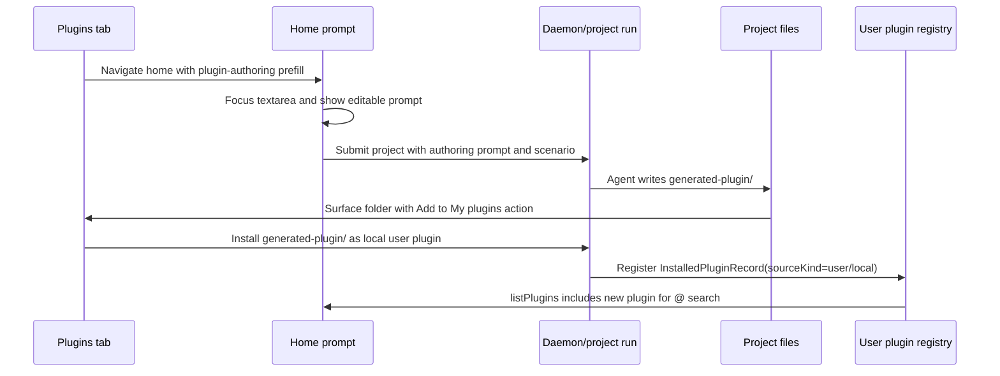

# Plugin authoring flow plan

**Parent:** [`spec.md`](../../docs/spec.md) · **Related:** [`plugin-driven-flow-plan.md`](plugin-driven-flow-plan.md) · [`plugins-implementation.md`](../../docs/plans/plugins-implementation.md)

## Purpose

Make "create my own plugin" a first-class product flow instead of a disconnected future tab. A user should be able to start from the Plugins area, land on the Home prompt with an authoring query already prepared, run an agent task that produces an Open Design plugin folder, inspect that folder as project output, and add it to `My plugins` with one click.

This plan is intentionally focused on the authoring loop. Marketplace publishing, enterprise private catalogs, and team review policies stay out of scope.

## Requirements

- R1. Plugins tab exposes a create entry that starts a guided plugin authoring task instead of only offering import options.
- R2. The create entry navigates to Home, focuses `HomeHero`'s textarea, and pre-fills a prompt grounded in the Open Design plugin spec.
- R3. The task should create a real plugin folder containing at minimum `SKILL.md` and `open-design.json`, with optional examples/assets when the user asks for them.
- R4. Project output must support selecting or viewing the generated plugin folder as a folder, not only as flat single files.
- R5. A generated plugin folder can be installed into the user plugin registry and then appears in `My plugins` and Home `@` search.
- R6. Home's intent rail can later add a "Create plugin" chip that reuses the same authoring route and prompt contract.

## Scope boundaries

- No marketplace publishing in this pass. Installing to `My plugins` is enough.
- No enterprise/team catalog permissions in this pass.
- No new plugin spec dialect. The generated folder must validate against the existing Open Design plugin shape in `docs/plugins-spec.md` and `docs/schemas/open-design.plugin.v1.json`.
- No requirement to build a full visual plugin IDE. The first version is an agent-guided task plus a one-click install action.

### Deferred to follow-up work

- Home rail "Create plugin" chip can be implemented in a parallel task, as long as it calls the same Home prefill/focus contract defined here.
- Marketplace publishing and team review workflows belong after local authoring and `My plugins` install are reliable.

## Current code context

- `apps/web/src/components/PluginsView.tsx` already owns the Plugins tab, `Create / Import` button, import modal, `My plugins` tab, and refresh-after-install behavior.
- `apps/web/src/components/HomeView.tsx` owns prompt state, plugin apply lifecycle, and `HomeHero` focus via `inputRef`.
- `apps/web/src/components/HomeHero.tsx` renders the textarea, `@` picker, and intent rail.
- `apps/web/src/components/home-hero/chips.ts` defines the current rail chips. It is the right place for a future declarative `create-plugin` chip.
- `apps/web/src/components/EntryShell.tsx` owns view switching and the Home submit path that creates a project with `pendingPrompt` and `autoSendFirstMessage`.
- `apps/web/src/state/projects.ts` already exposes `installPluginSource`, `uploadPluginFolder`, and `uploadPluginZip` for user plugin installation.
- `apps/daemon/src/server.ts` already exposes `/api/plugins/install`, `/api/plugins/upload-folder`, `/api/plugins/upload-zip`, and `/api/applied-plugins/export`.
- `apps/daemon/src/plugins/scaffold.ts`, `apps/daemon/src/plugins/export.ts`, and `apps/daemon/src/plugins/validate.ts` already encode scaffold/export/validate behavior that the authoring flow should reuse.

## Key decisions

- The product entry is "Create plugin", not "Create from template" alone. Template scaffolding is one possible implementation detail, but the user intent is to describe a workflow and let the agent produce a plugin.
- The first supported entry should be Plugins tab → Home prompt prefill. This gives a working authoring loop before the Home rail gets another chip.
- Use a dedicated bundled scenario plugin for authoring if possible, e.g. `od-plugin-authoring`. Falling back to `od-new-generation` plus a long prompt is acceptable only as an interim bridge.
- The generated plugin folder should live inside the project work directory so it can be inspected, edited, and installed without forcing a browser folder upload.
- One-click "Add to My plugins" should install from a daemon-visible project output path through the same local install path used by `/api/plugins/install`, then refresh web plugin state.

## High-level flow

> This illustrates the intended approach and is directional guidance for review, not implementation specification.



## Proposed implementation units

- [x] U1. **Home prefill and focus contract**

  **Goal:** Add a reusable way to navigate to Home with a prefilled prompt and focus the textarea.

  **Files:**
  - Modify: `apps/web/src/router.ts`
  - Modify: `apps/web/src/components/EntryShell.tsx`
  - Modify: `apps/web/src/components/HomeView.tsx`
  - Test: `apps/web/tests/router-marketplace.test.ts`
  - Test: `apps/web/tests/components/HomeHero.plugin-picker.test.tsx` or a new `apps/web/tests/components/HomeView.prefill.test.tsx`

  **Approach:**
  - Prefer a small route/session handoff rather than global singleton state. The handoff should carry `{ prompt, focus: true, source: 'plugin-authoring' }`.
  - `HomeView` should consume the handoff once, set `prompt`, and call the existing textarea ref focus path.
  - Keep the prompt user-editable before submit.

  **Test scenarios:**
  - Happy path: navigating from Plugins with an authoring handoff renders Home, fills the textarea, and focuses it.
  - Edge case: refreshing Home after the handoff does not repeatedly overwrite a user's edited prompt.
  - Integration: submitting the prefilled prompt still creates a project through the existing `PluginLoopSubmit` path.

- [x] U2. **Plugins create entry**

  **Goal:** Turn the Plugins tab `Create / Import` surface into two clear actions: guided create and import.

  **Files:**
  - Modify: `apps/web/src/components/PluginsView.tsx`
  - Modify: `apps/web/src/styles/home/plugins-view.css`
  - Test: `apps/web/tests/components/PluginsView.test.tsx`

  **Approach:**
  - Keep GitHub/zip/folder import in the existing modal.
  - Add a primary `Create plugin` action that uses U1 to navigate to Home with a spec-grounded authoring prompt.
  - Keep "Create from template" in the import modal only if it launches the same authoring path or explicitly remains marked as coming soon.

  **Test scenarios:**
  - Happy path: clicking `Create plugin` triggers Home navigation with the expected prefill payload.
  - Regression: GitHub/zip/folder import still installs and lands in `My plugins`.
  - Accessibility: the create action has a clear button label and does not masquerade as a disabled tab.

- [x] U3. **Plugin authoring scenario**

  **Goal:** Give the agent a purpose-built plugin authoring context that asks for the right files and validation behavior.

  **Files:**
  - Create: `plugins/_official/scenarios/od-plugin-authoring/open-design.json`
  - Create: `plugins/_official/scenarios/od-plugin-authoring/SKILL.md`
  - Modify: `apps/web/src/components/home-hero/chips.ts` only when the Home rail chip lands
  - Test: `apps/daemon/tests/plugins-bundled-scenarios-roster.test.ts`
  - Test: `apps/daemon/tests/plugins-local-skill.test.ts`

  **Approach:**
  - The scenario should instruct the agent to output a folder such as `generated-plugin/` with `SKILL.md`, `open-design.json`, and optional `examples/` or `assets/`.
  - The prompt should cite the Open Design plugin spec and require validation-ready output, not a prose-only explanation.
  - If the scenario includes GenUI, it should present checklist/progress and final "Add to My plugins" affordance, but the install action itself should call a daemon API rather than relying on copy/paste.

  **Test scenarios:**
  - Happy path: bundled scenario appears in plugin list and can be applied.
  - Integration: applying the scenario injects its local `SKILL.md` body into the run snapshot.
  - Regression: regular `od-new-generation` and migration scenarios are unaffected.

- [x] U4. **Generated folder visibility in project output**

  **Goal:** Let users inspect and select a generated plugin folder from the project workspace.

  **Files:**
  - Modify: `apps/web/src/components/DesignFilesPanel.tsx`
  - Modify: `apps/web/src/components/FileWorkspace.tsx`
  - Modify: `apps/web/src/components/FileOpsSummary.tsx` if folder outputs are surfaced from tool/file ops
  - Modify: daemon project file listing endpoints in `apps/daemon/src/server.ts` if they currently flatten directories too aggressively
  - Test: `apps/web/tests/components/FileWorkspace.test.tsx`
  - Test: daemon project file listing tests near the existing project/file tests

  **Approach:**
  - Preserve relative paths so `generated-plugin/open-design.json` and `generated-plugin/SKILL.md` remain visibly grouped.
  - A minimal v1 can show a folder row in `DesignFilesPanel` and expand to its files; it does not need a full IDE tree.
  - The folder row should expose the install action only when it contains a plugin marker file.

  **Test scenarios:**
  - Happy path: a project with `generated-plugin/open-design.json` and `generated-plugin/SKILL.md` renders a folder group.
  - Edge case: nested files remain selectable without losing their relative path.
  - Error path: malformed or partial plugin folders do not show a misleading install success action.

- [x] U5. **Install generated folder as My plugin**

  **Goal:** Add a one-click action that installs a daemon-visible generated folder into the user plugin registry.

  **Files:**
  - Modify: `apps/web/src/state/projects.ts`
  - Modify: `apps/web/src/components/DesignFilesPanel.tsx` or the GenUI surface that owns the final action
  - Modify: `apps/daemon/src/server.ts`
  - Reuse: `apps/daemon/src/plugins/installer.ts`
  - Reuse: `apps/daemon/src/plugins/validate.ts`
  - Test: `apps/web/tests/state/projects.test.ts`
  - Test: `apps/web/tests/components/FileWorkspace.test.tsx`
  - Test: `apps/daemon/tests/plugins-installer.test.ts`
  - Test: `apps/daemon/tests/plugins-validate.test.ts`

  **Approach:**
  - Add a web helper such as `installGeneratedPluginFolder(projectId, relativePath)` rather than forcing a browser upload.
  - The daemon endpoint should resolve the folder under the project work directory, validate traversal safety, validate plugin shape, install through the existing installer, and return a `PluginInstallOutcome`-compatible response.
  - On success, web should refresh `listPlugins()`, switch/open `My plugins`, and make the plugin available to Home `@` search.

  **Test scenarios:**
  - Happy path: project output folder installs and appears as a user/local plugin.
  - Error path: invalid folder returns diagnostics and does not mutate installed plugins.
  - Security: `../` traversal or absolute paths outside the project root are rejected.
  - Integration: after install, `GET /api/plugins` includes the new record with non-`bundled` source kind.

- [x] U6. **Home rail create-plugin chip parity**

  **Goal:** Let the future Home rail entry use the same authoring flow without duplicating behavior.

  **Files:**
  - Modify: `apps/web/src/components/home-hero/chips.ts`
  - Modify: `apps/web/src/components/HomeView.tsx`
  - Modify: `apps/web/src/components/HomeHero.tsx`
  - Test: `apps/web/tests/components/HomeHero.rail.test.tsx`

  **Approach:**
  - Add a `create-plugin` chip action that invokes the U1 prefill/focus contract.
  - If this lands in a separate task session, keep the payload shape identical so Plugins tab and rail remain interchangeable entrypoints.

  **Test scenarios:**
  - Happy path: clicking the chip fills the same prompt as Plugins tab create.
  - Regression: existing Prototype/Image/Figma/Folder/Template chips continue dispatching their current actions.

## Prompt contract

The authoring prompt should be stable enough for tests and user trust. A first version can be:

```text
Create an Open Design plugin for: <user goal>.

Follow docs/plugins-spec.md and produce a folder named generated-plugin with:
- SKILL.md describing the agent behavior and workflow
- open-design.json with valid metadata, mode, task kind, inputs, and any pipeline/context references
- optional examples/ and assets/ when useful

When finished, summarize the files created and whether the folder is ready to add to My plugins.
```

Implementation can enrich this with the current locale and UI-provided goal, but the required output folder and marker files should stay stable.

## Risks

- **Generated output is prose-only:** Use a dedicated authoring scenario and prompt contract that explicitly requires files.
- **Folder paths become unsafe:** Resolve generated-folder installs relative to the project root only; reject traversal and absolute external paths.
- **Validation errors feel like failure:** Return validation diagnostics in the UI so users can ask the agent to fix the plugin instead of starting over.
- **Duplicate plugins:** Installer should use existing plugin id/version collision behavior and surface clear messages before overwriting or upgrading.
- **Two entrypoints diverge:** Plugins tab and Home rail must share the same prefill payload and prompt contract.

## Verification plan

- Web component coverage for Plugins create entry, Home prefill/focus, and rail parity.
- Web state coverage for installing a generated project folder.
- Daemon tests for project-root path resolution, validation failure, and successful install.
- End-to-end smoke path once the authoring scenario lands: Plugins → Create plugin → Home submit → project produces `generated-plugin/` → Add to My plugins → Home `@` search finds the new plugin.

## Open questions

- Should the generated plugin folder default to `generated-plugin/` or `<plugin-id>/`? The plan assumes `generated-plugin/` for predictable UI detection, with final install using the manifest id.
- Should "Add to My plugins" live in `DesignFilesPanel`, a GenUI final surface, or both? The plan allows both, but v1 should pick one primary owner.
- Should the daemon expose a scaffold API now, or should the authoring scenario ask the agent to create files directly? Direct file creation is simpler for v1; scaffold API becomes useful for template-first creation.
