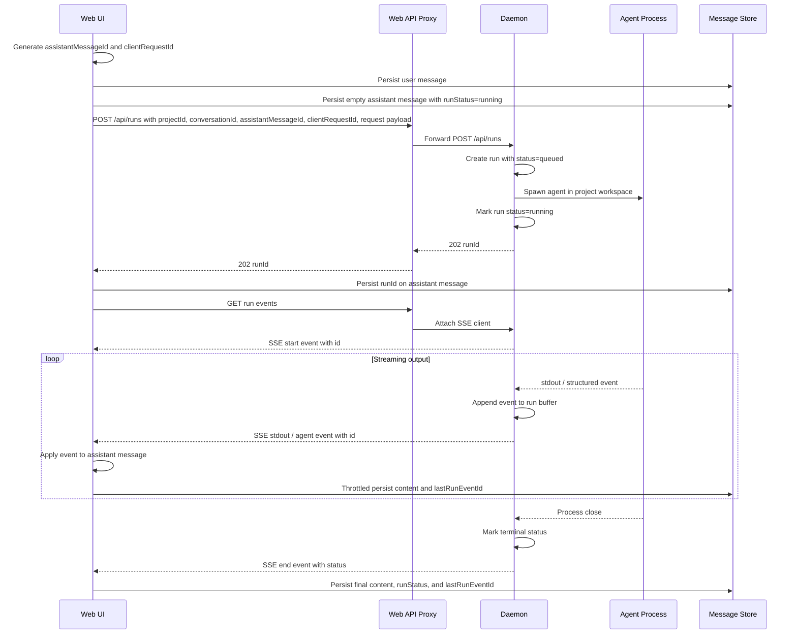
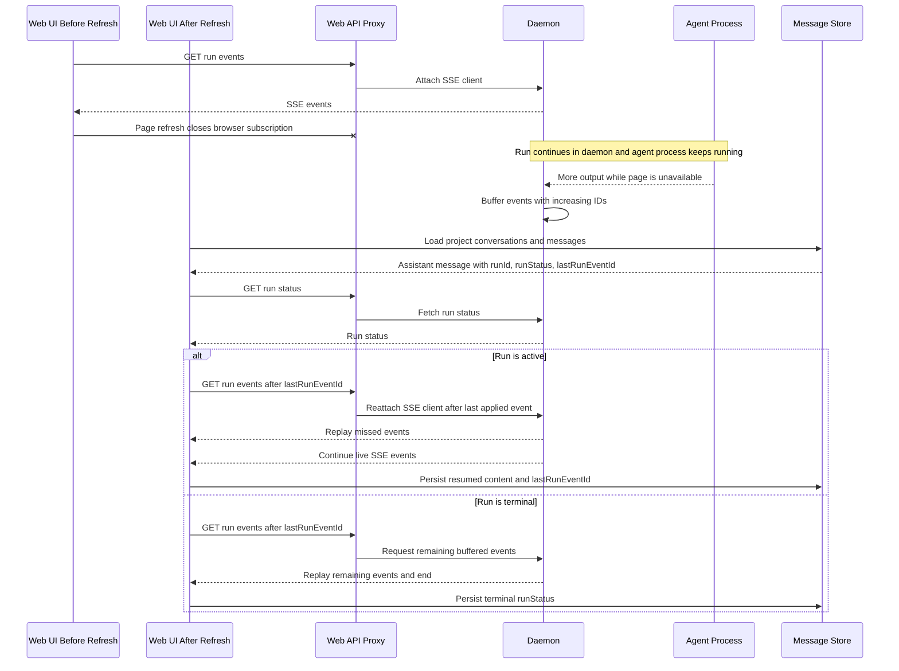
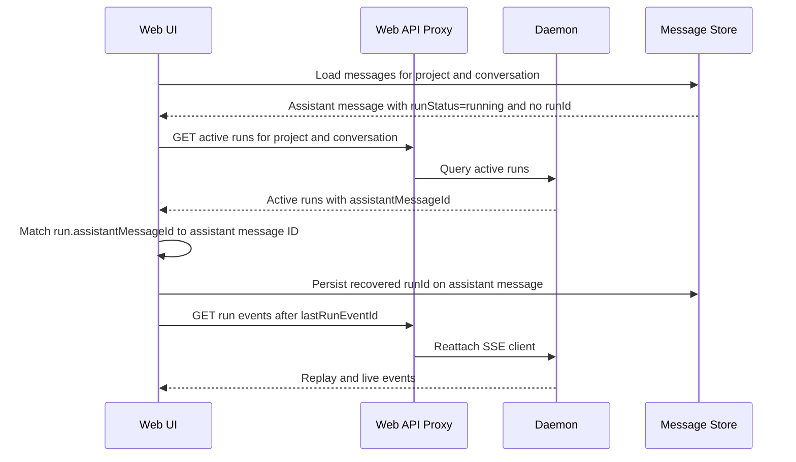
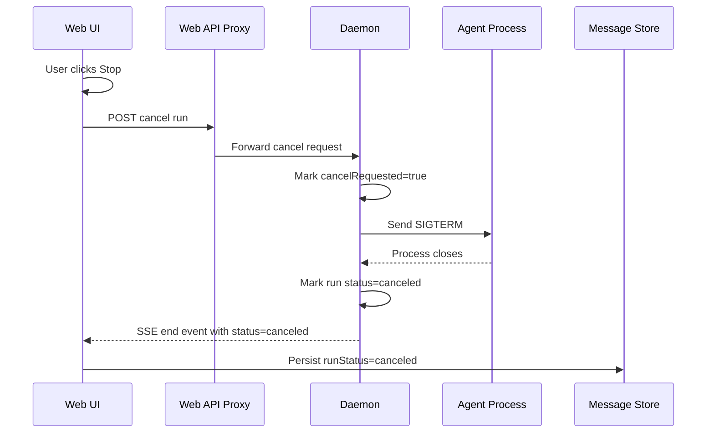

# Run Model and Recovery Flow

## Purpose

A run is one daemon-owned background execution instance for a user request. It lets the daemon keep an agent task alive across web page refreshes, tab closes, route changes, and temporary SSE disconnects.

The frontend owns presentation state. The daemon owns execution state. SSE owns live subscription and replay.

## Concept Model

A project is the top-level design workspace. It contains conversations, owns artifacts, and provides the daemon working directory for agent execution.

A conversation is a thread inside a project. It contains ordered messages and provides the UI context for multi-turn work.

A message is user-visible conversation content. A user message records the request. An assistant message records the generated response and can be backed by one run while generation is active or recoverable.

A run is a daemon-owned execution instance. It belongs to one project and one conversation, and it targets one assistant message. The run starts and supervises one agent process, records execution status, and stores replayable SSE events.

The intended cardinality is:

- One project contains many conversations.
- One conversation contains many messages.
- One project can have many runs.
- One conversation can have many runs.
- One assistant message can have zero or one run.
- One run belongs to one project, one conversation, and one assistant message.
- One run can start one agent process during active execution.

The recovery path follows the user-visible hierarchy: open a project, load a conversation, find assistant messages with active run metadata, then reattach to the daemon run.

## Concept Responsibilities

### Project

A project is the design workspace. It provides:

- project metadata, such as skill, design system, and fidelity;
- the daemon working directory, usually `.od/projects/<projectId>/`;
- artifact ownership;
- the top-level scope for conversations and runs.

### Conversation

A conversation is a thread inside a project. It provides:

- the ordered message history;
- the UI context for multi-turn work;
- the grouping key for active run recovery.

### Message

A message is user-visible conversation content. An assistant message is also the durable UI container for a run result. It should store:

- `runId`: the daemon execution backing this assistant response;
- `runStatus`: the latest known run state;
- `lastRunEventId`: the latest applied SSE event ID;
- partial generated content, persisted during streaming.

### Run

A run is a daemon-managed execution instance. It provides:

- agent process startup;
- execution status, such as `queued`, `running`, `succeeded`, `failed`, or `canceled`;
- replayable SSE events;
- reconnect support through `events?after=<lastRunEventId>`;
- explicit cancellation through the cancel endpoint.

Each run should carry `projectId`, `conversationId`, and `assistantMessageId`. These fields let the daemon recover active work for a reopened project page and let the frontend attach output to the correct assistant message.

## Primary Communication Flow



## Refresh and Reattach Flow



## Active Run Fallback Flow

The frontend should persist `runId` on the assistant message immediately after run creation. A small failure window still exists between daemon run creation and message update. The daemon should also support an active run list endpoint as a recovery fallback.



## Explicit Cancel Flow

Browser subscription lifetime and daemon run lifetime are separate. Refresh, tab close, and route changes close the local subscription only. The daemon receives a cancel request only when the user explicitly clicks Stop.



## API Surface

Recommended run APIs:

```http
POST /api/runs
GET  /api/runs/:id
GET  /api/runs/:id/events?after=<lastRunEventId>
GET  /api/runs?projectId=<projectId>&conversationId=<conversationId>&status=active
POST /api/runs/:id/cancel
```

`POST /api/runs` should accept correlation fields:

```ts
interface ChatRunCreateRequest {
  projectId: string;
  conversationId: string;
  assistantMessageId: string;
  clientRequestId: string;
  agentId: string;
  message: string;
  model?: string | null;
  reasoning?: string | null;
}
```

`GET /api/runs/:id` should return enough state for recovery:

```ts
interface ChatRunStatusResponse {
  id: string;
  projectId: string;
  conversationId: string;
  assistantMessageId: string;
  agentId: string;
  status: 'queued' | 'running' | 'succeeded' | 'failed' | 'canceled';
  createdAt: number;
  updatedAt: number;
  exitCode?: number | null;
  signal?: string | null;
}
```

## Persistence Phases

### Phase 1: Refresh and Tab Close Survival

- Keep daemon runs in memory.
- Persist `runId`, `runStatus`, `lastRunEventId`, and partial assistant content in the message store.
- Reattach after refresh while the daemon process is still alive.
- Keep terminal run metadata and event buffers long enough for short-term UI recovery.

### Phase 2: Daemon Restart Visibility

- Persist `chat_runs` and `chat_run_events` in daemon storage.
- Mark active runs as interrupted after daemon restart because the child process exits with the daemon.
- Preserve terminal status and buffered output for user-facing history.

## Implementation Rules

- A browser fetch abort should close only the local SSE subscription.
- The Stop button is the only UI action that should call `/api/runs/:id/cancel`.
- The frontend should persist `runId` immediately after `POST /api/runs` succeeds.
- The frontend should process SSE events idempotently using `lastRunEventId`.
- The daemon should allow multiple simultaneous SSE clients for one run.
- The daemon should expose active runs by project and conversation for fallback recovery.
