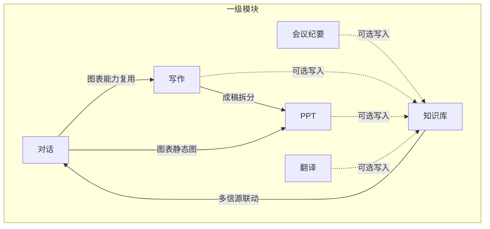

# 小窗产品需求整理

> 来源：小窗办公平台能力规划  
> 信息架构：按能力模块划分一级菜单，详见 [功能清单.md](./功能清单.md)  
> 技术选型：详见 [技术方案.md](./技术方案.md)  
> **MVP（v3.0，PRD）：** 仅深度交付 **对话** + **Electron 桌面壳**（包装同一 `web/`）+ Companion/CLI；纪要/知识库/写作/PPT/翻译 仅占位。  
> **交付形态：** 小窗平台（独立部署，不内嵌第三方客户端）；**推荐**桌面应用安装；纯浏览器为降级。  
> **账号：** 手机号 + 验证码，登录即注册；不与 外部业务系统账号打通（§6.12）。  
> **原型：** `web/`、`apps/desktop/`、`companion/`；见 `web/docs/chat-execution-roadmap.md`。

---

## 导航结构（一级 / 二级）

| 一级菜单 | 二级菜单 |
|----------|----------|
| **对话** | 新对话、历史会话；（页内）快速 / 深度 |
| **会议纪要** | 新建纪要、纪要历史 |
| **知识库** | 我的文档、知识库问答、多信源分析 |
| **写作** | 新建写作、政策解读、专题研究、行业研究、宏观数据解读、行业数据解读、我的文稿 |
| **PPT** | 新建 PPT、从文稿生成、路演模板、我的 PPT |
| **翻译** | 文档翻译、文本翻译、翻译历史 |

---

## 1. 对话

### 1.1 模式

| 模式 | 说明 |
|------|------|
| 快速 | 快速响应 |
| 深度 | 分步推理或完整研究流程，由 Agent 按问题复杂度自行决策；复杂任务可展示研究导图并导出摘要（PRD v3.2） |

### 1.2 数据获取

- 接入数据源

### 1.3 可交互图表生成

- 提供**表格**和**图表**两种视图
- **表格**：可编辑、可排序；一键环比；一键变频
- **图表**：图例可自定义
- **通用**：一键复制；快速导出数据或图片

### 1.4 多信源分析

- 根据内容权威度对资讯、公告、研报、数据等分别总结分析
- 提供总结，异同点分析并给出信源推荐

### 1.5 可溯源

- 关键结论、数据、引用可跳转原文或数据源详情

---

## 2. 会议纪要

- 音视频上传，多发言人文本转写
- 自动生成会议概要、要点大纲、QA 等环节内容
- 可选沉淀至知识库

---

## 3. 知识库

- 个人知识库管理
- 知识库问答
- 可链接对话中的多信源分析

---

## 4. 写作

### 4.1 文稿类型（模板）

- 政策解读、专题研究、行业研究、宏观数据解读、行业数据解读

### 4.2 生成流程（页内）

- **多步骤**：参数设置 → 明确写作方向 → 大纲及确认 → 撰写
- **快速**：大纲生成及确认（可跳过）→ 内容撰写

### 4.3 输出

- 展示数据图表（同对话模块）、文稿正文与导出（Word/PDF）

---

## 5. PPT

### 5.1 生成方式

- **新建 PPT**：输入主题、受众、页数建议，生成幻灯片大纲后成稿
- **从文稿生成**：选择写作模块「我的文稿」中的成稿，按章节映射为幻灯片页
- **路演模板**：使用行业研究、数据解读、政策汇报等预设版式

### 5.2 页内流程

- 主题与受众 → 大纲确认（可增删页、拖拽排序）→ 生成幻灯片 → 预览与导出

### 5.3 输出

- 在线分页预览；导出 **PPTX**（必选）、PDF（可选）
- 图表以静态图嵌入幻灯片（数据来源同对话/写作）
- 可选加入知识库（PDF 讲义）

---

## 6. 翻译

- 文档/文本翻译，支持对照模式
- 翻译历史可回看与导出

---

## 模块关系概览

---

## 7. 智能体运行时（平台横切）

> 详述见 [PRD-小窗.md](./PRD-小窗.md) §5.3、§6.10（**v1.8**）。

### 7.0 MVP 范围（v3.0）

| 纳入 MVP | 不纳入 MVP（V1.1+） |
|----------|---------------------|
| 对话两档模式、`parts[]`、侧栏状态、Turn 吸顶 | 数据源图表、多信源、可溯源 |
| **桌面壳**：Electron + `pickAndImportFolder` | 纪要、知识库、写作、PPT、翻译 业务 |
| Companion + 多 CLI / 多模型/API 接入 | 模式 A 云端完整、管理员增强项 |
| 文件夹导入（桌面选目录主路径；手填降级） | HMAC、托盘、自动更新 |

### 7.1 执行模式（已决 v1.8，MVP 以 B 为主）

| 模式 | 说明 |
|------|------|
| **B 本地协作（MVP 主路径）** | **桌面壳（推荐）** 或浏览器 → **本机 Companion** → 本机 CLI → 项目根（沙箱或 `local_bound`） |
| **A 云端降级** | 无 Companion 时：云端 `projectId` + OSS；**V1.1 必验**，MVP 不强制 |

### 7.1.1 项目与会话（已决 v1.9，详 PRD §5.3.2.1）

| 规则 | 说明 |
|------|------|
| 始终 `projectId` | 模式 B 未选课题 → **§5.3.2.1a 平台默认工作区**（XIAOCHUANG）；选文件夹 → **local_bound**；模式 A → **cloud**（OSS） |
| 会话固定绑定 | 创建**对话会话**时定死 `projectId`，**不可改** |
| 切换项目 | **新建对话会话**（非改绑当前会话）；分支会话**继承**原 `projectId` |

### 7.2 Agent CLI 适配集

| CLI | 说明 |
|-----|------|
| **Codex CLI** | 多文件工作区、写作、PPT |
| **Claude Code** | 深度分析、纪要结构化 |
| **Hermes CLI** | 与企业 Hermes 栈对齐；对话与工具扩展 |
| **其他已登记 CLI** | 纳入平台适配集的多 CLI / 多模型能力，按统一适配协议接入 |

- **企业扩展 CLI**：须企业管理员登记；**禁止**研究员在 Web 填写任意可执行路径。
- **交付**：**MVP** = **Electron 桌面壳**（加载 `web/`）+ Companion；系统选目录 → `import-folder`；无壳时 Web **手填路径** 降级（PRD §5.3.7）。

### 7.3 能力要点

- **Companion**：模式 B 新建对话默认沙箱；「进入项目工作」**文件夹导入** → **新建对话会话** + `local_bound`（绑定不复制，详见 [web/docs/folder-import-and-desktop-shell.md](./web/docs/folder-import-and-desktop-shell.md)）；`@` 当前 `projectId` 根内文件。
- **编排层**：模块注册表 → 流程 Skill（按模式/模板/任务类型）+ 横切规范 Skill；流式工具调用；写作/纪要/PPT 同样绑定 `projectId`（PRD §6.0.3、§6.10.1a）。
- **对话编排（v3.3）**：**hybrid-steer** — 仅 Push 基座 + `chat-catalog.json` 摘要；扩展 Skill/工具 Agent 自决（F-RT-008、[chat-core-architecture.md](./web/docs/chat-core-architecture.md)）。
- **分层**：一级菜单 = 产品模块 + 领域服务；翻译 MVP 走 API 主路径；知识库主路径为 CRUD/RAG，库内问答 V1.1 挂 `skill-kb-qa`。
- **统一执行主干**：CLI 与模型 API 仅入口不同，后续共用同一套会话编排、工作区、Skills 与 SSE 事件流；无 Companion 时仍可走模式 A 云端 `projectId` 子集（PRD §10.2）。
- **产出物**：模式 B 落本地项目；可选同步云端/知识库（V1.1）。
- **终端 UI**：F-RT-006，V1.1 完善。

---

## 8. 全局设置

> 详述见 PRD §4.4、§6.11。

### 8.1 入口

- **侧栏底部用户区**（头像 + 昵称/脱敏手机号）点击 → **弹出菜单** → 进入对应 **设置面板**（须已登录）。
- 不占对话/写作等六个业务一级菜单。

### 8.2 弹出菜单（研究员 MVP）

| 菜单项 | 说明 |
|--------|------|
| 智能体与模型 | Companion 连接状态；CLI 状态；默认 Agent（Codex/Claude/Hermes）；模型档位 |
| 账号与权限 | 只读：脱敏手机号、已开通模块、数据权限摘要 |
| 关于与帮助 | 版本、复制诊断信息、帮助反馈 |

**管理员额外：** 模型 API（BYOK）、功能与审计（V1.1）。

### 8.3 不宜放在设置里

写作/PPT/纪要的业务参数、安装 CLI、自定义 Agent 路径 → 见 PRD §4.4.3。

---

## 9. 账号与登录

> 详述见 PRD §6.12、§8.4、§9.5。

| 项 | MVP |
|----|-----|
| 形态 | 独立 Web；路由 `/login` |
| 方式 | 手机号 + 短信验证码 |
| 注册 | 登录即注册，无单独注册页 |
| 退出 | 弹出菜单「退出登录」→ `/login` |
| 不做 | 微信扫码；外部业务系统账号绑定/SSO |

---

## 待澄清项

- [ ] 写作与对话「深度」档报告导出物的边界（短文 vs 长文稿）
- [x] 对话模式：页内仅快速/深度两档，不占侧栏二级 — PRD v3.2 F-QA-001
- [ ] 各模块「加入知识库」的统一交互与默认节选范围
- [ ] PPT 模板与 企业品牌视觉规范的对齐方式
- [x] 执行模式：模式 B 主路径 — 见 PRD v1.8
- [x] **MVP v3.0**：对话 + 桌面壳；全模块 V1.1 — 见 PRD v3.0
- [x] 桌面壳纳入 MVP — 见 PRD §5.3.7、OQ-21 已决
- [x] 项目模型：始终 projectId；sandbox / local_bound / cloud；会话固定绑定、切换=新建会话 — 见 PRD v1.9.1
- [x] 多 CLI / 多模型适配为 MVP 核心能力；企业扩展仍须登记 — 见 PRD
- [x] 全局设置入口：侧栏用户区弹出菜单 — 见 PRD v1.6 §4.4、§6.11
- [x] 独立 Web + 手机号验证码登录（不与外部业务系统账号打通）— 见 PRD v1.7 §6.12
- [x] 模块 / Skill 分层：一级菜单≠Skill；流程 Skill + 模板资产 + 横切规范 — 见 PRD v2.0 §6.10.1a、F-RT-003
- [x] 对话混合编排：轻 Push + Agent Pull，不强制每轮 Router — PRD v3.3 F-RT-008
- [ ] 平台登记 CLI 适配集的默认推荐顺序与企业镜像版本矩阵（OQ-08、OQ-09）
- [ ] 短信服务商、图形验证码与租户默认策略
- [ ] Hermes CLI 与 `hermes-agent` 版本对应（OQ-11）
